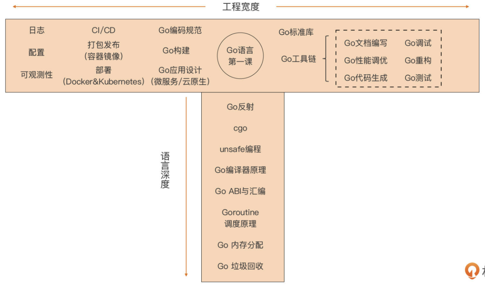
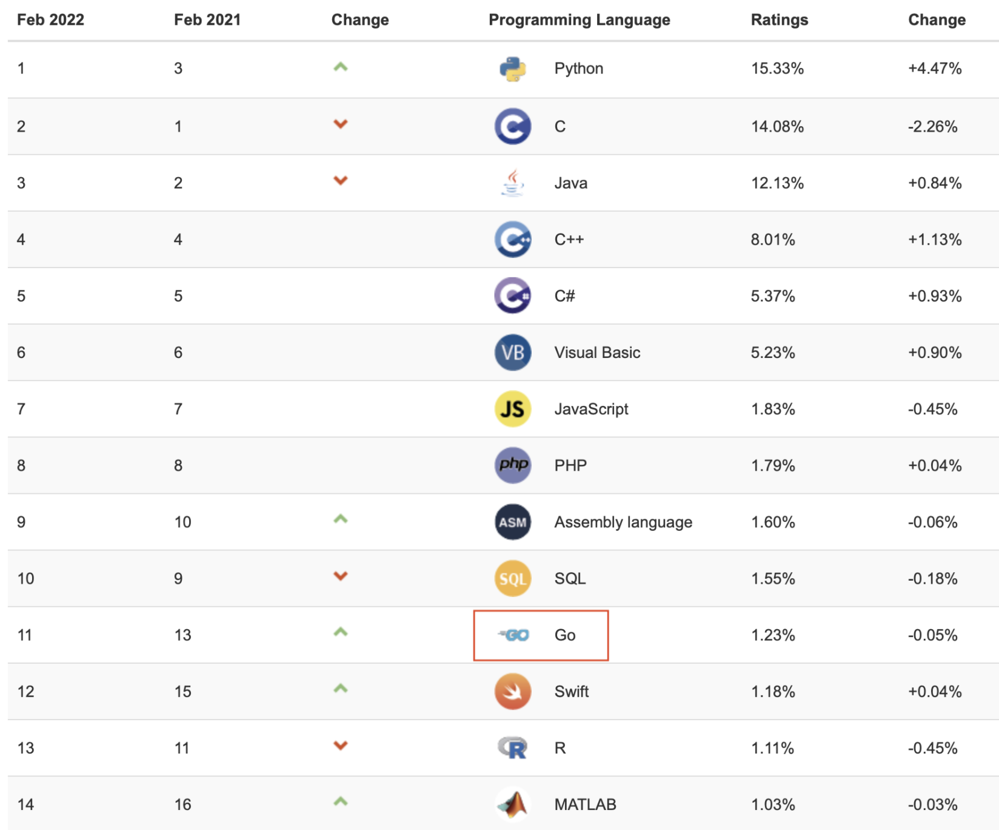

# Go Advanced

## Go 语言进阶

借用“T 字形”发展模式，按语言深度与工程宽度两个方向，在一幅图中列出 Go 进阶需要了解的知识与技能点：

沿着“语言深度”这条线可以看到，在纯语言层面的进阶，要学习和理解的知识点还有很多，包括反射（reflect）、cgo（与 C 语言交互的手段）、 unsafe 编程等高级语法点，还有迈向 Go 高级程序员必要的 Go 编译器原理、Go 汇编、 Goroutine 调度、Go 内存分配以及 GC 等的实现细节。 

当掌握这些之后，就会有一种打通“任督二脉”的感觉，再难的 Go 语言问题也会变得简单透明。更重要的是，这会拥有一种判断力，可以判断在什么场合不应该使用 Go 语言。

《Kubernetes Up＆Running》一书的作者、Google 开发人员凯尔西· 海托（Kelsey Hightower）曾说过：“如果不知道什么时候不应该使用一种工具，那就还没有掌握这种工具”。拥有这种判断力，也代表真正掌握了 Go 语言。 

当然，Go 语言的进阶同样也离不开工程层面的知识与技能的学习。

在上面图中，将工程宽度分成两大块，一块是 Go 标准库与 Go 工具链，另外一块是语言之外的工程技能。这些知识与技能都是在 Go 进阶以及 Go 实践之路上不可或缺的。

## 如何学

“手勤 + 脑勤”同样适合 Go 进阶的学习，多实践多思考是学习编程语言的不二法门。 

此外，在进阶学习的过程中，推荐一种学习方法，同时这也是本人使用的方 法，那就是“输出”。

费曼学习法是由诺贝尔物理学奖得主理查德·菲利普斯·费曼贡献给全世界的学习技巧。

这个 学习法中的一个环节就是以教促学，也就是学完一个知识点后，用自己的理解将这个知 识点讲给其它人，在这个过程中，既可以检验自己对这个知识点的掌握程度，而且也可 通过他人的反馈确认自己对这个知识点的理解是否正确。

而这个学习技巧的本质就是“输 出”。 在如今移动互联网的时代，“输出”拥有了更多样的形式，比如：

- 学习笔记 / 博客 / 公众号 / 问答 / 视频直播 / 音频播客 / 社群； 
- 开源 / 内源项目；
- 内部培训 / 外部技术大会； 
- 译书 / 著书。

所有的这些形式都要遵循一个共同点：公开，也就是将“输出”公之于众，接受所有 人的检验与评判。

这个过程一旦正常运转起来，可以快速修正理解上的错误，加深理解，加快学习，并会敦促主动优化后续的输出。形成了良性循环之后，再高深的知识点也就不是什么问题了。

不过古人云：“知易行难”，学会“输出”也需要一个循序渐进的过程。尤其是一开 始“输出”时，不要怕错，不要怕没人看，更不要怕别人笑话。

## Go 语言的未来

著名编程语言排名指数TIOBE发布了 2022 年 2 月编程语 言排名情况，如下图：

在这期排名中，Go 上升到第 11 位，相较于 2021 年年底各大编程语言的最终排名，以及 2021 年 2 月份的排名都上升了 2 位。

TIOBE 在 1 月份发布的 2021 年年终编程语言排行榜的配文中也认为，除了 Swift 和 Go 之外，尚不会有新的编程语言能迅速进入前 3 名甚至前 5 名，这也在一定程度上证明了 TIOBE 对 Go 发展趋势的看好。 

再老生常谈一下，纵观近十年来的新兴后端编程语言，Go 集齐了成为下一代佼佼者需要的所有要素：名家设计（三巨头）、出身豪门（谷歌）、杀手应用（Kubernetes）、精英团 队（Google 专职开发团队）、百万拥趸、生产力与性能的最佳结合，以及云原生基础设施的头部语言。 

在 2021 年，为了加强 Go 社区建设与 Go 官网改进，Go 团队雇佣了专人负责。Go 核心开发团队专职人员的数量逐年增多，根据Go 核心团队工程总监萨梅尔 - 阿马尼 (SAMEER AJMANI) 在之前 Go Time 的 AMA 环节中透露的信息，当前 Go 核心团队的规 模已经达到了 50 人。

而且，Go 语言在国内的发展也是越来越好。

- 大厂方面，腾讯公司近几年在 Go 语言方面投入很大，不仅让 Go 语言成为其公司内部增速最快的语言，腾讯还在 2021 年发布和开源了多款基于 Go 开发的重量级产品。 
- 字节跳动更是国内大厂中拥抱 Go 语言最积极的公司之一，它的技术体系就是以 Go 语言为主，公司里有超过 55％的服务都是采用 Go 语言开发的。长期的 Go 实践让字节跳动内部积累了丰富的 Go 产品和经验，2021 年字节也开启了对外开源之路，并且一次性放出了若干个基于 Go 的微服务框架与中间件产品，包括 kitex、netpoll、thriftgo 等。这些开源项目统一放在 https://github.com/cloudwego下面了。 
- 除了大厂积极拥抱 Go 之外，小公司与初创公司也在积极探索 Go 的落地。根据从圈子里、周边朋友、面试时了解的情况，用 Go 的小公司 / 初创公司越来越多了。究其原因还是那句话：Go 语言是生产力与战斗力的最佳结合。这对小公司 / 初创公司而言，就是真 （省）金（人）白（省）银（机器）啊。 
- 甚至，Go 已经渗透到新冠防疫领域，前不久得知，河北移动支撑的新冠疫情流调系统的后端服务也是用 Go 实现的。

2022 年，Go 语言的最大事件就是 3 月份 Go 1.18 的发布以及 Go 泛型的落地。泛型的加入势必会给 Go 社区带来巨大影响。

随之而来的将是位于各个层次的 Go 包的重写或重构：底层库、中间件、数据结构 / 算法库，乃至业务层面。

这一轮之后，Go 社区将诞生有关于 Go 泛型编码的最佳实践，这些实践也会反过来为 Go 核心团队提供 Go 泛型演化与 在标准库中应用的素材。 

绝大多数主流编程语言将在其诞生后的第 15 至第 20 年间大步前进。按照这个编程语言的一般规律，已经迈过开源第 12 个年头的 Go，很可能将进入自己的黄金 5-10 年。

而 2022 年就很大可能会成为 Go 语言黄金 5-10 年的起点，并且这个标志只能是 Go 泛型语法的落地。 

按照 Go 语言的调性，在加入泛型后，Go 在语法层面上很难再有大的改变了，错误处理将是最后一个硬骨头，也许在泛型引入后，Go 核心团队能有新的解决思路。

剩下的就是对Go 编译器、运行时层、标准库以及工具链的不断打磨与优化了。到时候，就坐收这些优化所带来的红利就可以了。

