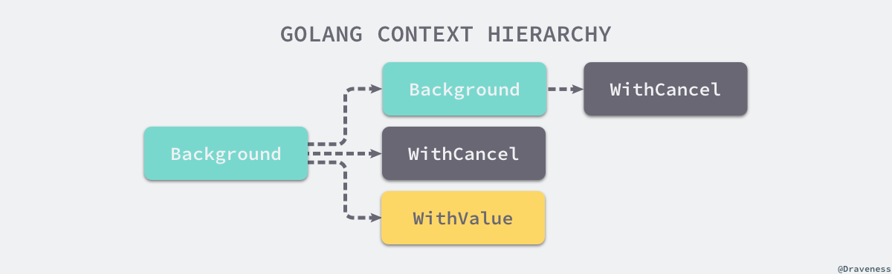
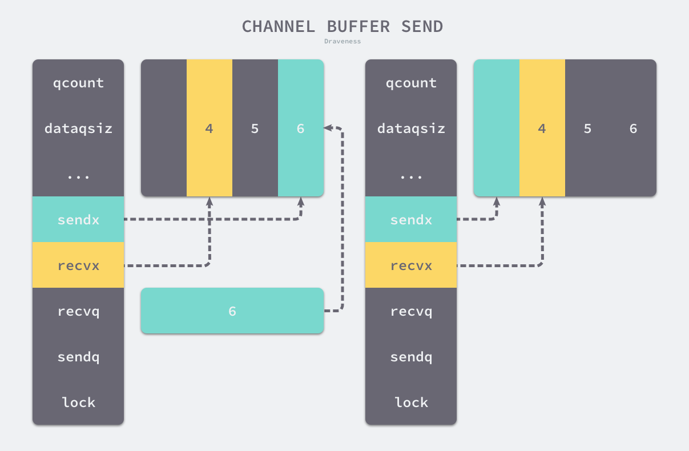
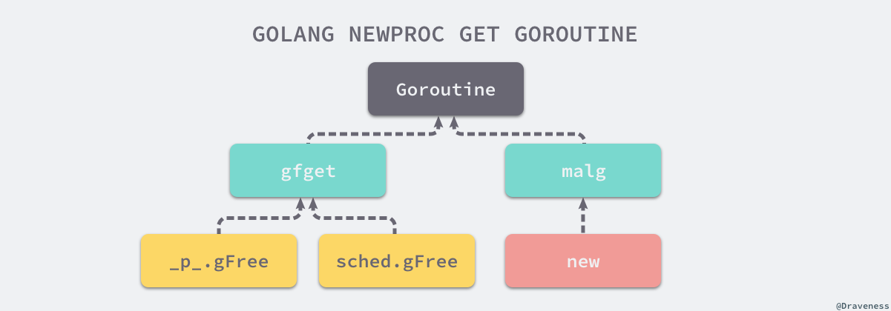
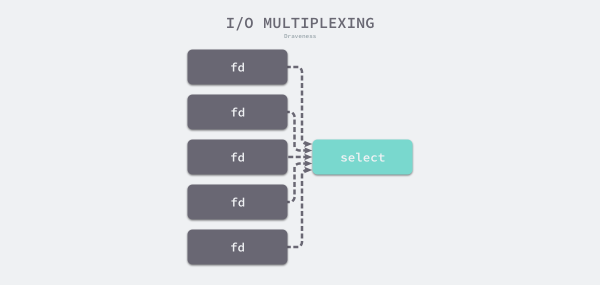
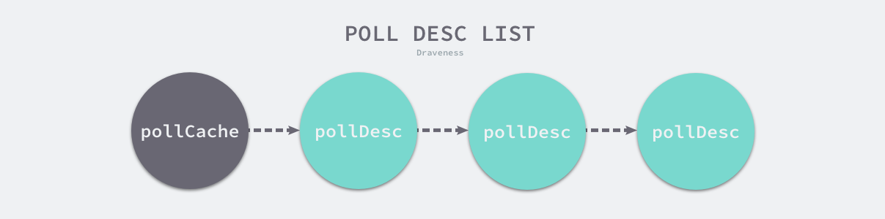
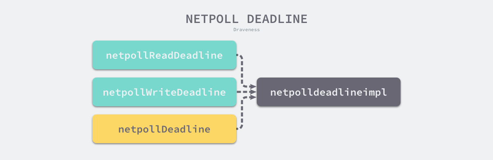

# Go Concurrent

> Go 并发编程

## 上下文 Context

上下文 `context.Context` 是Go 语言中用来设置截止日期、同步信号，传递请求相关值的结构体。

上下文与 Goroutine 有比较密切的关系，是 Go 语言中独特的设计，在其他编程语言中很少见到类似的概念。

`context.Context` 是 Go 语言在 1.7 版本中引入标准库的接口，该接口定义了四个需要实现的方法，其中包括：

1. `Deadline` — 返回 `context.Context` 被取消的时间，也就是完成工作的截止日期；
2. `Done` — 返回一个 Channel，这个 Channel 会在当前工作完成或者上下文被取消后关闭，多次调用 `Done` 方法会返回同一个 Channel；
3. Err— 返回`context.Context`结束的原因，它只会在Done 方法对应的 Channel 关闭时返回非空的值；
   1. 如果 `context.Context` 被取消，会返回 `Canceled` 错误；
   2. 如果 `context.Context` 超时，会返回 `DeadlineExceeded` 错误；
4. `Value` — 从 `context.Context` 中获取键对应的值，对于同一个上下文来说，多次调用 `Value` 并传入相同的 `Key` 会返回相同的结果，该方法可以用来传递请求特定的数据；

```go
// github.com/golang/go/src/context/context.go
type Context interface {
	Deadline() (deadline time.Time, ok bool)// Deadline returns the time when work done on behalf of this context should be canceled.
	Done() <-chan struct{} // Done returns a channel that's closed when work done on behalf of this context should be canceled.
  // If Done is not yet closed, Err returns nil.
	// If Done is closed, Err returns a non-nil error explaining why:
	// Canceled if the context was canceled
	// or DeadlineExceeded if the context's deadline passed.
	Err() error
  // Value returns the value associated with this context for key, or nil
	// if no value is associated with key. Successive calls to Value with
	// the same key returns the same result.
	Value(key interface{}) interface{}
}
```

`context` 包中提供的 `context.Background`、`context.TODO`、`context.WithDeadline` 和 `context.WithValue` 函数会返回实现该接口的私有结构体。

### 设计原理

在 Goroutine 构成的树形结构中对信号进行同步以减少计算资源的浪费是 `context.Context` 的最大作用。

Go 服务的每一个请求都是通过单独的 Goroutine 处理的，HTTP/RPC 请求的处理器会启动新的 Goroutine 访问数据库和其他服务。

如下图所示，可能会创建多个 Goroutine 来处理一次请求，而 `context.Context` 的作用是**在不同 Goroutine 之间**同步请求特定数据、取消信号以及处理请求的截止日期。


**Context 与 Goroutine 树**

每一个 `context.Context` 都会从最顶层的 Goroutine 一层一层传递到最下层。`context.Context` 可以在上层 Goroutine 执行出现错误时，将信号及时同步给下层。


**不使用 Context 同步信号**

如上图所示，当最上层的 Goroutine 因为某些原因执行失败时，下层的 Goroutine 由于没有接收到这个信号所以会继续工作；但是当正确地使用 `context.Context` 时，就可以在下层及时停掉无用的工作以减少额外资源的消耗：


**使用 Context 同步信号**

可以通过一个代码片段了解 `context.Context` 是如何**对信号进行同步**的。在这段代码中，创建了一个过期时间为 1s 的上下文，并向上下文传入 `handle` 函数，该方法会使用 500ms 的时间处理传入的请求：

```go
func main() {
	ctx, cancel := context.WithTimeout(context.Background(), 1*time.Second)
	defer cancel()

	go handle(ctx, 500*time.Millisecond)
	select {
	case <-ctx.Done():
		fmt.Println("main", ctx.Err())
	}
}

func handle(ctx context.Context, duration time.Duration) {
	select {
	case <-ctx.Done():
		fmt.Println("handle", ctx.Err())
	case <-time.After(duration):
		fmt.Println("process request with", duration)
	}
}
```

因为**过期时间大于处理时间**，所以有足够的时间处理该请求，运行上述代码会打印出下面的内容：

```go
$ go run context.go
process request with 500ms
main context deadline exceeded
```

`handle` 函数没有进入超时的 `select` 分支，但是 `main` 函数的 `select` 却会等待 `context.Context` 超时并打印出 `main context deadline exceeded`。

如果将处理请求时间增加至 1500ms，整个程序都会因为上下文的过期而被中止，：

```go
$ go run context.go
main context deadline exceeded
handle context deadline exceeded
```

相信这两个例子能够理解 `context.Context` 的使用方法和设计原理 — 多个 Goroutine 同时订阅 `ctx.Done()` 管道中的消息，一旦接收到取消信号就立刻停止当前正在执行的工作。

### 默认上下文

`context` 包中最常用的方法还是 `context.Background`、`context.TODO`，这两个方法都会返回预先初始化好的私有变量 `background` 和 `todo`，它们会**在同一个 Go 程序中被复用**：

```go
// github.com/golang/go/src/context/context.go
var (
	background = new(emptyCtx)
	todo       = new(emptyCtx)
)

func Background() Context {
	return background
}

func TODO() Context {
	return todo
}
```

这两个私有变量都是通过 `new(emptyCtx)` 语句初始化的，它们是指向私有结构体 `context.emptyCtx` 的指针，这是最简单、最常用的上下文类型：

```go
// github.com/golang/go/src/context/context.go
// An emptyCtx is never canceled, has no values, and has no deadline. It is not
// struct{}, since vars of this type must have distinct addresses.
type emptyCtx int

func (*emptyCtx) Deadline() (deadline time.Time, ok bool) {
	return
}

func (*emptyCtx) Done() <-chan struct{} {
	return nil
}

func (*emptyCtx) Err() error {
	return nil
}

func (*emptyCtx) Value(key interface{}) interface{} {
	return nil
}
```

从上述代码中，不难发现 `context.emptyCtx` 通过空方法实现了 `context.Context` 接口中的所有方法，它没有任何功能。



**Context 层级关系**

从源代码来看，`context.Background` 和 `context.TODO` 也只是互为别名，没有太大的差别，只是在使用和语义上稍有不同：

- `context.Background` 是**上下文的默认值**，**所有其他的上下文都应该从它衍生出来**；
- `context.TODO` 应该**仅在不确定应该使用哪种上下文时使用**；

在多数情况下，如果当前函数没有上下文作为入参，都会使用 `context.Background` 作为起始的上下文向下传递。

### 取消信号

#### context.WithCancel

`context.WithCancel` 函数能够从 `context.Context` 中衍生出一个新的子上下文并返回用于取消该上下文的函数。

一旦执行返回的取消函数，**当前上下文以及它的子上下文都会被取消**，所有的 Goroutine 都会同步收到这一取消信号。


**Context 子树的取消**

直接从 `context.WithCancel` 函数的实现来看它到底做了什么：

```go
// github.com/golang/go/src/context/context.go
func WithCancel(parent Context) (ctx Context, cancel CancelFunc) {
	c := newCancelCtx(parent)
	propagateCancel(parent, &c)
	return &c, func() { c.cancel(true, Canceled) }
}

// newCancelCtx returns an initialized cancelCtx.
func newCancelCtx(parent Context) cancelCtx {
	return cancelCtx{Context: parent}
}
```

- `context.newCancelCtx` 将传入的上下文包装成私有结构体 `context.cancelCtx`；
- `context.propagateCancel` 会构建父子上下文之间的关联，当父上下文被取消时，子上下文也会被取消：

```go
// github.com/golang/go/src/context/context.go
// propagateCancel arranges for child to be canceled when parent is.
func propagateCancel(parent Context, child canceler) {
	done := parent.Done()
	if done == nil {
    // parent is never canceled
		return // 父上下文不会触发取消信号
	}
	select {
	case <-done:
    // parent is already canceled
		child.cancel(false, parent.Err()) // 父上下文已经被取消
		return
	default:
	}

	if p, ok := parentCancelCtx(parent); ok {
		p.mu.Lock()
		if p.err != nil {
			child.cancel(false, p.err)
		} else {
			p.children[child] = struct{}{} // child 加入 parent 的 children 列表
		}
		p.mu.Unlock()
	} else {  // 开发者自定义的父上下文
		go func() {
			select {
			case <-parent.Done():
				child.cancel(false, parent.Err())
			case <-child.Done():
			}
		}()
	}
}
```

上述函数总共与父上下文相关的三种不同的情况：

1. 当 `parent.Done() == nil`，也就是 `parent` 不会触发取消事件时，当前函数会直接返回；

2. 当 child 的继承链包含可以取消的上下文时，会判断 parent 是否已经触发了取消信号；

   - 如果已经被取消，`child` 会立刻被取消；
   - 如果没有被取消，`child` 会被加入 `parent` 的 `children` 列表中，等待 `parent` 释放取消信号；

3. 当父上下文是开发者自定义的类型、实现了`context.Context` 接口并在Done() 方法中返回了非空的管道时；

   1. 运行一个新的 Goroutine 同时监听 `parent.Done()` 和 `child.Done()` 两个 Channel；
   2. 在 `parent.Done()` 关闭时调用 `child.cancel` 取消子上下文；

`context.propagateCancel` 的作用是在 `parent` 和 `child` 之间同步取消和结束的信号，保证在 `parent` 被取消时，`child` 也会收到对应的信号，不会出现状态不一致的情况。

`context.cancelCtx` 实现的几个接口方法也没有太多值得分析的地方，该结构体最重要的方法是 `context.cancelCtx.cancel`，该方法会关闭上下文中的 Channel 并向所有的子上下文同步取消信号：

```go
// github.com/golang/go/src/context/context.go
// cancel closes c.done, cancels each of c's children, and, if
// removeFromParent is true, removes c from its parent's children.
func (c *cancelCtx) cancel(removeFromParent bool, err error) {
	c.mu.Lock()
	if c.err != nil {
		c.mu.Unlock()
		return
	}
	c.err = err
	if c.done == nil {
		c.done = closedchan
	} else {
		close(c.done)
	}
	for child := range c.children {
		child.cancel(false, err)
	}
	c.children = nil
	c.mu.Unlock()

	if removeFromParent {
		removeChild(c.Context, c)
	}
}
```

#### context.WithDeadline 和 context.WithTimeout

除了 `context.WithCancel` 之外，`context` 包中的另外两个函数 `context.WithDeadline` 和 `context.WithTimeout` 也都能创建可以被取消的计时器上下文 `context.timerCtx`：

```go
// github.com/golang/go/src/context/context.go
func WithTimeout(parent Context, timeout time.Duration) (Context, CancelFunc) {
	return WithDeadline(parent, time.Now().Add(timeout))
}

func WithDeadline(parent Context, d time.Time) (Context, CancelFunc) {
	if cur, ok := parent.Deadline(); ok && cur.Before(d) {
    // The current deadline is already sooner than the new one.
		return WithCancel(parent)
	}
	c := &timerCtx{
		cancelCtx: newCancelCtx(parent),
		deadline:  d,
	}
	propagateCancel(parent, c)
	dur := time.Until(d)
	if dur <= 0 {
		c.cancel(true, DeadlineExceeded) // 已经过了截止日期
		return c, func() { c.cancel(false, Canceled) }
	}
	c.mu.Lock()
	defer c.mu.Unlock()
	if c.err == nil {
		c.timer = time.AfterFunc(dur, func() {  // 创建定时器
			c.cancel(true, DeadlineExceeded)
		})
	}
	return c, func() { c.cancel(true, Canceled) }
}
```

`context.WithDeadline` 在创建 `context.timerCtx` 的过程中判断了父上下文的截止日期与当前日期，并通过 `time.AfterFunc` 创建定时器，当时间超过了截止日期后会调用 `context.timerCtx.cancel` 同步取消信号。

`context.timerCtx` 内部不仅通过嵌入 `context.cancelCtx` 结构体继承了相关的变量和方法，还通过持有的定时器 `timer` 和截止时间 `deadline` 实现了定时取消的功能：

```go
// github.com/golang/go/src/context/context.go
type timerCtx struct {
	cancelCtx
	timer *time.Timer // Under cancelCtx.mu.

	deadline time.Time
}

func (c *timerCtx) Deadline() (deadline time.Time, ok bool) {
	return c.deadline, true
}

func (c *timerCtx) cancel(removeFromParent bool, err error) {
	c.cancelCtx.cancel(false, err)
	if removeFromParent {
		removeChild(c.cancelCtx.Context, c)
	}
	c.mu.Lock()
	if c.timer != nil {
		c.timer.Stop()
		c.timer = nil
	}
	c.mu.Unlock()
}
```

`context.timerCtx.cancel` 方法不仅调用了 `context.cancelCtx.cancel`，还会停止持有的定时器减少不必要的资源浪费。

### 传值方法

在最后需要了解如何使用上下文传值，`context` 包中的 `context.WithValue` 能从父上下文中创建一个子上下文，传值的子上下文使用 `context.valueCtx` 类型：

```go
// github.com/golang/go/src/context/context.go
func WithValue(parent Context, key, val interface{}) Context {
	if key == nil {
		panic("nil key")
	}
	if !reflectlite.TypeOf(key).Comparable() {
		panic("key is not comparable")
	}
	return &valueCtx{parent, key, val}
}
```

`context.valueCtx` 结构体会将除了 `Value` 之外的 `Err`、`Deadline` 等方法代理到父上下文中，它只会响应 `context.valueCtx.Value` 方法，该方法的实现也很简单：

```go
// github.com/golang/go/src/context/context.go
type valueCtx struct {
	Context
	key, val interface{}
}

func (c *valueCtx) Value(key interface{}) interface{} {
	if c.key == key {
		return c.val
	}
	return c.Context.Value(key)
}
```

如果 `context.valueCtx` 中存储的键值对与 `context.valueCtx.Value` 方法中传入的参数不匹配，就会从父上下文中查找该键对应的值，直到某个父上下文中返回 `nil` 或者查找到对应的值。

### 小结

Go 语言中的 `context.Context` 的主要作用还是在多个 Goroutine 组成的树中同步取消信号以减少对资源的消耗和占用，虽然它也有传值的功能，但是这个功能还是很少用到。

在真正使用传值的功能时也应该非常谨慎，使用 `context.Context` 传递请求的所有参数是一种非常差的设计，比较常见的使用场景是传递请求对应用户的认证令牌以及用于进行分布式追踪的请求 ID。

### 参考

- [Package context · Golang](https://golang.org/pkg/context/)
- [Go Concurrency Patterns: Context](https://blog.golang.org/context)
- [Using context cancellation in Go](https://www.sohamkamani.com/blog/golang/2018-06-17-golang-using-context-cancellation/)
- proposal: context: new package for standard library #14660 https://github.com/golang/go/issues/14660 


## 同步原语与锁

Go 语言作为一个原生支持用户态进程（Goroutine）的语言，当提到并发编程、多线程编程时，往往都离不开锁这一概念。

**锁**是一种并发编程中的同步原语（Synchronization Primitives），它能保证多个 Goroutine 在访问同一片内存时不会出现竞争条件（Race condition）等问题。

Go 语言中常见的同步原语 `sync.Mutex`、`sync.RWMutex`、`sync.WaitGroup`、`sync.Once` 和 `sync.Cond` 以及扩展原语 `golang/sync/errgroup.Group`、`golang/sync/semaphore.Weighted` 和 `golang/sync/singleflight.Group` 的实现原理，同时也会涉及互斥锁、信号量等并发编程中的常见概念。

## 基本原语

Go 语言在 `sync` 包中提供了用于同步的一些基本原语，包括常见的 `sync.Mutex`、`sync.RWMutex`、`sync.WaitGroup`、`sync.Once` 和 `sync.Cond`：


**基本同步原语**

这些基本原语提供了较为基础的同步功能，但是它们是一种**相对原始的同步机制**，在多数情况下，都应该使用抽象层级更高的 Channel 实现同步。

### Mutex

Go 语言的 `sync.Mutex` 由两个字段 `state` 和 `sema` 组成。其中 `state` 表示当前互斥锁的状态，而 `sema` 是用于控制锁状态的信号量。

```go
// github.com/golang/go/src/sync/mutex.go
type Mutex struct {
	state int32
	sema  uint32
}
```

上述两个字段加起来只**占 8 字节空间**的结构体表示了 Go 语言中的互斥锁。

#### 状态

互斥锁的状态比较复杂，如下图所示，最低三位分别表示 `mutexLocked`、`mutexWoken` 和 `mutexStarving`，剩下的位置用来表示当前有多少个 Goroutine 在等待互斥锁的释放：


**互斥锁的状态**

在默认情况下，互斥锁的所有状态位都是 0，`int32` 中的不同位分别表示了不同的状态：

- `mutexLocked` — 表示互斥锁的锁定状态；
- `mutexWoken` — 表示从正常模式被唤醒；
- `mutexStarving` — 当前的互斥锁进入饥饿状态；
- `waitersCount` — 当前互斥锁上等待的 Goroutine 个数；

```go
// github.com/golang/go/src/sync/mutex.go
const (
   mutexLocked = 1 << iota // mutex is locked
   mutexWoken
   mutexStarving
   mutexWaiterShift = iota
   starvationThresholdNs = 1e6
)
```

#### 正常模式和饥饿模式

`sync.Mutex` 有两种模式 — 正常模式和饥饿模式。需要在这里先了解正常模式和饥饿模式都是什么以及它们有什么样的关系。

在正常模式下，锁的等待者会按照**先进先出的顺序获取锁**。

但是刚被唤起的 Goroutine 与新创建的 Goroutine 竞争时，大概率会获取不到锁，为了减少这种情况的出现，**一旦 Goroutine 超过 1ms 没有获取到锁**，它就会将当前互斥锁切换饥饿模式，防止部分 Goroutine 被『饿死』。


**互斥锁的正常模式与饥饿模式**

饥饿模式是 Go 语言在 1.9 版本中通过提交 [sync: make Mutex more fair](https://github.com/golang/go/commit/0556e26273f704db73df9e7c4c3d2e8434dec7be) 引入的优化，引入的目的是**保证互斥锁的公平性**。

在饥饿模式中，互斥锁会直接交给等待队列最前面的 Goroutine。新的 Goroutine 在该状态下不能获取锁、也不会进入自旋状态，它们只会在队列的末尾等待。

如果一个 Goroutine 获得了互斥锁并且它在队列的末尾或者它等待的时间少于 1ms，那么当前的互斥锁就会**切换回正常模式**。

与饥饿模式相比，正常模式下的互斥锁能够提供更好地性能，饥饿模式能避免 Goroutine 由于陷入等待无法获取锁而造成的高尾延时。

#### 加锁

互斥锁的加锁和解锁过程，它们分别使用 `sync.Mutex.Lock` 和 `sync.Mutex.Unlock`方法。

互斥锁的加锁是靠 `sync.Mutex.Lock` 完成的，最新的 Go 语言源代码中已经将 `sync.Mutex.Lock` 方法进行了简化，方法的主干只保留最常见、简单的情况 — 当锁的状态是 0 时，将 `mutexLocked` 的位 置为 1：

```go
// github.com/golang/go/src/sync/mutex.go
func (m *Mutex) Lock() {
  // Fast path: grab unlocked mutex.
	if atomic.CompareAndSwapInt32(&m.state, 0, mutexLocked) {
		return
	}
  // Slow path (outlined so that the fast path can be inlined)
	m.lockSlow()
}
```

如果互斥锁的状态不是 0 时就会调用 `sync.Mutex.lockSlow` 尝试通过自旋（Spinnig）等方式等待锁的释放，该方法的主体是一个非常大 for 循环，这里将它分成几个部分介绍获取锁的过程：

1. 判断当前 Goroutine 能否进入自旋；
2. 通过自旋等待互斥锁的释放；
3. 计算互斥锁的最新状态；
4. 更新互斥锁的状态并获取锁；

先来介绍互斥锁是如何**判断当前 Goroutine 能否进入自旋**等互斥锁的释放：

```go
// github.com/golang/go/src/sync/mutex.go
func (m *Mutex) lockSlow() {
	var waitStartTime int64
	starving := false
	awoke := false
	iter := 0
	old := m.state
	for {
		if old&(mutexLocked|mutexStarving) == mutexLocked && runtime_canSpin(iter) {
			if !awoke && old&mutexWoken == 0 && old>>mutexWaiterShift != 0 &&
				atomic.CompareAndSwapInt32(&m.state, old, old|mutexWoken) {
				awoke = true
			}
			runtime_doSpin()
			iter++
			old = m.state
			continue
		}
```

**自旋**是一种多线程同步机制，当前的进程在进入自旋的过程中会一直保持 CPU 的占用，持续检查某个条件是否为真。在多核的 CPU 上，自旋可以避免 Goroutine 的切换，使用恰当会对性能带来很大的增益，但是使用的不恰当就会拖慢整个程序，所以 **Goroutine 进入自旋的条件**非常苛刻：

1. 互斥锁只有在普通模式才能进入自旋；
2. `runtime.sync_runtime_canSpin` 需要返回true ：
   1. 运行在多 CPU 的机器上；
   2. 当前 Goroutine 为了获取该锁进入自旋的次数小于四次；
   3. 当前机器上至少存在一个正在运行的处理器 P 并且处理的运行队列为空；

一旦当前 Goroutine 能够进入自旋就会调用`runtime.sync_runtime_doSpin` 和 `runtime.procyield` 并执行 30 次的 `PAUSE` 指令，该指令只会占用 CPU 并消耗 CPU 时间：

```go
// github.com/golang/go/src/runtime/proc.go
func sync_runtime_doSpin() {
	procyield(active_spin_cnt)
}

// github.com/golang/go/src/runtime/lock_sema.go
const (
	locked uintptr = 1

	active_spin     = 4
	active_spin_cnt = 30  // 执行 30 次 PAUSE 指令
	passive_spin    = 1
)

// github.com/golang/go/src/runtime/asm_386.s
TEXT runtime·procyield(SB),NOSPLIT,$0-0
	MOVL	cycles+0(FP), AX
again:
	PAUSE
	SUBL	$1, AX
	JNZ	again
	RET
```

处理了自旋相关的特殊逻辑之后，互斥锁会**根据上下文计算当前互斥锁最新的状态**。

几个不同的条件分别会更新 `state` 字段中存储的不同信息 — `mutexLocked`、`mutexStarving`、`mutexWoken` 和 `mutexWaiterShift`：

```go
// github.com/golang/go/src/sync/mutex.go
		new := old
		if old&mutexStarving == 0 {
			new |= mutexLocked
		}
		if old&(mutexLocked|mutexStarving) != 0 {
			new += 1 << mutexWaiterShift
		}
		if starving && old&mutexLocked != 0 {
			new |= mutexStarving
		}
		if awoke {
			new &^= mutexWoken
		}
```

计算了新的互斥锁状态之后，会使用 CAS 函数 `sync/atomic.CompareAndSwapInt32` 更新状态：

```go
// github.com/golang/go/src/sync/mutex.go
		if atomic.CompareAndSwapInt32(&m.state, old, new) {
			if old&(mutexLocked|mutexStarving) == 0 {
        // locked the mutex with CAS
				break // 通过 CAS 函数获取了锁
			}
			...
      // github.com/golang/go/src/runtime/sema.go
			runtime_SemacquireMutex(&m.sema, queueLifo, 1)
			starving = starving || runtime_nanotime()-waitStartTime > starvationThresholdNs
			old = m.state
			if old&mutexStarving != 0 { // 饥饿模式
				delta := int32(mutexLocked - 1<<mutexWaiterShift)
				if !starving || old>>mutexWaiterShift == 1 {
					delta -= mutexStarving
				}
				atomic.AddInt32(&m.state, delta)
				break
			}
			awoke = true  // 正常模式：设置唤醒标记
			iter = 0
		} else {
			old = m.state
		}
	}
}
```

如果没有通过 CAS 获得锁，会调用 `runtime.sync_runtime_SemacquireMutex` 通过信号量保证资源不会被两个 Goroutine 获取。

```go
//go:linkname sync_runtime_SemacquireMutex sync.runtime_SemacquireMutex
func sync_runtime_SemacquireMutex(addr *uint32, lifo bool, skipframes int) {
   semacquire1(addr, lifo, semaBlockProfile|semaMutexProfile, skipframes)
}

func semacquire1(addr *uint32, lifo bool, profile semaProfileFlags, skipframes int) {
	...
	for {
		...
		// Any semrelease after the cansemacquire knows we're waiting
		// (we set nwait above), so go to sleep.
		root.queue(addr, s, lifo)  // 陷入休眠
		goparkunlock(&root.lock, waitReasonSemacquire, traceEvGoBlockSync, 4+skipframes)
		if s.ticket != 0 || cansemacquire(addr) {
			break
		}
	}
	if s.releasetime > 0 {
		blockevent(s.releasetime-t0, 3+skipframes)
	}
	releaseSudog(s)
}
```

`runtime.sync_runtime_SemacquireMutex` 会在方法中不断尝试获取锁并陷入休眠等待信号量的释放，一旦当前 Goroutine 可以获取信号量，它就会立刻返回，`sync.Mutex.Lock` 的剩余代码也会继续执行。

- 在正常模式下，这段代码会设置唤醒和饥饿标记、重置迭代次数并重新执行获取锁的循环；
- 在饥饿模式下，当前 Goroutine 会获得互斥锁，如果等待队列中只存在当前 Goroutine，互斥锁还会从饥饿模式中退出；

#### 解锁

互斥锁的解锁过程 `sync.Mutex.Unlock`与加锁过程相比就很简单，该过程会先使用 `sync/atomic.AddInt32` 函数快速解锁，这时会发生下面的两种情况：

- 如果该函数返回的新状态等于 0，当前 Goroutine 就成功解锁了互斥锁；
- 如果该函数返回的新状态不等于 0，这段代码会调用 `sync.Mutex.unlockSlow` 开始慢速解锁：

```go
// github.com/golang/go/src/sync/mutex.go
func (m *Mutex) Unlock() {
  // Fast path: drop lock bit.
	new := atomic.AddInt32(&m.state, -mutexLocked)
	if new != 0 {
    // Outlined slow path to allow inlining the fast path.
		// To hide unlockSlow during tracing we skip one extra frame when tracing GoUnblock.
		m.unlockSlow(new)
	}
}
```

`sync.Mutex.unlockSlow` 会先校验锁状态的合法性 — 如果当前互斥锁已经被解锁过了会直接抛出异常 “sync: unlock of unlocked mutex” 中止当前程序。

在正常情况下会根据当前互斥锁的状态，分别处理正常模式和饥饿模式下的互斥锁：

```go
// github.com/golang/go/src/sync/mutex.go
func (m *Mutex) unlockSlow(new int32) {
	if (new+mutexLocked)&mutexLocked == 0 {
		throw("sync: unlock of unlocked mutex")
	}
	if new&mutexStarving == 0 { // 正常模式
		old := new
		for {
			if old>>mutexWaiterShift == 0 || old&(mutexLocked|mutexWoken|mutexStarving) != 0 {
				return
			}
			new = (old - 1<<mutexWaiterShift) | mutexWoken
			if atomic.CompareAndSwapInt32(&m.state, old, new) {
				runtime_Semrelease(&m.sema, false, 1)
				return
			}
			old = m.state
		}
	} else { // 饥饿模式
		runtime_Semrelease(&m.sema, true, 1)
	}
}
```

- 在正常模式下，上述代码会使用如下所示的处理过程：
  - 如果互斥锁不存在等待者或者互斥锁的 `mutexLocked`、`mutexStarving`、`mutexWoken` 状态不都为 0，那么当前方法可以直接返回，不需要唤醒其他等待者；
  - 如果互斥锁存在等待者，会通过 `sync.runtime_Semrelease` 唤醒等待者并移交锁的所有权；
- 在饥饿模式下，上述代码会直接调用 `sync.runtime_Semrelease` 将当前锁交给下一个正在尝试获取锁的等待者，等待者被唤醒后会得到锁，在这时互斥锁还不会退出饥饿状态；

#### 小结

已经从多个方面分析了互斥锁 `sync.Mutex` 的实现原理，这里从加锁和解锁两个方面总结注意事项。

互斥锁的加锁过程比较复杂，它涉及自旋、信号量以及调度等概念：

- 如果互斥锁处于初始化状态，会通过置位 `mutexLocked` 加锁；
- 如果互斥锁处于 `mutexLocked` 状态并且在普通模式下工作，会进入自旋，执行 30 次 `PAUSE` 指令消耗 CPU 时间等待锁的释放；
- 如果当前 Goroutine 等待锁的时间超过了 1ms，互斥锁就会切换到饥饿模式；
- 互斥锁在正常情况下会通过 `runtime.sync_runtime_SemacquireMutex` 将尝试获取锁的 Goroutine 切换至休眠状态，等待锁的持有者唤醒；
- 如果当前 Goroutine 是互斥锁上的最后一个等待的协程或者等待的时间小于 1ms，那么它会将互斥锁切换回正常模式；

互斥锁的解锁过程与之相比就比较简单，其代码行数不多、逻辑清晰，也比较容易理解：

- 当互斥锁已经被解锁时，调用 `sync.Mutex.Unlock`会直接抛出异常；
- 当互斥锁处于饥饿模式时，将锁的所有权交给队列中的下一个等待者，等待者会负责设置 `mutexLocked` 标志位；
- 当互斥锁处于普通模式时，如果没有 Goroutine 等待锁的释放或者已经有被唤醒的 Goroutine 获得了锁，会直接返回；在其他情况下会通过 `sync.runtime_Semrelease` 唤醒对应的 Goroutine；


### RWMutex

读写互斥锁 `sync.RWMutex` 是细粒度的互斥锁，它不限制资源的并发读，但是读写操作和写写操作无法并行执行。

|      |  读  |  写  |
| :--: | :--: | :--: |
|  读  |  Y   |  N   |
|  写  |  N   |  N   |

**RWMutex 的读写并发**

常见服务的资源读写比例会非常高，因为大多数的读请求之间不会相互影响，所以可以**分离读写操作**，以此来提高服务的性能。

#### 结构体

`sync.RWMutex` 中总共包含以下 5 个字段：

```go
// github.com/golang/go/src/sync/rwmutex.go
type RWMutex struct {
	w           Mutex  // held if there are pending writers
	writerSem   uint32 // semaphore for writers to wait for completing readers
	readerSem   uint32 // semaphore for readers to wait for completing writers
	readerCount int32  // number of pending readers
	readerWait  int32  // number of departing readers
}
```

- `w` — 复用互斥锁提供的能力；
- `writerSem` 和 `readerSem` — 分别用于`写等待读`和`读等待写`：
- `readerCount` 存储了当前正在执行的读操作数量；
- `readerWait` 表示当写操作被阻塞时等待的读操作个数；

会依次分析获取写锁和读锁的实现原理，其中：

- 写操作使用 `sync.RWMutex.Lock` 和`sync.RWMutex.Unlock` 方法；
- 读操作使用 `sync.RWMutex.RLock` 和 `sync.RWMutex.RUnlock`方法；

#### 写锁

当资源的使用者想要**获取写锁**时，需要调用 `sync.RWMutex.Lock` 方法：

```go
// github.com/golang/go/src/sync/rwmutex.go
// Lock locks rw for writing.
// If the lock is already locked for reading or writing,
// Lock blocks until the lock is available.
func (rw *RWMutex) Lock() {
  // First, resolve competition with other writers.
	rw.w.Lock()
  // Announce to readers there is a pending writer.
	r := atomic.AddInt32(&rw.readerCount, -rwmutexMaxReaders) + rwmutexMaxReaders
  // Wait for active readers.
	if r != 0 && atomic.AddInt32(&rw.readerWait, r) != 0 {
		runtime_SemacquireMutex(&rw.writerSem, false, 0)
	}
}
```

1. 调用结构体持有的`sync.Mutex` 结构体的`sync.Mutex.Lock`阻塞后续的写操作；

   - 因为互斥锁已经被获取，其他 Goroutine 在获取写锁时会进入自旋或者休眠；

2. 调用 `sync/atomic.AddInt32` 函数阻塞后续的读操作：

3. 如果仍然有其他 Goroutine 持有互斥锁的读锁，该 Goroutine 会调用 `runtime.sync_runtime_SemacquireMutex` 进入休眠状态等待所有读锁所有者执行结束后释放 `writerSem` 信号量将当前协程唤醒；

**写锁的释放**会调用`sync.RWMutex.Unlock`：

```go
// github.com/golang/go/src/sync/rwmutex.go
// Unlock unlocks rw for writing. It is a run-time error if rw is
// not locked for writing on entry to Unlock.
func (rw *RWMutex) Unlock() {
  // Announce to readers there is no active writer.
	r := atomic.AddInt32(&rw.readerCount, rwmutexMaxReaders)
	if r >= rwmutexMaxReaders {
		throw("sync: Unlock of unlocked RWMutex")
	}
  // Unblock blocked readers, if any.
	for i := 0; i < int(r); i++ {
		runtime_Semrelease(&rw.readerSem, false, 0)
	}
  // Allow other writers to proceed.
	rw.w.Unlock()
}
```

与加锁的过程正好相反，写锁的释放分以下几个执行：

1. 调用 `sync/atomic.AddInt32` 函数将 `readerCount` 变回正数，释放读锁；
2. 通过 for 循环释放所有因为获取读锁而陷入等待的 Goroutine：
3. 调用 `sync.Mutex.Unlock`释放写锁；

获取写锁时会先阻塞写锁的获取，后阻塞读锁的获取，这种策略能够保证读操作不会被连续的写操作『饿死』。

#### 读锁

**读锁的加锁**方法 `sync.RWMutex.RLock` 很简单，该方法会通过 `sync/atomic.AddInt32` 将 `readerCount` 加一：

```go
// github.com/golang/go/src/sync/rwmutex.go
// RLock locks rw for reading.
func (rw *RWMutex) RLock() {
	if atomic.AddInt32(&rw.readerCount, 1) < 0 {
    // A writer is pending, wait for it.
		runtime_SemacquireMutex(&rw.readerSem, false, 0)
	}
}
```

1. 如果该方法返回负数 — 表示其他 Goroutine 获得了写锁，当前 Goroutine 就会调用 `runtime.sync_runtime_SemacquireMutex` 陷入休眠等待锁的释放；
2. 如果该方法的结果为非负数 — 没有 Goroutine 获得写锁，当前方法会成功返回；

当 Goroutine 想要**释放读锁**时，会调用如下所示的 `sync.RWMutex.RUnlock`方法：

```go
// github.com/golang/go/src/sync/rwmutex.go
// RUnlock undoes a single RLock call;
func (rw *RWMutex) RUnlock() {
	if r := atomic.AddInt32(&rw.readerCount, -1); r < 0 {
    // Outlined slow-path to allow the fast-path to be inlined
		rw.rUnlockSlow(r)
	}
}
```

该方法会先减少正在读资源的 `readerCount` 整数，根据 `sync/atomic.AddInt32` 的返回值不同会分别进行处理：

- 如果返回值大于等于零 — 读锁直接解锁成功；
- 如果返回值小于零 — 有一个正在执行的写操作，在这时会调用`sync.RWMutex.rUnlockSlow` 方法；

```go
// github.com/golang/go/src/sync/rwmutex.go
func (rw *RWMutex) rUnlockSlow(r int32) {
	if r+1 == 0 || r+1 == -rwmutexMaxReaders {
		throw("sync: RUnlock of unlocked RWMutex")
	}
	// A writer is pending.
	if atomic.AddInt32(&rw.readerWait, -1) == 0 {
		// The last reader unblocks the writer.
		runtime_Semrelease(&rw.writerSem, false, 1)
	}
}
```

`sync.RWMutex.rUnlockSlow` 会减少获取锁的写操作等待的读操作数 `readerWait` ，并在所有读操作都被释放之后触发写操作的信号量 `writerSem`，该信号量被触发时，调度器就会唤醒尝试获取写锁的 Goroutine。

#### 小结

虽然读写互斥锁 `sync.RWMutex` 提供的功能比较复杂，但是因为它建立在 `sync.Mutex` 上，所以实现会简单很多。总结一下读锁和写锁的关系：

- 调用`sync.RWMutex.Lock`尝试获取写锁时；

  - 每次 `sync.RWMutex.RUnlock`都会将 `readerCount` 其减一，当它归零时该 Goroutine 会获得写锁；
  - 将 `readerCount` 减少 `rwmutexMaxReaders` 个数以阻塞后续的读操作；

- 调用`sync.RWMutex.Unlock` 释放写锁时，会先通知所有的读操作，然后才会释放持有的互斥锁；

读写互斥锁在互斥锁之上提供了额外的更细粒度的控制，能够在读操作远远多于写操作时提升性能。


### WaitGroup

`sync.WaitGroup`可以**等待一组 Goroutine 的返回**，一个比较常见的使用场景是批量发出 RPC 或者 HTTP 请求：

```go
requests := []*Request{...}
wg := &sync.WaitGroup{}
wg.Add(len(requests))

for _, request := range requests {
    go func(r *Request) {
        defer wg.Done()
        // res, err := service.call(r)
    }(request)
}
wg.Wait()
```

可以通过 `sync.WaitGroup`将原本顺序执行的代码**在多个 Goroutine 中并发执行**，加快程序处理的速度。


**WaitGroup 等待多个 Goroutine**

#### 结构体 

`sync.WaitGroup`结构体中只包含两个成员变量：

```go
// github.com/golang/go/src/sync/waitgroup.go
type WaitGroup struct {
	noCopy noCopy
  // 64-bit value: high 32 bits are counter, low 32 bits are waiter count.
	// 64-bit atomic operations require 64-bit alignment, but 32-bit compilers do not ensure it. 
	// So we allocate 12 bytes and then use the aligned 8 bytes in them as state, and the other 4 as storage for the sema.
	state1 [3]uint32 
}
```

- `noCopy` — 保证 `sync.WaitGroup`不会被开发者通过再赋值的方式拷贝；
- `state1` — 存储着状态和信号量；

`sync.noCopy`是一个特殊的私有结构体，`tools/go/analysis/passes/copylock` 包中的**分析器**会在编译期间检查被拷贝的变量中是否包含 `sync.noCopy`或者实现了 `Lock` 和 `Unlock` 方法，如果包含该结构体或者实现了对应的方法就会报出以下错误：

```go
func main() {
	wg := sync.WaitGroup{}
	yawg := wg  // https://pkg.go.dev/golang.org/x/tools/go/analysis/passes/copylock
	fmt.Println(wg, yawg)
}

$ go vet proc.go
./prog.go:10:10: assignment copies lock value to yawg: sync.WaitGroup
./prog.go:11:14: call of fmt.Println copies lock value: sync.WaitGroup
./prog.go:11:18: call of fmt.Println copies lock value: sync.WaitGroup
```

这段代码会因为变量赋值或者调用函数时**发生值拷贝导致分析器报错**。

除了 `sync.noCopy`之外，`sync.WaitGroup`结构体中还包含一个总共**占用 12 字节的数组**，这个数组会存储当前结构体的状态，在 64 位与 32 位的机器上表现也非常不同。


**WaitGroup 在 64 位和 32 位机器的不同状态**

`sync.WaitGroup`提供的私有方法 `sync.WaitGroup.state` 能够从 `state1` 字段中**取出它的状态和信号量**。

```go
// github.com/golang/go/src/sync/waitgroup.go
// state returns pointers to the state and sema fields stored within wg.state1.
func (wg *WaitGroup) state() (statep *uint64, semap *uint32) {
   if uintptr(unsafe.Pointer(&wg.state1))%8 == 0 {
      return (*uint64)(unsafe.Pointer(&wg.state1)), &wg.state1[2]
   } else {
      return (*uint64)(unsafe.Pointer(&wg.state1[1])), &wg.state1[0]
   }
}
```

#### 接口

`sync.WaitGroup`对外暴露了三个方法 — `sync.WaitGroup.Add`、`sync.WaitGroup.Wait` 和 `sync.WaitGroup.Done`。

因为其中的 `sync.WaitGroup.Done` 只是向 `sync.WaitGroup.Add` 方法传入了 -1，所以重点分析另外两个方法，即 `sync.WaitGroup.Add` 和 `sync.WaitGroup.Wait`：

```go
// github.com/golang/go/src/sync/waitgroup.go
func (wg *WaitGroup) Add(delta int) {
	statep, semap := wg.state()
	state := atomic.AddUint64(statep, uint64(delta)<<32)
  v := int32(state >> 32) // v: counter
	w := uint32(state)
	if v < 0 {
		panic("sync: negative WaitGroup counter")
	}
	if v > 0 || w == 0 {
		return
	}
	*statep = 0
	for ; w != 0; w-- {
		runtime_Semrelease(semap, false, 0)
	}
}
```

`sync.WaitGroup.Add` 可以更新 `sync.WaitGroup`中的计数器 `counter`。

虽然 `sync.WaitGroup.Add` 方法传入的参数可以为负数，但是**计数器只能是非负数**，一旦出现负数就会发生程序崩溃。

当调用计数器归零，即所有任务都执行完成时，才会通过 `sync.runtime_Semrelease` 唤醒处于等待状态的 Goroutine。

`sync.WaitGroup`的另一个方法 `sync.WaitGroup.Wait` 会在计数器大于 0 并且不存在等待的 Goroutine 时，调用 `runtime.sync_runtime_Semacquire` 陷入睡眠。

```go
// github.com/golang/go/src/sync/waitgroup.go
func (wg *WaitGroup) Wait() {
	statep, semap := wg.state()
	for {
		state := atomic.LoadUint64(statep)
		v := int32(state >> 32)
		if v == 0 {
			return
		}
		if atomic.CompareAndSwapUint64(statep, state, state+1) {
			runtime_Semacquire(semap)
			if +statep != 0 {
				panic("sync: WaitGroup is reused before previous Wait has returned")
			}
			return
		}
	}
}
```

当 `sync.WaitGroup`的计数器归零时，陷入睡眠状态的 Goroutine 会被唤醒，上述方法也会立刻返回。

#### 小结

通过对 `sync.WaitGroup`的分析和研究，能够得出以下结论：

- `sync.WaitGroup`必须在 `sync.WaitGroup.Wait` 方法返回之后才能被重新使用；
- `sync.WaitGroup.Done` 只是对 `sync.WaitGroup.Add` 方法的简单封装，可以向 `sync.WaitGroup.Add` 方法传入任意负数（需要保证计数器非负），快速将计数器归零以唤醒等待的 Goroutine；
- 可以同时有多个 Goroutine 等待当前 `sync.WaitGroup`计数器的归零，这些 Goroutine 会被同时唤醒；


### Once

Go 语言标准库中 `sync.Once` 可以保证在 Go 程序运行期间的某段代码只会执行一次。在运行如下所示的代码时，会看到如下所示的运行结果：

```go
func main() {
    o := &sync.Once{}
    for i := 0; i < 10; i++ {
        o.Do(func() {
            fmt.Println("only once")
        })
    }
}

$ go run main.go
only once
```

#### 结构体

每一个 `sync.Once` 结构体中都只包含一个用于标识代码块是否执行过的 `done` 以及一个互斥锁 `sync.Mutex`：

```go
// github.com/golang/go/src/sync/once.go
type Once struct {
  // done indicates whether the action has been performed.
	done uint32
	m    Mutex
}
```

#### 接口

`sync.Once.Do` 是 `sync.Once` 结构体对外唯一暴露的方法，该方法会接收一个入参为空的函数：

- 如果传入的函数已经执行过，会直接返回；
- 如果传入的函数没有执行过，会调用 `sync.Once.doSlow` 执行传入的函数：

```go
// github.com/golang/go/src/sync/once.go
func (o *Once) Do(f func()) {
	if atomic.LoadUint32(&o.done) == 0 {
		o.doSlow(f)
	}
}

func (o *Once) doSlow(f func()) {
	o.m.Lock()
	defer o.m.Unlock()
	if o.done == 0 {
		defer atomic.StoreUint32(&o.done, 1)
		f()
	}
}
```

1. 为当前 Goroutine 获取互斥锁；
2. 执行传入的无入参函数；
3. 运行延迟函数调用，将成员变量 `done` 更新成 1；

`sync.Once` 会通过成员变量 `done` 确保函数不会执行第二次。

#### 小结

作为用于保证函数执行次数的 `sync.Once` 结构体，它使用互斥锁和 `sync/atomic` 包提供的方法实现了某个函数在程序运行期间只能执行一次的语义。在使用该结构体时，也需要注意以下的问题：

- `sync.Once.Do` 方法中传入的函数只会被执行一次，哪怕函数中发生了 `panic`；
- 两次调用 `sync.Once.Do` 方法传入不同的函数只会执行第一次调用传入的函数；


### Cond

Go 语言标准库中还包含条件变量 `sync.Cond`，它可以**让一组的 Goroutine 都在满足特定条件时被唤醒**。

每一个 `sync.Cond` 结构体在初始化时都需要传入一个互斥锁，可以通过下面的例子了解它的使用方法：

```go
var status int64

func main() {
	c := sync.NewCond(&sync.Mutex{})
	for i := 0; i < 10; i++ {
		go listen(c)
	}
	time.Sleep(1 * time.Second)
	go broadcast(c)

	ch := make(chan os.Signal, 1)
	signal.Notify(ch, os.Interrupt)
	<-ch
}

func broadcast(c *sync.Cond) {
	c.L.Lock()
	atomic.StoreInt64(&status, 1)
	c.Broadcast()
	c.L.Unlock()
}

func listen(c *sync.Cond) {
	c.L.Lock()
	for atomic.LoadInt64(&status) != 1 {
		c.Wait()
	}
	fmt.Println("listen")
	c.L.Unlock()
}

$ go run main.go
listen
...
listen
```

上述代码同时运行了 11 个 Goroutine，这 11 个 Goroutine 分别做了不同事情：

- 10 个 Goroutine 通过 `sync.Cond.Wait` 等待特定条件的满足；
- 1 个 Goroutine 会调用 `sync.Cond.Broadcast` 唤醒所有陷入等待的 Goroutine；

调用 `sync.Cond.Broadcast` 方法后，上述代码会打印出 10 次 “listen” 并结束调用。


**Cond 条件广播**

#### 结构体

`sync.Cond` 的结构体中包含以下 4 个字段：

```go
// github.com/golang/go/src/sync/cond.go
type Cond struct {
	noCopy  noCopy
	L       Locker // L is held while observing or changing the condition
	notify  notifyList
	checker copyChecker
}
```

- `noCopy` — 用于保证结构体不会在编译期间拷贝；
- `copyChecker` — 用于禁止运行期间发生的拷贝；
- `L` — 用于保护内部的 `notify` 字段，`Locker` 接口类型的变量；
- `notify` — 一个 Goroutine 的链表，它是实现同步机制的核心结构；

```go
// github.com/golang/go/src/sync/runtime2.go
type notifyList struct {
	wait uint32
	notify uint32

	lock mutex // key field of the mutex
	head *sudog
	tail *sudog
}
```

在 `sync.notifyList`结构体中，`head` 和 `tail` 分别指向的链表的头和尾，`wait` 和 `notify` 分别表示当前正在等待的和已经通知到的 Goroutine 的索引。

#### 接口

##### Goroutine 陷入休眠

`sync.Cond` 对外暴露的 `sync.Cond.Wait` 方法会将当前 Goroutine 陷入休眠状态，它的执行过程分成以下两个步骤：

1. 调用 `runtime.notifyListAdd` 将等待计数器加一并解锁；
2. 调用 `runtime.notifyListWait` 等待其他 Goroutine 的唤醒并加锁：

```go
// github.com/golang/go/src/sync/cond.go
func (c *Cond) Wait() {
	c.checker.check()
	t := runtime_notifyListAdd(&c.notify) // runtime.notifyListAdd 的链接名
	c.L.Unlock()
	runtime_notifyListWait(&c.notify, t) // runtime.notifyListWait 的链接名
	c.L.Lock()
}

// github.com/golang/go/src/runtime/sema.go
func notifyListAdd(l *notifyList) uint32 {
	return atomic.Xadd(&l.wait, 1) - 1
}
```

`runtime.notifyListWait` 会获取当前 Goroutine 并将它追加到 Goroutine 通知链表的最末端：

```go
// github.com/golang/go/src/runtime/sema.go
func notifyListWait(l *notifyList, t uint32) {
	s := acquireSudog()
	s.g = getg()
	s.ticket = t
	if l.tail == nil {
		l.head = s
	} else {
		l.tail.next = s
	}
	l.tail = s
	goparkunlock(&l.lock, waitReasonSyncCondWait, traceEvGoBlockCond, 3)
	releaseSudog(s)
}
```

除了将当前 Goroutine 追加到链表的末端之外，还会调用 `runtime.goparkunlock` 将当前 Goroutine 陷入休眠，该函数也是在 Go 语言切换 Goroutine 时经常会使用的方法，它会直接让出当前处理器的使用权并等待调度器的唤醒。


**Cond 条件通知列表**

##### 唤醒休眠的 Goroutine

`sync.Cond.Signal`和 `sync.Cond.Broadcast` 就是用来唤醒陷入休眠的 Goroutine 的方法，它们的实现有一些细微的差别：

- `sync.Cond.Signal`方法会唤醒队列最前面的 Goroutine；
- `sync.Cond.Broadcast` 方法会唤醒队列中全部的 Goroutine；

```go
// github.com/golang/go/src/sync/cond.go
func (c *Cond) Signal() {
	c.checker.check()
	runtime_notifyListNotifyOne(&c.notify)
}

func (c *Cond) Broadcast() {
	c.checker.check()
	runtime_notifyListNotifyAll(&c.notify)
}
```

`runtime.notifyListNotifyOne` 只会从 `sync.notifyList`链表中找到满足 `sudog.ticket == l.notify` 条件的 Goroutine 并通过 `runtime.readyWithTime` 唤醒：

```go
// github.com/golang/go/src/runtime/sema.go
// notifyListNotifyOne notifies one entry in the list.
func notifyListNotifyOne(l *notifyList) {
	t := l.notify
	atomic.Store(&l.notify, t+1)

	for p, s := (*sudog)(nil), l.head; s != nil; p, s = s, s.next {
		if s.ticket == t {
			n := s.next
			if p != nil {
				p.next = n
			} else {
				l.head = n
			}
			if n == nil {
				l.tail = p
			}
			s.next = nil
			readyWithTime(s, 4)
			return
		}
	}
}
```

`runtime.notifyListNotifyAll` 会依次通过 `runtime.readyWithTime` 唤醒链表中 Goroutine：

```go
// github.com/golang/go/src/runtime/sema.go
// notifyListNotifyAll notifies all entries in the list.
func notifyListNotifyAll(l *notifyList) {
	s := l.head
	l.head = nil
	l.tail = nil

	atomic.Store(&l.notify, atomic.Load(&l.wait))

	for s != nil {
		next := s.next
		s.next = nil
		readyWithTime(s, 4)
		s = next
	}
}
```

Goroutine 的唤醒顺序也是按照**加入队列的先后顺序**，先加入的会先被唤醒，而后加入的可能 Goroutine 需要等待调度器的调度。

在一般情况下，都会先调用 `sync.Cond.Wait` 陷入休眠等待满足期望条件，当满足唤醒条件时，就可以选择使用 `sync.Cond.Signal`或者 `sync.Cond.Broadcast` 唤醒一个或者全部的 Goroutine。

#### 小结

`sync.Cond` 不是一个常用的同步机制，但是**在条件长时间无法满足时**，与使用 `for {}` 进行忙碌等待相比，`sync.Cond` 能够让出处理器的使用权，提高 CPU 的利用率。使用时也需要注意以下问题：

- `sync.Cond.Wait` 在调用之前一定要传入需要使用的互斥锁，否则会触发程序崩溃；
- `sync.Cond.Signal`唤醒的 Goroutine 都是队列最前面、等待最久的 Goroutine；
- `sync.Cond.Broadcast` 会按照一定顺序广播通知等待的全部 Goroutine；


## 扩展原语

除了标准库中提供的同步原语之外，Go 语言还在子仓库 [sync](https://github.com/golang/sync) 中提供了四种扩展原语，`golang/sync/errgroup.Group`、`golang/sync/semaphore.Weighted`、`golang/sync/singleflight.Group` 和 `golang/sync/syncmap.Map`，其中的 `golang/sync/syncmap.Map` 在 1.9 版本中被移植到了标准库中。


**Go 扩展原语**

介绍 Go 语言在扩展包中提供的三种同步原语，也就是 `golang/sync/errgroup.Group`、`golang/sync/semaphore.Weighted` 和 `golang/sync/singleflight.Group`。

### ErrGroup

`golang/sync/errgroup.Group` 在一组 Goroutine 中提供了同步、错误传播以及上下文取消的功能，可以使用如下所示的方式**并行获取网页的数据**：

```go
var g errgroup.Group
var urls = []string{
    "http://www.golang.org/",
    "http://www.google.com/",
}
for i := range urls {
    url := urls[i]
    g.Go(func() error {
        resp, err := http.Get(url)
        if err == nil {
            resp.Body.Close()
        }
        return err
    })
}
if err := g.Wait(); err == nil {
    fmt.Println("Successfully fetched all URLs.")
}
```

`golang/sync/errgroup.Group.Go` 方法能够创建一个 Goroutine 并在其中执行传入的函数，而 `golang/sync/errgroup.Group.Wait` 会等待所有 Goroutine 全部返回，该方法的不同返回结果也有不同的含义：

- 如果返回错误 — 这一组 Goroutine 最少返回一个错误；
- 如果返回空值 — 所有 Goroutine 都成功执行；

#### 结构体

`golang/sync/errgroup.Group` 结构体同时由三个比较重要的部分组成：

1. `cancel` — 创建 `context.Context` 时返回的取消函数，用于在多个 Goroutine 之间同步取消信号；
2. `wg` — 用于等待一组 Goroutine 完成子任务的同步原语；
3. `errOnce` — 用于保证只接收一个子任务返回的错误；

```go
// github.com/golang/sync/errgroup/errgroup.go
type Group struct {
	cancel func()

	wg sync.WaitGroup

	errOnce sync.Once
	err     error
}
```

这些字段共同组成了 `golang/sync/errgroup.Group` 结构体并提供同步、错误传播以及上下文取消等功能。

#### 接口

通过 `golang/sync/errgroup.WithContext` 构造器创建新的 `golang/sync/errgroup.Group` 结构体：

```go
// github.com/golang/sync/errgroup/errgroup.go
func WithContext(ctx context.Context) (*Group, context.Context) {
	ctx, cancel := context.WithCancel(ctx)
	return &Group{cancel: cancel}, ctx
}
```

运行新的并行子任务需要使用 `golang/sync/errgroup.Group.Go` 方法，这个方法的执行过程如下：

1. 调用 `sync.WaitGroup.Add` 增加待处理的任务；
2. 创建新的 Goroutine 并运行子任务；
3. 返回错误时及时调用 `cancel` 并对 `err` 赋值，只有最早返回的错误才会被上游感知到，后续的错误都会被舍弃：

```go
// github.com/golang/sync/errgroup/errgroup.go
func (g *Group) Go(f func() error) {
	g.wg.Add(1)

	go func() {
		defer g.wg.Done()

		if err := f(); err != nil {
			g.errOnce.Do(func() {
				g.err = err
				if g.cancel != nil {
					g.cancel()
				}
			})
		}
	}()
}

func (g *Group) Wait() error {
	g.wg.Wait()
	if g.cancel != nil {
		g.cancel()
	}
	return g.err
}
```

另一个用于等待的 `golang/sync/errgroup.Group.Wait` 方法只是调用了 `sync.WaitGroup.Wait`，在子任务全部完成时取消 `context.Context` 并返回可能出现的错误。

#### 小结

`golang/sync/errgroup.Group` 的实现没有涉及底层和运行时包中的 API，它只是对基本同步语义进行了封装以提供更加复杂的功能。在使用时也需要注意下面几个问题：

- `golang/sync/errgroup.Group` 在出现错误或者等待结束后会调用 `context.Context` 的 `cancel` 方法同步取消信号；
- 只有第一个出现的错误才会被返回，剩余的错误会被直接丢弃；


### Semaphore

信号量是在并发编程中常见的一种同步机制，在需要**控制访问资源的进程数量时就会用到信号量**，它会保证持有的计数器在 0 到初始化的权重之间波动。

- 每次获取资源时都会将信号量中的计数器减去对应的数值，在释放时重新加回来；
- 当遇到计数器大于信号量大小时，会进入休眠等待其他线程释放信号；

Go 语言的扩展包中就提供了**带权重的信号量** `golang/sync/semaphore.Weighted`，可以按照不同的权重对资源的访问进行管理，这个结构体对外也只暴露了四个方法：

- `golang/sync/semaphore.NewWeighted` 用于创建新的信号量；
- `golang/sync/semaphore.Weighted.Acquire` 阻塞地获取指定权重的资源，如果当前没有空闲资源，会陷入休眠等待；
- `golang/sync/semaphore.Weighted.TryAcquire` 非阻塞地获取指定权重的资源，如果当前没有空闲资源，会直接返回 `false`；
- `golang/sync/semaphore.Weighted.Release` 用于释放指定权重的资源；

#### 结构体

`golang/sync/semaphore.NewWeighted` 方法能根据传入的最大权重创建一个指向 `golang/sync/semaphore.Weighted` 结构体的指针：

```go
// github.com/golang/sync/semaphore/semaphore.go
func NewWeighted(n int64) *Weighted {
	w := &Weighted{size: n}
	return w
}

type Weighted struct {
	size    int64  // 上限
	cur     int64  // 计数器
	mu      sync.Mutex
	waiters list.List
}
```

`golang/sync/semaphore.Weighted` 结构体中包含一个 `waiters` 列表，其中存储着等待获取资源的 Goroutine，除此之外它还包含当前信号量的上限`size`以及一个计数器 `cur`，这个计数器的范围就是 [0, size]：


**权重信号量**

信号量中的计数器会随着用户对资源的访问和释放进行改变，引入的权重概念能够提供更细粒度的资源的访问控制，尽可能满足常见的用例。

#### 获取

`golang/sync/semaphore.Weighted.Acquire` 方法能用于获取指定权重的资源，其中包含三种不同情况：

1. 当信号量中剩余的资源大于获取的资源并且没有等待的 Goroutine 时，会直接获取信号量；
2. 当需要获取的信号量大于 `golang/sync/semaphore.Weighted` 的上限时，由于不可能满足条件会直接返回错误；
3. 遇到其他情况时会将当前 Goroutine 加入到等待列表并通过 `select` 等待调度器唤醒当前 Goroutine，Goroutine 被唤醒后会获取信号量；

```go
// github.com/golang/sync/semaphore/semaphore.go
func (s *Weighted) Acquire(ctx context.Context, n int64) error {

  // 第一种情况
  if s.size-s.cur >= n && s.waiters.Len() == 0 {
		s.cur += n
		return nil
	}

  // 第二种情况
	if n > s.size {
		// Don't make other Acquire calls block on one that's doomed to fail.
		s.mu.Unlock()
		<-ctx.Done()
		return ctx.Err()
	}
  
  // 其他情况
	ready := make(chan struct{})
	w := waiter{n: n, ready: ready}
	elem := s.waiters.PushBack(w)
	select {
	case <-ctx.Done():
		err := ctx.Err()
		select {
		case <-ready:
			err = nil
		default:
			s.waiters.Remove(elem)
		}
		return err
	case <-ready:
		return nil
	}
}
```

另一个用于获取信号量的方法 `golang/sync/semaphore.Weighted.TryAcquire` 只会非阻塞地判断当前信号量是否有充足的资源，如果有充足的资源会直接立刻返回 `true`，否则会返回 `false`：

```go
// github.com/golang/sync/semaphore/semaphore.go
func (s *Weighted) TryAcquire(n int64) bool {
	s.mu.Lock()
	success := s.size-s.cur >= n && s.waiters.Len() == 0
	if success {
		s.cur += n
	}
	s.mu.Unlock()
	return success
}
```

因为 `golang/sync/semaphore.Weighted.TryAcquire` 不会等待资源的释放，所以可能更适用于一些延时敏感、用户需要立刻感知结果的场景。

#### 释放

当要释放信号量时，`golang/sync/semaphore.Weighted.Release` 方法会从头到尾遍历 `waiters` 列表中全部的等待者，如果释放资源后的信号量有充足的剩余资源就会通过 Channel 唤起指定的 Goroutine：

```go
// github.com/golang/sync/semaphore/semaphore.go
func (s *Weighted) Release(n int64) {
	s.mu.Lock()
	s.cur -= n
	for {
		next := s.waiters.Front()
		if next == nil {
			break
		}
		w := next.Value.(waiter)
		if s.size-s.cur < w.n {
			break
		}
		s.cur += w.n
		s.waiters.Remove(next)
		close(w.ready)
	}
	s.mu.Unlock()
}
```

当然也可能会出现剩余资源无法唤起 Goroutine 的情况，在这时当前方法在释放锁后会直接返回。

通过对 `golang/sync/semaphore.Weighted.Release` 的分析能发现，如果一个信号量需要的占用的资源非常多，它可能会**长时间无法获取锁**，这也是 `golang/sync/semaphore.Weighted.Acquire` 引入上下文参数的原因，即为信号量的获取设置超时时间。

#### 小结

带权重的信号量确实有着更多的应用场景，这也是 Go 语言对外提供的唯一一种信号量实现，在使用的过程中需要注意以下的几个问题：

- `golang/sync/semaphore.Weighted.Acquire` 和 `golang/sync/semaphore.Weighted.TryAcquire` 都可以用于获取资源，前者会阻塞地获取信号量，后者会非阻塞地获取信号量；
- `golang/sync/semaphore.Weighted.Release` 方法会按照先进先出的顺序唤醒可以被唤醒的 Goroutine；
- 如果一个 Goroutine 获取了较多地资源，由于 `golang/sync/semaphore.Weighted.Release` 的释放策略可能会等待比较长的时间；


### SingleFlight

`golang/sync/singleflight.Group` 是 Go 语言扩展包中提供了另一种同步原语，它能够**在一个服务中抑制对下游的多次重复请求**。

一个比较常见的使用场景是：在使用 Redis 对数据库中的数据进行缓存，发生**缓存击穿**时，大量的流量都会打到数据库上进而影响服务的尾延时。


**Redis 缓存击穿问题**

但是 `golang/sync/singleflight.Group` 能有效地解决这个问题，它能够限制对同一个键值对的多次重复请求，减少对下游的瞬时流量。


**缓解缓存击穿问题**

在资源的获取非常昂贵时（例如：访问缓存、数据库），就很适合使用 `golang/sync/singleflight.Group` 优化服务。来了解一下它的使用方法：

```go
type service struct {
    requestGroup singleflight.Group
}

func (s *service) handleRequest(ctx context.Context, request Request) (Response, error) {
    v, err, _ := requestGroup.Do(request.Hash(), func() (interface{}, error) {
        rows, err := // select * from tables
        if err != nil {
            return nil, err
        }
        return rows, nil
    })
    if err != nil {
        return nil, err
    }
    return Response{
        rows: rows,
    }, nil
}
```

因为请求的哈希在业务上一般表示相同的请求，所以上述代码使用它作为请求的键。当然，也可以选择其他的字段作为 `golang/sync/singleflight.Group.Do` 方法的第一个参数减少重复的请求。

#### 结构体

`golang/sync/singleflight.Group` 结构体由一个互斥锁 `sync.Mutex` 和一个映射表组成，每一个 `golang/sync/singleflight.call` 结构体都保存了当前调用对应的信息：

```go
// github.com/golang/sync/singleflight/singleflight.go
type Group struct {
	mu sync.Mutex       // protects m
	m  map[string]*call // lazily initialized
}

type call struct {
	wg sync.WaitGroup

	val interface{}
	err error

	dups  int
	chans []chan<- Result
}
```

`golang/sync/singleflight.call` 结构体中的 `val` 和 `err` 字段都只会在执行传入的函数时，赋值一次并在 `sync.WaitGroup.Wait` 返回时被读取；`dups` 和 `chans` 两个字段分别存储了抑制的请求数量以及用于同步结果的 Channel。

#### 接口

`golang/sync/singleflight.Group` 提供了两个用于抑制相同请求的方法：

- `golang/sync/singleflight.Group.Do` — 同步等待的方法；
- `golang/sync/singleflight.Group.DoChan` — 返回 Channel 异步等待的方法；

这两个方法在功能上没有太多的区别，只是在接口的表现上稍有不同。

每次调用 `golang/sync/singleflight.Group.Do` 方法时都会获取互斥锁，随后判断是否已经存在键对应的 `golang/sync/singleflight.call`：

1. 当不存在对应的`golang/sync/singleflight.call` 时：

   1. 初始化一个新的 `golang/sync/singleflight.call` 指针；
   2. 增加 `sync.WaitGroup` 持有的计数器；

   3. 将 `golang/sync/singleflight.call` 指针添加到映射表；
   4. 释放持有的互斥锁；
   5. 阻塞地调用 `golang/sync/singleflight.Group.doCall` 方法等待结果的返回；

2. 当存在对应的`golang/sync/singleflight.call` 时；

   1. 增加 `dups` 计数器，它表示当前重复的调用次数；
   2. 释放持有的互斥锁；
   3. 通过 `sync.WaitGroup.Wait` 等待请求的返回；

```go
// github.com/golang/sync/singleflight/singleflight.go
func (g *Group) Do(key string, fn func() (interface{}, error)) (v interface{}, err error, shared bool) {
	g.mu.Lock()
	if g.m == nil {
		g.m = make(map[string]*call)
	}
	if c, ok := g.m[key]; ok {
		c.dups++
		g.mu.Unlock()
		c.wg.Wait()
		return c.val, c.err, true
	}
	c := new(call)
	c.wg.Add(1)
	g.m[key] = c
	g.mu.Unlock()

	g.doCall(c, key, fn)
	return c.val, c.err, c.dups > 0
}
```

因为 `val` 和 `err` 两个字段都只会在 `golang/sync/singleflight.Group.doCall` 方法中赋值，所以当 `golang/sync/singleflight.Group.doCall` 和 `sync.WaitGroup.Wait` 返回时，函数调用的结果和错误都会返回给 `golang/sync/singleflight.Group.Do` 的调用者。

```go
// github.com/golang/sync/singleflight/singleflight.go
func (g *Group) doCall(c *call, key string, fn func() (interface{}, error)) {
	c.val, c.err = fn()
	c.wg.Done()

	g.mu.Lock()
	delete(g.m, key)
	for _, ch := range c.chans {
		ch <- Result{c.val, c.err, c.dups > 0}
	}
	g.mu.Unlock()
}
```

1. 运行传入的函数 `fn`，该函数的返回值会赋值给 `c.val` 和 `c.err`；
2. 调用 `sync.WaitGroup.Done` 方法通知所有等待结果的 Goroutine — 当前函数已经执行完成，可以从 `call` 结构体中取出返回值并返回了；
3. 获取持有的互斥锁并通过管道将信息同步给使用 `golang/sync/singleflight.Group.DoChan` 方法的 Goroutine；

```go
func (g *Group) DoChan(key string, fn func() (interface{}, error)) <-chan Result {
	ch := make(chan Result, 1)
	g.mu.Lock()
	if g.m == nil {
		g.m = make(map[string]*call)
	}
	if c, ok := g.m[key]; ok {
		c.dups++
		c.chans = append(c.chans, ch)
		g.mu.Unlock()
		return ch
	}
	c := &call{chans: []chan<- Result{ch}}
	c.wg.Add(1)
	g.m[key] = c
	g.mu.Unlock()

	go g.doCall(c, key, fn)

	return ch
}
```

`golang/sync/singleflight.Group.Do` 和 `golang/sync/singleflight.Group.DoChan` 分别提供了同步和异步的调用方式，这让使用起来也更加灵活。

#### 小结

当需要减少对下游的相同请求时，可以使用 `golang/sync/singleflight.Group` 来增加吞吐量和服务质量，不过在使用的过程中也需要注意以下的几个问题：

- `golang/sync/singleflight.Group.Do` 和 `golang/sync/singleflight.Group.DoChan` 一个用于同步阻塞调用传入的函数，一个用于异步调用传入的参数并通过 Channel 接收函数的返回值；
- `golang/sync/singleflight.Group.Forget` 可以通知 `golang/sync/singleflight.Group` 在持有的映射表中删除某个键，接下来对该键的调用就不会等待前面的函数返回了；
- 一旦调用的函数返回了错误，所有在等待的 Goroutine 也都会接收到同样的错误；

## 小结

介绍了 Go 语言标准库中提供的基本原语以及扩展包中的扩展原语，这些并发编程的原语能够更好地利用 Go 语言的特性构建高吞吐量、低延时的服务、解决并发带来的问题。

在设计同步原语时，不仅要考虑 API 接口的易用、解决并发编程中可能遇到的线程竞争问题，还需要对尾延时进行优化，保证公平性，理解同步原语也是理解并发编程无法跨越的一个步骤。

## 参考

- “sync: allow inlining the Mutex.Lock fast path” https://github.com/golang/go/commit/41cb0aedffdf4c5087de82710c4d016a3634b4ac
- “sync: allow inlining the Mutex.Unlock fast path” https://github.com/golang/go/commit/4c3f26076b6a9853bcc3c7d7e43726c044ac028a#diff-daec021895d1400f2c064a3e851c0d2c
- “runtime: fall back to fair locks after repeated sleep-acquire failures” https://github.com/golang/go/issues/13086
- Go Team. May 2014. “The Go Memory Model” https://golang.org/ref/mem
- Chris. May 2017. “The X-Files: Exploring the Golang Standard Library Sub-Repositories” https://rodaine.com/2017/05/x-files-intro/
- Dmitry Vyukov, Russ Cox. Dec 13, 2016. “sync: make Mutex more fair” https://github.com/golang/go/commit/0556e26273f704db73df9e7c4c3d2e8434dec7be 
- golang/sync/syncmap: recommend sync.Map #33867 https://github.com/golang/go/issues/33867 


## 计时器

准确的时间对于任何一个正在运行的应用非常重要，但是在分布式系统中很难保证各个节点的绝对时间一致，哪怕通过 NTP 这种标准的对时协议也只能把各个节点上时间的误差控制在毫秒级，所以准确的相对时间在分布式系统中显得更为重要，本节会分析用于获取相对时间的计时器的设计与实现原理。

### 设计原理

Go 语言从实现计时器到现在经历过很多个版本的迭代，到最新的版本为止，计时器的实现分别经历了以下几个过程：

1. Go 1.9 版本之前，所有的计时器由全局唯一的四叉堆维护；
2. Go 1.10 ~ 1.13，全局使用 64 个四叉堆维护全部的计时器，每个处理器（P）创建的计时器会由对应的四叉堆维护；
3. Go 1.14 版本之后，每个处理器单独管理计时器并通过网络轮询器触发；

分别介绍计时器在不同版本的不同设计，梳理计时器实现的演进过程。

#### 全局四叉堆

Go 1.10 之前的计时器都使用**最小四叉堆**实现，所有的计时器都会存储在如下所示的结构体 `runtime.timers:093adee` 中：

```go
// github.com/golang/go/src/runtime/time.go
// go 1.9
var timers struct {
	lock         mutex
	gp           *g
	created      bool
	sleeping     bool
	rescheduling bool
	sleepUntil   int64
	waitnote     note
	t            []*timer
}
```

这个结构体中的字段 `t` 就是最小四叉堆，运行时创建的所有计时器都会加入到四叉堆中。

```go
// github.com/golang/go/src/runtime/time.go
func timerproc() {
   timers.gp = getg()
   for {
      ...
      for {
         if len(timers.t) == 0 {
            delta = -1
            break
         }
         ...
         if t.period > 0 {
            // leave in heap but adjust next time to fire
            t.when += t.period * (1 + -delta/t.period)
            siftdownTimer(0)
         } else {
            // remove from heap
            last := len(timers.t) - 1
            if last > 0 {
               timers.t[0] = timers.t[last]
               timers.t[0].i = 0
            }
            timers.t[last] = nil
            timers.t = timers.t[:last]
            ...
         }
        ...
      }
   }
}
```

`runtime.timerproc:093adee` 的Goroutine 会运行 时间驱动的事件，运行时 会在发生以下事件时唤醒计时器：

- 四叉堆中的计时器到期；
- 四叉堆中加入了触发时间更早的新计时器；


**计时器四叉堆**

然而全局四叉堆**共用的互斥锁**对计时器的影响非常大，计时器的各种操作都需要获取全局唯一的互斥锁，这会严重影响计时器的性能。

#### 分片四叉堆

Go 1.10 将全局的四叉堆分割成了 64 个更小的四叉堆。

在理想情况下，四叉堆的数量应该等于处理器的数量，但是这需要实现动态的分配过程，所以经过权衡最终选择初始化 64 个四叉堆，以牺牲内存占用的代价换取性能的提升（空间换时间的思路）。

```go
// github.com/golang/go/src/runtime/time.go
// go 1.10
const timersLen = 64

var timers [timersLen]struct {
	timersBucket
  
  pad [sys.CacheLineSize - unsafe.Sizeof(timersBucket{})%sys.CacheLineSize]byte
}

type timersBucket struct {
	lock         mutex
	gp           *g
	created      bool
	sleeping     bool
	rescheduling bool
	sleepUntil   int64
	waitnote     note
	t            []*timer
}
```

如果当前机器上的处理器 P 的个数超过了 64，多个处理器上的计时器就可能存储在同一个桶中。每一个计时器桶都由一个运行 `runtime.timerproc:76f4fd8` 函数的 Goroutine 处理。


**分片计时器桶**

将全局计时器分片的方式，虽然能够降低锁的粒度，提高计时器的性能，但是 `runtime.timerproc:76f4fd8` 造成的**处理器和线程之间频繁的上下文切换**却成为了影响计时器性能的首要因素。

#### 网络轮询器

在最新版本的实现中，计时器桶已经被移除，所有的计时器都以最小四叉堆的形式存储在处理器 `runtime.p` 中。


**处理器中的最小四叉堆**

处理器 `runtime.p` 中与计时器相关的有以下字段：

- `timersLock` — 用于保护计时器的互斥锁；
- `timers` — 存储计时器的最小四叉堆；
- `numTimers` — 处理器中的计时器数量；
- `adjustTimers` — 处理器中处于 `timerModifiedEarlier` 状态的计时器数量；
- `deletedTimers` — 处理器中处于 `timerDeleted` 状态的计时器数量；

```go
// github.com/golang/go/src/runtime/runtime2.go
type p struct {
	...
	timersLock mutex
	timers []*timer

	numTimers     uint32
	adjustTimers  uint32
	deletedTimers uint32
	...
}
```

原本用于管理计时器的 `runtime.timerproc:76f4fd8` 也已经被移除，目前计时器都交**由处理器的网络轮询器和调度器触发**，这种方式能够充分利用本地性、减少上下文的切换开销，也是目前性能最好的实现方式。

### 数据结构

`runtime.timer` 是 Go 语言计时器的内部表示，每一个计时器都存储在对应处理器的最小四叉堆中，下面是运行时计时器对应的结构体：

```go
// github.com/golang/go/src/runtime/time.go
// go 1.17
type timer struct {
	pp puintptr

	when     int64
	period   int64
	f        func(interface{}, uintptr)
	arg      interface{}
	seq      uintptr
	nextwhen int64
	status   uint32
}
```

- `when` — 当前计时器被唤醒的时间；
- `period` — 两次被唤醒的间隔；
- `f` — 每当计时器被唤醒时都会调用的函数；
- `arg` — 计时器被唤醒时调用 `f` 传入的参数；
- `nextWhen` — 计时器处于 `timerModifiedXX` 状态时，用于设置 `when` 字段；
- `status` — 计时器的状态；

然而这里的 `runtime.timer` 只是计时器运行时的私有结构体，对外暴露的计时器使用 `time.Timer` 结构体：

```go
// github.com/golang/go/src/time/sleep.go
type Timer struct {
	C <-chan Time
	r runtimeTimer
}
```

`time.Timer` 计时器必须通过 `time.NewTimer`、`time.AfterFunc`或者 `time.After` 函数创建。 

当计时器失效时，订阅计时器 Channel 的 Goroutine 会收到计时器失效的时间。

### 状态机

运行时使用状态机的方式处理全部的计时器，其中包括 **10 种状态**和 **7 种操作**（最新状态显示，删除了重置计数器操作）。由于 Go 语言的计时器需要同时支持增加、删除、修改和重置等操作，所以它的状态非常复杂，目前会包含以下 10 种可能：

| 状态                 |          解释          |
| :------------------- | :--------------------: |
| timerNoStatus        |     还没有设置状态     |
| timerWaiting         |        等待触发        |
| timerRunning         |     运行计时器函数     |
| timerDeleted         |         被删除         |
| timerRemoving        |       正在被删除       |
| timerRemoved         | 已经被停止并从堆中删除 |
| timerModifying       |       正在被修改       |
| timerModifiedEarlier |  被修改到了更早的时间  |
| timerModifiedLater   |  被修改到了更晚的时间  |
| timerMoving          |  已经被修改正在被移动  |

**计时器的状态**

上述表格已经展示了不同状态的含义，但是还需要展示一些重要的信息，例如状态的存在时间、计时器是否在堆上等：

- `timerRunning`、`timerRemoving`、`timerModifying` 和 `timerMoving` — 停留的时间都比较短；
- `timerWaiting`、`timerRunning`、`timerDeleted`、`timerRemoving`、`timerModifying`、`timerModifiedEarlier`、`timerModifiedLater` 和 `timerMoving` — 计时器在处理器的堆上；
- `timerNoStatus` 和 `timerRemoved` — 计时器不在堆上；
- `timerModifiedEarlier` 和 `timerModifiedLater` — 计时器虽然在堆上，但是可能位于错误的位置上，需要重新排序；

当操作计时器时，运行时会根据状态的不同而做出反应，所以在分析计时器时会将状态作为切入点分析其实现原理。

计时器的状态机中包含如下所示的 6 种不同操作，它们分别承担了不同的职责：

- `runtime.addtimer`— 向当前处理器增加新的计时器；
- `runtime.deltimer` — 将计时器标记成 `timerDeleted` 删除处理器中的计时器；
- `runtime.modtimer` — 网络轮询器会调用该函数修改计时器；
- `runtime.cleantimers` — 清除队列头中的计时器，能够提升程序创建和删除计时器的性能；
- `runtime.adjusttimers` — 调整处理器持有的计时器堆，包括移动会稍后触发的计时器、删除标记为 `timerDeleted` 的计时器；
- `runtime.runtimer` — 检查队列头中的计时器，在其准备就绪时运行该计时器；

在这里会依次分析计时器的上述 6 个不同操作。

#### 增加计时器

当调用 `time.NewTimer` 增加新的计时器时，会执行程序中的 `runtime.addtimer`函数根据以下的规则处理计时器：

- `timerNoStatus` -> `timerWaiting`
- 其他状态 -> 崩溃：不合法的状态

```go
// github.com/golang/go/src/runtime/time.go
// addtimer adds a timer to the current P.
func addtimer(t *timer) {
	if t.status != timerNoStatus {
		badTimer()
	}
	t.status = timerWaiting
	cleantimers(pp)
	doaddtimer(pp, t)
	wakeNetPoller(when)
}
```

1. 调用 `runtime.cleantimers` 清理处理器中的计时器；

2. 调用 `runtime.doaddtimer` 将当前计时器加入处理器的 timers四叉堆中；

   1. 调用 `runtime.netpollGenericInit` 函数惰性初始化网络轮询器；

3. 调用 `runtime.wakeNetPoller` 唤醒网络轮询器中休眠的线程；

   1. 调用 `runtime.netpollBreak` 函数中断正在阻塞的网络轮询；

每次增加新的计时器都会中断正在阻塞的轮询，触发调度器检查是否有计时器到期，会在后面详细介绍计时器的触发过程。

#### 删除计时器

`runtime.deltimer` 函数会标记需要删除的计时器，它会根据以下的规则处理计时器：

- `timerWaiting` -> `timerModifying` -> `timerDeleted`
- `timerModifiedEarlier` -> `timerModifying` -> `timerDeleted`
- `timerModifiedLater` -> `timerModifying` -> `timerDeleted`
- 其他状态 -> 等待状态改变或者直接返回

```go
// github.com/golang/go/src/runtime/time.go
func deltimer(t *timer) bool {
   for {
      switch s := atomic.Load(&t.status); s {
      case timerWaiting, timerModifiedLater:
         ...
         if atomic.Cas(&t.status, s, timerModifying) {
            ...
            if !atomic.Cas(&t.status, timerModifying, timerDeleted) {
               badTimer()
            }
            ...
            // Timer was not yet run.
            return true
         } else {
            releasem(mp)
         }
      case timerModifiedEarlier:
         ...
         if atomic.Cas(&t.status, s, timerModifying) {
            ...
            if !atomic.Cas(&t.status, timerModifying, timerDeleted) {
               badTimer()
            }
            ..
            // Timer was not yet run.
            return true
         } else {
            releasem(mp)
         }
      case timerDeleted, timerRemoving, timerRemoved:
         // Timer was already run.
         return false
      case timerRunning, timerMoving:
         // The timer is being run or moved, by a different P.
         // Wait for it to complete.
         osyield()
      case timerNoStatus:
         // Removing timer that was never added or
         // has already been run. Also see issue 21874.
         return false
      case timerModifying:
         // Simultaneous calls to deltimer and modtimer.
         // Wait for the other call to complete.
         osyield()
      default:
         badTimer()
      }
   }
}
```

在删除计时器的过程中，可能会遇到其他处理器的计时器，在设置中需要将计时器标记为删除状态，并由持有计时器的处理器完成清除工作。

#### 修改计时器

`runtime.modtimer` 会修改已经存在的计时器，它会根据以下的规则处理计时器：

- `timerWaiting` -> `timerModifying` -> `timerModifiedXX`
- `timerModifiedXX` -> `timerModifying` -> `timerModifiedYY`
- `timerNoStatus` -> `timerModifying` -> `timerWaiting`
- `timerRemoved` -> `timerModifying` -> `timerWaiting`
- `timerDeleted` -> `timerModifying` -> `timerWaiting`
- 其他状态 -> 等待状态改变

```go
// github.com/golang/go/src/runtime/time.go
func modtimer(t *timer, when, period int64, f func(interface{}, uintptr), arg interface{}, seq uintptr) bool {
	status := uint32(timerNoStatus)
	wasRemoved := false
loop:
	for {
		switch status = atomic.Load(&t.status); status {
			...
		}
	}

	t.period = period
	t.f = f
	t.arg = arg
	t.seq = seq

	if wasRemoved {
		t.when = when
		doaddtimer(pp, t)
		wakeNetPoller(when)
	} else {
		t.nextwhen = when
		newStatus := uint32(timerModifiedLater)
		if when < t.when {
			newStatus = timerModifiedEarlier
		}
		...
		if newStatus == timerModifiedEarlier {
			wakeNetPoller(when)
		}
	}
}
```

如果待修改的计时器已经被删除，那么该函数会调用 `runtime.doaddtimer` 创建新的计时器。在正常情况下会根据修改后的时间进行不同的处理：

- 如果修改后的时间大于或者等于修改前时间，设置计时器的状态为 `timerModifiedLater`；
- 如果修改后的时间小于修改前时间，设置计时器的状态为 `timerModifiedEarlier` 并调用 `runtime.netpollBreak` 触发调度器的重新调度；

因为修改后的时间会影响计时器的处理，所以用于修改计时器的 `runtime.modtimer` 也是状态机中最复杂的函数了。

#### 清除计时器

`runtime.cleantimers` 函数会根据状态清理处理器队列头中的计时器，该函数会遵循以下的规则修改计时器的触发时间：

- `timerDeleted` -> `timerRemoving` -> `timerRemoved`
- `timerModifiedXX` -> `timerMoving` -> `timerWaiting`

```go
// github.com/golang/go/src/runtime/time.go
func cleantimers(pp *p) bool {
	for {
		if len(pp.timers) == 0 {
			return true
		}
		t := pp.timers[0]
		switch s := atomic.Load(&t.status); s {
		case timerDeleted:
			atomic.Cas(&t.status, s, timerRemoving)
			dodeltimer0(pp)
			atomic.Cas(&t.status, timerRemoving, timerRemoved)
		case timerModifiedEarlier, timerModifiedLater:
			atomic.Cas(&t.status, s, timerMoving)

			t.when = t.nextwhen

			dodeltimer0(pp)
			doaddtimer(pp, t)
			atomic.Cas(&t.status, timerMoving, timerWaiting)
		default:
			return true
		}
	}
}
```

`runtime.cleantimers` 函数只会处理计时器状态为 `timerDeleted`、`timerModifiedEarlier` 和 `timerModifiedLater` 的情况：

- 如果计时器的状态为 timerDeleted；

  - 将计时器的状态修改成 `timerRemoving`；
  - 调用 `runtime.dodeltimer0` 删除四叉堆顶上的计时器；
  - 将计时器的状态修改成 `timerRemoved`；

- 如果计时器的状态为 timerModifiedEarlier 或者 timerModifiedLater ；

  - 将计时器的状态修改成 `timerMoving`；
  - 使用计时器下次触发的时间 `nextWhen` 覆盖 `when`；
  - 调用 `runtime.dodeltimer0` 删除四叉堆顶上的计时器；
  - 调用 `runtime.doaddtimer` 将计时器加入四叉堆中；
  - 将计时器的状态修改成 `timerWaiting`；

`runtime.cleantimers` 会删除已经标记的计时器，修改状态为 `timerModifiedXX` 的计时器。

#### 调整计时器

`runtime.adjusttimers` 与 `runtime.cleantimers` 的作用相似，它们都会删除堆中的计时器并修改状态为 `timerModifiedEarlier` 和 `timerModifiedLater` 的计时器的时间，它们也会遵循相同的规则处理计时器状态：

- `timerDeleted` -> `timerRemoving` -> `timerRemoved`
- `timerModifiedXX` -> `timerMoving` -> `timerWaiting`

```go
// github.com/golang/go/src/runtime/time.go
func adjusttimers(pp *p, now int64) {
	var moved []*timer
loop:
	for i := 0; i < len(pp.timers); i++ {
		t := pp.timers[i]
		switch s := atomic.Load(&t.status); s {
		case timerDeleted:
			// 删除堆中的计时器
		case timerModifiedEarlier, timerModifiedLater:
			// 修改计时器的时间
		case ...
		}
	}
	if len(moved) > 0 {
		addAdjustedTimers(pp, moved)
	}
}
```

与 `runtime.cleantimers` 不同的是，上述函数可能会遍历处理器堆中的全部计时器（包含退出条件），而不是只修改四叉堆顶部。

#### 运行计时器

`runtime.runtimer` 函数会检查处理器四叉堆上最顶上的计时器，该函数也会处理计时器的删除以及计时器时间的更新，它会遵循以下的规则处理计时器：

- `timerNoStatus` -> 崩溃：未初始化的计时器

- `timerWaiting`
  - -> `timerWaiting`
  - -> `timerRunning` -> `timerNoStatus`
  - -> `timerRunning` -> `timerWaiting`

- `timerModifying` -> 等待状态改变

- `timerModifiedXX` -> `timerMoving` -> `timerWaiting`

- `timerDeleted` -> `timerRemoving` -> `timerRemoved`

- `timerRunning` -> 崩溃：并发调用该函数

- `timerRemoved`、`timerRemoving`、`timerMoving` -> 崩溃：计时器堆不一致

```go
// github.com/golang/go/src/runtime/time.go
func runtimer(pp *p, now int64) int64 {
	for {
		t := pp.timers[0]
		switch s := atomic.Load(&t.status); s {
		case timerWaiting:
			if t.when > now {
				return t.when
			}
			atomic.Cas(&t.status, s, timerRunning)
			runOneTimer(pp, t, now)
			return 0
		case timerDeleted:
			// 删除计时器
		case timerModifiedEarlier, timerModifiedLater:
			// 修改计时器的时间
		case ...
		}
	}
}
```

如果处理器四叉堆顶部的计时器没有到触发时间会直接返回，否则调用 `runtime.runOneTimer` 运行堆顶的计时器：

```go
// github.com/golang/go/src/runtime/time.go
func runOneTimer(pp *p, t *timer, now int64) {
	f := t.f
	arg := t.arg
	seq := t.seq

	if t.period > 0 {
		delta := t.when - now
		t.when += t.period * (1 + -delta/t.period)
		siftdownTimer(pp.timers, 0)
		atomic.Cas(&t.status, timerRunning, timerWaiting)
		updateTimer0When(pp)
	} else {
		dodeltimer0(pp)
		atomic.Cas(&t.status, timerRunning, timerNoStatus)
	}

	unlock(&pp.timersLock)
	f(arg, seq)
	lock(&pp.timersLock)
}
```

根据计时器的 `period` 字段，上述函数会做出不同的处理：

- 如果period字段大于 0；

  - 修改计时器下一次触发的时间并更新其在堆中的位置；
  - 将计时器的状态更新至 `timerWaiting`；
  - 调用 `runtime.updateTimer0When` 函数设置处理器的 `timer0When` 字段；

- 如果period字段小于或者等于 0；

  - 调用 `runtime.dodeltimer0` 函数删除计时器；
- 将计时器的状态更新至 `timerNoStatus`；

更新计时器之后，上述函数会运行计时器中存储的函数并传入触发时间等参数。

### 触发计时器

已经分析了计时器状态机中的 10 种状态以及几种操作。这里将分析计时器的触发过程，Go 语言会在两个模块触发计时器，运行计时器中保存的函数：

- 调度器调度时会检查处理器中的计时器是否准备就绪；
- 系统监控会检查是否有未执行的到期计时器；

将依次分析上述这两个触发过程。

#### 调度器

`runtime.checkTimers` 是调度器用来运行处理器中计时器的函数，它会在发生以下情况时被调用：

- 调度器调用 `runtime.schedule` 执行调度时；
- 调度器调用 `runtime.findrunnable`获取可执行的 Goroutine 时；
- 调度器调用 `runtime.findrunnable`从其他处理器窃取计时器时；

这里不展开介绍 `runtime.schedule` 和 `runtime.findrunnable`的实现了，重点分析用于执行计时器的`runtime.checkTimers`，将该函数的实现分成调整计时器、运行计时器和删除计时器三个部分。

首先是**调整堆中计时器**的过程：

- 如果处理器中不存在需要调整的计时器；
  - 当没有需要执行的计时器时，直接返回；
  - 当下一个计时器没有到期并且需要删除的计时器较少时都会直接返回；
- 如果处理器中存在需要调整的计时器，会调用 `runtime.adjusttimers`；

```go
// github.com/golang/go/src/runtime/proc.go
func checkTimers(pp *p, now int64) (rnow, pollUntil int64, ran bool) {
	if atomic.Load(&pp.adjustTimers) == 0 {
		next := int64(atomic.Load64(&pp.timer0When))
		if next == 0 {
			return now, 0, false
		}
		if now == 0 {
			now = nanotime()
		}
		if now < next {
			if pp != getg().m.p.ptr() || int(atomic.Load(&pp.deletedTimers)) <= int(atomic.Load(&pp.numTimers)/4) {
				return now, next, false
			}
		}
	}

	lock(&pp.timersLock)
	adjusttimers(pp)
```

调整了堆中的计时器之后，会通过 `runtime.runtimer` 依次**查找堆中是否存在需要执行的计时器**：

- 如果存在，直接运行计时器；
- 如果不存在，获取最新计时器的触发时间；

```go
// github.com/golang/go/src/runtime/proc.go
  rnow = now
	if len(pp.timers) > 0 {
		if rnow == 0 {
			rnow = nanotime()
		}
		for len(pp.timers) > 0 {
			if tw := runtimer(pp, rnow); tw != 0 {
				if tw > 0 {
					pollUntil = tw
				}
				break
			}
			ran = true
		}
	}
```

在 `runtime.checkTimers` 的最后，如果当前 Goroutine 的处理器和传入的处理器相同，并且处理器中删除的计时器是堆中计时器的 1/4 以上，就会调用 `runtime.clearDeletedTimers` **删除处理器全部被标记为 `timerDeleted` 的计时器**，保证堆中靠后的计时器被删除。

```go
// github.com/golang/go/src/runtime/proc.go
	if pp == getg().m.p.ptr() && int(atomic.Load(&pp.deletedTimers)) > len(pp.timers)/4 {
		clearDeletedTimers(pp)
	}

	unlock(&pp.timersLock)
	return rnow, pollUntil, ran
}
```

`runtime.clearDeletedTimers` 能够避免堆中出现大量长时间运行的计时器，该函数和 `runtime.moveTimers` 是唯二会遍历计时器堆的函数。

#### 系统监控

系统监控函数 `runtime.sysmon` 也可能会触发函数的计时器，下面的代码片段中省略了大量与计时器无关的代码：

```go
// github.com/golang/go/src/runtime/proc.go
func sysmon() {
	...
	for {
		...
		now := nanotime()
		next, _ := timeSleepUntil()
		...
		lastpoll := int64(atomic.Load64(&sched.lastpoll))
		if netpollinited() && lastpoll != 0 && lastpoll+10*1000*1000 < now {
			atomic.Cas64(&sched.lastpoll, uint64(lastpoll), uint64(now))
			list := netpoll(0) // non-blocking - returns list of goroutines
			if !list.empty() {
				incidlelocked(-1)
				injectglist(&list)
				incidlelocked(1)
			}
		}
		if next < now {
			startm(nil, false)
		}
		...
}
```

1. 调用 `runtime.timeSleepUntil` 获取计时器的到期时间以及持有该计时器的堆；
2. 如果超过 10ms 的时间没有轮询，调用 `runtime.netpoll` 轮询网络；
3. 如果当前有应该运行的计时器没有执行，可能存在无法被抢占的处理器，这时应该启动新的线程处理计时器；

在上述过程中 `runtime.timeSleepUntil` 会遍历运行时的全部处理器并查找下一个需要执行的计时器。

### 小结

Go 语言的计时器在并发编程起到了非常重要的作用，它能够**提供比较准确的相对时间**，基于它的功能，标准库中还提供了定时器、休眠等接口能在 Go 语言程序中更好地**处理过期和超时等问题**。

标准库中的计时器在大多数情况下是能够正常工作并且高效完成任务的，但是在遇到极端情况或者性能敏感场景时，它可能没有办法胜任，而**在 10ms 的这个粒度中**，在社区中也没有找到能够使用的计时器实现，一些使用时间轮询算法的开源库也不能很好地完成这个任务。

### 历史变更

2021-01-05 更新：Go 1.15 修改并 合并了计时器处理的多个函数并改变了状态的迁移过程，这里删除了重置计数器的内容；


### 参考

- “runtime: switch to using new timer code” https://github.com/golang/go/commit/6becb033341602f2df9d7c55cc23e64b925bbee2
- jaypei/use_c_sleep.go · Gist https://gist.github.com/jaypei/5334115
- Alexander Morozov Vyacheslav Bakhmutov. Dec 4, 2016. “How Do They Do It: Timers in Go” https://blog.gopheracademy.com/advent-2016/go-timers/
- Russ Cox. January 26, 2017. “Proposal: Monotonic Elapsed Time Measurements in Go” https://go.googlesource.com/proposal/+/master/design/12914-monotonic.md

- Go 1.9 之前的计时器实现 https://github.com/golang/go/blob/093adeef4004fd029de1a8fd138802607265dc73/src/runtime/time.go 
- Aliaksandr Valialkin, Ian Lance Taylor. Jan 6, 2017. “runtime: improve timers scalability on multi-CPU systems” https://github.com/golang/go/commit/76f4fd8a5251b4f63ea14a3c1e2fe2e78eb74f81 
- Dmitry Vyukov. Apr 6, 2016. “runtime: make timers faster” https://github.com/golang/go/issues/6239#issuecomment-206361959 
- Dmitry Vyukov. Apr 6, 2016. “runtime: timer doesn’t scale on multi-CPU systems with a lot of timers #15133” https://github.com/golang/go/issues/15133#issuecomment-206376049 
- Go 1.10 ~ 1.13 的计时器实现 https://github.com/golang/go/blob/76f4fd8a5251b4f63ea14a3c1e2fe2e78eb74f81/src/runtime/time.go 
- “time: excessive CPU usage when using Ticker and Sleep”https://github.com/golang/go/issues/27707 
- Ian Lance Taylor. Apr 12, 2019. “runtime, time: remove old timer code” https://github.com/golang/go/commit/580337e268a0581bc537e67ca4005b7682be5d66 
- Ian Lance Taylor. “runtime: add new addtimer function” https://github.com/golang/go/commit/2e0aa581b4a2544249ad2f8e86e17204ca778ca7 
- Ian Lance Taylor. “runtime: add new deltimer function” https://github.com/golang/go/commit/7416315e3358b0bc2774c92f39d8f7c4b33790ad 
- Ian Lance Taylor. “runtime: add modtimer function” https://github.com/golang/go/commit/48eb79ec2197aeea0eb43597b00cad1ebcad61d2 
- Ian Lance Taylor. “runtime: add cleantimers function” https://github.com/golang/go/commit/466547014769bbdf7d5a62ca1019bf52d809dfcd 
- Ian Lance Taylor. “runtime: add adjusttimers function” https://github.com/golang/go/commit/220150ff3c03a0d2618093689ab129ab5ea7dc7b 
- Ian Lance Taylor. “runtime: add new runtimer function” https://github.com/golang/go/commit/432ca0ea83d12519004c6f7f7c1728410923987f 
- Ian Lance Taylor. “runtime: add netpollBreak” https://github.com/golang/go/commit/50f4896b72d16b6538178c8ca851b20655075b7f
- Ian Lance Taylor. “runtime: don’t panic on racy use of timers” https://github.com/golang/go/commit/98858c438016bbafd161b502a148558987aa44d5 


## Channel

作为 Go 核心的数据结构和 Goroutine 之间的通信方式，Channel 是支撑 Go 语言高性能并发编程模型的重要结构。

本节会介绍管道 Channel 的设计原理、数据结构和常见操作，例如 Channel 的创建、发送、接收和关闭。虽然 Channel 与关键字 `range` 和 `select` 的关系紧密，但已经分析了 Channel 在不同的控制结构中组合使用时的现象，所以这里也就不再介绍了。

### 设计原理

Go 语言中最常见的、也是经常被人提及的设计模式就是：不要通过共享内存的方式进行通信，而是应该**通过通信的方式共享内存**。

在很多主流的编程语言中，多个线程传递数据的方式一般都是共享内存，为了解决线程竞争，需要限制同一时间能够读写这些变量的线程数量，然而这与 Go 语言鼓励的设计并不相同。


**多线程使用共享内存传递数据**

虽然在 Go 语言中也能使用共享内存加互斥锁进行通信，但是 Go 语言提供了一种不同的并发模型，即**通信顺序进程**（Communicating sequential processes，CSP）。

Goroutine 和 Channel 分别对应 CSP 中的实体和传递信息的媒介，Goroutine 之间会通过 Channel 传递数据。


**Goroutine 使用 Channel 传递数据**

上图中的两个 Goroutine，一个会向 Channel 中发送数据，另一个会从 Channel 中接收数据，它们两者能够独立运行并不存在直接关联，但是能通过 Channel 间接完成通信。

#### 先入先出

目前的 Channel 收发操作均遵循了**先进先出**的设计，具体规则如下：

- 先从 Channel 读取数据的 Goroutine 会先接收到数据；
- 先向 Channel 发送数据的 Goroutine 会得到先发送数据的权利；

这种 FIFO 的设计是相对好理解的，但是稍早的 Go 语言实现却没有严格遵循这一语义，能在 [runtime: make sure blocked channels run operations in FIFO order](https://github.com/golang/go/issues/11506) 中找到关于**带缓冲区的 Channel** 在执行收发操作时没有遵循先进先出的讨论。

- 发送方会向缓冲区中写入数据，然后唤醒接收方，多个接收方会尝试从缓冲区中读取数据，如果没有读取到会重新陷入休眠；
- 接收方会从缓冲区中读取数据，然后唤醒发送方，发送方会尝试向缓冲区写入数据，如果缓冲区已满会重新陷入休眠；

这种**基于重试的机制**会导致 Channel 的处理不会遵循先进先出的原则。

经过 [runtime: simplify buffered channels](https://github.com/golang/go/commit/8e496f1d6923172291658f0a785bdb47cc152325) 和 [runtime: simplify chan ops, take 2](https://github.com/golang/go/commit/e410a527b208e0a9acd0cded3775b302d8f2b00a) 两个提交的修改，带缓冲区和不带缓冲区的 Channel 都会遵循先入先出发送和接收数据。

#### 无锁管道

锁是一种常见的并发控制技术，一般会将锁分成**乐观锁和悲观锁**，即乐观并发控制和悲观并发控制，**无锁（lock-free）队列更准确的描述是使用乐观并发控制的队列**。

乐观并发控制也叫乐观锁，很多人都会误以为乐观锁是与悲观锁差不多，然而它并不是真正的锁，只是一种并发控制的思想。


**悲观并发控制与乐观并发控制**

乐观并发控制本质上是基于验证的协议，使用原子指令 CAS（compare-and-swap 或者 compare-and-set）在多线程中同步数据，无锁队列的实现也依赖这一原子指令。

Channel 在运行时的内部表示是 `runtime.hchan`，该结构体中包含了用于保护成员变量的互斥锁，从某种程度上说，Channel 是一个用于同步和通信的有锁队列，使用互斥锁解决程序中可能存在的线程竞争问题是很常见的，能很容易地实现有锁队列。

然而锁导致的休眠和唤醒会带来额外的上下文切换，如果临界区过大，加锁解锁导致的额外开销就会成为性能瓶颈。1994 年的论文 [Implementing lock-free queues](http://people.cs.pitt.edu/~jacklange/teaching/cs2510-f12/papers/implementing_lock_free.pdf) 就研究了如何使用**无锁的数据结构实现先进先出队列**，而 Go 语言社区也在 2014 年提出了无锁 Channel 的实现方案，该方案将 Channel 分成了以下三种类型：

- 同步 Channel — 不需要缓冲区，发送方会直接将数据交给（Handoff）接收方；
- 异步 Channel — 基于环形缓存的传统生产者消费者模型；
- `chan struct{}` 类型的异步 Channel — `struct{}` 类型不占用内存空间，不需要实现缓冲区和直接发送（Handoff）的语义；

这个提案的目的也不是实现完全无锁的队列，只是在一些**关键路径上通过无锁提升 Channel 的性能**。社区中已经有无锁 Channel 的实现，但是在实际的基准测试中，无锁队列在多核测试中的表现还需要进一步的改进。

因为目前通过 CAS 实现的无锁 Channel 没有提供先进先出的特性，所以该提案暂时也被搁浅了。

### 数据结构

Go 语言的 Channel 在运行时使用 `runtime.hchan` 结构体表示。在 Go 语言中创建新的 Channel 时，实际上创建的都是如下所示的结构：

```go
// github.com/golang/go/src/runtime/chan.go
type hchan struct {
	qcount   uint           // total data in the queue
	dataqsiz uint           // size of the circular queue
	buf      unsafe.Pointer // points to an array of dataqsiz elements
	elemsize uint16
	closed   uint32
	elemtype *_type // element type
	sendx    uint   // send index
	recvx    uint   // receive index
	recvq    waitq  // list of recv waiters
	sendq    waitq  // list of send waiters

	lock mutex
}
```

`runtime.hchan` 结构体中的五个字段 `qcount`、`dataqsiz`、`buf`、`sendx`、`recv` 构建底层的循环队列：

- `qcount` — Channel 中的元素个数；
- `dataqsiz` — Channel 中的循环队列的长度；
- `buf` — Channel 的缓冲区数据指针；
- `sendx` — Channel 的发送操作处理到的位置；
- `recvx` — Channel 的接收操作处理到的位置；

除此之外，`elemsize` 和 `elemtype` 分别表示当前 Channel 能够收发的元素类型和大小；`sendq` 和 `recvq` 存储了当前 Channel 由于缓冲区空间不足而阻塞的 Goroutine 列表，这些等待队列使用双向链表 `runtime.waitq` 表示，链表中所有的元素都是 `runtime.sudog` 结构：

```go
// github.com/golang/go/src/runtime/chan.go
type waitq struct {
	first *sudog
	last  *sudog
}
```

`runtime.sudog` 表示一个在等待列表中的 Goroutine，该结构中存储了两个分别指向前后 `runtime.sudog` 的指针以构成链表。

### 创建管道

Go 语言中所有 Channel 的创建都会使用 `make` 关键字。编译器会将 `make(chan int, 10)` 表达式转换成 `OMAKE` 类型的节点，并在类型检查阶段将 `OMAKE` 类型的节点转换成 `OMAKECHAN` 类型：

```go
// github.com/golang/go/src/cmd/compile/internal/gc/typecheck.go
func typecheck1(n *Node, top int) (res *Node) {
	switch n.Op {
	case OMAKE:
		...
		switch t.Etype {
		case TCHAN:
			l = nil
			if i < len(args) { // 带缓冲区的异步 Channel
				...
				n.Left = l
			} else { // 不带缓冲区的同步 Channel
				n.Left = nodintconst(0)
			}
			n.Op = OMAKECHAN
		}
	}
}
```

这一阶段会对传入 `make` 关键字的缓冲区大小进行检查，如果不向 `make` 传递表示缓冲区大小的参数，那么就会设置一个默认值 0，也就是当前的 Channel 不存在缓冲区。

`OMAKECHAN` 类型的节点最终都会在 SSA 中间代码生成阶段之前被转换成调用 `runtime.makechan` 或者`runtime.makechan64` 的函数：

```go
// github.com/golang/go/src/cmd/compile/internal/gc/walk.go
func walkexpr(n *Node, init *Nodes) *Node {
	switch n.Op {
	case OMAKECHAN:
		size := n.Left
		fnname := "makechan64"
		argtype := types.Types[TINT64]

		if size.Type.IsKind(TIDEAL) || maxintval[size.Type.Etype].Cmp(maxintval[TUINT]) <= 0 {
			fnname = "makechan"
			argtype = types.Types[TINT]
		}
		n = mkcall1(chanfn(fnname, 1, n.Type), n.Type, init, typename(n.Type), conv(size, argtype))
	}
}
```

`runtime.makechan` 和`runtime.makechan64` 会根据传入的参数类型和缓冲区大小创建一个新的 Channel 结构，其中后者用于处理缓冲区大小大于 2 的 32 次方的情况，因为这在 Channel 中并不常见，所以重点关注 `runtime.makechan`：

```go
// github.com/golang/go/src/runtime/chan.go
func makechan(t *chantype, size int) *hchan {
	elem := t.elem
	mem, _ := math.MulUintptr(elem.size, uintptr(size))

	var c *hchan
	switch {
	case mem == 0:
		c = (*hchan)(mallocgc(hchanSize, nil, true))
		c.buf = c.raceaddr()
	case elem.kind&kindNoPointers != 0:
		c = (*hchan)(mallocgc(hchanSize+mem, nil, true))
		c.buf = add(unsafe.Pointer(c), hchanSize)
	default:
		c = new(hchan)
		c.buf = mallocgc(mem, elem, true)
	}
	c.elemsize = uint16(elem.size)
	c.elemtype = elem
	c.dataqsiz = uint(size)
	return c
}
```

上述代码根据 Channel 中收发元素的类型和缓冲区的大小初始化 `runtime.hchan` 和缓冲区：

- 如果当前 Channel 中不存在缓冲区，那么就只会为 `runtime.hchan` 分配一段内存空间；
- 如果当前 Channel 中存储的类型不是指针类型，会为当前的 Channel 和底层的数组分配一块连续的内存空间；
- 在默认情况下会单独为 `runtime.hchan` 和缓冲区分配内存；

在函数的最后会统一更新 `runtime.hchan` 的 `elemsize`、`elemtype` 和 `dataqsiz` 几个字段。

### 发送数据

当想要向 Channel 发送数据时，就需要使用 `ch <- i` 语句，编译器会将它解析成 `OSEND` 节点并在 `cmd/compile/internal/gc.walkexpr` 中转换成 `runtime.chansend1`：

```go
// github.com/golang/go/src/cmd/compile/internal/gc/walk.go
func walkexpr(n *Node, init *Nodes) *Node {
	switch n.Op {
	case OSEND:
		n1 := n.Right
		n1 = assignconv(n1, n.Left.Type.Elem(), "chan send")
		n1 = walkexpr(n1, init)
		n1 = nod(OADDR, n1, nil)
		n = mkcall1(chanfn("chansend1", 2, n.Left.Type), nil, init, n.Left, n1)
	}
}
```

`runtime.chansend1` 只是调用了 `runtime.chansend`并传入 Channel 和需要发送的数据。

`runtime.chansend`是向 Channel 中发送数据时一定会调用的函数，该函数包含了发送数据的全部逻辑，如果在调用时将 `block` 参数设置成 `true`，那么表示当前发送操作是**阻塞**的：

```go
// github.com/golang/go/src/runtime/chan.go
// entry point for c <- x from compiled code
func chansend1(c *hchan, elem unsafe.Pointer) {
	chansend(c, elem, true, getcallerpc())
}

func chansend(c *hchan, ep unsafe.Pointer, block bool, callerpc uintptr) bool {
	lock(&c.lock)

	if c.closed != 0 {
		unlock(&c.lock)
		panic(plainError("send on closed channel"))
	}
```

在发送数据的逻辑执行之前会先为当前 Channel 加锁，防止多个线程并发修改数据。如果 Channel 已经关闭，那么向该 Channel 发送数据时会报 “send on closed channel” 错误并中止程序。

因为 `runtime.chansend`函数的实现比较复杂，所以这里将该函数的执行过程分成以下的三个部分：

- 当存在等待的接收者时，通过 `runtime.send` 直接将数据发送给阻塞的接收者；
- 当缓冲区存在空余空间时，将发送的数据写入 Channel 的缓冲区；
- 当不存在缓冲区或者缓冲区已满时，等待其他 Goroutine 从 Channel 接收数据；

#### 直接发送

如果目标 Channel 没有被关闭并且已经有处于读等待的 Goroutine，那么 `runtime.chansend`会从接收队列 `recvq` 中取出最先陷入等待的 Goroutine 并直接向它发送数据：

```go
// github.com/golang/go/src/runtime/chan.go
	if sg := c.recvq.dequeue(); sg != nil {
		send(c, sg, ep, func() { unlock(&c.lock) }, 3)
		return true
	}
```

下图展示了 Channel 中存在等待数据的 Goroutine 时，向 Channel 发送数据的过程：


**直接发送数据的过程**

发送数据时会调用 `runtime.send`，该函数的执行可以分成两个部分：

1. 调用 `runtime.sendDirect` 将发送的数据直接拷贝到 `x = <-c` 表达式中变量 `x` 所在的内存地址上；
2. 调用 `runtime.goready` 将等待接收数据的 Goroutine 标记成可运行状态 `Grunnable` ，并把该 Goroutine 放到发送方所在的处理器的 `runnext` 上等待执行，该处理器在下一次调度时会立刻唤醒数据的接收方；

```go
// github.com/golang/go/src/runtime/chan.go
func send(c *hchan, sg *sudog, ep unsafe.Pointer, unlockf func(), skip int) {
	if sg.elem != nil {
		sendDirect(c.elemtype, sg, ep)
		sg.elem = nil
	}
	gp := sg.g
	unlockf()
	gp.param = unsafe.Pointer(sg)
	goready(gp, skip+1)
}
```

需要注意的是，发送数据的过程只是将接收方的 Goroutine 放到了处理器的 `runnext` 中，程序没有立刻执行该 Goroutine。

#### 缓冲区

如果创建的 Channel 包含缓冲区并且 Channel 中的数据没有装满，会执行下面这段代码：

```go
// github.com/golang/go/src/runtime/chan.go
func chansend(c *hchan, ep unsafe.Pointer, block bool, callerpc uintptr) bool {
	...
	if c.qcount < c.dataqsiz {
		qp := chanbuf(c, c.sendx)
		typedmemmove(c.elemtype, qp, ep)
		c.sendx++
		if c.sendx == c.dataqsiz {
			c.sendx = 0
		}
		c.qcount++
		unlock(&c.lock)
		return true
	}
	...
}
```

在这里首先会使用 `runtime.chanbuf` 计算出下一个可以存储数据的位置，然后通过 `runtime.typedmemmove` 将发送的数据拷贝到缓冲区中并增加 `sendx` 索引和 `qcount` 计数器。



**向缓冲区写入数据**

如果当前 Channel 的缓冲区未满，向 Channel 发送的数据会存储在 Channel 的 `sendx` 索引所在的位置并将 `sendx` 索引加一。因为这里的 `buf` 是一个循环数组，所以当 `sendx` 等于 `dataqsiz` 时会重新回到数组开始的位置。

#### 阻塞发送

当 Channel 没有接收者能够处理数据时，向 Channel 发送数据会被下游阻塞，当然使用 `select` 关键字可以向 Channel 非阻塞地发送消息。向 Channel 阻塞地发送数据会执行下面的代码，可以简单梳理一下这段代码的逻辑：

```go
// github.com/golang/go/src/runtime/chan.go
func chansend(c *hchan, ep unsafe.Pointer, block bool, callerpc uintptr) bool {
	...
	if !block {
		unlock(&c.lock)
		return false
	}

	gp := getg()
	mysg := acquireSudog()
	mysg.elem = ep
	mysg.g = gp
	mysg.c = c
	gp.waiting = mysg
	c.sendq.enqueue(mysg)
	goparkunlock(&c.lock, waitReasonChanSend, traceEvGoBlockSend, 3)

	gp.waiting = nil
	gp.param = nil
	mysg.c = nil
	releaseSudog(mysg)
	return true
}
```

1. 调用 `runtime.getg`获取发送数据使用的 Goroutine；
2. 执行 `runtime.acquireSudog` 获取 `runtime.sudog` 结构并设置这一次阻塞发送的相关信息，例如发送的 Channel、是否在 select 中和待发送数据的内存地址等；
3. 将刚刚创建并初始化的 `runtime.sudog` 加入发送等待队列，并设置到当前 Goroutine 的 `waiting` 上，表示 Goroutine 正在等待该 `sudog` 准备就绪；
4. 调用 `runtime.goparkunlock` 将当前的 Goroutine 陷入沉睡等待唤醒；
5. 被调度器唤醒后会执行一些收尾工作，将一些属性置零并且释放 `runtime.sudog` 结构体；

函数在最后会返回 `true` 表示这次已经成功向 Channel 发送了数据。

#### 小结

在这里可以简单梳理和总结一下使用 `ch <- i` 表达式向 Channel 发送数据时遇到的几种情况：

1. 如果当前 Channel 的 `recvq` 上存在已经被阻塞的 Goroutine，那么会直接将数据发送给当前 Goroutine 并将其设置成下一个运行的 Goroutine；
2. 如果 Channel 存在缓冲区并且其中还有空闲的容量，会直接将数据存储到缓冲区 `sendx` 所在的位置上；
3. 如果不满足上面的两种情况，会创建一个 `runtime.sudog` 结构并将其加入 Channel 的 `sendq` 队列中，当前 Goroutine 也会陷入阻塞等待其他的协程从 Channel 接收数据；

发送数据的过程中包含几个会触发 Goroutine 调度的时机：

1. 发送数据时发现 Channel 上存在等待接收数据的 Goroutine，立刻设置处理器的 `runnext` 属性，但是并不会立刻触发调度；
2. 发送数据时并没有找到接收方并且缓冲区已经满了，这时会将自己加入 Channel 的 `sendq` 队列并调用 `runtime.goparkunlock` 触发 Goroutine 的调度让出处理器的使用权；


### 接收数据

接下来继续介绍 Channel 操作的另一方：接收数据。Go 语言中可以使用两种不同的方式去接收 Channel 中的数据：

```go
i <- ch
i, ok <- ch
```

这两种不同的方法经过编译器的处理都会变成 `ORECV` 类型的节点，后者会在类型检查阶段被转换成 `OAS2RECV` 类型。数据的接收操作遵循以下的路线图：


**Channel 接收操作的路线图**

虽然不同的接收方式会被转换成 `runtime.chanrecv1` 和 `runtime.chanrecv2` 两种不同函数的调用，但是这两个函数最终还是会调用 `runtime.chanrecv`。

当从一个空 Channel 接收数据时会直接调用 `runtime.gopark` 让出处理器的使用权。

```go
// github.com/golang/go/src/runtime/chan.go
func chanrecv(c *hchan, ep unsafe.Pointer, block bool) (selected, received bool) {
	if c == nil {
		if !block {
			return
		}
		gopark(nil, nil, waitReasonChanReceiveNilChan, traceEvGoStop, 2)
		throw("unreachable")
	}

	lock(&c.lock)

	if c.closed != 0 && c.qcount == 0 {
		unlock(&c.lock)
		if ep != nil {
			typedmemclr(c.elemtype, ep)
		}
		return true, false
	}
```

如果当前 Channel 已经被关闭并且缓冲区中不存在任何数据，那么会清除 `ep` 指针中的数据并立刻返回。

除了上述两种特殊情况，使用 `runtime.chanrecv` 从 Channel 接收数据时还包含以下三种不同情况：

- 当存在等待的发送者时，通过 `runtime.recv` 从阻塞的发送者或者缓冲区中获取数据；
- 当缓冲区存在数据时，从 Channel 的缓冲区中接收数据；
- 当缓冲区中不存在数据时，等待其他 Goroutine 向 Channel 发送数据；

#### 直接接收

当 Channel 的 `sendq` 队列中包含处于等待状态的 Goroutine 时，该函数会取出队列头等待的 Goroutine，处理的逻辑和发送时相差无几，只是发送数据时调用的是 `runtime.send` 函数，而接收数据时使用 `runtime.recv`：

```go
// github.com/golang/go/src/runtime/chan.go
	if sg := c.sendq.dequeue(); sg != nil {
		recv(c, sg, ep, func() { unlock(&c.lock) }, 3)
		return true, true
	}
```

`runtime.recv` 的实现比较复杂：

```go
// github.com/golang/go/src/runtime/chan.go
func recv(c *hchan, sg *sudog, ep unsafe.Pointer, unlockf func(), skip int) {
	if c.dataqsiz == 0 {
		if ep != nil {
			recvDirect(c.elemtype, sg, ep)
		}
	} else {
		qp := chanbuf(c, c.recvx)
		if ep != nil {
			typedmemmove(c.elemtype, ep, qp)
		}
		typedmemmove(c.elemtype, qp, sg.elem)
		c.recvx++
		c.sendx = c.recvx // c.sendx = (c.sendx+1) % c.dataqsiz
	}
	gp := sg.g
	gp.param = unsafe.Pointer(sg)
	goready(gp, skip+1)
}
```

该函数会根据缓冲区的大小分别处理不同的情况：

- 如果 Channel 不存在缓冲区；
  1. 调用 `runtime.recvDirect` 将 Channel 发送队列中 Goroutine 存储的 `elem` 数据拷贝到目标内存地址中；
- 如果 Channel 存在缓冲区；
  1. 将队列中的数据拷贝到接收方的内存地址；
  2. 将发送队列头的数据拷贝到缓冲区中，释放一个阻塞的发送方（需要注意）；

无论发生哪种情况，运行时都会调用 `runtime.goready` 将当前处理器的 `runnext` 设置成发送数据的 Goroutine，在调度器下一次调度时将阻塞的发送方唤醒。


**从发送队列中获取数据**

上图展示了 Channel 在缓冲区已经没有空间并且发送队列中存在等待的 Goroutine 时，运行 `<-ch` 的执行过程。发送队列头的 `runtime.sudog` 中的元素会替换接收索引 `recvx` 所在位置的元素，原有的元素会被拷贝到接收数据的变量对应的内存空间上。

#### 缓冲区

当 Channel 的缓冲区中已经包含数据时，从 Channel 中接收数据会直接从缓冲区中 `recvx` 的索引位置中取出数据进行处理：

```go
// github.com/golang/go/src/runtime/chan.go
func chanrecv(c *hchan, ep unsafe.Pointer, block bool) (selected, received bool) {
	...
	if c.qcount > 0 {
		qp := chanbuf(c, c.recvx)
		if ep != nil {
			typedmemmove(c.elemtype, ep, qp)
		}
		typedmemclr(c.elemtype, qp)
		c.recvx++
		if c.recvx == c.dataqsiz {
			c.recvx = 0
		}
		c.qcount--
		return true, true
	}
	...
}
```

如果接收数据的内存地址不为空，那么会使用 `runtime.typedmemmove` 将缓冲区中的数据拷贝到内存中、清除队列中的数据并完成收尾工作。


**从缓冲区中接收数据**

收尾工作包括递增 `recvx`，一旦发现索引超过了 Channel 的容量时，会将它归零重置循环队列的索引；除此之外，该函数还会减少 `qcount` 计数器并释放持有 Channel 的锁。

#### 阻塞接收

当 Channel 的发送队列中不存在等待的 Goroutine 并且缓冲区中也不存在任何数据时，从管道中接收数据的操作会变成阻塞的，然而不是所有的接收操作都是阻塞的，与 `select` 语句结合使用时就可能会使用到非阻塞的接收操作：

```go
// github.com/golang/go/src/runtime/chan.go
func chanrecv(c *hchan, ep unsafe.Pointer, block bool) (selected, received bool) {
	...
	if !block {
		unlock(&c.lock)
		return false, false
	}

	gp := getg()
	mysg := acquireSudog()
	mysg.elem = ep
	gp.waiting = mysg
	mysg.g = gp
	mysg.c = c
	c.recvq.enqueue(mysg)
	goparkunlock(&c.lock, waitReasonChanReceive, traceEvGoBlockRecv, 3)

	gp.waiting = nil
	closed := gp.param == nil
	gp.param = nil
	releaseSudog(mysg)
	return true, !closed
}
```

在正常的接收场景中，会使用 `runtime.sudog` 将当前 Goroutine 包装成一个处于等待状态的 Goroutine 并将其加入到接收队列中。

完成入队之后，上述代码还会调用 `runtime.goparkunlock` 立刻触发 Goroutine 的调度，让出处理器的使用权并等待调度器的调度。

#### 小结

梳理一下从 Channel 中接收数据时可能会发生的五种情况：

1. 如果 Channel 为空，那么会直接调用 `runtime.gopark` 挂起当前 Goroutine；
2. 如果 Channel 已经关闭并且缓冲区没有任何数据，`runtime.chanrecv` 会直接返回；
3. 如果 Channel 的 `sendq` 队列中存在挂起的 Goroutine，会将 `recvx` 索引所在的数据拷贝到接收变量所在的内存空间上，并将 `sendq` 队列中 Goroutine 的数据拷贝到缓冲区；
4. 如果 Channel 的缓冲区中包含数据，那么直接读取 `recvx` 索引对应的数据；
5. 在默认情况下会挂起当前的 Goroutine，将 `runtime.sudog` 结构加入 `recvq` 队列并陷入休眠等待调度器的唤醒；

总结一下从 Channel 接收数据时，会触发 Goroutine 调度的两个时机：

1. 当 Channel 为空时；
2. 当缓冲区中不存在数据并且也不存在数据的发送者时；


### 关闭管道

编译器会将用于关闭管道的 `close` 关键字转换成 `OCLOSE` 节点以及 `runtime.closechan` 函数。

当 Channel 是一个空指针或者已经被关闭时，Go 语言运行时都会直接崩溃并抛出异常：

```go
// github.com/golang/go/src/runtime/chan.go
func closechan(c *hchan) {
	if c == nil {
		panic(plainError("close of nil channel"))
	}

	lock(&c.lock)
	if c.closed != 0 {
		unlock(&c.lock)
		panic(plainError("close of closed channel"))
	}
```

处理完了这些异常的情况之后就可以开始执行关闭 Channel 的逻辑了，下面这段代码的主要工作就是将 `recvq` 和 `sendq` 两个队列中的数据加入到 Goroutine 列表 `gList` 中，与此同时该函数会清除所有 `runtime.sudog` 上未被处理的元素：

```go
// github.com/golang/go/src/runtime/chan.go
	c.closed = 1

	var glist gList
	for {
		sg := c.recvq.dequeue()
		if sg == nil {
			break
		}
		if sg.elem != nil {
			typedmemclr(c.elemtype, sg.elem)
			sg.elem = nil
		}
		gp := sg.g
		gp.param = nil
		glist.push(gp)
	}

	for {
		sg := c.sendq.dequeue()
		...
	}

	for !glist.empty() {
		gp := glist.pop()
		gp.schedlink = 0
		goready(gp, 3)
	}
}
```

该函数在最后会为所有被阻塞的 Goroutine 调用 `runtime.goready` 触发调度。

### 小结

Channel 是 Go 语言能够提供强大并发能力的原因之一，在这一节中分析了 Channel 的设计原理、数据结构以及发送数据、接收数据和关闭 Channel 这些基本操作，相信能够更好地理解 Channel 的工作原理。

### 参考

- [Dmitry Vyukov. Oct, 2014.“runtime: lock-free channels”](https://github.com/golang/go/issues/8899)
- [Simple, fast, and practical non-blocking and blocking concurrent queue algorithms](https://doi.org/10.1145/248052.248106)
- [Channel types · The Go Programming Language Specification](https://golang.org/ref/spec#Channel_types)
- [Concurrency in Golang](http://www.minaandrawos.com/2015/12/06/concurrency-in-golang/)
- [Communicating sequential processes](https://en.wikipedia.org/wiki/Communicating_sequential_processes)
- [Why build concurrency on the ideas of CSP?](https://golang.org/doc/faq#csp)
- [Performance without the event loop](https://dave.cheney.net/2015/08/08/performance-without-the-event-loop)
- C. A. R. Hoare. 1978. Communicating sequential processes. Commun. ACM 21, 8 (August 1978), 666–677. https://doi.org/10.1145/359576.359585
- Russ Cox. Jul, 2015. “runtime: make sure blocked channels run operations in FIFO order” https://github.com/golang/go/issues/11506
- Keith Randall. Mar, 2015. “runtime: simplify buffered channels.” https://github.com/golang/go/commit/8e496f1d6923172291658f0a785bdb47cc152325
- Keith Randall. Nov, 2015. “runtime: simplify chan ops, take 2” https://github.com/golang/go/commit/e410a527b208e0a9acd0cded3775b302d8f2b00a 
- Draven. Oct 2017. “浅谈数据库并发控制 - 锁和 MVCC” https://draveness.me/database-concurrency-control 
- Wikipedia: Critical section https://en.wikipedia.org/wiki/Critical_section
- Valois, J.D., 1994, October. Implementing lock-free queues. In Proceedings of the seventh international conference on Parallel and Distributed Computing Systems (pp. 64-69). http://people.cs.pitt.edu/~jacklange/teaching/cs2510-f12/papers/implementing_lock_free.pdf 
- Dmitry Vyukov. Jan, 2014. “Go channels on steroids” https://docs.google.com/document/d/1yIAYmbvL3JxOKOjuCyon7JhW4cSv1wy5hC0ApeGMV9s/pub 
- Ahmed W. A scalable lock-free channel. https://github.com/OneOfOne/lfchan/blob/master/lfchan.go 
- on Gjengset. Mar, 2016. “Fix poor scalability to many (true-SMP) cores” https://github.com/OneOfOne/lfchan/issues/3
- Dmitry Vyukov. 2014. “runtime: chans on steroids” https://codereview.appspot.com/12544043 
- Dmitry Vyukov. Dec, 2016. “algorithm does not apply per se” https://github.com/golang/go/issues/8899#issuecomment-269321360 [↩︎](https://draveness.me/golang/docs/part3-runtime/ch06-concurrency/golang-channel/#fnref:12)


## 调度器

Go 语言在并发编程方面有强大的能力，这离不开语言层面对并发编程的支持。本节会介绍 Go 语言运行时调度器的实现原理，其中包含调度器的设计与实现原理、演变过程以及与运行时调度相关的数据结构。

谈到 Go 语言调度器，绕不开的是操作系统、进程与线程这些概念，线程是操作系统调度时的最基本单元，而 Linux 中调度器并不区分进程和线程的调度，它们在不同操作系统上也有不同的实现，但是在大多数的实现中线程都属于进程：


**进程和线程**

多个线程可以属于同一个进程并共享内存空间。因为多线程不需要创建新的虚拟内存空间，所以它们也不需要内存管理单元处理上下文的切换，线程之间的通信也正是基于共享的内存进行的，与重量级的进程相比，线程显得比较轻量。

虽然线程比较轻量，但是在调度时也有比较大的额外开销。每个线程会都占用 1M 以上的内存空间，在切换线程时不止会消耗较多的内存，恢复寄存器中的内容还需要向操作系统申请或者销毁资源，每一次线程上下文的切换都需要消耗 ~1us 左右的时间，但是 Go 调度器对 Goroutine 的上下文切换约为 ~0.2us，减少了 80% 的额外开销。


**线程与 Goroutine**

Go 语言的调度器通过使用与 CPU 数量相等的线程减少线程频繁切换的内存开销，同时在每一个线程上执行额外开销更低的 Goroutine 来降低操作系统和硬件的负载。

### 设计原理

今天的 Go 语言调度器有着优异的性能，但是如果回头看 Go 语言的 0.x 版本的调度器会发现最初的调度器不仅实现非常简陋，也无法支撑高并发的服务。调度器经过几个大版本的迭代才有今天的优异性能，历史上几个不同版本的调度器引入了不同的改进，也存在着不同的缺陷:

- 单线程调度器 · 0.x

  - 只包含 40 多行代码；
  - 程序中只能存在一个活跃线程，由 G-M 模型组成；

- 多线程调度器 · 1.0

  - 允许运行多线程的程序；
  - 全局锁导致竞争严重；

- 任务窃取调度器 · 1.1

  - 引入了处理器 P，构成了目前的 **G-M-P** 模型；
  - 在处理器 P 的基础上实现了基于**工作窃取**的调度器；
  - 在某些情况下，Goroutine 不会让出线程，进而造成饥饿问题；
  - 时间过长的垃圾回收（Stop-the-world，STW）会导致程序长时间无法工作；

- 抢占式调度器 · 1.2 ~ 至今

  - 基于协作的抢占式调度器 - 1.2 ~ 1.13
  - 通过编译器在函数调用时插入**抢占检查**指令，在函数调用时检查当前 Goroutine 是否发起了抢占请求，实现基于协作的抢占式调度；
    - Goroutine 可能会因为垃圾回收和循环长时间占用资源导致程序暂停；
- 基于信号的抢占式调度器 - 1.14 ~ 至今
  - 实现**基于信号的真抢占式调度**；
  - 垃圾回收在扫描栈时会触发抢占调度；
    - 抢占的时间点不够多，还不能覆盖全部的边缘情况；

- 非均匀存储访问调度器 · 提案

  - 对运行时的各种资源进行分区；
  - 实现非常复杂，到今天还没有提上日程；

除了多线程、任务窃取和抢占式调度器之外，Go 语言社区目前还有一个非均匀存储访问（Non-uniform memory access，NUMA）调度器的提案。在这一节中，将依次介绍不同版本调度器的实现原理以及未来可能会实现的调度器提案。

#### 单线程调度器

0.x 版本调度器只包含表示 Goroutine 的 G 和表示线程的 M 两种结构，全局也只有一个线程。

可以在 [clean up scheduler](https://github.com/golang/go/commit/96824000ed89d13665f6f24ddc10b3bf812e7f47) 提交中找到单线程调度器的源代码，在这时 Go 语言的调度器还是由 C 语言实现的，调度函数 [`runtime.scheduler:9682400`](https://draveness.me/golang/tree/runtime.scheduler:9682400) 也只包含 40 多行代码 ：

```c
// github.com/golang/go/src/runtime/proc.c
static void scheduler(void) {
	G* gp;
	lock(&sched);

	if(gosave(&m->sched)){
		lock(&sched);
		gp = m->curg;
		switch(gp->status){
		case Grunnable:
		case Grunning:
			gp->status = Grunnable;
			gput(gp);
			break;
		...
		}
		notewakeup(&gp->stopped);
	}

	gp = nextgandunlock();
	noteclear(&gp->stopped);
	gp->status = Grunning;
	m->curg = gp;
	g = gp;
	gogo(&gp->sched);
}
```

该函数会遵循如下的过程调度 Goroutine：

1. 获取调度器的全局锁；
2. 调用 [`runtime.gosave:9682400`](https://draveness.me/golang/tree/runtime.gosave:9682400) 保存栈寄存器和程序计数器；
3. 调用 [`runtime.nextgandunlock:9682400`](https://draveness.me/golang/tree/runtime.nextgandunlock:9682400) 获取下一个需要运行的 Goroutine 并解锁调度器；
4. 修改全局线程 `m` 上要执行的 Goroutine；
5. 调用 [`runtime.gogo:9682400`](https://draveness.me/golang/tree/runtime.gogo:9682400) 函数运行最新的 Goroutine；

虽然这个单线程调度器的唯一优点就是**能运行**，但是这次提交已经包含了 G 和 M 两个重要的数据结构，也建立了 Go 语言调度器的框架。

#### 多线程调度器

Go 语言在 1.0 版本正式发布时就支持了多线程的调度器，与上一个版本几乎不可用的调度器相比，Go 语言团队在这一阶段实现了从不可用到可用的跨越。

可以在 [`pkg/runtime/proc.c`](https://github.com/golang/go/blob/go1.0.1/src/pkg/runtime/proc.c) 文件中找到 1.0.1 版本的调度器，多线程版本的调度函数 [`runtime.schedule:go1.0.1`](https://draveness.me/golang/tree/runtime.schedule:go1.0.1) 包含 70 多行代码，在这里保留了该函数的核心逻辑：

```c
// github.com/golang/go/src/runtime/proc.c
static void schedule(G *gp) {
	schedlock();
	if(gp != nil) {
		gp->m = nil;
		uint32 v = runtime·xadd(&runtime·sched.atomic, -1<<mcpuShift);
		if(atomic_mcpu(v) > maxgomaxprocs)
			runtime·throw("negative mcpu in scheduler");

		switch(gp->status){
		case Grunning:
			gp->status = Grunnable;
			gput(gp);
			break;
		case ...:
		}
	} else {
		...
	}
	gp = nextgandunlock();
	gp->status = Grunning;
	m->curg = gp;
	gp->m = m;
	runtime·gogo(&gp->sched, 0);
}
```

整体的逻辑与单线程调度器没有太多区别，因为程序中可能同时存在多个活跃线程，所以多线程调度器引入了 `GOMAXPROCS` 变量，灵活控制程序中的最大处理器数，即活跃线程数。

多线程调度器的主要问题是调度时的锁竞争会严重浪费资源，[Scalable Go Scheduler Design Doc](http://golang.org/s/go11sched) 中对调度器做的性能测试发现 14% 的时间都花费在 [`runtime.futex:go1.0.1`](https://draveness.me/golang/tree/runtime.futex:go1.0.1) 上，该调度器有以下问题需要解决：

1. 调度器和锁是全局资源，所有的调度状态都是中心化存储的，锁竞争问题严重；
2. 线程需要经常互相传递可运行的 Goroutine，引入了大量的延迟；
3. 每个线程都需要处理内存缓存，导致大量的内存占用并影响数据局部性；
4. 系统调用频繁阻塞和解除阻塞正在运行的线程，增加了额外开销；

这里的全局锁问题和 Linux 操作系统调度器在早期遇到的问题比较相似，解决的方案也都大同小异。

#### 任务窃取调度器

2012 年 Google 的工程师 Dmitry Vyukov 在 [Scalable Go Scheduler Design Doc](http://golang.org/s/go11sched) 中指出了现有多线程调度器的问题并在多线程调度器上提出了两个改进的手段：

1. 在当前的 G-M 模型中引入了处理器 P，增加中间层；
2. 在处理器 P 的基础上实现基于工作窃取的调度器；

基于任务窃取的 Go 语言调度器使用了沿用至今的 G-M-P 模型，能在 [runtime: improved scheduler](https://github.com/golang/go/commit/779c45a50700bda0f6ec98429720802e6c1624e8) 提交中找到任务窃取调度器刚被实现时的[源代码](https://github.com/golang/go/blob/779c45a50700bda0f6ec98429720802e6c1624e8/src/pkg/runtime/proc.c)，调度器的 [`runtime.schedule:779c45a`](https://draveness.me/golang/tree/runtime.schedule:779c45a) 在这个版本的调度器中反而更简单了：

```go
// github.com/golang/go/src/runtime/proc.c
static void schedule(void) {
    G *gp;
 top:
    if(runtime·gcwaiting) {
        gcstopm();
        goto top;
    }

    gp = runqget(m->p);
    if(gp == nil)
        gp = findrunnable();

    ...

    execute(gp);
}
```

1. 如果当前运行时在等待垃圾回收，调用 [`runtime.gcstopm:779c45a`](https://draveness.me/golang/tree/runtime.gcstopm:779c45a) 函数；
2. 调用 [`runtime.runqget:779c45a`](https://draveness.me/golang/tree/runtime.runqget:779c45a) 和 [`runtime.findrunnable:779c45a`](https://draveness.me/golang/tree/runtime.findrunnable:779c45a) 从本地或者全局的运行队列中获取待执行的 Goroutine；
3. 调用 [`runtime.execute:779c45a`](https://draveness.me/golang/tree/runtime.execute:779c45a) 在当前线程 M 上运行 Goroutine；

当前处理器本地的运行队列中不包含 Goroutine 时，调用 [`runtime.findrunnable:779c45a`](https://draveness.me/golang/tree/runtime.findrunnable:779c45a) 会触发工作窃取，从其它的处理器的队列中随机获取一些 Goroutine。

运行时 G-M-P 模型中引入的处理器 P 是线程和 Goroutine 的中间层，从它的结构体中就能看到处理器与 M 和 G 的关系：

```c
struct P {
	Lock;

	uint32	status;
	P*	link;
	uint32	tick;
	M*	m;
	MCache*	mcache;

	G**	runq;
	int32	runqhead;
	int32	runqtail;
	int32	runqsize;

	G*	gfree;
	int32	gfreecnt;
};
```

处理器持有一个由可运行的 Goroutine 组成的环形的运行队列 `runq`，还反向持有一个线程。调度器在调度时会从处理器的队列中选择队列头的 Goroutine 放到线程 M 上执行。如下所示的图片展示了 Go 语言中的线程 M、处理器 P 和 Goroutine 的关系。


**G-M-P 模型**

基于工作窃取的多线程调度器将每一个线程绑定到了独立的 CPU 上，这些线程会被不同处理器管理，不同的处理器通过工作窃取对任务进行再分配实现任务的平衡，也能提升调度器和 Go 语言程序的整体性能，今天所有的 Go 语言服务都受益于这一改动。

#### 抢占式调度器

对 Go 语言并发模型的修改提升了调度器的性能，但是 1.1 版本中的调度器仍然不支持抢占式调度，程序只能依靠 Goroutine 主动让出 CPU 资源才能触发调度。Go 语言的调度器在 1.2 版本中引入基于协作的抢占式调度解决下面的问题：

- 某些 Goroutine 可以长时间占用线程，造成其它 Goroutine 的饥饿；
- 垃圾回收需要暂停整个程序（Stop-the-world，STW），最长可能需要几分钟的时间，导致整个程序无法工作；

1.2 版本的抢占式调度虽然能够缓解这个问题，但是它实现的抢占式调度是基于协作的，在之后很长的一段时间里 Go 语言的调度器都有一些无法被抢占的边缘情况，例如：for 循环或者垃圾回收长时间占用线程，这些问题中的一部分直到 1.14 才被基于信号的抢占式调度解决。

##### 基于协作的抢占式调度

可以在 [`pkg/runtime/proc.c`](https://github.com/golang/go/blob/go1.2/src/pkg/runtime/proc.c) 文件中找到引入基于协作的抢占式调度后的调度器。Go 语言会**在分段栈的机制上实现抢占调度**，利用编译器在分段栈上插入的函数，所有 Goroutine 在函数调用时都有机会进入运行时检查是否需要执行抢占。Go 团队通过以下的多个提交实现该特性：

- runtime: add stackguard0 to G
  - 为 Goroutine 引入 `stackguard0` 字段，该字段被设置成 `StackPreempt` 意味着当前 Goroutine 发出了抢占请求；
- runtime: introduce preemption function (not used for now)
  - 引入抢占函数 [`runtime.preemptone:1e112cd`](https://draveness.me/golang/tree/runtime.preemptone:1e112cd) 和 [`runtime.preemptall:1e112cd`](https://draveness.me/golang/tree/runtime.preemptall:1e112cd)，这两个函数会改变 Goroutine 的 `stackguard0` 字段发出抢占请求；
  - 定义抢占请求 `StackPreempt`；
- runtime: preempt goroutines for GC
  - 在 [`runtime.stoptheworld:1e112cd`](https://draveness.me/golang/tree/runtime.stoptheworld:1e112cd) 中调用 [`runtime.preemptall:1e112cd`](https://draveness.me/golang/tree/runtime.preemptall:1e112cd) 设置所有处理器上正在运行的 Goroutine 的 `stackguard0` 为 `StackPreempt`；
  - 在 [`runtime.newstack:1e112cd`](https://draveness.me/golang/tree/runtime.newstack:1e112cd) 中增加抢占的代码，当 `stackguard0` 等于 `StackPreempt` 时触发调度器抢占让出线程；
- runtime: preempt long-running goroutines
  - 在系统监控中，如果一个 Goroutine 的运行时间超过 10ms，就会调用 [`runtime.retake:1e112cd`](https://draveness.me/golang/tree/runtime.retake:1e112cd) 和 [`runtime.preemptone:1e112cd`](https://draveness.me/golang/tree/runtime.preemptone:1e112cd)；
- runtime: more reliable preemption
  - 修复 Goroutine 因为周期性执行非阻塞的 CGO 或者系统调用不会被抢占的问题；

上面的多个提交实现了抢占式调度，但是还缺少最关键的一个环节 — **编译器如何在函数调用前插入函数**，能在非常古老的提交 [runtime: stack growth adjustments, cleanup](https://github.com/golang/go/commit/7343e03c433ebb0c302ed97bf832ad3bd3170de6) 中找到编译器插入函数的雏形，最新版本的 Go 语言会通过 [`cmd/internal/obj/x86.stacksplit`](https://draveness.me/golang/tree/cmd/internal/obj/x86.stacksplit) 插入 [`runtime.morestack`](https://draveness.me/golang/tree/runtime.morestack)，该函数可能会调用 [`runtime.newstack`](https://draveness.me/golang/tree/runtime.newstack) 触发抢占。

从上面的多个提交中，能归纳出基于协作的抢占式调度的工作原理：

1. 编译器会在调用函数前插入 [`runtime.morestack`](https://draveness.me/golang/tree/runtime.morestack)；
2. Go 语言运行时会在垃圾回收暂停程序、系统监控发现 Goroutine 运行超过 10ms 时发出抢占请求 `StackPreempt`；
3. 当发生函数调用时，可能会执行编译器插入的 [`runtime.morestack`](https://draveness.me/golang/tree/runtime.morestack)，它调用的 [`runtime.newstack`](https://draveness.me/golang/tree/runtime.newstack) 会检查 Goroutine 的 `stackguard0` 字段是否为 `StackPreempt`；
4. 如果 `stackguard0` 是 `StackPreempt`，就会触发抢占让出当前线程；

这种实现方式虽然增加了运行时的复杂度，但是实现相对简单，也没有带来过多的额外开销，总体来看还是比较成功的实现，也在 Go 语言中使用了 10 几个版本。因为这里的抢占是通过编译器插入函数实现的，还是需要函数调用作为入口才能触发抢占，所以这是一种**协作式的抢占式调度**。

##### 基于信号的抢占式调度

基于协作的抢占式调度虽然实现巧妙，但是并不完备，能在 [runtime: non-cooperative goroutine preemption](https://github.com/golang/go/issues/24543) 中找到一些遗留问题：

- [runtime: tight loops should be preemptible #10958](https://github.com/golang/go/issues/10958)
- [An empty for{} will block large slice allocation in another goroutine, even with GOMAXPROCS > 1 ? #17174](https://github.com/golang/go/issues/17174)
- [runtime: tight loop hangs process completely after some time #15442](https://github.com/golang/go/issues/15442)
- …

Go 语言在 1.14 版本中实现了非协作的抢占式调度，在实现的过程中重构已有的逻辑并为 Goroutine 增加新的状态和字段来支持抢占。

Go 团队通过下面的一系列提交实现了这一功能，可以按时间顺序分析相关提交理解它的工作原理：

- runtime: add general suspendG/resumeG
  - 挂起 Goroutine 的过程是在垃圾回收的栈扫描时完成的，通过 [`runtime.suspendG`](https://draveness.me/golang/tree/runtime.suspendG) 和 [`runtime.resumeG`](https://draveness.me/golang/tree/runtime.resumeG) 两个函数重构栈扫描这一过程；
  - 调用 [`runtime.suspendG`](https://draveness.me/golang/tree/runtime.suspendG) 时会将处于运行状态的 Goroutine 的 `preemptStop` 标记成 `true`；
  - 调用 [`runtime.preemptPark`](https://draveness.me/golang/tree/runtime.preemptPark) 可以挂起当前 Goroutine、将其状态更新成 `_Gpreempted` 并触发调度器的重新调度，该函数能够交出线程控制权；
- runtime: asynchronous preemption function for x86
  - 在 x86 架构上增加异步抢占的函数 [`runtime.asyncPreempt`](https://draveness.me/golang/tree/runtime.asyncPreempt) 和 [`runtime.asyncPreempt2`](https://draveness.me/golang/tree/runtime.asyncPreempt2)；
- runtime: use signals to preempt Gs for suspendG
  - 支持通过向线程发送信号的方式暂停运行的 Goroutine；
  - 在 [`runtime.sighandler`](https://draveness.me/golang/tree/runtime.sighandler) 函数中注册 `SIGURG` 信号的处理函数 [`runtime.doSigPreempt`](https://draveness.me/golang/tree/runtime.doSigPreempt)；
  - 实现 [`runtime.preemptM`](https://draveness.me/golang/tree/runtime.preemptM)，它可以通过 `SIGURG` 信号向线程发送抢占请求；
- runtime: implement async scheduler preemption
  - 修改 [`runtime.preemptone`](https://draveness.me/golang/tree/runtime.preemptone) 函数的实现，加入异步抢占的逻辑；

目前的抢占式调度也只会在垃圾回收扫描任务时触发，可以梳理一下上述代码实现的抢占式调度过程：

1. 程序启动时，在 [`runtime.sighandler`](https://draveness.me/golang/tree/runtime.sighandler) 中注册 `SIGURG` 信号的处理函数 [`runtime.doSigPreempt`](https://draveness.me/golang/tree/runtime.doSigPreempt)；

2. 在触发垃圾回收的栈扫描时会调用`runtime.suspendG` 挂起 Goroutine，该函数会执行下面的逻辑：

   1. 将 `_Grunning` 状态的 Goroutine 标记成可以被抢占，即将 `preemptStop` 设置成 `true`；
   2. 调用 [`runtime.preemptM`](https://draveness.me/golang/tree/runtime.preemptM) 触发抢占；

3. [`runtime.preemptM`](https://draveness.me/golang/tree/runtime.preemptM) 会调用 [`runtime.signalM`](https://draveness.me/golang/tree/runtime.signalM) 向线程发送信号 `SIGURG`；

4. 操作系统会中断正在运行的线程并执行预先注册的信号处理函数 [`runtime.doSigPreempt`](https://draveness.me/golang/tree/runtime.doSigPreempt)；

5. [`runtime.doSigPreempt`](https://draveness.me/golang/tree/runtime.doSigPreempt) 函数会处理抢占信号，获取当前的 SP 和 PC 寄存器并调用 [`runtime.sigctxt.pushCall`](https://draveness.me/golang/tree/runtime.sigctxt.pushCall)；

6. [`runtime.sigctxt.pushCall`](https://draveness.me/golang/tree/runtime.sigctxt.pushCall) 会修改寄存器并在程序回到用户态时执行 [`runtime.asyncPreempt`](https://draveness.me/golang/tree/runtime.asyncPreempt)；

7. 汇编指令 [`runtime.asyncPreempt`](https://draveness.me/golang/tree/runtime.asyncPreempt) 会调用运行时函数 [`runtime.asyncPreempt2`](https://draveness.me/golang/tree/runtime.asyncPreempt2)；

8. [`runtime.asyncPreempt2`](https://draveness.me/golang/tree/runtime.asyncPreempt2) 会调用 [`runtime.preemptPark`](https://draveness.me/golang/tree/runtime.preemptPark)；

9. [`runtime.preemptPark`](https://draveness.me/golang/tree/runtime.preemptPark) 会修改当前 Goroutine 的状态到 `_Gpreempted` 并调用 [`runtime.schedule`](https://draveness.me/golang/tree/runtime.schedule) 让当前函数陷入休眠并让出线程，调度器会选择其它的 Goroutine 继续执行；

上述 9 个步骤展示了基于信号的抢占式调度的执行过程。除了分析抢占的过程之外，还需要讨论一下**抢占信号的选择**，提案根据以下的四个原因选择 `SIGURG` 作为触发异步抢占的信号；

1. 该信号需要被调度器透传；
2. 该信号不会被内部的 libc 库使用并拦截；
3. 该信号可以随意出现并且不触发任何后果；
4. 需要处理多个平台上的不同信号；

STW 和栈扫描是一个可以抢占的安全点（Safe-points），所以 Go 语言会在这里先加入抢占功能。基于信号的抢占式调度**只解决了垃圾回收和栈扫描时存在的问题**，它到目前为止没有解决所有问题，但是这种真抢占式调度是调度器走向完备的开始，相信在未来会在更多的地方触发抢占。

#### 非均匀内存访问调度器

非均匀内存访问（Non-uniform memory access，NUMA）调度器现在只是 Go 语言的提案。该提案的原理就是通过拆分全局资源，让各个处理器能够就近获取，减少锁竞争并增加数据的局部性。

在目前的运行时中，线程、处理器、网络轮询器、运行队列、全局内存分配器状态、内存分配缓存和垃圾收集器都是全局资源。运行时没有保证本地化，也不清楚系统的拓扑结构，部分结构可以提供一定的局部性，但是从全局来看没有这种保证。


**Go 语言 NUMA 调度器**

如上图所示，堆栈、全局运行队列和线程池会按照 NUMA 节点进行分区，网络轮询器和计时器会由单独的处理器持有。这种方式虽然能够利用局部性提高调度器的性能，但是本身的实现过于复杂，所以 Go 语言团队还没有着手实现这一提案。

#### 小结

Go 语言的调度器在最初的几个版本中迅速迭代，但是从 1.2 版本之后调度器就没有太多的变化，直到 1.14 版本引入了真正的抢占式调度才解决了自 1.2 以来一直存在的问题。

在可预见的未来，Go 语言的调度器还会进一步演进，增加触发抢占式调度的时间点以减少存在的边缘情况。


### 数据结构

相信各位已经对 Go 语言调度相关的数据结构已经非常熟悉了，但还是要回顾一下运行时调度器的三个重要组成部分 — 线程 M、Goroutine G 和处理器 P：


**Go 语言调度器**

1. G — 表示 Goroutine，它是一个待执行的任务；
2. M — 表示操作系统的线程，它由操作系统的调度器调度和管理；
3. P — 表示处理器，它可以被看做运行在线程上的本地调度器；

会在这一节中分别介绍不同的结构体，详细介绍它们的作用、数据结构以及在运行期间可能处于的状态。

#### G

Goroutine 是 Go 语言调度器中待执行的任务，它在运行时调度器中的地位与线程在操作系统中差不多，但是它占用了更小的内存空间，也降低了上下文切换的开销。

Goroutine 只存在于 Go 语言的运行时，它是 Go 语言在用户态提供的线程，作为一种粒度更细的资源调度单元，如果使用得当能够在高并发的场景下更高效地利用机器的 CPU。

Goroutine 在 Go 语言运行时使用私有结构体 `runtime.g`表示。这个私有结构体非常复杂，总共包含 40 多个用于表示各种状态的成员变量，这里也不会介绍所有的字段，仅会挑选其中的一部分，首先是与栈相关的两个字段：

```go
// github.com/golang/go/src/runtime/runtime2.go
type g struct {
	stack       stack   // offset known to runtime/cgo
	stackguard0 uintptr // offset known to liblink
}
```

其中 `stack` 字段描述了当前 Goroutine 的栈内存范围 [stack.lo, stack.hi)，另一个字段 `stackguard0` 可以用于调度器抢占式调度。除了 `stackguard0` 之外，Goroutine 中还包含另外三个与抢占密切相关的字段：

```go
// github.com/golang/go/src/runtime/runtime2.go
type g struct {
	preempt       bool // 抢占信号
	preemptStop   bool // 抢占时将状态修改成 `_Gpreempted`
	preemptShrink bool // 在同步安全点收缩栈
}
```

Goroutine 与 `defer` 和 `panic` 也有千丝万缕的联系，每一个 Goroutine 上都持有两个分别存储 `defer` 和 `panic` 对应结构体的链表：

```go
// github.com/golang/go/src/runtime/runtime2.go
type g struct {
	_panic       *_panic // 最内侧的 panic 结构体
	_defer       *_defer // 最内侧的延迟函数结构体
}
```

最后，再节选一些比较有趣或者重要的字段：

```go
// github.com/golang/go/src/runtime/runtime2.go
type g struct {
	m              *m
	sched          gobuf
	atomicstatus   uint32
	goid           int64
}
```

- `m` — 当前 Goroutine 占用的线程，可能为空；
- `atomicstatus` — Goroutine 的状态；
- `sched` — 存储 Goroutine 的调度相关的数据；
- `goid` — Goroutine 的 ID，该字段对开发者不可见，Go 团队认为引入 ID 会让部分 Goroutine 变得更特殊，从而限制语言的并发能力；

上述四个字段中，需要展开介绍 `sched` 字段的 `runtime.gobuf` 结构体中包含哪些内容：

```go
// github.com/golang/go/src/runtime/runtime2.go
type gobuf struct {
	sp   uintptr
	pc   uintptr
	g    guintptr
	ret  sys.Uintreg
	...
}
```

- `sp` — 栈指针；
- `pc` — 程序计数器；
- `g` — 持有 `runtime.gobuf` 的 Goroutine；
- `ret` — 系统调用的返回值；

这些内容会在调度器保存或者恢复上下文的时候用到，其中的栈指针和程序计数器会用来存储或者恢复寄存器中的值，改变程序即将执行的代码。

结构体 `runtime.g`的 `atomicstatus` 字段存储了当前 Goroutine 的状态。除了几个已经不被使用的以及与 GC 相关的状态之外，Goroutine 可能处于以下 9 种状态：

| 状态          | 描述                                                         |
| ------------- | ------------------------------------------------------------ |
| `_Gidle`      | 刚刚被分配并且还没有被初始化                                 |
| `_Grunnable`  | 没有执行代码，没有栈的所有权，存储在运行队列中               |
| `_Grunning`   | 可以执行代码，拥有栈的所有权，被赋予了内核线程 M 和处理器 P  |
| `_Gsyscall`   | 正在执行系统调用，拥有栈的所有权，没有执行用户代码，被赋予了内核线程 M 但是不在运行队列上 |
| `_Gwaiting`   | 由于运行时而被阻塞，没有执行用户代码并且不在运行队列上，但是可能存在于 Channel 的等待队列上 |
| `_Gdead`      | 没有被使用，没有执行代码，可能有分配的栈                     |
| `_Gcopystack` | 栈正在被拷贝，没有执行代码，不在运行队列上                   |
| `_Gpreempted` | 由于抢占而被阻塞，没有执行用户代码并且不在运行队列上，等待唤醒 |
| `_Gscan`      | GC 正在扫描栈空间，没有执行代码，可以与其他状态同时存在      |

**Goroutine 的状态**

上述状态中比较常见是 `_Grunnable`、`_Grunning`、`_Gsyscall`、`_Gwaiting` 和 `_Gpreempted` 五个状态，这里会重点介绍这几个状态。

**Goroutine 的状态迁移**是个复杂的过程，触发 Goroutine 状态迁移的方法也很多，在这里也没有办法介绍全部的迁移路线，只会从中选择一些介绍。


**Goroutine 的状态**

虽然 Goroutine 在运行时中定义的状态非常多而且复杂，但是可以将这些不同的状态聚合成三种：等待中、可运行、运行中，运行期间会在这三种状态来回切换：

- 等待中：Goroutine 正在等待某些条件满足，例如：系统调用结束等，包括 `_Gwaiting`、`_Gsyscall` 和 `_Gpreempted` 几个状态；
- 可运行：Goroutine 已经准备就绪，可以在线程运行，如果当前程序中有非常多的 Goroutine，每个 Goroutine 就可能会等待更多的时间，即 `_Grunnable`；
- 运行中：Goroutine 正在某个线程上运行，即 `_Grunning`；


**Goroutine 的常见状态迁移**

上图展示了 Goroutine 状态迁移的常见路径，其中包括创建 Goroutine 到 Goroutine 被执行、触发系统调用或者抢占式调度器的状态迁移过程。

#### M

Go 语言并发模型中的 M 是操作系统线程。调度器最多可以创建 10000 个线程，但是其中大多数的线程都不会执行用户代码（可能陷入系统调用），最多只会有 `GOMAXPROCS` 个活跃线程能够正常运行。

在默认情况下，运行时会将 `GOMAXPROCS` 设置成当前机器的核数，也可以在程序中使用 `runtime.GOMAXPROCS` 来改变最大的活跃线程数。


**CPU 和活跃线程**

在默认情况下，一个四核机器会创建四个活跃的操作系统线程，每一个线程都对应一个运行时中的 `runtime.m` 结构体。

在大多数情况下，都会使用 Go 的默认设置，也就是线程数等于 CPU 数，默认的设置不会频繁触发操作系统的线程调度和上下文切换，所有的调度都会发生在用户态，由 Go 语言调度器触发，能够减少很多额外开销。

Go 语言会使用私有结构体 `runtime.m` 表示操作系统线程，这个结构体也包含了几十个字段，这里先来了解几个与 Goroutine 相关的字段：

```go
// github.com/golang/go/src/runtime/runtime2.go
type m struct {
	g0   *g
	curg *g
	...
}
```

其中 g0 是持有调度栈的 Goroutine，`curg` 是在当前线程上运行的用户 Goroutine，这也是操作系统线程唯一关心的两个 Goroutine。


**调度 Goroutine 和运行 Goroutine**

g0 是一个运行时中比较特殊的 Goroutine，它会深度参与运行时的调度过程，包括 Goroutine 的创建、大内存分配和 CGO 函数的执行。在后面的小节中，会经常看到 g0 的身影。

`runtime.m` 结构体中还存在三个与处理器相关的字段，它们分别表示正在运行代码的处理器 `p`、暂存的处理器 `nextp` 和执行系统调用之前使用线程的处理器 `oldp`：

```go
// github.com/golang/go/src/runtime/runtime2.go
type m struct {
	p             puintptr
	nextp         puintptr
	oldp          puintptr
}
```

除了在上面介绍的字段之外，`runtime.m` 还包含大量与线程状态、锁、调度、系统调用有关的字段，会在分析调度过程时详细介绍它们。

#### P

调度器中的处理器 P 是线程和 Goroutine 的中间层，它能提供线程需要的上下文环境，也会负责调度线程上的等待队列，通过处理器 P 的调度，每一个内核线程都能够执行多个 Goroutine，它能在 Goroutine 进行一些 I/O 操作时及时让出计算资源，提高线程的利用率。

因为调度器在启动时就会创建 `GOMAXPROCS` 个处理器，所以 Go 语言程序的处理器数量一定会等于 `GOMAXPROCS`，这些处理器会绑定到不同的内核线程上。

`runtime.p` 是处理器的运行时表示，作为调度器的内部实现，它包含的字段也非常多，其中包括与性能追踪、垃圾回收和计时器相关的字段，这些字段也非常重要，但是在这里就不展示了，主要关注处理器中的线程和运行队列：

```go
// github.com/golang/go/src/runtime/runtime2.go
type p struct {
	m           muintptr

	runqhead uint32
	runqtail uint32
	runq     [256]guintptr
	runnext guintptr
	...
}
```

反向存储的线程维护着线程与处理器之间的关系，而 `runqhead`、`runqtail` 和 `runq` 三个字段表示处理器持有的运行队列，其中存储着待执行的 Goroutine 列表，`runnext` 中是线程下一个需要执行的 Goroutine。

`runtime.p` 结构体中的状态 `status` 字段会是以下五种中的一种：

| 状态        | 描述                                                         |
| ----------- | ------------------------------------------------------------ |
| `_Pidle`    | 处理器没有运行用户代码或者调度器，被空闲队列或者改变其状态的结构持有，运行队列为空 |
| `_Prunning` | 被线程 M 持有，并且正在执行用户代码或者调度器                |
| `_Psyscall` | 没有执行用户代码，当前线程陷入系统调用                       |
| `_Pgcstop`  | 被线程 M 持有，当前处理器由于垃圾回收被停止                  |
| `_Pdead`    | 当前处理器已经不被使用                                       |

**处理器的状态**

通过分析处理器 P 的状态，能够对处理器的工作过程有一些简单理解，例如处理器在执行用户代码时会处于 `_Prunning` 状态，在当前线程执行 I/O 操作时会陷入 `_Psyscall` 状态。

#### 小结

在这一小节简单介绍了 Go 语言调度器中常见的数据结构，包括线程 M、处理器 P 和 Goroutine G，它们在 Go 语言运行时，分别使用不同的私有结构体表示，在下面会深入分析 Go 语言调度器的实现原理。


### 调度器启动

调度器的启动过程是平时比较难以接触的过程，不过作为程序启动前的准备工作，理解调度器的启动过程对理解调度器的实现原理很有帮助，运行时通过 `runtime.schedinit`初始化调度器：

```go
// github.com/golang/go/src/runtime/proc.go
func schedinit() {
	_g_ := getg()
	...

	sched.maxmcount = 10000

	...
	sched.lastpoll = uint64(nanotime())
	procs := ncpu
	if n, ok := atoi32(gogetenv("GOMAXPROCS")); ok && n > 0 {
		procs = n
	}
	if procresize(procs) != nil {
		throw("unknown runnable goroutine during bootstrap")
	}
}
```

在调度器初始函数执行的过程中会将 `maxmcount` 设置成 10000，这也就是一个 Go 语言程序能够创建的最大线程数，虽然最多可以创建 10000 个线程，但是可以同时运行的线程还是由 `GOMAXPROCS` 变量控制。

从环境变量 `GOMAXPROCS` 获取了程序能够同时运行的最大处理器数之后就会调用 [`runtime.procresize`](https://draveness.me/golang/tree/runtime.procresize) 更新程序中处理器的数量，在这时整个程序不会执行任何用户 Goroutine，调度器也会进入锁定状态，[`runtime.procresize`](https://draveness.me/golang/tree/runtime.procresize) 的执行过程如下：

1. 如果全局变量 `allp` 切片中的处理器数量少于期望数量，会对切片进行扩容；
2. 使用 `new` 创建新的处理器结构体并调用 [`runtime.p.init`](https://draveness.me/golang/tree/runtime.p.init) 初始化刚刚扩容的处理器；
3. 通过指针将线程 m0 和处理器 `allp[0]` 绑定到一起；
4. 调用 [`runtime.p.destroy`](https://draveness.me/golang/tree/runtime.p.destroy) 释放不再使用的处理器结构；
5. 通过截断改变全局变量 `allp` 的长度保证与期望处理器数量相等；
6. 将除 `allp[0]` 之外的处理器 P 全部设置成 `_Pidle` 并加入到全局的空闲队列中；

调用 [`runtime.procresize`](https://draveness.me/golang/tree/runtime.procresize) 是调度器启动的最后一步，在这一步过后调度器会完成相应数量处理器的启动，等待用户创建运行新的 Goroutine 并为 Goroutine 调度处理器资源。

### 创建 Goroutine

想要启动一个新的 Goroutine 来执行任务时，需要使用 Go 语言的 `go` 关键字，编译器会通过 [`cmd/compile/internal/gc.state.stmt`](https://draveness.me/golang/tree/cmd/compile/internal/gc.state.stmt) 和 [`cmd/compile/internal/gc.state.call`](https://draveness.me/golang/tree/cmd/compile/internal/gc.state.call) 两个方法将该关键字转换成 [`runtime.newproc`](https://draveness.me/golang/tree/runtime.newproc) 函数调用：

```go
// github.com/golang/go/src/cmd/compile/internal/gc/ssa.go
func (s *state) call(n *Node, k callKind) *ssa.Value {
	if k == callDeferStack {
		...
	} else {
		switch {
		case k == callGo:
			call = s.newValue1A(ssa.OpStaticCall, types.TypeMem, newproc, s.mem())
		default:
		}
	}
	...
}
```

[`runtime.newproc`](https://draveness.me/golang/tree/runtime.newproc) 的入参是参数大小和表示函数的指针 `funcval`，它会获取 Goroutine 以及调用方的程序计数器，然后调用 [`runtime.newproc1`](https://draveness.me/golang/tree/runtime.newproc1) 函数获取新的 Goroutine 结构体、将其加入处理器的运行队列并在满足条件时调用 [`runtime.wakep`](https://draveness.me/golang/tree/runtime.wakep) 唤醒新的处理执行 Goroutine：

```go
// github.com/golang/go/src/runtime/proc.go
func newproc(siz int32, fn *funcval) {
	argp := add(unsafe.Pointer(&fn), sys.PtrSize)
	gp := getg()
	pc := getcallerpc()
	systemstack(func() {
		newg := newproc1(fn, argp, siz, gp, pc)

		_p_ := getg().m.p.ptr()
		runqput(_p_, newg, true)

		if mainStarted {
			wakep()
		}
	})
}
```

[`runtime.newproc1`](https://draveness.me/golang/tree/runtime.newproc1) 会根据传入参数初始化一个 `g` 结构体，可以将该函数分成以下几个部分介绍它的实现：

1. **获取或者创建新的 Goroutine 结构体**；
2. **将传入的参数移到 Goroutine 的栈上**；
3. **更新 Goroutine 调度相关的属性**；

首先是 Goroutine 结构体的创建过程：

```go
// github.com/golang/go/src/runtime/proc.go
func newproc1(fn *funcval, argp unsafe.Pointer, narg int32, callergp *g, callerpc uintptr) *g {
	_g_ := getg()
	siz := narg
	siz = (siz + 7) &^ 7

	_p_ := _g_.m.p.ptr()
	newg := gfget(_p_)  // 查找空闲 goroutine
	if newg == nil {
		newg = malg(_StackMin)  // 创建新的
		casgstatus(newg, _Gidle, _Gdead)
		allgadd(newg)
	}
	...
```

上述代码会先从处理器的 `gFree` 列表中查找空闲的 Goroutine，如果不存在空闲的 Goroutine，会通过 [`runtime.malg`](https://draveness.me/golang/tree/runtime.malg) 创建一个栈大小足够的新结构体。

接下来，会调用 [`runtime.memmove`](https://draveness.me/golang/tree/runtime.memmove) 将 `fn` 函数的所有参数拷贝到栈上，`argp` 和 `narg` 分别是参数的内存空间和大小，在该方法中会将参数对应的内存空间整块拷贝到栈上：

```go
// github.com/golang/go/src/runtime/proc.go
	...
	totalSize := 4*sys.RegSize + uintptr(siz) + sys.MinFrameSize
	totalSize += -totalSize & (sys.SpAlign - 1)
	sp := newg.stack.hi - totalSize
	spArg := sp
	if narg > 0 {
		memmove(unsafe.Pointer(spArg), argp, uintptr(narg))
	}
	...
```

拷贝了栈上的参数之后，[`runtime.newproc1`](https://draveness.me/golang/tree/runtime.newproc1) 会设置新的 Goroutine 结构体的参数，包括栈指针、程序计数器并更新其状态到 `_Grunnable` 并返回：

```go
// github.com/golang/go/src/runtime/proc.go
  ...
	memclrNoHeapPointers(unsafe.Pointer(&newg.sched), unsafe.Sizeof(newg.sched))
	newg.sched.sp = sp
	newg.stktopsp = sp
	newg.sched.pc = funcPC(goexit) + sys.PCQuantum
	newg.sched.g = guintptr(unsafe.Pointer(newg))
	gostartcallfn(&newg.sched, fn)
	newg.gopc = callerpc
	newg.startpc = fn.fn
	casgstatus(newg, _Gdead, _Grunnable)
	newg.goid = int64(_p_.goidcache)
	_p_.goidcache++
	return newg
}
```

在分析 [`runtime.newproc`](https://draveness.me/golang/tree/runtime.newproc) 的过程中，保留了主干省略了用于获取结构体的 [`runtime.gfget`](https://draveness.me/golang/tree/runtime.gfget)、[`runtime.malg`](https://draveness.me/golang/tree/runtime.malg)、将 Goroutine 加入运行队列的 [`runtime.runqput`](https://draveness.me/golang/tree/runtime.runqput) 以及设置调度信息的过程，下面会依次分析这些函数。

#### 初始化结构体

[`runtime.gfget`](https://draveness.me/golang/tree/runtime.gfget) 通过两种不同的方式获取新的 [`runtime.g`](https://draveness.me/golang/tree/runtime.g)：

1. 从 Goroutine 所在处理器的 `gFree` 列表或者调度器的 `sched.gFree` 列表中获取 [`runtime.g`](https://draveness.me/golang/tree/runtime.g)；
2. 调用 [`runtime.malg`](https://draveness.me/golang/tree/runtime.malg) 生成一个新的 [`runtime.g`](https://draveness.me/golang/tree/runtime.g) 并将结构体追加到全局的 Goroutine 列表 `allgs` 中。



**获取 Goroutine 结构体的三种方法**

[`runtime.gfget`](https://draveness.me/golang/tree/runtime.gfget) 中包含两部分逻辑，它会根据处理器中 `gFree` 列表中 Goroutine 的数量做出不同的决策：

1. 当处理器的 Goroutine 列表为空时，会将调度器持有的空闲 Goroutine 转移到当前处理器上，直到 `gFree` 列表中的 Goroutine 数量达到 32；
2. 当处理器的 Goroutine 数量充足时，会从列表头部返回一个新的 Goroutine；

```go
// github.com/golang/go/src/runtime/proc.go
func gfget(_p_ *p) *g {
retry:
	if _p_.gFree.empty() && (!sched.gFree.stack.empty() || !sched.gFree.noStack.empty()) {
		for _p_.gFree.n < 32 {
			gp := sched.gFree.stack.pop()
			if gp == nil {
				gp = sched.gFree.noStack.pop()
				if gp == nil {
					break
				}
			}
			_p_.gFree.push(gp)
		}
		goto retry
	}
	gp := _p_.gFree.pop()
	if gp == nil {
		return nil
	}
	return gp
}
```

当调度器的 `gFree` 和处理器的 `gFree` 列表都不存在结构体时，运行时会调用 [`runtime.malg`](https://draveness.me/golang/tree/runtime.malg) 初始化新的 [`runtime.g`](https://draveness.me/golang/tree/runtime.g) 结构，如果申请的堆栈大小大于 0，这里会通过 [`runtime.stackalloc`](https://draveness.me/golang/tree/runtime.stackalloc) 分配 2KB 的栈空间：

```go
func malg(stacksize int32) *g {
	newg := new(g)
	if stacksize >= 0 {
		stacksize = round2(_StackSystem + stacksize)
		newg.stack = stackalloc(uint32(stacksize))
		newg.stackguard0 = newg.stack.lo + _StackGuard
		newg.stackguard1 = ^uintptr(0)
	}
	return newg
}
```

[`runtime.malg`](https://draveness.me/golang/tree/runtime.malg) 返回的 Goroutine 会存储到全局变量 `allgs` 中。

简单总结一下，[`runtime.newproc1`](https://draveness.me/golang/tree/runtime.newproc1) 会从处理器或者调度器的缓存中获取新的结构体，也可以调用 [`runtime.malg`](https://draveness.me/golang/tree/runtime.malg) 函数创建。

#### 运行队列

[`runtime.runqput`](https://draveness.me/golang/tree/runtime.runqput) 会将 Goroutine 放到运行队列上，这既可能是全局的运行队列，也可能是处理器本地的运行队列：

```go
// github.com/golang/go/src/runtime/proc.go
func runqput(_p_ *p, gp *g, next bool) {
	if next {
	retryNext:
		oldnext := _p_.runnext
		if !_p_.runnext.cas(oldnext, guintptr(unsafe.Pointer(gp))) {
			goto retryNext
		}
		if oldnext == 0 {
			return
		}
		gp = oldnext.ptr()
	}
retry:
	h := atomic.LoadAcq(&_p_.runqhead)
	t := _p_.runqtail
	if t-h < uint32(len(_p_.runq)) {
		_p_.runq[t%uint32(len(_p_.runq))].set(gp)
		atomic.StoreRel(&_p_.runqtail, t+1)
		return
	}
	if runqputslow(_p_, gp, h, t) {
		return
	}
	goto retry
}
```

1. 当 `next` 为 `true` 时，将 Goroutine 设置到处理器的 `runnext` 作为下一个处理器执行的任务；
2. 当 `next` 为 `false` 并且本地运行队列还有剩余空间时，将 Goroutine 加入处理器持有的本地运行队列；
3. 当处理器的本地运行队列已经没有剩余空间时就会把本地队列中的一部分 Goroutine 和待加入的 Goroutine 通过 [`runtime.runqputslow`](https://draveness.me/golang/tree/runtime.runqputslow) 添加到调度器持有的全局运行队列上；

处理器本地的运行队列是一个使用数组构成的环形链表，它最多可以存储 256 个待执行任务。


**全局和本地运行队列**

简单总结一下，**Go 语言有两个运行队列**，其中一个是处理器本地的运行队列，另一个是调度器持有的全局运行队列，只有在本地运行队列没有剩余空间时才会使用全局队列。

#### 调度信息

运行时创建 Goroutine 时会通过下面的代码设置调度相关的信息，前两行代码会分别将程序计数器和 Goroutine 设置成 [`runtime.goexit`](https://draveness.me/golang/tree/runtime.goexit) 和新创建 Goroutine 运行的函数：

```go
// github.com/golang/go/src/runtime/proc.go
	...
	newg.sched.pc = funcPC(goexit) + sys.PCQuantum
	newg.sched.g = guintptr(unsafe.Pointer(newg))
	gostartcallfn(&newg.sched, fn)
	...
```

上述调度信息 `sched` 不是初始化后的 Goroutine 的最终结果，它还需要经过 [`runtime.gostartcallfn`](https://draveness.me/golang/tree/runtime.gostartcallfn) 和 [`runtime.gostartcall`](https://draveness.me/golang/tree/runtime.gostartcall) 的处理：

```go
// github.com/golang/go/src/runtime/proc.go
func gostartcallfn(gobuf *gobuf, fv *funcval) {
	gostartcall(gobuf, unsafe.Pointer(fv.fn), unsafe.Pointer(fv))
}

// github.com/golang/go/src/runtime/stack.go
func gostartcall(buf *gobuf, fn, ctxt unsafe.Pointer) {
	sp := buf.sp
	if sys.RegSize > sys.PtrSize {
		sp -= sys.PtrSize
		*(*uintptr)(unsafe.Pointer(sp)) = 0
	}
	sp -= sys.PtrSize
	*(*uintptr)(unsafe.Pointer(sp)) = buf.pc
	buf.sp = sp
	buf.pc = uintptr(fn)
	buf.ctxt = ctxt
}
```

调度信息的 `sp` 中存储了 [`runtime.goexit`](https://draveness.me/golang/tree/runtime.goexit) 函数的程序计数器，而 `pc` 中存储了传入函数的程序计数器。因为 `pc` 寄存器的作用就是存储程序接下来运行的位置，所以 `pc` 的使用比较好理解，但是 `sp` 中存储的 [`runtime.goexit`](https://draveness.me/golang/tree/runtime.goexit) 会让人感到困惑，需要配合下面的调度循环来理解它的作用。

### 调度循环

调度器启动之后，Go 语言运行时会调用 [`runtime.mstart`](https://draveness.me/golang/tree/runtime.mstart) 以及 [`runtime.mstart1`](https://draveness.me/golang/tree/runtime.mstart1)，前者会初始化 g0 的 `stackguard0` 和 `stackguard1` 字段，后者会初始化线程并调用 [`runtime.schedule`](https://draveness.me/golang/tree/runtime.schedule) 进入调度循环：

```go
// github.com/golang/go/src/runtime/proc.go
func schedule() {
	_g_ := getg()

top:
	var gp *g
	var inheritTime bool

	if gp == nil {
		if _g_.m.p.ptr().schedtick%61 == 0 && sched.runqsize > 0 {
			lock(&sched.lock)
			gp = globrunqget(_g_.m.p.ptr(), 1)
			unlock(&sched.lock)
		}
	}
	if gp == nil {
		gp, inheritTime = runqget(_g_.m.p.ptr())
	}
	if gp == nil {
		gp, inheritTime = findrunnable()
	}

	execute(gp, inheritTime)
}
```

[`runtime.schedule`](https://draveness.me/golang/tree/runtime.schedule) 函数会从下面几个地方查找待执行的 Goroutine：

1. 为了保证公平，当全局运行队列中有待执行的 Goroutine 时，通过 `schedtick` 保证有一定几率会从全局的运行队列中查找对应的 Goroutine；
2. 从处理器本地的运行队列中查找待执行的 Goroutine；
3. 如果前两种方法都没有找到 Goroutine，会通过 [`runtime.findrunnable`](https://draveness.me/golang/tree/runtime.findrunnable) 进行阻塞地查找 Goroutine；

[`runtime.findrunnable`](https://draveness.me/golang/tree/runtime.findrunnable) 的实现非常复杂，这个 300 多行的函数通过以下的过程获取可运行的 Goroutine：

1. 从本地运行队列、全局运行队列中查找；
2. 从网络轮询器中查找是否有 Goroutine 等待运行；
3. 通过 [`runtime.runqsteal`](https://draveness.me/golang/tree/runtime.runqsteal) 尝试从其他随机的处理器中窃取待运行的 Goroutine，该函数还可能窃取处理器的计时器；

因为函数的实现过于复杂，上述的执行过程是经过简化的，总而言之，当前函数一定会返回一个可执行的 Goroutine，如果当前不存在就会阻塞等待。

接下来由 [`runtime.execute`](https://draveness.me/golang/tree/runtime.execute) 执行获取的 Goroutine，做好准备工作后，它会通过 [`runtime.gogo`](https://draveness.me/golang/tree/runtime.gogo) 将 Goroutine 调度到当前线程上。

```go
// github.com/golang/go/src/runtime/proc.go
func execute(gp *g, inheritTime bool) {
	_g_ := getg()

	_g_.m.curg = gp
	gp.m = _g_.m
	casgstatus(gp, _Grunnable, _Grunning)
	gp.waitsince = 0
	gp.preempt = false
	gp.stackguard0 = gp.stack.lo + _StackGuard
	if !inheritTime {
		_g_.m.p.ptr().schedtick++
	}

	gogo(&gp.sched)
}
```

[`runtime.gogo`](https://draveness.me/golang/tree/runtime.gogo) 在不同处理器架构上的实现都不同，但是也都大同小异，下面是该函数在 386 架构上的实现：

```go
// github.com/golang/go/src/runtime/asm_386.s
TEXT runtime·gogo(SB), NOSPLIT, $8-4
	MOVL buf+0(FP), BX     // 获取调度信息
	MOVL gobuf_g(BX), DX
	MOVL 0(DX), CX         // 保证 Goroutine 不为空
	get_tls(CX)
	MOVL DX, g(CX)
	MOVL gobuf_sp(BX), SP  // 将 runtime.goexit 函数的 PC 恢复到 SP 中
	MOVL gobuf_ret(BX), AX
	MOVL gobuf_ctxt(BX), DX
	MOVL $0, gobuf_sp(BX)
	MOVL $0, gobuf_ret(BX)
	MOVL $0, gobuf_ctxt(BX)
	MOVL gobuf_pc(BX), BX  // 获取待执行函数的程序计数器
	JMP  BX                // 开始执行
```

它从 [`runtime.gobuf`](https://draveness.me/golang/tree/runtime.gobuf) 中取出了 [`runtime.goexit`](https://draveness.me/golang/tree/runtime.goexit) 的程序计数器和待执行函数的程序计数器，其中：

- [`runtime.goexit`](https://draveness.me/golang/tree/runtime.goexit) 的程序计数器被放到了栈 SP 上；
- 待执行函数的程序计数器被放到了寄存器 BX 上；

在函数调用一节中，曾经介绍过 **Go 语言的调用惯例**，正常的函数调用都会使用 `CALL` 指令，该指令会将调用方的返回地址加入栈寄存器 SP 中，然后跳转到目标函数；当目标函数返回后，会从栈中查找调用的地址并跳转回调用方继续执行剩下的代码。

[`runtime.gogo`](https://draveness.me/golang/tree/runtime.gogo) 就利用了 Go 语言的调用惯例成功模拟这一调用过程，通过以下几个关键指令模拟 `CALL` 的过程：

```go
// github.com/golang/go/src/runtime/asm_386.s
	MOVL gobuf_sp(BX), SP  // 将 runtime.goexit 函数的 PC 恢复到 SP 中
	MOVL gobuf_pc(BX), BX  // 获取待执行函数的程序计数器
	JMP  BX                // 开始执行
```


**runtime.gogo 栈内存**

上图展示了调用 `JMP` 指令后的栈中数据，当 Goroutine 中运行的函数返回时，程序会跳转到 [`runtime.goexit`](https://draveness.me/golang/tree/runtime.goexit) 所在位置执行该函数：

```go
// github.com/golang/go/src/runtime/asm_386.s
TEXT runtime·goexit(SB),NOSPLIT,$0-0
	CALL	runtime·goexit1(SB)

// github.com/golang/go/src/runtime/proc.go
func goexit1() {
	mcall(goexit0)
}
```

经过一系列复杂的函数调用，最终在当前线程的 g0 的栈上调用 [`runtime.goexit0`](https://draveness.me/golang/tree/runtime.goexit0) 函数，该函数会将 Goroutine 转换会 `_Gdead` 状态、清理其中的字段、移除 Goroutine 和线程的关联并调用 [`runtime.gfput`](https://draveness.me/golang/tree/runtime.gfput) 重新加入处理器的 Goroutine 空闲列表 `gFree`：

```go
// github.com/golang/go/src/runtime/proc.go
func goexit0(gp *g) {
	_g_ := getg()

	casgstatus(gp, _Grunning, _Gdead)
	gp.m = nil
	...
	gp.param = nil
	gp.labels = nil
	gp.timer = nil

	dropg()
	gfput(_g_.m.p.ptr(), gp)
	schedule()
}
```

在最后 [`runtime.goexit0`](https://draveness.me/golang/tree/runtime.goexit0) 会重新调用 [`runtime.schedule`](https://draveness.me/golang/tree/runtime.schedule) 触发新一轮的 Goroutine 调度，Go 语言中的运行时调度循环会从 [`runtime.schedule`](https://draveness.me/golang/tree/runtime.schedule) 开始，最终又回到 [`runtime.schedule`](https://draveness.me/golang/tree/runtime.schedule)，可以认为调度循环永远都不会返回。


**调度循环**

这里介绍的是 Goroutine 正常执行并退出的逻辑，实际情况会复杂得多，多数情况下 Goroutine 在执行的过程中都会经历协作式或者抢占式调度，它会让出线程的使用权等待调度器的唤醒。

### 触发调度

这里简单介绍下所有触发调度的时间点，因为调度器的 [`runtime.schedule`](https://draveness.me/golang/tree/runtime.schedule) 会重新选择 Goroutine 在线程上执行，所以只要找到该函数的调用方就能找到所有触发调度的时间点，经过分析和整理，能得到如下的树形结构：


**调度时间点**

除了上图中可能触发调度的时间点，运行时还会在线程启动 [`runtime.mstart`](https://draveness.me/golang/tree/runtime.mstart) 和 Goroutine 执行结束 [`runtime.goexit0`](https://draveness.me/golang/tree/runtime.goexit0) 触发调度。在这里会重点介绍运行时触发调度的几个路径：

- 主动挂起 — [`runtime.gopark`](https://draveness.me/golang/tree/runtime.gopark) -> [`runtime.park_m`](https://draveness.me/golang/tree/runtime.park_m)
- 系统调用 — [`runtime.exitsyscall`](https://draveness.me/golang/tree/runtime.exitsyscall) -> [`runtime.exitsyscall0`](https://draveness.me/golang/tree/runtime.exitsyscall0)
- 协作式调度 — [`runtime.Gosched`](https://draveness.me/golang/tree/runtime.Gosched) -> [`runtime.gosched_m`](https://draveness.me/golang/tree/runtime.gosched_m) -> [`runtime.goschedImpl`](https://draveness.me/golang/tree/runtime.goschedImpl)
- 系统监控 — [`runtime.sysmon`](https://draveness.me/golang/tree/runtime.sysmon) -> [`runtime.retake`](https://draveness.me/golang/tree/runtime.retake) -> [`runtime.preemptone`](https://draveness.me/golang/tree/runtime.preemptone)

在这里介绍的调度时间点不是将线程的运行权直接交给其他任务，而是通过调度器的 [`runtime.schedule`](https://draveness.me/golang/tree/runtime.schedule) 重新调度。

#### 主动挂起

[`runtime.gopark`](https://draveness.me/golang/tree/runtime.gopark) 是触发调度最常见的方法，该函数会将当前 Goroutine 暂停，被暂停的任务不会放回运行队列，来分析该函数的实现原理：

```go
// github.com/golang/go/src/runtime/proc.go
func gopark(unlockf func(*g, unsafe.Pointer) bool, lock unsafe.Pointer, reason waitReason, traceEv byte, traceskip int) {
	mp := acquirem()
	gp := mp.curg
	mp.waitlock = lock
	mp.waitunlockf = unlockf
	gp.waitreason = reason
	mp.waittraceev = traceEv
	mp.waittraceskip = traceskip
	releasem(mp)
	mcall(park_m)
}
```

上述会通过 [`runtime.mcall`](https://draveness.me/golang/tree/runtime.mcall) 切换到 g0 的栈上调用 [`runtime.park_m`](https://draveness.me/golang/tree/runtime.park_m)：

```go
// github.com/golang/go/src/runtime/proc.go
func park_m(gp *g) {
	_g_ := getg()

	casgstatus(gp, _Grunning, _Gwaiting)
	dropg()

	schedule()
}
```

[`runtime.park_m`](https://draveness.me/golang/tree/runtime.park_m) 会将当前 Goroutine 的状态从 `_Grunning` 切换至 `_Gwaiting`，调用 [`runtime.dropg`](https://draveness.me/golang/tree/runtime.dropg) 移除线程和 Goroutine 之间的关联，在这之后就可以调用 [`runtime.schedule`](https://draveness.me/golang/tree/runtime.schedule) 触发新一轮的调度了。

当 Goroutine 等待的特定条件满足后，运行时会调用 [`runtime.goready`](https://draveness.me/golang/tree/runtime.goready) 将因为调用 [`runtime.gopark`](https://draveness.me/golang/tree/runtime.gopark) 而陷入休眠的 Goroutine 唤醒。

```go
// github.com/golang/go/src/runtime/proc.go
func goready(gp *g, traceskip int) {
	systemstack(func() {
		ready(gp, traceskip, true)
	})
}

func ready(gp *g, traceskip int, next bool) {
	_g_ := getg()

	casgstatus(gp, _Gwaiting, _Grunnable)
	runqput(_g_.m.p.ptr(), gp, next)
	if atomic.Load(&sched.npidle) != 0 && atomic.Load(&sched.nmspinning) == 0 {
		wakep()
	}
}
```

[`runtime.ready`](https://draveness.me/golang/tree/runtime.ready) 会将准备就绪的 Goroutine 的状态切换至 `_Grunnable` 并将其加入处理器的运行队列中，等待调度器的调度。

#### 系统调用

系统调用也会触发运行时调度器的调度，为了处理特殊的系统调用，甚至在 Goroutine 中加入了 `_Gsyscall` 状态，Go 语言通过 [`syscall.Syscall`](https://draveness.me/golang/tree/syscall.Syscall) 和 [`syscall.RawSyscall`](https://draveness.me/golang/tree/syscall.RawSyscall) 等使用汇编语言编写的方法封装操作系统提供的所有系统调用，其中 [`syscall.Syscall`](https://draveness.me/golang/tree/syscall.Syscall) 的实现如下：

```go
// github.com/golang/go/src/syscall/asm_linux_386.s
#define INVOKE_SYSCALL	INT	$0x80

TEXT ·Syscall(SB),NOSPLIT,$0-28
	CALL	runtime·entersyscall(SB)
	...
	INVOKE_SYSCALL
	...
	CALL	runtime·exitsyscall(SB)
	RET
ok:
	...
	CALL	runtime·exitsyscall(SB)
	RET
```

在通过汇编指令 `INVOKE_SYSCALL` 执行系统调用前后，上述函数会调用运行时的 [`runtime.entersyscall`](https://draveness.me/golang/tree/runtime.entersyscall) 和 [`runtime.exitsyscall`](https://draveness.me/golang/tree/runtime.exitsyscall)，正是这一层包装能够在陷入系统调用前触发运行时的准备和清理工作。


**Go 语言系统调用**

不过出于性能的考虑，如果这次系统调用不需要运行时参与，就会使用 [`syscall.RawSyscall`](https://draveness.me/golang/tree/syscall.RawSyscall) 简化这一过程，不再调用运行时函数。[这里](https://gist.github.com/draveness/50c88883f30fa99d548cf1163c98aeb1)包含 Go 语言对 Linux 386 架构上不同系统调用的分类，会按需决定是否需要运行时的参与。

|     系统调用     |    类型    |
| :--------------: | :--------: |
|     SYS_TIME     | RawSyscall |
| SYS_GETTIMEOFDAY | RawSyscall |
|  SYS_SETRLIMIT   | RawSyscall |
|  SYS_GETRLIMIT   | RawSyscall |
|  SYS_EPOLL_WAIT  |  Syscall   |
|        …         |     …      |

**系统调用的类型**

由于直接进行系统调用会阻塞当前的线程，所以只有可以立刻返回的系统调用才可能会被设置成 `RawSyscall` 类型，例如：`SYS_EPOLL_CREATE`、`SYS_EPOLL_WAIT`（超时时间为 0）、`SYS_TIME` 等。

正常的系统调用过程相对比较复杂，下面将分别介绍进入系统调用前的准备工作和系统调用结束后的收尾工作。

##### 准备工作

[`runtime.entersyscall`](https://draveness.me/golang/tree/runtime.entersyscall) 会在获取当前程序计数器和栈位置之后调用 [`runtime.reentersyscall`](https://draveness.me/golang/tree/runtime.reentersyscall)，它会完成 Goroutine 进入系统调用前的准备工作：

```go
// github.com/golang/go/src/runtime/proc.go
func reentersyscall(pc, sp uintptr) {
	_g_ := getg()
	_g_.m.locks++
	_g_.stackguard0 = stackPreempt
	_g_.throwsplit = true

	save(pc, sp)
	_g_.syscallsp = sp
	_g_.syscallpc = pc
	casgstatus(_g_, _Grunning, _Gsyscall)

	_g_.m.syscalltick = _g_.m.p.ptr().syscalltick
	_g_.m.mcache = nil
	pp := _g_.m.p.ptr()
	pp.m = 0
	_g_.m.oldp.set(pp)
	_g_.m.p = 0
	atomic.Store(&pp.status, _Psyscall)
	if sched.gcwaiting != 0 {
		systemstack(entersyscall_gcwait)
		save(pc, sp)
	}
	_g_.m.locks--
}
```

1. 禁止线程上发生的抢占，防止出现内存不一致的问题；
2. 保证当前函数不会触发栈分裂或者增长；
3. 保存当前的程序计数器 PC 和栈指针 SP 中的内容；
4. 将 Goroutine 的状态更新至 `_Gsyscall`；
5. 将 Goroutine 的处理器和线程暂时分离并更新处理器的状态到 `_Psyscall`；
6. 释放当前线程上的锁；

需要注意的是 [`runtime.reentersyscall`](https://draveness.me/golang/tree/runtime.reentersyscall) 会使处理器和线程的分离，当前线程会陷入系统调用等待返回，在锁被释放后，会有其他 Goroutine 抢占处理器资源。

##### 恢复工作

当系统调用结束后，会调用退出系统调用的函数 [`runtime.exitsyscall`](https://draveness.me/golang/tree/runtime.exitsyscall) 为当前 Goroutine 重新分配资源，该函数有两个不同的执行路径：

1. 调用 [`runtime.exitsyscallfast`](https://draveness.me/golang/tree/runtime.exitsyscallfast)；
2. 切换至调度器的 Goroutine 并调用 [`runtime.exitsyscall0`](https://draveness.me/golang/tree/runtime.exitsyscall0)；

```go
// github.com/golang/go/src/runtime/proc.go
func exitsyscall() {
	_g_ := getg()

	oldp := _g_.m.oldp.ptr()
	_g_.m.oldp = 0
	if exitsyscallfast(oldp) {
		_g_.m.p.ptr().syscalltick++
		casgstatus(_g_, _Gsyscall, _Grunning)
		...

		return
	}

	mcall(exitsyscall0)
	_g_.m.p.ptr().syscalltick++
	_g_.throwsplit = false
}
```

这两种不同的路径会分别通过不同的方法查找一个用于执行当前 Goroutine 处理器 P，快速路径 [`runtime.exitsyscallfast`](https://draveness.me/golang/tree/runtime.exitsyscallfast) 中包含两个不同的分支：

1. 如果 Goroutine 的原处理器处于 `_Psyscall` 状态，会直接调用 `wirep` 将 Goroutine 与处理器进行关联；
2. 如果调度器中存在闲置的处理器，会调用 [`runtime.acquirep`](https://draveness.me/golang/tree/runtime.acquirep) 使用闲置的处理器处理当前 Goroutine；

另一个相对较慢的路径 [`runtime.exitsyscall0`](https://draveness.me/golang/tree/runtime.exitsyscall0) 会将当前 Goroutine 切换至 `_Grunnable` 状态，并移除线程 M 和当前 Goroutine 的关联：

1. 当通过 [`runtime.pidleget`](https://draveness.me/golang/tree/runtime.pidleget) 获取到闲置的处理器时就会在该处理器上执行 Goroutine；
2. 在其它情况下，会将当前 Goroutine 放到全局的运行队列中，等待调度器的调度；

无论哪种情况，在这个函数中都会调用 [`runtime.schedule`](https://draveness.me/golang/tree/runtime.schedule) 触发调度器的调度，因为已经介绍过调度器的调度过程，所以在这里就不展开了。

#### 协作式调度

在设计原理中介绍过了 Go 语言基于协作式和信号的两种抢占式调度，这里主要介绍其中的协作式调度。

[`runtime.Gosched`](https://draveness.me/golang/tree/runtime.Gosched) 函数会主动让出处理器，允许其他 Goroutine 运行。该函数无法挂起 Goroutine，调度器可能会将当前 Goroutine 调度到其他线程上：

```go
// github.com/golang/go/src/runtime/proc.go
func Gosched() {
	checkTimeouts()
	mcall(gosched_m)
}

func gosched_m(gp *g) {
	goschedImpl(gp)
}

func goschedImpl(gp *g) {
	casgstatus(gp, _Grunning, _Grunnable)
	dropg()
	lock(&sched.lock)
	globrunqput(gp)
	unlock(&sched.lock)

	schedule()
}
```

经过连续几次跳转，最终在 g0 的栈上调用 [`runtime.goschedImpl`](https://draveness.me/golang/tree/runtime.goschedImpl)，运行时会更新 Goroutine 的状态到 `_Grunnable`，让出当前的处理器并将 Goroutine 重新放回全局队列，在最后，该函数会调用 [`runtime.schedule`](https://draveness.me/golang/tree/runtime.schedule) 触发调度。

### 线程管理

Go 语言的运行时会通过调度器改变线程的所有权，它也提供了 [`runtime.LockOSThread`](https://draveness.me/golang/tree/runtime.LockOSThread) 和 [`runtime.UnlockOSThread`](https://draveness.me/golang/tree/runtime.UnlockOSThread) 绑定 Goroutine 和线程完成一些比较特殊的操作。

Goroutine 应该在调用操作系统服务或者依赖线程状态的非 Go 语言库时调用 [`runtime.LockOSThread`](https://draveness.me/golang/tree/runtime.LockOSThread) 函数，例如：C 语言图形库等。

[`runtime.LockOSThread`](https://draveness.me/golang/tree/runtime.LockOSThread) 会通过如下所示的代码绑定 Goroutine 和当前线程：

```go
// github.com/golang/go/src/runtime/proc.go
func LockOSThread() {
	if atomic.Load(&newmHandoff.haveTemplateThread) == 0 && GOOS != "plan9" {
		startTemplateThread()
	}
	_g_ := getg()
	_g_.m.lockedExt++
	dolockOSThread()
}

func dolockOSThread() {
	_g_ := getg()
	_g_.m.lockedg.set(_g_)
	_g_.lockedm.set(_g_.m)
}
```

[`runtime.dolockOSThread`](https://draveness.me/golang/tree/runtime.dolockOSThread) 会分别设置线程的 `lockedg` 字段和 Goroutine 的 `lockedm` 字段，这两行代码会绑定线程和 Goroutine。

当 Goroutine 完成了特定的操作之后，会调用以下函数 [`runtime.UnlockOSThread`](https://draveness.me/golang/tree/runtime.UnlockOSThread) 分离 Goroutine 和线程：

```go
// github.com/golang/go/src/runtime/proc.go
func UnlockOSThread() {
	_g_ := getg()
	if _g_.m.lockedExt == 0 {
		return
	}
	_g_.m.lockedExt--
	dounlockOSThread()
}

func dounlockOSThread() {
	_g_ := getg()
	if _g_.m.lockedInt != 0 || _g_.m.lockedExt != 0 {
		return
	}
	_g_.m.lockedg = 0
	_g_.lockedm = 0
}
```

函数执行的过程与 [`runtime.LockOSThread`](https://draveness.me/golang/tree/runtime.LockOSThread) 正好相反。在多数的服务中，都用不到这一对函数，不过使用 CGO 或者经常与操作系统打交道可能会见到它们的身影。

#### 线程生命周期

Go 语言的运行时会通过 [`runtime.startm`](https://draveness.me/golang/tree/runtime.startm) 启动线程来执行处理器 P，如果在该函数中没能从闲置列表中获取到线程 M 就会调用 [`runtime.newm`](https://draveness.me/golang/tree/runtime.newm) 创建新的线程：

```go
// github.com/golang/go/src/runtime/proc.go
func newm(fn func(), _p_ *p, id int64) {
	mp := allocm(_p_, fn, id)
	mp.nextp.set(_p_)
	mp.sigmask = initSigmask
	...
	newm1(mp)
}

func newm1(mp *m) {
	if iscgo {
		...
	}
	newosproc(mp)
}
```

创建新的线程需要使用如下所示的 [`runtime.newosproc`](https://draveness.me/golang/tree/runtime.newosproc)，该函数在 Linux 平台上会通过系统调用 `clone` 创建新的操作系统线程，它也是创建线程链路上距离操作系统最近的 Go 语言函数：

```go
// github.com/golang/go/src/runtime/os_linux.go
func newosproc(mp *m) {
	stk := unsafe.Pointer(mp.g0.stack.hi)
	...
	ret := clone(cloneFlags, stk, unsafe.Pointer(mp), unsafe.Pointer(mp.g0), unsafe.Pointer(funcPC(mstart)))
	...
}
```

使用系统调用 `clone` 创建的线程会在线程主动调用 `exit`、或者传入的函数 [`runtime.mstart`](https://draveness.me/golang/tree/runtime.mstart) 返回会主动退出，[`runtime.mstart`](https://draveness.me/golang/tree/runtime.mstart) 会执行调用 [`runtime.newm`](https://draveness.me/golang/tree/runtime.newm) 时传入的匿名函数 `fn`，到这里也就完成了从线程创建到销毁的整个闭环。

### 小结

Goroutine 和调度器是 Go 语言能够高效地处理任务并且最大化利用资源的基础，本节介绍了 Go 语言用于处理并发任务的 G - M - P 模型，不仅介绍了它们各自的数据结构以及常见状态，还通过特定场景介绍调度器的工作原理以及不同数据结构之间的协作关系，相信能够帮助理解调度器的实现。

### 参考

- [How Erlang does scheduling](http://jlouisramblings.blogspot.com/2013/01/how-erlang-does-scheduling.html)
- [Analysis of the Go runtime scheduler](http://www.cs.columbia.edu/~aho/cs6998/reports/12-12-11_DeshpandeSponslerWeiss_GO.pdf)
- [Go’s work-stealing scheduler](https://rakyll.org/scheduler/)
- [cmd/compile: insert scheduling checks on loop backedges](https://github.com/golang/go/commit/7f1ff65c3947b916cc4d0827fd8c1307d7efd7bf)
- [runtime: clean up async preemption loose ends](https://github.com/golang/go/issues/36365)
- [Proposal: Non-cooperative goroutine preemption](https://github.com/golang/proposal/blob/master/design/24543-non-cooperative-preemption.md)
- [Proposal: Conservative inner-frame scanning for non-cooperative goroutine preemption](https://github.com/golang/proposal/blob/master/design/24543/conservative-inner-frame.md)
- [NUMA-aware scheduler for Go](https://docs.google.com/document/u/0/d/1d3iI2QWURgDIsSR6G2275vMeQ_X7w-qxM2Vp7iGwwuM/pub)
- [The Go scheduler](http://morsmachine.dk/go-scheduler)
- [Why goroutines are not lightweight threads?](https://codeburst.io/why-goroutines-are-not-lightweight-threads-7c460c1f155f)
- [Scheduling In Go : Part I - OS Scheduler](https://www.ardanlabs.com/blog/2018/08/scheduling-in-go-part1.html)
- [Scheduling In Go : Part II - Go Scheduler](https://www.ardanlabs.com/blog/2018/08/scheduling-in-go-part2.html)
- [Scheduling In Go : Part III - Concurrency](https://www.ardanlabs.com/blog/2018/12/scheduling-in-go-part3.html)
- [System Calls Make the World Go Round](https://manybutfinite.com/post/system-calls/)
- [Linux Syscall Reference](https://syscalls.kernelgrok.com/)
- [Go: Concurrency & Scheduler Affinity](https://medium.com/a-journey-with-go/go-concurrency-scheduler-affinity-3b678f490488)
- [Go: g0, Special Goroutine](https://medium.com/a-journey-with-go/go-g0-special-goroutine-8c778c6704d8)
- [runtime: big performance penalty with runtime.LockOSThread #21827](https://github.com/golang/go/issues/21827)
- [runtime: don’t clear lockedExt on locked M when G exits](https://github.com/golang/go/commit/d0f8a7517ab0b33c8e3dd49294800dd6144e4cee)
- Eli Bendersky. 2018. “Measuring context switching and memory overheads for Linux threads” https://eli.thegreenplace.net/2018/measuring-context-switching-and-memory-overheads-for-linux-threads/ 
- Goroutine 上下文切换时间待确认；
- Scalable Go Scheduler Design Doc http://golang.org/s/go11sched 
- Pre-emption in the scheduler https://golang.org/doc/go1.2#preemption 
- Go Preemptive Scheduler Design Doc https://docs.google.com/document/d/1ETuA2IOmnaQ4j81AtTGT40Y4_Jr6_IDASEKg0t0dBR8/edit#heading=h.3pilqarbrc9h 
- runtime: goroutines do not get scheduled for a long time for no obvious reason https://github.com/golang/go/issues/4711#issuecomment-66073943 
- Proposal: Non-cooperative goroutine preemption https://github.com/golang/proposal/blob/master/design/24543-non-cooperative-preemption.md#other-considerations 
- Proposal: Conservative inner-frame scanning for non-cooperative goroutine preemption https://github.com/golang/proposal/blob/master/design/24543/conservative-inner-frame.md 
- NUMA-aware scheduler for Go https://docs.google.com/document/u/0/d/1d3iI2QWURgDIsSR6G2275vMeQ_X7w-qxM2Vp7iGwwuM/pub 
- Why is there no goroutine ID? https://golang.org/doc/faq#no_goroutine_id 
- LockOSThread · package runtime https://golang.org/pkg/runtime/#LockOSThread 


## 网络轮询器

在今天，大部分的服务都是 I/O 密集型的，应用程序会花费大量时间等待 I/O 操作的完成。

网络轮询器是 Go 语言运行时用来处理 I/O 操作的关键组件，它使用了操作系统提供的 I/O 多路复用机制增强程序的并发处理能力。本节会深入分析 Go 语言网络轮询器的设计与实现原理。

### 设计原理

网络轮询器不仅用于监控网络 I/O，还能用于监控文件的 I/O，它利用了操作系统提供的 I/O 多路复用模型来提升 I/O 设备的利用率以及程序的性能。本节会分别介绍常见的几种 I/O 模型以及 Go 语言运行时的网络轮询器如何使用多模块设计在不同的操作系统上支持多路复用。

#### I/O 模型

操作系统中包含阻塞 I/O、非阻塞 I/O、信号驱动 I/O 与异步 I/O 以及 I/O 多路复用五种 I/O 模型。在本节中会介绍上述五种模型中的三种：

- 阻塞 I/O 模型；
- 非阻塞 I/O 模型；
- I/O 多路复用模型；

在 Unix 和类 Unix 操作系统中，文件描述符（File descriptor，FD）是用于访问文件或者其他 I/O 资源的抽象句柄，例如：管道或者网络套接字。而不同的 I/O 模型会使用不同的方式操作文件描述符。

##### 阻塞 I/O

阻塞 I/O 是最常见的 I/O 模型，在默认情况下，当通过 `read` 或者 `write` 等系统调用读写文件或者网络时，应用程序会被阻塞：

```c
ssize_t read(int fd, void *buf, size_t count);
ssize_t write(int fd, const void *buf, size_t nbytes);
```

如下图所示，当执行 `read` 系统调用时，应用程序会从用户态陷入内核态，内核会检查文件描述符是否可读；当文件描述符中存在数据时，操作系统内核会将准备好的数据拷贝给应用程序并交回控制权。


**阻塞 I/O 模型**

操作系统中多数的 I/O 操作都是如上所示的阻塞请求，一旦执行 I/O 操作，应用程序会陷入阻塞等待 I/O 操作的结束。

##### 非阻塞 I/O

当进程把一个文件描述符设置成非阻塞时，执行 `read` 和 `write` 等 I/O 操作会立刻返回。在 C 语言中，可以使用如下所示的代码片段将一个文件描述符设置成非阻塞的：

```c
int flags = fcntl(fd, F_GETFL, 0);
fcntl(fd, F_SETFL, flags | O_NONBLOCK);
```

在上述代码中，最关键的就是系统调用 [`fcntl`](https://github.com/torvalds/linux/blob/f757165705e92db62f85a1ad287e9251d1f2cd82/fs/fcntl.c#L448) 和参数 `O_NONBLOCK`，[`fcntl`](https://github.com/torvalds/linux/blob/f757165705e92db62f85a1ad287e9251d1f2cd82/fs/fcntl.c#L448) 提供了操作文件描述符的能力，可以通过它修改文件描述符的特性。将文件描述符修改成非阻塞后，读写文件会经历以下流程：


**非阻塞 I/O 模型**

第一次从文件描述符中读取数据会触发系统调用并返回 `EAGAIN` 错误，`EAGAIN` 意味着该文件描述符还在等待缓冲区中的数据；随后，应用程序会不断轮询调用 `read` 直到它的返回值大于 0，这时应用程序就可以读取操作系统缓冲区中的数据并进行操作。进程使用非阻塞的 I/O 操作时，可以在等待过程中执行其他任务，提高 CPU 的利用率。

##### I/O 多路复用

I/O 多路复用被用来处理同一个事件循环中的多个 I/O 事件。I/O 多路复用需要使用特定的系统调用，最常见的系统调用是 [`select`](https://github.com/torvalds/linux/blob/f757165705e92db62f85a1ad287e9251d1f2cd82/fs/select.c#L722)，该函数可以同时监听最多 1024 个文件描述符的可读或者可写状态：

```c
int select(int nfds, fd_set *restrict readfds, fd_set *restrict writefds, fd_set *restrict errorfds, struct timeval *restrict timeout);
```

除了标准的 [`select`](https://github.com/torvalds/linux/blob/f757165705e92db62f85a1ad287e9251d1f2cd82/fs/select.c#L722) 之外，操作系统中还提供了一个比较相似的 `poll` 函数，它使用链表存储文件描述符，摆脱了 1024 的数量上限。



**I/O 多路复用函数监听文件描述符**

多路复用函数会阻塞的监听一组文件描述符，当文件描述符的状态转变为可读或者可写时，`select` 会返回可读或者可写事件的个数，应用程序可以在输入的文件描述符中查找哪些可读或者可写，然后执行相应的操作。


**I/O 多路复用模型**

I/O 多路复用模型是效率较高的 I/O 模型，它可以同时阻塞监听了一组文件描述符的状态。很多高性能的服务和应用程序都会使用这一模型来处理 I/O 操作，例如：Redis 和 Nginx 等。

#### 多模块

Go 语言在网络轮询器中使用 I/O 多路复用模型处理 I/O 操作，但是他没有选择最常见的系统调用 `select`。虽然 `select` 也可以提供 I/O 多路复用的能力，但是使用它有比较多的限制：

- 监听能力有限 — 最多只能监听 1024 个文件描述符；
- 内存拷贝开销大 — 需要维护一个较大的数据结构存储文件描述符，该结构需要拷贝到内核中；
- 时间复杂度 𝑂(𝑛) — 返回准备就绪的事件个数后，需要遍历所有的文件描述符；

为了提高 I/O 多路复用的性能，不同的操作系统也都实现了自己的 I/O 多路复用函数，例如：`epoll`、`kqueue` 和 `evport` 等。Go 语言为了提高在不同操作系统上的 I/O 操作性能，使用平台特定的函数实现了多个版本的网络轮询模块：

- [`src/runtime/netpoll_epoll.go`](https://github.com/golang/go/blob/master/src/runtime/netpoll_epoll.go)
- [`src/runtime/netpoll_kqueue.go`](https://github.com/golang/go/blob/master/src/runtime/netpoll_kqueue.go)
- [`src/runtime/netpoll_solaris.go`](https://github.com/golang/go/blob/master/src/runtime/netpoll_solaris.go)
- [`src/runtime/netpoll_windows.go`](https://github.com/golang/go/blob/master/src/runtime/netpoll_windows.go)
- [`src/runtime/netpoll_aix.go`](https://github.com/golang/go/blob/master/src/runtime/netpoll_aix.go)
- [`src/runtime/netpoll_fake.go`](https://github.com/golang/go/blob/master/src/runtime/netpoll_fake.go)

这些模块在不同平台上实现了相同的功能，构成了一个常见的树形结构。编译器在编译 Go 语言程序时，会根据目标平台选择树中特定的分支进行编译：


**多模块网络轮询器**

如果目标平台是 Linux，那么就会根据文件中的 `// +build linux` 编译指令选择 [`src/runtime/netpoll_epoll.go`](https://github.com/golang/go/blob/master/src/runtime/netpoll_epoll.go) 并使用 `epoll` 函数处理用户的 I/O 操作。

##### 接口

`epoll`、`kqueue`、`solaries` 等多路复用模块都要实现以下五个函数，这五个函数构成一个虚拟的接口：

```go
func netpollinit()
func netpollopen(fd uintptr, pd *pollDesc) int32
func netpoll(delta int64) gList
func netpollBreak()
func netpollIsPollDescriptor(fd uintptr) bool
```

上述函数在网络轮询器中分别扮演了不同的作用：

- [`runtime.netpollinit`](https://draveness.me/golang/tree/runtime.netpollinit) — 初始化网络轮询器，通过 [`sync.Once`](https://draveness.me/golang/tree/sync.Once) 和 `netpollInited` 变量保证函数只会调用一次；
- [`runtime.netpollopen`](https://draveness.me/golang/tree/runtime.netpollopen) — 监听文件描述符上的边缘触发事件，创建事件并加入监听；
- `runtime.netpoll` — 轮询网络并返回一组已经准备就绪的 Goroutine，传入的参数会决定它的行为；
  - 如果参数小于 0，无限期等待文件描述符就绪；
  - 如果参数等于 0，非阻塞地轮询网络；
  - 如果参数大于 0，阻塞特定时间轮询网络；
- [`runtime.netpollBreak`](https://draveness.me/golang/tree/runtime.netpollBreak) — 唤醒网络轮询器，例如：计时器向前修改时间时会通过该函数中断网络轮询器；
- [`runtime.netpollIsPollDescriptor`](https://draveness.me/golang/tree/runtime.netpollIsPollDescriptor) — 判断文件描述符是否被轮询器使用；

在这里只需要了解多路复用模块中的几个函数，本节的后半部分会详细分析它们的实现原理。

### 数据结构

操作系统中 I/O 多路复用函数会监控文件描述符的可读或者可写，而 Go 语言网络轮询器会监听 [`runtime.pollDesc`](https://draveness.me/golang/tree/runtime.pollDesc) 结构体的状态，它会封装操作系统的文件描述符：

```go
// github.com/golang/go/src/runtime/netpoll.go
type pollDesc struct {
	link *pollDesc

	lock    mutex
	fd      uintptr
	...
	rseq    uintptr
	rg      uintptr
	rt      timer
	rd      int64
	wseq    uintptr
	wg      uintptr
	wt      timer
	wd      int64
}
```

该结构体中包含用于监控可读和可写状态的变量，按照功能将它们分成以下四组：

- `rseq` 和 `wseq` — 表示文件描述符被重用或者计时器被重置；
- `rg` 和 `wg` — 表示二进制的信号量，可能为 `pdReady`、`pdWait`、等待文件描述符可读或者可写的 Goroutine 以及 `nil`；
- `rd` 和 `wd` — 等待文件描述符可读或者可写的截止日期；
- `rt` 和 `wt` — 用于等待文件描述符的计时器；

除了上述八个变量之外，该结构体中还保存了用于保护数据的互斥锁、文件描述符。[`runtime.pollDesc`](https://draveness.me/golang/tree/runtime.pollDesc) 结构体会使用 `link` 字段串联成链表存储在 [`runtime.pollCache`](https://draveness.me/golang/tree/runtime.pollCache) 中：

```go
// github.com/golang/go/src/runtime/netpoll.go
type pollCache struct {
	lock  mutex
	first *pollDesc
}
```

[`runtime.pollCache`](https://draveness.me/golang/tree/runtime.pollCache) 是运行时包中的全局变量，该结构体中包含一个用于保护轮询数据的互斥锁和链表头：



**轮询缓存链表**

运行时会在第一次调用 [`runtime.pollCache.alloc`](https://draveness.me/golang/tree/runtime.pollCache.alloc) 方法时初始化总大小约为 4KB 的 [`runtime.pollDesc`](https://draveness.me/golang/tree/runtime.pollDesc) 结构体，[`runtime.persistentAlloc`](https://draveness.me/golang/tree/runtime.persistentAlloc) 会保证这些数据结构初始化在不会触发垃圾回收的内存中，让这些数据结构只能被内部的 `epoll` 和 `kqueue` 模块引用：

```go
// github.com/golang/go/src/runtime/netpoll.go
func (c *pollCache) alloc() *pollDesc {
	lock(&c.lock)
	if c.first == nil {
		const pdSize = unsafe.Sizeof(pollDesc{})
		n := pollBlockSize / pdSize
		if n == 0 {
			n = 1
		}
		mem := persistentalloc(n*pdSize, 0, &memstats.other_sys)
		for i := uintptr(0); i < n; i++ {
			pd := (*pollDesc)(add(mem, i*pdSize))
			pd.link = c.first
			c.first = pd
		}
	}
	pd := c.first
	c.first = pd.link
	unlock(&c.lock)
	return pd
}
```

每次调用该结构体都会返回链表头还没有被使用的 [`runtime.pollDesc`](https://draveness.me/golang/tree/runtime.pollDesc)，这种批量初始化的做法能够增加网络轮询器的吞吐量。

Go 语言运行时会调用 [`runtime.pollCache.free`](https://draveness.me/golang/tree/runtime.pollCache.free) 方法释放已经用完的 [`runtime.pollDesc`](https://draveness.me/golang/tree/runtime.pollDesc) 结构，它会直接将结构体插入链表的最前面：

```go
// github.com/golang/go/src/runtime/netpoll.go
func (c *pollCache) free(pd *pollDesc) {
	lock(&c.lock)
	pd.link = c.first
	c.first = pd
	unlock(&c.lock)
}
```

上述方法没有重置 [`runtime.pollDesc`](https://draveness.me/golang/tree/runtime.pollDesc) 结构体中的字段，该结构体被重复利用时才会由 [`runtime.poll_runtime_pollOpen`](https://draveness.me/golang/tree/runtime.poll_runtime_pollOpen) 函数重置。

### 多路复用

网络轮询器实际上是对 I/O 多路复用技术的封装，本节将通过以下的三个过程分析网络轮询器的实现原理：

1. 网络轮询器的初始化；
2. 如何向网络轮询器加入待监控的任务；
3. 如何从网络轮询器获取触发的事件；

上述三个过程包含了网络轮询器相关的方方面面，能够对其实现有完整的理解。需要注意的是，在分析实现时会遵循以下两个规则：

1. 因为不同 I/O 多路复用模块的实现大同小异，本节会使用 Linux 操作系统上的 `epoll` 实现；
2. 因为处理读事件和写事件的逻辑类似，本节会省略写事件相关的代码；

#### 初始化

因为文件 I/O、网络 I/O 以及计时器都依赖网络轮询器，所以 Go 语言会通过以下两条不同路径初始化网络轮询器：

1. [`internal/poll.pollDesc.init`](https://draveness.me/golang/tree/internal/poll.pollDesc.init) — 通过 [`net.netFD.init`](https://draveness.me/golang/tree/net.netFD.init) 和 [`os.newFile`](https://draveness.me/golang/tree/os.newFile) 初始化网络 I/O 和文件 I/O 的轮询信息；
2. [`runtime.doaddtimer`](https://draveness.me/golang/tree/runtime.doaddtimer) — 向处理器中增加新的计时器；

网络轮询器的初始化会使用 [`runtime.poll_runtime_pollServerInit`](https://draveness.me/golang/tree/runtime.poll_runtime_pollServerInit) 和 [`runtime.netpollGenericInit`](https://draveness.me/golang/tree/runtime.netpollGenericInit) 两个函数：

```go
// github.com/golang/go/src/runtime/netpoll.go
func poll_runtime_pollServerInit() {
	netpollGenericInit()
}

func netpollGenericInit() {
	if atomic.Load(&netpollInited) == 0 {
		lock(&netpollInitLock)
		if netpollInited == 0 {
			netpollinit()
			atomic.Store(&netpollInited, 1)
		}
		unlock(&netpollInitLock)
	}
}
```

[`runtime.netpollGenericInit`](https://draveness.me/golang/tree/runtime.netpollGenericInit) 会调用平台上特定实现的 [`runtime.netpollinit`](https://draveness.me/golang/tree/runtime.netpollinit)，即 Linux 上的 `epoll`，它主要做了以下几件事情：

1. 调用 `epollcreate1` 创建一个新的 `epoll` 文件描述符，这个文件描述符会在整个程序的生命周期中使用；
2. 通过 [`runtime.nonblockingPipe`](https://draveness.me/golang/tree/runtime.nonblockingPipe) 创建一个用于通信的管道；
3. 使用 `epollctl` 将用于读取数据的文件描述符打包成 `epollevent` 事件加入监听；

```go
// github.com/golang/go/src/runtime/netpoll_epoll.go
var (
	epfd int32 = -1
	netpollBreakRd, netpollBreakWr uintptr
)

func netpollinit() {
	epfd = epollcreate1(_EPOLL_CLOEXEC)
	r, w, _ := nonblockingPipe()
	ev := epollevent{
		events: _EPOLLIN,
	}
	*(**uintptr)(unsafe.Pointer(&ev.data)) = &netpollBreakRd
	epollctl(epfd, _EPOLL_CTL_ADD, r, &ev)
	netpollBreakRd = uintptr(r)
	netpollBreakWr = uintptr(w)
}
```

初始化的管道提供了中断多路复用等待文件描述符中事件的方法，[`runtime.netpollBreak`](https://draveness.me/golang/tree/runtime.netpollBreak) 会向管道中写入数据唤醒 `epoll`：

```go
// github.com/golang/go/src/runtime/netpoll_epoll.go
func netpollBreak() {
	for {
		var b byte
		n := write(netpollBreakWr, unsafe.Pointer(&b), 1)
		if n == 1 {
			break
		}
		if n == -_EINTR {
			continue
		}
		if n == -_EAGAIN {
			return
		}
	}
}
```

因为目前的计时器由网络轮询器管理和触发，它能够让网络轮询器立刻返回并让运行时检查是否有需要触发的计时器。

#### 轮询事件

调用 [`internal/poll.pollDesc.init`](https://draveness.me/golang/tree/internal/poll.pollDesc.init) 初始化文件描述符时不止会初始化网络轮询器，还会通过 [`runtime.poll_runtime_pollOpen`](https://draveness.me/golang/tree/runtime.poll_runtime_pollOpen) 重置轮询信息 [`runtime.pollDesc`](https://draveness.me/golang/tree/runtime.pollDesc) 并调用 [`runtime.netpollopen`](https://draveness.me/golang/tree/runtime.netpollopen) 初始化轮询事件：

```go
// github.com/golang/go/src/runtime/netpoll.go
//go:linkname poll_runtime_pollOpen internal/poll.runtime_pollOpen
func poll_runtime_pollOpen(fd uintptr) (*pollDesc, int) {
	pd := pollcache.alloc()
	lock(&pd.lock)
	if pd.wg != 0 && pd.wg != pdReady {
		throw("runtime: blocked write on free polldesc")
	}
	...
	pd.fd = fd
	pd.closing = false
	pd.everr = false
	...
	pd.wseq++
	pd.wg = 0
	pd.wd = 0
	unlock(&pd.lock)

	var errno int32
	errno = netpollopen(fd, pd)
	return pd, int(errno)
}
```

[`runtime.netpollopen`](https://draveness.me/golang/tree/runtime.netpollopen) 的实现非常简单，它会调用 `epollctl` 向全局的轮询文件描述符 `epfd` 中加入新的轮询事件监听文件描述符的可读和可写状态：

```go
// github.com/golang/go/src/runtime/netpoll_epoll.go
func netpollopen(fd uintptr, pd *pollDesc) int32 {
	var ev epollevent
	ev.events = _EPOLLIN | _EPOLLOUT | _EPOLLRDHUP | _EPOLLET
	*(**pollDesc)(unsafe.Pointer(&ev.data)) = pd
	return -epollctl(epfd, _EPOLL_CTL_ADD, int32(fd), &ev)
}
```

从全局的 `epfd` 中删除待监听的文件描述符可以使用 [`runtime.netpollclose`](https://draveness.me/golang/tree/runtime.netpollclose)，因为该函数的实现与 [`runtime.netpollopen`](https://draveness.me/golang/tree/runtime.netpollopen) 比较相似，所以这里不展开分析了。

#### 事件循环

本节将继续介绍网络轮询器的核心逻辑，也就是事件循环。将从以下的两个部分介绍事件循环的实现原理：

- Goroutine 让出线程并等待读写事件；
- 多路复用等待读写事件的发生并返回；

上述过程连接了操作系统中的 I/O 多路复用机制和 Go 语言的运行时，在两个不同体系之间构建了桥梁，将分别介绍上述的两个过程。

##### 等待事件

当在文件描述符上执行读写操作时，如果文件描述符不可读或者不可写，当前 Goroutine 会执行 [`runtime.poll_runtime_pollWait`](https://draveness.me/golang/tree/runtime.poll_runtime_pollWait) 检查 [`runtime.pollDesc`](https://draveness.me/golang/tree/runtime.pollDesc) 的状态并调用 [`runtime.netpollblock`](https://draveness.me/golang/tree/runtime.netpollblock) 等待文件描述符的可读或者可写：

```go
// github.com/golang/go/src/runtime/netpoll.go
func poll_runtime_pollWait(pd *pollDesc, mode int) int {
  errcode := netpollcheckerr(pd, int32(mode))
	...
	for !netpollblock(pd, int32(mode), false) {
		...
	}
	return 0
}

func netpollblock(pd *pollDesc, mode int32, waitio bool) bool {
	gpp := &pd.rg
	if mode == 'w' {
		gpp = &pd.wg
	}
	...
	if waitio || netpollcheckerr(pd, mode) == 0 {
		gopark(netpollblockcommit, unsafe.Pointer(gpp), waitReasonIOWait, traceEvGoBlockNet, 5)
	}
	...
}
```

[`runtime.netpollblock`](https://draveness.me/golang/tree/runtime.netpollblock) 是 Goroutine 等待 I/O 事件的关键函数，它会使用运行时提供的 [`runtime.gopark`](https://draveness.me/golang/tree/runtime.gopark) 让出当前线程，将 Goroutine 转换到休眠状态并等待运行时的唤醒。

##### 轮询等待

Go 语言的运行时会在调度或者系统监控中调用 [`runtime.netpoll`](https://draveness.me/golang/tree/runtime.netpoll) 轮询网络，该函数的执行过程可以分成以下几个部分：

1. 根据传入的 `delay` 计算 `epoll` 系统调用需要等待的时间；
2. 调用 `epollwait` 等待可读或者可写事件的发生；
3. 在循环中依次处理 `epollevent` 事件；

因为传入 `delay` 的单位是纳秒，下面这段代码会**将纳秒转换成毫秒**：

```go
// github.com/golang/go/src/runtime/netpoll_epoll.go
func netpoll(delay int64) gList {
	var waitms int32
	if delay < 0 {
		waitms = -1
	} else if delay == 0 {
		waitms = 0
	} else if delay < 1e6 {
		waitms = 1
	} else if delay < 1e15 {
		waitms = int32(delay / 1e6)
	} else {
		waitms = 1e9
	}
```

计算了需要等待的时间之后，[`runtime.netpoll`](https://draveness.me/golang/tree/runtime.netpoll) 会执行 `epollwait` 等待文件描述符转换成可读或者可写，如果该函数返回了负值，可能会返回空的 Goroutine 列表或者重新调用 `epollwait` 陷入等待：

```go
// github.com/golang/go/src/runtime/netpoll_epoll.go
	var events [128]epollevent
retry:
	n := epollwait(epfd, &events[0], int32(len(events)), waitms)
	if n < 0 {
		if waitms > 0 {
			return gList{}
		}
		goto retry
	}
```

当 `epollwait` 系统调用返回的值大于 0 时，意味着被监控的文件描述符出现了待处理的事件，在如下所示的循环中会依次处理这些事件：

```go
// github.com/golang/go/src/runtime/netpoll_epoll.go
	var toRun gList
	for i := int32(0); i < n; i++ {
		ev := &events[i]
		if *(**uintptr)(unsafe.Pointer(&ev.data)) == &netpollBreakRd {
			...
			continue
		}

		var mode int32
		if ev.events&(_EPOLLIN|_EPOLLRDHUP|_EPOLLHUP|_EPOLLERR) != 0 {
			mode += 'r'
		}
		...
		if mode != 0 {
			pd := *(**pollDesc)(unsafe.Pointer(&ev.data))
			pd.everr = false
			netpollready(&toRun, pd, mode)
		}
	}
	return toRun
}
```

处理的事件总共包含两种，一种是调用 [`runtime.netpollBreak`](https://draveness.me/golang/tree/runtime.netpollBreak) 触发的事件，该函数的作用是中断网络轮询器；另一种是其他文件描述符的正常读写事件，对于这些事件，会交给 [`runtime.netpollready`](https://draveness.me/golang/tree/runtime.netpollready) 处理：

```go
// github.com/golang/go/src/runtime/netpoll.go
func netpollready(toRun *gList, pd *pollDesc, mode int32) {
	var rg, wg *g
	...
	if mode == 'w' || mode == 'r'+'w' {
		wg = netpollunblock(pd, 'w', true)
	}
	...
	if wg != nil {
		toRun.push(wg)
	}
}
```

[`runtime.netpollunblock`](https://draveness.me/golang/tree/runtime.netpollunblock) 会在读写事件发生时，将 [`runtime.pollDesc`](https://draveness.me/golang/tree/runtime.pollDesc) 中的读或者写信号量转换成 `pdReady` 并返回其中存储的 Goroutine；如果返回的 Goroutine 不会为空，那么运行时会将该 Goroutine 会加入 `toRun` 列表，并将列表中的全部 Goroutine 加入运行队列并等待调度器的调度。

[`runtime.netpoll`](https://draveness.me/golang/tree/runtime.netpoll) 返回的 Goroutine 列表都会被 [`runtime.injectglist`](https://draveness.me/golang/tree/runtime.injectglist) 注入到处理器或者全局的运行队列上。因为系统监控 Goroutine 直接运行在线程上，所以它获取的 Goroutine 列表会直接加入全局的运行队列，其他 Goroutine 获取的列表都会加入 Goroutine 所在处理器的运行队列上。

#### 截止日期

网络轮询器和计时器的关系非常紧密，这不仅仅是因为网络轮询器负责计时器的唤醒，还因为文件和网络 I/O 的截止日期也由网络轮询器负责处理。

截止日期在 I/O 操作中，尤其是网络调用中很关键，网络请求存在很高的不确定因素，需要设置一个截止日期保证程序的正常运行，这时需要用到网络轮询器中的 [`runtime.poll_runtime_pollSetDeadline`](https://draveness.me/golang/tree/runtime.poll_runtime_pollSetDeadline)：

```go
// github.com/golang/go/src/runtime/netpoll.go
func poll_runtime_pollSetDeadline(pd *pollDesc, d int64, mode int) {
	rd0, wd0 := pd.rd, pd.wd
	if d > 0 {
		d += nanotime()
	}
	pd.rd = d
	...
	if pd.rt.f == nil {
		if pd.rd > 0 {
			pd.rt.f = netpollReadDeadline
			pd.rt.arg = pd
			pd.rt.seq = pd.rseq
			resettimer(&pd.rt, pd.rd)
		}
	} else if pd.rd != rd0 {
		pd.rseq++
		if pd.rd > 0 {
			modtimer(&pd.rt, pd.rd, 0, rtf, pd, pd.rseq)
		} else {
			deltimer(&pd.rt)
			pd.rt.f = nil
		}
	}
```

该函数会先使用截止日期计算出过期的时间点，然后根据 [`runtime.pollDesc`](https://draveness.me/golang/tree/runtime.pollDesc) 的状态做出以下不同的处理：

1. 如果结构体中的计时器没有设置执行的函数时，该函数会设置计时器到期后执行的函数、传入的参数并调用 [`runtime.resettimer`](https://draveness.me/golang/tree/runtime.resettimer) 重置计时器；
2. 如果结构体的读截止日期已经被改变，会根据新的截止日期做出不同的处理：
   1. 如果新的截止日期大于 0，调用 [`runtime.modtimer`](https://draveness.me/golang/tree/runtime.modtimer) 修改计时器；
   2. 如果新的截止日期小于 0，调用 [`runtime.deltimer`](https://draveness.me/golang/tree/runtime.deltimer) 删除计时器；

在 [`runtime.poll_runtime_pollSetDeadline`](https://draveness.me/golang/tree/runtime.poll_runtime_pollSetDeadline) 的最后，会重新检查轮询信息中存储的截止日期：

```go
// github.com/golang/go/src/runtime/netpoll.go
  var rg *g
	if pd.rd < 0 {
		if pd.rd < 0 {
			rg = netpollunblock(pd, 'r', false)
		}
		...
	}
	if rg != nil {
		netpollgoready(rg, 3)
	}
	...
}
```

如果截止日期小于 0，上述代码会调用 [`runtime.netpollgoready`](https://draveness.me/golang/tree/runtime.netpollgoready) 直接唤醒对应的 Goroutine。

在 [`runtime.poll_runtime_pollSetDeadline`](https://draveness.me/golang/tree/runtime.poll_runtime_pollSetDeadline) 中直接调用 [`runtime.netpollgoready`](https://draveness.me/golang/tree/runtime.netpollgoready) 是相对比较特殊的情况。在正常情况下，运行时都会在计时器到期时调用 [`runtime.netpollDeadline`](https://draveness.me/golang/tree/runtime.netpollDeadline)、[`runtime.netpollReadDeadline`](https://draveness.me/golang/tree/runtime.netpollReadDeadline) 和 [`runtime.netpollWriteDeadline`](https://draveness.me/golang/tree/runtime.netpollWriteDeadline) 三个函数：



**截止日期唤醒 Goroutine**

上述三个函数都会通过 [`runtime.netpolldeadlineimpl`](https://draveness.me/golang/tree/runtime.netpolldeadlineimpl) 调用 [`runtime.netpollgoready`](https://draveness.me/golang/tree/runtime.netpollgoready) 直接唤醒相应的 Goroutine:

```go
// github.com/golang/go/src/runtime/netpoll.go
func netpolldeadlineimpl(pd *pollDesc, seq uintptr, read, write bool) {
	currentSeq := pd.rseq
	if !read {
		currentSeq = pd.wseq
	}
	if seq != currentSeq {
		return
	}
	var rg *g
	if read {
		pd.rd = -1
		atomic.StorepNoWB(unsafe.Pointer(&pd.rt.f), nil)
		rg = netpollunblock(pd, 'r', false)
	}
	...
	if rg != nil {
		netpollgoready(rg, 0)
	}
	...
}
```

Goroutine 在被唤醒之后会意识到当前的 I/O 操作已经超时，可以根据需要选择重试请求或者中止调用。

### 小结

网络轮询器并不是由运行时中的某一个线程独立运行的，运行时的调度器和系统调用都会通过 [`runtime.netpoll`](https://draveness.me/golang/tree/runtime.netpoll) 与网络轮询器交换消息，获取待执行的 Goroutine 列表，并将待执行的 Goroutine 加入运行队列等待处理。

所有的文件 I/O、网络 I/O 和计时器都是由网络轮询器管理的，它是 Go 语言运行时重要的组成部分。在本节中详细介绍了网络轮询器的设计与实现原理，相信各位对这个重要组件也有了比较深入的理解。

### 参考

- Brad Fitzpatrick. May, 2016. “net: add mechanism to wait for readability on a TCPConn” https://github.com/golang/go/issues/15735
- Ian Lance Taylor. Feb 11, 2017. “os: use poller for file I/O” https://github.com/golang/go/commit/c05b06a12d005f50e4776095a60d6bd9c2c91fac
- Ian Lance Taylor. Apr 3, 2019. “runtime: change netpoll to take an amount of time to block” https://github.com/golang/go/commit/831e3cfaa594ceb70c3cbeff2d31fddcd9a25a5e
- “The Go netpoller” https://morsmachine.dk/netpoller
- Wikipedia: File descriptor https://en.wikipedia.org/wiki/File_descriptor 
- SELECT(2) · Linux Programmer’s Manual http://man7.org/linux/man-pages/man2/select.2.html
- Ian Lance Taylor. Apr 3, 2019. “runtime: change netpoll to take an amount of time to block” https://github.com/golang/go/commit/831e3cfaa594ceb70c3cbeff2d31fddcd9a25a5e 
- Ian Lance Taylor. Apr 6, 2019. “runtime: add netpollBreak” https://github.com/golang/go/commit/50f4896b72d16b6538178c8ca851b20655075b7f
- Dmitry Vyukov. Oct 31, 2018. “runtime: don’t recreate netpoll timers if they don’t change” https://github.com/golang/go/commit/86d375498fa377c7d81c5b93750e8dce2389500e 


## 系统监控


