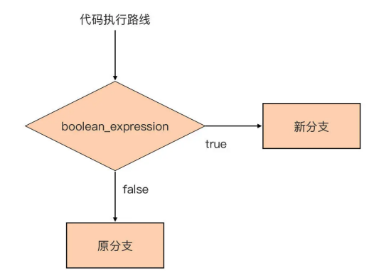
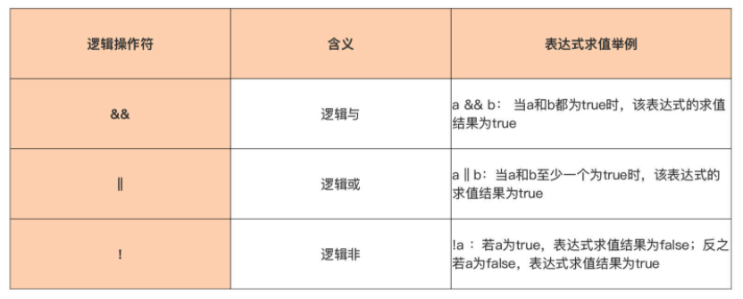

# Go Control Structure

> Go 语言的控制结构，if、for、switch。

## 控制结构

1984 年图灵奖获得者、著名计算机科学家尼古拉斯·沃斯（Niklaus Wirth）提出过著名 的“**程序 = 数据结构 + 算法**”的公式。

Go 语 言的基本数据类型和复合数据类型，这些对应的就是公式中数据结构，通过这些数据类型可以建立起复杂的数据结构。 

那么公式中的算法呢？算法是对真实世界运作规律的抽象，是解决真实世界中问题的步骤。在计算机世界中，再复杂的算法都可以通过顺序、分支和循环这三种基本的控制结构构造出来。

顺序结构自然不用说了，要关注的主要是后面两个，聚焦于 Go 语言中的分支和循环这两种控制结构。 

那么 Go 语言对分支与循环两种控制结构的支持是怎么样的呢？

- 针对程序的分支结构，Go 提供了 if 和 switch-case 两种语句形式；
- 而针对循环结构，Go 只保留了 for 这一种循环 语句形式。


## Go 的分支结构

Go 语言是站在 C 语言等的肩膀之上诞生与成长起来的。Go 语 言继承了 C 语言的很多语法，这里就包括控制结构。但 Go 也不是全盘照搬，而是在继承 的基础上又加上了自己的一些优化与改进，比如：

- Go 坚持“一件事情仅有一种做法的理念”，只保留了 for 这一种循环结构，去掉了 C 语言中的 while 和 do-while 循环结构； 
- Go 填平了 C 语言中 switch 分支结构中每个 case 语句都要以 break 收尾的“坑”； 
- Go 支持了 type switch 特性，让“类型”信息也可以作为分支选择的条件； 
- Go 的 switch 控制结构的 case 语句还支持表达式列表，让相同处理逻辑的多个分支可 以合并为一个分支，等等。


## if

那么，Go 中的 if 语句又有什么创新点呢？

### Go 的 if 语句

先来认识一下 Go 中的 if 语句。 if 语句是 Go 语言中提供的一种分支控制结构，它也是 Go 中最常用、最简单的分支控制 结构。它会根据布尔表达式的值，在两个分支中选择一个执行。

#### if 单分支结构

先来看一个最简单的、单分支结构的 if 语句的形式：

```go
if boolean_expression {
  // 新分支
}

// 原分支
```

分支结构是传统结构化程序设计中的基础构件，这个 if 语句中的代码执行流程就等价于下面这幅流程图：



从图中可以看到，代码执行遇到 if 分支结构后，首先会对其中的布尔表达式 （boolean_expression）进行求值，如果求值结果为 true，那么程序将进入新分支执行， 如果布尔表达式的求值结果为 false，代码就会继续沿着原分支的路线继续执行。 

虽然各种编程语言几乎都原生支持了 if 语句，但 Go 的 if 语句依然有着自己的特点： 

- 第一，和 Go 函数一样，if 语句的分支代码块的左大括号与 if 关键字在同一行上，这也是 Go 代码风格的统一要求，gofmt 工具会帮助实现这一点； 
- 第二，if 语句的布尔表达式整体不需要用括号包裹，一定程度上减少了开发人员敲击键盘的次数。
- 而且，if 关键字后面的条件判断表达式的求值结果必须是布尔类型，即要么是 true，要么是 false：

```go
if runtime.GOOS == "linux" {
   println("we are on linux os")
}

if runtime.GOOS == "darwin" {
  println("we are on darwin os")
}
```

如果判断的条件比较多，可以用多个**逻辑操作符**连接起多个条件判断表达式，比如这 段代码就是用了多个逻辑操作符 && 来连接多个布尔表达式：

```go
if (runtime.GOOS == "linux") && (runtime.GOARCH == "amd64") && (runtime.Compiler != "gccgo") {
   println("we are using standard go compiler on linux os for amd64")
}

if (runtime.GOOS == "darwin") && (runtime.GOARCH == "amd64") && (runtime.Compiler != "gccgo") {
  println("we are using standard go compiler on darwin os for amd64")
}
```

除了逻辑操作符 && 之外，Go 还提供了**另外两个逻辑操作符**，总结到了这张表里。



上面示例代码中的**每个布尔表达式都被小括号括上**了，这又是什么原 因呢？

这是为了降低在阅读和理解这段代码时，面对操作符优先级的心智负担，这也是 个人的编码习惯。 

**Go 语言的操作符是有优先级**的。这里要记住，一元操作符，比如上面的逻辑非操作符， 具有最高优先级，其他操作符的优先级如下：


操作符优先级决定了操作数优先参与哪个操作符的求值运算，以下面代码中 if 语句的 布尔表达式为例：

```go
// if 判断示例 逻辑操作符优先级 不加()
a, b := false, true
if a && b != true {
   println("(a && b) != true")
   return
}
println("a && (b != true) == false") // 输出：a && (b != true) == false
```

执行这段代码会输出什么呢？第一次读这段代码的时候，可能会认为输出 (a && b) != true，但实际上得到的却是 a && (b != true) == false。这是为什么呢？ 

这段代码的关键就在于，if 后面的布尔表达式中的操作数 b 是先参与 && 的求值运算，还是先参与!= 的求值运算。根据前面的操作符优先级表，知道，**!= 的优先级要高于 &&**，因此操作数 b 先参与的是!= 的求值运算，这样 if 后的布尔表达式就**等价于 a && (b != true)** ，而不是最初认为的 (a && b) != true。 

如果有时候也会记不住操作符优先级，不用紧张。从学习和使用 C 语言开始，就记不住这么多操作符的优先级，况且不同编程语言的操作符优先级还可能有所不同，所以个人倾向在 if 布尔表达式中，使用带有小括号的子布尔表达式来清晰地表达判断条件。

这样做不仅可以消除了自己记住操作符优先级的学习负担，同时就像前面说的，当其他人阅读代码时，也可以很清晰地看出布尔表达式要表达的逻辑关系，这能让代码的可读性更好，更易于理解，不会因记错操作符优先级顺序而产生错误的理解。

除了上面的最简形式，Go 语言的 if 语句还有其他多种形式，比如二分支结构和多（N） 分支结构。 

#### if 二分支结构

二分支控制结构比较好理解。比如下面这个例子，当 boolean_expression 求值为 true 时，执行分支 1，否则，执行分支 2：

```go
// 二分支结构
if boolean_expression {
   // 分支1
} else {
   // 分支2
}
```

#### 多（N）分支结构

多分支结构由于**引入了 else if**，理解起来稍难一点点，它的标准形式是这样的：

```go
// 多分支结构
if boolean_expression1 {
   // 分支1
} else if boolean_expression2 {
   // 分支2
   // ... ...
} else if boolean_expressionN {
   // 分支N
} else {
   // 分支N+1
}
```

以下面这个四分支的代码为例，看看怎么**拆解这个多分支结构**：

```go
// 四分支结构
if boolean_expression1 {
   // 分支1
} else if boolean_expression2 {
   // 分支2
} else if boolean_expression3 {
   // 分支3
} else {
   // 分支4
}
```

要理解这个略复杂一些的分支结构，其实很简单。只需要把它做一下**等价变换**，变换为熟悉的二分支结构就好了，变换后的代码如下：

```go
// 四分支结构 等价变换
if boolean_expression1 {
   // 分支1
} else {
   if boolean_expression2 {
      // 分支2
   } else {
      if boolean_expression3 {
         // 分支3
      } else {
         // 分支4
      }
   }
}
```

这样等价转换后，得到一个层层缩进的二分支结构，通过上面对二分支的分析， 再来理解这个结构就十分容易了。 

### 支持声明 if 语句的自用变量 

无论是单分支、二分支还是多分支结构，都可以在 if 后的布尔表达式前，进行一些变量的声明，在 if 布尔表达式前声明的变量，叫它 if 语句的自用变量。

顾名思义，这些变量只可以在 if 语句的代码块范围内使用，比如下面代码中的变量 a、b 和 c：

```go
// if 语句的自用变量
func main() {
   if a, c := f(), h(); a > 0 {
      println(a)
   } else if b := f(); b > 0 {
      println(a, b)
   } else {
      println(a, b, c)
   }
}
```

可以看到自用变量声明的位置是在每个 if 语句的后面，布尔表达式的前面，而且，由于声明本身是一个语句，所以需要把它和后面的布尔表达式通过分号分隔开。 

这里又涉及到了**代码块与作用域的概念**。上面代码中声明的变量 a、b、c 都位于各级 if 的隐式代码块中，它们的作用域起始于它声明所在的代码块，并一直可扩展至嵌入到这个代码块的所有内层代码块中。 

在 if 语句中声明自用变量是 Go 语言的一个**惯用法**，这种使用方式直观上可以让开发者有一种代码行数减少的感觉，提高可读性。同时，由于这些变量是 if 语句自用变量，它的作用域仅限于 if 语句的各层隐式代码块中，if 语句外部无法访问和更改这些变量，这就让这些变量具有一定**隔离性**，这样在阅读和理解 if 语句的代码时也可以更聚焦。 

Go 控制结构与短变量声明的结合是**“变量遮蔽”问题**出没的重灾区，在这点上一定要注意。 


### if 语句的“快乐路径”原则 

已经学了 if 分支控制结构的三种形式了，从可读性上来看，单分支结构要优于二分支结构，二分支结构又优于多分支结构。

那么显然，在日常编码中要减少多分支结构， 甚至是二分支结构的使用，这会有助于编写出优雅、简洁、易读易维护且不易错的代 码。

用一个具体的例子直观地体会一下这个观点，下面是两段逻辑相同但形式不同的 伪代码段：

```go
package ifhappypath

// 伪代码段1：
func doSomething() error {
   if errorCondition1 {
      // some error logic
      // ... ...
      return err1
   }
   // some success logic
   // ... ...
   if errorCondition2 {
      // some error logic
      // ... ...
      return err2
   }
   // some success logic
   // ... ...
   return nil
}

// 伪代码段2：
func doSomething() error {
   if successCondition1 {
      // some success logic
      // ... ...
      if successCondition2 {
         // some success logic
         // ... ...
         return nil
      } else {
         // some error logic
         // ... ...
         return err2
      }
   } else {
      // some error logic
      // ... ...
      return err1
   }
}
```

即便是刚入门的 Go 新手，大概也能看出上面代码的优劣。 

看看只使用了单分支控制结构的伪代码段 1，看到代码段 1 有这几个特点：

- 没有使用 else 分支，失败就立即返回； 
- “成功”逻辑始终“居左”并延续到函数结尾，没有被嵌入到 if 的布尔表达式为 true 的代码分支中；
-  整个代码段布局扁平，没有深度的缩进；

而另外一个实现了同样逻辑的伪代码段 2，就使用了带有嵌套的二分支结构，它的特点如 下：

- 整个代码段呈现为“锯齿状”，有深度缩进； 
- “成功”逻辑被嵌入到 if 的布尔表达式为 true 的代码分支中；

很明显，伪代码段 1 的逻辑更容易理解，也更简洁。Go 社区把这种 if 语句的使用方式称 为 **if 语句的“快乐路径（Happy Path）”原则**，所谓“快乐路径”也就是成功逻辑的代码执行路径，它的特点是这样的：

- 仅使用单分支控制结构； 
- 当布尔表达式求值为 false 时，也就是出现错误时，在单分支中快速返回； 
- 正常逻辑在代码布局上始终“靠左”，这样读者可以从上到下一眼看到该函数正常逻辑的全貌； 
- 函数执行到最后一行代表一种成功状态。

Go 社区推荐 Gopher 们在使用 if 语句时尽量符合这些原则，如果函数实现代码不符合“快乐路径”原则，可以按下面步骤进行**重构**：

- 尝试将“正常逻辑”提取出来，放到“快乐路径”中； 
- 如果无法做到上一点，很可能是函数内的逻辑过于复杂，可以将深度缩进到 else 分支中的代码析出到一个函数中，再对原函数实施“快乐路径”原则。


### 小结

分支控制结构是构造现实中复杂算法的三大基础控制结构之一，Go 语言通过 if 与 switch 语句对分支控制结构提供了支持。

重点讲解了 if 语句，建议记住以 下几点： 

- 第一，if 语句是 Go 语言中最常用的分支控制语句，也是最简单的分支控制结构。if 语句通过对布尔表达式的求值决定了后续代码执行要进入的哪条分支。当需要复杂条件判断时，可以使用逻辑操作符连接多个布尔表达式，作为 if 语句的判断条件表达式。如果这么 做了，还要注意各个操作符的优先级，个人建议尽量用小括号对各个布尔表达式进行清晰地隔离，这样可以提升代码可读性。 
- 第二，Go 的 if 语句提供了多种使用形式，包括单分支、双分支以及多分支。多分支理解起来略有难度，可以将它等价转换为双分支来理解。 
- 第三，if 语句支持在布尔表达式前声明自用变量，这些变量作用域仅限于 if 语句的代码块内部。使用 if 自用变量可以一定程度简化代码，并增强与同函数内其他变量的隔离，但这也十分容易导致变量遮蔽问题，使用时一定要注意。 
- 最后一点，if 语句的三种使用形式的复杂度与可读性不一，建议在使用 if 语句时尽量符合“快乐路径”原则，这个原则通常只使用最容易理解的单分支结构，所有正常代码 均“靠左”，这让函数内代码逻辑一目了然，提升了代码可读性与可维护性。


### 思考题 

思考题：如果一个 if 语句使用了多分支结构，如下面代码这样，那 么 if 语句中的几个布尔表达式如何排列能达到最好的效果呢？ 

提示一下，几个布尔表达式能够被命中的概率是不同的。

```go
func foo() {
   if boolean_expression1 {
      
   } else if boolean_expression2 {
      
   } else if boolean_expression3 {
      
   } else {
      
   }
}
```

- 如果加上“布尔表达式3在这段代码中实际被命中的机会更多，布尔表达式2次之，布尔表达式1最少” 这个条件，那么最优的性能最好的写法应该是**最大概率的放到最前面**，因此可以改成如下：

- ```go
  func foo() {
     if boolean_expression3 {
  
        return
     }
     if boolean_expression2 {
  
        return
     }
     if boolean_expression1 {
  
        return
     }
  
     // else代码
     return
  }
  ```

- 那为什么命中的最多，写到前面，是最好的呢，这里面主要涉及到2个技术点：流水线技术和分支预测

  - 流水线技术：简单的说，一条 CPU 指令的执行是由 取指令-指令译码-指令执行-结果回写 组成的(简单的说哈，真实的流水线是更长更复杂的)；第一条指令译码的时候，就可以去取第二条指令，因此可以通过流水线技术提高CPU的使用率。

  - 分支预测：如果没有任何分支预测，那么就是按照程序的代码顺序执行，那么执行到 if 上一句的时候，指令译码就是if语句，取指令就是if语句块的第一句，那么if 如果不满足的话，就会执行 JMP 指令，跳转到else，因此流水线中的取指令与指令译码其实是无用功。因此在没有任何分支预测优化的情况下，if 语句需要把概率更高的条件写到最上面，更能体现流水线的威力。

  - 但是现代计算机都有分支预测的优化，比如动态分支预测等技术，但是不管怎么说，把概率最大的放到最上面，还是很有必要的。

  - 问题：在C语言中，有类似这样的宏定义，可以使用 __builtin_expect函数，主动提示那个分支的代码的概率更高，在go中是否也有类似的方法？还是说现在的编后端编译技术已经比较智能，不需要甚至禁止程序员手动指定分支预测了。__

  - ```c
    #define likely(x) __builtin_expect(!!(x), 1)
    #define unlikely(x) __builtin_expect(!!(x), 0)
    ```


## for


