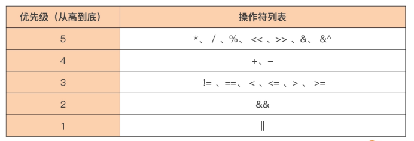
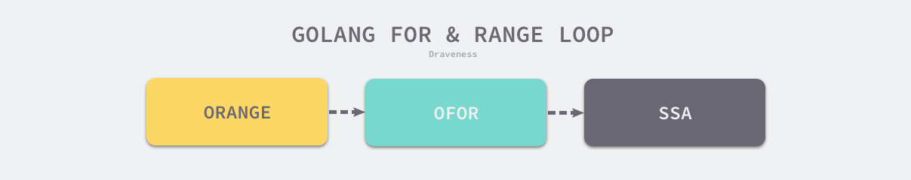
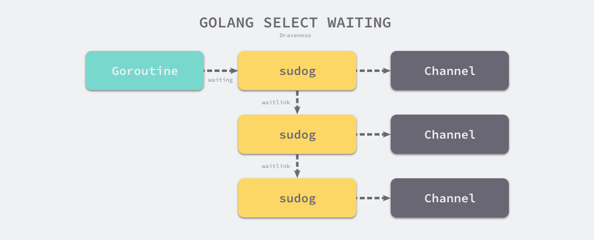

# Go Control Structure

> Go 语言的控制结构，if、for、switch。

## 控制结构

1984 年图灵奖获得者、著名计算机科学家尼古拉斯·沃斯（Niklaus Wirth）提出过著名 的“**程序 = 数据结构 + 算法**”的公式。

Go 语 言的基本数据类型和复合数据类型，这些对应的就是公式中数据结构，通过这些数据类型可以建立起复杂的数据结构。 

那么公式中的算法呢？算法是对真实世界运作规律的抽象，是解决真实世界中问题的步骤。在计算机世界中，再复杂的算法都可以通过顺序、分支和循环这三种基本的控制结构构造出来。

顺序结构自然不用说了，要关注的主要是后面两个，聚焦于 Go 语言中的分支和循环这两种控制结构。 

那么 Go 语言对分支与循环两种控制结构的支持是怎么样的呢？

- 针对程序的分支结构，Go 提供了 if 和 switch-case 两种语句形式；
- 而针对循环结构，Go 只保留了 for 这一种循环 语句形式。


## Go 的分支结构

Go 语言是站在 C 语言等的肩膀之上诞生与成长起来的。Go 语 言继承了 C 语言的很多语法，这里就包括控制结构。但 Go 也不是全盘照搬，而是在继承 的基础上又加上了自己的一些优化与改进，比如：

- Go 坚持“一件事情仅有一种做法的理念”，只保留了 for 这一种循环结构，去掉了 C 语言中的 while 和 do-while 循环结构； 
- Go 填平了 C 语言中 switch 分支结构中每个 case 语句都要以 break 收尾的“坑”； 
- Go 支持了 type switch 特性，让“类型”信息也可以作为分支选择的条件； 
- Go 的 switch 控制结构的 case 语句还支持表达式列表，让相同处理逻辑的多个分支可 以合并为一个分支，等等。


## if

那么，Go 中的 if 语句又有什么创新点呢？

### Go 的 if 语句

先来认识一下 Go 中的 if 语句。 if 语句是 Go 语言中提供的一种分支控制结构，它也是 Go 中最常用、最简单的分支控制 结构。它会根据布尔表达式的值，在两个分支中选择一个执行。

#### if 单分支结构

先来看一个最简单的、单分支结构的 if 语句的形式：

```go
if boolean_expression {
  // 新分支
}

// 原分支
```

分支结构是传统结构化程序设计中的基础构件，这个 if 语句中的代码执行流程就等价于下面这幅流程图：


从图中可以看到，代码执行遇到 if 分支结构后，首先会对其中的布尔表达式 （boolean_expression）进行求值，如果求值结果为 true，那么程序将进入新分支执行， 如果布尔表达式的求值结果为 false，代码就会继续沿着原分支的路线继续执行。 

虽然各种编程语言几乎都原生支持了 if 语句，但 Go 的 if 语句依然有着自己的特点： 

- 第一，和 Go 函数一样，if 语句的分支代码块的左大括号与 if 关键字在同一行上，这也是 Go 代码风格的统一要求，gofmt 工具会帮助实现这一点； 
- 第二，if 语句的布尔表达式整体不需要用括号包裹，一定程度上减少了开发人员敲击键盘的次数。
- 而且，if 关键字后面的条件判断表达式的求值结果必须是布尔类型，即要么是 true，要么是 false：

```go
if runtime.GOOS == "linux" {
   println("we are on linux os")
}

if runtime.GOOS == "darwin" {
  println("we are on darwin os")
}
```

如果判断的条件比较多，可以用多个**逻辑操作符**连接起多个条件判断表达式，比如这 段代码就是用了多个逻辑操作符 && 来连接多个布尔表达式：

```go
if (runtime.GOOS == "linux") && (runtime.GOARCH == "amd64") && (runtime.Compiler != "gccgo") {
   println("we are using standard go compiler on linux os for amd64")
}

if (runtime.GOOS == "darwin") && (runtime.GOARCH == "amd64") && (runtime.Compiler != "gccgo") {
  println("we are using standard go compiler on darwin os for amd64")
}
```

除了逻辑操作符 && 之外，Go 还提供了**另外两个逻辑操作符**，总结到了这张表里。


上面示例代码中的**每个布尔表达式都被小括号括上**了，这又是什么原 因呢？

这是为了降低在阅读和理解这段代码时，面对操作符优先级的心智负担，这也是 个人的编码习惯。 

**Go 语言的操作符是有优先级**的。这里要记住，一元操作符，比如上面的逻辑非操作符， 具有最高优先级，其他操作符的优先级如下：



操作符优先级决定了操作数优先参与哪个操作符的求值运算，以下面代码中 if 语句的 布尔表达式为例：

```go
// if 判断示例 逻辑操作符优先级 不加()
a, b := false, true
if a && b != true {
   println("(a && b) != true")
   return
}
println("a && (b != true) == false") // 输出：a && (b != true) == false
```

执行这段代码会输出什么呢？第一次读这段代码的时候，可能会认为输出 (a && b) != true，但实际上得到的却是 a && (b != true) == false。这是为什么呢？ 

这段代码的关键就在于，if 后面的布尔表达式中的操作数 b 是先参与 && 的求值运算，还是先参与!= 的求值运算。根据前面的操作符优先级表，知道，**!= 的优先级要高于 &&**，因此操作数 b 先参与的是!= 的求值运算，这样 if 后的布尔表达式就**等价于 a && (b != true)** ，而不是最初认为的 (a && b) != true。 

如果有时候也会记不住操作符优先级，不用紧张。从学习和使用 C 语言开始，就记不住这么多操作符的优先级，况且不同编程语言的操作符优先级还可能有所不同，所以个人倾向在 if 布尔表达式中，使用带有小括号的子布尔表达式来清晰地表达判断条件。

这样做不仅可以消除了自己记住操作符优先级的学习负担，同时就像前面说的，当其他人阅读代码时，也可以很清晰地看出布尔表达式要表达的逻辑关系，这能让代码的可读性更好，更易于理解，不会因记错操作符优先级顺序而产生错误的理解。

除了上面的最简形式，Go 语言的 if 语句还有其他多种形式，比如二分支结构和多（N） 分支结构。 

#### if 二分支结构

二分支控制结构比较好理解。比如下面这个例子，当 boolean_expression 求值为 true 时，执行分支 1，否则，执行分支 2：

```go
// 二分支结构
if boolean_expression {
   // 分支1
} else {
   // 分支2
}
```

#### 多（N）分支结构

多分支结构由于**引入了 else if**，理解起来稍难一点点，它的标准形式是这样的：

```go
// 多分支结构
if boolean_expression1 {
   // 分支1
} else if boolean_expression2 {
   // 分支2
   // ... ...
} else if boolean_expressionN {
   // 分支N
} else {
   // 分支N+1
}
```

以下面这个四分支的代码为例，看看怎么**拆解这个多分支结构**：

```go
// 四分支结构
if boolean_expression1 {
   // 分支1
} else if boolean_expression2 {
   // 分支2
} else if boolean_expression3 {
   // 分支3
} else {
   // 分支4
}
```

要理解这个略复杂一些的分支结构，其实很简单。只需要把它做一下**等价变换**，变换为熟悉的二分支结构就好了，变换后的代码如下：

```go
// 四分支结构 等价变换
if boolean_expression1 {
   // 分支1
} else {
   if boolean_expression2 {
      // 分支2
   } else {
      if boolean_expression3 {
         // 分支3
      } else {
         // 分支4
      }
   }
}
```

这样等价转换后，得到一个层层缩进的二分支结构，通过上面对二分支的分析， 再来理解这个结构就十分容易了。 

### 支持声明 if 语句的自用变量 

无论是单分支、二分支还是多分支结构，都可以在 if 后的布尔表达式前，进行一些变量的声明，在 if 布尔表达式前声明的变量，叫它 if 语句的自用变量。

顾名思义，这些变量只可以在 if 语句的代码块范围内使用，比如下面代码中的变量 a、b 和 c：

```go
// if 语句的自用变量
func main() {
   if a, c := f(), h(); a > 0 {
      println(a)
   } else if b := f(); b > 0 {
      println(a, b)
   } else {
      println(a, b, c)
   }
}
```

可以看到自用变量声明的位置是在每个 if 语句的后面，布尔表达式的前面，而且，由于声明本身是一个语句，所以需要把它和后面的布尔表达式通过分号分隔开。 

这里又涉及到了**代码块与作用域的概念**。上面代码中声明的变量 a、b、c 都位于各级 if 的隐式代码块中，它们的作用域起始于它声明所在的代码块，并一直可扩展至嵌入到这个代码块的所有内层代码块中。 

在 if 语句中声明自用变量是 Go 语言的一个**惯用法**，这种使用方式直观上可以让开发者有一种代码行数减少的感觉，提高可读性。同时，由于这些变量是 if 语句自用变量，它的作用域仅限于 if 语句的各层隐式代码块中，if 语句外部无法访问和更改这些变量，这就让这些变量具有一定**隔离性**，这样在阅读和理解 if 语句的代码时也可以更聚焦。 

Go 控制结构与短变量声明的结合是**“变量遮蔽”问题**出没的重灾区，在这点上一定要注意。 


### if 语句的“快乐路径”原则 

已经学了 if 分支控制结构的三种形式了，从可读性上来看，单分支结构要优于二分支结构，二分支结构又优于多分支结构。

那么显然，在日常编码中要减少多分支结构， 甚至是二分支结构的使用，这会有助于编写出优雅、简洁、易读易维护且不易错的代 码。

用一个具体的例子直观地体会一下这个观点，下面是两段逻辑相同但形式不同的 伪代码段：

```go
package ifhappypath

// 伪代码段1：
func doSomething() error {
   if errorCondition1 {
      // some error logic
      // ... ...
      return err1
   }
   // some success logic
   // ... ...
   if errorCondition2 {
      // some error logic
      // ... ...
      return err2
   }
   // some success logic
   // ... ...
   return nil
}

// 伪代码段2：
func doSomething() error {
   if successCondition1 {
      // some success logic
      // ... ...
      if successCondition2 {
         // some success logic
         // ... ...
         return nil
      } else {
         // some error logic
         // ... ...
         return err2
      }
   } else {
      // some error logic
      // ... ...
      return err1
   }
}
```

即便是刚入门的 Go 新手，大概也能看出上面代码的优劣。 

看看只使用了单分支控制结构的伪代码段 1，看到代码段 1 有这几个特点：

- 没有使用 else 分支，失败就立即返回； 
- “成功”逻辑始终“居左”并延续到函数结尾，没有被嵌入到 if 的布尔表达式为 true 的代码分支中；
-  整个代码段布局扁平，没有深度的缩进；

而另外一个实现了同样逻辑的伪代码段 2，就使用了带有嵌套的二分支结构，它的特点如 下：

- 整个代码段呈现为“锯齿状”，有深度缩进； 
- “成功”逻辑被嵌入到 if 的布尔表达式为 true 的代码分支中；

很明显，伪代码段 1 的逻辑更容易理解，也更简洁。Go 社区把这种 if 语句的使用方式称 为 **if 语句的“快乐路径（Happy Path）”原则**，所谓“快乐路径”也就是成功逻辑的代码执行路径，它的特点是这样的：

- 仅使用单分支控制结构； 
- 当布尔表达式求值为 false 时，也就是出现错误时，在单分支中快速返回； 
- 正常逻辑在代码布局上始终“靠左”，这样读者可以从上到下一眼看到该函数正常逻辑的全貌； 
- 函数执行到最后一行代表一种成功状态。

Go 社区推荐 Gopher 们在使用 if 语句时尽量符合这些原则，如果函数实现代码不符合“快乐路径”原则，可以按下面步骤进行**重构**：

- 尝试将“正常逻辑”提取出来，放到“快乐路径”中； 
- 如果无法做到上一点，很可能是函数内的逻辑过于复杂，可以将深度缩进到 else 分支中的代码析出到一个函数中，再对原函数实施“快乐路径”原则。


### 小结

分支控制结构是构造现实中复杂算法的三大基础控制结构之一，Go 语言通过 if 与 switch 语句对分支控制结构提供了支持。

重点讲解了 if 语句，建议记住以 下几点： 

- 第一，if 语句是 Go 语言中最常用的分支控制语句，也是最简单的分支控制结构。if 语句通过对布尔表达式的求值决定了后续代码执行要进入的哪条分支。当需要复杂条件判断时，可以使用逻辑操作符连接多个布尔表达式，作为 if 语句的判断条件表达式。如果这么 做了，还要注意各个操作符的优先级，个人建议尽量用小括号对各个布尔表达式进行清晰地隔离，这样可以提升代码可读性。 
- 第二，Go 的 if 语句提供了多种使用形式，包括单分支、双分支以及多分支。多分支理解起来略有难度，可以将它等价转换为双分支来理解。 
- 第三，if 语句支持在布尔表达式前声明自用变量，这些变量作用域仅限于 if 语句的代码块内部。使用 if 自用变量可以一定程度简化代码，并增强与同函数内其他变量的隔离，但这也十分容易导致变量遮蔽问题，使用时一定要注意。 
- 最后一点，if 语句的三种使用形式的复杂度与可读性不一，建议在使用 if 语句时尽量符合“快乐路径”原则，这个原则通常只使用最容易理解的单分支结构，所有正常代码 均“靠左”，这让函数内代码逻辑一目了然，提升了代码可读性与可维护性。


### 思考题 

思考题：如果一个 if 语句使用了多分支结构，如下面代码这样，那 么 if 语句中的几个布尔表达式如何排列能达到最好的效果呢？ 

提示一下，几个布尔表达式能够被命中的概率是不同的。

```go
func foo() {
   if boolean_expression1 {
      
   } else if boolean_expression2 {
      
   } else if boolean_expression3 {
      
   } else {
      
   }
}
```

- 如果加上“布尔表达式3在这段代码中实际被命中的机会更多，布尔表达式2次之，布尔表达式1最少” 这个条件，那么最优的性能最好的写法应该是**最大概率的放到最前面**，因此可以改成如下：

- ```go
  func foo() {
     if boolean_expression3 {
  
        return
     }
     if boolean_expression2 {
  
        return
     }
     if boolean_expression1 {
  
        return
     }
  
     // else代码
     return
  }
  ```

- 那为什么命中的最多，写到前面，是最好的呢，这里面主要涉及到2个技术点：流水线技术和分支预测

  - 流水线技术：简单的说，一条 CPU 指令的执行是由 取指令-指令译码-指令执行-结果回写 组成的(简单的说哈，真实的流水线是更长更复杂的)；第一条指令译码的时候，就可以去取第二条指令，因此可以通过流水线技术提高CPU的使用率。

  - 分支预测：如果没有任何分支预测，那么就是按照程序的代码顺序执行，那么执行到 if 上一句的时候，指令译码就是if语句，取指令就是if语句块的第一句，那么if 如果不满足的话，就会执行 JMP 指令，跳转到else，因此流水线中的取指令与指令译码其实是无用功。因此在没有任何分支预测优化的情况下，if 语句需要把概率更高的条件写到最上面，更能体现流水线的威力。

  - 但是现代计算机都有分支预测的优化，比如动态分支预测等技术，但是不管怎么说，把概率最大的放到最上面，还是很有必要的。

  - 问题：在C语言中，有类似这样的宏定义，可以使用 __builtin_expect函数，主动提示那个分支的代码的概率更高，在go中是否也有类似的方法？还是说现在的编后端编译技术已经比较智能，不需要甚至禁止程序员手动指定分支预测了。__

  - ```c
    #define likely(x) __builtin_expect(!!(x), 1)
    #define unlikely(x) __builtin_expect(!!(x), 0)
    ```


## for

针对程序的分支结构，Go 提供了 if 和 switch-case 两种语句形式。

虽然 switch-case 分支结构也非常重要，但毕竟已经有了 if 分支语句的基础了，很多时候用 if 也可以替代 switch-case，所以把它往后放放。

日常编码过程中，常常需要**重复执行同一段代码**，这时就需要循环结构来控制程序的执行顺序。一个循环结构会执行循环体中的代码直到结尾，然后回到开头继 续执行。 

主流编程语言都提供了对循环结构的支持，绝大多数主流语言，包括 C 语言、 C++、Java 和 Rust，甚至连动态语言 Python 还提供了不止一种的循环语句，但 Go 却只有一种，也就是 for 语句。 

### for 语句的经典使用形式 

C 语言是很多现代编程语言的“祖先”，要学习 Go 语言中 for 语句的使用形式，要 先看看 C 语言中 for 语句是怎么使用的。 

#### C 语言

下面这段 C 代码就是 **C 语言中 for 语句**的经典使用形式：

```c
#include <stdio.h>

int main() {
    int i;
    int sum = 0;
    for (i = 0; i < 10; i++) {
        sum += i;
    }
    printf("%d\n", sum);  // 45
}
```

#### Go 语言

这种形式也被其它后继语言延承了下来，Go 语言的 for 语句也不例外，这段 C 代码在 Go 语言中的等价形式是这样的：

```go
func main() {
   // for 语句
   var sum int
   for i := 0; i < 10; i++ {
      sum += i
   }
   println(sum) // 45
}
```

这种 for 语句的使用形式是 Go 语言中 for 循环语句的经典形式。

用一幅流程图来直观解释一下上面这句 for 循环语句的组成部分，以及各个部分的执行顺序：


从图中可以看到，经典 for 循环语句有四个组成部分（分别对应图中的①~④）。按顺 序拆解一下这张图。 

- 图中①对应的组成部分执行于循环体（③ ）之前，并且在整个 for 循环语句中**仅会被执行 一次**，它也被称为**循环前置语句**。通常会在这个部分声明一些循环体（③ ）或循环控制条件（② ）会用到的自用变量，也称循环变量或迭代变量，比如这里声明的整型变量 i。与 if 语句中的自用变量一样，for 循环变量也采用短变量声明的形式，循环变量的作用域仅限于 for 语句隐式代码块范围内。 
- 图中②对应的组成部分，是用来决定循环是否要继续进行下去的**条件判断表达式**。和 if 语 句的一样，这个用于条件判断的表达式必须为布尔表达式，如果有多个判断条件，一 样可以由逻辑操作符进行连接。当表达式的求值结果为 true 时，代码将进入循环体（③） 继续执行，相反则循环直接结束，循环体（③）与组成部分④都不会被执行。 
- 前面也多次提到了，图中③对应的组成部分是 for 循环语句的**循环体**。如果相关的判断条件表达式求值结构为 true 时，循环体就会被执行一次，这样的一次执行也被称为一次迭代（Iteration）。在上面例子中，循环体执行的动作是将这次迭代中变量 i 的值累加到变量 sum 中。
-  图中④对应的组成部分会在每次循环体迭代之后执行，也被称为循环后置语句。这个部分通常用于更新 for 循环语句组成部分①中声明的循环变量，比如在这个例子中，在这个组成部分对循环变量 i 进行加 1 操作。 

现在应该理解 Go 语言中的经典 for 语句的形式了吧？不过，Go 语言的 for 循环也在 C 语言的基础上有一些突破和创新。

#### 支持声明多循环变量

具体一点，Go 语言的 for 循环支持声明多循环变量，并且可以应用在循环体以及判断条件中，比如下面就是一个使用多循环变量的、稍复杂的例 子：

```go
// 声明多循环变量
for i, j, k := 0, 1, 2; (i < 20) && (j < 10) && (k < 30); i, j, k = i+1, j+1, k+5 {
   sum += (i + j + k)
   println(sum)
}
```

在这个例子中，声明了三个循环自用变量 i、j 和 k，它们共同参与了循环条件判断与循环体的执行。 

#### 省略后置循环语句

继续按四个组成部分分析这段代码。其实，除了循环体部分（③）之外，其余的三个部分都是**可选的**。

比如下面代码中，省略了循环后置语句④，将对循环变量的更新操 作放在了循环体中：

```go
// 省略后置循环语句
for i := 0; i < 10; {
   i++
}
```

#### 省略循环前置语句

也可以省略循环前置语句。比如下面例子中，就没有使用前置语句声明循环变 量，而是直接使用了已声明的变量 i 充当循环变量的作用：

```go
// 省略循环前置语句
i := 0
for ; i < 10; i++ {
   println(i)
}
```

#### 省略后置与前置语句

当然，循环前置与后置语句也可以都省略掉，比如下面代码：

```go
// 省略后置与前置语句
i := 0
for ; i < 10; {
  println(i)
  i++
}
```

虽然对前置语句或后置语句进行了省略，但经典 for 循环形式中的分号依然被保留着，要注意这一点，这是 Go 语法的要求。 

不过有一个**例外**，那就是当循环前置与后置语句都省略掉，仅保留循环判断条件表达式时，可以**省略经典 for 循环形式中的分号**。

也就是说，可以将上面的例子写出如 下形式：

```go
// 省略经典 for 循环形式中的分号
i := 0
for i < 10 {
   println(i)
   i++
}
```

这种形式也是在日常 Go 编码中经常使用的 for 循环语句的第二种形式，也就是除了循环体之外，仅保留循环判断条件表达式。 

#### 省略循环判断条件表达式（无限循环）

不过看到这里，可能就问了：“前面不是说过，除了循环体，其他组成部分都 是可选项么？” 

没错。当 for 循环语句的循环判断条件表达式的求值结果始终为 true 时，就可以将它省略掉了：

```go
// 省略循环判断条件表达式
for {
   // 循环体代码
   i += 6
}
```

这个 for 循环就是通常所说的**“无限循环”**。它的形式等价于：

```go
// 等价形式（无限循环）
for true {
   // 循环体代码
   i += 1
}
```

或者：

```go
// 等价形式（无限循环）
for ; ; {
   // 循环体代码
   i += 1
}
```

不过，虽然这里给出这些等价形式，但在日常使用时，还是建议用它的最简形式， 也就是for {...}，更加简单。 

那么，无限循环是什么意思呢？是不是意味着代码始终在运行循环体而无法跳出来呢？不是的。


### for range 循环形式 

for range 循环形式是怎么一种形式呢？

#### for range 循环（切片类型）

先来看一个例子。如果要使用 for 经典形式遍历一个切片中的元素，可以这样做：

```go
// for 经典形式 遍历切片中的元素
var sl = []int{1, 2, 3, 4, 5}
for i := 0; i < len(sl); i++ {
   fmt.Printf("sl[%d] = %d\n", i, sl[i])
}
```

在这个经典形式的例子中，使用循环前置语句中声明的循环变量 i 作为切片下标，逐一将切片中的元素读取了出来。不过，这样就有点麻烦了。

其实，针对像切片这样的复合 数据类型，还有 Go 原生的字符串类型（string），Go 语言提供了一个更方便的**“语法糖”形式：for range**。

现在就来写一个等价于上面代码的 for range 循环：

```go
// for range 形式 遍历切片中的元素
for i, v := range sl {
   fmt.Printf("sl[%d] = %d\n", i, v)
}
```

for range 循环形式与 for 语句经典形式差异较大，除了循环体保留了下来，其 余组成部分都“不见”了。其实那几部分已经被融合到 for range 的语义中了。 

具体来说，这里的 i 和 v 对应的是经典 for 语句形式中循环前置语句的循环变量，它们的初值分别为切片 sl 的第一个元素的下标值和元素值。

并且，隐含在 for range 语义中的循环控制条件判断为：是否已经遍历完 sl 的所有元素，等价于i < len(sl)这个布尔表达 式。

另外，每次迭代后，for range 会取出切片 sl 的下一个元素的下标和值，分别赋值给 循环变量 i 和 v，这与 for 经典形式下的循环后置语句执行的逻辑是相同的。 

for range 语句也有几个常见“变种”，继续以上面对切片的迭代为例分析一下。 

#### 省略元素值变量

变种一：当不关心元素的值时，可以省略代表元素值的变量 v，只声明代表下标值 的变量 i：

```go
// 省略元素值变量
for i := range sl {
   // ...
}
```

#### 空标识符代替下标变量

变种二：如果不关心元素下标，只关心元素值，那么可以用空标识符替代代表下 标值的变量 i。

这里一定要注意，这个空标识符不能省略，否则就与上面的“变种一”形式 一样了，Go 编译器将无法区分：

```go
// 空标识符代替下标变量
for _, v := range sl {
   // ...
}
```

#### 省略下标与元素值变量

变种三：到这里，肯定要问：如果既不关心下标值，也不关心元素值，那是否能写 成下面这样呢：

```go
// 省略下标与元素值变量
for _, _ = range sl {
   // ...
}
```

这种形式在语法上没有错误，就是看起来不太优雅。

Go 核心团队早在 Go 1.4 版本中就提供了一种**优雅的等价形式**，后续直接使用这种形式就好了：

```go
// 省略下标与元素值变量 优雅方式
for range sl {
   // ...
}
```


#### for range 循环（string 类型 ）

通过 for range 对一个字符串类型变量进行循环操作。通过下面的例子回顾一下：

```go
// for range 循环 string 类型
var s = "中国人"
for i, v := range s {
  fmt.Printf("%d %s 0x%x\n", i, string(v), v)
}
```

运行这个例子，输出结果是这样的：

```sh
0 中 0x4e2d
3 国 0x56fd
6 人 0x4eba
```

for range 对于 string 类型来说，每次循环得到的 **v 值是一个 Unicode 字符 码点**，也就是 rune 类型值，而不是一个字节，返回的第一个值 i 为**该 Unicode 字符码点的内存编码（UTF-8）的第一个字节在字符串内存序列中的位置**。 

另外，使用 **for 经典形式**与使用 for range 形式，对 string 类型进行循环操作的语义是不同的。 

```go
// for 经典形式
var t = "中国人"
for i := 0; i < len(t); i++ {
   fmt.Printf("index: %d, value: 0x%x\n", i, s[i])
}
// 输出
// index: 0, value: 0xe4
// index: 1, value: 0xb8
// index: 2, value: 0xad
// index: 3, value: 0xe5
// index: 4, value: 0x9b
// index: 5, value: 0xbd
// index: 6, value: 0xe4
// index: 7, value: 0xba
// index: 8, value: 0xba
```


#### for range 循环（map 类型）

map 就是一个键值对（key-value）集合，最常见的对 map 的操作，就是通过 key 获取其对应的 value 值。但有些时候，也要**对 map 这个集合进行遍历**，这就需要 for 语句的支持了。 

但在 Go 语言中，要对 map 进行循环操作，**for range 是唯一的方法**，for 经典循环形式是不支持对 map 类型变量的循环控制的。

下面是通过 for range，对一个 map 类型变量进行循环操作的示例：

```go
// for range 操作 map 类型变量
var m = map[string]int{
   "Rob":  67,
   "Russ": 39,
   "John": 29,
}

for k, v := range m {
   println(k, v)
}
```

运行这个示例，会看到这样的输出结果：

```sh
Russ 39
John 29
Rob 67
```

通过输出结果看到：for range 对于 map 类型来说，每次循环，循环变量 k 和 v 分别会被赋值为 map 键值对集合中一个元素的 key 值和 value 值（这个变量赋值是没有顺序的，随机赋值）。

而且，map 类型中没有下标的概念，通过 key 和 value 来循环操作 map 类型变量也就十分自然了。 

#### for range 循环（channel ）

除了可以针对 string、数组 / 切片，以及 map 类型变量进行循环操作控制之外，for range 还可以与 channel 类型配合工作。 

channel 是 Go 语言提供的并发设计的原语，它用于多个 Goroutine 之间的通信。

当 channel 类型变量作为 for range 语句的迭代对象时，for range 会尝试从 channel 中读取数据，使用形式是这样的：

```go
// for range 操作 channel 类型变量
var c = make(chan int)
for v := range c {
   // ...
}
```

在这个例子中，for range 每次从 channel 中读取一个元素后，会把它赋值给循环变量 v，并进入循环体。

当 channel 中没有数据可读的时候，for range 循环会阻塞在对 channel 的读操作上。直到 channel 关闭时，for range 循环才会结束，这也是 for range 循环与 channel 配合时隐含的循环判断条件。

在日常开发中，一旦执行 for 循环，是不是就只能等循环条件判断表达式求值为 false 时， 才能离开循环呢？如果是前面提到的无限循环，是不是就会被一直困于循环之中呢？ 

不是的。日常开发中，出于算法逻辑的需要，可能会有**中断当前循环体**并继续下一次迭代的时候，也会有中断循环体并彻底结束循环语句的时候。针对这些情况，Go 语言提供 了 continue 语句和 break 语句。


### 带 label 的 continue 语句 

如果循环体中的代码执行到一半，要中断当前迭代，忽略此迭代循环体中的后续代码，并回到 for 循环条件判断，尝试开启下一次迭代，这个时候可以怎么办呢？

可以使用 continue 语句来应对。 

#### continue 语句

先来学习一下 continue 语句的使用方法，看看下面这个代码示例：

```go
// continue 语句的使用方法
var sum int
var sl = []int{1, 2, 3, 4, 5, 6}
for i := 0; i < len(sl); i++ {
   if sl[i]%2 == 0 {
      // 忽略切片中值为偶数的元素
      continue
   }
   sum += sl[i]
}
println(sum) // 9
```

这段代码会循环遍历切片中的元素，把值为奇数的元素相加，然后存储在变量 sum 中。

可以看到，在这个代码的循环体中，如果判断切片元素值为偶数，就使用 continue 语句中断当前循环体的执行，那么循环体下面的sum += sl[i]在这轮迭代中就会被忽略。

代码执行流会直接来到循环后置语句i++，之后对循环条件表达式（i < len(sl)） 进行求值，如果为 true，将再次进入循环体，开启新一次迭代。 

如果学过 C 语言，可能会说：这个 continue 与 C 语言中的 continue 也没有什么差别啊！别急，Go 语言中的 continue 在 C 语言 continue 语义的基础上又**增加了对 label 的支持**。 

#### continue 语句 + label

label 语句的作用，是**标记跳转的目标**。可以把上面的代码改造为使用 label 的等价形式：

```go
package main

func main() {
   // continue 语句的使用方法 + label
   var sum int
   var sl = []int{1, 2, 3, 4, 5, 6}
loop:
   for i := 0; i < len(sl); i++ {
      if sl[i]%2 == 0 {
         // 忽略切片中值为偶数的元素
         continue loop
      }
      sum += sl[i]
   }
   println(sum) // 9
}
```

在这段代码中，定义了一个 label：loop，它标记的跳转目标恰恰就是 for 循环。也就是说，在循环体中可以使用 continue+ loop label 的方式来实现 循环体中断，这与前面的例子在语义上是等价的。

不过这里仅仅是一个演示，通常在这样非嵌套循环的场景中会直接使用不带 label 的 continue 语句。 

#### continue 语句 + label（嵌套循环语句）

而带 label 的 continue 语句，通常出现于**嵌套循环语句**中，被用于**跳转到外层循环并继续执行外层循环语句的下一个迭代**，比如下面这段代码：

```go
package main

import "fmt"

func main() {
   // continue 语句的使用方法 + label 嵌套循环语句
   var sl = [][]int{
      {1, 34, 26, 35, 78},
      {3, 45, 13, 24, 99},
      {101, 13, 38, 7, 127},
      {54, 27, 40, 83, 81},
   }
   
outerloop:
   for i := 0; i < len(sl); i++ {
      for j := 0; j < len(sl[i]); j++ {
         if sl[i][j] == 13 {
            fmt.Printf("found 13 at [%d, %d]\n", i, j)
            continue outerloop
         }
      }
   }
}
```

在这段代码中，变量 sl 是一个元素类型为[]int 的切片（二维切片），其每个元素切片中至多包含一个整型数 13。main 函数的逻辑就是在 sl 的每个元素切片中找到 13 这个数字， 并输出它的具体位置信息。

那这要怎么查找呢？一种好的实现方式就是，只需要**在每个切片中找到 13，就不用继续在这个切片的剩余元素中查找了**。 

用 for 经典形式来实现这个逻辑。面对这个问题，要使用嵌套循环，具体来说就 是外层循环遍历 sl 中的元素切片，内层循环遍历每个元素切片中的整型值。一旦内层循环发现 13 这个数值，便要中断内层 for 循环，回到外层 for 循环继续执行。 

如果用不带 label 的 continue 能不能完成这一功能呢？答案是不能。因为它只能中断内层循环的循环体，并继续开启内层循环的下一次迭代。

而带 label 的 continue 语句是这个场景下的“最佳人选”，它会直接结束内层循环的执行，并回到外层循环继续执行。 

这一行为就好比在外层循环放置并执行了一个不带 label 的 continue 语句。它会中断外层循环中当前迭代的执行，执行外层循环的后置语句（i++），然后再对外层循环的循环控制条件语句进行求值，如果为 true，就将继续执行外层循环的新一次迭代。 

看到这里，一些学习过 goto 语句的同学可能就会问了，如果把上述代码中的 continue **换成 goto 语句**，是否也可以实现同样的效果？ 

答案是**否定**的！一旦使用 goto 跳转，那么不管是**内层循环还是外层循环都会被终结**，代 码将会从 outerloop 这个 label 处，开始重新执行嵌套循环语句，这与带 label 的 continue 的跳转语义是完全不同的。 

还要特别提醒，goto 是一种公认的、难于驾驭的语法元素，应用 goto 的代码可读性差、代码难于维护还易错。虽然 Go 语言保留了 goto，但不推荐使用 goto 语句。


### 带 label 的 break 语句

在前面的讲解中，可能也注意到了，无论带不带 label，continue 语句的本质都是继续循环语句的执行。

但日常编码中，还会遇到一些场景，在这些场景中，不仅要中断当前循环体迭代的进行，还要同时**彻底跳出循环**，终结整个循环语句的执行。

面对这样的场景，continue 语句就不再适用了，Go 语言提供了 break 语句来解决这个问 题。 

#### break 语句

先来看下面这个示例中 break 语句的应用：

```go
package main

func main() {
   // for break 语句的使用
   var sl = []int{5, 19, 6, 3, 8, 12}
   var firstEven int = -1
   // 找出整型切片sl中的第一个偶数
   for i := 0; i < len(sl); i++ {
      if sl[i]%2 == 0 {
         firstEven = sl[i]
         break
      }
   }

   println(firstEven) // 6
}
```

这段代码逻辑很容易理解，通过一个循环结构来找出切片 sl 中的第一个偶数，一旦找到就不需要继续执行后续迭代了。这个时候就通过 break 语句跳出了这个循环。 

#### break 语句 + label

和 continue 语句一样，Go 也**增加了break 语句对 label 的支持**。

而且，和前面 continue 语句一样，如果遇到**嵌套循环**，break 要想跳出外层循环，用不带 label 的 break 是不够，因为不带 label 的 break 仅能跳出其所在的最内层循环。要想实现外层循环的跳出，还需给 break 加上 label。

来看一个具体的例子：

```go
package main

import "fmt"

var gold = 38

func main() {
   // for break 语句的使用 + label
   var sl = [][]int{
      {1, 34, 26, 35, 78},
      {3, 45, 13, 24, 99},
      {101, 13, 38, 7, 127},
      {54, 27, 40, 83, 81},
   }

outerloop:
   for i := 0; i < len(sl); i++ {
      for j := 0; j < len(sl[i]); j++ {
         if sl[i][j] == gold {
            fmt.Printf("found gold at [%d, %d]\n", i, j)
            break outerloop
         }
      }
   }
}
```

这个例子和带 label 的 continue 语句的例子很像，main 函数的逻辑就是，在 sl 这个二维切片中找到 38 这个数字，并输出它的位置信息。

整个二维切片中至多有一个值为 38 的元素，所以只要通过嵌套循环发现了 38，就不需要继续执行这个循环了。

这时，通过带有 label 的 break 语句，就可以**直接终结外层循环**，从而从复杂多层次的嵌套循环中直接跳出，避免不必要的算力资源的浪费。 

好了，关于 Go 语言中 for 语句的相关语法，已经全部讲完了，通过 for 语句可以实现重复执行同一段代码的逻辑。针对原生字符串类型以及一些复合数据类 型，诸如数组 / 切片、map、channel 等，Go 还提供了 for range“语法糖”形式来简化 循环结构的编写。

不过，相较于分支结构，以 for 语句为代表的循环结构的逻辑要复杂许多。 在日常编码实践中，也会遇到一些与 for 循环语句相关的常见问题与“坑”点。 

### for 语句的常见“坑”与避坑方法 

for 语句的常见“坑”点通常和 for range 这个“语法糖”有关。

虽然 for range 的引入提升了 Go 语言的表达能力，也简化了循环结构的编写，但 for range 也不是“免费的午餐”，初学者在享用这道美味时，经常会遇到一些问题，下面就来看看这些常见的问题。 

#### 问题一：循环变量的重用 

for range 形式的循环语句，使用短变量声明的方式来声明循环变量，循环体将使用这些循环变量实现特定的逻辑，但在刚开始学习使用的时候，可能会发现循环 变量的值与之前的“预期”不符，比如下面这个例子：

```go
package main

import (
   "fmt"
   "time"
)

func main() {
   var m = []int{1, 2, 3, 4, 5}

   for i, v := range m {
      go func() {
         time.Sleep(time.Second * 3)
         fmt.Println(i, v)
      }()
   }
   time.Sleep(time.Second * 10)
}
```

这个示例是对一个整型切片进行遍历，并且在每次循环体的迭代中都会创建一个新的 Goroutine（Go 中的轻量级协程），输出这次迭代的元素的下标值与元素值。

作为一个初学者，预期的输出结果可能是这样的：

```sh
0 1
1 2
2 3
3 4
4 5
```

那实际输出真的是这样吗？实际运行输出一下：

```sh
4 5
4 5
4 5
4 5
4 5
```

Goroutine 中输出的循环变量，也就是 i 和 v 的值都是 for range 循环结束后的最终值，而不是各个 Goroutine 启动时变量 i 和 v 的值，与最初的“预期”不符， 这是为什么呢？ 

这是因为最初的“预期”本身就是错的。这里，初学者很可能会被 for range 语句中 的短声明变量形式“迷惑”，简单地认为每次迭代都会重新声明两个新的变量 i 和 v。但事实上，这些**循环变量在 for range 语句中仅会被声明一次，且在每次迭代中都会被重用**。

基于隐式代码块的规则， 可以将上面的 for range 语句做一个**等价转换**，这样可以帮助理解 for range 的工作原理。等价转换后的结果是这样的：

```go
package main

import (
   "fmt"
   "time"
)

func main() {
   // for range 循环变量的重用 的 等价转换
   var m = []int{1, 2, 3, 4, 5}

   {
      i, v := 0, 0
      for i, v = range m {
         go func() {
            time.Sleep(time.Second * 3)
            fmt.Println(i, v)
         }()
      }
   }
   time.Sleep(time.Second * 10)
}
```

通过等价转换后的代码，可以清晰地看到循环变量 i 和 v 在每次迭代时的重用。

而 Goroutine 执行的闭包函数引用了它的外层包裹函数中的变量 i、v，这样，变量 i、v 在主 Goroutine 和新启动的 Goroutine 之间实现了共享，而 **i, v 值在整个循环过程中是重用的**，仅有一份。

> 备注：上述一共会启动 len(m) 个Goroutine.

在 for range 循环结束后，i = 4, v = 5，因此各个 Goroutine 在等待 3 秒后进行输出的时候，输出的是 i, v 的最终值。 

那么如何修改代码，可以让实际输出和最初的预期输出一致呢？

可以**为闭包函数增加参数**，并且**在创建 Goroutine 时将参数与 i、v 的当时值进行绑定**，看下面的修正代 码：

```go
package main

import (
   "fmt"
   "time"
)

func main() {
   // for range 循环变量的重用 的 修改(绑定参数 i，v)
   var m = []int{1, 2, 3, 4, 5}

   for i, v := range m {
      go func(i, v int) {
         time.Sleep(time.Second * 3)
         fmt.Println(i, v)
      }(i, v)
   }

   time.Sleep(time.Second * 10)
}
```

运行修改后的例子代码，输出结果是这样的：

```sh
0 1
1 2
2 3
3 4
4 5

# 备注：由于 goroutine 属于并发执行，后续的输出不一定是完全按照切片的顺序，但是数据的内容没错。
```

这回的输出结果与预期就是一致的了。

不过这里要注意：执行这个程序的输出结果的行序，可能与这里的不同，这是由 Goroutine 的调度所决定的。 

#### 问题二：参与循环的是 range 表达式的副本 

在 for range 语句中，range 后面接受的表达式的类型可以是**数组、指向数组的指针、切片、字符串，还有 map 和 channel（需具有读权限）**。

以数组为例来看一个简单的例子：

```go
package main

import "fmt"

func main() {
   // 参与循环的是 range 表达式的副本
   var a = [5]int{1, 2, 3, 4, 5}
   var r [5]int

   fmt.Println("original a =", a)

   for i, v := range a {
      if i == 0 {
         a[1] = 12
         a[2] = 13
      }
      r[i] = v
   }

   fmt.Println("after for range loop, r =", r)
   fmt.Println("after for range loop, a =", a)
}
```

这个例子说的是对一个数组 a 的元素进行遍历操作，当处理下标为 0 的元素时，修改了数组 a 的第二个和第三个元素的值，并且在每个迭代中，都将从 a 中取得的元素值赋值给新数组 r。

期望这个程序会输出如下结果：

```sh
original a = [1 2 3 4 5]
after for range loop, r = [1 12 13 4 5]
after for range loop, a = [1 12 13 4 5]
```

但实际运行该程序的输出结果却是：

```sh
original a = [1 2 3 4 5]
after for range loop, r = [1 2 3 4 5]
after for range loop, a = [1 12 13 4 5]
```

原以为在第一次迭代过程，也就是 i = 0 时，对 a 的修改 (a[1] =12,a[2] = 13) 会 在第二次、第三次迭代中被 v 取出，但从结果来看，v 取出的依旧是 a 被修改前的值：2 和 3。 

为什么会是这种情况呢？原因就是**参与 for range 循环的是 range 表达式的副本**。

也就是说，在上面这个例子中，真正参与循环的是 a 的副本，而不是真正的 a。 为了方便理解，将上面的例子中的 for range 循环，用一个**等价的伪代码**形式重写 一下：

```go
for i, v := range a' { //a'是a的一个值拷贝
    if i == 0 {
        a[1] = 12
        a[2] = 13
    }

    r[i] = v
}
```

现在真相终于揭开了：这个例子中，每次迭代的都是从数组 a 的**值拷贝 a’**中得到的元素。a’是 Go 临时分配的连续字节序列，与 a 完全不是一块内存区域。

因此无论 a 被如何修改，它参与循环的副本 a’依旧保持原值，因此 v 从 a’中取出的仍旧是 a 的原值，而不是修改后的值。 

那么应该如何解决这个问题，让输出结果符合预期呢？

在 Go 中，大多数应用数组的场景都可以**用切片替代**，这里也用切片来试试看：

```go
package main

import "fmt"

func main() {
   // 参与循环的是 range 表达式的副本 的 修改(使用切片替代数组)
   var a = [5]int{1, 2, 3, 4, 5}
   var r [5]int

   fmt.Println("original a =", a)

   for i, v := range a[:] {
      if i == 0 {
         a[1] = 12
         a[2] = 13
      }
      r[i] = v
   }
   
   fmt.Println("after for range loop, r =", r)
   fmt.Println("after for range loop, a =", a)
}
```

你可以看到，在 range 表达式中，用了 a[:]替代了原先的 a，也就是将数组 a 转换为一个切片，作为 range 表达式的循环对象。

运行这个修改后的例子，结果是这样的：

```sh
original a = [1 2 3 4 5]
after for range loop, r = [1 12 13 4 5]
after for range loop, a = [1 12 13 4 5]
```

输出的结果与最初的预期终于一致了，显然用切片能实现要求。 

那切片是如何做到的呢？切片在 Go 内部表示为一个结构体，由（array, len, cap）组成，其中 array 是指向切片对应的底层数组的指针，len是切片当前长度，cap 为切片的最大容量。 

所以，当进行 range 表达式复制时，实际上复制的是一个切片，也就是表示切片的结构体。表示切片副本的结构体中的 array，依旧指向原切片对应的底层数组，所以对切片副本的修改也都会反映到底层数组 a 上去。

而 v 再从切片副本结构体中 array 指向的底层数组中，获取数组元素，也就得到了被修改后的元素值。 


#### 问题三：遍历 map 中元素的随机性 

根据上面的讲解，当 map 类型变量作为 range 表达式时，得到的 map 变量的副本与原变量指向同一个 map。

如果在循环的过程中，对 map 进行了修改，那么这样修改的结果是否会影响后续迭代呢？这个结果和遍历 map 一样，具有**随机性**。 

比如来看下面这个例子，在 map 循环过程中，当 counter 值为 0 时，删除了变 量 m 中的一个元素：

```go
package main

import "fmt"

func main() {
   // 遍历 map 中元素的随机性
   var m = map[string]int{
      "tony": 21,
      "tom":  22,
      "jim":  23,
   }

   counter := 0
   for k, v := range m {
      if counter == 0 {
         delete(m, "tony")
      }
      counter++
      fmt.Println(k, v)
   }
   fmt.Println("counter is ", counter)
}
```

如果反复运行这个例子多次，会得到两个不同的结果。当 k="tony"作为第一个迭代的元素时，将得到如下结果：

```sh
tony 21
tom 22
jim 23
counter is  3
```

否则，得到的结果是这样的：

```sh
jim 23
tom 22
counter is  2
```

如果在针对 map 类型的循环体中，新创建了一个 map 元素项，那这项元素**可能出现在后续循环中**，也可能不出现：

```go
package main

import "fmt"

func main() {
   // 新创建一个 map 元素项
   var m = map[string]int{
      "tony": 21,
      "tom": 22,
      "jim": 23,
   }

   counter := 0
   for k, v := range m {
      if counter == 0 {
         m["lucy"] = 24
      }
      counter++
      fmt.Println(k, v)
   }
   fmt.Println("counter is ", counter)
}
```

这个例子的执行结果也会有两个，

```sh
tom 22
jim 23
lucy 24
tony 21
counter is  4
```

或者：

```sh
tony 21
tom 22
jim 23
counter is  3
```

考虑到上述这种随机性，日常编码遇到遍历 map 的同时，还需要对 map 进行修改的场景的时候，要格外小心。 

> 可以尝试改进map，将其变成有序 map。
>
> 对map迭代的实质是按顺序逐个bucket的遍历,每个bucket也是逐个遍历其中的key。如果lucy创建于第一个被遍历的元素之前了，那么后续就不会遍历它了。
>
> 别忘了，key存储在哪里是根据hash值来定的。是否访问到，视m["lucy"]=24这个键值对的插入位置而定。


### 小结 

和其他主流编程语言不同，Go 语言仅提供了一种循环结构语句：for 语句。

for 语句的这种践行“做一件事仅有一种方法”理念的作法恰是 Go 语言崇尚“简单”的设计哲学的具体体现。 

首先学习了 for 语句的经典形式：for preStmt; condition; postStmt { … }，要注意 for 语句经典形式的四个组成部分，分别是循环前置语句、循环判断表达式、循环体与循环后置语句，也要注意这四个部分的执行顺序。

而且，这四部分中，除了循环体，其它三个组成部分都是可选的。可以根据实际情况选择省略某个部分。 

- 如果只保留循环判断条件表达式，就得到了 for 循环语句经常使用的第二种形 式：for condition {...}。
- 如果循环判断条件表达式求值结果始终为 true，就可以将 for 循环语句写成for {...}的形式，这种形式也被称为“无限循环”。 

而且，针对 string 类型以及一些复合数据类型，比如数组 / 切片、map 以及 channel 等，Go 提供了使用更为便捷的“语法糖”for range 形式。

- for range 形式与 for 语句经 典形式差异较大，除了循环体保留了下来，其它几部分融合到 for range 的语义中了。
- for range 语句形式也有几个“变种”，要注意的是，如果仅需要代表元素值的循环变量， 不需要代表下标值或 key 的循环变量，也需要使用空标识符占位。

此外，Go 语言提供了 continue 语句与 break 语句用于显式中断当前循环体的执行，两个语句不同之处在于 continue 会继续后续迭代的执行，而 break 将终结整个 for 语句的执行。

Go 语言还支持在 continue 与 break 关键字后面加 label 的方式，这种方式常用于有嵌套循环的场景中，它们可以帮助程序中断内层循环的执行，返回外层循环继续执行下一 个外层循环迭代，或彻底结束整个嵌套循环的执行。 

最后，for 语句在日常使用中有一些常见的问题需要格外注意，包括循环变量重用、 range 表达式副本参与循环、map 类型遍历的随机性，等等。

### 思考题 

在“参与循环的是 range 表达式的副本”这一部分中，用切片替换了数组，实现了预期的输出，除了换成切片这个方案之外，还有什么方案也能实现预期的输出呢？

- 用数组指针替换数组

- ```go
  package main
  
  import "fmt"
  
  func main() {
     // 参与循环的是 range 表达式的副本 的 修改(使用数组指针替代数组)
     var a = [5]int{1, 2, 3, 4, 5}
     var r [5]int
  
     fmt.Println("original a =", a)
  
     for i, v := range &a { // a 改为 &a
        if i == 0 {
           a[1] = 12
           a[2] = 13
        }
        r[i] = v
     }
  
     fmt.Println("after for range loop, r =", r)
     fmt.Println("after for range loop, a =", a)
  
  }
  ```


### for 和 range 关键字

循环是所有编程语言都有的控制结构，除了使用经典的三段式循环之外，Go 语言还引入了另一个关键字 `range` 帮助快速遍历数组、切片、哈希表以及 Channel 等集合类型。

本节将深入分析 Go 语言的两种循环，也就是 for 循环和 for-range 循环，会分析这两种循环的运行时结构以及它们的实现原理，

for 循环能够将代码中的数据和逻辑分离，让同一份代码能够多次复用相同的处理逻辑。

先来看一下 Go 语言 for 循环对应的汇编代码，下面是一段**经典的三段式循环**的代码，将它编译成汇编指令：

```go
package main

func main() {
	for i := 0; i < 10; i++ {
		println(i)
	}
}

$GOOS=linux GOARCH=amd64 go tool compile -S main.go
"".main STEXT size=98 args=0x0 locals=0x18
	00000 (main.go:3)	TEXT	"".main(SB), $24-0
	...
	00029 (main.go:3)	XORL	AX, AX                   ;; i := 0
	00031 (main.go:4)	JMP	75
	00033 (main.go:4)	MOVQ	AX, "".i+8(SP)
	00038 (main.go:5)	CALL	runtime.printlock(SB)
	00043 (main.go:5)	MOVQ	"".i+8(SP), AX
	00048 (main.go:5)	MOVQ	AX, (SP)
	00052 (main.go:5)	CALL	runtime.printint(SB)
	00057 (main.go:5)	CALL	runtime.printnl(SB)
	00062 (main.go:5)	CALL	runtime.printunlock(SB)
	00067 (main.go:4)	MOVQ	"".i+8(SP), AX
	00072 (main.go:4)	INCQ	AX                       ;; i++
	00075 (main.go:4)	CMPQ	AX, $10                  ;; 比较变量 i 和 10
	00079 (main.go:4)	JLT	33                         ;; 跳转到 33 行如果 i < 10
	...
```

这里将上述汇编指令的执行过程分成三个部分进行分析：

1. 0029 ~ 0031 行负责循环的初始化；

   1. 对寄存器 `AX` 中的变量 `i` 进行初始化并执行 `JMP 75` 指令跳转到 0075 行；

2. 0075 ~ 0079 行负责检查循环的终止条件，将寄存器中存储的数据 i 与 10 比较；

   1. `JLT 33` 命令会在变量的值小于 10 时跳转到 0033 行执行循环主体；
   2. `JLT 33` 命令会在变量的值大于 10 时跳出循环体执行下面的代码；

3. 0033 ~ 0072 行是循环内部的语句；

   1. 通过多个汇编指令打印变量中的内容；
   2. `INCQ AX` 指令会将变量加一，然后再与 10 进行比较，回到第二步；

经过优化的 for-range 循环的汇编代码有着**相同的结构**。无论是变量的初始化、循环体的执行还是最后的条件判断都是完全一样的，所以这里也就不展开分析对应的汇编指令了。

```go
package main

func main() {
	arr := []int{1, 2, 3}
	for i, _ := range arr {
		println(i)
	}
}
```

在汇编语言中，无论是经典的 for 循环还是 for-range 循环都会使用 `JMP` 等命令跳回循环体的开始位置复用代码。

从不同循环具有相同的汇编代码可以猜到，使用 for-range 的控制结构最终也会被 Go 语言编译器转换成普通的 for 循环，后面的分析也会印证这一点。

#### 现象

在深入语言源代码了解两种不同循环的实现之前，可以先来看一下使用 `for` 和 `range` 会遇到的一些问题，可以带着问题去源代码中寻找答案，这样能更高效地理解它们的实现原理。

##### 循环永动机

如果在遍历数组的同时修改数组的元素，能否得到一个永远都不会停止的循环呢？可以尝试运行下面的代码：

```go
func main() {
	arr := []int{1, 2, 3}
	for _, v := range arr {
		arr = append(arr, v)
	}
	fmt.Println(arr)
}

$ go run main.go
1 2 3 1 2 3
```

上述代码的输出意味着循环只遍历了原始切片中的三个元素，在遍历切片时追加的元素不会增加循环的执行次数，所以循环最终还是停了下来。

##### 神奇的指针

第二个例子是使用 Go 语言经常会犯的错误。

当遍历一个数组时，如果获取 `range` 返回变量的地址并保存到另一个数组或者哈希时，会遇到令人困惑的现象，下面的代码会输出 “3 3 3”：

```go
func main() {
	arr := []int{1, 2, 3}
	newArr := []*int{}
	for _, v := range arr {
		newArr = append(newArr, &v)
	}
	for _, v := range newArr {
		fmt.Println(*v)
	}
}

$ go run main.go
3 3 3
```

一些有经验的开发者不经意也会犯这种错误，正确的做法应该是使用 `&arr[i]` 替代 `&v`，会在下面分析这一现象背后的原因。

##### 遍历清空数组

当想要在 Go 语言中清空一个切片或者哈希时，一般都会使用以下的方法将切片中的元素置零：

```go
func main() {
	arr := []int{1, 2, 3}
	for i, _ := range arr {
		arr[i] = 0
	}
}
```

依次遍历切片和哈希看起来是非常耗费性能的，因为数组、切片和哈希占用的内存空间都是连续的，所以最快的方法是直接清空这片内存中的内容，当编译上述代码时会得到以下的汇编指令：

```go
"".main STEXT size=93 args=0x0 locals=0x30
	0x0000 00000 (main.go:3)	TEXT	"".main(SB), $48-0
	...
	0x001d 00029 (main.go:4)	MOVQ	"".statictmp_0(SB), AX
	0x0024 00036 (main.go:4)	MOVQ	AX, ""..autotmp_3+16(SP)
	0x0029 00041 (main.go:4)	MOVUPS	"".statictmp_0+8(SB), X0
	0x0030 00048 (main.go:4)	MOVUPS	X0, ""..autotmp_3+24(SP)
	0x0035 00053 (main.go:5)	PCDATA	$2, $1
	0x0035 00053 (main.go:5)	LEAQ	""..autotmp_3+16(SP), AX
	0x003a 00058 (main.go:5)	PCDATA	$2, $0
	0x003a 00058 (main.go:5)	MOVQ	AX, (SP)
	0x003e 00062 (main.go:5)	MOVQ	$24, 8(SP)
	0x0047 00071 (main.go:5)	CALL	runtime.memclrNoHeapPointers(SB)
	...
```

从生成的汇编代码可以看出，编译器会直接使用 `runtime.memclrNoHeapPointers` 清空切片中的数据，这也是在下面的小节会介绍的内容。

##### 随机遍历

在 Go 语言中使用 `range` 遍历哈希表时，往往都会使用如下的代码结构，但是这段代码在每次运行时都会打印出不同的结果：

```go
func main() {
	hash := map[string]int{
		"1": 1,
		"2": 2,
		"3": 3,
	}
	for k, v := range hash {
		println(k, v)
	}
}
```

两次运行上述代码可能会得到不同的结果，第一次会打印 `2 3 1`，第二次会打印 `1 2 3`，如果运行的次数足够多，最后会得到几种不同的遍历顺序。

```bash
$ go run main.go
2 2
3 3
1 1

$ go run main.go
1 1
2 2
3 3
```

Go 语言在运行时为哈希表的遍历引入了不确定性，也是告诉所有 Go 语言的使用者，程序不要依赖于哈希表的稳定遍历，在下面的小节会介绍在遍历的过程是如何引入不确定性的。

#### 经典循环

Go 语言中的经典循环在编译器看来是一个 `OFOR` 类型的节点，这个节点由以下四个部分组成：

1. 初始化循环的 `Ninit`；
2. 循环的继续条件 `Left`；
3. 循环体结束时执行的 `Right`；
4. 循环体 `NBody`：

```go
for Ninit; Left; Right {
    NBody
}
```

在生成 SSA 中间代码的阶段，`cmd/compile/internal/gc.state.stmt` 方法在发现传入的节点类型是 `OFOR` 时会执行以下的代码块，这段代码会将循环中的代码分成不同的块：

```go
// github.com/golang/go/src/cmd/compile/internal/gc/ssa.go
func (s *state) stmt(n *Node) {
	switch n.Op {
	case OFOR, OFORUNTIL:
		bCond, bBody, bIncr, bEnd := ...

		b := s.endBlock()
		b.AddEdgeTo(bCond)
		s.startBlock(bCond)
		s.condBranch(n.Left, bBody, bEnd, 1)

		s.startBlock(bBody)
		s.stmtList(n.Nbody)

		b.AddEdgeTo(bIncr)
		s.startBlock(bIncr)
		s.stmt(n.Right)
		b.AddEdgeTo(bCond)
		s.startBlock(bEnd)
	}
}
```

一个常见的 for 循环代码会被 `cmd/compile/internal/gc.state.stmt` 转换成下面的控制结构，该结构中包含了 4 个不同的块，这些代码块之间的连接表示汇编语言中的跳转关系，与理解的 for 循环控制结构没有太多的差别。


**Go 语言循环生成的 SSA 代码**

机器码生成阶段会将这些代码块转换成机器码，以及指定 CPU 架构上运行的机器语言，就是在前面编译得到的汇编指令。

#### 范围循环

与简单的经典循环相比，范围循环在 Go 语言中更常见、实现也更复杂。这种循环同时使用 `for` 和 `range` 两个关键字，编译器会在编译期间将所有 for-range 循环变成经典循环。

从编译器的视角来看，就是将 `ORANGE` 类型的节点转换成 `OFOR` 节点:



**范围循环、普通循环和 SSA**

节点类型的转换过程都发生在中间代码生成阶段，所有的 for-range 循环都会被 `cmd/compile/internal/gc.walkrange` 转换成不包含复杂结构、只包含基本表达式的语句。

接下来，按照循环遍历的元素类型依次介绍遍历数组和切片、哈希表、字符串以及管道时的过程。

##### 数组和切片

对于数组和切片来说，Go 语言有三种不同的遍历方式，这三种不同的遍历方式分别对应着代码中的不同条件，它们会在 `cmd/compile/internal/gc.walkrange` 函数中转换成不同的控制逻辑，会分成几种情况分析该函数的逻辑：

1. 分析遍历数组和切片清空元素的情况；
2. 分析使用 `for range a {}` 遍历数组和切片，不关心索引和数据的情况；
3. 分析使用 `for i := range a {}` 遍历数组和切片，只关心索引的情况；
4. 分析使用 `for i, elem := range a {}` 遍历数组和切片，关心索引和数据的情况；

```go
// github.com/golang/go/src/cmd/compile/internal/gc/range.go
func walkrange(n *Node) *Node {
	switch t.Etype {
	case TARRAY, TSLICE:
		if arrayClear(n, v1, v2, a) {
			return n
		}
```

###### 清空元素的情况

`cmd/compile/internal/gc.arrayClear` 是一个非常有趣的优化，它会优化 Go 语言遍历数组或者切片并删除全部元素的逻辑：

```go
// 原代码
for i := range a {
	a[i] = zero
}

// github.com/golang/go/src/cmd/compile/internal/gc/range.go
// 优化后
if len(a) != 0 {
	hp = &a[0]
	hn = len(a)*sizeof(elem(a))
	memclrNoHeapPointers(hp, hn)
	i = len(a) - 1
}
```

相比于依次清除数组或者切片中的数据，Go 语言会直接使用 `runtime.memclrNoHeapPointers` 或者 `runtime.memclrHasPointers` 清除目标数组内存空间中的全部数据，并在执行完成后更新遍历数组的索引，这也印证了在遍历清空数组一节中观察到的现象。

###### ORANGE 节点处理过程

处理了这种特殊的情况之后，可以回到 `ORANGE` 节点的处理过程了。

这里会设置 for 循环的 `Left` 和 `Right` 字段，也就是终止条件和循环体每次执行结束后运行的代码：

```go
// github.com/golang/go/src/cmd/compile/internal/gc/range.go
		ha := a

		hv1 := temp(types.Types[TINT])
		hn := temp(types.Types[TINT])

		init = append(init, nod(OAS, hv1, nil))
		init = append(init, nod(OAS, hn, nod(OLEN, ha, nil)))

		n.Left = nod(OLT, hv1, hn)
		n.Right = nod(OAS, hv1, nod(OADD, hv1, nodintconst(1)))

		// for range ha { body }
		if v1 == nil {
			break
		}
```

###### 不关心索引和数据的情况

如果循环是 `for range a {}`，那么就满足了上述代码中的条件 `v1 == nil`，即循环不关心数组的索引和数据，这种循环会被编译器转换成如下形式：

```go
ha := a
hv1 := 0
hn := len(ha)
v1 := hv1
for ; hv1 < hn; hv1++ {
    ...
}
```

这是 `ORANGE` 结构在编译期间被转换的最简单形式，由于原代码不需要获取数组的索引和元素，只需要使用数组或者切片的数量执行对应次数的循环，所以会生成一个最简单的 for 循环。

###### 关心索引不关心数据的情况

如果在遍历数组时需要使用索引 `for i := range a {}`，那么编译器会继续执行下面的代码：

```go
// github.com/golang/go/src/cmd/compile/internal/gc/range.go
		// for v1 := range ha { body }
		if v2 == nil {
			body = []*Node{nod(OAS, v1, hv1)}
			break
		}
```

`v2 == nil` 意味着调用方不关心数组的元素，只关心遍历数组使用的索引。它会将 `for i := range a {}` 转换成下面的逻辑，与第一种循环相比，这种循环在循环体中添加了 `v1 = hv1` 语句，传递遍历数组时的索引：

```go
ha := a
hv1 := 0
hn := len(ha)
v1 := hv1  // 备注：在循环中 v1 应该属于局部变量，需要for里面，理解意思时候，其实无所谓
for ; hv1 < hn; hv1++ {
    v1 = hv1
    ...
}
```

###### 关心索引和数据的情况

上面两种情况虽然也是使用 range 会经常遇到的情况，但是同时去遍历索引和元素也很常见。处理这种情况会使用下面这段的代码：

```go
// github.com/golang/go/src/cmd/compile/internal/gc/range.go
	// for v1, v2 := range ha { body }
	if cheapComputableIndex(n.Type.Elem().Width) {
		// v1, v2 = hv1, ha[hv1]
		tmp := nod(OINDEX, ha, hv1)
		tmp.SetBounded(true)
		a := nod(OAS2, nil, nil)
		a.List.Set2(v1, v2)
		a.Rlist.Set2(hv1, tmp)
		body = []*Node{a}
	}
	n.Ninit.Append(init...)
	n.Nbody.Prepend(body...)

	return n
}
```

这段代码处理的使用者同时关心索引和切片元素的情况。它不仅会在循环体中插入更新索引的语句，还会插入赋值操作让循环体内部的代码能够访问数组中的元素：

```go
ha := a
hv1 := 0
hn := len(ha)
v1 := hv1
v2 := nil
for ; hv1 < hn; hv1++ {
    tmp := ha[hv1]
    v1, v2 = hv1, tmp
    ...
}
```

对于所有的 range 循环，Go 语言都会在编译期将原切片或者数组赋值给一个新变量 `ha`，在**赋值的过程中就发生了拷贝**，又通过 `len` 关键字预先获取了切片的长度，所以在循环中追加新的元素也不会改变循环执行的次数，这也就解释了循环永动机一节提到的现象。

而遇到这种同时遍历索引和元素的 range 循环时，Go 语言会额外创建一个新的 `v2` 变量存储切片中的元素，**循环中使用的这个变量 v2 会在每一次迭代被重新赋值而覆盖，赋值时也会触发拷贝**。

```go
func main() {
	arr := []int{1, 2, 3}
	newArr := []*int{}
	for i, _ := range arr {
		newArr = append(newArr, &arr[i])
	}
	for _, v := range newArr {
		fmt.Println(*v)
	}
}
```

因为在循环中获取返回变量的地址都完全相同，所以会发生神奇的指针一节中的现象。因此当想要访问数组中元素所在的地址时，不应该直接获取 range 返回的变量地址 `&v2`，而应该使用 `&a[index]` 这种形式。

##### 哈希表

在遍历哈希表时，编译器会使用 `runtime.mapiterinit` 和 `runtime.mapiternext` 两个运行时函数重写原始的 for-range 循环：

```go
// github.com/golang/go/src/cmd/compile/internal/gc/range.go
ha := a
hit := hiter(n.Type)
th := hit.Type
// github.com/golang/go/src/runtime/map.go#mapiterinit()
mapiterinit(typename(t), ha, &hit)
for ; hit.key != nil; mapiternext(&hit) {
    key := *hit.key
    val := *hit.val
}
```

上述代码是展开 `for key, val := range hash {}` 后的结果，在 `cmd/compile/internal/gc.walkrange` 处理 `TMAP` 节点时，编译器会根据 range 返回值的数量在循环体中插入需要的赋值语句：


**不同方式遍历哈希插入的语句**

这三种不同的情况分别向循环体插入了不同的赋值语句。遍历哈希表时会使用 [`runtime.mapiterinit`](https://draveness.me/golang/tree/runtime.mapiterinit) 函数初始化遍历开始的元素：

```go
// github.com/golang/go/src/runtime/map.go
func mapiterinit(t *maptype, h *hmap, it *hiter) {
	it.t = t
	it.h = h
	it.B = h.B
	it.buckets = h.buckets

  // decide where to start
	r := uintptr(fastrand())
	it.startBucket = r & bucketMask(h.B)
	it.offset = uint8(r >> h.B & (bucketCnt - 1))
	it.bucket = it.startBucket
	mapiternext(it)
}
```

该函数会初始化 `runtime.hiter` 结构体中的字段，并通过 `runtime.fastrand` 生成一个随机数，随机选择一个遍历桶的起始位置。Go 团队在设计哈希表的遍历时就不想让使用者依赖固定的遍历顺序，所以引入了**随机数保证遍历的随机性**。

遍历哈希会使用 `runtime.mapiternext`，在这里简化了很多逻辑，省去了一些边界条件以及哈希表扩容时的兼容操作，这里只需要关注处理遍历逻辑的核心代码，将该函数分成桶的选择和桶内元素的遍历两部分，首先是**桶的选择过程**：

```go
// github.com/golang/go/src/runtime/map.go
func mapiternext(it *hiter) {
	h := it.h
	t := it.t
	bucket := it.bucket
	b := it.bptr
	i := it.i
	alg := t.key.alg

next:
	if b == nil {
		if bucket == it.startBucket && it.wrapped {
			it.key = nil
			it.value = nil
			return // 不存在待遍历的通
		}
		b = (*bmap)(add(it.buckets, bucket*uintptr(t.bucketsize))) // 选择遍历的新桶
		bucket++
		if bucket == bucketShift(it.B) {
			bucket = 0
			it.wrapped = true
		}
		i = 0
	}
```

这段代码主要有两个作用：

1. 在待遍历的桶为空时，选择需要遍历的新桶；
2. 在不存在待遍历的桶时。返回 `(nil, nil)` 键值对并中止遍历；

`runtime.mapiternext` 剩余代码的作用是从桶中找到下一个遍历的元素，即**桶内元素的遍历**，在大多数情况下都会直接操作内存获取目标键值的内存地址，不过如果哈希表处于扩容期间就会调用 `runtime.mapaccessK` 获取键值对：

```go
// github.com/golang/go/src/runtime/map.go
	for ; i < bucketCnt; i++ {
		offi := (i + it.offset) & (bucketCnt - 1)
		k := add(unsafe.Pointer(b), dataOffset+uintptr(offi)*uintptr(t.keysize))
		v := add(unsafe.Pointer(b), dataOffset+bucketCnt*uintptr(t.keysize)+uintptr(offi)*uintptr(t.valuesize))
		if (b.tophash[offi] != evacuatedX && b.tophash[offi] != evacuatedY) ||
			!(t.reflexivekey() || alg.equal(k, k)) {
			it.key = k
			it.value = v
		} else {
			rk, rv := mapaccessK(t, h, k) // 扩容期间
			it.key = rk
			it.value = rv
		}
		it.bucket = bucket
		it.i = i + 1
		return
	}
	b = b.overflow(t) // 溢出桶
	i = 0
	goto next
}
```

当上述函数已经遍历了正常桶后，会通过 `runtime.bmap.overflow` 遍历哈希中的溢出桶。

简单总结一下哈希表遍历的顺序，首先会随机选出一个正常桶开始遍历，随后遍历所有的溢出桶，最后依次按照索引顺序遍历哈希表中其他的桶，直到所有的桶都被遍历完成。

##### 字符串

遍历字符串的过程与数组、切片和哈希表非常相似，只是在遍历时会获取字符串中索引对应的字节并将字节转换成 `rune`。

在遍历字符串时拿到的值都是 `rune` 类型的变量，`for i, r := range s {}` 的结构都会被转换成如下所示的形式：

```go
// github.com/golang/go/src/cmd/compile/internal/gc/range.go
ha := s
for hv1 := 0; hv1 < len(ha); {
    hv1t := hv1
    hv2 := rune(ha[hv1])
    if hv2 < utf8.RuneSelf {
        hv1++
    } else {
      	// github.com/golang/go/src/runtime/utf8.go
        hv2, hv1 = decoderune(ha, hv1)
    }
    v1, v2 = hv1t, hv2
}
```

曾经介绍过字符串是一个只读的字节数组切片，所以范围循环在编译期间生成的框架与切片非常类似，只是细节有一些不同。

使用下标访问字符串中的元素时得到的就是字节，但是这段代码会将当前的字节转换成 `rune` 类型。如果当前的 `rune` 是 ASCII 的，那么只会占用一个字节长度，每次循环体运行之后只需要将索引加一，但是如果当前 `rune` 占用了多个字节就会使用 `runtime.decoderune` 函数解码。

##### 通道

使用 range 遍历 Channel 也是比较常见的做法，一个形如 `for v := range ch {}` 的语句最终会被转换成如下的格式：

```go
ha := a
hv1, hb := <-ha
for ; hb != false; hv1, hb = <-ha {
    v1 := hv1
    hv1 = nil
    ...
}
```

这里的代码可能与编译器生成的稍微有一些出入，但是结构和效果是完全相同的。

该循环会使用 `<-ch` 从管道中取出等待处理的值，这个操作会调用 `runtime.chanrecv2` 并阻塞当前的协程，当 `runtime.chanrecv2` 返回时会根据布尔值 `hb` 判断当前的值是否存在：

- 如果不存在当前值，意味着当前的管道已经被关闭；
- 如果存在当前值，会为 `v1` 赋值并清除 `hv1` 变量中的数据，然后重新进入阻塞状态，并等待新数据；

#### 小结

这一节介绍的两个关键字 `for` 和 `range` 都是在学习和使用 Go 语言中无法绕开的，通过分析和研究它们的底层原理，对实现细节有了更清楚的认识，包括 Go 语言遍历数组和切片时会复用变量、哈希表的随机遍历原理以及底层的一些优化，这都能更好地理解和使用 Go 语言。


#### 参考

1. CommonMistakes · Go https://github.com/golang/go/wiki/CommonMistakes 


## switch

在计算机世界中，再复杂的算法都可以通过顺序、分支和循环这三种基本的控制 结构构造出来。所以，理论上讲，现在已经具备了实现任何算法的能力了。 

不过理论归理论，还是要回到现实中来，继续学习 Go 语言中的控制结构。除了 if 语句之外，Go 语言还提供了一种更适合多路分支执 行的分支控制结构，也就是 switch 语句。 

### 认识 switch 语句 

先通过一个例子来直观地感受一下 switch 语句的优点。在一些执行分支较多的场景下，使用 switch 分支控制语句可以让代码更简洁，可读性更好。 

#### if 与 switch 语句例子

比如下面例子中的 readByExt 函数会根据传入的文件扩展名输出不同的日志，它使用了 **if 语句进行分支控制**：

```go
// if 分支判断
func readByExt(ext string) {
   if ext == "json" {
      println("read json file")
   } else if ext == "jpg" || ext == "jpeg" || ext == "png" || ext == "gif" {
      println("read image file")
   } else if ext == "txt" || ext == "md" {
      println("read text file")
   } else if ext == "yml" || ext == "yaml" {
      println("read yaml file")
   } else if ext == "ini" {
      println("read ini file")
   } else {
      println("unsupported file extension:", ext)
   }
}
```

如果用 switch 改写上述例子代码，可以这样来写：

```go
// switch 语句
func readByExtBySwitch(ext string) {
   switch ext {
   case "json":
      println("read json file")
   case "jpg", "jpeg", "png", "gif":
      println("read image file")
   case "txt", "md":
      println("read text file")
   case "yml", "yaml":
      println("read yaml file")
   case "ini":
      println("read ini file")
   default:
      println("unsupported file extension:", ext)
   }
}
```

从代码呈现的角度来看，针对这个例子，使用 switch 语句的实现要比 if 语句的实现更加简洁紧凑。

简单来说，readByExtBySwitch 函数就是将输入参数 ext 与每个 case 语句后面的表达式做比较，如果相等，就执行这个 case 语句后面的分支，然后函数返回。

#### switch 语句的一般形式

接下来，就来进入正题，来看看 Go 语言中 switch 语句的一般形式：

```go
// switch 语句一般形式
switch initStmt; expr {
case expr1:
   // 执行分支1
case expr2:
   // 执行分支2
case expr3_1, expr3_2, expr3_3:
   // 执行分支3
case expr4:
   // 执行分支4
   // ... ...
case exprN:
   // 执行分支N
default:
   // 执行默认分支
}
```

- 首先看这个 switch 语句一般形式中的第一行，这一行由 switch 关键字开始，它的后面通常接着一个**表达式（expr）**，这句中的 initStmt 是一个可选的组成部分。和 if、for 语句一样，可以**在 initStmt 中通过短变量声明定义**一些在 switch 语句中使用的临时变量。
- 接下来，switch 后面的大括号内是一个个代码执行分支，每个分支以 case 关键字开始， 每个 **case 后面是一个表达式或是一个逗号分隔的表达式列表**。
- 这里还有一个以 default 关键字开始的特殊分支，被称为**默认分支**。 
- 最后，再来看 switch 语句的执行流程。其实也很简单，switch 语句会用 expr 的求值 结果与各个 case 中的表达式结果进行比较，如果发现匹配的 case，也就是 case 后面的表 达式，或者表达式列表中任意一个表达式的求值结果与 expr 的求值结果相同，那么就会执 行该 case 对应的代码分支，分支执行后，switch 语句也就结束了。
- 如果所有 case 表达式都无法与 expr 匹配，那么程序就会执行 default 默认分支，并且结束 switch 语句。 

#### switch 语句的执行次序

那么问题就来了！在**有多个 case 执行分支的 switch 语句中**，Go 是按什么次序对各个 case 表达式进行求值，并且与 switch 表达式（expr）进行比较的？ 

通过一段示例代码来回答这个问题。这是一个一般形式的 switch 语句，为了能呈现 switch 语句的执行次序，以多个输出特定日志的函数作为 switch 表达式以及各个 case 表达式：

```go
package main

func case1() int {
   println("eval case1 expr")
   return 1
}

func case2_1() int {
   println("eval case2_1 expr")
   return 0
}

func case2_2() int {
   println("eval case2_2 expr")
   return 2
}

func case3() int {
   println("eval case3 expr")
   return 3
}

func switchexpr() int {
   println("eval switch expr")
   return 2
}

func main() {
   switch switchexpr() {
   case case1():
      println("exec case1")
   case case2_1(), case2_2():
      println("exec case2")
   case case3():
      println("exec case3")
   default:
      println("exec default")
   }
}
```

执行一下这个示例程序，得到如下结果：

```go
eval switch expr
eval case1 expr
eval case2_1 expr
eval case2_2 expr
exec case2
```

从输出结果中看到，Go 先对 switch expr 表达式进行求值，然后再按 case 语句的出 现顺序，从上到下进行逐一求值。在带有表达式列表的 case 语句中，Go 会从左到右，对列表中的表达式进行求值，比如示例中的 case2_1 函数就执行于 case2_2 函数之前。 

如果 switch 表达式匹配到了某个 case 表达式，那么程序就会执行这个 case 对应的代码 分支，比如示例中的“exec case2”。这个分支后面的 case 表达式将不会再得到求值机 会，比如示例不会执行 case3 函数。

这里要注意一点，即便后面的 case 表达式求值后也能与 switch 表达式匹配上，Go 也不会继续去对这些表达式进行求值了。 

除了这一点外，还要注意 default 分支。**无论 default 分支出现在什么位置，它都只会在所有 case 都没有匹配上的情况下才会被执行的**。 

这里其实有一个优化小技巧，考虑到 switch 语句是按照 case 出现 的先后顺序对 case 表达式进行求值的，那么如果**将匹配成功概率高的 case 表达式排在前面**，就会有助于提升 switch 语句执行效率。这点对于 case 后面是表达式列表的语句 同样有效，可以**将匹配概率最高的表达式放在表达式列表的最左侧**。


### switch 语句的灵活性 

为方便对比，先来简单了解一下 C 语言中的 switch 语句。

**C 语言中的 switch 语句**对表达式类型有限制，每个 case 语句只可以有一个表达式。而且，除非显式使用 break 跳出，程序默认总是执行下一个 case 语句。这些特性给开发人员带来了使用上的心智负担。 

相较于 C 语言中 switch 语句的“死板”，Go 的 switch 语句表现出极大的灵活性，主要 表现在如下几方面： 

#### switch 表达式的求值结果为任意类型值

首先，**switch 语句各表达式的求值结果可以为各种类型值，只要它的类型支持比较操作就可以了**。 

- C 语言中，switch 语句中使用的所有表达式的求值结果只能是 int 或枚举类型，其他类型都会被 C 编译器拒绝。 
- Go 语言就宽容得多了，只要类型支持比较操作，都可以作为 switch 语句中的表达式类型。
  - 比如整型、布尔类型、字符串类型、复数类型、元素类型都是可比较类型的数组类型，甚至字段类型都是可比较类型的结构体类型。

下面就是一个**使用自定义结构体类型作为 switch 表达式类型的例子**：

```go
package main

type person struct {
   name string
   age  int
}

func main() {
   // 自定义结构体类型作为 switch 表达式类型的例子
   p := person{"tom", 13}
   switch p {
   case person{"tony", 33}:
      println("match tony")
   case person{"tom", 13}:
      println("match tom")
   case person{"lucy", 23}:
      println("match lucy")
   default:
      println("no match")
   }
}
```

不过，实际开发过程中，以结构体类型为 switch 表达式类型的情况并不常见，这里举这个例子仅是为了说明 Go switch 语句对各种类型支持的广泛性。 

而且，当 **switch 表达式的类型为布尔类型时**，如果求值结果始终为 true，那么可以**省略 switch 后面的表达式**，比如下面例子：

```go
// switch 表达式的类型为布尔类型, 省略 switch 后面的表达式
// 带有initStmt语句的switch语句
switch initStmt; {
case bool_expr1:
case bool_expr2:
   // ... ...
}

// 没有initStmt语句的switch语句
switch {
case bool_expr1:
case bool_expr2:
   // ... ...
}
```

不过，这里要注意，在带有 initStmt 的情况下，如果省略 switch 表达式，那么 **initStmt 后面的分号不能省略**，因为 initStmt 是一个语句。 

#### switch 语句支持声明临时变量

第二点：switch 语句支持声明临时变量。 

在前面介绍 switch 语句的一般形式中，可以看到，和 if、for 等控制结构语句一样， switch 语句的 initStmt 可用来声明只在这个 switch 隐式代码块中使用的变量，这种就近声明的变量最大程度地缩小了变量的作用域。 

#### case 语句支持表达式列表

第三点：case 语句支持表达式列表。 

在 **C 语言**中，如果要让多个 case 分支的执行相同的代码逻辑，只能通过下面的方式 实现：

```go
// switch case 语句多个条件匹配，实现同一个逻辑
void check_work_day(int a) {
    switch (a) {
        case 1:
        case 2:
        case 3:
        case 4:
        case 5:
            printf("it is a work day\n");
            break;
        case 6:
        case 7:
            printf("it is a weekend day\n");
            break;
        default:
            printf("do you live on earth?\n");
    }
}
```

在上面这段 C 代码中，case 1~case 5 匹配成功后，执行的都是 case 5 中的代码逻辑， case 6~case 7 匹配成功后，执行的都是 case 7 中的代码逻辑。 

之所以可以实现这样的逻辑，是因为当 C 语言中的 switch 语句匹配到某个 case 后，如果 这个 case 对应的代码逻辑中没有 break 语句，那么代码将继续执行下一个 case。

> 这种现象叫做 case 穿透。

比如当 a = 3 时，case 3 后面的代码为空逻辑，并且没有 break 语句，那么 C 会继续向下执行 case4、case5，直到在 case 5 中调用了 break，代码执行流才离开 switch 语句。 

这样看，虽然 C 也能实现多 case 语句执行同一逻辑的功能，但在 case 分支较多的情况 下，代码会显得十分冗长。 

**Go 语言**中的处理要好得多。Go 语言中，switch 语句在 case 中支持**表达式列表**。可以用表达式列表实现与上面的示例相同的处理逻辑：

```go
// switch 语句的 case 表达式列表
func checkWorkday(a int) {
   switch a {
   case 1, 2, 3, 4, 5:
      println("it is a work day")
   case 6, 7:
      println("it is a weekend day")
   default:
      println("are you live on earth")
   }
}
```

根据前面讲过的 switch 语句的执行次序，理解上面这个例子应该不难。

和 C 语言实 现相比，使用 case 表达式列表的 Go 实现简单、清晰、易懂。 

#### 取消默认执行下一行case逻辑

第四点：**取消了默认执行下一个 case 代码逻辑的语义**。 

在前面的描述和 check_work_day 这个 C 代码示例中，都能感受到，在 **C 语言**中，如果 匹配到的 case 对应的代码分支中没有显式调用 break 语句，那么代码将继续执行下一个 case 的代码分支，这种“隐式语义”并不符合日常算法的常规逻辑，这也经常被诟病为 C 语言的一个缺陷。要修复这个缺陷，只能在每个 case 执行语句中都显式调用 break。 

**Go 语言**中的 Swith 语句就修复了 C 语言的这个缺陷，取消了默认执行下一个 case 代码逻辑的“非常规”语义，每个 case 对应的分支代码执行完后就结束 switch 语句。 

如果在少数场景下，需要执行下一个 case 的代码逻辑，可以显式使用 Go 提供的**关键字 fallthrough** 来实现，这也是 Go“显式”设计哲学的一个体现。

下面就是一个使用 fallthrough 的 switch 语句的例子，简单来看一下：

```go
package main

func case1() int {
   println("eval case1 expr")
   return 1
}

func case2() int {
   println("eval case2 expr")
   return 2
}

func switchexpr() int {
   println("eval switch expr")
   return 1
}

func main() {
   // 使用 fallthrough 的 switch 语句
   switch switchexpr() {
   case case1():
      println("exec case1")
      fallthrough
   case case2():
      println("exec case2")
      fallthrough
   default:
      println("exec default")
   }
}
```

执行一下这个示例程序，得到这样的结果：

```go
eval switch expr
eval case1 expr
exec case1
exec case2
exec default
```

switch expr 的求值结果与 case1 匹配成功，Go 执行了 case1 对应的代码分 支。而且，由于 case1 代码分支中显式使用了 fallthrough，执行完 case1 后，代码执行流并没有离开 switch 语句，而是继续执行下一个 case，也就是 case2 的代码分支。 

这里有一个注意点，由于 fallthrough 的存在，**Go 不会对 case2 的表达式做求值操作**， 而会直接执行 case2 对应的代码分支。

而且，在这里 case2 中的代码分支也显式使用了 fallthrough，于是最后一个代码分支，也就是 default 分支对应的代码也被执行了。 

另外，还有一点要注意的是，如果某个 case 语句已经是 switch 语句中的最后一个 case 了，并且它的后面也没有 default 分支了，那么这个 case 中就不能再使用 fallthrough， 否则编译器就会报错。

> Cannot use 'fallthrough' in the final case of the 'switch' statement

到这里，可以看到 Go 的 switch 语句不仅修复了 C 语言 switch 的缺陷，还为 Go 开发人 员提供了更大的灵活性，可以使用更多类型表达式作为 switch 表达式类型，也可以使用 case 表达式列表简化实现逻辑，还可以自行根据需要，确定是否使用 fallthrough 关键字继续向下执行下一个 case 的代码分支。 

除了这些之外，Go 语言的 switch 语句还支持求值结果为类型信息的表达式，也就是 type switch 语句。


### type switch 

#### 获取接口变量的动态类型

“type switch”这是一种特殊的 switch 语句用法，通过一个例子来看一下它具体的 使用形式：

```go
package main

func main() {
   // type switch 用法
   var x interface{} = 13
  
   switch x.(type) {
   case nil:
      println("x is nil")
   case int:
      println("the type of x is int")
   case string:
      println("the type of x is string")
   case bool:
      println("the type of x is string")
   default:
      println("don't support the type")
   }
}
```

这个例子中 switch 语句的形式与前面是一致的，不同的是 switch 与 case 两 个关键字后面跟着的表达式。 

switch 关键字后面跟着的表达式为x.(type)，这种表达式形式是 switch 语句专有的，而 且也只能在 switch 语句中使用。这个**表达式中的 x 必须是一个接口类型变量**，表达式的**求值结果是这个接口类型变量对应的动态类型**。 

什么是一个接口类型的动态类型呢？简单解释一下。以上面的代码var x interface{} = 13为例，x 是一个接口类型变量，它的静态类型为interface{}，如 果将整型值 13 赋值给 x，x 这个接口变量的动态类型就为 int。

接着，case 关键字后面接的就不是普通意义上的表达式了，而是一个个**具体的类型**。这样，Go 就能使用变量 x 的动态类型与各个 case 中的类型进行匹配，之后的逻辑就都是一样的了。 

现在运行上面示例程序，输出了 x 的动态变量类型：

```go
the type of x is int
```

#### 获取动态类型的值信息

不过，通过x.(type)，除了可以获得变量 x 的动态类型信息之外，也能**获得其动态 类型对应的值信息**，现在把上面的例子改造一下：

```go
package main

func main() {
   // type switch 用法 之 获得变量 x 的动态类型的值
   var x interface{} = 13
   switch v := x.(type) {
   case nil:
      println("v is nil")
   case int:
      println("the type of v is int, v =", v)
   case string:
      println("the type of v is string, v =", v)
   case bool:
      println("the type of v is bool, v =", v)
   default:
      println("don't support the type")
   }
}
```

这里将 switch 后面的表达式由x.(type)换成了v := x.(type)。对于后者，千万不要认为变量 v 存储的是类型信息，其实 **v 存储的是变量 x 的动态类型对应的值信息**， 这样在接下来的 case 执行路径中就可以使用变量 v 中的值信息了。 

>v := x.(type) 看上去像是一个初始化语句，但其实是一个type guard，所以后面没有分号。
>
>type switch里是不能fallthrough的

然后，运行上面示例，可以得到 v 的动态类型和值：

```sh
the type of v is int, v = 13
```

另外，在前面的 type switch 演示示例中，一直使用 interface{} 这种接口类型的变量，Go 中所有类型都实现了 interface{}类型，所以 **case 后面可以是任意类型 信息**。

#### 使用特定的接口类型 I

但如果在 switch 后面使用了某个**特定的接口类型 I**，那么 case 后面就只能使用实现了接口类型 I 的类型了，否则 Go 编译器会报错。

可以看看这个例子：

```go
type I interface {
   M()
}

type T struct {
}

func (T) M() {
}

func main() {
   // 使用特定的接口类型 I
   var t T
   var i I = t
   switch i.(type) {
   case T:
      println("it is type T")
   case int:
      println("it is type int")
   case string:
      println("it is type string")
   }
}
```

在这个例子中，在 type switch 中使用了自定义的接口类型 I。那么，理论上所有 case 后面的类型都只能是实现了接口 I 的类型。

但在这段代码中，只有类型 T 实现了接口 类型 I，Go 原生类型 int 与 string 都没有实现接口 I，于是在编译上述代码时，编译器会报出如下错误信息：

```go
./main.go:52:2: impossible type switch case: i (type I) cannot have dynamic type int (missing M method)
./main.go:54:2: impossible type switch case: i (type I) cannot have dynamic type string (missing M method)
```


### 跳不出循环的 break 

在讲解 break 语句的时候，曾举了一个找出整型切片中第一个偶数的例子， 当时是把 for 与 if 语句结合起来实现的。

#### break 语句

现在，把那个例子中 if 分支结构换成 switch 分支结构试试看。

这里直接看改造后的代码：

```go
package main

func main() {
   var sl = []int{5, 19, 6, 3, 8, 12}
   var firstEven int = -1

   // find first even number of the integer slice
   for i := 0; i < len(sl); i++ {
      switch sl[i] % 2 {
      case 0:
         firstEven = sl[i]
         break
      case 1:
         // do nothing
      }
   }
   println(firstEven)
}
```

运行一下这个修改后的程序，得到结果为 12。 

奇怪，这个输出的值与预期的好像不太一样。这段代码中，切片中的第一个偶数是 6，而输出的结果却成了切片的最后一个偶数 12。为什么会出现这种结果呢？ 

这就是 Go 中 break 语句与 switch 分支结合使用会出现一个“小坑”。和习惯的 C 家族语言中的 break 不同，Go 语言规范中明确规定，**不带 label 的 break 语句中断执行并跳出的，是同一函数内 break 语句所在的最内层的 for、switch 或 select。**

所以，上面这个例子的 break 语句实际上**只跳出了 switch 语句，并没有跳出外层的 for 循环**，这也就是程序未按预期执行的原因。 

#### 带 label 的 break 语句

要修正这一问题，可以利用**带 label 的 break 语句**试试。这里也直接看看改进后的代码:

```go
package main

func main() {
   var sl = []int{5, 19, 6, 3, 8, 12}
   var firstEven int = -1

   // find first even number of the interger slice
loop:
   for i := 0; i < len(sl); i++ {
      switch sl[i] % 2 {
      case 0:
         firstEven = sl[i]
         break loop
      case 1:
         // do nothing
      }
   }
   println(firstEven) // 6
}
```

在改进后的例子中，定义了一个 label：loop，这个 label 附在 for 循环的外面，指代 for 循环的执行。当代码执行到“break loop”时，程序将停止 label loop 所指代的 for 循环的执行。

关于带有 label 的 break 语句，和 switch 语句一样。能阻拦 break 跳出的还有一个语句，那就是 select。 


### 小结 

Go 语言提供的另一种分支控制结构：switch 语句。

和 if 分支语句相比，在一些执行分支较多的场景下，使用 switch 分支控制语句可以让代码更简洁、可 读性更好。 

Go 语言的 switch 语句继承自 C 语言，但“青出于蓝而胜于蓝”，Go 不但修正了 C 语言 中 switch 语句默认执行下一个 case 的“坑”，还对 switch 语句进行了改进与创新，包括支持更多类型、支持表达式列表等，让 switch 的表达力得到进一步提升。

除了使用常规表达式作为 switch 表达式和 case 表达式之外，Go switch 语句又创新性地支持 type switch，也就是用类型信息作为分支条件判断的操作数。在 Go 中，这种使用方式也是 switch 所独有的。

这里，要注意的是只有接口类型变量才能使用 type switch，并且所有 case 语句中的类型必须实现 switch 关键字后面变量的接口类型。 

最后还需要记住的是 switch 会阻拦 break 语句跳出 for 循环，就像最后那个例子中那样，对于初学者来说，这是一个很容易掉下去的坑。 

### 思考题 

为了验证在多分支下基于 switch 语句实现的分支控制更为简洁，可以尝试将这节课中的 那些稍复杂一点的例子，改写为基于 if 条件分支的实现，然后再对比一下两种实现的复杂性，直观体会一下 switch 语句的优点。


## select

`select` 是操作系统中的系统调用，经常会使用 `select`、`poll` 和 `epoll` 等函数构建 I/O 多路复用模型提升程序的性能。Go 语言的 `select` 与操作系统中的 `select` 比较相似，本节会介绍 Go 语言 `select` 关键字常见的现象、数据结构以及实现原理。

C 语言的 `select` 系统调用可以同时监听多个文件描述符的可读或者可写的状态，Go 语言中的 `select` 也能够让 Goroutine 同时等待多个 Channel 可读或者可写，在多个文件或者 Channel状态改变之前，`select` 会一直阻塞当前线程或者 Goroutine。


**Select 和 Channel**

`select` 是与 `switch` 相似的控制结构，与 `switch` 不同的是，`select` 中虽然也有多个 `case`，但是这些 `case` 中的表达式必须都是 Channel 的收发操作。下面的代码就展示了一个包含 Channel 收发操作的 `select` 结构：

```go
func fibonacci(c, quit chan int) {
  x, y := 0, 1
  for {
    select {
    case c <- x:
      x, y = y, x+y
    case <-quit:
      fmt.Println("quit")
      return
    }
  }
}
```

上述控制结构会等待 `c <- x` 或者 `<-quit` 两个表达式中任意一个返回。无论哪一个表达式返回都会立刻执行 `case` 中的代码，当 `select` 中的两个 `case` 同时被触发时，会随机执行其中的一个。

### 现象

当在 Go 语言中使用 `select` 控制结构时，会遇到两个有趣的现象：

1. `select` 能在 Channel 上进行非阻塞的收发操作；
2. `select` 在遇到多个 Channel 同时响应时，会随机执行一种情况；

这两个现象是学习 `select` 时经常会遇到的，来深入了解具体场景并分析这两个现象背后的设计原理。

#### 非阻塞的收发

在通常情况下，`select` 语句会阻塞当前 Goroutine 并等待多个 Channel 中的一个达到可以收发的状态。但是如果 `select` 控制结构中包含 `default` 语句，那么这个 `select` 语句在执行时会遇到以下两种情况：

1. 当存在可以收发的 Channel 时，直接处理该 Channel 对应的 `case`；
2. 当不存在可以收发的 Channel 时，执行 `default` 中的语句；

当运行下面的代码时就不会阻塞当前的 Goroutine，它会直接执行 `default` 中的代码。

```go
func main() {
  ch := make(chan int)
  select {
  case i := <-ch:
    println(i)

  default:
    println("default")
  }
}

$ go run main.go
default
```

只要稍微想一下，就会发现 Go 语言设计的这个现象很合理。`select` 的作用是同时监听多个 `case` 是否可以执行，如果多个 Channel 都不能执行，那么运行 `default` 也是理所当然的。

非阻塞的 Channel 发送和接收操作还是很有必要的，在很多场景下不希望 Channel 操作阻塞当前 Goroutine，只是想看看 Channel 的可读或者可写状态，如下所示：

```go
errCh := make(chan error, len(tasks))
wg := sync.WaitGroup{}
wg.Add(len(tasks))
for i := range tasks {
    go func() {
        defer wg.Done()
        if err := tasks[i].Run(); err != nil {
            errCh <- err
        }
    }()
}
wg.Wait()

select {
case err := <-errCh:
    return err
default:
    return nil
}
```

在上面这段代码中，不关心到底多少个任务执行失败了，**只关心是否存在返回错误的任务**，最后的 `select` 语句能很好地完成这个任务。

然而使用 `select` 实现非阻塞收发不是最初的设计，Go 语言在最初版本使用 `x, ok := <-c` 实现非阻塞的收发，以下是与非阻塞收发相关的提交：

1. [select default](https://github.com/golang/go/commit/79fbbe37a76502e6f5f9647d2d82bab953ab1546) 提交支持了 `select` 语句中的 `default`；
2. [gc: special case code for single-op blocking and non-blocking selects](https://github.com/golang/go/commit/5038792837355abde32f2e9549ef132fc5ffbd16) 提交引入了基于 `select` 的非阻塞收发。
3. [gc: remove non-blocking send, receive syntax](https://github.com/golang/go/commit/cb584707af2d8803adba88fd9692e665ecd2f059) 提交将 `x, ok := <-c` 语法删除；
4. [gc, runtime: replace closed(c) with x, ok := <-c](https://github.com/golang/go/commit/8bf34e335686816f7fe7e28614b2c7a3e04e9e7c) 提交使用 `x, ok := <-c` 语法替代 `closed(c)` 语法判断 Channel 的关闭状态；

可以从上面的几个提交中看到非阻塞收发从最初版本到现在的演变。

#### 随机执行

另一个使用 `select` 遇到的情况是同时有多个 `case` 就绪时，`select` 会选择哪个 `case` 执行的问题，通过下面的代码可以简单了解一下：

```go
func main() {
  ch := make(chan int)
  go func() {
    for range time.Tick(1 * time.Second) {
      ch <- 0
    }
  }()

  for {
    select {
    case <-ch:
      println("case1")
    case <-ch:
      println("case2")
    }
  }
}

$ go run main.go
case1
case2
case1
...
```

从上述代码输出的结果中可以看到，`select` 在遇到多个 `<-ch` 同时满足可读或者可写条件时会随机选择一个 `case` 执行其中的代码。

这个设计是在十多年前被 [select](https://github.com/golang/go/commit/cb9b1038db77198c2b0961634cf161258af2374d) 提交引入并一直保留到现在的，虽然中间经历过一些修改，但是语义一直都没有改变。在上面的代码中，两个 `case` 都是同时满足执行条件的，如果按照顺序依次判断，那么后面的条件永远都会得不到执行，而**随机的引入就是为了避免饥饿问题的发生**。

### 数据结构

`select` 在 Go 语言的源代码中不存在对应的结构体，但是使用 `runtime.scase`结构体表示 `select` 控制结构中的 `case`：

```go
// github.com/golang/go/src/runtime/select.go
// Select case descriptor.
// Known to compiler.
// Changes here must also be made in src/cmd/internal/gc/select.go's scasetype.
type scase struct {
  c    *hchan         // chan
  elem unsafe.Pointer // data element
}
```

因为非默认的 `case` 中都与 Channel 的发送和接收有关，所以 `runtime.scase`结构体中也包含一个 `runtime.hchan` 类型的字段，存储 `case` 中使用的 Channel。

### 实现原理

`select` 语句在编译期间会被转换成 `OSELECT` 节点。每个 `OSELECT` 节点都会持有一组 `OCASE` 节点，如果 `OCASE` 的执行条件是空，那就意味着这是一个 `default` 节点。


**OSELECT 和多个 OCASE**

上图展示的就是 `select` 语句在编译期间的结构，每一个 `OCASE` 既包含执行条件也包含满足条件后执行的代码。

> github.com/golang/go/src/cmd/compile/internal/gc/select.go

编译器在中间代码生成期间会根据 `select` 中 `case` 的不同对控制语句进行优化，这一过程都发生在 `cmd/compile/internal/gc.walkselectcases` 函数中，在这里会分四种情况介绍处理的过程和结果：

1. `select` 不存在任何的 `case`；
2. `select` 只存在一个 `case`；
3. `select` 存在两个 `case`，其中一个 `case` 是 `default`；
4. `select` 存在多个 `case`；

上述四种情况不仅会涉及编译器的重写和优化，还会涉及 Go 语言的运行时机制，会从编译期间和运行时两个角度分析上述情况。

#### 直接阻塞

首先介绍的是最简单的情况，也就是当 `select` 结构中不包含任何 `case`。截取 `cmd/compile/internal/gc.walkselectcases` 函数的前几行代码：

```go
// github.com/golang/go/src/cmd/compile/internal/gc/select.go
func walkselectcases(cases *Nodes) []*Node {
  n := cases.Len()

  // optimization: zero-case select
  if n == 0 {
    return []*Node{mkcall("block", nil, nil)}
  }
  ...
}
```

这段代码很简单并且容易理解，它直接将类似 `select {}` 的语句转换成调用 `runtime.block` 函数：

```go
// github.com/golang/go/src/runtime/select.go
func block() {
  // Puts the current goroutine into a waiting state and calls unlockf on the system stack.
  gopark(nil, nil, waitReasonSelectNoCases, traceEvGoStop, 1)
}
```

`runtime.block` 的实现非常简单，它会调用 `runtime.gopark` 让出当前 Goroutine 对处理器的使用权并传入等待原因 `waitReasonSelectNoCases`。

简单总结一下，空的 `select` 语句会**直接阻塞当前 Goroutine，导致 Goroutine 进入无法被唤醒的永久休眠状态**。

#### 单一管道

如果当前的 `select` 条件只包含一个 `case`，那么编译器会将 `select` 改写成 `if` 条件语句。下面对比了改写前后的代码：

```go
// 改写前
select {
case v, ok <-ch: // case ch <- v
    ...    
}

// 改写后
if ch == nil {
    block()
}
v, ok := <-ch // case ch <- v
...
```

`cmd/compile/internal/gc.walkselectcases` 在处理单操作 `select` 语句时，会**根据 Channel 的收发情况生成不同的语句**。当 `case` 中的 Channel 是空指针时，会直接挂起当前 Goroutine 并陷入永久休眠。

```go
// github.com/golang/go/src/cmd/compile/internal/gc/select.go
// optimization: one-case select: single op.
if ncas == 1 {
   cas := cases.First()
   setlineno(cas)
   l := cas.Ninit.Slice()
   if cas.Left != nil { // not default:
      n := cas.Left
      l = append(l, n.Ninit.Slice()...)
      n.Ninit.Set(nil)
      switch n.Op {
      default:
         Fatalf("select %v", n.Op)

      case OSEND:
         // already ok
        ...
      }

      l = append(l, n)
   }

   l = append(l, cas.Nbody.Slice()...)
   l = append(l, nod(OBREAK, nil, nil))
   return l
}
```

#### 非阻塞操作

当 `select` 中仅包含两个 `case`，并且其中一个是 `default` 时，Go 语言的编译器就会认为这是一次非阻塞的收发操作。`cmd/compile/internal/gc.walkselectcases` 会对这种情况单独处理。不过在正式优化之前，该函数会将 `case` 中的所有 Channel 都转换成指向 Channel 的地址，会分别介绍**非阻塞发送**和**非阻塞接收**时，编译器进行的不同优化。

##### 发送

首先是 Channel 的发送过程，当 `case` 中表达式的类型是 `OSEND` 时，编译器会使用条件语句和 `runtime.selectnbsend` 函数改写代码：

```go
// github.com/golang/go/src/cmd/compile/internal/gc/select.go
// optimization: two-case select but one is default: single non-blocking op.
  if ncas == 2 && dflt != nil {
    ...
    case OSEND:
     // if selectnbsend(c, v) { body } else { default body }
     ch := n.Left
     r.Lef
    ...
  }
```

改写前后示例：

```go
// 改写前
select {
case ch <- i:
    ...
default:
    ...
}

// 改写后
if selectnbsend(ch, i) {
    ...
} else {
    ...
}
```

这段代码中最重要的就是 `runtime.selectnbsend`，它提供了向 Channel 非阻塞地发送数据的能力。在 Channel 一节介绍了向 Channel 发送数据的`runtime.chansend` 函数包含一个 `block` 参数，该参数会决定这一次的发送是不是阻塞的：

```go
// github.com/golang/go/src/runtime/chan.go
func selectnbsend(c *hchan, elem unsafe.Pointer) (selected bool) {
  return chansend(c, elem, false, getcallerpc())
}
```

由于向`runtime.chansend` 函数传入了非阻塞，所以在不存在接收方或者缓冲区空间不足时，**当前 Goroutine 都不会阻塞而是会直接返回**。

##### 接收

由于从 Channel 中接收数据可能会返回一个或者两个值，所以接收数据的情况会比发送稍显复杂，不过改写的套路是差不多的：

```go
// github.com/golang/go/src/cmd/compile/internal/gc/select.go
// optimization: two-case select but one is default: single non-blocking op.
  if ncas == 2 && dflt != nil {
    ...
    case OSELRECV:
       // if selectnbrecv(&v, c) { body } else { default body }
       ...
       r.Left = mkcall1(chanfn("selectnbrecv", 2, ch.Type), types.Types[TBOOL], &r.Ninit, elem, ch)

    case OSELRECV2:
       // if selectnbrecv2(&v, &received, c) { body } else { default body }
       ...
       r.Left = mkcall1(chanfn("selectnbrecv2", 2, ch.Type), types.Types[TBOOL], &r.Ninit, elem, receivedp, ch)
    }
...
}
```

改写前后示例：

```go
// 改写前
select {
case v <- ch: // case v, ok <- ch:
    ......
default:
    ......
}

// 改写后
if selectnbrecv(&v, ch) { // if selectnbrecv2(&v, &ok, ch) {
    ...
} else {
    ...
}
```

返回值数量不同会导致使用函数的不同，两个用于非阻塞接收消息的函数 `runtime.selectnbrecv` 和 `runtime.selectnbrecv2` 只是对 `runtime.chanrecv` 返回值的处理稍有不同：

```go
// github.com/golang/go/src/runtime/chan.go
func selectnbrecv(elem unsafe.Pointer, c *hchan) (selected bool) {
  selected, _ = chanrecv(c, elem, false)
  return
}

func selectnbrecv2(elem unsafe.Pointer, received *bool, c *hchan) (selected bool) {
  selected, *received = chanrecv(c, elem, false)
  return
}
```

因为接收方不需要，所以 `runtime.selectnbrecv` 会直接忽略返回的布尔值，而 `runtime.selectnbrecv2` 会将布尔值回传给调用方。

与`runtime.chansend` 一样，`runtime.chanrecv` 也提供了一个 `block` 参数用于控制这次接收是否阻塞。

#### 常见流程

在默认的情况下，编译器会使用如下的流程处理 `select` 语句：

1. 将所有的 `case` 转换成包含 Channel 以及类型等信息的 `runtime.scase`结构体；
2. 调用运行时函数 `runtime.selectgo` 从多个准备就绪的 Channel 中选择一个可执行的 `runtime.scase`结构体；
3. 通过 `for` 循环生成一组 `if` 语句，在语句中判断自己是不是被选中的 `case`；

一个包含三个 `case` 的正常 `select` 语句其实会被展开成如下所示的逻辑，可以看到其中处理的三个部分：

```go
selv := [3]scase{}
order := [6]uint16
for i, cas := range cases {
    c := scase{}
    c.kind = ...
    c.elem = ...
    c.c = ...
}
// github.com/golang/go/src/runtime/select.go
chosen, revcOK := selectgo(selv, order, 3)
if chosen == 0 {
    ...
    break
}
if chosen == 1 {
    ...
    break
}
if chosen == 2 {
    ...
    break
}
```

展开后的代码片段中最重要的就是用于选择待执行 `case` 的运行时函数 `runtime.selectgo`，这也是要关注的重点。因为这个函数的实现比较复杂， 所以这里分两部分分析它的执行过程：

1. 执行一些必要的初始化操作并确定 `case` 的处理顺序；
2. 在循环中根据 `case` 的类型做出不同的处理；

##### 初始化

`runtime.selectgo` 函数首先会进行执行必要的初始化操作并决定处理 `case` 的两个顺序 — **轮询顺序 `pollOrder` 和加锁顺序 `lockOrder`：**

```go
// github.com/golang/go/src/runtime/select.go
func selectgo(cas0 *scase, order0 *uint16, ncases int) (int, bool) {
  cas1 := (*[1 << 16]scase)(unsafe.Pointer(cas0))
  order1 := (*[1 << 17]uint16)(unsafe.Pointer(order0))
  
  ncases := nsends + nrecvs
  scases := cas1[:ncases:ncases]
  pollorder := order1[:ncases:ncases]
  lockorder := order1[ncases:][:ncases:ncases]

  // generate permuted order
  norder := 0
  for i := range scases {
    cas := &scases[i]
  }

  for i := 1; i < ncases; i++ {
    j := fastrandn(uint32(i + 1))  // 轮询顺序
    pollorder[norder] = pollorder[j]
    pollorder[j] = uint16(i)
    norder++
  }
  pollorder = pollorder[:norder]
  lockorder = lockorder[:norder]

  // 根据 Channel 的地址排序确定 加锁顺序
  // sort the cases by Hchan address to get the locking order.
  // simple heap sort, to guarantee n log n time and constant stack footprint.
  ...
  // lock all the channels involved in the select
  sellock(scases, lockorder)
  ...
}
```

轮询顺序 `pollOrder` 和加锁顺序 `lockOrder` 分别是通过以下的方式确认的：

- 轮询顺序：通过 `runtime.fastrandn` 函数引入随机性；
- 加锁顺序：按照 Channel 的地址排序后确定加锁顺序；

随机的轮询顺序可以避免 Channel 的**饥饿问题**，保证公平性；而根据 Channel 的地址顺序确定加锁顺序能够避免**死锁**的发生。

这段代码最后调用的 `runtime.sellock` 会按照之前生成的加锁顺序锁定 `select` 语句中包含所有的 Channel。

##### 循环

当 `select` 语句锁定了所有 Channel 之后，就会进入 `runtime.selectgo` 函数的主循环，它会分三个阶段查找或者等待某个 Channel 准备就绪：

1. 查找是否已经存在准备就绪的 Channel，即可以执行收发操作；
2. 将当前 Goroutine 加入 Channel 对应的收发队列上并等待其他 Goroutine 的唤醒；
3. 当前 Goroutine 被唤醒之后找到满足条件的 Channel 并进行处理；

`runtime.selectgo` 函数会根据不同情况通过 `goto` 语句跳转到函数内部的不同标签执行相应的逻辑，其中包括：

- `bufrecv`：可以从缓冲区读取数据，can receive from buffer；
- `bufsend`：可以向缓冲区写入数据，can send to buffer；
- `recv`：可以从休眠的发送方获取数据，can receive from sleeping sender (sg)；
- `send`：可以向休眠的接收方发送数据，can send to a sleeping receiver (sg)；
- `rclose`：可以从关闭的 Channel 读取 EOF，read at end of closed channel；
- `sclose`：向关闭的 Channel 发送数据，send on closed channel；
- `retc`：结束调用并返回；

###### 阶段一：查找准备就绪的 channel

先来分析循环执行的第一个阶段，**查找已经准备就绪的 Channel**。

> pass 1 - look for something already waiting

循环会遍历所有的 `case` 并找到需要被唤起的 `runtime.sudog` 结构，在这个阶段，会根据 `case` 的四种类型分别处理：

1. 当case不包含 Channel 时；
   - 这种 `case` 会被跳过；
2. 当case会从 Channel 中接收数据时；
   - 如果当前 Channel 的 `sendq` 上有等待的 Goroutine，就会跳到 `recv` 标签并从缓冲区读取数据后，将等待 Goroutine 中的数据放入到缓冲区中相同的位置；
   - 如果当前 Channel 的缓冲区不为空，就会跳到 `bufrecv` 标签处从缓冲区获取数据；
   - 如果当前 Channel 已经被关闭，就会跳到 `rclose` 做一些清除的收尾工作；
3. 当case 会向 Channel 发送数据时；
   - 如果当前 Channel 已经被关闭，就会直接跳到 `sclose` 标签，触发 `panic` 尝试中止程序；
   - 如果当前 Channel 的 `recvq` 上有等待的 Goroutine，就会跳到 `send` 标签向 Channel 发送数据；
   - 如果当前 Channel 的缓冲区存在空闲位置，就会将待发送的数据存入缓冲区；
4. 当select语句中包含default时；
   - 表示前面的所有 `case` 都没有被执行，这里会解锁所有 Channel 并返回，意味着当前 `select` 结构中的收发都是非阻塞的；


**运行时 selectgo 函数**

第一阶段的主要职责是查找所有 `case` 中是否有可以立刻被处理的 Channel。无论是在等待的 Goroutine 上还是缓冲区中，只要存在数据满足条件就会立刻处理。

###### 阶段二：将当前 goroutine 加入 channel 队列中

> pass 2 - enqueue on all chans

如果不能立刻找到活跃的 Channel 就会进入循环的下一阶段，按照需要**将当前 Goroutine 加入到 Channel 的 `sendq` 或者 `recvq` 队列中**：

```go
// github.com/golang/go/src/runtime/select.go
func selectgo(cas0 *scase, order0 *uint16, ncases int) (int, bool) {
  ...
  // pass 2 - enqueue on all chans
  gp = getg()
  nextp = &gp.waiting
  for _, casei := range lockorder {
    casi = int(casei)
    cas = &scases[casi]
    c = cas.c
    sg := acquireSudog()
    sg.g = gp
    sg.c = c

    // Construct waiting list in lock order.
    *nextp = sg  // 链表形式
    nextp = &sg.waitlink
    
    if casi < nsends {
      c.sendq.enqueue(sg) // 加入 sendq 队列
    } else {
      c.recvq.enqueue(sg) // 加入 recvq 队列
    }
  }

  // wait for someone to wake us up
  gopark(selparkcommit, nil, waitReasonSelect, traceEvGoBlockSelect, 1)  // 挂起 goroutine
  ...
}
```

除了将当前 Goroutine 对应的 `runtime.sudog` 结构体加入队列之外，这些结构体都会被串成**链表**附着在 Goroutine 上。

在入队之后会调用 `runtime.gopark` 挂起当前 Goroutine 等待调度器的唤醒。



**Goroutine 上等待收发的 sudog 链表**

###### 阶段三：唤醒 goroutine 并处理 channel

> pass 3 - dequeue from unsuccessful chans

等到 `select` 中的一些 Channel 准备就绪之后，当前 Goroutine 就会被调度器唤醒。

这时会继续执行 `runtime.selectgo` 函数的第三部分，从 `runtime.sudog` 中读取数据：

```go
// github.com/golang/go/src/runtime/select.go
func selectgo(cas0 *scase, order0 *uint16, ncases int) (int, bool) {
  ...
  // pass 3 - dequeue from unsuccessful chans
  sg = (*sudog)(gp.param)
  gp.param = nil

  casi = -1
  cas = nil
  sglist = gp.waiting
  for _, casei := range lockorder {
    k = &scases[casei]
    if sg == sglist {
      // sg has already been dequeued by the G that woke us up.
      casi = int(casei) // case 的索引
      cas = k
    } else {
      c = k.c
      if int(casei) < nsends {
        c.sendq.dequeueSudoG(sglist) // 出队
      } else {
        c.recvq.dequeueSudoG(sglist) // 出队
      }
    }
    sgnext = sglist.waitlink
    sglist.waitlink = nil
    releaseSudog(sglist)
    sglist = sgnext
  }

  c = cas.c
  goto retc
  ...
}
```

第三次遍历全部 `case` 时，会先获取当前 Goroutine 接收到的参数 `sudog` 结构，会依次对比所有 `case` 对应的 `sudog` 结构找到被唤醒的 `case`，获取该 `case` 对应的索引并返回。

由于当前的 `select` 结构找到了一个 `case` 执行，那么剩下 `case` 中没有被用到的 `sudog` 就会被忽略并且释放掉。为了不影响 Channel 的正常使用，还是需要将这些废弃的 `sudog` 从 Channel 中**出队**。

##### goto 跳转标签

###### bufrecv 和 bufsend

在循环中发现缓冲区中有元素或者缓冲区未满时就会通过 `goto` 关键字跳转到 `bufrecv` 和 `bufsend` 两个代码段，这两段代码的执行过程都很简单，它们只是向 Channel 中发送数据或者从缓冲区中获取新数据：

```go
bufrecv:
  // can receive from buffer
  recvOK = true
  qp = chanbuf(c, c.recvx)
  if cas.elem != nil {
    typedmemmove(c.elemtype, cas.elem, qp)
  }
  typedmemclr(c.elemtype, qp)
  c.recvx++
  if c.recvx == c.dataqsiz {
    c.recvx = 0
  }
  c.qcount--
  selunlock(scases, lockorder)
  goto retc

bufsend:
  // can send to buffer
  typedmemmove(c.elemtype, chanbuf(c, c.sendx), cas.elem)
  c.sendx++
  if c.sendx == c.dataqsiz {
    c.sendx = 0
  }
  c.qcount++
  selunlock(scases, lockorder)
  goto retc
```

这里在缓冲区进行的操作和直接调用`runtime.chansend` 和 `runtime.chanrecv` 差不多，上述两个过程在执行结束之后都会直接跳到 `retc` 字段。

###### recv 和 send

两个直接收发 Channel 的情况会调用运行时函数 `runtime.send` 和 `runtime.recv`，这两个函数会与处于休眠状态的 Goroutine 打交道：

```go
recv:
  // can receive from sleeping sender (sg)
  recv(c, sg, cas.elem, func() { selunlock(scases, lockorder) }, 2)
  recvOK = true
  goto retc

send:
  // can send to a sleeping receiver (sg)
  send(c, sg, cas.elem, func() { selunlock(scases, lockorder) }, 2)
  goto retc
```

###### rclose 和 sclose

不过如果向关闭的 Channel 发送数据或者从关闭的 Channel 中接收数据，情况就稍微有一点复杂了：

- 从一个关闭 Channel 中接收数据会直接清除 Channel 中的相关内容；
- 向一个关闭的 Channel 发送数据就会直接 `panic` 造成程序崩溃：

```go
rclose:
  // read at end of closed channel
  selunlock(scases, lockorder)
  recvOK = false
  if cas.elem != nil {
    typedmemclr(c.elemtype, cas.elem)
  }
  goto retc

sclose:
  // send on closed channel
  selunlock(scases, lockorder)
  panic(plainError("send on closed channel"))
```

总体来看，`select` 语句中的 Channel 收发操作和直接操作 Channel 没有太多出入，只是由于 `select` 多出了 `default` 关键字所以会支持非阻塞的收发。

### 小结

简单总结一下 `select` 结构的执行过程与实现原理，首先在编译期间，Go 语言会对 `select` 语句进行优化，它会根据 `select` 中 `case` 的不同选择不同的优化路径：

1. 空的 `select` 语句会被转换成调用 `runtime.block` 直接挂起当前 Goroutine；
2. 如果select 语句中只包含一个case，编译器会将其转换成`if ch == nil { block }; n;`表达式；
   - 首先判断操作的 Channel 是不是空的；
   - 然后执行 `case` 结构中的内容；
3. 如果 `select` 语句中只包含两个 `case` 并且其中一个是 `default`，那么会使用 `runtime.selectnbrecv` 和 `runtime.selectnbsend` 非阻塞地执行收发操作；
4. 在默认情况下会通过 `runtime.selectgo` 获取执行 `case` 的索引，并通过多个 `if` 语句执行对应 `case` 中的代码；

在编译器已经对 `select` 语句进行优化之后，Go 语言会在运行时执行编译期间展开的 `runtime.selectgo` 函数，该函数会按照以下的流程执行：

1. 随机生成一个遍历的轮询顺序 `pollOrder` 并根据 Channel 地址生成锁定顺序 `lockOrder`；
2. 根据 pollOrder 遍历所有的 case 查看是否有可以立刻处理的 Channel；
   1. 如果存在，直接获取 `case` 对应的索引并返回；
   2. 如果不存在，创建 `runtime.sudog` 结构体，将当前 Goroutine 加入到所有相关 Channel 的收发队列，并调用 `runtime.gopark` 挂起当前 Goroutine 等待调度器的唤醒；
3. 当调度器唤醒当前 Goroutine 时，会再次按照 `lockOrder` 遍历所有的 `case`，从中查找需要被处理的 `runtime.sudog` 对应的索引；

`select` 关键字是 Go 语言特有的控制结构，它的实现原理比较复杂，需要编译器和运行时函数的通力合作。

### 参考

- [SELECT(2) · Linux](http://man7.org/linux/man-pages/man2/select.2.html)

1. Ken Thompson. Nov 6, 2008. select default. https://github.com/golang/go/commit/79fbbe37a76502e6f5f9647d2d82bab953ab1546#diff-fb0a5ae9dd70f0a43038d55c0204fdff [↩︎](https://draveness.me/golang/docs/part2-foundation/ch05-keyword/golang-select/#fnref:1)
2. Russ Cox. Jan 31, 2011. gc: special case code for single-op blocking and non-blocking selects. https://github.com/golang/go/commit/5038792837355abde32f2e9549ef132fc5ffbd16 [↩︎](https://draveness.me/golang/docs/part2-foundation/ch05-keyword/golang-select/#fnref:2)
3. Russ Cox. Feb 1, 2011. gc: remove non-blocking send, receive syntax. https://github.com/golang/go/commit/cb584707af2d8803adba88fd9692e665ecd2f059 [↩︎](https://draveness.me/golang/docs/part2-foundation/ch05-keyword/golang-select/#fnref:3)
4. Russ Cox. Mar 12, 2011. gc, runtime: replace closed(c) with x, ok := <-c. https://github.com/golang/go/commit/8bf34e335686816f7fe7e28614b2c7a3e04e9e7c [↩︎](https://draveness.me/golang/docs/part2-foundation/ch05-keyword/golang-select/#fnref:4)
5. Ken Thompson. Jul 25, 2008. select. https://github.com/golang/go/commit/cb9b1038db77198c2b0961634cf161258af2374d [↩︎](https://draveness.me/golang/docs/part2-foundation/ch05-keyword/golang-select/#fnref:5)
6. Gustavo Niemeyer. Aug 15, 2011. runtime: fix pseudo-randomness on some selects. https://github.com/golang/go/commit/175849295ce632c2ddeca7024f7c783327b5e571 [↩︎](https://draveness.me/golang/docs/part2-foundation/ch05-keyword/golang-select/#fnref:6)


