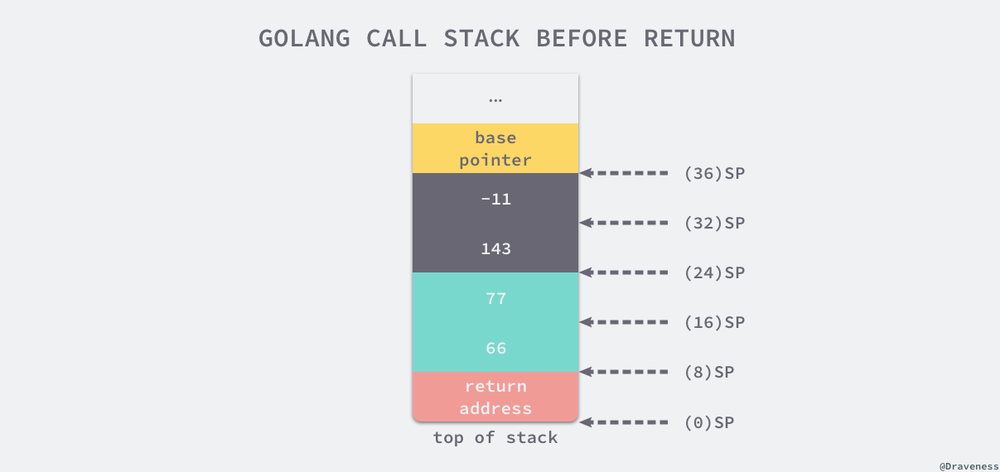

# Go Function

> Go 函数

## Function

Go 代码中的基本功能逻辑单元：函 数。 

函数是现代编程语言的基本语法元素，无论是在命令式语言、面向对象语言还 是动态脚本语言中，函数都位列 C 位。 

在 Go 语言中，函数是唯一一种基于特定输入，实现特定任务并可返回 任务执行结果的代码块（**Go 语言中的方法本质上也是函数**）。如果忽略 Go 包在 Go 代码组织层面的作用，可以说 **Go 程序就是一组函数的集合**，实际上，日常的 Go 代 码编写大多都集中在实现某个函数上。 

但“一龙生九子，九子各不同”！虽然各种编程语言都加入了函数这个语法元素，但各个语言中函数的形式与特点又有不同。那么 Go 语言中函数又有哪些独特之处呢？

### Go 函数与函数声明 

函数对应的英文单词是 Function，Function 这个单词原本是功能、职责的意思。编程语 言使用 Function 这个单词，表示将一个大问题分解后而形成的、若干具有特定功能或职责 的小任务，可以说十分贴切。

函数代表的小任务可以在一个程序中被多次使用，甚至可以 在不同程序中被使用，因此函数的出现也提升了整个程序界代码复用的水平。 

那 Go 语言中，函数相关的语法形式是怎样的呢？

#### Go 函数声明

先来看最常用的 Go 函数声明。 在 Go 中，定义一个函数的最常用方式就是使用函数声明。以 Go 标准库 fmt 包 提供的 Fprintf 函数为例，看一下一个普通 Go 函数的声明长啥样：


一个 Go 函数的声明由五部分组成，一个个来拆解一下。 

- 第一部分是**关键字 func**，
  - Go 函数声明必须以关键字 func 开始。
- 第二部分是**函数名**。
  - 函数名是指代函数定义的标识符，函数声明后，会通过函数名这个标识符来使用这个函数。
  - 在同一个 Go 包中，函数名应该是唯一的，
  - 并且它也遵守 Go 标识符的导出规则，也就是之前说的，**首字母大写的函数名指代的函数是可以在包外使用的**，**小写的就只在包内可见**。 
- 第三部分是**参数列表**。
  - 参数列表中声明了将要在函数体中使用的各个参数。
  - 参数列表 紧接在函数名的后面，并用一个括号包裹。它使用逗号作为参数间的分隔符，而且每个参 数的参数名在前，参数类型在后，这和变量声明中变量名与类型的排列方式是一致的。 
  - 另外，Go 函数支持变长参数，也就是一个形式参数可以对应数量不定的实际参数。 
  - Fprintf 就是一个支持变长参数的函数，可以看到它第三个形式参数 a 就是一个变长参 数，而且变长参数与普通参数在声明时的不同点，就在于它会在类型前面增加了一 个“…”符号。
- 第四部分是**返回值列表**。
  - 返回值承载了函数执行后要返回给调用者的结果，返回值列表声 明了这些返回值的类型，返回值列表的位置紧接在参数列表后面，两者之间用一个空格隔 开。
  - 不过，上图中比较特殊，Fprintf 函数的返回值列表不仅声明了返回值的类型，还声明 了返回值的名称，这种返回值被称为**具名返回值**。多数情况下，不需要这么做，只需 声明返回值的类型即可。 
- 最后，放在一对大括号内的是**函数体**，函数的具体实现都放在这里。
  - 不过，函数声明中的 **函数体是可选的**。如果没有函数体，说明这个函数可能是在 Go 语言之外实现的，比如使用汇编语言实现，然后通过链接器将实现与声明中的函数名链接到一起。
  - 没有函数体的函 数声明是更高级的话题。 

看到这里，可能会问：同为声明，为啥函数声明与之前学过的变量声明在形式上差距这 么大呢? 变量声明中的变量名、类型名和初值与上面的函数声明是怎么对应的呢？ 

#### 函数的变量声明形式

为了更好地理解函数声明，这里就横向对比一下，把上面的函数声明**等价转换为变量声明的形式**看看：


转换后的代码不仅和之前的函数声明是等价的，而且这也是完全合乎 Go 语法规则的代码。

对照一下这两张图，是不是有一种豁然开朗的感觉呢？这不就是在声明一个类型为 函数类型的变量吗！

函数声明中的函数名其实就是变量名，函数声明中的 func 关键字、参数列表和 返回值列表共同构成了**函数类型**。而参数列表与返回值列表的组合也被称为**函数签名**，它 是决定两个函数类型是否相同的决定因素。

因此，函数类型也可以看成是由 func 关键字与 函数签名组合而成的。

 通常，在表述函数类型时，会**省略**函数签名参数列表中的参数名，以及返回值列表中 的返回值变量名。

比如上面 Fprintf 函数的函数类型是：

```go
func (io.Writer, string, ...interface {}) (int, error)
```

这样，如果两个函数类型的函数签名是相同的，即便参数列表中的参数名，以及返回值列 表中的返回值变量名都是不同的，那么这**两个函数类型也是相同类型**，比如下面两个函数类型：

```go
func (a int, b string) (results []string, err error)
func (c int, d string) (sl []string, err error)
```

如果把这两个函数类型的参数名与返回值变量名省略，那它们都是`func (int, string) ([]string, error)`，因此它们是相同的函数类型。 

可以得到这样一个结论：每个函数声明所定义的函数，仅仅是对应的函数类 型的一个实例，就像var a int = 13这个变量声明语句中 a 是 int 类型的一个实例一 样。 

使用复合类型字面值对结构体类型变量进行显式初始化，和用变量声明来声明函数变量的形式，都以最简化的样子表现出来，看下面代码：

```go
s := T{}        // 使用复合类型字面值对结构体类型T的变量进行显式初始化
f := func () {} // 使用变量声明形式的函数声明
```

这里，T{}被称为复合类型字面值，那么处于同样位置的 func(){}是什么呢？Go 语言也为它 准备了一个名字，叫“**函数字面值（Function Literal）**”。

可以看到，函数字面值由函数类型与函数体组成，它特别像一个没有函数名的函数声明，因此也叫它**匿名函 数**。匿名函数在 Go 中用途很广。 

可能会想：既然是等价的，那以后就用这种变量声明的形式来声明一个函数吧。万万不可！这里只是为了理解函数声明做了一个等价变换。

在 Go 中的绝大 多数情况，还是会通过**传统的函数声明来声明一个特定函数类型的实例**，也就是俗称的“定义一个函数”。 


#### 函数参数

函数参数列表中的参数，是函数声明的、用于函数体实现的局部变量。由于函数分为声明 与使用两个阶段，在不同阶段，参数的称谓也有不同。

- 在函数**声明阶段**，把参数列表中的参数叫做**形式参数**（Parameter，简称形参），在函数体中，使用的都是形参； 
- 而在函数**实际调用**时传入的参数被称为**实际参数**（Argument，简称实参）。

为了便于直观理解，绘制了这张示意图，可以参考一下：


当实际调用函数的时候，实参会传递给函数，并和形式参数逐一绑定，编译器会根据各个形参的类型与数量，来检查传入的实参的类型与数量是否匹配。只有匹配，程序才能 继续执行函数调用，否则编译器就会报错。 

Go 语言中，函数参数传递采用是**值传递**的方式。

- 所谓“值传递”，就是将实际参数在内存中的表示**逐位拷贝（Bitwise Copy）到形式参数中**。
- 对于像**整型、数组、结构体**这类类型，它们的内存表示就是它们自身的数据内容，因此当这些类型作为实参类型时，值传递拷贝的就是它们自身，传递的开销也与它们自身的大小成正比。 
- 但是像 **string、切片、map** 这些类型就不是了，它们的内存表示对应的是它们数据内容的“描述符”。当这些类型作为实参类型时，值传递拷贝的也是它们数据内容的“描述符”，不包括数据内容本身，所以这些类型传递的开销是固定的，与数据内容大小无关。 这种只拷贝“描述符”，不拷贝实际数据内容的拷贝过程，也被称为**“浅拷贝”**。 

不过函数参数的传递也有两个例外，

- 当函数的**形参为接口类型**，或者形参是**变长参数**时， 简单的值传递就不能满足要求了，这时 Go 编译器会介入：
- 对于类型为接口类型的形参， Go 编译器会把传递的实参赋值给对应的接口类型形参；
- 对于为变长参数的形参，Go 编译 器会将零个或多个实参按一定形式转换为对应的变长形参。

那么这里，零个或多个传递给变长形式参数的实参，被 Go 编译器转换为何种形式了呢？ 通过下面示例代码来看一下：

```go
func myAppend(sl []int, elems ...int) []int {
   fmt.Printf("%T\n", elems) // []int
   if len(elems) == 0 {
      println("no elems to append")
      return sl
   }
   
   sl = append(sl, elems...)
   return sl
}

func main() {
   sl := []int{1, 2, 3}
   sl = myAppend(sl) // no elems to append
   fmt.Println(sl)   // [1 2 3]
   sl = myAppend(sl, 4, 5, 6)
   fmt.Println(sl) // [1 2 3 4 5 6]
}
```

重点看一下代码中的 myAppend 函数，这个函数基于 append，实现了向一个整型切片追加数据的功能。它支持变长参数，它的第二个形参 elems 就是一个变长参数。 

myAppend 函数通过 Printf 输出了变长参数的类型。执行这段代码，将看到变长参数 elems 的类型为[]int。 

这也就说明，在 Go 中，**变长参数实际上是通过切片来实现的**。所以，在函数体中， 就可以使用切片支持的所有操作来操作变长参数，这会大大简化了变长参数的使用复杂 度。比如 myAppend 中，使用 len 函数就可以获取到传给变长参数的实参个数。 


#### 函数支持多返回值 

和其他主流静态类型语言，比如 C、C++ 和 Java 不同，Go 函数支持多返回值。

多返回值可以让函数将更多结果信息返回给它的调用者，Go 语言的错误处理机制很大程度就是建立在多返回值的机制之上的。

函数返回值列表从形式上看主要有三种：

```go
func foo()                      // 无返回值
func foo() error                // 仅有一个返回值
func foo() (int, string, error) // 有2或2个以上返回值
```

- 如果一个函数没有显式返回值，那么可以像第一种情况那样，在函数声明中省略返回值列表。
- 而且，如果一个函数仅有一个返回值，那么通常在函数声明中，就不需要将 返回值用括号括起来，
- 如果是 2 个或 2 个以上的返回值，那还是需要用括号括起来的。 

在函数声明的返回值列表中，通常会像上面例子那样，仅列举返回值的类型，但也可以像 fmt.Fprintf 函数的返回值列表那样，为每个返回值声明变量名，这种带有名字的返回值被称为**具名返回值（Named Return Value）**。这种具名返回值变量可以像函数体 中声明的局部变量一样在函数体内使用。 

那么在日常编码中，究竟该使用普通返回值形式，还是具名返回值形式呢？ 

- Go 标准库以及大多数项目代码中的函数，都选择了**使用普通的非具名返回值形式**。

- 但在一些**特定场景**下，具名返回值也会得到应用。

  - 比如，当函数使用 defer，而且还在 defer 函数中修改外部函数返回值时，具名返回值可以让代码显得更优雅清晰。

  - 再比如，当函数的返回值个数较多时，每次显式使用 return 语句时都会接一长串返回值， 这时，用具名返回值可以让函数实现的可读性更好一些，

  - 比如下面 Go 标准库 **time 包 中的 parseNanoseconds 函数**就是这样：

  - ```go
    // time/format.go
    func parseNanoseconds(value string, nbytes int) (ns int, rangeErrString string, err error) {
       if value[0] != '.' {
          err = errBad
          return
       }
       if ns, err = atoi(value[1:nbytes]); err != nil {
          return
       }
       if ns < 0 || 1e9 <= ns {
          rangeErrString = "fractional second"
          return
       }
    
       scaleDigits := 10 - nbytes
       for i := 0; i < scaleDigits; i++ {
          ns *= 10
       }
       return
    }
    ```


### 函数是“一等公民” 

这个特点就是，函数在 Go 语言中属于“**一等公民（First-Class Citizen）**”。并不是在所有编程语言中函数都是“一等公民”。 

那么，什么是编程语言的“一等公民”呢？关于这个名词，业界和教科书都没有给出精准的定义。这里可以引用一下 wiki 发明人、C2 站点作者沃德·坎宁安 (Ward Cunningham)对“一等公民”的解释：

> 如果一门编程语言对某种语言元素的创建和使用没有限制，可以像对待值（value） 一样对待这种语法元素，那么就称这种语法元素是这门编程语言的“一等公民”。 拥有“一等公民”待遇的语法元素可以存储在变量中，可以作为参数传递给函数，可以在函数内部创建并可以作为返回值从函数返回。

基于这个解释，来看看 Go 语言的函数作为“一等公民”，表现出的各种行为特征。

#### 特征一：Go 函数可以存储在变量中

按照沃德·坎宁安对一等公民的解释，身为一等公民的语法元素是可以存储在变量中的。

其实，这点在前面理解函数声明时已经验证过了，这里再用例子简单说明一下：

```go
package main

import (
   "fmt"
   "io"
   "os"
)

var (
   myFprintf = func(w io.Writer, format string, a ...interface{}) (int, error) {
      return fmt.Fprintf(w, format, a...)
   }
)

func main() {
   fmt.Printf("%T\n", myFprintf)             // func(io.Writer, string, ...interface {}) (int, error)
   myFprintf(os.Stdout, "%s\n", "Hello, Go") // 输出 Hello，Go
}
```

在这个例子中，把新创建的一个匿名函数赋值给了一个名为 myFprintf 的变量，通过 这个变量，便可以调用刚刚定义的匿名函数。

然后再通过 Printf 输出 myFprintf 变量的类型，也会发现结果与预期的函数类型是相符的。 

#### 特征二：支持在函数内创建并通过返回值返回

Go 函数不仅可以在函数外创建，还可以在函数内创建。而且由于函数可以存储在变量中， 所以函数也可以在创建后，作为函数返回值返回。来看下面这个例子：

```go
func setup(task string) func() {
   println("do some setup stuff for", task)
   return func() {
      println("do some teardown stuff for", task)
   }
}

func main() {
   teardown := setup("demo")
   defer teardown()
   println("do some bussiness stuff")
}
```

这个例子，模拟了执行一些重要逻辑之前的**上下文建立（setup）**，以及之后的上下文拆除 （teardown）。

在一些**单元测试的代码**中，也经常会在执行某些用例之前，建立此次执行的上下文（setup），并在这些用例执行后拆除上下文（teardown），避免这次执行对后续用例执行的干扰。 

在这个例子中，在 setup 函数中创建了这次执行的上下文拆除函数，并通过返回值的形式，将这个拆除函数返回给了 setup 函数的调用者。

setup 函数的调用者，在执行完对应这次执行上下文的重要逻辑后，再调用 setup 函数返回的拆除函数，就可以完成对上下文的拆除了。 

从这段代码中也可以看到，setup 函数中创建的拆除函数也是一个匿名函数，但和前面看到的匿名函数有一个不同，这个不同就在于这个**匿名函数使用了定义它的函数 setup 的局部变量 task**，这样的匿名函数在 Go 中也被称为**闭包（Closure）**。 

闭包本质上就是一个匿名函数或叫函数字面值，它们可以引用它的包裹函数，也就是创建它们的函数中定义的**变量**。然后，这些变量在包裹函数和匿名函数之间共享，只要闭包可以被访问，这些共享的变量就会继续存在。

显然，Go 语言的闭包特性也是建立在“函数是 一等公民”特性的基础上的。

#### 特征三：作为参数传入函数

既然函数可以存储在变量中，也可以作为返回值返回，那可以理所当然地想到，把函数作为参数传入函数也是可行的。

比如在日常编码时经常使用、标准库 **time 包的 AfterFunc 函数**，就是一个接受函数类型参数的典型例子。

可以看看下面这行代码，这里通过 AfterFunc 函数设置了一个 2 秒的定时器，并传入时间到了后要执行的函数。这里传入的就是一个匿名函数：

```go
time.AfterFunc(time.Second*2, func () { println("timer fired") })
```

#### 特征四：拥有自己的类型

作为一等公民的整型值拥有自己的类型 int，而这个整型值只是类型 int 的一个实例，其他作为一等公民的字符串值、布尔值等类型也都拥有自己类型。那函数呢？ 

在讲解函数声明时，曾得到过这样一个结论：每个函数声明定义的函数仅仅是对 应的函数类型的一个实例，就像var a int = 13这个变量声明语句中的 a，只是 int 类型的一个实例一样。

换句话说，每个函数都和整型值、字符串值等一等公民一样，拥有自己的类型，也就是讲过的函数类型。

甚至可以**基于函数类型来自定义类型**，就像基于整型、字符串类型等类型来自定义类型一样。下面代码中的 HandlerFunc、visitFunc 就是 Go 标准库中，基于函数类型进行自定义的类型：

```go
// net/http/server.go
type HandlerFunc func(ResponseWriter, *Request)

// sort/genzfunc.go
type visitFunc func(ast.Node) ast.Visitor
```

可以看到，Go 函数确实表现出了沃德·坎宁安诠释中“一等公民”的所有特征：Go 函数可以存储在变量中，可以在函数内创建并通过返回值返回，可以作为参数传递给其他函数，可以拥有自己的类型。

通过这些分析，也能感受到，和 C/C++ 等语言中的函数相比，作为“一等公民”的 Go 函数拥有难得的灵活性。 那么在实际生产中，怎么才能发挥出这种灵活性的最大效用，写出更加优雅 简洁的 Go 代码呢？

### 函数“一等公民”特性的高效运用 

#### 应用一：函数类型的妙用 

Go 函数是“一等公民”，也就是说，它拥有自己的类型。

而且，整型、字符串型等所有类型都可以进行的操作，比如**显式转型**，也同样可以用在函数类型上面，也就是说，函数也可以被显式转型。并且，这样的转型在特定的领域具有奇妙的作用，一个最为典型的示例 就是**标准库 http 包中的 HandlerFunc 这个类型**。

来看一个使用了这个类型的例子：

```go
func greeting(w http.ResponseWriter, r *http.Request) {
   fmt.Fprintf(w, "Welcome, Gopher!\n")
}
func main() {
   http.ListenAndServe(":8080", http.HandlerFunc(greeting))
}
```

这日常最常见的、用 Go 构建 Web Server 的例子。

它的工作机制也很简单，就是当用户通过浏览器，或者类似 curl 这样的命令行工具，访问 Web server 的 8080 端口时， 会收到“Welcome, Gopher!”这样的文字应答。

可以使用 http 包编写 web server 的方法，先来看一下 **http 包的函数 ListenAndServe 的源码**：

```go
// net/http/server.go
func ListenAndServe(addr string, handler Handler) error {
	server := &Server{Addr: addr, Handler: handler}
	return server.ListenAndServe()
}
```

函数 ListenAndServe 会把来自客户端的 http 请求，交给它的第二个参数 handler 处理， 而这里 handler 参数的类型 http.Handler，是一个自定义的接口类型，它的源码是这样 的：

```go
// net/http/server.go
type Handler interface {
   ServeHTTP(ResponseWriter, *Request)
}
```

接口是一组方法的集合，这个接口只有一个方法 ServeHTTP，它的函数类型是func(http.ResponseWriter, *http.Request)。这和自己定义的 http 请求处理函数 greeting 的类型是一致的， 但是**没法直接将 greeting 作为参数值传入**，否则编译器会报错：

```go
func(http.ResponseWriter, *http.Request) does not implement http.Handler (missing ServeHTTP method)
```

这里，编译器提示，函数 greeting 还没有实现接口 Handler 的方法，无法将它赋值给 Handler 类型的参数。

现在再回过头来看下代码，代码中也没有直接将greeting 传给 ListenAndServe 函数，而是将http.HandlerFunc(greeting)作为参数传给了 ListenAndServe。

那这个 http.HandlerFunc 究竟是什么呢？直接来看一下 它的源码：

```go
// net/http/server.go
type HandlerFunc func(ResponseWriter, *Request)

// ServeHTTP calls f(w, r).
func (f HandlerFunc) ServeHTTP(w ResponseWriter, r *Request) {
	f(w, r)
}
```

通过它的源码看到，HandlerFunc 是一个基于函数类型定义的新类型，它的底层类型为函数类型func(ResponseWriter, *Request)。

这个类型有一个方法 ServeHTTP， 然后实现了 Handler 接口。也就是说http.HandlerFunc(greeting)这句代码的真正含义，是**将函数 greeting 显式转换为 HandlerFunc 类型，后者实现了 Handler 接口**，满足 ListenAndServe 函数第二个参数的要求。 

> 大概意思明白，但是这块的更深入的调用不明白！

另外，之所以http.HandlerFunc(greeting)这段代码可以通过编译器检查，正是因为 HandlerFunc 的底层类型是func(ResponseWriter, *Request)，与 greeting 函数的类型是一致的，这和下面**整型变量的显式转型原理**也是一样的：

```go
type MyInt int

var x int = 5
y := MyInt(x) // MyInt的底层类型为int，类比HandlerFunc的底层类型为func(ResponseWriter, *Request)
```

#### 应用二：利用闭包简化函数调用

Go 闭包是在函数内部创建的匿名函数，这个匿名函数可以访问创建它的函数的参数与局部变量。

可以利用闭包的这一特性来简化函数调用，这里看一个具 体例子：

```go
func times(x, y int) int {
   return x * y
}
```

在上面的代码中，times 函数用来进行两个整型数的乘法。使用 times 函数的时候需要传入两个实参，比如：

```go
times(2, 5) // 计算2 x 5
times(3, 5) // 计算3 x 5
times(4, 5) // 计算4 x 5
```

不过，有些场景存在一些高频使用的乘数，这个时候就没必要每次都传入这样的高频乘数了。

那怎样能省去高频乘数的传入呢? 看看下面这个新函数 partialTimes：

```go
func partialTimes(x int) func(int) int {
   return func(y int) int {
      return times(x, y)
   }
}
```

这里，partialTimes 的返回值是一个接受单一参数的函数，这个由 partialTimes 函数生成的匿名函数，使用了 partialTimes 函数的参数 x。

按照前面的定义，这个匿名函数就是一 个闭包。partialTimes 实质上就是用来生成以 x 为固定乘数的、接受另外一个乘数作为参 数的、闭包函数的函数。

当程序调用 partialTimes(2) 时，partialTimes 实际上返回了一个调用 times(2,y) 的函数，这个过程的逻辑类似于下面代码：

```go
var timesTwo = func (y int) int {
	return times(2, y)
}
```

这个时候，再看看如何使用 partialTimes，分别生成以 2、3、4 为固定高频乘数的乘 法函数，以及这些生成的乘法函数的使用方法：

```go
func main() {
   // 高级方式
   timesTwo := partialTimes(2)   // 以高频乘数2为固定乘数的乘法函数
   timesThree := partialTimes(3) // 以高频乘数3为固定乘数的乘法函数
   timesFour := partialTimes(4)  // 以高频乘数4为固定乘数的乘法函数
   fmt.Println(timesTwo(5))      // 10，等价于times(2, 5)
   fmt.Println(timesTwo(6))      // 12，等价于times(2, 6)
   fmt.Println(timesThree(5))    // 15，等价于times(3, 5)
   fmt.Println(timesThree(6))    // 18，等价于times(3, 6)
   fmt.Println(timesFour(5))     // 20，等价于times(4, 5)
   fmt.Println(timesFour(6))     // 24，等价于times(4, 6)
}
```

可以看到，通过 partialTimes，生成了三个带有固定乘数的函数。这样，在计 算乘法时，就可以减少参数的重复输入。

>partialTimes 的例子就是传说中的柯里化

看到这里可能会说，这种简化的程度十分有限啊！ 不是的。这里只是举了一个比较好理解的简单例子，在那些动辄就有 5 个以上参数的复杂函数中，减少参数的重复输入给开发人员带去的收益，可要比这个简单的例子大得多。 


### 函数调用惯例源码解析

无论是系统级编程语言 C 和 Go，还是脚本语言 Ruby 和 Python，这些编程语言在调用函数时往往都使用相同的语法：

```c
somefunction(arg0, arg1)
```

虽然它们调用函数的语法很相似，但是它们的调用惯例却可能大不相同。**调用惯例是调用方和被调用方对于参数和返回值传递的约定**。

#### C 语言

先来研究 C 语言的调用惯例，使用 [gcc](https://gcc.gnu.org/) 或者 [clang](https://clang.llvm.org/) 将 C 语言编译成汇编代码是分析其调用惯例的最好方法，从汇编语言中可以了解函数调用的具体过程。

gcc 和 clang 编译相同 C 语言代码可能会生成不同的汇编指令，不过生成的代码在结构上不会有太大的区别，所以对只想理解调用惯例的人来说没有太多影响。

选择使用 gcc 编译器来编译 C 语言：

```bash
$ gcc --version
gcc (Ubuntu 4.8.2-19ubuntu1) 4.8.2
Copyright (C) 2013 Free Software Foundation, Inc.
This is free software; see the source for copying conditions.  There is NO
warranty; not even for MERCHANTABILITY or FITNESS FOR A PARTICULAR PURPOSE.
```

假设有以下的 C 语言代码，代码中只包含两个函数，其中一个是主函数 `main`，另一个是定义的函数 `my_function`：

```c
// ch04/my_function.c
int my_function(int arg1, int arg2) {
    return arg1 + arg2;
}

int main() {
    int i = my_function(1, 2);
}
```

可以使用 `cc -S my_function.c` 命令将上述文件编译成如下所示的汇编代码：

```c
main:
	pushq	%rbp
	movq	%rsp, %rbp
	subq	$16, %rsp
	movl	$2, %esi  // 设置第二个参数
	movl	$1, %edi  // 设置第一个参数
	call	my_function
	movl	%eax, -4(%rbp)
my_function:
	pushq	%rbp
	movq	%rsp, %rbp
	movl	%edi, -4(%rbp)    // 取出第一个参数，放到栈上
	movl	%esi, -8(%rbp)    // 取出第二个参数，放到栈上
	movl	-8(%rbp), %eax    // eax = esi = 1
	movl	-4(%rbp), %edx    // edx = edi = 2
	addl	%edx, %eax        // eax = eax + edx = 1 + 2 = 3
	popq	%rbp
```

按照调用前、调用时以及调用后的顺序分析上述调用过程：

- 在 `my_function` 调用前，调用方 `main` 函数将 `my_function` 的两个参数分别存到 edi 和 esi 寄存器中；
- 在 `my_function` 调用时，它会将寄存器 edi 和 esi 中的数据存储到 eax 和 edx 两个寄存器中，随后通过汇编指令 `addl` 计算两个入参之和；
- 在 `my_function` 调用后，使用寄存器 eax 传递返回值，`main` 函数将 `my_function` 的返回值存储到栈上的 `i` 变量中；

```c
int my_function(int arg1, int arg2, int arg3, int arg4, int arg5, int arg6, int arg7, int arg8) {
    return arg1 + arg2 + arg3 + arg4 + arg5 + arg6 + arg7 + arg8;
}
```

如上述代码所示，当 `my_function` 函数的入参增加至八个时，重新编译当前程序可以会得到不同的汇编代码：

```c
main:
	pushq	%rbp
	movq	%rsp, %rbp
	subq	$16, %rsp     // 为参数传递申请 16 字节的栈空间
	movl	$8, 8(%rsp)   // 传递第 8 个参数
	movl	$7, (%rsp)    // 传递第 7 个参数
	movl	$6, %r9d
	movl	$5, %r8d
	movl	$4, %ecx
	movl	$3, %edx
	movl	$2, %esi
	movl	$1, %edi
	call	my_function
```

`main` 函数调用 `my_function` 时，前六个参数会使用 edi、esi、edx、ecx、r8d 和 r9d 六个寄存器传递。

**寄存器的使用顺序**也是调用惯例的一部分，函数的第一个参数一定会使用 edi 寄存器，第二个参数使用 esi 寄存器，以此类推。

最后的两个参数与前面的完全不同，调用方 `main` 函数通过栈传递这两个参数，下图展示了 `main` 函数在调用 `my_function` 前的栈信息：


**C 语言 main 函数的调用栈**

上图中 rbp 寄存器会存储函数调用栈的基址指针，即属于 `main` 函数的栈空间的起始位置，而另一个寄存器 rsp 存储的是 `main` 函数调用栈结束的位置，这两个寄存器共同表示了函数的栈空间。

在调用 `my_function` 之前，`main` 函数通过 `subq $16, %rsp` 指令分配了 16 个字节的栈地址，随后将第六个以上的参数按照从右到左的顺序存入栈中，即第八个和第七个，余下的六个参数会通过寄存器传递，接下来运行的 `call my_function` 指令会调用 `my_function` 函数：

```c
my_function:
	pushq	%rbp
	movq	%rsp, %rbp
	movl	%edi, -4(%rbp)    // rbp-4 = edi = 1
	movl	%esi, -8(%rbp)    // rbp-8 = esi = 2
	...
	movl	-8(%rbp), %eax    // eax = 2
	movl	-4(%rbp), %edx    // edx = 1
	addl	%eax, %edx        // edx = eax + edx = 3
	...
	movl	16(%rbp), %eax    // eax = 7
	addl	%eax, %edx        // edx = eax + edx = 28
	movl	24(%rbp), %eax    // eax = 8
	addl	%edx, %eax        // edx = eax + edx = 36
	popq	%rbp
```

`my_function` 会先将寄存器中的全部数据转移到栈上，然后利用 eax 寄存器计算所有入参的和并返回结果。

简单总结：当在 x86_64 的机器上使用 C 语言中调用函数时，参数都是通过寄存器和栈传递的，其中：

- 六个以及六个以下的参数会按照顺序分别使用 edi、esi、edx、ecx、r8d 和 r9d 六个寄存器传递；
- 六个以上的参数会使用栈传递，函数的参数会以从右到左的顺序依次存入栈中；

而函数的返回值是通过 eax 寄存器进行传递的，**由于只使用一个寄存器存储返回值，所以 C 语言的函数不能同时返回多个值**。


#### Go 语言

分析了 C 语言函数的调用惯例之后，再来剖析一下 Go 语言函数的调用惯例。

以下面这个非常简单的代码片段为例简单分析一下：

```go
package main

func myFunction(a, b int) (int, int) {
	return a + b, a - b
}

func main() {
	myFunction(66, 77)
}
```

上述的 `myFunction` 函数接受两个整数并返回两个整数，`main` 函数在调用 `myFunction` 时将 66 和 77 两个参数传递到当前函数中，使用 `go tool compile -S -N -l main.go` 编译上述代码可以得到如下所示的汇编指令：

> 如果编译时不使用 -N -l 参数，编译器会对汇编代码进行优化，编译结果会有较大差别。

```go
$go tool compile -S -N -l main.go
....
"".main STEXT size=68 args=0x0 locals=0x28
	0x0000 00000 (main.go:7)	MOVQ	(TLS), CX
	0x0009 00009 (main.go:7)	CMPQ	SP, 16(CX)
	0x000d 00013 (main.go:7)	JLS	61
	0x000f 00015 (main.go:7)	SUBQ	$40, SP      // 分配 40 字节栈空间
	0x0013 00019 (main.go:7)	MOVQ	BP, 32(SP)   // 将基址指针存储到栈上
	0x0018 00024 (main.go:7)	LEAQ	32(SP), BP
	0x001d 00029 (main.go:8)	MOVQ	$66, (SP)    // 第一个参数
	0x0025 00037 (main.go:8)	MOVQ	$77, 8(SP)   // 第二个参数
	0x002e 00046 (main.go:8)	CALL	"".myFunction(SB)
	0x0033 00051 (main.go:9)	MOVQ	32(SP), BP
	0x0038 00056 (main.go:9)	ADDQ	$40, SP
	0x003c 00060 (main.go:9)	RET
```

根据 `main` 函数生成的汇编指令，可以分析出 `main` 函数调用 `myFunction` 之前的栈：


**Go 语言 main 函数的调用栈**

`main` 函数通过 `SUBQ $40, SP` 指令一共在栈上分配了 40 字节的内存空间：

| 空间          | 大小    | 作用                           |
| ------------- | ------- | ------------------------------ |
| SP+32 ~ BP    | 8 字节  | `main` 函数的栈基址指针        |
| SP+16 ~ SP+32 | 16 字节 | 函数 `myFunction` 的两个返回值 |
| SP ~ SP+16    | 16 字节 | 函数 `myFunction` 的两个参数   |

**主函数调用栈**

`myFunction` 入参的压栈顺序和 C 语言一样，都是从右到左，即第一个参数 66 在栈顶的 SP ~ SP+8，第二个参数存储在 SP+8 ~ SP+16 的空间中。

当准备好函数的入参之后，会调用汇编指令 `CALL "".myFunction(SB)`，这个指令首先会将 `main` 的返回地址存入栈中，然后改变当前的栈指针 SP 并执行 `myFunction` 的汇编指令：

```go
"".myFunction STEXT nosplit size=49 args=0x20 locals=0x0
	0x0000 00000 (main.go:3)	MOVQ	$0, "".~r2+24(SP) // 初始化第一个返回值
	0x0009 00009 (main.go:3)	MOVQ	$0, "".~r3+32(SP) // 初始化第二个返回值
	0x0012 00018 (main.go:4)	MOVQ	"".a+8(SP), AX    // AX = 66
	0x0017 00023 (main.go:4)	ADDQ	"".b+16(SP), AX   // AX = AX + 77 = 143
	0x001c 00028 (main.go:4)	MOVQ	AX, "".~r2+24(SP) // (24)SP = AX = 143
	0x0021 00033 (main.go:4)	MOVQ	"".a+8(SP), AX    // AX = 66
	0x0026 00038 (main.go:4)	SUBQ	"".b+16(SP), AX   // AX = AX - 77 = -11
	0x002b 00043 (main.go:4)	MOVQ	AX, "".~r3+32(SP) // (32)SP = AX = -11
	0x0030 00048 (main.go:4)	RET
```

从上述的汇编代码中可以看出，当前函数在执行时首先会将 `main` 函数中预留的两个返回值地址置成 `int` 类型的默认值 0，然后根据栈的相对位置获取参数并进行加减操作并将值存回栈中，在 `myFunction` 函数返回之间，栈中的数据如下图所示：



**myFunction 函数返回前的栈**

在 `myFunction` 返回后，`main` 函数会通过以下的指令来恢复栈基址指针并销毁已经失去作用的 40 字节栈内存：

```go
    0x0033 00051 (main.go:9)    MOVQ    32(SP), BP
    0x0038 00056 (main.go:9)    ADDQ    $40, SP
    0x003c 00060 (main.go:9)    RET
```

通过分析 Go 语言编译后的汇编指令，发现 Go 语言**使用栈传递参数和接收返回值，所以它只需要在栈上多分配一些内存就可以返回多个值**。


#### 对比

C 语言和 Go 语言在设计函数的调用惯例时选择了不同的实现。C 语言同时使用寄存器和栈传递参数，使用 eax 寄存器传递返回值；而 Go 语言使用栈传递参数和返回值。

可以对比一下这两种设计的优点和缺点：

- C 语言的方式能够极大地减少函数调用的额外开销，但是也增加了实现的复杂度；
  - CPU 访问栈的开销比访问寄存器高几十倍；
  - 需要单独处理函数参数过多的情况；
- Go 语言的方式能够降低实现的复杂度并支持多返回值，但是牺牲了函数调用的性能；
  - 不需要考虑超过寄存器数量的参数应该如何传递；
  - 不需要考虑不同架构上的寄存器差异；
  - 函数入参和出参的内存空间需要在栈上进行分配；

Go 语言使用栈作为参数和返回值传递的方法是综合考虑后的设计，选择这种设计意味着编译器会更加简单、更容易维护。


### 函数参数传递源码解析

除了函数的调用惯例之外，Go 语言在传递参数时是传值还是传引用也是一个有趣的问题，不同的选择会影响在函数中修改入参时是否会影响调用方看到的数据。

先来介绍一下传值和传引用两者的区别：

- 传值：函数调用时会对参数进行拷贝，被调用方和调用方两者持有不相关的两份数据；
- 传引用：函数调用时会传递参数的指针，被调用方和调用方两者持有相同的数据，任意一方做出的修改都会影响另一方。

不同语言会选择不同的方式传递参数，Go 语言选择了传值的方式，**无论是传递基本类型、结构体还是指针，都会对传递的参数进行拷贝**。

#### 整型和数组

先来分析 Go 语言是如何传递基本类型和数组的。

如下所示的函数 `myFunction` 接收了两个参数，整型变量 `i` 和数组 `arr`，这个函数会将传入的两个参数的地址打印出来，在最外层的主函数也会在 `myFunction` 函数调用前后分别打印两个参数的地址：

```go
func myFunction(i int, arr [2]int) {
	fmt.Printf("in my_funciton - i=(%d, %p) arr=(%v, %p)\n", i, &i, arr, &arr)
}

func main() {
	i := 30
	arr := [2]int{66, 77}
	fmt.Printf("before calling - i=(%d, %p) arr=(%v, %p)\n", i, &i, arr, &arr)
	myFunction(i, arr)
	fmt.Printf("after  calling - i=(%d, %p) arr=(%v, %p)\n", i, &i, arr, &arr)
}

$ go run main.go
before calling - i=(30, 0xc00009a000) arr=([66 77], 0xc00009a010)
in my_funciton - i=(30, 0xc00009a008) arr=([66 77], 0xc00009a020)
after  calling - i=(30, 0xc00009a000) arr=([66 77], 0xc00009a010)
```

当通过命令运行这段代码时会发现，`main` 函数和被调用者 `myFunction` 中参数的地址是完全不同的。

不过从 `main` 函数的角度来看，在调用 `myFunction` 前后，整数 `i` 和数组 `arr` 两个参数的地址都没有变化。

那么如果在 `myFunction` 函数内部对参数进行修改是否会影响 `main` 函数中的变量呢？这里更新 `myFunction` 函数并重新执行这段代码：

```go
func myFunction(i int, arr [2]int) {
	i = 29
	arr[1] = 88
	fmt.Printf("in my_funciton - i=(%d, %p) arr=(%v, %p)\n", i, &i, arr, &arr)
}

$ go run main.go
before calling - i=(30, 0xc000072008) arr=([66 77], 0xc000072010)
in my_funciton - i=(29, 0xc000072028) arr=([66 88], 0xc000072040)
after  calling - i=(30, 0xc000072008) arr=([66 77], 0xc000072010)
```

可以看到在 `myFunction` 中对参数的修改也仅仅影响了当前函数，并没有影响调用方 `main` 函数。

所以能得出如下结论：**Go 语言的整型和数组类型都是值传递的**，也就是在调用函数时会对内容进行拷贝。

需要注意的是如果当前数组的大小非常的大，这种传值的方式会对**性能**造成比较大的影响。


#### 结构体和指针

接下来继续分析 Go 语言另外两种常见类型 — 结构体和指针。

下面这段代码中定义了一个结构体 `MyStruct` 以及接受两个参数的 `myFunction` 方法：

```go
type MyStruct struct {
	i int
}

func myFunction(a MyStruct, b *MyStruct) {
	a.i = 31
	b.i = 41
	fmt.Printf("in my_function - a=(%d, %p) b=(%v, %p)\n", a, &a, b, &b)
}

func main() {
	a := MyStruct{i: 30}
	b := &MyStruct{i: 40}
	fmt.Printf("before calling - a=(%d, %p) b=(%v, %p)\n", a, &a, b, &b)
	myFunction(a, b)
	fmt.Printf("after calling  - a=(%d, %p) b=(%v, %p)\n", a, &a, b, &b)
}

$ go run main.go
before calling - a=({30}, 0xc000018178) b=(&{40}, 0xc00000c028)
in my_function - a=({31}, 0xc000018198) b=(&{41}, 0xc00000c038)
after calling  - a=({30}, 0xc000018178) b=(&{41}, 0xc00000c028)
```

从上述运行的结果可以得出如下结论：

- 传递结构体时：会拷贝结构体中的全部内容；
- 传递结构体指针时：会拷贝结构体指针；

修改结构体指针是改变了指针指向的结构体，`b.i` 可以被理解成 `(*b).i`，也就是先获取指针 `b` 背后的结构体，再修改结构体的成员变量。

简单修改上述代码，分析一下 **Go 语言结构体在内存中的布局**：

```go
type MyStruct struct {
	i int
	j int
}

func myFunction(ms *MyStruct) {
	ptr := unsafe.Pointer(ms)
	for i := 0; i < 2; i++ {
		c := (*int)(unsafe.Pointer((uintptr(ptr) + uintptr(8*i))))
		*c += i + 1
		fmt.Printf("[%p] %d\n", c, *c)
	}
}

func main() {
	a := &MyStruct{i: 40, j: 50}
	myFunction(a)
	fmt.Printf("[%p] %v\n", a, a)
}

$ go run main.go
[0xc000018180] 41
[0xc000018188] 52
[0xc000018180] &{41 52}
```

在这段代码中，通过指针修改结构体中的成员变量，结构体在内存中是一片连续的空间，指向结构体的指针也是指向这个结构体的首地址。

将 `MyStruct` 指针修改成 `int` 类型的，那么访问新指针就会返回整型变量 `i`，将指针移动 8 个字节之后就能获取下一个成员变量 `j`。

如果将上述代码简化成如下所示的代码片段并使用 `go tool compile` 进行编译会得到如下的结果：

```go
type MyStruct struct {
	i int
	j int
}

func myFunction(ms *MyStruct) *MyStruct {
	return ms
}

$ go tool compile -S -N -l main.go
"".myFunction STEXT nosplit size=20 args=0x10 locals=0x0
	0x0000 00000 (main.go:8)	MOVQ	$0, "".~r1+16(SP) // 初始化返回值
	0x0009 00009 (main.go:9)	MOVQ	"".ms+8(SP), AX   // 复制引用
	0x000e 00014 (main.go:9)	MOVQ	AX, "".~r1+16(SP) // 返回引用
	0x0013 00019 (main.go:9)	RET
```

在这段汇编语言中，发现当参数是指针时，也会使用 `MOVQ "".ms+8(SP), AX` 指令复制引用，然后将复制后的指针作为返回值传递回调用方。


**Go 语言指针参数**

所以将指针作为参数传入某个函数时，函数内部会复制指针，也就是会同时出现两个指针指向原有的内存空间，所以 Go 语言中传指针也是传值。


#### 传值

当验证了 Go 语言中大多数常见的数据结构之后，其实能够推测出 **Go 语言在传递参数时使用了传值的方式**，接收方收到参数时会对这些参数进行复制。

了解到这一点之后，在传递数组或者内存占用非常大的结构体时，应该尽量使**用指针作为参数类型来避免发生数据拷贝进而影响性能**。


### 小结 

Go 代码中的基本功能逻辑单元：函数。

函数这种语法元素的诞生，源于将大问题分解为若干小任务与代码复用。 Go 语言中定义一个函数的最常用方式就是使用函数声明。

函数声明虽然形式上与变量声明不同，但本质其实是一致的，可以通过一个等价转换，将函数声明转 换为一个以函数名为变量名、以函数字面值为初值的函数变量声明形式。这个转换是深入理解函数的关键。 

对函数字面值再进行了拆解。函数字面值是由函数类型与函数体组成的，而函数类型则是由 func 关键字 + 函数签名组成。

再拆解，函数签名又包括函数的参数列表与返回值列表。通常说函数签名时，会省去参数名与返回值变量名，只保留各自的类型信息。 函数签名相同的两个函数类型就是相同的函数类型。

而且，Go 函数采用值传递的方式进行参数传递，对于 string、切片、map 等类型参数来说，这种传递方式传递的仅是“描述符”信息，是一种“浅拷贝”，这点一定要牢记。 

Go 函数支持多返回值，Go 语言的错误处理机制就是建立在多返回值的基础上的。 

最后，与传统的 C、C++、Java 等静态编程语言中的函数相比，Go 函数的最大特点就是它属于 Go 语言的“一等公民”。Go 函数具备一切作为“一等公民”的行为特征，包括函数可以存储在变量中、支持函数内创建函数并通过返回值返回、支持作为参数传递给函数，以及拥有自己的类型等。

这些“一等公民”的特征，让 Go 函数表现出极大的灵活性。日常编码中，也可以利用这些特征进行一些巧妙的代码设计，让代码的实现更简化。 


### 错误处理的设计

多返回值是 Go 语言函数，区别于其他主流静态编程语言中函数的一个重要特点。同时，它也是 Go 语言设计者建构 Go 语言错误处理机制的基础，而错误处理设计也是函数设计的一个重要环节。 

将会从 Go 语言的错误处理机制入手，围绕 Go 语言错误处理机制的原理、Go 错误处理的常见策略，结合函数的多返回值机制进行错误处理的设计。

#### Go 语言是如何进行错误处理的？ 

采用什么错误处理方式，其实是一门编程语言在设计早期就要确定下来的基本机制，它在很大程度上影响着编程语言的语法形式、语言实现的难易程度，以及语言后续的演进方 向。

Go 语言继承了“先祖”C 语言的很多语法特性，在错误处理机制上也不例外，Go 语言错误处理机制也是在 C 语言错误处理机制基础上的再创新。 

从源头讲起，先看看前辈 C 语言的错误处理机制。在 C 语言中，通常**用一个类型为整型的函数返回值作为错误状态标识**，函数调用者会基于值比较的方式，对这一代表错误状态的返回值进行检视。

通常，这个返回值为 0，就代表函数调用成 功；如果这个返回值是其它值，那就代表函数调用出现错误。也就是说，函数调用者需要根据这个返回值代表的错误状态，来决定后续执行哪条错误处理路径上的代码。 

##### C 语言错误处理

C 语言的这种简单的、**基于错误值比较的错误处理机制**有什么优点呢？ 

- 首先，它让每个开发人员必须显式地去关注和处理每个错误，经过显式错误处理的代码会更健壮，也会让开发人员对这些代码更有信心。 
- 另外，也可以发现，这些错误就是普通的值，所以不需要用额外的语言机制去处理它们，只需利用已有的语言机制，像处理其他普通类型值一样的去处理错误就可以了，这也让代码更容易调试，更容易针对每个错误处理的决策分支进行测试覆盖。

C 语言 错误处理机制的这种简单与显式结合的特征，和 Go 语言设计哲学十分契合，于是 Go 语 言设计者决定继承 C 语言这种错误处理机制。 

不过 C 语言这种错误处理机制也有一些弊端。比如，由于 C 语言中的函数最多仅支持一个返回值，很多开发者会把这单一的返回值“一值多用”。什么意思呢？就是说，一个返回值，不仅要承载函数要返回给调用者的信息，又要承载函数调用的最终错误状态。

比如 **C 标准库中的fprintf函数的**返回值就承载了两种含义。

- 在正常情况下，它的返回值表示输出到 FILE 流中的字符数量，
- 但如果出现错误，这个返回值就变成了一个负数，代表具体的错误值：

```c
// stdio.h
int  fprintf(FILE * __restrict, const char * __restrict, ...) __printflike(2, 3);
```

特别是当返回值为其他类型，比如字符串的时候，还很难将它与错误状态融合到一起。这个时候，很多 C 开发人员要么使用输出参数，承载要返回给调用者的信息，要么自定义一个包含返回信息与错误状态的结构体，作为返回值类型。

大家做法不一，就很难形 成统一的错误处理策略。 为了避免这种情况，Go 函数增加了多返回值机制，来支持错误状态与返回信息的分离，并建议开发者把要返回给调用者的信息和错误状态标识，分别放在不同的返回值中。 

##### Go 语言错误处理

继续以上面 C 语言中的 fprintf 函数为例，Go 标准库中有一个和功能等同的 **fmt.Fprintf的函数**，这个函数就是使用一个独立的表示错误状态的返回值（如下面代码中的 err），解决了 fprintf 函数中错误状态值与返回信息耦合在一起的问题：

```go
// fmt/print.go
func Fprintf(w io.Writer, format string, a ...interface{}) (n int, err error) {
   p := newPrinter()
   p.doPrintf(format, a)
   n, err = w.Write(p.buf)
   p.free()
   return
}
```

在 fmt.Fprintf 中，返回值 n 用来表示写入 io.Writer 中的字节个数，返回值 err 表示这个函数调用的最终状态，如果成功，err 值就为 nil，不成功就为特定的错误值。 

另外还可以看到，fmt.Fprintf 函数声明中代表错误状态的变量 err 的类型，并不是一个传统使用的整数类型，而是用了一个名为 **error 的类型**。 

虽然，在 Go 语言中，依然可以像传统的 C 语言那样，用一个整型值来表示错误状态，但 Go 语言惯用法，是使用 error 这个接口类型表示错误，并且按惯例，通常将 error 类型返回值放在返回值列表的末尾，就像 fmt.Fprintf 函数声明中那样。


#### error 类型与错误值构造 

error 接口是 Go 原生内置的类型，它的定义如下：

```go
// builtin/builtin.go
type error interface {
   Error() string
}
```

任何实现了 error 的 Error 方法的类型的实例，都可以作为错误值赋值给 error 接口变量。 那这里，问题就来了：难道为了构造一个错误值，还需要自定义一个新类型来实现 error 接口吗？ 

##### 字符串错误类型

Go 语言的设计者显然也想到了这一点，在标准库中提供了两种方便 Go 开发者**构造错误值的方法： errors.New和fmt.Errorf**。

使用这两种方法，可以轻松构造出一个 满足 error 接口的错误值，就像下面代码这样：

```go
err := errors.New("your first demo error")
errWithCtx = fmt.Errorf("index %d is out of bounds", i)
```

这两种方法实际上返回的是同一个实现了 error 接口的类型的实例，这个**未导出的类型就是errors.errorString**，它的定义是这样的：

```go
// errors/errors.go
type errorString struct {
   s string
}

func (e *errorString) Error() string {
   return e.s
}
```

大多数情况下，使用这两种方法构建的错误值就可以满足需求了。但也要看 到，虽然这两种构建错误值的方法很方便，但它们给错误处理者提供的**错误上下文（Error Context）只限于以字符串形式**呈现的信息，也就是 Error 方法返回的信息。 

##### 自定义错误类型

但在一些场景下，错误处理者需要从错误值中提取出更多信息，选择错误处理路 径，显然这两种方法就不能满足了。这个时候，可以**自定义错误类型**来满足这一需 求。

比如：标准库中的 **net 包**就定义了一种**携带额外错误上下文的错误类型**：

```go
// net/net.go
type OpError struct {
   Op string
   Net string
   Source Addr
   Addr Addr
   Err error
}
```

这样，错误处理者就可以**根据这个类型的错误值提供的额外上下文信息**，比如 Op、Net、 Source 等，做出**错误处理路径的选择**，比如下面标准库中的代码：

```go
// net/http/server.go
func isCommonNetReadError(err error) bool {
   if err == io.EOF {
      return true
   }
   if neterr, ok := err.(net.Error); ok && neterr.Timeout() {
      return true
   }
   if oe, ok := err.(*net.OpError); ok && oe.Op == "read" {
      return true
   }
   return false
}
```

上面这段代码利用**类型断言**，**判断 error 类型变量 err 的动态类型是否为 *net.OpError 或 net.Error**。

如果 err 的动态类型是 *net.OpError，那么类型断言就会返回这个动态类型的值（存储在 oe 中），代码就可以通过判断它的 Op 字段是否为"read"来判断它是否为 CommonNetRead 类型的错误。 

不过这里，不用过多了解类型断言（Type Assertion）到底是什么，只需要知道**通过类型断言，可以判断接口类型的动态类型**，以及获取它动态类型的值接可以了。

#### error 类型的好处

那么，使用 error 类型，而不是传统意义上的整型或其他类型作为错误类型，有什么好处呢？至少有这三点好处：

- 第一点：**统一了错误类型**。 
  - 如果不同开发者的代码、不同项目中的代码，甚至标准库中的代码，都统一以 error 接口变量的形式呈现错误类型，就能在提升代码可读性的同时，还更容易形成统一的错误处理策略。
- 第二点：**错误是值**。 
  - 构造的错误都是值，也就是说，即便赋值给 error 这个接口类型变量，也可以像整型值那样对错误做“==”和“!=”的逻辑比较，函数调用者检视错误时的体验保持不 变。 
- 第三点：**易扩展，支持自定义错误上下文**。 
  - 虽然错误以 error 接口变量的形式统一呈现，但很容易通过自定义错误类型来扩展错误上下文，就像前面的 Go 标准库的 OpError 类型那样。 
  - error 接口是错误值的提供者与错误值的检视者之间的契约。
  - error 接口的实现者负责提供错误上下文，供负责错误处理的代码使用。这种错误具体上下文与作为错误值类型的 error 接口类型的解耦，也体现了 Go 组合设计哲学中“正交”的理念。 


### 错误处理的惯用策略

#### 策略一：透明错误处理策略 

简单来说，Go 语言中的错误处理，就是根据函数 / 方法返回的 error 类型变量中携带的错误值信息做决策，并选择后续代码执行路径的过程。 

这样，最简单的错误策略莫过于完全不关心返回错误值携带的具体上下文信息，**只要发生错误就进入唯一的错误处理执行路径**，比如下面这段代码：

```go
err := doSomething()
if err != nil {
   // 不关心err变量底层错误值所携带的具体上下文信息
   // 执行简单错误处理逻辑并返回
   // ... ...
   return err
}
```

这也是 Go 语言中最常见的错误处理策略，80% 以上的 Go 错误处理情形都可以归类到这种策略下。

在这种策略下，由于错误处理方并不关心错误值的上下文，所以错误值的构造方（如上面的函数doSomething）可以直接**使用 Go 标准库提供的两个基本错误值构造方法errors.New和fmt.Errorf来构造错误值**，就像下面这样：

```go
func doSomething(...) error {
   // ... ...
   return errors.New("some error occurred")
}
```

这样构造出的错误值代表的上下文信息，对错误处理方是透明的，因此这种策略称为“透明错误处理策略”。

在错误处理方不关心错误值上下文的前提下，透明错误处理策略能最大程度地减少错误处理方与错误值构造方之间的耦合关系。 

#### 策略二：“哨兵”错误处理策略 

当错误处理方不能只根据“透明的错误值”就做出错误处理路径选取的情况下，错误处理方会**尝试对返回的错误值进行检视**，于是就有可能出现下面代码中的反模式：

```go
data, err := b.Peek(1)
if err != nil {
   switch err.Error() {
   case "bufio: negative count":
      // ... ...
      return
   case "bufio: buffer full":
      // ... ...
      return
   case "bufio: invalid use of UnreadByte":
      // ... ...
      return
   default:
      // ... ...
      return
   }
}
```

简单来说，**反模式**就是，错误处理方以透明错误值所能提供的唯一上下文信息（描述错误的字符串），作为错误处理路径选择的依据。

但这种“反模式”会造成严重的**隐式耦合**。 这也就意味着，错误值构造方不经意间的一次错误描述字符串的改动，都会造成错误处理方处理行为的变化，并且这种通过字符串比较的方式，对错误值进行检视的性能也很差。 那这有什么办法吗？

Go 标准库采用了**定义导出的（Exported）“哨兵”错误值**的方式， 来辅助错误处理方检视（inspect）错误值并做出错误处理分支的决策，比如下面的 **bufio 包**中定义的“哨兵错误”：

```go
// bufio/bufio.go
var (
   ErrInvalidUnreadByte = errors.New("bufio: invalid use of UnreadByte")
   ErrInvalidUnreadRune = errors.New("bufio: invalid use of UnreadRune")
   ErrBufferFull        = errors.New("bufio: buffer full")
   ErrNegativeCount     = errors.New("bufio: negative count")
)
```

下面的代码片段利用了上面的哨兵错误，进行错误处理分支的决策：

```go
data, err := b.Peek(1)
if err != nil {
   switch err {
   case bufio.ErrNegativeCount:
      // ... ...
      return
   case bufio.ErrBufferFull:
      // ... ...
      return
   case bufio.ErrInvalidUnreadByte:
      // ... ...
      return
   default:
      // ... ...
      return
   }
}
```

可以看到，一般“哨兵”错误值变量**以 ErrXXX 格式命名**。和透明错误策略相比，“哨 兵”策略让错误处理方在有检视错误值的需求时候，可以“有的放矢”。

不过，对于 API 的开发者而言，暴露“哨兵”错误值也意味着这些错误值和包的公共函数 / 方法一起成为了 API 的一部分。一旦发布出去，开发者就要对它进行很好的维护。 而“哨兵”错误值也让使用这些值的错误处理方对它产生了依赖。 

#### errors.Is

从 Go 1.13 版本开始，**标准库 errors 包提供了 Is 函数**用于错误处理方对错误值的检视。Is 函数类似于把一个 error 类型变量与“哨兵”错误值进行比较，比如下面代码：

```go
// 类似 if err == ErrOutOfBounds{ … }
if errors.Is(err, ErrOutOfBounds) {
   // 越界的错误处理
}
```

不同的是，如果 error 类型变量的底层错误值是一个**包装错误（Wrapped Error）**， errors.Is 方法会沿着该包装错误所在**错误链（Error Chain)**，与链上所有被包装的错误 （Wrapped Error）进行比较，直至找到一个匹配的错误为止。

下面是 Is 函数应用的一个例子：

```go
package main

import (
   "errors"
   "fmt"
)

var ErrSentinel = errors.New("the underlying sentinel error")

func main() {
   err1 := fmt.Errorf("wrap sentinel: %w", ErrSentinel)
   err2 := fmt.Errorf("wrap err1: %w", err1)
   println(err2 == ErrSentinel) // false

   if errors.Is(err2, ErrSentinel) {
      println("err2 is ErrSentinel")
      return
   }

   println("err2 is not ErrSentinel")
}
```

在这个例子中，通过 fmt.Errorf 函数，并且使用 %w 创建包装错误变量 err1 和 err2，其中 err1 实现了对 ErrSentinel 这个“哨兵错误值”的包装，而 err2 又对 err1 进行了包装，这样就形成了一条错误链。

位于错误链最上层的是 err2，位于最底层的是 ErrSentinel。之后，再分别通过值比较和 errors.Is 这两种方法，判断 err2 与 ErrSentinel 的关系。运行上述代码，会看到如下结果：

```sh
false
err2 is ErrSentinel
```

通过比较操作符对 err2 与 ErrSentinel 进行比较后，发现这二者并不相同。而 errors.Is 函数则会沿着 err2 所在错误链，向下找到被包装到最底层的“哨兵”错 误值ErrSentinel。 

所以，如果使用的是 Go 1.13 及后续版本，建议**尽量使用errors.Is方法**去检视某 个错误值是否就是某个预期错误值，或者包装了某个特定的“哨兵”错误值。 

#### 策略三：错误值类型检视策略 

基于 Go 标准库提供的错误值构造方法构造的“哨兵”错误值，除了让错误处理方可以“有的放矢”的进行值比较之外，并没有提供其他有效的错误上下文信息。 

那如果遇到错误处理方需要错误值提供更多的“错误上下文”的情况，上面这些错误处理策略和错误值构造方式都无法满足。 

这种情况下，需要通过**自定义错误类型**的构造错误值的方式，来**提供更多的“错误上下文”信息**。并且，由于错误值都通过 error 接口变量统一呈现，要得到底层错误类型携带的错误上下文信息，错误处理方需要使用 **Go 提供的类型断言机制（Type Assertion） 或类型选择机制（Type Switch）**，这种错误处理方式，称之为错误值类型检视策略。 

来看一个标准库中的例子加深下理解，这个 **json 包中自定义了一个 UnmarshalTypeError 的错误类型**：

```go
// encoding/json/decode.go
type UnmarshalTypeError struct {
   Value  string
   Type   reflect.Type
   Offset int64
   Struct string
   Field  string
}
```

错误处理方可以通过错误类型检视策略，获得**更多错误值的错误上下文信息**，下面就是利用这一策略的 json 包的一个方法的实现：

```go
// encoding/json/decode.go
func (d *decodeState) addErrorContext(err error) error {
   if d.errorContext.Struct != nil || len(d.errorContext.FieldStack) > 0 {
      switch err := err.(type) {
      case *UnmarshalTypeError:
         err.Struct = d.errorContext.Struct.Name()
         err.Field = strings.Join(d.errorContext.FieldStack, ".")
         return err
      }
   }
   return err
}
```

这段代码通过类型 switch 语句得到了 err 变量代表的动态类型和值，然后在匹 配的 case 分支中利用错误上下文信息进行处理。 

这里，一般自定义导出的错误类型**以XXXError的形式命名**。和“哨兵”错误处理策略一样，错误值类型检视策略，由于暴露了自定义的错误类型给错误处理方，因此这些错误类型也和包的公共函数 / 方法一起，成为了 API 的一部分。一旦发布出去，开发者就要对它们进行很好的维护。而它们也让使用这些类型进行检视的错误处理方对其产生了依赖。 

#### errors.As

从 Go 1.13 版本开始，**标准库 errors 包提供了As函数**给错误处理方检视错误值。As函数类似于通过类型断言判断一个 error 类型变量是否为特定的自定义错误类型，如下面代码所示：

```go
// 类似 if e, ok := err.(*MyError); ok { … }
var e *MyError
if errors.As(err, &e) {
   // 如果err类型为*MyError，变量e将被设置为对应的错误值
}
```

不同的是，如果 error 类型变量的动态错误值是一个**包装错误**，errors.As函数会沿着该包装错误所在错误链，与链上所有被包装的错误的类型进行比较，直至找到一个匹配的错误类型，就像 errors.Is 函数那样。

下面是As函数应用的一个例子：

```go
package main

import (
   "errors"
   "fmt"
)

type MyError struct {
   e string
}

func (e *MyError) Error() string {
   return e.e
}

func main() {
   var err = &MyError{"MyError error demo"}
   err1 := fmt.Errorf("wrap err: %w", err)
   err2 := fmt.Errorf("wrap err1: %w", err1)
   var e *MyError

   if errors.As(err2, &e) {
      println("MyError is on the chain of err2")
      println(e == err) // true
      return
   }
   println("MyError is not on the chain of err2")
}
```

运行上述代码会得到：

```sh
MyError is on the chain of err2
true
```

errors.As 函数沿着 err2 所在错误链向下找到了被包装到最深处的错误值， 并将 err2 与其类型 * MyError 成功匹配。**匹配成功后，errors.As 会将匹配到的错误值存储到 As 函数的第二个参数中**，这也是为什么 println(e == err)输出 true 的原因。 

所以，如果使用的是 Go 1.13 及后续版本，请尽量使用errors.As方法去检视某个错误值是否是某自定义错误类型的实例。 

#### 策略四：错误行为特征检视策略 

在前面的三种策略中，其实只有第一种策略，也就是“透明错误处理策略”，有效降低了错误的构造方与错误处理方两者之间的耦合。虽然前面的策略二和策略三，都是实际编码中有效的错误处理策略，但其实使用这两种策略的代码，依然在错误的构造方与错误处理方两者之间建立了**耦合**。 

那么除了“透明错误处理策略”外，是否还有手段可以降低错误处理方与错误值构造 方的耦合呢？ 

在 Go 标准库中，发现了这样一种错误处理方式：将**某个包中的错误类型归类，统一提取出一些公共的错误行为特征，并将这些错误行为特征放入一个公开的接口类型中**。这种方式也被叫做错误行为特征检视策略。 

以**标准库中的net包**为例，它将包内的所有错误类型的**公共行为特征抽象并放入 net.Error 这个接口**中，如下面代码：

```go
// net/net.go
type Error interface {
   error
   Timeout() bool   // Is the error a timeout?
   Temporary() bool // Is the error temporary?
}
```

net.Error 接口包含两个用于判断错误行为特征的方法：

- Timeout 用来判断是否是超时（Timeout）错误，
- Temporary 用于判断是否是临时（Temporary）错误。 

而错误处理方只需要依赖这个公共接口，就可以检视具体错误值的错误行为特征信息，并根据这些信息做出后续错误处理分支选择的决策。 

这里，再看一个 **http 包**使用错误行为特征检视策略进行错误处理的例子，加深下理 解：

```go
// net/http/server.go
func (srv *Server) Serve(l net.Listener) error {
   // ...
   for {
      rw, err := l.Accept()
      if err != nil {
         select {
         case <-srv.getDoneChan():
            return ErrServerClosed
         default:
         }
         if ne, ok := err.(net.Error); ok && ne.Temporary() {
            // 注：这里对临时性(temporary)错误进行处理
            time.Sleep(tempDelay)
            continue
         }
         return err
      }
      // ...
   }
}
```

在上面代码中，Accept 方法实际上返回的错误类型为*OpError，它是 net 包中的一个自定义错误类型，它**实现了错误公共特征接口 net.Error**，如下代码所示：

```go
// net/net.go
type OpError struct {
   // ...
   // Err is the error that occurred during the operation.
   // The Error method panics if the error is nil.
   Err error
}

type temporary interface {
	Temporary() bool
}

func (e *OpError) Temporary() bool {
	// ...
	if ne, ok := e.Err.(*os.SyscallError); ok {
		t, ok := ne.Err.(temporary)
		return ok && t.Temporary()
	}
	t, ok := e.Err.(temporary)
	return ok && t.Temporary()
}
```

因此，OpError 实例可以被错误处理方通过net.Error接口的方法，判断它的行为是否满足 Temporary 或 Timeout 特征。 

### 小结 

Go 函数设计中的一个重要环节：错误处理设计。 

Go 语言继承了 C 语言的基于值比较的错误处理机制，但又在 C 语言的基础上做出了优化，也就是说，Go 函数通过支持多返回值，消除了 C 语言中将错误状态值与返回给函数调用者的信息耦合在一起的弊端。 

Go 语言还统一错误类型为 error 接口类型，并提供了多种快速构建可赋值给 error 类型的错误值的函数，包括 errors.New、fmt.Errorf 等，还讲解了使用统一 error 作为错误 类型的优点。 

基于 Go 错误处理机制、统一的错误值类型以及错误值构造方法的基础上，Go 语言形成了多种错误处理的惯用策略，包括透明错误处理策略、“哨兵”错误处理策略、错误值类型检视策略以及错误行为特征检视策略等。这些策略都有适用的场合，但没有某种单一的错误处理策略可以适合所有项目或所有场合。 

在错误处理策略选择上，一些个人的建议，可以参考一下：

- 尽量使用“透明错误”处理策略，降低错误处理方与错误值构造方之间的耦合； 
- 如果可以通过错误值类型的特征进行错误检视，那么请尽量使用“错误行为特征检视策略”; 
- 在上述两种策略无法实施的情况下，再使用“哨兵”策略和“错误值类型检视”策略； 
- Go 1.13 及后续版本中，尽量用errors.Is和errors.As函数替换原先的错误检视比较语句。


### 函数的健壮性设计

良好的函数设计不仅仅要包含错误设计，函数的健壮性与简洁优雅也是在函数设计过 程中要考虑的问题。 

- 健壮的函数意味着，无论调用者如何使用函数，函数都能以合理的方式处理调用 者的任何输入，并给调用者返回预设的、清晰的错误值。即便函数发生内部异常，函数也会尽力从异常中恢复，尽可能地不让异常蔓延到整个程序。
- 而简洁优雅，则意味着函数的实现易读、易理解、更易维护，同时简洁也意味着统计意义上的更少的 bug。

#### 健壮性的“三不要”原则 

函数的健壮性设计包括很多方面，首先就有最基本的“三不要”原则，简单来分析一 下。 

##### 原则一：不要相信任何外部输入的参数

函数的使用者可能是任何人，这些人在使用函数之前可能都没有阅读过任何手册或文档， 会向函数传入意想不到的参数。

因此，为了保证函数的健壮性，函数需要对所有输 入的参数进行合法性的检查。一旦发现问题，立即终止函数的执行，返回预设的错误值。 

##### 原则二：不要忽略任何一个错误

在函数实现中，也会调用标准库或第三方包提供的函数或方法。对于这些调用，不能假定它一定会成功，一定要显式地检查这些调用返回的错误值。

一旦发现错误，要及时终止函数执行，防止错误继续传播。 

##### 原则三：不要假定异常不会发生

这里，先要确定一个认知：异常不是错误。

- 错误是可预期的，也是经常会发生的，有对应的公开错误码和错误处理预案，但异常却是少见的、意料之外的。
- 通常意义上的异常，指的是硬件异常、操作系统异常、语言运行时异常，还有更大可能是代码中潜在 bug 导致的异常，比如代码中出现了以 0 作为分母，或者是数组越界访问等情况。 

虽然异常发生是“小众事件”，但是不能假定异常不会发生。所以，函数设计时，就需要根据函数的角色和使用场景，考虑是否要在函数内设置异常捕捉和恢复的环节。 

在这三条健壮性设计原则中，做到前两条是相对容易的，也没有太多技巧可言。但对第三条异常的处理（ Go 函数的异常处理设计），很多初学者拿捏不好。

#### Go 语言中的异常：panic 

不同编程语言表示**异常（Exception）**这个概念的语法都不相同。

在 Go 语言中，异常这个概念由 panic 表示。一些教程或文章会把它译为恐慌，这里依旧选择不译，保留 panic 的原汁原味。 

panic 指的是 Go 程序在运行时出现的一个异常情况。如果异常出现了，但没有被捕获并恢复，Go 程序的执行就会被终止，即便出现异常的位置不在主 Goroutine 中也会这样。 

在 Go 中，panic 主要有**两类来源**，

- 一类是来自 **Go 运行时**，
- 另一类则是 **Go 开发人员通 过 panic 函数主动触发**的。

无论是哪种，一旦 panic 被触发，后续 Go 程序的执行过程都是一样的，这个过程被 Go 语言称为 **panicking**。 

Go 官方文档以手工调用 panic 函数触发 panic 为例，对 panicking 这个过程进行了诠释：

- 当函数 F 调用 panic 函数时，函数 F 的执行将停止。
- 不过，函数 F 中已进行求值的 deferred 函数都会得到正常执行，执行完这些 deferred 函数后，函数 F 才会把控制权返还给其调用者。 
- 对于函数 F 的调用者而言，函数 F 之后的行为就如同调用者调用的函数是 panic 一样，该 panicking过程将继续在栈上进行下去，直到当前 Goroutine 中的所有函数都返回为止，
- 然后 Go 程序将崩溃退出。 

用一个**例子**来更直观地解释一下 panicking 这个过程：

```go
package main

func foo() {
   println("call foo")
   bar()
   println("exit foo")
}

func bar() {
   println("call bar")
   panic("panic occurs in bar")
   zoo()
   println("exit bar")
}

func zoo() {
   println("call zoo")
   println("exit zoo")
}

func main() {
   println("call main")
   foo()
   println("exit main")
}
```

上面这个例子中，从 Go 应用入口开始，函数的调用次序依次为main -> foo -> bar -> zoo。在 bar 函数中，调用 panic 函数手动触发了 panic。 

执行这个程序的输出结果是这样的：

```go
call main
call foo
call bar
panic: panic occurs in bar
```

再根据前面对 panicking 过程的诠释，理解一下这个例子。 

- 程序从入口函数 main 开始依次调用了 foo、bar 函数，在 bar 函数中，代码在调用 zoo 函数之前调用了 panic 函数触发了异常。那示例的 panicking 过程就从这开始了。 
- bar 函数调用 panic 函数之后，它自身的执行就此停止了，所以也没有看到代码继续进入 zoo 函数执行。
- 并且，bar 函数没有捕捉这个 panic，这样这个 panic 就会沿着函数调用栈向上走，来到了 bar 函数的调用者 foo 函数中。 
- 从 foo 函数的视角来看，这就好比将它对 bar 函数的调用，换成了对 panic 函数的调用一样。这样一来，foo 函数的执行也被停止了。
- 由于 foo 函数也没有捕捉 panic，于是 panic 继续沿着函数调用栈向上走，来到了 foo 函数的调用者 main 函数中。 
- 同理，从 main 函数的视角来看，这就好比将它对 foo 函数的调用，换成了对 panic 函数的调用一样。
- 结果就是，main 函数的执行也被终止了，于是整个程序异常退出，日志"exit main"也没有得到输出的机会。

#### recover 函数

不过，Go 也提供了捕捉 panic 并恢复程序正常执行秩序的方法，可以通过 **recover 函数**来实现这一点。

继续用上面这个例子分析，在触发 panic 的 bar 函数中，对 panic 进行捕捉并恢复， 直接来看恢复后，整个程序的执行情况是什么样的。

这里，列出了变更后的代码：

```go
package main

import "fmt"

func foo() {
   println("call foo")
   bar()
   println("exit foo")
}

func bar() {
   defer func() {
      if e := recover(); e != nil {
         fmt.Println("recover the panic:", e)
      }
   }()
   
   println("call bar")
   panic("panic occurs in bar")
   zoo()
   println("exit bar")
}

func zoo() {
   println("call zoo")
   println("exit zoo")
}

func main() {
   println("call main")
   foo()
   println("exit main")
}
```

在更新版的 bar 函数中，在一个 defer 匿名函数中调用 recover 函数对 panic 进行了捕捉。

**recover 是 Go 内置的专门用于恢复 panic 的函数**，它必须被放在一个 defer 函数 中才能生效。如果 recover 捕捉到 panic，它就会返回以 panic 的具体内容为错误上下文信息的错误值。

如果没有 panic 发生，那么 recover 将返回 nil。而且，如果 panic 被 recover 捕捉到，panic 引发的 panicking 过程就会停止。 

无论 bar 函数正常执行结束，还是因 panic 异常终止，在那之前设置成功的 defer 函数都会得到执行。 

执行更新后的程序，得到如下结果：

```go
call main
call foo
call bar
recover the panic: panic occurs in bar
exit foo
exit main
```

可以看到 main 函数终于得以“善终”。那这个过程中究竟发生了什么呢？ 

- 在更新后的代码中，当 bar 函数调用 panic 函数触发异常后，bar 函数的执行就会被中断。
- 但这一次，在代码执行流回到 bar 函数调用者之前，bar 函数中的、在 panic 之前就已经被设置成功的 derfer 函数就会被执行。这个匿名函数会调用 recover 把刚刚触发的 panic 恢复，这样，panic 还没等沿着函数栈向上走，就被消除了。 
- 所以，这个时候，从 foo 函数的视角来看，bar 函数与正常返回没有什么差别。foo 函数依旧继续向下执行，直至 main 函数成功返回。
- 这样，这个程序的 panic“危机”就解除 了。 

面对有如此行为特点的 panic，应该如何应对呢？是不是在所有 Go 函数或方法中， 都要用 defer 函数来捕捉和恢复 panic 呢？ 

#### 如何应对 panic

其实大可不必。 

- 一来，这样做会徒增开发人员函数实现时的心智负担。
- 二来，很多函数非常简单，根本不会出现 panic 情况，增加 panic 捕获和恢复，反倒会增加函数的复杂性。
- 同时， defer 函数也不是“免费”的，也有带来性能开销。 

那么，日常情况下应该怎么做呢？这里提供了三点经验。 

##### 第一点：评估程序对 panic 的忍受度 

首先，应该知道一个事实：不同应用对异常引起的程序崩溃退出的忍受度是不一样 的。

- 比如，一个单次运行于控制台窗口中的命令行交互类程序（CLI），和一个常驻内存的后端 HTTP 服务器程序，对异常崩溃的忍受度就是不同的。 
- 前者即便因异常崩溃，对用户来说也仅仅是再重新运行一次而已。
- 但后者一旦崩溃，就很可能导致整个网站停止服务。

所以，**针对各种应用对 panic 忍受度的差异，采取的应对 panic 的策略也应该有不同**。

- 像后端 HTTP 服务器程序这样的任务关键系统，就需要在特定位置捕捉并恢复 panic，以保证服务器整体的健壮度。
- 在这方面，Go 标准库中的 http server 就是一个典型的代表。

**Go 标准库提供的 http server** 采用的是，每个客户端连接都使用一个单独的 Goroutine 进行处理的并发处理模型。也就是说，客户端一旦与 http server 连接成功，http server 就会为这个连接新创建一个 Goroutine，并在这 Goroutine 中执行对应连接（conn）的 serve 方法，来处理这条连接上的客户端请求。 

因为，无论在哪个 Goroutine 中发生未被恢复的 panic，整个程序都将崩溃退出。所以，为了保证处理某一个客户端连接的 Goroutine 出现 panic 时，不影响到 http server 主 Goroutine 的运行，**Go 标准库在 serve 方法中加入了对 panic 的捕捉与恢复**，下面是 serve 方法的部分代码片段：

```go
// net/http/server.go
// Serve a new connection.
func (c *conn) serve(ctx context.Context) {
   c.remoteAddr = c.rwc.RemoteAddr().String()
   ctx = context.WithValue(ctx, LocalAddrContextKey, c.rwc.LocalAddr())
   defer func() {
      if err := recover(); err != nil && err != ErrAbortHandler {
         const size = 64 << 10
         buf := make([]byte, size)
         buf = buf[:runtime.Stack(buf, false)]
         c.server.logf("http: panic serving %v: %v\n%s", c.remoteAddr, err, buf)
      }
      if !c.hijacked() {
         c.close()
         c.setState(c.rwc, StateClosed, runHooks)
      }
   }()
   // ...
}
```

可以看到，serve 方法在一开始处就设置了 defer 函数，并在该函数中捕捉并恢复了可能出现的 panic。

这样，即便处理某个客户端连接的 Goroutine 出现 panic，处理其他连接 Goroutine 以及 http server 自身都不会受到影响。 

这种局部不要影响整体的异常处理策略，在很多并发程序中都有应用。并且，**捕捉和恢复 panic 的位置通常都在子 Goroutine 的起始处**，这样设置可以捕捉到后面代码中可能出现的所有 panic，就像 serve 方法中那样。 

##### 第二点：提示潜在 bug

有了对 panic 忍受度的评估，panic 是不是也没有那么“恐怖”了呢？而且，甚至可 以借助 panic 来快速找到潜在 bug。 

**C 语言**中有个很好用的**辅助函数，断言（assert 宏）**。在使用 C 编写代码时，经常在一些代码执行路径上，使用断言来表达这段执行路径上某种条件一定为真的信心。断言为真，则程序处于正确运行状态，断言为否就是出现了意料之外的问题，而这个问题很可能就是一个潜在的 bug，这时可以借助断言信息快速定位到问题所在。 

不过，**Go 语言**标准库中并没有提供断言之类的辅助函数，但可以**使用 panic**，部分模拟断言对潜在 bug 的提示功能。比如，下面就是**标准库 encoding/json包**使用 panic 指示潜在 bug 的一个例子：

```go
// encoding/json/decode.go

// 当一些本不该发生的事情导致我们结束处理时，phasePanicMsg 将被用作panic消息，它可以指示JSON解码器中的bug，或者在解码器执行时还有其他代码正在修改数据切片。
// phasePanicMsg is used as a panic message when we end up with something that shouldn't happen. It can indicate a bug in the JSON decoder, or that something is editing the data slice while the decoder executes.
const phasePanicMsg = "JSON decoder out of sync - data changing underfoot?"

func (d *decodeState) init(data []byte) *decodeState {
	d.data = data
	d.off = 0
	d.savedError = nil
	d.errorContext.Struct = nil

	// Reuse the allocated space for the FieldStack slice.
	d.errorContext.FieldStack = d.errorContext.FieldStack[:0]
	return d
}

func (d *decodeState) valueQuoted() interface{} {
	switch d.opcode {
	default:
		panic(phasePanicMsg)

	case scanBeginArray, scanBeginObject:
		d.skip()
		d.scanNext()

	case scanBeginLiteral:
		v := d.literalInterface()
		switch v.(type) {
		case nil, string:
			return v
		}
	}
	return unquotedValue{}
}
```

在valueQuoted这个方法中，如果程序执行流进入了 default 分支，那这个方法就会引发 panic，这个 panic 会提示开发人员：这里很可能是一个 bug。 

同样，在 **json 包的 encode.go** 中也有使用 panic 做潜在 bug 提示的例子：

```go
// encoding/json/encode.go
func (w *reflectWithString) resolve() error {
   // ...
   switch w.v.Kind() {
   case reflect.Int, reflect.Int8, reflect.Int16, reflect.Int32, reflect.Int64:
      w.s = strconv.FormatInt(w.v.Int(), 10)
      return nil
   case reflect.Uint, reflect.Uint8, reflect.Uint16, reflect.Uint32, reflect.Uint64, reflect.Uintptr:
      w.s = strconv.FormatUint(w.v.Uint(), 10)
      return nil
   }
   panic("unexpected map key type")
}
```

这段代码中，resolve方法的最后一行代码就相当于一个“**代码逻辑不会走到这里”的断言**。一旦触发“断言”，这很可能就是一个潜在 bug。

去掉这行代码并不会对resolve方法的逻辑造成任何影响，但真正出现问题时，开发人员就缺少了“断言”潜在 bug 提醒的辅助支持了。在 **Go 标准库中，大多数 panic 的使用都是充当类似断言的作用的**。 

##### 第三点：不要混淆异常与错误 

在日常编码中，经常会看到一些 Go 语言初学者，尤其是一些有过 Java 语言编程经验的程序员，会因为习惯了 Java 那种基于try-catch-finally的错误处理思维，而将 Go panic 当成 Java 的“checked exception”去用，这显然是混淆了 Go 中的异常与错误， 这是 Go 错误处理的一种反模式。 

查看 **Java 标准类库**，可以看到一些 Java 已预定义好的checked exception类，比 较常见的有IOException、TimeoutException、EOFException、 FileNotFoundException，等等。

看到这里，是不是觉得这些 checked exception 和 “哨兵错误值”十分相似呢？。它们都是预定义好的、代表特定场景下的错误状态。 

那 **Java 的checked exception 和 Go 中的 panic 有啥差别**呢？ 

- **Java 的checked exception**用于一些可预见的、常会发生的错误场景，比如，针对 checked exception的所谓“异常处理”，就是针对这些场景的“错误处理预案”。
- 也 可以说对checked exception的使用、捕获、自定义等行为都是“有意而为之”的。 如果它非要和 Go 中的某种语法对应来看，它对应的也是 Go 的错误处理，也就是基于 error 值比较模型的错误处理。
- 所以，Java 中对checked exception处理的本质是错误处理，虽然它的名字用了带有“异常”的字样。 
- 而 **Go 中的 panic** 呢，更接近于 Java 的RuntimeException+Error，而不是checked exception。
- 前面提到过 Java 的checked exception是必须要被上层代码处理的，也就是要么捕获处理，要么重新抛给更上层。
- 但是在 Go 中，通常会导入大量第三方包，而对于这些第三方包 API 中是否会引发panic，是不知道的。 
- 因此上层代码，也就是 API 调用者根本不会去逐一了解 API 是否会引发panic，也没有义务去处理引发的 panic。一旦在编写的 API 中，像checked exception那样使用 panic 作为正常错误处理的手段，把引发的panic当作错误，那么就会给的API 使用者带去大麻烦！
- 因此，在 Go 中，作为 API 函数的作者，一定不要将 panic 当作错误返回给 API 调用者。 

### 函数的简洁性设计

#### 使用 defer 简化函数

对函数设计来说，如何实现简洁的目标是一个大话题。

- 可以从通用的**设计原则**去谈，比如函数要遵守单一职责，职责单一的函数肯定要比担负多种职责的函数更简单。
- 也可以从**函数实现的规模**去谈，比如函数体的规模要小，尽量控制在 80 行代码之内等。 

那么，Go 中是否有**现成的语法元素**， 可以简化 Go 函数的设计和实现。有的，它就是 defer。 

同样地，也用一个具体的**例子**来理解一下。日常开发中，经常会编写一些类似下面示例中的**伪代码**：

```go
package main

import "sync"

func doSomething() error {
   var mu sync.Mutex
   mu.Lock()

   r1, err := OpenResource1()
   if err != nil {
      mu.Unlock()
      return err
   }

   r2, err := OpenResource2()
   if err != nil {
      r1.Close()
      mu.Unlock()
      return err
   }

   r3, err := OpenResource3()
   if err != nil {
      r2.Close()
      r1.Close()
      mu.Unlock()
      return err
   }

   // 使用r1，r2, r3
   err = doWithResources()
   if err != nil {
      r3.Close()
      r2.Close()
      r1.Close()
      mu.Unlock()
      return err
   }

   r3.Close()
   r2.Close()
   r1.Close()
   mu.Unlock()
   return nil
}
```

这类代码的特点就是**在函数中会申请一些资源**，并在**函数退出前释放或关闭这些资源**，比如这里的互斥锁 mu 以及资源 r1~r3 就是这样。 

函数的实现需要确保，无论函数的执行流是按预期顺利进行，还是出现错误，这些资源在函数退出时都要被及时、正确地释放。为此，需要尤为**关注函数中的错误处理**，在错误处理时不能遗漏对资源的释放。 

但这样的要求，就导致在进行资源释放，尤其是有多个资源需要释放的时候，比如上面示例那样，会大大增加开发人员的心智负担。同时当待释放的资源个数较多时，整个代码逻辑就会变得十分复杂，程序可读性、健壮性也会随之下降。

但即便如此，如果函数实现中的某段代码逻辑抛出 panic，传统的错误处理机制依然没有办法捕获它并尝试从 panic 恢复。 

Go 语言引入 defer 的初衷，就是解决这些问题。那么，defer 具体是怎么解决这些问题的呢？或者说，defer 具体的运作机制是怎样的呢？ 

**defer 是 Go 语言提供的一种延迟调用机制**，defer 的运作离不开函数。怎么理解呢？这句话至少有以下两点含义：

- 在 Go 中，只有在函数（和方法）内部才能使用 defer； 
- defer 关键字后面只能接函数（或方法），这些函数被称为 **deferred 函数**。defer 将它们注册到其所在 Goroutine 中，用于存放 deferred 函数的栈数据结构中，这些 deferred 函数将在执行 defer 的函数退出前，按**后进先出（LIFO）的顺序**被程序调度执行（如下图所示）。


而且，无论是执行到函数体尾部返回，还是在某个错误处理分支显式 return，又或是出现 panic，**已经存储到 deferred 函数栈中的函数，都会被调度执行**。

所以说，deferred 函数是一个可以在任何情况下为函数进行**收尾工作**的好“伙伴”。 

回到刚才的那个例子，如果**把收尾工作挪到 deferred 函数**中，那么代码将变成如 下这个样子：

```go
package deferprocessmu

import "sync"

func doSomething() error {
   var mu sync.Mutex
   mu.Lock()
   defer mu.Unlock()

   r1, err := OpenResource1()
   if err != nil {
      return err
   }
   defer r1.Close()

   r2, err := OpenResource2()
   if err != nil {
      return err
   }
   defer r2.Close()

   r3, err := OpenResource3()
   if err != nil {
      return err
   }
   defer r3.Close()

   // 使用r1，r2, r3
   return doWithResources()
}
```

使用 defer 后对函数实现逻辑的简化是显而易见的。而且，这里资源释放函数 的 defer 注册动作，紧邻着资源申请成功的动作，这样**成对出现的惯例**就极大降低了遗漏资源释放的可能性，开发人员也不用再小心翼翼地在每个错误处理分支中检查是否遗漏了某个资源的释放动作。

同时，代码的简化也意味代码可读性的提高，以及代码健壮度的增强。 

#### defer 使用的几个注意事项

大多数 Gopher 都喜欢 defer，因为它不仅可以用来捕捉和恢复 panic，还能让函数变得 更简洁和健壮。但“工欲善其事，必先利其器“，一旦要用 defer，有几个关于 defer 使用的注意事项是一定要提前了解清楚的，可以避免掉进一些不必要的“坑”。 

##### 第一点：明确哪些函数可以作为 deferred 函数 

对于自定义的函数或方法，defer 可以给与无条件的支持，但是对于有返回值的自定义函数或方法，**返回值会在 deferred 函数被调度执行的时候被自动丢弃**。

而且，Go 语言中除了自定义函数 / 方法，还有 Go 语言内置的 / 预定义的函数，这里给出了 **Go 语言内置函数的完全列表**：

```go
Functions:
append cap close complex copy delete imag len
make new panic print println real recover
```

那么，Go 语言中的内置函数是否都能作为 deferred 函数呢？看下面的示例：

```go
package main

func bar() (int, int) {
   return 1, 2
}

func foo() {
   var c chan int
   var sl []int
   var m = make(map[string]int, 10)
   m["item1"] = 1
   m["item2"] = 2
   var a = complex(1.0, -1.4)
   var sl1 []int

   defer bar()
   defer append(sl, 11)
   defer cap(sl)
   defer close(c)
   defer complex(2, -2)
   defer copy(sl1, sl)
   defer delete(m, "item2")
   defer imag(a)
   defer len(sl)
   defer make([]int, 10)
   defer new(*int)
   defer panic(1)
   defer print("hello, defer\n")
   defer println("hello, defer")
   defer real(a)
   defer recover()
}

func main() {
   foo()
}
```

运行这个示例代码，可以得到：

```go
./main.go:17:2: defer discards result of append(sl, 11)
./main.go:18:2: defer discards result of cap(sl)
./main.go:20:2: defer discards result of complex(2, -2)
./main.go:23:2: defer discards result of imag(a)
./main.go:24:2: defer discards result of len(sl)
./main.go:25:2: defer discards result of make([]int, 10)
./main.go:26:2: defer discards result of new(*int)
./main.go:30:2: defer discards result of real(a)
```

Go 编译器居然给出一组错误提示！ 

从这组错误提示中可以看到，append、cap、len、make、new、imag 等内置函数都是不能直接作为 deferred 函数的，而 close、copy、delete、print、recover 等内置函数则可以直接被 defer 设置为 deferred 函数。 

不过，对于那些不能直接作为 deferred 函数的内置函数，可以使用一个**包裹它的匿名函数来间接满足要求**，以 append 为例是这样的：

```go
// 包裹 不能直接作为 deferred 函数的内置函数 
var sl []int
defer func() {
   _ = append(sl, 11)
}()
```

##### 第二点：注意 defer 关键字后面表达式的求值时机 

这里，一定要牢记一点：defer 关键字后面的表达式，是在将 deferred 函数注册到 deferred 函数栈的时候进行求值的。

同样用一个典型的例子来说明一下 **defer 后表达式的求值时机**：

```go
package main

import "fmt"

func foo1() {
   for i := 0; i <= 3; i++ {
      defer fmt.Println(i)
   }
}

func foo2() {
   for i := 0; i <= 3; i++ {
      defer func(n int) {
         fmt.Println(n)
      }(i)
   }
}

func foo3() {
   for i := 0; i <= 3; i++ {
      defer func() {
         fmt.Println(i)
      }()
   }
}

func main() {
   fmt.Println("foo1 result:")
   foo1()
   fmt.Println("\nfoo2 result:")
   foo2()
   fmt.Println("\nfoo3 result:")
   foo3()
}
```

这里，一个个分析 foo1、foo2 和 foo3 中 defer 后的表达式的求值时机。 

**首先是 foo1**。foo1 中 defer 后面直接用的是 fmt.Println 函数，每当 defer 将 fmt.Println 注册到 deferred 函数栈的时候，都会对 Println 后面的参数进行求值。根据上述代码逻辑，依次压入 deferred 函数栈的函数是：

```go
fmt.Println(0)
fmt.Println(1)
fmt.Println(2)
fmt.Println(3)
```

因此，当 foo1 返回后，deferred 函数被调度执行时，上述压入栈的 deferred 函数将以 LIFO 次序出栈执行，这时的输出的结果为：

```sh
foo1 result:
3
2
1
0
```

**然后再看 foo2**。foo2 中 defer 后面接的是一个带有一个参数的匿名函数。每当 defer 将匿名函数注册到 deferred 函数栈的时候，都会对该匿名函数的参数进行求值。根据上述代码逻辑，依次压入 deferred 函数栈的函数是：

```go
func(0)
func(1)
func(2)
func(3)
```

因此，当 foo2 返回后，deferred 函数被调度执行时，上述压入栈的 deferred 函数将以 LIFO 次序出栈执行，因此输出的结果为：

```sh
foo2 result:
3
2
1
0
```

**最后来看 foo3**。foo3 中 defer 后面接的是一个不带参数的匿名函数。根据上述代码逻辑，依次压入 deferred 函数栈的函数是：

```go
func()
func()
func()
func()
```

所以，当 foo3 返回后，deferred 函数被调度执行时，上述压入栈的 deferred 函数将以 LIFO 次序出栈执行。匿名函数会以**闭包的方式**访问外围函数的变量 i，并通过 Println 输出 i 的值，此时 i 的值为 4，因此 foo3 的输出结果为：

```sh
foo3 result:
4
4
4
4
```

通过这些例子，可以看到，无论以何种形式将函数注册到 defer 中，deferred 函数的参数值都是在注册的时候进行求值的。

##### 第三点：知晓 defer 带来的性能损耗 

通过前面的分析，可以看到，defer 让资源释放（如文件描述符、锁）的过程变得优雅很多，也不易出错。但在**性能敏感的应用**中，defer 带来的性能负担也是必须 要知晓和权衡的问题。 

这里，用一个**性能基准测试（Benchmark）**，直观地看看 defer 究竟会带来多少性能损耗。

基于 Go 工具链，可以很方便地为 Go 源码写一个性能基准测试，只需将代码放在以“_test.go”为后缀的源文件中，然后利用 testing 包提供的“框架”就可以了，看下面代码：

```go
package main

import "testing"

func sum(max int) int {
   total := 0
   for i := 0; i < max; i++ {
      total += i
   }
   return total
}

func fooWithDefer() {
   defer func() {
      sum(10)
   }()
}

func fooWithoutDefer() {
   sum(10)
}

func BenchmarkFooWithDefer(b *testing.B) {
   for i := 0; i < b.N; i++ {
      fooWithDefer()
   }
}

func BenchmarkFooWithoutDefer(b *testing.B) {
   for i := 0; i < b.N; i++ {
      fooWithoutDefer()
   }
}
```

这个基准测试包含了两个测试用例，分别是 BenchmarkFooWithDefer 和 BenchmarkFooWithoutDefer。前者测量的是带有 defer 的函数执行的性能，后者测量的是不带有 defer 的函数的执行的性能。 

在 Go 1.13 前的版本中，defer 带来的开销还是很大的。先用 **Go 1.12.7** 版本来运行一下上述基准测试，会得到如下结果：

```sh
$go1.12.7 test -bench . defer_test.go
goos: darwin
goarch: amd64
BenchmarkFooWithDefer-8         30000000                46.7 ns/op
BenchmarkFooWithoutDefer-8      300000000                5.53 ns/op
PASS
ok      command-line-arguments  3.679s
```

从这个基准测试结果中，可以清晰地看到：使用 defer 的函数的执行时间是没有使用 defer 函数的 8 倍左右。 

但从 Go 1.13 版本开始，Go 核心团队对 defer 性能进行了多次优化，到现在的 **Go 1.17 版本**，defer 的开销已经足够小了。看看使用 Go 1.17 版本运行上述基准测试的结 果：

```sh
$go1.17.5 test -bench . defer_test.go
goos: darwin
goarch: amd64
cpu: Intel(R) Core(TM) i5-8257U CPU @ 1.40GHz
BenchmarkFooWithDefer-8         175664768                7.272 ns/op
BenchmarkFooWithoutDefer-8      207940688                5.941 ns/op
PASS
ok      command-line-arguments  4.936s
```

带有 defer 的函数执行开销，仅是不带有 defer 的函数的执行开销的 1.45 倍左 右，已经达到了几乎可以忽略不计的程度，可以放心使用。


### 小结

函数设计过程中应该考虑健壮性与简洁性方面的内容。 

在函数健壮性方面，给出了“三不要”原则，这三个原则一定要记住。这里重点 讲解了第三个原则：不要假定异常不会发生。

借此，认识了 Go 语言中表示异常的 panic，也学习了 panic 发生后的代码执行流程。基于 panic 的行为特征，给出了 Go 函数设计过程中应对 panic 的三点经验，这里要注意，“评估程序对 panic 的忍受度”是选取应对 panic 措施的前提。 

另外，对于来自像 Java 这样的、基于 Exception 进行错误处理的编程语言的 Go 初学者们，切记不要将 panic 与错误处理混淆。 

接下来，讲解了如何让函数实现更加简洁。简洁性对于函数来说意味着可读性更 好，更易于理解，也有利于代码健壮性的提升。

Go 语言层面提供的 defer 机制可用于简化函数实现，尤其是在函数申请和释放资源个数较多的情况下。 

如果要用好 defer，前提就是要了解 defer 的运作机制，这里要把握住两点：

- 函数返回前，deferred 函数是按照后入先出（LIFO）的顺序执行的； 
- defer 关键字是在注册函数时对函数的参数进行了求值。

最后，在最新 Go 版本 Go1.17 中，使用 defer 带来的开销几乎可以忽略不计了，可以放心使用。 


## defer

很多现代的编程语言中都有 `defer` 关键字，Go 语言的 `defer` 会在当前函数返回前执行传入的函数，它会经常被用于关闭文件描述符、关闭数据库连接以及解锁资源。

这一节会深入 Go 语言的源代码介绍 `defer` 关键字的实现原理，会对 `defer` 的数据结构、实现以及调用过程有着更清晰的理解。

作为一个编程语言中的关键字，`defer` 的实现一定是由编译器和运行时共同完成的，不过在深入源码分析它的实现之前还是需要了解 `defer` 关键字的常见使用场景以及使用时的注意事项。

使用 `defer` 的最常见场景是在函数调用结束后完成一些收尾工作，例如在 `defer` 中回滚数据库的事务：

```go
func createPost(db *gorm.DB) error {
    tx := db.Begin()
    defer tx.Rollback()
    
    if err := tx.Create(&Post{Author: "Draveness"}).Error; err != nil {
        return err
    }
    
    return tx.Commit().Error
}
```

在使用**数据库事务**时，可以使用上面的代码在创建事务后就立刻调用 `Rollback` 保证事务一定会回滚。

哪怕事务真的执行成功了，那么调用 `tx.Commit()` 之后再执行 `tx.Rollback()` 也不会影响已经提交的事务。

### 现象

在 Go 语言中使用 `defer` 时会遇到两个常见问题，这里会介绍具体的场景并分析这两个现象背后的设计原理：

- `defer` 关键字的调用时机以及多次调用 `defer` 时执行顺序是如何确定的；
- `defer` 关键字使用传值的方式传递参数时会进行预计算，导致不符合预期的结果；

#### 作用域

向 `defer` 关键字传入的函数会在函数返回之前运行。假设在 `for` 循环中多次调用 `defer` 关键字：

```go
func main() {
	for i := 0; i < 5; i++ {
		defer fmt.Println(i)
	}
}

$ go run main.go
4
3
2
1
0
```

运行上述代码会**倒序**执行传入 `defer` 关键字的所有表达式，因为最后一次调用 `defer` 时传入了 `fmt.Println(4)`，所以这段代码会优先打印 4。

可以通过下面这个简单例子强化对 `defer` 执行时机的理解：

```go
func main() {
    {
        defer fmt.Println("defer runs")
        fmt.Println("block ends")
    }
    
    fmt.Println("main ends")
}

$ go run main.go
block ends
main ends
defer runs
```

从上述代码的输出会发现，`defer` 传入的函数不是在退出代码块的作用域时执行的，它只会在当前函数和方法返回之前被调用。

#### 预计算参数

Go 语言中所有的**函数调用都是传值**的，虽然 `defer` 是关键字，但是也继承了这个特性。

假设想要计算 `main` 函数运行的时间，可能会写出以下的代码：

```go
func main() {
	startedAt := time.Now()
	defer fmt.Println(time.Since(startedAt))
	
	time.Sleep(time.Second)
}

$ go run main.go
0s
```

然而上述代码的运行结果并不符合预期，这个现象背后的原因是什么呢？

经过分析，会发现调用 `defer` 关键字会立刻拷贝函数中引用的外部参数，所以 `time.Since(startedAt)` 的结果不是在 `main` 函数退出之前计算的，而是在 `defer` 关键字调用时计算的，最终导致上述代码输出 0s。

想要解决这个问题的方法非常简单，只需要向 `defer` 关键字**传入匿名函数**：

```go
func main() {
	startedAt := time.Now()
	defer func() { fmt.Println(time.Since(startedAt)) }()
	
	time.Sleep(time.Second)
}

$ go run main.go
1s
```

虽然调用 `defer` 关键字时也使用值传递，但是因为**拷贝的是函数指针**，所以 `time.Since(startedAt)` 会在 `main` 函数返回前调用并打印出符合预期的结果。

### 数据结构

在介绍 `defer` 函数的执行过程与实现原理之前，首先来了解一下 `defer` 关键字在 Go 语言源代码中对应的数据结构：

```go
// github.com/golang/go/src/runtime/runtime2.go
type _defer struct {
	siz       int32 // includes both arguments and results
	started   bool
	openDefer bool
	sp        uintptr // sp at time of defer
	pc        uintptr  // pc at time of defer
	fn        *funcval // can be nil for open-coded defers
	_panic    *_panic // panic that is running defer
	link      *_defer
}
```

`runtime._defer` 结构体是延迟调用链表上的一个元素，所有的结构体都会通过 `link` 字段串联成**链表**。


**延迟调用链表**

简单介绍一下 `runtime._defer` 结构体中的几个字段：

- `siz` 是参数和结果的内存大小；
- `sp` 和 `pc` 分别代表栈指针和调用方的程序计数器；
- `fn` 是 `defer` 关键字中传入的函数；
- `_panic` 是触发延迟调用的结构体，可能为空；
- `openDefer` 表示当前 `defer` 是否经过开放编码的优化；

除了上述的这些字段之外，`runtime._defer` 中还包含一些垃圾回收机制使用的字段。

### 执行机制

中间代码生成阶段的 `cmd/compile/internal/gc.state.stmt` 会负责处理程序中的 `defer`，该函数会根据条件的不同，使用三种不同的机制处理该关键字：

```go
// github.com/golang/go/src/cmd/compile/internal/gc/ssa.go
func (s *state) stmt(n *Node) {
	...
	switch n.Op {
	case ODEFER:
		if s.hasOpenDefers {
			s.openDeferRecord(n.Left) // 开放编码 defertype = "open-coded"
		} else {
			d := callDefer // 默认：堆分配 defertype = "heap-allocated" 
			if n.Esc == EscNever {
				d = callDeferStack // 栈分配 defertype = "stack-allocated"
			}
			s.callResult(n.Left, d)
		}
	}
}
```

堆分配、栈分配和开放编码是处理 `defer` 关键字的三种方法，

- 早期的 Go 语言会在**堆**上分配 `runtime._defer` 结构体，不过该实现的性能较差。
- Go 语言在 1.13 中引入**栈**上分配的结构体，减少了 30% 的额外开销，
- 并在 1.14 中引入了基于**开放编码**的 `defer`，使得该关键字的额外开销可以忽略不计。

在一节中会分别介绍三种不同类型 `defer` 的设计与实现原理。

### 堆上分配

根据 `cmd/compile/internal/gc.state.stmt` 方法对 `defer` 的处理可以看出，堆上分配的 `runtime._defer` 结构体是默认的兜底方案，当该方案被启用时，编译器会调用 `cmd/compile/internal/gc.state.callResult` 和 `cmd/compile/internal/gc.state.call`，这表示 `defer` 在编译器看来也是**函数调用**。

`cmd/compile/internal/gc.state.call` 会负责为所有函数和方法调用生成中间代码，它的工作包括以下内容：

1. 获取需要执行的函数名、闭包指针、代码指针和函数调用的接收方；
2. 获取栈地址并将函数或者方法的参数写入栈中；
3. 使用 `cmd/compile/internal/gc.state.newValue1A` 以及相关函数生成函数调用的中间代码；
4. 如果当前调用的函数是 `defer`，那么会单独生成相关的结束代码块；
5. 获取函数的返回值地址并结束当前调用；

```go
// Calls the function n using the specified call type.
func (s *state) call(n *Node, k callKind, returnResultAddr bool) *ssa.Value {
	...
	var call *ssa.Value
	if k == callDeferStack {
		// 在栈上初始化 defer 结构体
		...
	} else {
		...
		switch {
		case k == callDefer:
			aux := ssa.StaticAuxCall(deferproc, ACArgs, ACResults)
      // newValue1A adds a new value with one argument and an aux value to the current block.
			call = s.newValue1A(ssa.OpStaticCall, types.TypeMem, aux, s.mem())
		...
		}
		call.AuxInt = stksize
	}
	s.vars[&memVar] = call
	...
}
```

从上述代码中能看到，`defer` 关键字在运行期间会调用 `runtime.deferproc`，这个函数接收了参数的大小和闭包所在的地址两个参数。

编译器不仅将 `defer` 关键字都转换成 `runtime.deferproc` 函数，它还会通过以下三个步骤为所有调用 `defer` 的函数末尾插入 `runtime.deferreturn` 的函数调用：

1. `cmd/compile/internal/gc.walkstmt` 在遇到 `ODEFER` 节点时会执行 `Curfn.Func.SetHasDefer(true)` 设置当前函数的 `hasdefer` 属性；

   1. ```go
      // github.com/golang/go/src/cmd/compile/internal/gc/walk.go
      func walkstmt(n *Node) *Node {
        ...
        case ODEFER:
         Curfn.Func.SetHasDefer(true)
         Curfn.Func.numDefers++
         ...
         fallthrough
      }
      ```

2. `cmd/compile/internal/gc.buildssa` 会执行 `s.hasdefer = fn.Func.HasDefer()` 更新 `state` 的 `hasdefer`；

   1. ```go
      // github.com/golang/go/src/cmd/compile/internal/gc/ssa.go
      func buildssa(fn *Node, worker int) *ssa.Func {
         name := fn.funcname()
         printssa := false
         ...
      
         s.hasdefer = fn.Func.HasDefer()
        ...
      }
      ```

3. `cmd/compile/internal/gc.state.exit` 会根据 `state` 的 `hasdefer` 在函数返回之前插入 `runtime.deferreturn` 的函数调用；

```go
// github.com/golang/go/src/cmd/compile/internal/gc/ssa.go
func (s *state) exit() *ssa.Block {
	if s.hasdefer {
		...
		s.rtcall(Deferreturn, true, nil)
	}
	...
}
```

当运行时将 `runtime._defer` 分配到堆上时，Go 语言的编译器不仅将 `defer` 转换成了 `runtime.deferproc`，还在所有调用 `defer` 的函数结尾插入了 `runtime.deferreturn`。

上述两个运行时函数是 `defer` 关键字运行时机制的入口，它们分别承担了不同的工作：

- `runtime.deferproc` 负责创建新的延迟调用；
- `runtime.deferreturn` 负责在函数调用结束时执行所有的延迟调用；

以上述两个函数为入口介绍 `defer` 关键字在运行时的执行过程与工作原理。

#### 创建延迟调用

`runtime.deferproc` 会为 `defer` 创建一个新的 `runtime._defer` 结构体、设置它的函数指针 `fn`、程序计数器 `pc` 和栈指针 `sp` 并将相关的参数拷贝到相邻的内存空间中：

```go
// github.com/golang/go/src/runtime/panic.go
// Create a new deferred function fn with siz bytes of arguments.
func deferproc(siz int32, fn *funcval) {
	sp := getcallersp()
	argp := uintptr(unsafe.Pointer(&fn)) + unsafe.Sizeof(fn)
	callerpc := getcallerpc()

	d := newdefer(siz)
	if d._panic != nil {
		throw("deferproc: d.panic != nil after newdefer")
	}
	d.fn = fn
	d.pc = callerpc
	d.sp = sp
	switch siz {
	case 0:
	case sys.PtrSize:
		*(*uintptr)(deferArgs(d)) = *(*uintptr)(unsafe.Pointer(argp))
	default:
		memmove(deferArgs(d), unsafe.Pointer(argp), uintptr(siz))
	}

	return0()
}
```

最后调用的 `runtime.return0` 是唯一一个不会触发延迟调用的函数，它可以避免递归 `runtime.deferreturn` 的递归调用。

`runtime.deferproc` 中 `runtime.newdefer` 的作用是想尽办法获得 `runtime._defer` 结构体，这里包含三种路径：

1. 从调度器的延迟调用缓存池 `sched.deferpool` 中取出结构体并将该结构体追加到当前 Goroutine 的缓存池中；
2. 从 Goroutine 的延迟调用缓存池 `pp.deferpool` 中取出结构体；
3. 通过 `runtime.mallocgc` 在堆上创建一个新的结构体；

```go
// github.com/golang/go/src/runtime/panic.go
func newdefer(siz int32) *_defer {
	var d *_defer
	sc := deferclass(uintptr(siz))
	gp := getg()
	if sc < uintptr(len(p{}.deferpool)) {
		pp := gp.m.p.ptr()
		if len(pp.deferpool[sc]) == 0 && sched.deferpool[sc] != nil {
			for len(pp.deferpool[sc]) < cap(pp.deferpool[sc])/2 && sched.deferpool[sc] != nil {
				d := sched.deferpool[sc]  // 调度器
				sched.deferpool[sc] = d.link
				pp.deferpool[sc] = append(pp.deferpool[sc], d) // goroutine
			}
		}
		if n := len(pp.deferpool[sc]); n > 0 {
			d = pp.deferpool[sc][n-1]
			pp.deferpool[sc][n-1] = nil
			pp.deferpool[sc] = pp.deferpool[sc][:n-1]
		}
	}
	if d == nil {
		total := roundupsize(totaldefersize(uintptr(siz)))
		d = (*_defer)(mallocgc(total, deferType, true)) // 创建新的结构体
	}
	d.siz = siz
	d.link = gp._defer  // 追加defer链表的最前面
	gp._defer = d
	return d
}
```

无论使用哪种方式，只要获取到 `runtime._defer` 结构体，它都会被追加到所在 Goroutine `_defer` 链表的最前面。


**追加新的延迟调用**

`defer` 关键字的插入顺序是从后向前的，而 `defer` 关键字执行是从钱向后的，这也是为什么后插入的 `defer` 会优先执行。

#### 执行延迟调用

`runtime.deferreturn` 会从 Goroutine 的 `_defer` 链表中取出最前面的 `runtime._defer` 并调用 `runtime.jmpdefer` 传入需要执行的函数和参数：

```go
// github.com/golang/go/src/runtime/panic.go
func deferreturn(arg0 uintptr) {
	gp := getg()
	d := gp._defer
	if d == nil {
		return
	}
	sp := getcallersp()
	...

	switch d.siz {
	case 0:
	case sys.PtrSize:
		*(*uintptr)(unsafe.Pointer(&arg0)) = *(*uintptr)(deferArgs(d))
	default:
		memmove(unsafe.Pointer(&arg0), deferArgs(d), uintptr(d.siz))
	}
	fn := d.fn
	gp._defer = d.link
	freedefer(d)
  // github.com/golang/go/src/runtime/stubs.go
	jmpdefer(fn, uintptr(unsafe.Pointer(&arg0)))
}
```

`runtime.jmpdefer` 是一个用汇编语言实现的运行时函数，它的主要工作是跳转到 `defer` 所在的代码段并在执行结束之后跳转回 `runtime.deferreturn`。

```go
// github.com/golang/go/src/runtime/asm_386.s
TEXT runtime·jmpdefer(SB), NOSPLIT, $0-8
	MOVL	fv+0(FP), DX	// fn
	MOVL	argp+4(FP), BX	// caller sp
	LEAL	-4(BX), SP	// caller sp after CALL
#ifdef GOBUILDMODE_shared
	SUBL	$16, (SP)	// return to CALL again
#else
	SUBL	$5, (SP)	// return to CALL again
#endif
	MOVL	0(DX), BX
	JMP	BX	// but first run the deferred function
```

`runtime.deferreturn` 会多次判断当前 Goroutine 的 `_defer` 链表中是否有未执行的结构体，该函数只有在所有延迟函数都执行后才会返回。

### 栈上分配

在默认情况下，可以看到 Go 语言中 `runtime._defer` 结构体都会在堆上分配，如果能够将部分结构体分配到栈上就可以节约内存分配带来的额外开销。

Go 语言团队在 1.13 中对 `defer` 关键字进行了优化，当该**关键字在函数体中最多执行一次时**，编译期间的 `cmd/compile/internal/gc.state.call` 会将结构体分配到栈上并调用 `runtime.deferprocStack`：

```go
// github.com/golang/go/src/cmd/compile/internal/gc/ssa.go
func (s *state) call(n *Node, k callKind) *ssa.Value {
	...
	var call *ssa.Value
	if k == callDeferStack {
		// 在栈上创建 _defer 结构体
    // Make a defer struct d on the stack.
		t := deferstruct(stksize)
		...

    // Call runtime.deferprocStack with pointer to _defer record.
		ACArgs = append(ACArgs, ssa.Param{Type: types.Types[TUINTPTR], Offset: int32(Ctxt.FixedFrameSize())})
		// 调用 deferprocStack
    aux := ssa.StaticAuxCall(deferprocStack, ACArgs, ACResults) 
		arg0 := s.constOffPtrSP(types.Types[TUINTPTR], Ctxt.FixedFrameSize())
		s.store(types.Types[TUINTPTR], arg0, addr)
		call = s.newValue1A(ssa.OpStaticCall, types.TypeMem, aux, s.mem())
		call.AuxInt = stksize
	} else {
		...
	}
	s.vars[&memVar] = call
	...
}
```

因为在编译期间已经创建了 `runtime._defer` 结构体，所以在运行期间 `runtime.deferprocStack` 只需要设置一些未在编译期间初始化的字段，就可以将栈上的 `runtime._defer` 追加到函数的链表上：

```go
// github.com/golang/go/src/runtime/panic.go
func deferprocStack(d *_defer) {
	gp := getg()
  // The other fields are junk on entry to deferprocStack and are initialized here.
	d.started = false
	d.heap = false // 栈上分配的 _defer
	d.openDefer = false
	d.sp = getcallersp()
	d.pc = getcallerpc()
	d.framepc = 0
	d.varp = 0
	*(*uintptr)(unsafe.Pointer(&d._panic)) = 0
	*(*uintptr)(unsafe.Pointer(&d.fd)) = 0
	*(*uintptr)(unsafe.Pointer(&d.link)) = uintptr(unsafe.Pointer(gp._defer))
	*(*uintptr)(unsafe.Pointer(&gp._defer)) = uintptr(unsafe.Pointer(d))

	return0()
}
```

除了分配位置的不同，栈上分配和堆上分配的 `runtime._defer` 并没有本质的不同，而该方法可以适用于绝大多数的场景，与堆上分配的 `runtime._defer` 相比，该方法可以将 `defer` 关键字的**额外开销降低 ~30%**。

### 开放编码

Go 语言在 1.14 中通过开放编码（Open Coded）实现 `defer` 关键字，该设计使用**代码内联优化** `defer` 关键字的额外开销并引入函数数据 `funcdata` 管理 `panic` 的调用，该优化可以将 `defer` 的调用开销**从 1.13 版本的 ~35ns 降低至 ~6ns 左右**：

```go
With normal (stack-allocated) defers only:         35.4  ns/op
With open-coded defers:                             5.6  ns/op
Cost of function call alone (remove defer keyword): 4.4  ns/op
```

然而开放编码作为一种优化 `defer` 关键字的方法，它不是在所有的场景下都会开启的，开放编码只会在满足以下的条件时**启用**：

1. 函数的 `defer` 数量少于或者等于 8 个；
2. 函数的 `defer` 关键字不能在循环中执行；
3. 函数的 `return` 语句与 `defer` 语句的乘积小于或者等于 15 个；

初看上述几个条件可能会觉得不明所以，但是当深入理解基于开放编码的优化就可以明白上述限制背后的原因，除了上述几个条件之外，也有其他的条件会限制开放编码的使用，不过这些都是不太重要的细节，也不会深究。

#### 启用优化

Go 语言会**在编译期间就确定是否启用开放编码**，在编译器生成中间代码之前，会使用 `cmd/compile/internal/gc.walkstmt` 修改已经生成的抽象语法树，设置函数体上的 `OpenCodedDeferDisallowed` 属性：

```go
const maxOpenDefers = 8

// github.com/golang/go/src/cmd/compile/internal/gc/walk.go
func walkstmt(n *Node) *Node {
	switch n.Op {
	case ODEFER:
		Curfn.Func.SetHasDefer(true)
		Curfn.Func.numDefers++
		if Curfn.Func.numDefers > maxOpenDefers {
			Curfn.Func.SetOpenCodedDeferDisallowed(true)
		}
		if n.Esc != EscNever {
			Curfn.Func.SetOpenCodedDeferDisallowed(true)
		}
		fallthrough
	...
	}
}
```

就像上面提到的，如果函数中 `defer` 关键字的数量**多于 8 个**或者 `defer` 关键字处于 `for` **循环**中，那么在这里都会禁用开放编码优化，使用上两节提到的方法处理 `defer`。

在 SSA 中间代码生成阶段的 `cmd/compile/internal/gc.buildssa` 中，也能够看到启用开放编码优化的其他条件，也就是返回语句的数量与 `defer` 数量的**乘积需要小于 15**：

```go
// github.com/golang/go/src/cmd/compile/internal/gc/ssa.go
func buildssa(fn *Node, worker int) *ssa.Func {
	...
	s.hasOpenDefers = s.hasdefer && !s.curfn.Func.OpenCodedDeferDisallowed()
	...
	if s.hasOpenDefers &&
		s.curfn.Func.numReturns*s.curfn.Func.numDefers > 15 {
		s.hasOpenDefers = false
	}
	...
}
```

中间代码生成的这两个步骤会决定当前函数是否应该使用开放编码优化 `defer` 关键字，一旦确定使用开放编码，就会在编译期间初始化延迟比特和延迟记录。

#### 延迟比特

延迟比特和延迟记录是使用开放编码实现 `defer` 的两个最重要结构，一旦决定使用开放编码，`cmd/compile/internal/gc.buildssa` 会在编译期间在**栈上初始化大小为 8 个比特的 `deferBits` 变量**：

```go
// github.com/golang/go/src/cmd/compile/internal/gc/ssa.go
func buildssa(fn *Node, worker int) *ssa.Func {
	...
	if s.hasOpenDefers {
		deferBitsTemp := tempAt(src.NoXPos, s.curfn, types.Types[TUINT8]) // 初始化延迟比特
		s.deferBitsTemp = deferBitsTemp
		startDeferBits := s.entryNewValue0(ssa.OpConst8, types.Types[TUINT8])
		s.vars[&deferBitsVar] = startDeferBits
		s.deferBitsAddr = s.addr(deferBitsTemp)
		s.store(types.Types[TUINT8], s.deferBitsAddr, startDeferBits)
		s.vars[&memVar] = s.newValue1Apos(ssa.OpVarLive, types.TypeMem, deferBitsTemp, s.mem(), false)
	}
}
```

延迟比特中的**每一个比特位**都表示该位对应的 `defer` 关键字是否需要被执行，如下图所示，其中 8 个比特的倒数第二个比特在函数返回前被设置成了 1，那么该比特位对应的函数会在函数返回前执行：


**延迟比特**

因为不是函数中所有的 `defer` 语句都会在函数返回前执行，如下所示的代码只会在 `if` 语句的条件为真时，其中的 `defer` 语句才会在结尾被执行：

```go
deferBits := 0 // 初始化 deferBits

_f1, _a1 := f1, a1  // 保存函数以及参数
deferBits |= 1 << 0 // 将 deferBits 最后一位 置为 1

if condition {
    _f2, _a2 := f2, a2  // 保存函数以及参数
    deferBits |= 1 << 1 // 将 deferBits 倒数第二位 置为 1
}
exit:

if deferBits & 1 << 1 != 0 {
    deferBits &^= 1 << 1
    _f2(a2)
}

if deferBits & 1 << 0 != 0 {
    deferBits &^= 1 << 0
    _f1(a1)
}
```

延迟比特的作用就是标记哪些 `defer` 关键字在函数中被执行，这样在函数返回时可以根据对应 `deferBits` 的内容确定执行的函数，而正是因为 `deferBits` 的大小仅为 8 比特，所以该优化的启用条件为函数中的 `defer` 关键字少于 8 个。

#### 延迟记录

上述伪代码展示了开放编码的实现原理，但是仍然缺少了一些细节，例如：传入 `defer` 关键字的函数和参数都会存储在如下所示的 `cmd/compile/internal/gc.openDeferInfo` 结构体中：

```go
// github.com/golang/go/src/cmd/compile/internal/gc/ssa.go
// Information about each open-coded defer.
type openDeferInfo struct {
	n           *Node
	closure     *ssa.Value
	closureNode *Node
	rcvr        *ssa.Value
	rcvrNode    *Node
	argVals     []*ssa.Value
	argNodes    []*Node
}
```

当编译器在调用 `cmd/compile/internal/gc.buildssa` 构建中间代码时会通过 `cmd/compile/internal/gc.state.openDeferRecord` 方法在栈上构建结构体，该结构体的 `closure` 中存储着调用的函数，`rcvr` 中存储着方法的接收者，而最后的 `argVals` 中存储了函数的参数。

```go
// github.com/golang/go/src/cmd/compile/internal/gc/ssa.go
func (s *state) openDeferRecord(n *Node) {
  ...
  opendefer := &openDeferInfo{
   n: n,
}
fn := n.Left
if n.Op == OCALLFUNC {
  ...
} else if n.Op == OCALLMETH {
   ...
   opendefer.closureNode = closure.Aux.(*Node)
} else {
   ...
  	opendefer.closure = s.openDeferSave(nil, closure.Type, closure)
   // Important to get the receiver type correct, so it is recognized as a pointer for GC purposes.
   opendefer.rcvr = s.openDeferSave(nil, fn.Type.Recv().Type, rcvr)
   opendefer.closureNode = opendefer.closure.Aux.(*Node)
   opendefer.rcvrNode = opendefer.rcvr.Aux.(*Node)
}
...
opendefer.argVals = args
opendefer.argNodes = argNodes
```

很多 `defer` 语句都可以在编译期间判断是否被执行，如果函数中的 `defer` 语句都会在编译期间确定，中间代码生成阶段就会直接调用 `cmd/compile/internal/gc.state.openDeferExit` 在函数返回前生成判断 `deferBits` 的代码，也就是上述伪代码中的后半部分。

```go
// github.com/golang/go/src/cmd/compile/internal/gc/ssa.go
// openDeferExit generates SSA for processing all the open coded defers at exit.
func (s *state) openDeferExit() {
  ...
	deferBits := s.variable(&deferBitsVar, types.Types[TUINT8])
  ...
}
```

不过当程序遇到运行时才能判断的条件语句时，仍然需要由运行时的 `runtime.deferreturn` 决定是否执行 `defer` 关键字：

```go
// github.com/golang/go/src/runtime/panic.go
func deferreturn(arg0 uintptr) {
	gp := getg()
	d := gp._defer
	sp := getcallersp()
	if d.openDefer {
		runOpenDeferFrame(gp, d)
		gp._defer = d.link
		freedefer(d)
		return
	}
	...
}
```

该函数为开放编码做了特殊的优化，运行时会调用 `runtime.runOpenDeferFrame` 执行活跃的开放编码延迟函数，该函数会执行以下的工作：

1. 从 `runtime._defer` 结构体中读取 `deferBits`、函数 `defer` 数量等信息；
2. 在循环中依次读取函数的地址和参数信息并通过 `deferBits` 判断该函数是否需要被执行；
3. 使用 `runtime.reflectcallSave` 函数，调用需要执行的 `defer` 函数；

```go
// github.com/golang/go/src/runtime/panic.go
func runOpenDeferFrame(gp *g, d *_defer) bool {
	fd := d.fd

	...
	deferBitsOffset, fd := readvarintUnsafe(fd)
	nDefers, fd := readvarintUnsafe(fd)
	deferBits := *(*uint8)(unsafe.Pointer(d.varp - uintptr(deferBitsOffset)))

	for i := int(nDefers) - 1; i >= 0; i-- {
    // read the funcdata info for this defer
		var argWidth, closureOffset, nArgs uint32 // 读取函数的地址和参数信息
		argWidth, fd = readvarintUnsafe(fd)
		closureOffset, fd = readvarintUnsafe(fd)
		nArgs, fd = readvarintUnsafe(fd)
		if deferBits&(1<<i) == 0 {
			...
			continue
		}
		closure := *(**funcval)(unsafe.Pointer(d.varp - uintptr(closureOffset)))
		d.fn = closure

		...

		deferBits = deferBits &^ (1 << i)
		*(*uint8)(unsafe.Pointer(d.varp - uintptr(deferBitsOffset))) = deferBits
		p := d._panic
		reflectcallSave(p, unsafe.Pointer(closure), deferArgs, argWidth)
		if p != nil && p.aborted {
			break
		}
		d.fn = nil
		memclrNoHeapPointers(deferArgs, uintptr(argWidth))
		...
	}
	return done
}
```

Go 语言的编译器为了支持开放编码在中间代码生成阶段做出了很多修改，在这里虽然省略了很多细节，但是也可以很好地展示 `defer` 关键字的实现原理。

### 小结

`defer` 关键字的实现主要依靠编译器和运行时的协作，总结一下本节提到的三种机制：

- 堆上分配 · 1.1 ~ 1.12
  - 编译期将 `defer` 关键字转换成 `runtime.deferproc` 并在调用 `defer` 关键字的函数返回之前插入 `runtime.deferreturn`；
  - 运行时调用 `runtime.deferproc` 会将一个新的 `runtime._defer` 结构体追加到当前 Goroutine 的链表头；
  - 运行时调用 `runtime.deferreturn` 会从 Goroutine 的链表中取出 `runtime._defer` 结构并依次执行；
- 栈上分配 · 1.13
  - 当该关键字在函数体中最多执行一次时，编译期间的 `cmd/compile/internal/gc.state.call` 会将结构体分配到栈上并调用 `runtime.deferprocStack`；
- 开放编码 · 1.14 ~ 现在
  - 编译期间判断 `defer` 关键字、`return` 语句的个数确定是否开启开放编码优化；
  - 通过 `deferBits` 和 `cmd/compile/internal/gc.openDeferInfo` 存储 `defer` 关键字的相关信息；
  - 如果 `defer` 关键字的执行可以在编译期间确定，会在函数返回前直接插入相应的代码，否则会由运行时的 `runtime.deferreturn` 处理；

在前面提到的两个现象在这里也可以解释清楚了：

- 后调用的 defer 函数会先执行：

  - 后调用的 `defer` 函数会被追加到 Goroutine `_defer` 链表的最前面；
  - 运行 `runtime._defer` 时是从前到后依次执行；

- 函数的参数会被预先计算；

  - 调用 `runtime.deferproc` 函数创建新的延迟调用时就会立刻拷贝函数的参数，函数的参数不会等到真正执行时计算；

### 参考

- [5 Gotchas of Defer in Go — Part I](https://blog.learngoprogramming.com/gotchas-of-defer-in-go-1-8d070894cb01)
- [Golang defer clarification](https://stackoverflow.com/questions/28893586/golang-defer-clarification)
- [Dive into stack and defer/panic/recover in go](http://hustcat.github.io/dive-into-stack-defer-panic-recover-in-go/)
- [Defer, Panic, and Recover](https://blog.golang.org/defer-panic-and-recover)
- 171758: cmd/compile,runtime: allocate defer records on the stack https://go-review.googlesource.com/c/go/+/171758/ [↩︎](https://draveness.me/golang/docs/part2-foundation/ch05-keyword/golang-defer/#fnref:1)
- 190098: cmd/compile, cmd/link, runtime: make defers low-cost through inline code and extra funcdata https://go-review.googlesource.com/c/go/+/190098/6 [↩︎](https://draveness.me/golang/docs/part2-foundation/ch05-keyword/golang-defer/#fnref:2)
- Dan Scales, Keith Randall, and Austin Clements. Proposal: Low-cost defers through inline code, and extra funcdata to manage the panic case. 2019-09-23. https://github.com/golang/proposal/blob/master/design/34481-opencoded-defers.md [↩︎](https://draveness.me/golang/docs/part2-foundation/ch05-keyword/golang-defer/#fnref:3)
- Three mechanisms of Go language defer statements. https://ofstack.com/Golang/28467/three-mechanisms-of-go-language-defer-statements.html [↩︎](https://draveness.me/golang/docs/part2-foundation/ch05-keyword/golang-defer/#fnref:4)


## panic 和 recover

本节将分析 Go 语言中两个经常成对出现的关键字 — `panic` 和 `recover`。这两个关键字与上一节提到的 `defer` 有紧密的联系，它们都是 Go 语言中的内置函数，也提供了互补的功能。


**panic 触发的递归延迟调用**

- `panic` 能够改变程序的控制流，调用 `panic` 后会立刻停止执行当前函数的剩余代码，并在当前 Goroutine 中递归执行调用方的 `defer`；
- `recover` 可以中止 `panic` 造成的程序崩溃。它是一个只能在 `defer` 中发挥作用的函数，在其他作用域中调用不会发挥作用；

### 现象

先通过几个例子了解一下使用 `panic` 和 `recover` 关键字时遇到的现象，部分现象也与上一节分析的 `defer` 关键字有关：

- `panic` 只会触发当前 Goroutine 的 `defer`；
- `recover` 只有在 `defer` 中调用才会生效；
- `panic` 允许在 `defer` 中嵌套多次调用；

#### 跨协程失效

首先要介绍的现象是 `panic` 只会触发当前 Goroutine 的延迟函数调用，可以通过如下所示的代码了解该现象：

```go
func main() {
	defer println("in main")
	go func() {
		defer println("in goroutine")
		panic("")
	}()

	time.Sleep(1 * time.Second)
}

$ go run main.go
in goroutine
panic:
...
```

当运行这段代码时会发现 `main` 函数中的 `defer` 语句并没有执行，执行的只有当前 Goroutine 中的 `defer`。

曾介绍过 `defer` 关键字对应的 `runtime.deferproc` 会将延迟调用函数与调用方所在 Goroutine 进行关联。所以当程序发生崩溃时只会调用当前 Goroutine 的延迟调用函数也是非常合理的。


**panic 触发当前 Goroutine 的延迟调用**

如上图所示，多个 Goroutine 之间没有太多的关联，一个 Goroutine 在 `panic` 时也不应该执行其他 Goroutine 的延迟函数。

#### 失效的崩溃恢复

初学 Go 语言可能会写出下面的代码，在主程序中调用 `recover` 试图中止程序的崩溃，但是从运行的结果中也能看出，下面的程序没有正常退出。

```go
func main() {
	defer fmt.Println("in main")
	if err := recover(); err != nil {
		fmt.Println(err)
	}

	panic("unknown err")
}

$ go run main.go
in main
panic: unknown err

goroutine 1 [running]:
main.main()
	...
exit status 2
```

仔细分析一下这个过程就能理解这种现象背后的原因，`recover` 只有在发生 `panic` 之后调用才会生效。然而在上面的控制流中，`recover` 是在 `panic` 之前调用的，并不满足生效的条件，所以需要在 `defer` 中使用 `recover` 关键字。

#### 嵌套崩溃

Go 语言中的 `panic` 是可以多次嵌套调用的。熟悉 Go 语言的读者很可能也不知道这个知识点，如下所示的代码就展示了如何在 `defer` 函数中多次调用 `panic`：

```go
func main() {
	defer fmt.Println("in main")
	defer func() {
		defer func() {
			panic("panic again and again")
		}()
		panic("panic again")
	}()

	panic("panic once")
}

$ go run main.go
in main
panic: panic once
	panic: panic again
	panic: panic again and again

goroutine 1 [running]:
...
exit status 2
```

从上述程序输出的结果，可以确定程序多次调用 `panic` 也不会影响 `defer` 函数的正常执行，所以使用 `defer` 进行收尾工作一般来说都是安全的。

### 数据结构

`panic` 关键字在 Go 语言的源代码是由数据结构 `runtime._panic` 表示的。每当调用 `panic` 都会创建一个如下所示的数据结构存储相关信息：

```go
// github.com/golang/go/src/runtime/runtime2.go
type _panic struct {
	argp      unsafe.Pointer // pointer to arguments of deferred call run during panic;
	arg       interface{} // argument to panic
	link      *_panic // link to earlier panic
	recovered bool  // whether this panic is over
	aborted   bool  // the panic was aborted
	pc        uintptr
	sp        unsafe.Pointer
	goexit    bool
}
```

1. `argp` 是指向 `defer` 调用时参数的指针；
2. `arg` 是调用 `panic` 时传入的参数；
3. `link` 指向了更早调用的 `runtime._panic` 结构；
4. `recovered` 表示当前 `runtime._panic` 是否被 `recover` 恢复；
5. `aborted` 表示当前的 `panic` 是否被强行终止；

从数据结构中的 `link` 字段就可以推测出以下的结论：`panic` 函数可以被连续多次调用，它们之间通过 `link` 可以组成**链表**。

结构体中的 `pc`、`sp` 和 `goexit` 三个字段都是为了修复 `runtime.Goexit` 带来的问题引入的。`runtime.Goexit` 能够只结束调用该函数的 Goroutine 而不影响其他的 Goroutine，但是该函数会被 `defer` 中的 `panic` 和 `recover` 取消，引入这三个字段就是为了保证该函数的一定会生效。

### 程序崩溃 panic

这里先介绍分析 `panic` 函数是终止程序的实现原理。编译器会将关键字 `panic` 转换成 `runtime.gopanic`，该函数的执行过程包含以下几个步骤：

1. 创建新的 `runtime._panic` 并添加到所在 Goroutine 的 `_panic` 链表的最前面；
2. 在循环中不断从当前 Goroutine 的 `_defer` 链表中，获取 `runtime._defer` 并调用 `runtime.reflectcall` 运行延迟调用函数；
3. 调用 `runtime.fatalpanic` 中止整个程序；

```go
// github.com/golang/go/src/runtime/panic.go
func gopanic(e interface{}) {
	gp := getg()
	...
	var p _panic  // 创建新结构
	p.arg = e
	p.link = gp._panic
	gp._panic = (*_panic)(noescape(unsafe.Pointer(&p)))

	for {
		d := gp._defer
		if d == nil {
			break
		}

		d._panic = (*_panic)(noescape(unsafe.Pointer(&p)))

		reflectcall(nil, unsafe.Pointer(d.fn), deferArgs(d), uint32(d.siz), uint32(d.siz))  // 延迟调用函数

		d._panic = nil
		d.fn = nil
		gp._defer = d.link

		freedefer(d)
		if p.recovered {  // 恢复程序
			...
		}
	}

	fatalpanic(gp._panic) // should not return 中止程序
	*(*int)(nil) = 0
}
```

需要注意的是，在上述函数中省略了三部分比较重要的代码：

1. 恢复程序的 `recover` 分支中的代码；

2. 通过内联优化 defer 调用性能的代码；

   - [runtime: make defers low-cost through inline code and extra funcdata](https://github.com/golang/go/commit/be64a19d99918c843f8555aad580221207ea35bc)

3. 修复 `runtime.Goexit` 异常情况的代码；

> Go 语言在 1.14 通过 [runtime: ensure that Goexit cannot be aborted by a recursive panic/recover](https://github.com/golang/go/commit/7dcd343ed641d3b70c09153d3b041ca3fe83b25e) 提交解决了递归 `panic` 和 `recover` 与 `runtime.Goexit` 的冲突。

`runtime.fatalpanic` 实现了无法被恢复的程序崩溃，它在中止程序之前会通过 `runtime.printpanics` 打印出全部的 `panic` 消息以及调用时传入的参数：

```go
// github.com/golang/go/src/runtime/panic.go
// fatalpanic implements an unrecoverable panic.
func fatalpanic(msgs *_panic) {
	pc := getcallerpc()
	sp := getcallersp()
	gp := getg()

	if startpanic_m() && msgs != nil {
		atomic.Xadd(&runningPanicDefers, -1)
		printpanics(msgs) // Print all currently active panics.
	}
	if dopanic_m(gp, pc, sp) {
		crash()
	}

	exit(2) // 退出
}
```

打印崩溃消息后会调用 `runtime.exit` 退出当前程序并返回错误码 2，程序的正常退出也是通过 `runtime.exit` 实现的。

### 崩溃恢复 recover

到这里已经掌握了 `panic` 退出程序的过程，接下来将分析 `defer` 中的 `recover` 是如何中止程序崩溃的。

编译器会将关键字 `recover` 转换成 `runtime.gorecover`：

```go
// github.com/golang/go/src/runtime/panic.go
func gorecover(argp uintptr) interface{} {
	gp := getg()
	p := gp._panic
	if p != nil && !p.recovered && argp == uintptr(p.argp) {
		p.recovered = true
		return p.arg
	}
	return nil
}
```

该函数的实现很简单，如果当前 Goroutine 没有调用 `panic`，那么该函数会直接返回 `nil`，这也是崩溃恢复在非 `defer` 中调用会失效的原因。

在正常情况下，它会修改 `runtime._panic` 的 `recovered` 字段，`runtime.gorecover` 函数中并不包含恢复程序的逻辑，程序的恢复是由 `runtime.gopanic` 函数负责的：

```go
// github.com/golang/go/src/runtime/panic.go
func gopanic(e interface{}) {
	...

	for {
		// 执行延迟调用函数，可能会设置 p.recovered = true
		...

		pc := d.pc
		sp := unsafe.Pointer(d.sp)

		...
		if p.recovered {
			gp._panic = p.link
			for gp._panic != nil && gp._panic.aborted {
				gp._panic = gp._panic.link
			}
			if gp._panic == nil {
				gp.sig = 0
			}
			gp.sigcode0 = uintptr(sp)
			gp.sigcode1 = pc
			mcall(recovery)
			throw("recovery failed")
		}
	}
	...
}
```

上述这段代码也省略了 `defer` 的内联优化，它从 `runtime._defer` 中取出了程序计数器 `pc` 和栈指针 `sp` 并调用 `runtime.recovery` 函数触发 Goroutine 的调度，调度之前会准备好 `sp`、`pc` 以及函数的返回值：

```go
// github.com/golang/go/src/runtime/panic.go
func recovery(gp *g) {
	sp := gp.sigcode0
	pc := gp.sigcode1

	gp.sched.sp = sp
	gp.sched.pc = pc
	gp.sched.lr = 0
	gp.sched.ret = 1  // 返回值为 1
	gogo(&gp.sched)
}
```

当调用 `defer` 关键字时，调用时的栈指针 `sp` 和程序计数器 `pc` 就已经存储到了 `runtime._defer` 结构体中，这里的 `runtime.gogo` 函数会跳回 `defer` 关键字调用的位置。

`runtime.recovery` 在调度过程中会将函数的返回值设置成 1。

从 `runtime.deferproc` 的注释中会发现，当 `runtime.deferproc` 函数的返回值是 1 时，编译器生成的代码会直接跳转到调用方函数返回之前并执行 `runtime.deferreturn`：

```go
// github.com/golang/go/src/runtime/panic.go
func deferproc(siz int32, fn *funcval) {
	...
  // deferproc returns 0 normally.
  // a deferred func that stops a panic
	// makes the deferproc return 1.
  // the code the compiler generates always
	// checks the return value and jumps to the
	// end of the function if deferproc returns != 0.
	return0()
}
```

跳转到 `runtime.deferreturn` 函数之后，程序就已经从 `panic` 中恢复了并执行正常的逻辑，而 `runtime.gorecover` 函数也能从 `runtime._panic` 结构中取出调用 `panic` 时传入的 `arg` 参数并返回给调用方。

### 小结

分析程序的崩溃和恢复过程比较棘手，代码不是特别容易理解。简单总结一下程序崩溃和恢复的过程：

1. 编译器会负责做转换关键字的工作；

   1. 将 `panic` 和 `recover` 分别转换成 `runtime.gopanic` 和 `runtime.gorecover`；
   2. 将 `defer` 转换成 `runtime.deferproc` 函数；
   3. 在调用 `defer` 的函数末尾调用 `runtime.deferreturn` 函数；

2. 在运行过程中遇到 `runtime.gopanic` 方法时，会从 Goroutine 的链表依次取出 `runtime._defer` 结构体并执行；

3. 如果调用延迟执行函数时遇到了`runtime.gorecover`就会将 `_panic.recovered` 标记成 true 并返回 panic 的参数；

   1. 在这次调用结束之后，`runtime.gopanic` 会从 `runtime._defer` 结构体中取出程序计数器 `pc` 和栈指针 `sp` 并调用 `runtime.recovery` 函数进行恢复程序；
   2. `runtime.recovery` 会根据传入的 `pc` 和 `sp` 跳转回 `runtime.deferproc`；

   3. 编译器自动生成的代码会发现 `runtime.deferproc` 的返回值不为 0，这时会跳回 `runtime.deferreturn` 并恢复到正常的执行流程；

4. 如果没有遇到 `runtime.gorecover` 就会依次遍历所有的 `runtime._defer`，并在最后调用 `runtime.fatalpanic` 中止程序、打印 `panic` 的参数并返回错误码 2；

分析的过程涉及了很多语言底层的知识，源代码阅读起来也比较晦涩，其中充斥着反常规的控制流程，通过程序计数器来回跳转，不过对于理解程序的执行流程还是很有帮助。

### 参考

- [Dive into stack and defer/panic/recover in go](http://hustcat.github.io/dive-into-stack-defer-panic-recover-in-go/)
- [Defer, Panic, and Recover](https://blog.golang.org/defer-panic-and-recover)
- Dan Scales. Oct 10, 2019. runtime: ensure that Goexit cannot be aborted by a recursive panic/recover https://github.com/golang/go/commit/7dcd343ed641d3b70c09153d3b041ca3fe83b25e [↩︎](https://draveness.me/golang/docs/part2-foundation/ch05-keyword/golang-panic-recover/#fnref:1)
- runtime: panic + recover can cancel a call to Goexit #29226 https://github.com/golang/go/issues/29226 [↩︎](https://draveness.me/golang/docs/part2-foundation/ch05-keyword/golang-panic-recover/#fnref:2)
- Dan Scales. Jun 25, 2019. cmd/compile, cmd/link, runtime: make defers low-cost through inline code and extra funcdata https://github.com/golang/go/commit/be64a19d99918c843f8555aad580221207ea35bc [↩︎](https://draveness.me/golang/docs/part2-foundation/ch05-keyword/golang-panic-recover/#fnref:3)


