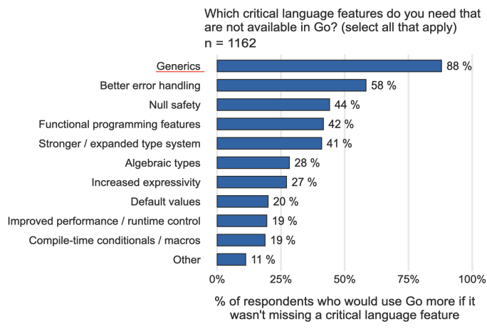

# Go Generic

> go 1.18 版本的泛型。

美国时间 2022 年 1 月 31 日，Go 核心团队发布了 Go 1.18 Beta2 版本。

在 Go 1.18beta2 版本发布的博文中，Go 核心团队还给出了 Go 1.18 版本的发布计划：2022 年 2 月发布 Go 1.18RC（release candidate，即发布候选 版），2022 年 3 月发布 Go 1.18 最终版本。 

考虑到 Go 1.18 版本中引入了 Go 语言开源以来最大的语法特性变化：泛型 （generic），改动和影响都很大，Go 核心团队将 Go 1.18 版本延迟一个月，放到 3 月发布也不失为稳妥之举。

在 Go 泛型正式落地之前，先认识一下 Go 泛型，目的是“抛砖引玉”，为后续系统学习和应用 Go 泛型语法特性开个头儿。 

将围绕 Go 为什么加入泛型、泛型设计方案的演化历史、Go 泛型的主要语法以及 Go 泛型的使用建议几个方面，聊聊 Go 泛型的那些事儿。 

首先，先来了解一下 Go 语言为什么要加入泛型语法特性。 

## 为什么要加入泛型？ 

根据近几年的 Go 官方用户调查结果，在“最想要的 Go 语言特性”这项调查中，泛型霸榜多年。

可以看下这张摘自最新的2020 年 Go 官方用户调查结果的图片：



既然 Go 社区对泛型特性的需求如此强烈，那么 Go 核心团队为何要在 Go 开源后的第 13 个年头，才将这个特性加入语言当中呢？

这里的故事说来话长。要想了解其中原因，需要先来了解一下什么是泛型？

维基百科提到：最初泛型编程这个概念来自于缪斯. 大卫和斯捷潘诺夫. 亚历山大合著的“泛型编程”一文。

那篇文章对泛型编程的诠释是：“泛型编程的中心思想是对具体的、高效的算法进行抽象，以获得通用的算法，然后这些算法可以与不同的数据表示法结合起来，产生各种各样有用的软件”。

说白了就是将算法与类型解耦，实现算法更广泛的复用。

举个简单的例子。这里是一个简单得不能再简单的加法函数，这个函数接受两个 int32 类型参数作为加数：

```go
func Add(a, b int32) int32 {
	return a + b
}
```

不过上面的函数 Add 仅适用于 int32 类型的加数，如果要对 int、int64、byte 等类型的加数进行加法运算，还需要实现 AddInt、AddInt64、AddByte 等函数。 

那如果用泛型编程的思想来解决这个问题，是怎样呢？ 

需要将算法与类型解耦，实现一个泛型版的 Add 算法，用 Go 泛型语法实现的泛型版 Add 是这样的（注意这里需要使用 Go 1.18beta1 或后续版本进行编译和运行）：

```go
func Add[T constraints.Integer](a, b T) T {
	return a + b
}
```

这样，就可以直接使用泛型版 Add 函数去进行各种整型类型的加法运算了，比如下面 代码：

```go
func main() {
	var m, n int = 5, 6
	println(Add(m, n)) // Add[int](m, n)

	var i, j int64 = 15, 16
	println(Add(i, j)) // Add[int64](i, j)

	var c, d byte = 0x11, 0x12
	println(Add(c, d)) // Add[byte](c, d)
}
```

通过这个例子可以看到，在没有泛型的情况下，需要针对不同类型重复实现相同的算法逻辑，比如上面例子提到的 AddInt、AddInt64 等。 这对于简单的、诸如上面这样的加法函数还可忍受，但对于复杂的算法，比如涉及复杂排序、查找、树、图等算法，以及一些容器类型（链表、栈、队列等）的实现时，缺少了泛型的支持还真是麻烦。 

在没有泛型之前，Gopher 们通常使用空接口类型 interface{}，作为算法操作的对象的数据类型，不过这样做的不足之处也很明显：一是无法进行类型安全检查，二是性能有损失。 

那么回到前面的问题，既然泛型有这么多优点，为什么 Go 不早点加入泛型呢？

其实这个问题在Go FAQ中早有答案，总结一下大概三点主要理由：

- 这个语法特性不紧迫，不是 Go 早期的设计目标； 

在 Go 诞生早期，很多基本语法特性的优先级都要高于泛型。此外，Go 团队更多将语言的设计目标定位在规模化（scalability）、可读性、并发性上，泛型与这些主要目标关联性不强。等 Go 成熟后，Go 团队会在适当时候引入泛型。

- 与简单的设计哲学有悖；

Go 语言最吸睛的地方就是简单，简单也是 Go 设计哲学之首！但泛型这个语法特性会给语言带来复杂性，这种复杂性不仅体现在语法层面上引入了新的语法元素，也体现在类型系统和运行时层面上为支持泛型进行了复杂的实现。

- 尚未找到合适的、价值足以抵消其引入的复杂性的理想设计方案。

从 Go 开源那一天开始，Go 团队就没有间断过对泛型的探索，并一直尝试寻找一个理想的泛型设计方案，但始终未能如愿。 

直到近几年 Go 团队觉得 Go 已经逐渐成熟，是时候下决心解决 Go 社区主要关注的几个问题了，包括泛型、包依赖以及错误处理等，并安排伊恩·泰勒和罗伯特·格瑞史莫花费更多精力在泛型的设计方案上，这才有了在即将发布的 Go 1.18 版本中泛型语法特性的落地。 

为了更清晰地看到 Go 团队在泛型上付出的努力，同时也能了解 Go 泛型的设计过程与来龙去脉，这里简单整理了一个 Go 泛型设计的简史，可以参考一下。 

## Go 泛型设计的简史

Go 核心团队对泛型的探索，是从 2009 年 12 月 3 日Russ Cox 在其博客站点上发表的一 篇文章开始的。

在这篇叫“泛型窘境”的文章中，Russ Cox 提出了 Go 泛型实现的三个可遵循的方法，以及每种方法的不足，也就是三个 slow（拖慢）：

- 拖慢程序员：不实现泛型，不会引入复杂性，但就像前面例子中那样，需要程序员花费精力重复实现 AddInt、AddInt64 等； 
- 拖慢编译器：就像 C++ 的泛型实现方案那样，通过增加编译器负担为每个类型实例生成一份单独的泛型函数的实现，这种方案产生了大量的代码，其中大部分是多余的，有时候还需要一个好的链接器来消除重复的拷贝； 
- 拖慢执行性能：就像 Java 的泛型实现方案那样，通过隐式的装箱和拆箱操作消除类型差异，虽然节省了空间，但代码执行效率低。

在当时，三个 slow 之间需要取舍，就如同数据一致性的 CAP 原则一样，无法将三个 slow 同时消除。 

之后，伊恩·泰勒主要负责持续跟进 Go 泛型方案的设计，从 2010 到 2016 年，伊恩·泰勒先后提出了几版泛型设计方案，它们是：

- 2010 年 6 月份，伊恩·泰勒提出的 Type Functions设计方案； 
- 2011 年 3 月份，伊恩·泰勒提出的 Generalized Types设计方案； 
- 2013 年 10 月份，伊恩·泰勒提出的 Generalized Types 设计方案更新版； 
- 2013 年 12 月份，伊恩·泰勒提出的 Type Parameters设计方案； 
- 2016 年 9 月份，布莱恩 -C- 米尔斯提出的 Compile-time Functions and First Class Types设计方案。

虽然这些方案因为存在各种不足，最终都没有被接受，但这些探索为后续 Go 泛型的最终落地奠定了基础。 

- 2017 年 7 月，Russ Cox 在 GopherCon 2017 大会上发表演讲“ Toward Go 2”，正式吹响 Go 向下一个阶段演化的号角，包括重点解决泛型、包依赖以及错误处理等 Go 社区最广泛关注的问题。 
- 后来，在 2018 年 8 月，也就是 GopherCon 2018 大会结束后不久，Go 核心团队发布了 Go2 draft proposal，这里面涵盖了由伊恩·泰勒和罗伯特·格瑞史莫操刀主写的 Go 泛型的第一版 draft proposal。 

这版设计草案引入了 contract 关键字来定义泛型类型参数（type parameter）的约束、 类型参数放在普通函数参数列表前面的小括号中，并用 type 关键字声明。下面是这个草案 的语法示例：

```go
// 第一版泛型技术草案中的典型泛型语法
contract stringer(x T) {
	var s string = x.String()
}

func Stringify(type T stringer)(s []T) (ret []string) {
	
}
```

- 接着，在 2019 年 7 月，伊恩·泰勒在 GopherCon 2019 大会上发表演讲“Why Generics?”，并更新了泛型的技术草案，简化了 contract 的语法设计，下面是简化后 的 contract 语法，可以对比上面代码示例中的 contract 语法看看：

```go
contract stringer(T) {
	T String() string
}
```

- 后来，在 2020 年 6 月，一篇叫《Featherweight Go》论文发表在 arxiv.org 上，这篇论文出自著名计算机科学家、函数语言专家、Haskell 语言的设计者之一、Java 泛型的设计者菲利普 - 瓦德勒（PHILIP WADLER）之手。 

Rob Pike 邀请他为 Go 核心团队解决 Go 语言的泛型扩展问题，这篇论文就是菲利普 - 瓦德对这次邀请的回应。

这篇论文为 Go 语言的一个最小语法子集设计了泛型语法 Featherweight Generic Go（FGG），并成功地给出了 FGG 到 Feighterweight Go（FG）的可行性实现的形式化证明。这篇论文的形式化证明给 Go 团队带来了很大信心，也让 Go 团队在一些泛型语法问题上达成更广泛的一致。 

- 2020 年 6 月末，伊恩·泰勒和罗伯特·格瑞史莫在 Go 官方博客发表了文章《The Next Step for Generics》，介绍了 Go 泛型工作的最新进展。Go 团队放弃了之前的技术草案，并重新编写了一个新草案。 

在这份新技术方案中，Go 团队放弃了引入 contract 关键字作为泛型类型参数的约束，而采用扩展后的 interface 来替代 contract。这样上面的 Stringify 函数就可以写成如下形 式：

```go
type Stringer interface {
	String() string
}
func Stringify(type T Stringer)(s []T) (ret []string) {
	... ...
}
```

同时，Go 团队还推出了可以在线试验 Go 泛型语法的 playground，这样 Gopher 们可以直观体验新语法，并给出自己的意见反馈。 

- 然后，在 2020 年 11 月的 GopherCon 2020 大会，罗伯特·格瑞史莫与全世界的 Gopher 同步了 Go 泛型的最新进展和 roadmap，在最新的技术草案版本中，包裹类型参数的小括号被方括号取代，类型参数前面的 type 关键字也不再需要了：

```go
func Stringify[T Stringer](s []T) (ret []string) {
	... ...
}
```

与此同时，go2goplay.golang.org 也支持了方括号语法，Gopher 们可以在线体验。 

- 接下来的 2021 年 1 月，Go 团队正式提出将泛型加入 Go 的 proposal，2021 年 2 月，这个提案被正式接受。 
- 然后是 2021 年 4 月，伊恩·泰勒在 GitHub 上发布 issue，提议去除原 Go 泛型方案中置于 interface 定义中的 type list 中的 type 关键字，并引入 type set 的概念，下面是相关示例代码：

```go
// 之前使用type list的方案
type SignedInteger interface {
	type int, int8, int16, int32, int64
}

// type set理念下的新语法
type SignedInteger interface {
	~int | ~int8 | ~int16 | ~int32 | ~int64
}
```

那什么是 type set（类型集合）呢？伊恩·泰勒给出了这个概念的定义：

- 每个类型都有一个 type set。 
- 非接口类型的类型的 type set 中仅包含其自身。比如非接口类型 T，它的 type set 中唯一的元素就是它自身：{T}； 
- 对于一个普通的、没有 type list 的普通接口类型来说，它的 type set 是一个无限集合。所有实现了这个接口类型所有方法的类型，都是该集合的一个元素，另外，由于该接口类型本身也声明了其所有方法，因此接口类型自身也是其 Type set 的一员； 
- 空接口类型 interface{}的 type set 中囊括了所有可能的类型。

这样一来，可以试试用 type set 概念，重新表述一下一个类型 T 实现一个接口类型 I：也就是当类型 T 是接口类型 I 的 type set 的一员时，T 便实现了接口 I；对于使用嵌入接口类型组合而成的接口类型，其 type set 就是其所有的嵌入的接口类型的 type set 的交集。 

而对于一个带有自身 Method 的嵌入其他接口类型的接口类型，比如下面代码中的 MyInterface3：

```go
type MyInterface3 interface {
  E1
  E2
  MyMethod03()
}
```

它的 type set 可以看成 E1、E2 和 E3（type E3 interface { MyMethod03()}）的 type set 的交集。 

- 最后，在 2021 年 12 月 14 日，Go 1.18 beta1 版本发布，这个版本包含了对 Go 泛型的正式支持。 

经过 12 年的努力与不断地自我否定，Go 团队终于将泛型引入到 Go 中，并且经过缜密设计的语法并没有违背 Go1 的兼容性。

那么接下来，就正式看看 Go 泛型的基本语法。 

## Go 泛型的基本语法

Go 泛型是 Go 开源以来在语法层面的最大一次变动，Go 泛型的最后一版技术提案长达数十页。

因此，这里只呈现主要的语法， Go 泛型的核心是类型参数（type parameter），下面就从类型参数开始，了解一下 Go 泛型的基本语法。

### 类型参数（type parameter）

类型参数是在函数声明、方法声明的 receiver 部分或类型定义的类型参数列表中，声明的 （非限定）类型名称。

类型参数在声明中充当了一个未知类型的占位符（placeholder）， 在泛型函数或泛型类型实例化时，类型参数会被一个类型实参替换。 

为了更好地理解类型参数究竟如何声明，它又起到了什么作用，以函数为例，对普通函数的参数与泛型函数的类型参数作一下对比： 

普通函数的参数列表是这样的：

```go
func Foo(x, y aType, z anotherType)
```

这里，x, y, z 是形参（parameter）的名字，也就是变量，而 aType，anotherType 是形参的类型，也就是类型。 

再来看一下泛型函数的类型参数（type parameter）列表：

```go
func GenericFoo[P aConstraint, Q anotherConstraint](x,y P, z Q)
```

这里，P，Q 是类型形参的名字，也就是类型，aConstraint，anotherConstraint 代表类型参数的约束（constraint），可以理解为对类型参数可选值的一种限定。 

从 GenericFoo 函数的声明中，可以看到，泛型函数的声明相比于普通函数多出了一 个组成部分：类型参数列表。 

类型参数列表位于函数名与函数参数列表之间，通过一个方括号括起。类型参数列表不支持变长类型参数。而且，类型参数列表中声明的类型参数，可以作为函数普通参数列表中的形参类型。 

但在泛型函数声明时，并不知道 P、Q 两个类型参数具体代表的究竟是什么类型，因此函数参数列表中的 P、Q 更像是未知类型的占位符。

那么 P、Q 的类型什么时候才能确定呢？

这就要等到泛型函数具化（instantiation）时才能确定。另外，按惯例，类型参数（type parameter）的名字都是首字母大写的，通常都是用单个大写字母命名。 

在类型参数列表中修饰类型参数的就是约束（constraint）。那什么是约束呢？继续往下看。 

### 约束（constraint） 

约束（constraint）规定了一个类型实参（type argument）必须满足的条件要求。

如果某个类型满足了某个约束规定的所有条件要求，那么它就是这个约束修饰的类型形参的一个合法的类型实参。 

在 Go 泛型中，**使用 interface 类型来定义约束**。为此，Go 接口类型的定义也进行了扩展，既可以声明接口的方法集合，也可以声明可用作类型实参的类型列表。

下面是一个约束定义与使用的示例：

```go
type C1 interface {
	~int | ~int32
	M1()
}

type T struct{}
func (T) M1() {
}

type T1 int
func (T1) M1() {
}

func foo[P C1](t P) {
  
}

func main() {
	var t1 T1
	foo(t1)
	var t T
	foo(t) // 编译器报错：T does not implement C1
}
```

在这段代码中，C1 是定义的约束，它声明了一个方法 M1，以及两个可用作类型实参的类型 (~int | ~int32)。可以看到，类型列表中的多个类型实参类型用“|”分隔。

在这段代码中，还定义了两个自定义类型 T 和 T1，两个类型都实现了 M1 方法，但 T 类型的底层类型为 struct{}，而 T1 类型的底层类型为 int，这样就导致了虽然 T 类型满足了约束 C1 的方法集合，但类型 T 因为底层类型并不是 int 或 int32 而不满足约束 C1，这也就会导致foo(t)调用在编译阶段报错。 

不过，这里还要建议：做约束的接口类型与做传统接口的接口类型最好要分开定义， 除非约束类型真的既需要方法集合，也需要类型列表。 

知道了类型参数声明的形式，也知道了约束如何定义后，再来看看如何使用带有类型参数的泛型函数。 

### 类型具化（instantiation） 

声明了泛型函数后，接下来就要调用泛型函数来实现具体的业务逻辑。

通过一个泛型版本 Sort 函数的调用例子，看看调用泛型函数的过程都发生了什么：

```go
func Sort[Elem interface{ Less(y Elem) bool }](list []Elem) {
}

type book struct{}

func (x book) Less(y book) bool {
	return true
}

func main() {
	var bookshelf []book
	Sort[book](bookshelf) // 泛型函数调用
}
```

根据 Go 泛型的实现原理，上面的泛型函数调用 Sort[book] (bookshelf) 会分成两个阶段： 

第一个阶段就是具化（instantiation）。

形象点说，具化（instantiation）就好比一家生产“排序机器”的工厂根据要排序的对象的类型，将这样的机器生产出来的过程。

继续举前面的例子来分析一下，整个具化过程如下：

- 工厂接单：Sort[book]，发现要排序的对象类型为 book； 
- 模具检查与匹配：检查 book 类型是否满足模具的约束要求（也就是是否实现了约束定义中的 Less 方法）。如果满足，就将其作为类型实参替换 Sort 函数中的类型形参，结果为 Sort[book]，如果不满足，编译器就会报错； 
- 生产机器：将泛型函数 Sort 具化为一个新函数，这里把它起名为 booksort，其函数原型为 func([]book)。本质上 booksort := Sort[book]。

第二阶段是调用（invocation）。

 一旦“排序机器”被生产出来，那么它就可以对目标对象进行排序了，这和普通的函数调用没有区别。

这里就相当于调用 booksort（bookshelf），整个过程只需要检查传入的函数实参（bookshelf）的类型与 booksort 函数原型中的形参类型（[]book）是否匹配就可以了。 

用伪代码来表述上面两个过程：

```go
Sort[book](bookshelf)

<=>

具化：booksort := Sort[book]
调用：booksort(bookshelf)
```

不过，每次调用 Sort 都要传入类型实参 book，这和普通函数调用相比还是繁琐了不少。 

那么能否像普通函数那样只传入普通参数实参，不用传入类型参数实参呢？

答案是可以的。 

Go 编译器会根据传入的实参变量，进行实参类型参数的自动推导（Argument type inference），也就是说上面的例子，只需要像这样进行 Sort 的调用就可以了：

```go
Sort(bookshelf)
```

有了对类型参数的实参类型的自动推导，大多数泛型函数的调用方式与常规函数调用一致，不会给 Gopher 带去额外的代码编写负担。 

### 泛型类型 

除了函数可以携带类型参数变身为“泛型函数”外，类型也可以拥有类型参数而化身为“泛型类型”，比如下面代码就定义了一个向量泛型类型：

```go
type Vector[T any] []T
```

这是一个带有类型参数的类型定义，类型参数位于类型名的后面，同样用方括号括起。

在类型定义体中可以引用类型参数列表中的参数名（比如 T）。类型参数同样拥有自己的约束，如上面代码中的 any。

在 Go 1.18 中，**any 是 interface{}的别名**，也是一个预定义标识符，使用 any 作为类型参数的约束，代表没有任何约束。 

使用泛型类型，也要遵循先具化，再使用的顺序，比如下面例子：

```go
type Vector[T any] []T

func (v Vector[T]) Dump() {
	fmt.Printf("%#v\n", v)
}

func main() {
	var iv = Vector[int]{1, 2, 3, 4}
	var sv Vector[string]
	sv = []string{"a", "b", "c", "d"}
	iv.Dump()
	sv.Dump()
}
```

在这段代码中，在使用 Vector[T]之前都显式用类型实参对泛型类型进行了具化，从而得到具化后的类型 Vector[int]和 Vector[string]。 Vector[int]的底层类型为[]int， Vector[string]的底层类型为[]string。然后再对具化后的类型进行操作。 

以上就是 Go 泛型语法特性的一些主要语法概念，可以看到，泛型的加入确实进一步提高了程序员的开发效率，大幅提升了算法的重用性。 

那么，Go 泛型方案对 Go 程序的运行时性能又带来了哪些影响呢？接下来就来通过例子验证一下。 

## Go 泛型的性能 

创建一个性能基准测试的例子，参加这次测试的三位选手分别来自：

- Go 标准库 sort 包（非泛型版）的 Ints 函数 
- Go 团队维护 golang.org/x/exp/slices 中的泛型版 Sort 函数 
- 对 golang.org/x/exp/slices 中的泛型版 Sort 函数进行改造得到的、仅针对[]int 进行排序的 Sort 函数

相关的源码较多，可以下载相关源码。 

下面是使用 Go 1.18beta2 版本在 macOS 上运行该测试的结果：

```sh
$go test -bench .
goos: darwin
goarch: amd64
pkg: github.com/Kate-liu/GoBeginner/gogeneric/benchmark
cpu: Intel(R) Core(TM) i5-8257U CPU @ 1.40GHz
BenchmarkSortInts-8                   97          12256792 ns/op              24 B/op          1 allocs/op
BenchmarkSlicesSort-8                170           7105404 ns/op               0 B/op          0 allocs/op
BenchmarkIntSort-8                   172           6951828 ns/op               0 B/op          0 allocs/op
PASS
ok      github.com/Kate-liu/GoBeginner/gogeneric/benchmark      6.398s
```

可以看到，泛型版和仅支持[]int 的 Sort 函数的性能是一致的，性能都要比目前标准库的 Ints 函数高出近一倍，并且在排序过程中没有额外的内存分配。

由此可以得出结论：

至少在这个例子中，泛型在运行时并未给算法带来额外的负担。 现在看来，Go 泛型没有拖慢程序员的开发效率，也没有拖慢运行效率，那么按照 Russ Cox 的“泛型窘境”文章中的结论，Go 泛型是否拖慢编译性能了呢？ 

不过，因为目前采用 Go 泛型重写的项目比较少，还没法举例对比，但Go 1.18 发布说明中给出了一个结论：Go 1.18 编译器的性能要比 Go 1.17 下降 15% 左右。

不过， Go 核心团队也承诺将在 Go 1.19 中改善编译器的性能，这里也希望到时候的优化能抵消 Go 泛型带来的影响。 了解了 Go 泛型并未影响到运行时性能，这让心里有了底。

但关于 Go 泛型，想必还会有疑问，那就是：应该在什么时候使用泛型，又应该如何使用泛型呢？最后就来看看这两个问题的答案。 

## Go 泛型的使用建议

Go 当初没有及时引入泛型的一个原因就是与 Go 语言“简单”的设计哲学有悖，现在加入了泛型，随之而来的就是增加了语言的复杂性。 

为了尽量降低复杂性，Go 团队做了很多工作，包括前面提到的在语法中加入类型实参的自动推导等语法糖，尽量减少给开发人员编码时带去额外负担，也尽可能保持 Go 代码良好的可读性。 

此外，Go 核心团队最担心的就是“泛型被滥用”，所以 Go 核心团队在各种演讲场合都在努力地告诉大家 Go 泛型的适用场景以及应该如何使用。这里也梳理一下来自 Go 团队的这些建议，可以参考一下。 

### 什么情况适合使用泛型 

首先，类型参数的一种有用的情况，就是当编写的函数的操作元素的类型为 slice、map、 channel 等特定类型的时候。

如果一个函数接受这些类型的形参，并且函数代码没有对参数的元素类型作出任何假设，那么使用类型参数可能会非常有用。

在这种场合下，泛型方案可以替代反射方案，获得更高的性能。

另一个适合使用类型参数的情况是编写通用数据结构。所谓的通用数据结构，指的是像切片或 map 这样，但 Go 语言又没有提供原生支持的类型。比如一个链表或一个二叉树。 

需要这类数据结构的程序会使用特定的元素类型实现它们，或者是使用接口类型 （interface{}）来实现。不过，如果使用类型参数替换特定元素类型，可以实现一个更通用的数据结构，这个通用的数据结构可以被其他程序复用。

而且，用类型参数替换接口类型通常也会让数据存储的更为高效。 

另外，在一些场合，使用类型参数替代接口类型，意味着代码可以避免进行类型断言 （type assertion），并且在编译阶段还可以进行全面的类型静态检查。 

### 什么情况不宜使用泛型 

首先，如果要对某一类型的值进行的全部操作，仅仅是在那个值上调用一个方法，请使用 interface 类型，而不是类型参数。

比如：io.Reader 易读且高效，没有必要像下面代码中这样使用一个类型参数像调用 Read 方法那样去从一个值中读取数据：

```go
func ReadAll[reader io.Reader](r reader) ([]byte, error) // 错误的作法

func ReadAll(r io.Reader) ([]byte, error) // 正确的作法
```

使用类型参数的原因是它们让代码更清晰，如果它们会让代码变得更复杂，就不要使用。 

第二，当不同的类型使用一个共同的方法时，如果一个方法的实现对于所有类型都相同， 就使用类型参数；相反，如果每种类型的实现各不相同，请使用不同的方法，不要使用类型参数。 

最后，如果发现自己多次编写完全相同的代码（样板代码），各个版本之间唯一的差别是代码使用不同的类型，那就请考虑是否可以使用类型参数。反之，在注意到自己要多次编写完全相同的代码之前，应该避免使用类型参数。 

## 小结

初步了解了 Go 泛型的那些事儿，主要是想为后续系统学习 Go 泛型引个路。 

正如 Go 团队在 Go FAQ 中描述的那样，Go 团队从来没有拒绝泛型，只是长时间来没有找到一个合适的实现方案。

Go 团队需要在 Russ Cox 的“泛型窘境”中提到的三个 slow 中寻找平衡。 十多年来，Go 团队一直在尝试与打磨，终于在近几年取得了突破性的进展，设计出一种可以向后兼容 Go1 的方案，并下决心在 Go 1.18 版本中落地泛型。 

Go 泛型也称为类型参数，可以在函数声明、方法声明的 receiver 部分或类型定义中使用类型参数，来实现泛型函数和泛型类型。还需为类型参数设定约束，通过扩展的 interface 类型定义，可以定义这种约束。 

目前来看，Go 泛型的引入并没有给程序运行带来额外性能开销，但在一定程度上拖慢了编译器的性能。同时也带来了语法上的复杂性，为此，Go 团队建议大家谨慎使用泛型，同时给出了一些使用建议。 

最后要特别说明一下，Go 1.18 仅仅是 Go 泛型的起点，就像 Go Module 构建机制一样，Go 泛型的成熟与稳定还需要几个 Go 发布版本的努力。而且涉及到泛型的代码都需要安装 Go 1.18beta1 或以上版本。 

## 思考题 

仔细阅读一遍 Go 泛型的技术方案： https://go.googlesource.com/proposal/+/refs/heads/master/design/43651-type-parameters.md


## Go 泛型的限制

Go 泛型已经日渐成熟，距离发布正式版本已经不远了。目前已经有很多的开 发者开始探索泛型会对 Go 编程带来什么影响。

比如说，目前比较肯定的是泛型能够解决这一类的痛点：

- 数学计算：写出通用的方法来操作 int 、 float 类型； 
- 集合类型：例如用泛型来写堆、栈、队列等。虽然大部分类似的需求可以通过 slice 和 channel 来解决，但是始终有一些情况难以避免要设计特殊的集合类型，如有序 Set 和优先级队列； 
- slice 和 map 的辅助方法：典型的如 map-reduce API；

但是至今还是没有人讨论 Go 泛型的限制，以及这些限制会如何影响解决问题。 

所以将重点讨论这个问题，不过因为目前主要是在设计和开发中间件，所以会 侧重于中间件来进行讨论，当然也会涉及业务开发的内容。

可以结合自己了解的 Go 泛型和现有的编程模式来学习这些限制，从而在将来 Go 泛型正式发布之后避开这些限制， 写出优雅的 Go 泛型代码。 

在早期泛型还处于提案阶段的时候，就尝试过利用泛型来设计中间件。当然，即便到现在，对泛型的应用依旧提留在尝试阶段。

目前认为影响最大的三个局限是：

- Go 接口和结构体不支持泛型方法； 
- 泛型约束不能作为类型声明； 
- 泛型约束只能是接口，而不能是结构体。

接下来就逐个分析。 

### Go 接口和结构体不支持泛型方法 

这里需要注意的是，虽然 Go 接口或者结构体不允许声明泛型方法，但 Go 接口或者结构体可以是泛型。 

在原来没有泛型的时候，如果要设计一个可以处理任意类型的接口，只能使用 interface{} ，例如：

```go
type Orm interface {
	Insert(data ...interface{}) (sql.Result, error)
}
```

在这种模式下，用户可以输入任何数据。但是如果用户混用不同类型，例如 Insert(&User{},&Order{}) ，就会导致插入失败，而编译器并不能帮助用户检测到这种错误。 

从利用 ORM 读写数据库的场景来看，希望限制住 data 参数只能是单一类型的多个实例。那么在引入了泛型之后，可以声明一个泛型接口来达成这种约束：

```go
type Orm[T any] interface {
	Insert(data ...T) (sql.Result, error)
}
```

在这个接口里面，声明了一个泛型接口 Orm ，它含有一个类型参数 T ，通过 T 确保在 Insert 里面，用户传入的都是同一个类型的不同实例。 

然而这种设计也是有问题的：需要创建很多个Orm实例。例如插入 User 的实例和插入 Order 的实例：

```go
var userOrm Orm[User]
var orderOrm Orm[Order]
```

也就是说，应用有多少个模型，就要声明多少个 Orm 的实例。 这显然是不可接受的。因为 Orm 应该是一个可以操作任意模型的接口，也就是一个 Orm 实例既可以用于操作 User ，也可以用于操作 Order 。

换言之，并不能把类型参数声明在 Orm 这样一个接口上。 那么应该声明在哪里呢？ 显然，应该声明在方法上：

```go
type Orm interface {
	Insert[T any](data ...T) (sql.Result, error)
}
```

乍一看，这种声明方式完全能够达到目标，用户用起来只需要:

```go
orm.Insert[*User](&User{}, &User{})
orm.Insert[*Order](&Order{}, &Order{})
```

然而，如果尝试编译，就会得到错误：

```go
interface method cannot have type parameters
```

也不仅仅是接口会这样，即便直接做成结构体：

```go
invalid AST: method must have no type parameters
```

实际上，操作任意类型的接口很常见，特别是对于提供客户端功能的中间件来说，尤其常见。

例如，如果设计一个 HTTP 客户端的中间件，可能希望是：

```go
type HttpClient interface {
	Get[T any](url string) (T, error)
}
```

这样，用户可以用 client.Get [User] ("/user/123") 得到一个 User 的实例。

又比如，如果要设计一个缓存客户端：

```go
type CacheClient interface {
	Get[T any](key string) (T, error)
}
```

但是，显然它们都无法通过编译。 因此，可以说，这个限制对所有的客户端类应用都很不友好。这些客户端包括 Redis、Kafka 等各种中间件，也包括这提到的 HTTP、ORM 等框架。 

### 泛型约束不能作为类型声明 

在泛型里面，有一个很重要的概念“约束”。使用约束来声明类型参数要满足的条件。

一个典型的 Go 约束，可以是一个普通的接口，也可以是多个类型的组合，例如：

```go
type Integer interface {
	int | int64 | int32 | int16 | int8
}
```

看到这种语法，自然会想到在中间件开发中，经常会有这么一种情况：某个方法接收多种类型的的参数，但是它们又没有实现共同的接口。 

例如，现在要设计一个 SQL 的 Builder ，用于构造 SQL 。那么在设计 SELECT XXX 这个部分的时候，最基本的做法就是直接传 string ：

```go
type Selector struct {
	columns []string
}

func (s *Selector) Select(cols ...string) *Selector {
  s.columns = cols
  return s
}
```

但是这种设计存在一个问题，就是用户如果要使用聚合函数的话，需要自己手动拼接，例如 Select("AVG(age)") 。而实际上，希望能够帮助用户完成这个过程，将聚合函数也变成一个方法调用：

```go
type Aggregate struct {
  fun string
  col string
  alias string
}

func Avg(col string) Aggregate {
  return Aggregate{
    fun: "AVG",
    col: col,
  }
}

func (a Aggregate) As(alias string) Aggregate {
  return Aggregate{
    fun: a.fun,
    col: a.col,
    alias: alias,
  }
}
```

使用起来如： Select(Avg("age").As("avg_age"), "name") ，这样就能帮助检测传入的列名是否正确，而且用户可以避开字符串拼接之类的问题。 

在这种情况下， Select 方法必须要接收两种输入： string 和 Aggregate 。在没有泛型的情况下，大多数时候都是直接使用 interface 来作为参数，并且结合 switch-case 来判断：

```go
type Selector struct {
	columns []Aggregate
}

func (s *Selector) Select(cols ...interface{}) *Selector {
  for _, col := range cols {
    switch c := col.(type) {
    case string:
    	s.columns = append(s.columns, Aggregate{col: c})
    case Aggregate:
    	s.columns = append(s.columns, c)
    default:
      panic("invalid type")
    }
  }
  return s
}
```

但是这种用法存在一个问题，就是无法在编译期检查用户输入的类型是否正确，只有在运行期 default 分支发生 panic 时才能知道。 

特别是，如果用户本意是传一个 var cols []string ，结果写成了 Select(cols) 而 不是 Select(cols...) ，那么就会出现 panic ，而编译器丝毫不能避免这种低级错误。 

那么，结合泛型约束，似乎可以考虑写成这样：

```go
type Selectable interface {
	string | Aggregate
}

type Selector struct {
	columns []Selectable
}

func (s *Selector) Select(cols ...Selectable) *Selector {
	panic("implement me")
}
```

利用 Selectable 约束，限制住了类型只能是 string 或者 Aggregate 。那么用 户可以直接使用 string ，例如 Select("name", Avg("age") 。 

看起来非常完美，用户享受到了编译期检查，又不会出现 panic 的问题。 然而，这依旧是不行的，编译的时候会直接报错：

```go
interface contains type constraints
```

也就是说，泛型约束不能被用于做参数，它只能和泛型结合在一起使用，这就导致并不能用泛型的约束，来解决某个接口可以处理有限多种类型输入的问题。

所以长期来看， interface{} 这种参数类型还会广泛存在于所有中间件的设计中。 

### 泛型约束只能是接口，而不能是结构体 

众所周知，Go 里面有一个特性是组合。

因此在泛型引入的时候，可能会考虑能否用泛型的约束来限制具体类型必须组合了某个类型。 例如：

```go
type BaseEntity struct {
	Id int64
}

func Insert[Entity BaseEntity](e *Entity) {
}

type myEntity struct {
  BaseEntity
  Name string
}
```

在实际中这也是一个很常见的场景，在 ORM 操作的时候希望实体类必须组合 BaseEntity ，这个 BaseEntity 上会定义一些公共字段和公共方法。 

不过，同样的，Go 泛型不支持这种用法。Go 泛型约束必须是一个接口，而不能是一个结构体，因此上面这段代码会报错：

```go
myEntity does not implement BaseEntity
```

不过，目前泛型还没有完全支持好，所以这个报错信息并不够准确，更加准确的信息应该是指出 BaseEntity 只能为接口。 

这个限制影响也很大，它直接堵死了设计共享字段的泛型方法的道路。而且，它对于业务开发的影响要比对中间件开发的影响更大，因为业务开发会经常遇到必须要共享某些数据的场景，例如这里的 ORM 例子，还有前端接收参数的场景等。 

## 绕开限制的思路 

从前面的分析来看，这些限制影响广泛，而且限制了泛型的进一步应用。但是，可以尝试使用一些别的手段来绕开这些限制。 

### Builder 模式 

前面提到，因为 Go 泛型限制了接口或者结构体，让它们不能有泛型方法，所以对客户端类的中间件 API 设计很不友好。 

但是，可以尝试用 Builder 模式来解决这个问题。回到 HTTP 客户端的例子试试看，这个例子可以设计成：

```go
type HttpClient struct {
	endpoint string
}

type GetBuilder[T any] struct {
	client *HttpClient
	path   string
}

func (g *GetBuilder[T]) Path(path string) *GetBuilder[T] {
	g.path = path
	return g
}

func (g *GetBuilder[T]) Do() T {
	// 真实发出 HTTP 请求
	url := g.client.endpoint + g.path
}

func NewGetRequest[T any](client *HttpClient) *GetBuilder {
	return &GetBuilder[T]{client: client}
}
```

而最开始想利用泛型的时候，是希望将泛型定义在方法级别上：

```go
type HttpClient interface {
	Get[T any](url string) (T, error)
}
```

两者最大的不同就在于NewGetRequest 是一种**过程式的设计**。

在 Builder 设计之下， HttpClient 被视作各种配置的载体，而不是一个真实发出请求的客户端。

如果有 Java 之类面向对象的编程语言的使用背景，那么会很不习惯这种写法。 当然可以将 HttpClient 做成真的客户端，而把 GetBuilder 看成是一层泛型的 皮：

```go
func (g *GetBuilder[T]) Do() T {
  var t T
  g.client.get(g.path, &t)
  return t
}
```

无论哪一种，本质上都是利用了过程式的写法，核心都是 Client + Builder。那么在将来设计各种客户端中间件的时候，就可以考虑尝试这种解决思路。 

### 标记接口 

标记接口这种方案，可以用来解决泛型约束不能用作类型声明的限制。

顾名思义，标记接口（tag interface 或者 marker interface）就是打一个标记，本身并不具备意义。

这种思路在别的语言里面也很常见，比如说 Java shardingsphere 里面就有一个 OptionalSPI 的标记接口：

```go
public interface OptionalSPI {
}
```

它什么方法都没有，只是说实现了这个接口的 SPI 都是“可选的”。 

Go 里面就不能用空接口作为标记接口，否则所有结构体都可以被认为实现了标签接口， Go 中必须要至少声明一个私有方法。

例如前面讨论的 SELECT 既可以是列，也可以是聚合函数的问题，就可以尝试声明一个接口：

```go
type Selectable interface {
	aggr()
}

type Column string

func (c Column) aggr() {}

type Aggregate struct{}

func (c Aggregate) aggr() {}

func (s *Selector) Select(cols ...Selectable) *Selector {
	panic("implement me")
}
```

这里， Selectable 就是一个标记接口。它的方法 aggr 没有任何的含义，它就是用于限定 Select 方法只能接收特定类型的输入。 

但是用起来其实也不是很方便，比如看这句代码： Select(Column("name"), Avg("avg_id")) 。即便完全不用聚合函数，也得用 Column 来传入列，而不能直接传递字符串。

但是相比之前接收 interface{} 作为输入，就要好很多了，至少受到了编译器对类型的检查。 

### Getter/Setter 接口 

Getter/Setter 可以用于解决泛型约束只能是接口而不能是结构体的限制，但是它并不那么优雅。 

核心思路在于，给所有的字段都加上 Get/Set 方法，并且提取出来作为一个接口。例 如：

```go
type Entity interface {
	Id() int64
	SetId(id int64)
}

type BaseEntity struct {
	id int64
}

func (b *BaseEntity) Id() int64 {
	return b.id
}

func (b *BaseEntity) SetId(id int64) {
	b.id = id
}
```

那么所有的 ORM 操作都可以限制到该类型上：

```go
type myEntity struct {
	BaseEntity
}

func Insert[E Entity](e *E) {
}
```

看着这段代码，Java 背景的同学应该会觉得很眼熟，但是在 Go 里面更加习惯于直接访问字段，而不是使用 Getter/Setter。 

但是如果只是少量使用，并且结合组合特性，那么效果也还算不错。例如在例子里面，**通过组合 BaseEntity ，解决了所有的结构体都要实现一遍 Entity 接口的问题**。 

## 总结 

这里讨论了三个泛型的限制：

- Go 接口和结构体不支持泛型方法； 
- 泛型约束不能作为类型声明； 
- 泛型约束只能是接口，而不能是结构体。

并且讨论了三个对应的、可行的解决思路：

- Builder 模式； 
- 标记接口； 
- Getter/Setter 接口。

从个人看来，这些解决思路只能算是效果不错，但是不够优雅。所以还是很期盼 Go 将来能够放开这种限制。毕竟在这三个约束之下，Go 泛型使用场景过于受限。

从个人的工作经历出发，对于大多数中间件来说，可以使用泛型来提供对用户友好的 API，但是对于内部实现来说，使用泛型的收益非常有限。

如果现在已有的代码风格就是过程式的，那么就可以尝试用泛型将它完全重构一番。 总的来说，对 Go 泛型的普及持有一种比较悲观的态度。预计泛型从出来到大规模应用还有一段非常遥远的距离，甚至有些公司可能在长时间内为了保持代码风格统一，而禁用泛型特性。 


