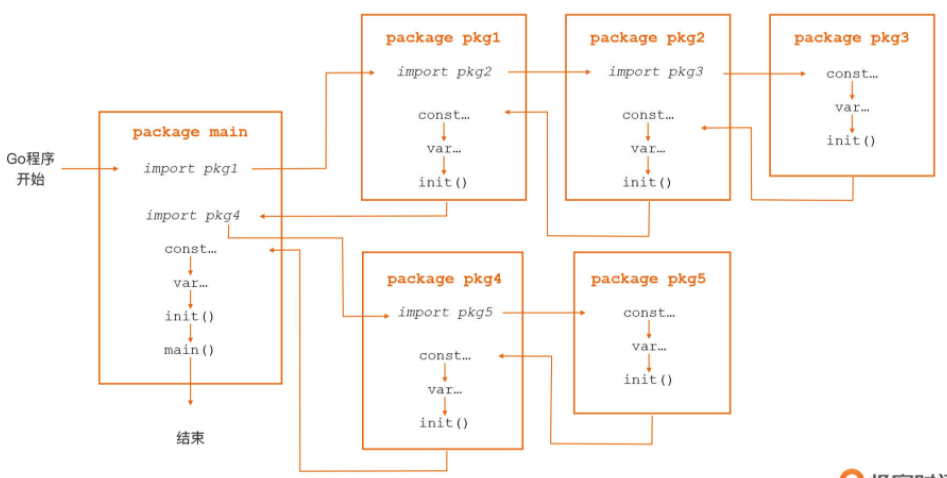

# Init Go

>入口函数，包初始化，Go程序的执行次序

问题：一个 Go 项目中有数十个 Go 包，每个包中又有若干常量、变量、各种函数和方法，那 Go 代码究竟是从哪里开始执行的呢？后续的执行顺序又是什么样的呢？ 

Go 程序由一系列 Go 包组成，代码的执行也是在各个包之间跳转。和其他语言一样，Go 也拥有自己的用户层入口：main 函数。

## main.main 函数：Go 应用的入口函数 

### main 包 main 函数

Go 语言中有一个特殊的函数：main 包中的 main 函数，也就是 main.main，它是**所有 Go 可执行程序的用户层执行逻辑的入口函数**。Go 程序在用户层面的执行逻辑，会在这个函数内按照它的调用顺序展开。 

main 函数的函数原型是这样的：

```go
package main

func main() {
   // 用户层执行逻辑
   // ... ...
}
```

main 函数的函数原型非常简单，没有参数也没有返回值。而且，Go 语言要求：可执行程序的 main 包必须定义 main 函数，否则 Go 编译器会报错。

在启动了多个 Goroutine（Go 语言的轻量级用户线程）的 Go 应用中， main.main 函数将在 Go 应用的主 Goroutine 中执行。 

不过很有意思的是，在多 Goroutine 的 Go 应用中，相较于 main.main 作为 Go 应用的入口，main.main 函数返回的意义其实更大，因为 main 函数返回就意味着整个 Go 程序的终结，而且也不用管这个时候是否还有其他子 Goroutine 正在执行。

### 非 main 包 main 函数

值得注意的是，除了 main 包外，其他包也可以拥有自己的名为 main 的函数或方法。但按照 **Go 的可见性规则**（小写字母卡头的标识符为非导出标识符），非 main 包中自定义的 main 函数仅限于包内使用，就像下面代码这样，这是一段在非 main 包中定义 main 函数的代码片段：

```go
package nonemain

import "fmt"

func Main() {
   main()
}

func main() {
   fmt.Println("main func for nonemain")
}
```

这里 main 函数就主要是用来在包 nonemain 内部使用的，它是没法在包外使用 的。 

对于 main 包的 main 函数来说，还需要明确一点，就是它虽然是用户层逻辑的入口函数，但它却不一定是用户层第一个被执行的函数。 

这是为什么呢？这跟 Go 语言的另一个函数 init 有关。 

## init 函数：Go 包的初始化函数 

除了前面讲过的 main.main 函数之外，Go 语言还有一个特殊函数，它就是用于进行包初 始化的 init 函数。 

和 main.main 函数一样，init 函数也是一个无参数无返回值的函数：

```go
func init() {
  // 包初始化逻辑
  // ... ...
}
```

回到“main 函数不一定是用户层第一个被执行的函数”的问题，其实就是因为，如果 main 包依赖的包中定义了 init 函数，或者是 main 包自身定义了 init 函 数，那么 Go 程序在这个包初始化的时候，就会自动调用它的 init 函数，因此这些 **init 函 数的执行就都会发生在 main 函数之前**。 

不过对于 init 函数来说，还需要注意一点，就是在 Go 程序中不能手工显式地调 用 init，否则就会收到**编译错误**，就像下面这个示例，它表示的手工显式调用 init 函数的 错误做法：

```go
package main

import "fmt"

func init() {
	fmt.Println("init invoked")
}

func main() {
	init()
}
```

这样，在构建并运行上面这些示例代码之后，Go 编译器会报下面这个错误：

```sh
$go run main.go
# command-line-arguments
./main.go:10:2: undefined: init
```

实际上，Go 包可以拥有不止一个 init 函数，每个组成 Go 包的 Go 源文件中，也可以定义多个 init 函数。 

所以说，在初始化 Go 包时，Go 会按照一定的次序，逐一、顺序地调用这个包的 init 函 数。一般来说，先传递给 Go 编译器的源文件中的 init 函数，会先被执行；而同一个源文 件中的多个 init 函数，会按声明顺序依次执行。

现在就知晓了 main.main 函数可能并不是第一个被执行的函数的原因了。

所以，当要在 main.main 函数执行之前，执行一些函数或语句的时候，只需要将它放入 init 函数中就可以了。

init 函数具备的几种行为特征：

- 执行顺序排在包内其他语法元素的后面； 
- 每个 init 函数在整个 Go 程序生命周期内仅会被执行一次；
- init 函数是顺序执行的，只有当一个 init 函数执行完毕后，才会去执行下一个 init 函数。


## Go 包的初始化次序 

从程序逻辑结构角度来看，Go 包是程序逻辑封装的基本单元，每个包都可以理解为是一个“自治”的、封装良好的、对外部暴露有限接口的基本单元。

一个 Go 程序就是由一组包组成的，程序的初始化就是这些包的初始化。每个 Go 包还会有自己的依赖包、常 量、变量、init 函数（其中 main 包有 main 函数）等。 

在这里要注意：在阅读和理解代码的时候，需要知道这些元素在在程序初始化过程 中的初始化顺序，这样便于确定在某一行代码处这些元素的当前状态。 

下面，就通过一张流程图，来了解学习下 Go 包的初始化次序：



来看看具体的初始化步骤。

- 首先，main 包依赖 pkg1 和 pkg4 两个包，所以第一步，Go 会根据包导入的顺序，先去初始化 main 包的第一个依赖包 pkg1。 
- 第二步，Go 在进行包初始化的过程中，会采用“深度优先”的原则，递归初始化各个包的依赖包。在上图里，pkg1 包依赖 pkg2 包，pkg2 包依赖 pkg3 包，pkg3 没有依赖包， 于是 Go 在 pkg3 包中按照“常量 -> 变量 -> init 函数”的顺序先对 pkg3 包进行初始化； 
- 紧接着，在 pkg3 包初始化完毕后，Go 会回到 pkg2 包并对 pkg2 包进行初始化，接下来再回到 pkg1 包并对 pkg1 包进行初始化。在调用完 pkg1 包的 init 函数后，Go 就完成了 main 包的第一个依赖包 pkg1 的初始化。 
- 接下来，Go 会初始化 main 包的第二个依赖包 pkg4，pkg4 包的初始化过程与 pkg1 包类似，也是先初始化它的依赖包 pkg5，然后再初始化自身； 
- 然后，当 Go 初始化完 pkg4 包后也就完成了对 main 包所有依赖包的初始化，接下来初 始化 main 包自身。 
- 最后，在 main 包中，Go 同样会按照“常量 -> 变量 -> init 函数”的顺序进行初始化， 执行完这些初始化工作后才正式进入程序的入口函数 main 函数。 

现在，可以通过一段代码示例来验证一下 Go 程序启动后，Go 包的初始化次序是否是 正确的，示例程序的结构如下：

```sh
$tree ./goinitorder/
./goinitorder/
├── main.go
├── pkg1
│   └── pkg1.go
├── pkg2
│   └── pkg2.go
└── pkg3
    └── pkg3.go
```

设定的各个包的依赖关系如下：

- main 包依赖 pkg1 包和 pkg2 包；
- pkg1 包和 pkg2 包都依赖 pkg3 包。

只列出了 main 包的代码，pkg1、pkg2 和 pkg3 包的代码与 main 包都是类似 的。

```go
package main

import (
   "fmt"

   _ "github.com/Kate-liu/GoBeginner/goinit/goinitorder/pkg1"
   _ "github.com/Kate-liu/GoBeginner/goinit/goinitorder/pkg2"
)

var (
   _  = constInitCheck()
   v1 = variableInit("v1")
   v2 = variableInit("v2")
)

const (
   c1 = "c1"
   c2 = "c2"
)

func constInitCheck() string {
   if c1 != "" {
      fmt.Println("main: const c1 has been initialized")
   }
   if c2 != "" {
      fmt.Println("main: const c2 has been initialized")
   }
   return ""
}

func variableInit(name string) string {
   fmt.Printf("main: var %s has been initialized\n", name)
   return name
}

func init() {
   fmt.Println("main: first init func invoked")
}

func init() {
   fmt.Println("main: second init func invoked")
}

func main() {
   // do nothing
}
```

在 main 包中其实并没有使用 pkg1 和 pkg2 中的函数或方法，而是直接 通过空导入的方式“触发”pkg1 包和 pkg2 包的初始化（pkg2 包也是通过空导入的方式 依赖 pkg3 包的），下面是这个程序的运行结果：

```sh
$go run main.go
pkg3: const c has been initialized
pkg3: var v has been initialized
pkg3: init func invoked
pkg1: const c has been initialized
pkg1: var v has been initialized
pkg1: init func invoked
pkg2: const c has been initialized
pkg2: var v has been initialized
pkg2: init func invoked
main: const c1 has been initialized
main: const c2 has been initialized
main: var v1 has been initialized
main: var v2 has been initialized
main: first init func invoked
main: second init func invoked
```

正如预期的那样，Go 运行时是按照“pkg3 -> pkg1 -> pkg2 -> main”的顺 序，来对 Go 程序的各个包进行初始化的，而在包内，则是以“常量 -> 变量 -> init 函 数”的顺序进行初始化。

此外，main 包的两个 init 函数，会按照在源文件 main.go 中的 出现次序进行调用。 

还有一点，pkg1 包和 pkg2 包都依赖 pkg3 包，但根据 **Go 语言规范，一个被多个包依赖的包仅会初始化一次**，因此这里的 pkg3 包仅会被初始化了一次。 

所以简而言之，记住 Go 包的初始化次序并不难，只需要记住这三点就可以了：

- 依赖包按“深度优先”的次序进行初始化；
- 每个包内按以“常量 -> 变量 -> init 函数”的顺序进行初始化； 
- 包内的多个 init 函数按出现次序进行自动调用。

## init 函数的用途 

其实，init 函数的这些常用用途，与 init 函数在 Go 包初始化过程中的次序密不可分。

Go 包初始化时，init 函数的初始化次序在变量之后，这给了开发人员在 init 函数中**对包级变量进行进一步检查与操作**的机会。 

### 重置包级变量值（flag 包）

先来看 init 函数的第一个常用用途：重置包级变量值。

init 函数就好比 Go 包真正投入使用之前唯一的“质检员”，负责对包内部以及暴露到外部的包级数据（主要是包级变量）的初始状态进行检查。

在 Go 标准库中，能发现很多 init 函数被用于检查包级变量的初始状态的例子，**标准库 flag 包**对 init 函数的使用就是其 中的一个，这里简单来分析一下。 

flag 包定义了一个导出的**包级变量 CommandLine**，如果用户没有通过 flag.NewFlagSet 创建新的代表命令行标志集合的实例，那么 CommandLine 就会作为 flag 包各种导出函数背后，默认代表命令行标志集合的实例。 

而在 flag 包初始化的时候，由于 init 函数初始化次序在包级变量之后，因此包级变量 CommandLine 会在 init 函数之前被初始化了，可以看一下下面的代码：

```go
// go1.16.5
// flag/flag.go

var CommandLine = NewFlagSet(os.Args[0], ExitOnError)

func NewFlagSet(name string, errorHandling ErrorHandling) *FlagSet {
	f := &FlagSet{
		name:          name,
		errorHandling: errorHandling,
	}
	f.Usage = f.defaultUsage
	return f
}

func (f *FlagSet) defaultUsage() {
	if f.name == "" {
		fmt.Fprintf(f.Output(), "Usage:\n")
	} else {
		fmt.Fprintf(f.Output(), "Usage of %s:\n", f.name)
	}
	f.PrintDefaults()
}
```

在通过 NewFlagSet 创建 CommandLine 变量绑定的 FlagSet 类型实例时，CommandLine 的 Usage 字段被赋值为 defaultUsage。 

也就是说，如果保持现状，那么使用 flag 包默认 CommandLine 的用户就无法自定义 usage 的输出了。

于是，flag 包**在 init 函数中重置了 CommandLine 的 Usage 字段**：

```go
func init() {
   CommandLine.Usage = commandLineUsage
}

func commandLineUsage() {
	Usage()
}

var Usage = func() {
	fmt.Fprintf(CommandLine.Output(), "Usage of %s:\n", os.Args[0])
	PrintDefaults()
}
```

CommandLine 的 Usage 字段，设置为了一个 **flag 包内的未导出 函数 commandLineUsage**，后者则直接使用了 flag 包的另外一个导出包变量 Usage。这 样，就可以通过 init 函数，将 CommandLine 与包变量 Usage 关联在一起了。

然后，当用户将自定义的 usage 赋值给了 flag.Usage 后，就相当于改变了默认代表命令行标志集合的 CommandLine 变量的 Usage。这样当 flag 包完成初始化后， CommandLine 变量便处于一个合理可用的状态了。


### 包级变量的复杂初始化（http 包）

init 函数的第二个常用用途，是实现对包级变量的复杂初始化。 

有些包级变量需要一个比较复杂的初始化过程，有些时候，使用它的**类型零值**（每个 Go 类型都具有一个零值定义）或通过**简单初始化表达式不能满足业务逻辑**要求，而 init 函数 则非常适合完成此项工作。

标准库 http 包中就有这样一个典型示例：

```go
// go1.16.5
// net/http/h2_bundle.go

var (
    http2VerboseLogs bool // 初始化时默认值为false
    http2logFrameWrites bool // 初始化时默认值为false
    http2logFrameReads bool // 初始化时默认值为false
    http2inTests bool // 初始化时默认值为false
)

func init() {
   e := os.Getenv("GODEBUG")
   if strings.Contains(e, "http2debug=1") {
      http2VerboseLogs = true // 在init中对http2VerboseLogs的值进行重置
   }
   if strings.Contains(e, "http2debug=2") {
        http2VerboseLogs = true // 在init中对http2VerboseLogs的值进行重置
        http2logFrameWrites = true // 在init中对http2logFrameWrites的值进行重置
        http2logFrameReads = true // 在init中对http2logFrameReads的值进行重置
   }
}
```

标准库 http 包定义了一系列**布尔类型的特性开关变量**，它们默认处于关闭 状态（即值为 false），但可以通过 GODEBUG 环境变量的值，开启相关特性开关。 

可是这样一来，简单地将这些变量初始化为类型零值，就不能满足要求了，所以 http 包在 init 函数中，就根据环境变量 GODEBUG 的值，对这些包级开关变量进行了复杂的初始化，从而保证了这些开关变量在 http 包完成初始化后，可以处于合理状态。


### 实现“注册模式”（lib/pq 包 & image 包）

init 函数的第三个常用用途：在 init 函数中实现“注册模式”。 

首先来看一段使用 lib/pq 包访问 PostgreSQL 数据库的代码示例：

```go
package main

import (
	"database/sql"
	_ "github.com/lib/pq"
	"log"
)

func main() {
	db, err := sql.Open("postgres", "user=pqgotest dbname=pqgotest sslmode=verify-full")
	if err != nil {
		log.Fatal(err)
	}
  
	age := 21
	_, err = db.Query("SELECT name FROM users WHERE age = $1", age)
	// ...
}
```

这是一段“神奇”的代码，可以看到示例代码是以空导入的方式导入 lib/pq 包 的，main 函数中没有使用 pq 包的任何变量、函数或方法，这样就实现了对 PostgreSQL 数据库的访问。

而这一切的奥秘，全在 pq 包的 init 函数中：

```go
// github.com/lib/pq@v1.10.4/conn.go

func init() {
   sql.Register("postgres", &Driver{})
}
```

这个奥秘就在，其实是利用了用空导入的方式导入 lib/pq 包时产生的一个“副作 用”，也就是 lib/pq 包作为 main 包的依赖包，它的 init 函数会在 pq 包初始化的时候得以执行。 

从上面代码中，可以看到在 pq 包的 init 函数中，**pq 包将自己实现的 sql 驱动注册到了 sql 包中**。

这样只要应用层代码在 Open 数据库的时候，传入驱动的名字（这里 是“postgres”)，那么通过 sql.Open 函数，返回的数据库实例句柄对数据库进行的操 作，实际上调用的都是 pq 包中相应的驱动实现。 

实际上，这种通过在 init 函数中注册自己的实现的模式，就有效降低了 Go 包对外的直接暴露，尤其是包级变量的暴露，从而避免了外部通过包级变量对包状态的改动。 

另外，从标准库 database/sql 包的角度来看，这种“注册模式”实质是一种**工厂设计模式**的实现，sql.Open 函数就是这个模式中的工厂方法，它根据外部传入的驱动名称“生产”出不同类别的数据库实例句柄。 

这种“注册模式”在标准库的其他包中也有广泛应用，比如说，使用**标准库 image 包**获取各种格式图片的宽和高：

```go
package main

import (
	"fmt"
	"image"
	"os"

	_ "image/gif"  // 以空导入方式注入gif图片格式驱动
	_ "image/jpeg" // 以空导入方式注入jpeg图片格式驱动
	_ "image/png"  // 以空导入方式注入png图片格式驱动
)

func main() {
	// 支持png, jpeg, gif
	width, height, err := imageSize(os.Args[1]) // 获取传入的图片文件的宽与高
	if err != nil {
		fmt.Println("get image size error:", err)
		return
	}
  
	fmt.Printf("image size: [%d, %d]\n", width, height)
}

func imageSize(imageFile string) (int, int, error) {
	f, _ := os.Open(imageFile) // 打开图文文件
	defer f.Close()
  
	img, _, err := image.Decode(f) // 对文件进行解码，得到图片实例
	if err != nil {
		return 0, 0, err
	}
  
	b := img.Bounds() // 返回图片区域
	return b.Max.X, b.Max.Y, nil
}
```

上面这个示例程序支持 png、jpeg、gif 三种格式的图片，而达成这一目标 的原因，正是 image/png、image/jpeg 和 image/gif 包都在各自的 init 函数中，将自 己“注册”到 image 的支持格式列表中了，可以看看下面这个代码：

```go
// image/gif/reader.go
func init() {
   image.RegisterFormat("gif", "GIF8?a", Decode, DecodeConfig)
}

// image/jpeg/reader.go
func init() {
	image.RegisterFormat("jpeg", "\xff\xd8", Decode, DecodeConfig)
}

// image/png/reader.go
func init() {
	image.RegisterFormat("png", pngHeader, Decode, DecodeConfig)
}
```

**init 函数**之所以可以胜任这些工作，恰恰是 因为它在 Go 应用初始化次序中的特殊“位次”，也就是 **main 函数之前，常量和变量初始化之后**。 

需要注意：大多 Go 程序都是并发程序，程序会启动多个 Goroutine 并发执行程序逻辑，这里一定要注意主 Goroutine 的优雅退出，也就是主 Goroutine 要根据实际情况来决定，是否要等待其他子 Goroutine 做完清理收尾工作退出后再行退出。


