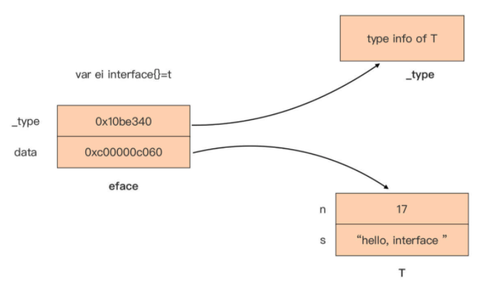
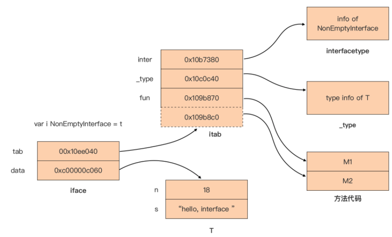
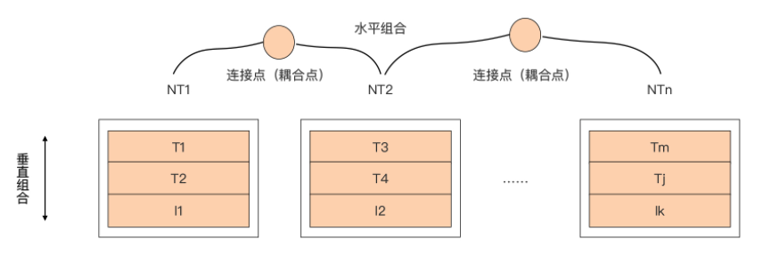
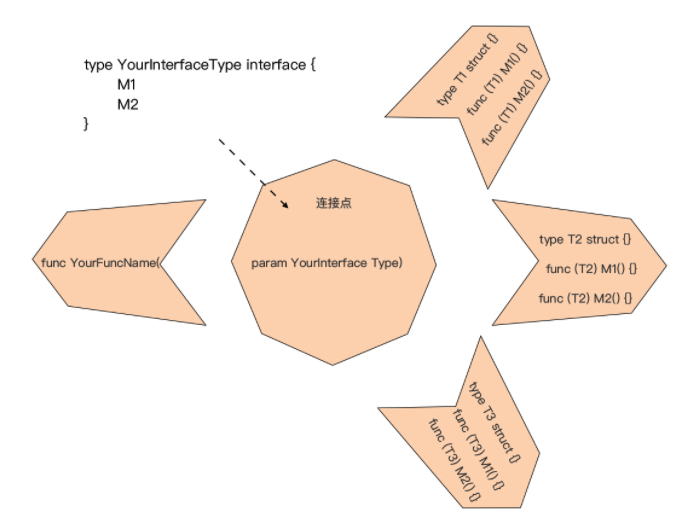

# Go Interface

## Go 应用骨架（Application Skeleton）

接口类型语法与 Go 原生提供的三个并发原语（Goroutine、channel 与 select），它们不仅代表了 Go 语言在编程语言领域的创新，更是影响 Go 应用骨架 （Application Skeleton）设计的重要元素。

所谓应用骨架，就是指将应用代码中的业务逻辑、算法实现逻辑、错误处理逻辑等“皮肉”逐一揭去后所呈现出的应用结构，这就好比下面这个可爱的 Gopher（地鼠）通过 X 光机所看到的骨骼结构：


通过这幅骨架结构图，能看到哪些有用的信息呢？

- 从静态角度去看，能清晰地看到应用程序的组成部分以及各个部分之间的连接，可以将其理解为 Go 应用内部的**耦合设计**；
- 从动态角度去看，能看到这幅骨架上可独立运动的几大机构，可以理解为应用的**并发设计**。 

而接口类型与 Go 并发语法恰分别是耦合设计与并发设计的主要参与者，因此 Go 应用的骨架设计离不开它们。

一个良好的骨架设计又决定了应用的健壮性、灵活性与扩展性，甚至是应用的运行效率。


## 认识接口类型

接口类型是由 type 和 interface 关键字定义的一组方法集合，其中，方法集合唯一确定了这个接口类型所表示的接口。

### 典型的接口类型定义

下面是一个典型的接口类型 MyInterface 的定义：

```go
// 定义 新接口

type MyInterface interface {
   M1(int) error
   M2(io.Writer, ...string)
}
```

可以看到，接口类型 MyInterface 所表示的接口的方法集合，包含两个方法 M1 和 M2。之所以称 **M1 和 M2 为“方法”**，更多是从这个接口的实现者的角度 考虑的。

但从上面接口类型声明中各个“方法”的形式上来看，这更像是不带有 func 关键 字的函数名 + 函数签名（参数列表 + 返回值列表）的组合。 

并且，和函数签名一样，在接口类型的方法集合中声明的方法，它的参数列表不需要写出形参名字，返回值列表也是如此。也就是说，方法的参数列表中形参名字与返回值列表中的具名返回值，都不作为区分两个方法的凭据。 

比如下面的 MyInterface 接口类型的定义与上面的 MyInterface 接口类型定义都是**等价**的：

```go
// 等价的 新接口

type MyInterface interface {
   M1(a int) error
   M2(w io.Writer, strs ...string)
}

type MyInterface interface {
   M1(n int) error
   M2(w io.Writer, args ...string)
}
```

不过，Go 语言要求接口类型声明中的**方法必须是具名的**，并且**方法名字在这个接口类型的方法集合中是唯一的**。

在**类型嵌入**中知道：Go 1.14 版本以后，Go 接口类型允许嵌入的不同接口类型的方法集合存在**交集**，但前提是交集中的方法不仅名字要一样，它的函数签名部分也要保持一致，也就是参数列表与返回值列表也要相同，否则 Go 编译器照样会报错。 

比如下面示例中 Interface3 嵌入了 Interface1 和 Interface2，但后两者交集中的 M1 方法的函数签名不同，导致了编译出错：

```go
// 类型嵌入中的方法存在交集

type Interface1 interface {
   M1()
}

type Interface2 interface {
   M1(string)
   M2()
}

type Interface3 interface {
   Interface1
   Interface2 // 编译器报错：duplicate method M1
   M3()
}
```

### 非导出接口类型

举的例子中的方法都是**首字母大写的导出方法**，那在接口类型定义中是否可以声明**首字母小写的非导出方法**呢？ 

答案是可以的。在 Go 接口类型的方法集合中放入首字母小写的非导出方法也是合法的， 并且在 **Go 标准库**中也找到了带有非导出方法的接口类型定义，比如 **context 包中的 canceler 接口类型**，它的代码如下：

```go
// context/context.go

// A canceler is a context type that can be canceled directly. The implementations are *cancelCtx and *timerCtx.
type canceler interface {
   cancel(removeFromParent bool, err error)
   Done() <-chan struct{}
}
```

但这样的**例子并不多**。通过对标准库这为数不多的例子，可以看到，如果接口类型的方法集合中包含非导出方法，那么这个接口类型自身通常也是非导出的，它的**应用范围也仅局限于包内**。

不过，在日常实际编码过程中，极少使用这种带有非导出方法的接口类型，简单了解一下就可以了。

### 空接口类型

除了上面这种常规情况，还有**空接口类型这种特殊情况**。如果一个接口类型定义中没有一 个方法，那么它的方法集合就为空，比如下面的 EmptyInterface 接口类型：

```go
// 空接口类型

type EmptyInterface interface {
}
```

这个方法集合为空的接口类型就被称为空接口类型，但通常不需要自己显式定义这类空接口类型，**直接使用interface{}这个类型字面值**作为所有空接口类型的代表就可以了。 

### 接口类型变量

接口类型一旦被定义后，它就和其他 Go 类型一样可以用于声明变量，比如：

```go
// 定义接口类型变量
var err error   // err是一个error接口类型的实例变量
var r io.Reader // r是一个io.Reader接口类型的实例变量
```

这些类型为接口类型的变量被称为**接口类型变量**，如果没有被显式赋予初值，接口类型变量的**默认值为 nil**。

### 空接口类型的变量赋值

如果要为接口类型变量**显式赋予初值**，就要为接口类型变量选择**合法的右值**。 

Go 规定：如果一个类型 T 的方法集合是某接口类型 I 的方法集合的等价集合或超集，就说类型 T 实现了接口类型 I，那么类型 T 的变量就可以作为合法的右值赋值给接口类型 I 的变量。

已知一个类型 T 和其指针类型 *T 的方法集合的求取规则了，所以这里也就不难判断一个类型是否实现了某个接口。 

如果一个变量的类型是空接口类型，由于空接口类型的方法集合为空，这就意味着任何类型都实现了空接口的方法集合，所以可以**将任何类型的值作为右值，赋值给空接口类 型的变量**，比如下面例子：

```go
// 赋值给空接口类型的变量
var i interface{} = 15 // ok
i = "hello, golang"    // ok
type T struct{}

var t T
i = t  // ok
i = &t // ok
```

空接口类型的这一可接受任意类型变量值作为右值的特性，让他成为 Go 加入泛型语法之前**唯一一种具有“泛型”能力的语法元素**，包括 Go 标准库在内的一些通用数据结构与算法的实现，都使用了**空类型interface{}作为数据元素的类型**，这样就无需为每种支持的元素类型单独做一份代码拷贝了。 

### 接口类型变量赋值的“逆操作”（类型断言Type Assertion）

Go 语言还支持接口类型变量赋值的“逆操作”，也就是**通过接口类型变量“还原”它的右值的类型与值信息**，这个过程被称为**“类型断言（Type Assertion）”**。

类型断言通常使用下面的语法形式：

```go
// 类型断言
v := i.(T)
```

但在这种形式下，

- 一旦接口变量 i 之前被赋予的值不是 T 类型的值，那么这个语句将抛出 panic。
- 如果变量 i 被赋予的值是 T 类型的值，那么变量 v 的类型为 T，它的值就会是之前变量 i 的右值。

由于可能出现 panic，所以并不推荐使用这种类型断言的语法形式。 

为了加深理解，接下来通过一个例子来直观看一下类型断言的语义：

```go
// 类型断言例子
var a int64 = 13
var i interface{} = a
v1, ok := i.(int64)
fmt.Printf("v1=%d, the type of v1 is %T, ok=%t\n", v1, v1, ok) // v1=13, the type of v1 is int64, ok=true
v2, ok := i.(string)
fmt.Printf("v2=%s, the type of v2 is %T, ok=%t\n", v2, v2, ok) // v2=, the type of v2 is string, ok=false
v3 := i.(int64)
fmt.Printf("v3=%d, the type of v3 is %T\n", v3, v3) // v3=13, the type of v3 is int64
v4 := i.([]int)                                     // panic: interface conversion: interface {} is int64, not []int
fmt.Printf("the type of v4 is %T\n", v4)
```

可以看到，这个例子的输出结果与讲解的是一致的。 在这段代码中，如果`v, ok := i.(T) `中的 T 是一个接口类型，那么类型断言的语义就会变成：断言 i 的值实现了接口类型 T。

- 如果断言成功，变量 v 的类型为 i 的值的类型，而并非接口类型 T。
- 如果断言失败，v 的类型信息为接口类型 T，它的值为 nil，

下面再来看一个 T 为接口类型的示例：

```go
package main

import "fmt"

type MyInterface interface {
   M1()
}

type T int

func (T) M1() {
   println("T's M1")
}

func main() {
   var t T
   var i interface{} = t
   v1, ok := i.(MyInterface)
   if !ok {
      panic("the value of i is not MyInterface")
   }

   v1.M1()
   fmt.Printf("the type of v1 is %T\n", v1) // the type of v1 is main.T

   i = int64(13)
   v2, ok := i.(MyInterface)
   fmt.Printf("the type of v2 is %T\n", v2) // the type of v2 is <nil>
   // v2 = 13 // cannot use 13 (type int) as type MyInterface in assignment:
   // int does not implement MyInterface (missing M1 method)
}
```

通过 the type of v2 is ，其实是看不出断言失败后的变量 v2 的类型的，但通过最后一行代码的编译器错误提示，能清晰地看到 v2 的类型信息为 MyInterface。 

### 接口类型的类型断言 type switch

其实，接口类型的类型断言还有一个变种，那就是 type switch，不过这个在讲解 switch 语句的时候讲过了。

关于接口类型的基础语法已经全部讲完了。有了这个基础后，再来看看 Go 语言接口定义的惯例，也就是尽量定义“小接口”。 


## 尽量定义“小接口” 

接口类型的背后，是通过把类型的行为抽象成契约，建立双方共同遵守的约定，这种契约将双方的耦合降到了最低的程度。

和生活工作中的契约有繁有简，签署方式多样一样，代码间的契约也有多有少，有大有小，而且达成契约的方式也有所不同。 

而 Go 选择了去繁就简的形式，这主要体现在以下两点上：

- **隐式契约，无需签署，自动生效**
  - Go 语言中接口类型与它的实现者之间的关系是隐式的，不需要像其他语言（比如 Java） 那样要求实现者显式放置“implements”进行修饰，
  - 实现者只需要实现接口方法集合中的全部方法便算是遵守了契约，并立即生效了。
- **更倾向于“小契约”**
  - 这点也不难理解。如果契约太繁杂了就会束缚了手脚，缺少了灵活性，抑制了表现力。
  - 所以 Go 选择了使用“小契约”，表现在代码上就是尽量定义小接口，即方法个数在 1~3 个之间的接口。
  - Go 语言之父 Rob Pike 曾说过的“接口越大，抽象程度越弱”，这也是 Go 社区倾向定义小接口的另外一种表述。

### Go 标准库与项目的小接口

Go 对小接口的青睐在它的标准库中体现得淋漓尽致，这里给出了**标准库**中一些日常开发中常用的接口的定义：

```go
// $GOROOT/src/builtin/builtin.go
type error interface {
   Error() string
}

// $GOROOT/src/io/io.go
type Reader interface {
   Read(p []byte) (n int, err error)
}

// $GOROOT/src/net/http/server.go
type Handler interface {
   ServeHTTP(ResponseWriter, *Request)
}

type ResponseWriter interface {
   Header() Header
   Write([]byte) (int, error)
   WriteHeader(int)
}
```

上述这些接口的方法数量在 1~3 个之间，这种“小接口”的 Go 惯例也已经被 Go 社区项目广泛采用。

统计了早期版本的 Go 标准库（Go 1.13 版本）、Docker 项目 （Docker 19.03 版本）以及 Kubernetes 项目（Kubernetes 1.17 版本）中定义的接口类型方法集合中方法数量，可以看下：


从图中可以看到，无论是 Go 标准库，还是 Go 社区知名项目，它们基本都遵循 了“尽量定义小接口”的惯例，接口方法数量在 1~3 范围内的接口占了绝大多数。 

### 小接口有哪些优势？ 

#### 第一点：接口越小，抽象程度越高 

计算机程序本身就是对真实世界的抽象与再建构。抽象就是对同类事物去除它具体的、次要的方面，抽取它相同的、主要的方面。不同的抽象程度，会导致抽象出的概念对应的事物的集合不同。

抽象程度越高，对应的集合空间就越大；抽象程度越低，也就是越具像化，更接近事物真实面貌，对应的集合空间越小。 

举一个生活中的简单例子。可以看下这张示意图，它是对生活中不同抽象程度的形象诠释：


这张图中分别建立了三个抽象：

- 会飞的。这个抽象对应的事物集合包括：蝴蝶、蜜蜂、麻雀、天鹅、鸳鸯、海鸥和信天 翁； 
- 会游泳的。它对应的事物集合包括：鸭子、海豚、人类、天鹅、鸳鸯、海鸥和信天翁； 
- 会飞且会游泳的。这个抽象对应的事物集合包括：天鹅、鸳鸯、海鸥和信天翁。

“会飞的”、“会游泳的”这两个抽象对应的事物集合，要大于“会飞且会游泳的”所对应的事物集合空间，也就是说“会飞的”、“会游泳的”这两个抽象程度更高。 

将上面的抽象转换为 Go 代码看看：

```go
// 会飞的
type Flyable interface {
   Fly()
}

// 会游泳的
type Swimable interface {
   Swim()
}

// 会飞且会游泳的
type FlySwimable interface {
   Flyable
   Swimable
}
```

用上述定义的接口替换上图中的抽象，再得到这张示意图：


可以直观地看到，这张图中的 Flyable 只有一个 Fly 方法，FlySwimable 则包含两个方法 Fly 和 Swim。

具有更少方法的 Flyable 的抽象程度相对于 FlySwimable 要高，包含的事物集合（7 种动物）也要比 FlySwimable 的事物集合（4 种动物）大。也就是说，接口越小（接口方法少)，抽象程度越高，对应的事物集合越大。 

而这种情况的**极限**恰恰就是无方法的空接口 interface{}，空接口的这个抽象对应的事物集合空间包含了 Go 语言世界的所有事物。

#### 第二点：小接口易于实现和测试 

这是一个显而易见的优点。小接口拥有比较少的方法，一般情况下只有一个方法。

所以要想满足这一接口，只需要实现一个方法或者少数几个方法就可以了，这显然要比实现拥有较多方法的接口要容易得多。

尤其是在单元测试环节，构建类型去实现只有少量方法的接口要比实现拥有较多方法的接口付出的劳动要少许多。 

#### 第三点：小接口表示的“契约”职责单一，易于复用组合

Go 推崇通过**组合**的方式构建程序。

Go 开发人员一般会尝试通过嵌入其他已有接口类型的方式来构建新接口类型，就像通过嵌入 io.Reader 和 io.Writer 构建 io.ReadWriter 那样。 

那构建时，如果有众多候选接口类型供选择，会怎么选择呢？ 

显然，会选择那些新接口类型需要的契约职责，同时也要求不要引入不需要的契约职责。在这样的情况下，拥有单一或少数方法的小接口便更有可能成为目标，而那些拥有较多方法的大接口，可能会因引入了诸多不需要的契约职责而被放弃。

由此可见，小接口更契合 Go 的组合思想，也更容易发挥出组合的威力。 

### 定义小接口，可以遵循的几点

保持简单有时候比复杂更难。小接口虽好，但如何定义出小接口是摆在所有 Gopher 面前的一道难题。这道题没有标准答案，但有一些点可供在实践中考量遵循。

#### 别管接口大小，先抽象出接口

要设计和定义出小接口，前提是需要先有接口。 

Go 语言还比较年轻，它的设计哲学和推崇的编程理念可能还没被广大 Gopher 100% 理解、接纳和应用于实践当中，尤其是 Go 所推崇的基于接口的组合思想。 

尽管接口不是 Go 独有的，但专注于接口是编写强大而灵活的 Go 代码的关键。因此，在定义小接口之前，需要先针对问题领域进行深入理解，聚焦抽象并发现接口，就像下图所展示的那样，先针对领域对象的行为进行抽象，形成一个接口集合：


初期，先不要介意这个接口集合中方法的数量，因为对问题域的理解是循序渐进的， 在第一版代码中直接定义出小接口可能并不现实。

而且，标准库中的 io.Reader 和 io.Writer 也不是在 Go 刚诞生时就有的，而是在发现对网络、文件、其他字节数据处理的实现十分相似之后才抽象出来的。

并且越偏向业务层，抽象难度就越高，这或许也是前面图中 Go 标准库小接口（1~3 个方法）占比略高于 Docker 和 Kubernetes 的原因。

#### 将大接口拆分为小接口

有了接口后，就会看到接口被用在了代码的各个地方。

一段时间后，就来分析哪些场合使用了接口的哪些方法，是否可以将这些场合使用的接口的方法提取出来，放入一个新的小接口中，就像下面图示中的那样：


这张图中的大接口 1 定义了多个方法，一段时间后，发现方法 1 和方法 2 经常用在场合 1 中，方法 3 和方法 4 经常用在场合 2 中，方法 5 和方法 6 经常用在场合 3 中，大接口 1 的方法呈现出一种按业务逻辑自然分组的状态。 

这个时候可以将这三组方法分别提取出来放入三个小接口中，也就是将大接口 1 拆分为三个小接口 A、B 和 C。

拆分后，原应用场合 1~3 使用接口 1 的地方就可以无缝替换为 接口 A、B、C 了。

#### 注意接口的单一契约职责

那么，上面已经被拆分成的小接口是否需要进一步拆分，直至每个接口都只有一个方法呢？这个依然没有标准答案，不过依然可以考量一下现有小接口是否需要满足单一契约 职责，就像 io.Reader 那样。

如果需要，就可以进一步拆分，提升抽象程度。 


## 小结 

接口类型被列入 Go 核心语法，它的重要性不言自明，它既是 Go 语言的一个微创新，也是影响 Go 应用骨架设计的重要元素。

接口类型的基础知识，包括接口类型的声明、接口类型变量的定义与初始化以及类型断言等，这里面有很多语法细节，一定要牢牢掌握。

- 比如，某接口类型定义中嵌入的不同接口类型的方法集合若存在交集，交集中的方法不仅名字要一样，函数签名也要相同。
- 再比如，对接口类型和非接口类型进行类型断言的语义是不完全相同的。 

Go 接口背后的本质是一种“契约”，通过契约可以将代码双方的耦合降至最低。

Go 惯例上推荐尽量定义小接口，一般而言接口方法集合中的方法个数不要超过三个，单一方法的接口更受 Go 社区青睐。 

小接口有诸多优点，比如，

- 抽象程度高、易于测试与实现、与组合的设计思想一脉相承、 鼓励编写组合的代码，等等。

但要一步到位地定义出小接口不是一件简单的事，尤其是在复杂的业务领域。


## 接口的静态特性与动态特性 

Go 接口是构建 Go 应用骨架的重要元素。

从语言设计角度来看，Go 语言的接口（interface）和并发（concurrency）原语是最喜欢的两类 Go 语言语法元素。

Go 语言核心团队的技术负责人 Russ Cox 也曾说过这样一句话：“如果要从 Go 语言中挑选出一个特性放入其他语言，我会选择接口”， 这句话足以说明接口这一语法特性在这位 Go 语言大神心目中的地位。 

为什么接口在 Go 中有这么高的地位呢？这是因为接口是 Go 这门静态语言中拥有“动静兼备”的语法特性。而且，接口“动静兼备”的特性给 Go 带来了强大的表达能力，但同时也给 Go 语言初学者带来了不少困惑。

要想真正解决这些困惑，必须深入到 Go 运行时层面，看看 Go 语言在运行时是如何表示接口类型的。

### 接口的静态特性

接口的静态特性体现在**接口类型变量具有静态类型**，比如var err error中变量 err 的静态类型为 error。

拥有静态类型，那就意味着编译器会在编译阶段对所有接口类型变量的赋值操作进行类型检查，编译器会检查右值的类型是否实现了该接口方法集合中的所有方法。

如果不满足，就会报错：

```go
// 静态特性
var err error = 1 // cannot use 1 (type int) as type error in assignment: int does not implement error (missing Error method)
```

### 接口的动态特性

而接口的动态特性，就体现**在接口类型变量在运行时还存储了右值的真实类型信息**，这个 右值的真实类型被称为接口类型变量的动态类型。

看一下下面示例代码：

```go
// 动态特性
var err error
err = errors.New("error1")
fmt.Printf("%T\n", err) // *errors.errorString
```

可以看到，这个示例通过 errros.New 构造了一个错误值，赋值给了 error 接口类型变量 err，并通过 fmt.Printf 函数输出接口类型变量 err 的动态类型为 *errors.errorString。 

### 动静皆备的好处

那接口的这种“动静皆备”的特性，又带来了什么好处呢？ 

#### Duck Typing（鸭子类型）

首先，接口类型变量在程序运行时可以被赋值为不同的动态类型变量，每次赋值后，接口类型变量中存储的动态类型信息都会发生变化，这让 Go 语言可以像动态语言（比如 Python）那样拥有使用 **Duck Typing（鸭子类型）**的灵活性。

所谓鸭子类型，就是指某类型所表现出的特性（比如是否可以作为某接口类型的右值），不是由其基因（比如 C++ 中的父类）决定的，而是由类型所表现出来的行为（比如类型拥有的方法）决定的。

比如下面的例子：

```go
package main

type QuackableAnimal interface {
   Quack()
}

type Duck struct{}

func (Duck) Quack() {
   println("duck quack!")
}

type Dog struct{}

func (Dog) Quack() {
   println("dog quack!")
}

type Bird struct{}

func (Bird) Quack() {
   println("bird quack!")
}

func AnimalQuackInForest(a QuackableAnimal) {
   a.Quack()
}

func main() {
   animals := []QuackableAnimal{new(Duck), new(Dog), new(Bird)}
   for _, animal := range animals {
      AnimalQuackInForest(animal)
   }
}
```

这个例子中，用接口类型 QuackableAnimal 来代表具有“会叫”这一特征的动物， 而 Duck、Bird 和 Dog 类型各自都具有这样的特征，于是可以将这三个类型的变量赋值给 QuackableAnimal 接口类型变量 a。

每次赋值，变量 a 中存储的动态类型信息都不同，Quack 方法的执行结果将根据变量 a 中存储的动态类型信息而定。 

这里的 Duck、Bird、Dog 都是“鸭子类型”，但它们之间并没有什么联系，之所以能作为右值赋值给 QuackableAnimal 类型变量，只是因为他们**表现出了 QuackableAnimal 所要求的特征**罢了。

#### 安全性

不过，与动态语言不同的是，Go 接口还可以保证“动态特性”使用时的安全性。比如，编译器在编译期就可以捕捉到将 int 类型变量传给 QuackableAnimal 接口类型变量这样的 明显错误，决不会让这样的错误遗漏到运行时才被发现。 

接口类型的动静特性看到了接口类型的强大，但在日常使用过程中，很多人都会产生各种困惑，其中最经典的一个困惑莫过于“nil 的 error 值不等于 nil”了。下面来详细看一下。 


## nil error 值 != nil 

这里直接来看一段改编自 GO FAQ 中的例子的代码：

```go
package main

import (
   "errors"
   "fmt"
)

type MyError struct {
   error
}

var ErrBad = MyError{
   error: errors.New("bad things happened"),
}

func bad() bool {
   return false
}

func returnsError() error {
   var p *MyError = nil
   if bad() {
      p = &ErrBad
   }
   return p
}

func main() {
   err := returnsError()
   if err != nil {
      fmt.Printf("error occur: %+v\n", err)
      return
   }
   fmt.Println("ok")
}
```

在这个例子中，关注点集中在 returnsError 这个函数上面。这个函数定义了一个 *MyError 类型的变量 p，初值为 nil。

如果函数 bad 返回 false，returnsError 函数就会直接将 p（此时 p = nil）作为返回值返回给调用者，之后调用者会将 returnsError 函数的返回值（error 接口类型）与 nil 进行比较，并根据比较结果做出最终处理。 

如果是一个初学者，思路大概是这样的：p 为 nil，returnsError 返回 p，那么 main 函数中的 err 就等于 nil，于是程序输出 ok 后退出。 但真实的运行结果是什么样的呢？来看一下：

```go
error occur: <nil>
```

示例程序并未如前面预期的那样输出 ok。

程序显然是进入了错误处理分支，输出了 err 的值。那这里就有一个问题了：明明 returnsError 函数返回的 p 值为 nil，为什么却满足了if err != nil的条件进入错误处理分支呢？ 

要想弄清楚这个问题，需要进一步了解接口类型变量的内部表示。

## 接口类型变量的内部表示 

接口类型“动静兼备”的特性也决定了它的变量的内部表示绝不像一个静态类型变量（如 int、float64）那样简单，可以在`$GOROOT/src/runtime/runtime2.go` 中找到接口类型变量在运行时的表示：

```go
// runtime/runtime2.go
type iface struct {
   tab  *itab
   data unsafe.Pointer
}

type eface struct {
   _type *_type
   data  unsafe.Pointer
}
```

可以看到，在运行时层面，接口类型变量有两种内部表示：iface和eface，这两种表示分别用于不同的接口类型变量：

- eface 用于表示**没有方法的空接口（empty interface）类型变量**，也就是 interface{} 类型的变量； 
- iface 用于表示其余**拥有方法的接口 interface 类型变量**。

这两个结构的共同点是它们都有两个指针字段，并且第二个指针字段的功能相同，都是指向当前赋值给该接口类型变量的动态类型变量的值。 

### eface

那它们的不同点在哪呢？就在于 eface 表示的空接口类型并没有方法列表，因此它的第一个指针字段指向一个_type类型结构，这个结构为该接口类型变量的动态类型的信息，它的定义是这样的：

```go
// runtime/type.go
type _type struct {
   size       uintptr
   ptrdata    uintptr // size of memory prefix holding all pointers
   hash       uint32
   tflag      tflag
   align      uint8
   fieldAlign uint8
   kind       uint8
   // function for comparing objects of this type
   // (ptr to object A, ptr to object B) -> ==?
   equal func(unsafe.Pointer, unsafe.Pointer) bool
   // gcdata stores the GC type data for the garbage collector.
   // If the KindGCProg bit is set in kind, gcdata is a GC program.
   // Otherwise it is a ptrmask bitmap. See mbitmap.go for details.
   gcdata    *byte
   str       nameOff
   ptrToThis typeOff
}
```

### iface

而 iface 除了要存储动态类型信息之外，还要存储接口本身的信息（接口的类型信息、方法列表信息等）以及动态类型所实现的方法的信息，因此 iface 的第一个字段指向一个 itab类型结构。

itab 结构的定义如下：

```go
// runtime/runtime2.go
type itab struct {
   inter *interfacetype
   _type *_type
   hash  uint32 // copy of _type.hash. Used for type switches.
   _     [4]byte
   fun   [1]uintptr // variable sized. fun[0]==0 means _type does not implement inter.
}
```

这里也可以看到，itab 结构中的第一个字段inter指向的 interfacetype 结构，存储着这个接口类型自身的信息。

看一下下面这段代码表示的 interfacetype 类型定义， 这 个 interfacetype 结构由类型信息（typ）、包路径名（pkgpath）和接口方法集合切片 （mhdr）组成。

```go
// runtime/type.go
type interfacetype struct {
   typ     _type
   pkgpath name
   mhdr    []imethod
}
```

itab 结构中的字段_type则存储着这个接口类型变量的动态类型的信息，字段fun则是动态类型已实现的接口方法的调用地址数组。 


### 用 eface 表示的空接口类型变量

下面再结合例子用图片来直观展现 eface 和 iface 的结构。

首先看一个用 eface 表示的空接口类型变量的例子：

```go
package main

import "fmt"

type T struct {
   n int
   s string
}

func main() {
   var t = T{
      n: 17,
      s: "hello, interface",
   }

   var ei interface{} = t // Go运行时使用eface结构表示ei

   fmt.Printf("error occur: %+v\n", ei)
}
```

这个例子中的空接口类型变量 ei 在 Go 运行时的表示是这样的：



空接口类型的表示较为简单，图中上半部分 _type 字段指向它的动态类型 T 的类型信息，下半部分的 data 则是指向一个 T 类型的实例值。

### 用 iface 表示非空接口类型变量

再来看一个更复杂的用 iface 表示非空接口类型变量的例子：

```go
package main

import "fmt"

type T struct {
   n int
   s string
}

func (T) M1() {}
func (T) M2() {}

type NonEmptyInterface interface {
   M1()
   M2()
}

func main() {
   var t = T{
      n: 18,
      s: "hello, interface",
   }

   var i NonEmptyInterface = t

   fmt.Printf("error occur: %+v\n", i)

}
```

和 eface 比起来，iface 的表示稍微复杂些。

也画了一幅表示上面 NonEmptyInterface 接口类型变量在 Go 运行时表示的示意图：



由上面的这两幅图，可以看出，每个接口类型变量在运行时的表示都是由两部分组成的，针对不同接口类型可以简化记作：eface(_type, data)和iface(tab, data)。

而且，虽然 eface 和 iface 的第一个字段有所差别，但 tab 和 _type 可以统一看作是动态类型的类型信息。

- Go 语言中每种类型都会有唯一的 _type 信息，无论是内置原生类型，还是自定义类型都有。
- Go 运行时会为程序内的全部类型建立只读的共享 _type 信息表，因此拥有相同动态类型的同类接口类型变量的 _type/tab 信息是相同的。 

而接口类型变量的 data 部分则是指向一个动态分配的内存空间，这个内存空间存储的是赋值给接口类型变量的动态类型变量的值。未显式初始化的接口类型变量的值为nil，也就是这个变量的 _type/tab 和 data 都为 nil。

### 判断接口类型变量是否相等

也就是说，**判断两个接口类型变量是否相同**，只需要判断 _type/tab 是否相同，以及 data 指针指向的内存空间所存储的数据值是否相同就可以了。这里要注意不是 data 指针的值相同噢。 

不过，通过肉眼去辨别接口类型变量是否相等总是困难一些，可以引入一些 **helper 函数**。借助这些函数，可以清晰地输出接口类型变量的内部表示，这样就可以一目了然 地看出两个变量是否相等了。 

由于 **eface 和 iface 是 runtime 包中的非导出结构体定义**，不能直接在包外使用，所以也就无法直接访问到两个结构体中的数据。不过，Go 语言提供了 **println 预定义函数**， 可以用来输出 eface 或 iface 的两个指针字段的值。 

在编译阶段，编译器会根据要输出的参数的类型**将 println 替换为特定的函数**，这些函数都定义在`$GOROOT/src/runtime/print.go`文件中，而针对 eface 和 iface 类型的打印函数实现如下：

```go
// runtime/print.go
func printeface(e eface) {
   print("(", e._type, ",", e.data, ")")
}

func printiface(i iface) {
   print("(", i.tab, ",", i.data, ")")
}
```

可以看到，printeface 和 printiface 会输出各自的两个指针字段的值。

下面就来使用 println 函数输出各类接口类型变量的内部表示信息，并结合输出结果，解析接口类型变量的等值比较操作。 

#### 第一种：nil 接口变量 

未赋初值的接口类型变量的值为 nil，这类变量也就是 nil 接口变量，来看这类变量的内部表示输出的例子：

```go
package main

func printNilInterface() {
   // nil接口变量
   var i interface{} // 空接口类型
   var err error     // 非空接口类型
   println(i)
   println(err)
   println("i = nil:", i == nil)
   println("err = nil:", err == nil)
   println("i = err:", i == err)
}

func main() {
   printNilInterface()
}
```

运行这个函数，输出结果是这样的：

```go
(0x0,0x0)
(0x0,0x0)
i = nil: true
err = nil: true
i = err: true
```

可以看到，无论是空接口类型还是非空接口类型变量，一旦变量值为 nil，那么它们内部表示均为(0x0,0x0)，也就是类型信息、数据值信息均为空。因此上面的变量 i 和 err 等值判断为 true。

#### 第二种：空接口类型变量 

下面是空接口类型变量的内部表示输出的例子：

```go
package main

func printEmptyInterface() {
   // 空接口类型变量
   var eif1 interface{} // 空接口类型
   var eif2 interface{} // 空接口类型
   var n, m int = 17, 18
   
   eif1 = n
   eif2 = m
   
   println("eif1:", eif1)
   println("eif2:", eif2)
   println("eif1 = eif2:", eif1 == eif2) // false
   
   eif2 = 17
   println("eif1:", eif1)
   println("eif2:", eif2)
   println("eif1 = eif2:", eif1 == eif2) // true
   
   eif2 = int64(17)
   println("eif1:", eif1)
   println("eif2:", eif2)
   println("eif1 = eif2:", eif1 == eif2) // false
}

func main() {
   printEmptyInterface()
}
```

这个例子的运行输出结果是这样的：

```go
eif1: (0x1058e40,0xc00003a768)
eif2: (0x1058e40,0xc00003a760)
eif1 = eif2: false
eif1: (0x1058e40,0xc00003a768)
eif2: (0x1058e40,0x1075be0)
eif1 = eif2: true
eif1: (0x1058e40,0xc00003a768)
eif2: (0x1058f00,0x1075be0)
eif1 = eif2: false
```

按顺序分析一下这个输出结果。 

- 首先，代码执行到第 11 行时，eif1 与 eif2 已经分别被赋值整型值 17 与 18，这样 eif1 和 eif2 的动态类型的类型信息是相同的（都是 0x1058e40），但 data 指针指向的内存块中存储的值不同，一个是 17，一个是 18，于是 eif1 不等于 eif2。 
- 接着，代码执行到第 16 行的时候，eif2 已经被重新赋值为 17，这样 eif1 和 eif2 不仅存储的动态类型的类型信息是相同的（都是 0x1058e40），data 指针指向的内存块中存储值也相同了，都是 17，于是 eif1 等于 eif2。 
- 然后，代码执行到第 21 行时，eif2 已经被重新赋值了 int64 类型的数值 17。这样，eif1 和 eif2 存储的动态类型的类型信息就变成不同的了，一个是 int，一个是 int64，即便 data 指针指向的内存块中存储值是相同的，最终 eif1 与 eif2 也是不相等的。 

从输出结果中可以总结一下：对于空接口类型变量，**只有 _type 和 data 所指数据内容一致的情况下，两个空接口类型变量之间才能划等号**。

另外，Go 在创建 eface 时一般会为 data 重新分配新内存空间，将动态类型变量的值复制到这块内存空间，并将 data 指针指向这块内存空间。因此多数情况下看到的 data 指针值都是不同的。

#### 第三种：非空接口类型变量 

这里，也直接来看一个非空接口类型变量的内部表示输出的例子

```go
package main

import "fmt"

type T int

func (t T) Error() string {
   return "bad error"
}

func printNonEmptyInterface() {
   // 非空接口类型变量
   var err1 error // 非空接口类型
   var err2 error // 非空接口类型
   err1 = (*T)(nil)
   println("err1:", err1)
   println("err1 = nil:", err1 == nil)

   err1 = T(5)
   err2 = T(6)
   println("err1:", err1)
   println("err2:", err2)
   println("err1 = err2:", err1 == err2)

   err2 = fmt.Errorf("%d\n", 5)
   println("err1:", err1)
   println("err2:", err2)
   println("err1 = err2:", err1 == err2)
}

func main() {
   printNonEmptyInterface()
}
```

这个例子的运行输出结果如下：

```sh
err1: (0x10bfca0,0x0)
err1 = nil: false
err1: (0x10bfd00,0x10bf4b0)
err2: (0x10bfd00,0x10bf4b8)
err1 = err2: false
err1: (0x10bfd00,0x10bf4b0)
err2: (0x10bfc20,0xc000096210)
err1 = err2: false
```

上面示例中每一轮通过 println 输出的 err1 和 err2 的 tab 和 data 值，要么 data 值不同，要么 tab 与 data 值都不同。

和空接口类型变量一样，只有 tab 和 data 指的数据内容一致的情况下，两个非空接口类型变量之间才能划等号。

这里要注意 err1 下面的赋值情况：

```go
err1 = (*T)(nil)
```

针对这种赋值，println 输出的 err1 是（0x10bfca0, 0x0），也就是非空接口类型变量的类型信息并不为空，数据指针为空，因此它与 nil（0x0,0x0）之间不能划等号。

现在再回到开头的那个问题，是不是已经豁然开朗了呢？开头的问题中，从 returnsError 返回的 error 接口类型变量 err 的数据指针虽然为空，但它的类型信息 （iface.tab）并不为空，而是 *MyError 对应的类型信息，这样 err 与 nil（0x0,0x0）相比自然不相等，这就是那个问题的答案解析，现在你明白了吗？

#### 第四种：空接口类型变量与非空接口类型变量的等值比较 

下面是非空接口类型变量和空接口类型变量之间进行比较的例子：

```go
package main

import "fmt"

func printEmptyInterfaceAndNonEmptyInterface() {
   // 空接口类型变量与非空接口类型变量的等值比较
   var eif interface{} = T(5)
   var err error = T(5)
   println("eif:", eif)
   println("err:", err)
   println("eif = err:", eif == err)
  
   err = T(6)
   println("eif:", eif)
   println("err:", err)
   println("eif = err:", eif == err)
}

func main() {
   printEmptyInterfaceAndNonEmptyInterface()
}
```

这个示例的输出结果如下：

```sh
eif: (0x1074b60,0x1098dc0)
err: (0x10992e0,0x1098dc0)
eif = err: true
eif: (0x1074b60,0x1098dc0)
err: (0x10992e0,0x1098dc8)
eif = err: false
```

可以看到，空接口类型变量和非空接口类型变量内部表示的结构有所不同（第一个字段：\_type vs. tab，两者似乎一定不能相等。但 Go 在进行等值比较时，类型比较使用的是 eface 的 \_type 和 iface 的 tab._type，因此就像在这个例子中看到的那样，当 eif 和 err 都被赋值为T(5)时，两者之间是划等号的。 

好了，到这里，已经学完了各类接口类型变量在运行时层的表示。通过 println 可以查看这个表示信息，从中也知道了**接口变量只有在类型信息与值信息都一 致的情况下才能划等号**。


### 输出接口类型变量内部表示的详细信息 

不过，println 输出的接口类型变量的内部表示信息，在一般情况下都是足够的，但有些时候又显得过于简略，比如在上面最后一个例子中，如果仅凭`eif: (0x1074b60,0x1098dc0)`和`err: (0x10992e0,0x1098dc0)`的输出，是无法想到两个变量是相等的。 

那这时如果能输出接口类型变量内部表示的详细信息（比如：tab._type），那势必可以取得事半功倍的效果。接下来就看看这要怎么做。 

前面提到过，eface 和 iface 以及组成它们的 itab 和 _type 都是 runtime 包下的非导出结构体，无法在外部直接引用它们。但发现，组成 eface、iface 的类型都是基本数据类型，完全可以通过“**复制代码**”的方式将它们拿到 runtime 包外面来。 

不过，这里要注意，由于 runtime 中的 eface、iface，或者它们的组成可能会随着 Go 版本的变化发生变化，因此**这个方法不具备跨版本兼容性**。

也就是说，基于 Go 1.17 版本复制的代码，可能仅适用于使用 Go 1.17 版本编译。这里就以 Go 1.17 版本为例看看：

```go
package main

import (
	"fmt"
	"unsafe"
)

type eface struct {
	_type *_type
	data  unsafe.Pointer
}

type tflag uint8
type nameOff int32
type typeOff int32

type _type struct {
	size       uintptr
	ptrdata    uintptr // size of memory prefix holding all pointers
	hash       uint32
	tflag      tflag
	align      uint8
	fieldAlign uint8
	kind       uint8
	// function for comparing objects of this type
	// (ptr to object A, ptr to object B) -> ==?
	equal func(unsafe.Pointer, unsafe.Pointer) bool
	// gcdata stores the GC type data for the garbage collector.
	// If the KindGCProg bit is set in kind, gcdata is a GC program.
	// Otherwise it is a ptrmask bitmap. See mbitmap.go for details.
	gcdata    *byte
	str       nameOff
	ptrToThis typeOff
}

type iface struct {
	tab  *itab
	data unsafe.Pointer
}

type itab struct {
	inter *interfacetype
	_type *_type
	hash  uint32 // copy of _type.hash. Used for type switches.
	_     [4]byte
	fun   [1]uintptr // variable sized. fun[0]==0 means _type does not impleme
}

type interfacetype struct {
	typ     _type
	pkgpath name
	mhdr    []imethod
}

type name struct {
	bytes *byte
}

type imethod struct {
	name nameOff
	ityp typeOff
}

const ptrSize = unsafe.Sizeof(uintptr(0))

// 适用于go 1.17.x version
func dumpEface(i interface{}) {
	ptrToEface := (*eface)(unsafe.Pointer(&i))
	fmt.Printf("eface: %+v\n", *ptrToEface)

	if ptrToEface._type != nil {
		// dump _type info
		fmt.Printf("\t _type: %+v\n", *(ptrToEface._type))
	}

	if ptrToEface.data != nil {
		// dump data
		switch i.(type) {
		case int:
			dumpInt(ptrToEface.data)
		case float64:
			dumpFloat64(ptrToEface.data)
		case T:
			dumpT(ptrToEface.data)

			// other cases ... ...
		default:
			fmt.Printf("\t unsupported data type\n")
		}
	}
	fmt.Printf("\n")
}

func dumpInt(dataOfEface unsafe.Pointer) {
	var p *int = (*int)(dataOfEface)
	fmt.Printf("\t data: %d\n", *p)
}

func dumpFloat64(dataOfEface unsafe.Pointer) {
	var p *float64 = (*float64)(dataOfEface)
	fmt.Printf("\t data: %f\n", *p)
}

func dumpItabOfIface(ptrToIface unsafe.Pointer) {
	p := (*iface)(ptrToIface)
	fmt.Printf("iface: %+v\n", *p)
	if p.tab != nil {
		// dump itab
		fmt.Printf("\t itab: %+v\n", *(p.tab))
		// dump inter in itab
		fmt.Printf("\t\t inter: %+v\n", *(p.tab.inter))

		// dump _type in itab
		fmt.Printf("\t\t _type: %+v\n", *(p.tab._type))

		// dump fun in tab
		funPtr := unsafe.Pointer(&(p.tab.fun))
		fmt.Printf("\t\t fun: [")
		for i := 0; i < len((*(p.tab.inter)).mhdr); i++ {
			tp := (*uintptr)(unsafe.Pointer(uintptr(funPtr) + uintptr(i)*ptrSize))
			fmt.Printf("0x%x(%d),", *tp, *tp)
		}
		fmt.Printf("]\n")
	}
}

func dumpDataOfIface(i interface{}) {
	// this is a trick as the data part of eface and iface are same
	ptrToEface := (*eface)(unsafe.Pointer(&i))
	if ptrToEface.data != nil {
		// dump data
		switch i.(type) {
		case int:
			dumpInt(ptrToEface.data)
		case float64:
			dumpFloat64(ptrToEface.data)
		case T:
			dumpT(ptrToEface.data)
			// other cases ... ...

		default:
			fmt.Printf("\t unsupported data type\n")
		}
	}
	fmt.Printf("\n")
}

func dumpT(dataOfIface unsafe.Pointer) {
	var p *T = (*T)(dataOfIface)
	fmt.Printf("\t data: %+v\n", *p)
}
```

上面这个 interfacedump/main.go 中提供了三个主要函数:

- dumpEface: 用于输出空接口类型变量的内部表示信息； 
- dumpItabOfIface: 用于输出非空接口类型变量的 tab 字段信息；
- dumpDataOfIface: 用于输出非空接口类型变量的 data 字段信息；

利用这三个函数来输出一下前面 `printEmptyInterfaceAndNonEmptyInterface` 函数中的接口类型变量的信息：

```go
type T int

func (t T) Error() string {
   return "bad error"
}

func main() {
   var eif interface{} = T(5)
   var err error = T(5)
   println("eif:", eif)
   println("err:", err)
   println("eif = err:", eif == err)

   dumpEface(eif)
   dumpItabOfIface(unsafe.Pointer(&err))
   dumpDataOfIface(err)
}
```

运行这个示例代码，得到了这个输出结果：

```go
eif: (0x10957e0,0x10c1a90)
err: (0x10c22e0,0x10c1a90)
eif = err: true
eface: {_type:0x10957e0 data:0x10c1a90}
         _type: {size:8 ptrdata:0 hash:1156555957 tflag:15 align:8 fieldAlign:8 kind:2 equal:0x1002c80 gcdata:0x10c19bb str:3550 ptrToThis:40384}
         data: bad error

iface: {tab:0x10c22e0 data:0x10c1a90}
         itab: {inter:0x1097620 _type:0x10957e0 hash:1156555957 _:[0 0 0 0] fun:[17350016]}
                 inter: {typ:{size:16 ptrdata:16 hash:235953867 tflag:7 align:8 fieldAlign:8 kind:20 equal:0x1002de0 gcdata:0x10abc90 str:2568 ptrToThis:17504} pkgpath:{bytes:<nil>} mhdr:[{name:1458 ityp:29600}]}
                 _type: {size:8 ptrdata:0 hash:1156555957 tflag:15 align:8 fieldAlign:8 kind:2 equal:0x1002c80 gcdata:0x10c19bb str:3550 ptrToThis:40384}
                 fun: [0x108bd80(17350016),]
         data: bad error
```

从输出结果中，看到 eif 的 `_type（0x10957e0）`与 err 的 `tab._type（0x10957e0）` 是一致的，data 指针所指内容（“bad error”）也是一致的，因此eif == err表达式的结果为 true。 

再次强调一遍，上面这个实现可能仅在 Go 1.17 版本上测试通过，并且在输出 iface 或 eface 的 data 部分内容时只列出了 int、float64 和 T 类型的数据读取实现，没有列出全部类型的实现，可以根据自己的需要实现其余数据类型。

现在已经知道了，接口类型有着复杂的内部结构，所以将一个类型变量值赋值给一个接口类型变量值的过程肯定不会像var i int = 5那么简单，那么接口类型变量赋值的过程是怎样的呢？其实接口类型变量赋值是一个**“装箱”的过程**。


## 接口类型的装箱（boxing）原理

装箱（boxing）是编程语言领域的一个基础概念，一般是指把一个值类型转换成引用类型，比如在支持装箱概念的 Java 语言中，将一个 int 变量转换成 Integer 对象就是一个装箱操作。 

在 Go 语言中，**将任意类型赋值给一个接口类型变量**也是装箱操作。有了前面对接口类型变量内部表示的学习，知道接口类型的装箱实际就是创建一个 eface 或 iface 的过程。

### convT2E 和 convT2I 函数

接下来就来简要描述一下这个过程，也就是接口类型的装箱原理。 基于下面这个例子中的接口装箱操作来说明：

```go
package main

import "fmt"

type T struct {
   n int
   s string
}

func (T) M1() {}
func (T) M2() {}

type NonEmptyInterface interface {
   M1()
   M2()
}

func main() {
   var t = T{
      n: 17,
      s: "hello, interface",
   }
   var ei interface{}
   ei = t

   var i NonEmptyInterface
   i = t
   fmt.Println(ei)
   fmt.Println(i)
}
```

这个例子中，对 ei 和 i 两个接口类型变量的赋值都会触发装箱操作，要想知道 Go 在背后做了些什么，需要“下沉”一层，也就是要输出上面 **Go 代码对应的汇编代码**：

```sh
$go tool compile -S main.go > main.s
```

对应ei = t一行的汇编如下：

```go
0x0026 00038 (main.go:24)   MOVQ   $17, ""..autotmp_15+104(SP)
0x002f 00047 (main.go:24)  LEAQ   go.string."hello, interface"(SB), CX
0x0036 00054 (main.go:24)  MOVQ   CX, ""..autotmp_15+112(SP)
0x003b 00059 (main.go:24)  MOVQ   $16, ""..autotmp_15+120(SP)
0x0044 00068 (main.go:24)  LEAQ   type."".T(SB), AX
0x004b 00075 (main.go:24)  LEAQ   ""..autotmp_15+104(SP), BX
0x0050 00080 (main.go:24)  PCDATA $1, $0
0x0050 00080 (main.go:24)  CALL   runtime.convT2E(SB)
```

对应 i = t 一行的汇编如下：

```go
0x005f 00095 (main.go:27)   MOVQ   $17, ""..autotmp_15+104(SP)
0x0068 00104 (main.go:27)  LEAQ   go.string."hello, interface"(SB), CX
0x006f 00111 (main.go:27)  MOVQ   CX, ""..autotmp_15+112(SP)
0x0074 00116 (main.go:27)  MOVQ   $16, ""..autotmp_15+120(SP)
0x007d 00125 (main.go:27)  LEAQ   go.itab."".T,"".NonEmptyInterface(SB), AX
0x0084 00132 (main.go:27)  LEAQ   ""..autotmp_15+104(SP), BX
0x0089 00137 (main.go:27)  PCDATA $1, $1
0x0089 00137 (main.go:27)  CALL   runtime.convT2I(SB)
```

在将动态类型变量赋值给接口类型变量语句对应的汇编代码中，可以看到convT2E 和 convT2I 两个 runtime 包的函数。

这两个函数的实现位于 `$GOROOT/src/runtime/iface.go`中：

```go
// runtime/iface.go
func convT2E(t *_type, elem unsafe.Pointer) (e eface) {
   if raceenabled {
      raceReadObjectPC(t, elem, getcallerpc(), funcPC(convT2E))
   }
   if msanenabled {
      msanread(elem, t.size)
   }
   x := mallocgc(t.size, t, true)
   // TODO: We allocate a zeroed object only to overwrite it with actual data.
   // Figure out how to avoid zeroing. Also below in convT2Eslice, convT2I, convT2Islice.
   typedmemmove(t, x, elem)
   e._type = t
   e.data = x
   return
}

func convT2I(tab *itab, elem unsafe.Pointer) (i iface) {
	t := tab._type
	if raceenabled {
		raceReadObjectPC(t, elem, getcallerpc(), funcPC(convT2I))
	}
	if msanenabled {
		msanread(elem, t.size)
	}
	x := mallocgc(t.size, t, true)
	typedmemmove(t, x, elem)
	i.tab = tab
	i.data = x
	return
}
```

convT2E 用于将任意类型转换为一个 eface，convT2I 用于将任意类型转换为一个 iface。 

两个函数的实现逻辑相似，主要思路就是根据传入的类型信息`（convT2E 的 _type 和 convT2I 的 tab._type）`分配一块内存空间，并将 elem 指向的数据拷贝到这块内存空间中，最后传入的类型信息作为返回值结构中的类型信息，返回值结构中的数据指针 （data）指向新分配的那块内存空间。 

由此也可以看出，经过装箱后，箱内的数据，也就是存放在新分配的内存空间中的数据**与原变量便无瓜葛**了，比如下面这个例子：

```go
func main() {
   var n int = 61
   var ei interface{} = n
   n = 62                          // n的值已经改变
   fmt.Println("data in box:", ei) // 输出仍是61
}
```

那么 convT2E 和 convT2I 函数的类型信息是从何而来的呢？

### convT2X 函数

其实这些都依赖 Go 编译器的工作。编译器知道每个要转换为接口类型变量（toType）和动态类型变量的类型（fromType），它会**根据这一对类型选择适当的 convT2X 函数**，并在生成代码时使用选出的 convT2X 函数参与装箱操作。 

### 性能损耗

不过，装箱是一个有**性能损耗的操作**，因此 Go 也在不断对装箱操作进行优化，包括对常见类型如整型、字符串、切片等提供系列快速转换函数：

```go
func convT16(val any) unsafe.Pointer     // val must be uint16-like
func convT32(val any) unsafe.Pointer     // val must be uint32-like
func convT64(val any) unsafe.Pointer     // val must be uint64-like
func convTstring(val any) unsafe.Pointer // val must be a string
func convTslice(val any) unsafe.Pointer  // val must be a slice
```

这些函数去除了 typedmemmove 操作，增加了零值快速返回等特性。 

### staticuint64s 区域

同时 **Go 建立了 staticuint64s 区域**，对 255 以内的小整数值进行装箱操作时不再分配新内存，而是利用 staticuint64s 区域的内存空间，下面是 staticuint64s 的定义：

```go
// runtime/iface.go
// staticuint64s is used to avoid allocating in convTx for small integer values.
var staticuint64s = [...]uint64{
   0x00, 0x01, 0x02, 0x03, 0x04, 0x05, 0x06, 0x07,
   ... ...
}
```


## 小结 

接口类型作为参与构建 Go 应用骨架的重要参与者，在 Go 语言中有着很高的地位。它这个地位的取得离不开它拥有的“动静兼备”的语法特性。

Go 接口的动态特性让 Go 拥有与动态语言相近的灵活性，而静态特性又在编译阶段保证了这种灵活性的安全。

要更好地理解 Go 接口的这两种特性，需要深入到 Go 接口在运行时的表示层面上去。

- 接口类型变量在运行时表示为 eface 和 iface，eface 用于表示空接口类型变量，iface 用于表示非空接口类型变量。
- 只有两个接口类型变量的类型信息 `（eface._type/iface.tab._type）`相同，且数据指针`（eface.data/iface.data）`所指数据相同时，两个接口类型变量才是相等的。 
- 可以通过 println 输出接口类型变量的两部分指针变量的值。
- 而且，通过拷贝 runtime 包 eface 和 iface 相关类型源码，还可以自定义输出 eface/iface 详尽信息的函数，不过要注意的是，由于 runtime 层代码的演进，这个函数可能不具备在 Go 版本间的移植性。 

最后，接口类型变量的赋值本质上是一种装箱操作，装箱操作是由 Go 编译器和运行时共同完成的，有一定的性能开销，对于性能敏感的系统来说，应该尽量避免或减少这类装箱操作。


## 思考题 

像 nil error 值 != nil 那个例子中的“坑”在日常编码时有遇到过吗？这个例子如何修改，才能让它按最初的预期结果输出 呢？

修改方法:

- 把returnsError()里面p的类型改为error
- 删除p，直接return &ErrBad或者nil

```go
package main

import (
   "errors"
   "fmt"
)

type MyError struct {
   error
}

var ErrBad = MyError{
   error: errors.New("bad things happened"),
}

func bad() bool {
   return false
}

func returnsError() error {
   // 有坑
   var p *MyError = nil
   if bad() {
      p = &ErrBad
   }
   return p
   // 方法一
   // var p error = nil
   // if bad() {
   //     p = &ErrBad
   // }
   // return p
   // 方法二
   // if bad() {
   //     return &ErrBad
   // }
   // return nil
}

func main() {
   err := returnsError()
   if err != nil {
      fmt.Printf("error occur: %+v\n", err)
      return
   }
   fmt.Println("ok")
}
```


## 怎么应用接口

如何利用接口进行应用的设计，以及改善已有应用的设计，换句话说就是 **Go 接口的应用模式或惯例**。

不过在讲解接口应用模式之前，还先要了解一个前置原则，那就是在实际真正需要的时候才对程序进行抽象。再通俗一些来讲，就是**不要为了抽象而抽象**。

接口本质上是一种抽象，它的功能是解耦，所以这条原则也告诉：不要为了使 用接口而使用接口。

举一个简单的例子，如果要给一个计算器添加一个整数加法的功能特性，本来一个函数就可以实现：

```go
func Add(a int64, b int64) int64 {
   return a + b
}
```

但如果非要引入一个接口，结果代码可能就变成了这样：

```go
type Adder interface {
   Add(int64, int64) int64
}

func Add(adder Adder, a int64, b int64) int64 {
   return adder.Add(a, b)
}
```

这就会产生一种“过设计”的味道了。 

要注意，接口的确可以实现解耦，但它也会引入“抽象”的副作用，或者说接口这种抽象也不是免费的，是有成本的，除了会造成运行效率的下降之外，也会影响代码的可读性。 

在多数情况下，在真实的生产项目中，接口都能给应用设计带来好处。那么如果要用接口，应该怎么用呢？怎么借助接口来改善程序的设计，让系统实现常说的高内聚和低耦合呢？这就要从 Go 语言的“组合”的设计哲学说起。 

## 一切皆组合

Go 语言之父 Rob Pike 曾说过：如果 C++ 和 Java 是关于类型层次结构和类型分类的语言，那么 Go 则是关于组合的语言。

如果把 Go 应用程序比作是一台机器的话，那么组合关注的就是如何将散落在各个包中的“零件”关联并组装到一起。组合是 Go 语言的重要设计哲学之一，而正交性则为组合哲学的落地提供了更为方便的条件。 

### 正交（Orthogonality）

**正交（Orthogonality）**是从几何学中借用的术语，说的是如果两条线以直角相交，那么这两条线就是正交的，比如在代数课程中经常用到的坐标轴就是这样。用向量术语说，这两条直线互不依赖，沿着某一条直线移动，投影到另一条直线上的位置不变。 

在计算机技术中，正交性用于表示某种不相依赖性或是解耦性。如果两个或更多事物中的 一个发生变化，不会影响其他事物，那么这些事物就是正交的。

比如，在设计良好的系统中，数据库代码与用户界面是正交的：可以改动界面，而不影响数据库；更换数据库， 而不用改动界面。 

编程语言的语法元素间和语言特性也存在着正交的情况，并且通过将这些正交的特性组合起来，可以实现更为高级的特性。在语言设计层面，Go 语言就为广大 Gopher 提供了诸多正交的语法元素供后续组合使用，包括：

- Go 语言无类型体系（Type Hierarchy），没有父子类的概念，类型定义是正交独立的； 
- 方法和类型是正交的，每种类型都可以拥有自己的方法集合，方法本质上只是一个将 receiver 参数作为第一个参数的函数而已； 
- 接口与它的实现者之间无“显式关联”，也就说接口与 Go 语言其他部分也是正交的。

在这些正交语法元素当中，**接口作为 Go 语言提供的具有天然正交性的语法元素**，在 Go 程序的静态结构搭建与耦合设计中扮演着至关重要的角色。 而要想知道接口究竟扮演什么角色，就先要了解组合的方式。 

构建 Go 应用程序的静态骨架结构有两种主要的组合方式，如下图所示：



这两种组合方式分别为垂直组合和水平组合，那这两种组合的各自含义与应用 范围是什么呢？

### 垂直组合 

垂直组合更多用在将多个类型（如上图中的 T1、I1 等）通过“**类型嵌入（Type Embedding）**”的方式实现新类型（如 NT1）的定义。 

传统面向对象编程语言（比如：C++）大多是通过继承的方式建构出自己的类型体系的， 但 Go 语言并没有类型体系的概念。Go 语言通过类型的组合而不是继承让单一类型承载更多的功能。

由于这种方式与硬件配置升级的垂直扩展很类似，所以这里叫它垂直组合。

又因为不是继承，那么通过垂直组合定义的新类型与被嵌入的类型之间就没有所谓“父子关系”的概念了，也没有向上、向下转型（Type Casting），被嵌入的类型也不知道将其嵌入的外部类型的存在。

调用方法时，方法的匹配取决于方法名字，而不是类型。 这样的垂直组合更多**应用在新类型的定义方面**。

通过这种垂直组合，可以达到方法实现的复用、接口定义重用等目的。 

在实现层面，Go 语言通过类型嵌入（Type Embedding）实现垂直组合，组合 方式主要有以下这么几种。

#### 第一种：通过嵌入接口构建接口 

通过在接口定义中嵌入其他接口类型，实现接口行为聚合，组成大接口。

这种方式在标准库中非常常见，也是 Go 接口类型定义的惯例。 比如这个 ReadWriter 接口类型就采用了这种类型嵌入方式：

```go
// io/io.go
type ReadWriter interface {
   Reader
   Writer
}
```

#### 第二种：通过嵌入接口构建结构体类型 

这里直接来看一个通过嵌入接口类型创建新结构体类型的例子：

```go
type MyReader struct {
   io.Reader       // underlying reader
   N         int64 // max bytes remaining
}
```

在结构体中嵌入接口，可以用于快速构建满足某一个接口的结构体类型，来满足某**单元测试的需要**，之后只需要实现少数需要的接口方法就可以了。

尤其是将这样的结构体类型变量传递赋值给大接口的时候，就更能体现嵌入接 口类型的优势了。 

#### 第三种：通过嵌入结构体类型构建新结构体类型 

在结构体中嵌入接口类型名和在结构体中嵌入其他结构体，都是“**委派模式 （delegate）**”的一种应用。

对新结构体类型的方法调用，可能会被“委派”给该结构体内部嵌入的结构体的实例，通过这种方式构建的新结构体类型就“继承”了被嵌入的结构体的方法的实现。

现在可以知道，包括嵌入接口类型在内的各种垂直组合更多用于类型定义层面，本质上它是一种类型组合，也是一种类型之间的耦合方式。


### 水平组合 

当通过垂直组合将一个个类型建立完毕后，就好比已经建立了整个应用程序骨架中的“器官”，比如手、手臂等，那么这些“器官”之间又是通过什么连接在一起的呢？ 

关节! 

没错！那么在 Go 应用静态骨架中，什么元素经常扮演着“关节”的角色呢？通过一 个例子来看一下。 

#### 数据写入磁盘的例子

假设现在有一个任务，要编写一个函数，实现将一段数据写入磁盘的功能。通常都可以很容易地写出下面的函数：

```go
func Save(f *os.File, data []byte) error
```

这个函数使用一个 *os.File 来表示数据写入的目的地，这个函数实现后可以工 作得很好。但这里依旧存在一些问题。 

**首先**，这个函数很难测试。

- os.File 是一个封装了磁盘文件描述符（又称句柄）的结构体， 只有通过打开或创建真实磁盘文件才能获得这个结构体的实例，这就意味着，如果要对 Save 这个函数进行单元测试，就必须使用真实的磁盘文件。
- 测试过程中，通过 Save 函数写入文件后，还需要再次操作文件、读取刚刚写入的内容来判断写入内容是否正确，并且每次测试结束前都要对创建的临时文件进行清理，避免给后续的测试带去影响。 

**其次**，Save 函数违背了接口分离原则。

- 根据业界广泛推崇的 Robert Martin（Bob 大叔） 的**接口分离原则（ISP 原则，Interface Segregation Principle）**，也就是客户端不应该被迫依赖他们不使用的方法，可以发现 os.File 不仅包含 Save 函数需要的与写数据相关的 Write 方法，还包含了其他与保存数据到文件操作不相关的方法。
- 比如，可以看下 *os.File 包含的这些方法：

```go
func (f *File) Chdir() error
func (f *File) Chmod(mode FileMode) error
func (f *File) Chown(uid, gid int) error
... ...
```

- 这种让 Save 函数被迫依赖它所不使用的方法的设计违反了 ISP 原则。 

最后，Save 函数对 os.File 的强依赖让它失去了扩展性。

- 像 Save 这样的功能函数，它日后很大可能会增加向网络存储写入数据的功能需求。但如果到那时再来改变 Save 函数的函数签名（参数列表 + 返回值）的话，将影响到 Save 函数的所有调用者。 

综合考虑这几种原因，发现 Save 函数所在的“器官”与 os.File 所在的“器官”之间采用了一种硬连接的方式，而以 os.File 这样的结构体作为“关节”让它连接的两个“器官”丧失了相互运动的自由度，让它与它连接的两个“器官”构成的联结体变得“僵直”。 

#### 改善Save 的设计

那么，应该如何更换“关节”来改善 Save 的设计呢？来试试接口。新版的 Save 函数原型如下：

```go
func Save(w io.Writer, data []byte) error
```

可以看到，用 io.Writer 接口类型替换掉了 *os.File。这样一来，新版 Save 的设计 就**符合了接口分离原则**，因为 io.Writer 仅包含一个 Write 方法，而且这个方法恰恰是 Save 唯一需要的方法。 

另外，这里以 io.Writer 接口类型表示数据写入的目的地，既可以支持向磁盘写入，也可以支持向网络存储写入，并支持任何实现了 Write 方法的写入行为，这让 Save 函数的 扩展性得到了质的提升。

还有一点，也是之前一直强调的，接口本质是契约，具有天然的降低耦合的作用。基于这点，**对 Save 函数的测试也将变得十分容易**，比如下面示例代码：

```go
func TestSave(t *testing.T) {
   b := make([]byte, 0, 128)
   buf := bytes.NewBuffer(b)
   data := []byte("hello, golang")
   err := Save(buf, data)
   if err != nil {
      t.Errorf("want nil, actual %s", err.Error())
   }
   
   saved := buf.Bytes()
   if !reflect.DeepEqual(saved, data) {
      t.Errorf("want %s, actual %s", string(data), string(saved))
   }
}
```

在这段代码中，通过 bytes.NewBuffer 创建了一个 *bytes.Buffer 类型变量 buf，由于 bytes.Buffer 实现了 Write 方法，进而实现了 io.Writer 接口，可以合法地将变量 buf 传递给 Save 函数。

之后可以从 buf 中取出 Save 函数写入的数据内容与预期的数据做比对，就可以达到对 Save 函数进行单元测试的目的了。在整个测试过程中，不需要创建任何磁盘文件或建立任何网络连接。 

看到这里，应该感受到了，用接口作为“关节（连接点）”的好处很多！像上面图中展示的那样，接口可以将各个类型水平组合（连接）在一起。通过接口的编织，整个应用程序不再是一个个孤立的“器官”，而是一幅完整的、有灵活性和扩展性的静态骨架结构。 

现在，已经确定了接口承担了应用骨架的“关节”角色，那么接下来就来看看接 口是如何演好这一角色的。 

## 接口应用的几种模式 

以接口为“关节”的水平组合方式，可以将各个垂直组合出的类型“耦 合”在一起，从而编织出程序静态骨架。

而通过接口进行水平组合的基本模式就是：使用接受接口类型参数的函数或方法。在这个基本模式基础上，还有其他几种“衍生品”。

### 基本模式 

接受接口类型参数的函数或方法是水平组合的基本语法，形式是这样的：

```go
func YourFuncName(param YourInterfaceType)
```

套用骨架关节的概念，用这幅图来表示上面基本模式语法的运用方法：



可以看到，函数 / 方法参数中的接口类型作为“关节（连接点）”，支持将位于多个包中的多个类型与 YourFuncName 函数连接到一起，共同实现某一新特性。 

同时，接口类型和它的实现者之间隐式的关系却在不经意间满足了：依赖抽象（DIP）、里氏替换原则（LSP）、接口隔离（ISP）等代码设计原则，这在其他语言中是需要很“刻意”地设计谋划的，但对 Go 接口来看，这一切却是自然而然的。 

这一水平组合的基本模式在 Go 标准库、Go 社区第三方包中有着广泛应用，其他几种模式也是从这个模式衍生的。

### 创建模式

Go 社区流传一个经验法则：“接受接口，返回结构体（Accept interfaces, return structs）”，这其实就是一种把接口作为“关节”的应用模式。

这里把它叫做创建模式，是因为这个经验法则多用于**创建某一结构体类型的实例**。 

下面是 Go 标准库中，运用创建模式创建结构体实例的代码摘录：

```go
// sync/cond.go
type Cond struct {
   noCopy noCopy

   // L is held while observing or changing the condition
   L Locker

   notify  notifyList
   checker copyChecker
}

func NewCond(l Locker) *Cond {
   return &Cond{L: l}
}


// log/log.go
type Logger struct {
	mu     sync.Mutex // ensures atomic writes; protects the following fields
	prefix string     // prefix on each line to identify the logger (but see Lmsgprefix)
	flag   int        // properties
	out    io.Writer  // destination for output
	buf    []byte     // for accumulating text to write
}

func New(out io.Writer, prefix string, flag int) *Logger {
	return &Logger{out: out, prefix: prefix, flag: flag}
}


// bufio/bufio.go
type Writer struct {
	err error
	buf []byte
	n   int
	wr  io.Writer
}

func NewWriterSize(w io.Writer, size int) *Writer {
	// Is it already a Writer?
	b, ok := w.(*Writer)
	if ok && len(b.buf) >= size {
		return b
	}
	if size <= 0 {
		size = defaultBufSize
	}
	return &Writer{
		buf: make([]byte, size),
		wr:  w,
	}
}
```

可以看到，**创建模式在 sync、log、bufio 包**中都有应用。

以上面 log 包的 New 函数为例，这个函数用于实例化一个 log.Logger 实例，它接受一个 io.Writer 接口类型的参数， 返回 *log.Logger。从 New 的实现上来看，传入的 out 参数被作为初值赋值给了 log.Logger 结构体字段 out。 

创建模式通过接口，在 NewXXX 函数所在包与接口的实现者所在包之间建立了一个连接。 大多数包含接口类型字段的结构体的实例化，都可以使用创建模式实现。

### 包装器模式 

在基本模式的基础上，当返回值的类型与参数类型相同时，能得到下面形式的函数原 型：

```go
func YourWrapperFunc(param YourInterfaceType) YourInterfaceType
```

通过这个函数，可以实现对输入参数的类型的包装，并在不改变被包装类型（输入参数类型）的定义的情况下，返回具备新功能特性的、实现相同接口类型的新类型。

这种接口应用模式叫它包装器模式，也叫**装饰器模式**。包装器多用于对输入数据的过滤、变换等操作。 

下面就是 Go 标准库中一个典型的包装器模式的应用：

```go
// io/io.go
func LimitReader(r Reader, n int64) Reader { return &LimitedReader{r, n} }

type LimitedReader struct {
   R Reader // underlying reader
   N int64  // max bytes remaining
}

func (l *LimitedReader) Read(p []byte) (n int, err error) {
	if l.N <= 0 {
		return 0, EOF
	}
	if int64(len(p)) > l.N {
		p = p[0:l.N]
	}
	n, err = l.R.Read(p)
	l.N -= int64(n)
	return
}
```

通过上面的代码，可以看到，通过 LimitReader 函数的包装后，得到了一个具有新功能特性的 io.Reader 接口的实现类型，也就是 LimitedReader。这个新类型在 Reader 的语义基础上实现了对读取字节个数的限制。 

接下来再具体看 LimitReader 的一个使用示例：

```go
func main() {
   r := strings.NewReader("hello, gopher!\n")
   lr := io.LimitReader(r, 4)
   if _, err := io.Copy(os.Stdout, lr); err != nil {
      log.Fatal(err)
   }
}
```

运行这个示例，得到了这个结果：

```sh
hell
```

当采用经过 LimitReader 包装后返回的 io.Reader 去读取内容时，读到的是经 过 LimitedReader 约束后的内容，也就是只读到了原字符串前面的 4 个字节：“hell”。 

由于包装器模式下的包装函数（如上面的 LimitReader）的返回值类型与参数类型相同， 因此可以将多个接受同一接口类型参数的包装函数组合成一条链来调用，形式是这样 的：

```go
YourWrapperFunc1(YourWrapperFunc2(YourWrapperFunc3(...)))
```

在上面示例的基础上自定义一个包装函数：CapReader，通过这个函数的包装，能得到一个可以将输入的数据转换为大写的 Reader 接口实现：

```go
package main

import (
   "bytes"
   "io"
   "log"
   "os"
   "strings"
)

func CapReader(r io.Reader) io.Reader {
   return &capitalizedReader{r: r}
}

type capitalizedReader struct {
   r io.Reader
}

func (r *capitalizedReader) Read(p []byte) (int, error) {
   n, err := r.r.Read(p)
   if err != nil {
      return 0, err
   }
   
   q := bytes.ToUpper(p)
   for i, v := range q {
      p[i] = v
   }
   return n, err
}

func main() {
   r := strings.NewReader("hello, gopher!\n")
   r1 := CapReader(io.LimitReader(r, 4))
   if _, err := io.Copy(os.Stdout, r1); err != nil {
      log.Fatal(err)
   }
}
```

这里，将 CapReader 和 io.LimitReader 串在了一起形成一条调用链，这条调用链的功能变为：截取输入数据的前四个字节并将其转换为大写字母。这个示例的运行结果与预期功能也是一致的：

```sh
HELL
```

### 适配器模式

适配器模式不是基本模式的直接衍生模式，但这种模式是中间件模式的前 提，所以需要简单介绍下这个模式。 

适配器模式的核心是适配器函数类型（Adapter Function Type）。适配器函数类型**是一个辅助水平组合实现的“工具”类型**。

这里要再强调一下，它是一个类型。它可以将一个满足特定函数签名的普通函数，显式转换成自身类型的实例，转换后的实例同时也是某个接口类型的实现者。 

最典型的适配器函数类型莫过于 http.HandlerFunc了。这 里，再来看一个**应用 http.HandlerFunc** 的例子：

```go
func greetings(w http.ResponseWriter, r *http.Request) {
   fmt.Fprintf(w, "Welcome!")
}

func main() {
   http.ListenAndServe(":8080", http.HandlerFunc(greetings))
}
```

可以看到，这个例子通过 http.HandlerFunc 这个适配器函数类型，将普通函数 greetings 快速转化为满足 http.Handler 接口的类型。

而 http.HandleFunc 这个适配器函数类型的定义是这样的：

```go
// net/http/server.go
type Handler interface {
	ServeHTTP(ResponseWriter, *Request)
}

type HandlerFunc func(ResponseWriter, *Request)

func (f HandlerFunc) ServeHTTP(w ResponseWriter, r *Request) {
	f(w, r)
}
```

经过 HandlerFunc 的适配转化后，就可以将它的实例用作实参，传递给接收 http.Handler 接口的 http.ListenAndServe 函数，从而实现基于接口的组合。

### 中间件（Middleware） 

最后，来介绍下中间件这个应用模式。

中间件（Middleware）这个词的含义可大可小。在 Go Web 编程中，“中间件”常常指的是一个实现了 http.Handler 接口的 http.HandlerFunc 类型实例。

实质上，这里的中间件就是包装模式和适配器模式结合的产 物。 来看一个例子：

```go
package main

import (
   "fmt"
   "log"
   "net/http"
   "time"
)

func validateAuth(s string) error {
   if s != "123456" {
      return fmt.Errorf("%s", "bad auth token")
   }
   return nil
}

func greetings(w http.ResponseWriter, r *http.Request) {
   fmt.Fprintf(w, "Welcome!")
}

func logHandler(h http.Handler) http.Handler {
   return http.HandlerFunc(func(w http.ResponseWriter, r *http.Request) {
      t := time.Now()
      log.Printf("[%s] %q %v\n", r.Method, r.URL.String(), t)
      h.ServeHTTP(w, r)
   })
}

func authHandler(h http.Handler) http.Handler {
   return http.HandlerFunc(func(w http.ResponseWriter, r *http.Request) {
      err := validateAuth(r.Header.Get("auth"))
      if err != nil {
         http.Error(w, "bad auth param", http.StatusUnauthorized)
         return
      }
      h.ServeHTTP(w, r)
   })
}

func main() {
   http.ListenAndServe(":8080", logHandler(authHandler(http.HandlerFunc(greetings))))
}
```

可以看到，所谓中间件（如：logHandler、authHandler）本质就是一个包装函数（支持链式调用），但它的内部利用了适配器函数类型（http.HandlerFunc），将一个普通函数 （比如例子中的几个匿名函数）转型为实现了 http.Handler 的类型的实例。 

运行这个示例，并用 curl 工具命令对其进行测试，可以得到下面结果：

```sh
$curl http://127.0.0.1:8080
bad auth param

$curl -H "auth:123456" 127.0.0.1:8080/
Welcome!
```

从测试结果上看，中间件 authHandler 起到了对 HTTP 请求进行鉴权的作用。 


## 尽量避免使用空接口作为函数参数类型 

最后，再来说一下接口使用的注意事项，这个注意事项与空接口有关。

Go 语言之父 Rob Pike 曾说过：空接口不提供任何信息（The empty interface says nothing）。

应该怎么理解这句话的深层含义呢？ 在 Go 语言中，一方面不用像 Java 那样显式声明某个类型实现了某个接口，但另一方面，又必须声明这个接口，这又与接口在 Java 等静态类型语言中的工作方式更加一致。 

这种不需要类型显式声明实现了某个接口的方式，可以让种类繁多的类型与接口匹配，包括那些存量的、并非由自己编写的代码以及无法编辑的代码（比如：标准库）。

Go 的这种处理方式**兼顾安全性和灵活性**，其中，这个安全性就是由 Go 编译器来保证的，而为编译器提供输入信息的恰恰是接口类型的定义。 比如看下面的接口：

```go
// io/io.go
type Reader interface {
   Read(p []byte) (n int, err error)
}
```

Go 编译器通过解析这个接口定义，得到接口的名字信息以及它的方法信息，在为这个接口类型参数赋值时，编译器就会根据这些信息对实参进行检查。

这时可以想一下，如果函数或方法的参数类型为空接口interface{}，会发生什么呢？ 

这恰好就应了 Rob Pike 的那句话：“空接口不提供任何信息”。这里“提供”一词的对象不是开发者，而是编译器。在函数或方法参数中使用空接口类型，就意味着没有为编译 器提供关于传入实参数据的任何信息，所以，就会**失去静态类型语言类型安全检查**的“保护屏障”，需要自己检查类似的错误，并且直到运行时才能发现此类错误。 

所以，建议广大 Gopher 尽可能地抽象出带有一定行为契约的接口，并将它作为函数参数类型，尽量不要使用可以“逃过”编译器类型安全检查的空接口类型（interface{}）。 

在这方面，Go 标准库已经作出了”表率“。全面搜索标准库后，可以发现以 interface{}为参数类型的方法和函数少之甚少。不过，也还有，使用interface{}作为参数类型的函数或方法主要有两类：

- 容器算法类，比如：container 下的 heap、list 和 ring 包、sort 包、sync.Map 等； 
- 格式化 / 日志类，比如：fmt 包、log 包等。

这些使用interface{}作为参数类型的函数或方法都有一个共同特点，就是它们面对的都是未知类型的数据，所以在这里使用**具有“泛型”能力的interface{}类型**。

也可以理解为是在 Go 语言尚未支持泛型的这个阶段的权宜之计。等 Go 泛型落地后，很多场合下 interface{}就可以被泛型替代了。 

## 小结

在使用接口前一定要搞清楚自己使用接口的原因，千万不能为了使用接口而使用接口。

接口与 Go 的“组合”的设计哲学息息相关。在 Go 语言中，组合是 Go 程序间各个部分的主要耦合方式。

- 垂直组合可实现方法实现和接口定义的重用，更多用于在新类型的定义 方面。
- 而水平组合更多将接口作为“关节”，将各个垂直组合出的类型“耦合”在一起， 从而编制出程序的静态骨架。 

通过接口进行水平组合的基本模式，是“使用接受接口类型参数的函数或方法”，在这一基本模式的基础上，还学习了几个衍生模式：创建模式、包装器模式与中间件模式。 

此外，还学习了一个辅助水平组合实现的“工具”类型：适配器函数类型，它也是实现中间件模式的前提。 

最后需要牢记的是：要尽量避免使用空接口作为函数参数类型。一旦使用空接口作为函数参数类型，将失去编译器提供的类型安全保护屏障。


