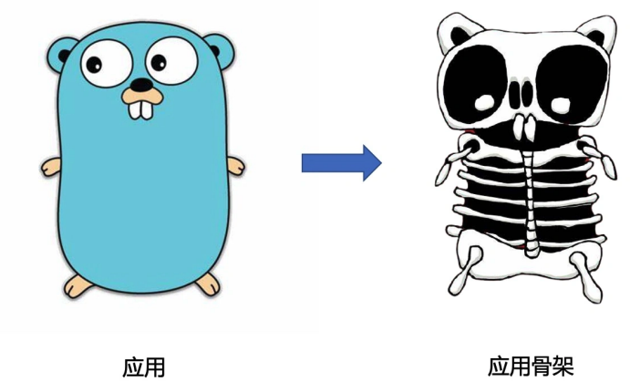
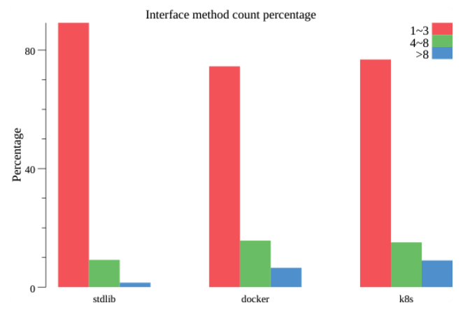
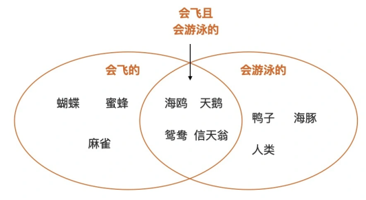
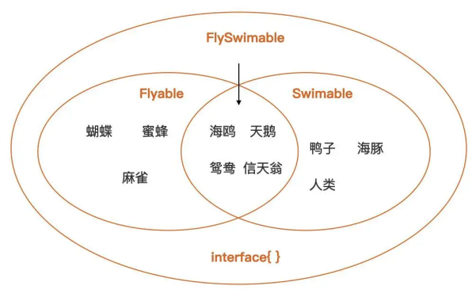
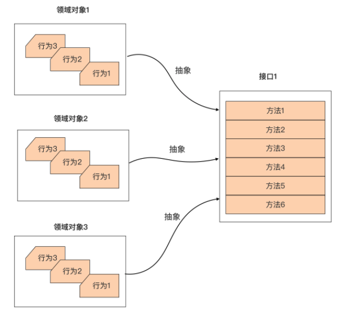
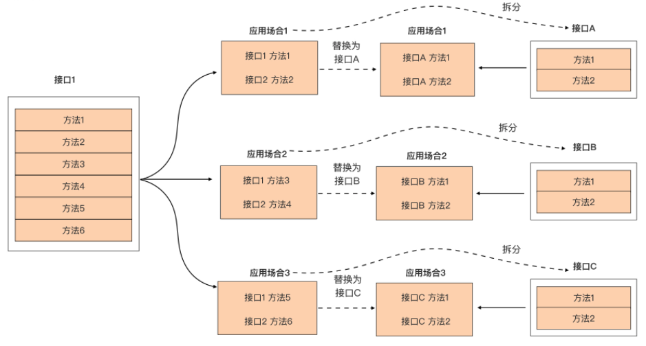

# Go Interface

## Go 应用骨架（Application Skeleton）

接口类型语法与 Go 原生提供的三个并发原语（Goroutine、channel 与 select），它们不仅代表了 Go 语言在编程语言领域的创新，更是影响 Go 应用骨架 （Application Skeleton）设计的重要元素。

所谓应用骨架，就是指将应用代码中的业务逻辑、算法实现逻辑、错误处理逻辑等“皮肉”逐一揭去后所呈现出的应用结构，这就好比下面这个可爱的 Gopher（地鼠）通过 X 光机所看到的骨骼结构：



通过这幅骨架结构图，能看到哪些有用的信息呢？

- 从静态角度去看，能清晰地看到应用程序的组成部分以及各个部分之间的连接，可以将其理解为 Go 应用内部的**耦合设计**；
- 从动态角度去看，能看到这幅骨架上可独立运动的几大机构，可以理解为应用的**并发设计**。 

而接口类型与 Go 并发语法恰分别是耦合设计与并发设计的主要参与者，因此 Go 应用的骨架设计离不开它们。

一个良好的骨架设计又决定了应用的健壮性、灵活性与扩展性，甚至是应用的运行效率。


## 认识接口类型

接口类型是由 type 和 interface 关键字定义的一组方法集合，其中，方法集合唯一确定了这个接口类型所表示的接口。

### 典型的接口类型定义

下面是一个典型的接口类型 MyInterface 的定义：

```go
// 定义 新接口

type MyInterface interface {
   M1(int) error
   M2(io.Writer, ...string)
}
```

可以看到，接口类型 MyInterface 所表示的接口的方法集合，包含两个方法 M1 和 M2。之所以称 **M1 和 M2 为“方法”**，更多是从这个接口的实现者的角度 考虑的。

但从上面接口类型声明中各个“方法”的形式上来看，这更像是不带有 func 关键 字的函数名 + 函数签名（参数列表 + 返回值列表）的组合。 

并且，和函数签名一样，在接口类型的方法集合中声明的方法，它的参数列表不需要写出形参名字，返回值列表也是如此。也就是说，方法的参数列表中形参名字与返回值列表中的具名返回值，都不作为区分两个方法的凭据。 

比如下面的 MyInterface 接口类型的定义与上面的 MyInterface 接口类型定义都是**等价**的：

```go
// 等价的 新接口

type MyInterface interface {
   M1(a int) error
   M2(w io.Writer, strs ...string)
}

type MyInterface interface {
   M1(n int) error
   M2(w io.Writer, args ...string)
}
```

不过，Go 语言要求接口类型声明中的**方法必须是具名的**，并且**方法名字在这个接口类型的方法集合中是唯一的**。

在**类型嵌入**中知道：Go 1.14 版本以后，Go 接口类型允许嵌入的不同接口类型的方法集合存在**交集**，但前提是交集中的方法不仅名字要一样，它的函数签名部分也要保持一致，也就是参数列表与返回值列表也要相同，否则 Go 编译器照样会报错。 

比如下面示例中 Interface3 嵌入了 Interface1 和 Interface2，但后两者交集中的 M1 方法的函数签名不同，导致了编译出错：

```go
// 类型嵌入中的方法存在交集

type Interface1 interface {
   M1()
}

type Interface2 interface {
   M1(string)
   M2()
}

type Interface3 interface {
   Interface1
   Interface2 // 编译器报错：duplicate method M1
   M3()
}
```

### 非导出接口类型

举的例子中的方法都是**首字母大写的导出方法**，那在接口类型定义中是否可以声明**首字母小写的非导出方法**呢？ 

答案是可以的。在 Go 接口类型的方法集合中放入首字母小写的非导出方法也是合法的， 并且在 **Go 标准库**中也找到了带有非导出方法的接口类型定义，比如 **context 包中的 canceler 接口类型**，它的代码如下：

```go
// context/context.go

// A canceler is a context type that can be canceled directly. The implementations are *cancelCtx and *timerCtx.
type canceler interface {
   cancel(removeFromParent bool, err error)
   Done() <-chan struct{}
}
```

但这样的**例子并不多**。通过对标准库这为数不多的例子，可以看到，如果接口类型的方法集合中包含非导出方法，那么这个接口类型自身通常也是非导出的，它的**应用范围也仅局限于包内**。

不过，在日常实际编码过程中，极少使用这种带有非导出方法的接口类型，简单了解一下就可以了。

### 空接口类型

除了上面这种常规情况，还有**空接口类型这种特殊情况**。如果一个接口类型定义中没有一 个方法，那么它的方法集合就为空，比如下面的 EmptyInterface 接口类型：

```go
// 空接口类型

type EmptyInterface interface {
}
```

这个方法集合为空的接口类型就被称为空接口类型，但通常不需要自己显式定义这类空接口类型，**直接使用interface{}这个类型字面值**作为所有空接口类型的代表就可以了。 

### 接口类型变量

接口类型一旦被定义后，它就和其他 Go 类型一样可以用于声明变量，比如：

```go
// 定义接口类型变量
var err error   // err是一个error接口类型的实例变量
var r io.Reader // r是一个io.Reader接口类型的实例变量
```

这些类型为接口类型的变量被称为**接口类型变量**，如果没有被显式赋予初值，接口类型变量的**默认值为 nil**。

### 空接口类型的变量赋值

如果要为接口类型变量**显式赋予初值**，就要为接口类型变量选择**合法的右值**。 

Go 规定：如果一个类型 T 的方法集合是某接口类型 I 的方法集合的等价集合或超集，就说类型 T 实现了接口类型 I，那么类型 T 的变量就可以作为合法的右值赋值给接口类型 I 的变量。

已知一个类型 T 和其指针类型 *T 的方法集合的求取规则了，所以这里也就不难判断一个类型是否实现了某个接口。 

如果一个变量的类型是空接口类型，由于空接口类型的方法集合为空，这就意味着任何类型都实现了空接口的方法集合，所以可以**将任何类型的值作为右值，赋值给空接口类 型的变量**，比如下面例子：

```go
// 赋值给空接口类型的变量
var i interface{} = 15 // ok
i = "hello, golang"    // ok
type T struct{}

var t T
i = t  // ok
i = &t // ok
```

空接口类型的这一可接受任意类型变量值作为右值的特性，让他成为 Go 加入泛型语法之前**唯一一种具有“泛型”能力的语法元素**，包括 Go 标准库在内的一些通用数据结构与算法的实现，都使用了**空类型interface{}作为数据元素的类型**，这样就无需为每种支持的元素类型单独做一份代码拷贝了。 

### 接口类型变量赋值的“逆操作”（类型断言Type Assertion）

Go 语言还支持接口类型变量赋值的“逆操作”，也就是**通过接口类型变量“还原”它的右值的类型与值信息**，这个过程被称为**“类型断言（Type Assertion）”**。

类型断言通常使用下面的语法形式：

```go
// 类型断言
v := i.(T)
```

但在这种形式下，

- 一旦接口变量 i 之前被赋予的值不是 T 类型的值，那么这个语句将抛出 panic。
- 如果变量 i 被赋予的值是 T 类型的值，那么变量 v 的类型为 T，它的值就会是之前变量 i 的右值。

由于可能出现 panic，所以并不推荐使用这种类型断言的语法形式。 

为了加深理解，接下来通过一个例子来直观看一下类型断言的语义：

```go
// 类型断言例子
var a int64 = 13
var i interface{} = a
v1, ok := i.(int64)
fmt.Printf("v1=%d, the type of v1 is %T, ok=%t\n", v1, v1, ok) // v1=13, the type of v1 is int64, ok=true
v2, ok := i.(string)
fmt.Printf("v2=%s, the type of v2 is %T, ok=%t\n", v2, v2, ok) // v2=, the type of v2 is string, ok=false
v3 := i.(int64)
fmt.Printf("v3=%d, the type of v3 is %T\n", v3, v3) // v3=13, the type of v3 is int64
v4 := i.([]int)                                     // panic: interface conversion: interface {} is int64, not []int
fmt.Printf("the type of v4 is %T\n", v4)
```

可以看到，这个例子的输出结果与讲解的是一致的。 在这段代码中，如果`v, ok := i.(T) `中的 T 是一个接口类型，那么类型断言的语义就会变成：断言 i 的值实现了接口类型 T。

- 如果断言成功，变量 v 的类型为 i 的值的类型，而并非接口类型 T。
- 如果断言失败，v 的类型信息为接口类型 T，它的值为 nil，

下面再来看一个 T 为接口类型的示例：

```go
package main

import "fmt"

type MyInterface interface {
   M1()
}

type T int

func (T) M1() {
   println("T's M1")
}

func main() {
   var t T
   var i interface{} = t
   v1, ok := i.(MyInterface)
   if !ok {
      panic("the value of i is not MyInterface")
   }

   v1.M1()
   fmt.Printf("the type of v1 is %T\n", v1) // the type of v1 is main.T

   i = int64(13)
   v2, ok := i.(MyInterface)
   fmt.Printf("the type of v2 is %T\n", v2) // the type of v2 is <nil>
   // v2 = 13 // cannot use 13 (type int) as type MyInterface in assignment:
   // int does not implement MyInterface (missing M1 method)
}
```

通过 the type of v2 is ，其实是看不出断言失败后的变量 v2 的类型的，但通过最后一行代码的编译器错误提示，能清晰地看到 v2 的类型信息为 MyInterface。 

### 接口类型的类型断言 type switch

其实，接口类型的类型断言还有一个变种，那就是 type switch，不过这个在讲解 switch 语句的时候讲过了。

关于接口类型的基础语法已经全部讲完了。有了这个基础后，再来看看 Go 语言接口定义的惯例，也就是尽量定义“小接口”。 


## 尽量定义“小接口” 

接口类型的背后，是通过把类型的行为抽象成契约，建立双方共同遵守的约定，这种契约将双方的耦合降到了最低的程度。

和生活工作中的契约有繁有简，签署方式多样一样，代码间的契约也有多有少，有大有小，而且达成契约的方式也有所不同。 

而 Go 选择了去繁就简的形式，这主要体现在以下两点上：

- **隐式契约，无需签署，自动生效**
  - Go 语言中接口类型与它的实现者之间的关系是隐式的，不需要像其他语言（比如 Java） 那样要求实现者显式放置“implements”进行修饰，
  - 实现者只需要实现接口方法集合中的全部方法便算是遵守了契约，并立即生效了。
- **更倾向于“小契约”**
  - 这点也不难理解。如果契约太繁杂了就会束缚了手脚，缺少了灵活性，抑制了表现力。
  - 所以 Go 选择了使用“小契约”，表现在代码上就是尽量定义小接口，即方法个数在 1~3 个之间的接口。
  - Go 语言之父 Rob Pike 曾说过的“接口越大，抽象程度越弱”，这也是 Go 社区倾向定义小接口的另外一种表述。

### Go 标准库与项目的小接口

Go 对小接口的青睐在它的标准库中体现得淋漓尽致，这里给出了**标准库**中一些日常开发中常用的接口的定义：

```go
// $GOROOT/src/builtin/builtin.go
type error interface {
   Error() string
}

// $GOROOT/src/io/io.go
type Reader interface {
   Read(p []byte) (n int, err error)
}

// $GOROOT/src/net/http/server.go
type Handler interface {
   ServeHTTP(ResponseWriter, *Request)
}

type ResponseWriter interface {
   Header() Header
   Write([]byte) (int, error)
   WriteHeader(int)
}
```

上述这些接口的方法数量在 1~3 个之间，这种“小接口”的 Go 惯例也已经被 Go 社区项目广泛采用。

统计了早期版本的 Go 标准库（Go 1.13 版本）、Docker 项目 （Docker 19.03 版本）以及 Kubernetes 项目（Kubernetes 1.17 版本）中定义的接口类型方法集合中方法数量，可以看下：



从图中可以看到，无论是 Go 标准库，还是 Go 社区知名项目，它们基本都遵循 了“尽量定义小接口”的惯例，接口方法数量在 1~3 范围内的接口占了绝大多数。 

### 小接口有哪些优势？ 

#### 第一点：接口越小，抽象程度越高 

计算机程序本身就是对真实世界的抽象与再建构。抽象就是对同类事物去除它具体的、次要的方面，抽取它相同的、主要的方面。不同的抽象程度，会导致抽象出的概念对应的事物的集合不同。

抽象程度越高，对应的集合空间就越大；抽象程度越低，也就是越具像化，更接近事物真实面貌，对应的集合空间越小。 

举一个生活中的简单例子。可以看下这张示意图，它是对生活中不同抽象程度的形象诠释：



这张图中分别建立了三个抽象：

- 会飞的。这个抽象对应的事物集合包括：蝴蝶、蜜蜂、麻雀、天鹅、鸳鸯、海鸥和信天 翁； 
- 会游泳的。它对应的事物集合包括：鸭子、海豚、人类、天鹅、鸳鸯、海鸥和信天翁； 
- 会飞且会游泳的。这个抽象对应的事物集合包括：天鹅、鸳鸯、海鸥和信天翁。

“会飞的”、“会游泳的”这两个抽象对应的事物集合，要大于“会飞且会游泳的”所对应的事物集合空间，也就是说“会飞的”、“会游泳的”这两个抽象程度更高。 

将上面的抽象转换为 Go 代码看看：

```go
// 会飞的
type Flyable interface {
   Fly()
}

// 会游泳的
type Swimable interface {
   Swim()
}

// 会飞且会游泳的
type FlySwimable interface {
   Flyable
   Swimable
}
```

用上述定义的接口替换上图中的抽象，再得到这张示意图：



可以直观地看到，这张图中的 Flyable 只有一个 Fly 方法，FlySwimable 则包含两个方法 Fly 和 Swim。

具有更少方法的 Flyable 的抽象程度相对于 FlySwimable 要高，包含的事物集合（7 种动物）也要比 FlySwimable 的事物集合（4 种动物）大。也就是说，接口越小（接口方法少)，抽象程度越高，对应的事物集合越大。 

而这种情况的**极限**恰恰就是无方法的空接口 interface{}，空接口的这个抽象对应的事物集合空间包含了 Go 语言世界的所有事物。

#### 第二点：小接口易于实现和测试 

这是一个显而易见的优点。小接口拥有比较少的方法，一般情况下只有一个方法。

所以要想满足这一接口，只需要实现一个方法或者少数几个方法就可以了，这显然要比实现拥有较多方法的接口要容易得多。

尤其是在单元测试环节，构建类型去实现只有少量方法的接口要比实现拥有较多方法的接口付出的劳动要少许多。 

#### 第三点：小接口表示的“契约”职责单一，易于复用组合

Go 推崇通过**组合**的方式构建程序。

Go 开发人员一般会尝试通过嵌入其他已有接口类型的方式来构建新接口类型，就像通过嵌入 io.Reader 和 io.Writer 构建 io.ReadWriter 那样。 

那构建时，如果有众多候选接口类型供选择，会怎么选择呢？ 

显然，会选择那些新接口类型需要的契约职责，同时也要求不要引入不需要的契约职责。在这样的情况下，拥有单一或少数方法的小接口便更有可能成为目标，而那些拥有较多方法的大接口，可能会因引入了诸多不需要的契约职责而被放弃。

由此可见，小接口更契合 Go 的组合思想，也更容易发挥出组合的威力。 

### 定义小接口，可以遵循的几点

保持简单有时候比复杂更难。小接口虽好，但如何定义出小接口是摆在所有 Gopher 面前的一道难题。这道题没有标准答案，但有一些点可供在实践中考量遵循。

#### 别管接口大小，先抽象出接口

要设计和定义出小接口，前提是需要先有接口。 

Go 语言还比较年轻，它的设计哲学和推崇的编程理念可能还没被广大 Gopher 100% 理解、接纳和应用于实践当中，尤其是 Go 所推崇的基于接口的组合思想。 

尽管接口不是 Go 独有的，但专注于接口是编写强大而灵活的 Go 代码的关键。因此，在定义小接口之前，需要先针对问题领域进行深入理解，聚焦抽象并发现接口，就像下图所展示的那样，先针对领域对象的行为进行抽象，形成一个接口集合：



初期，先不要介意这个接口集合中方法的数量，因为对问题域的理解是循序渐进的， 在第一版代码中直接定义出小接口可能并不现实。

而且，标准库中的 io.Reader 和 io.Writer 也不是在 Go 刚诞生时就有的，而是在发现对网络、文件、其他字节数据处理的实现十分相似之后才抽象出来的。

并且越偏向业务层，抽象难度就越高，这或许也是前面图中 Go 标准库小接口（1~3 个方法）占比略高于 Docker 和 Kubernetes 的原因。

#### 将大接口拆分为小接口

有了接口后，就会看到接口被用在了代码的各个地方。

一段时间后，就来分析哪些场合使用了接口的哪些方法，是否可以将这些场合使用的接口的方法提取出来，放入一个新的小接口中，就像下面图示中的那样：



这张图中的大接口 1 定义了多个方法，一段时间后，发现方法 1 和方法 2 经常用在场合 1 中，方法 3 和方法 4 经常用在场合 2 中，方法 5 和方法 6 经常用在场合 3 中，大接口 1 的方法呈现出一种按业务逻辑自然分组的状态。 

这个时候可以将这三组方法分别提取出来放入三个小接口中，也就是将大接口 1 拆分为三个小接口 A、B 和 C。

拆分后，原应用场合 1~3 使用接口 1 的地方就可以无缝替换为 接口 A、B、C 了。

#### 注意接口的单一契约职责

那么，上面已经被拆分成的小接口是否需要进一步拆分，直至每个接口都只有一个方法呢？这个依然没有标准答案，不过依然可以考量一下现有小接口是否需要满足单一契约 职责，就像 io.Reader 那样。

如果需要，就可以进一步拆分，提升抽象程度。 


## 小结 

接口类型被列入 Go 核心语法，它的重要性不言自明，它既是 Go 语言的一个微创新，也是影响 Go 应用骨架设计的重要元素。

接口类型的基础知识，包括接口类型的声明、接口类型变量的定义与初始化以及类型断言等，这里面有很多语法细节，一定要牢牢掌握。

- 比如，某接口类型定义中嵌入的不同接口类型的方法集合若存在交集，交集中的方法不仅名字要一样，函数签名也要相同。
- 再比如，对接口类型和非接口类型进行类型断言的语义是不完全相同的。 

Go 接口背后的本质是一种“契约”，通过契约可以将代码双方的耦合降至最低。

Go 惯例上推荐尽量定义小接口，一般而言接口方法集合中的方法个数不要超过三个，单一方法的接口更受 Go 社区青睐。 

小接口有诸多优点，比如，

- 抽象程度高、易于测试与实现、与组合的设计思想一脉相承、 鼓励编写组合的代码，等等。

但要一步到位地定义出小接口不是一件简单的事，尤其是在复杂的业务领域。


