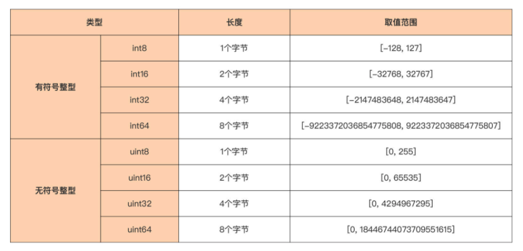
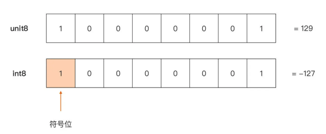
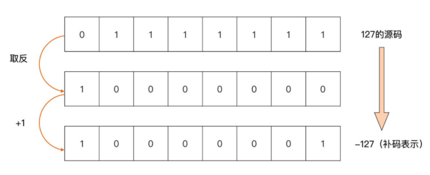
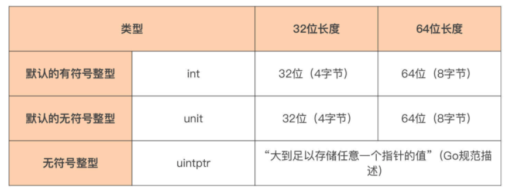
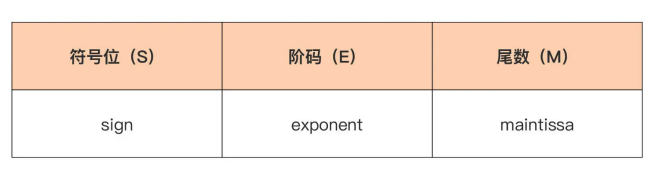
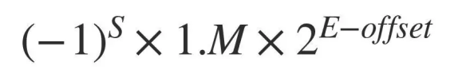
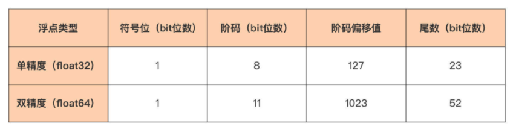
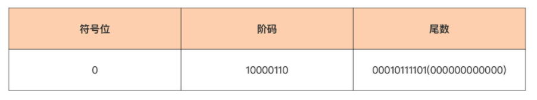
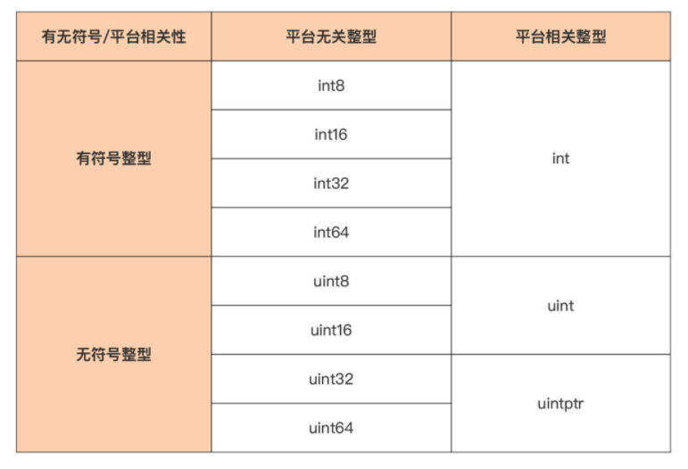
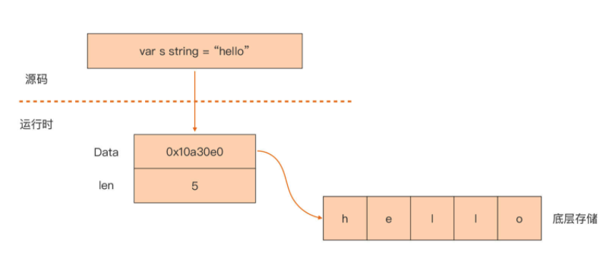

# Go Language Base Data Type

> Go 语言类型 之 基本数据类型。

变量所绑定的内存区域应该有明确的边界，而这个边界信息呢，是由变量的类型赋予的。

那么，深入讲解 Go 语言类型。 对 Go 这样的静态编程语言来说，类型是十分重要的。因为它不仅是静态语言编译器的要求，更是对现实事物进行抽象的基础。

## Go 语言类型

Go 语言的类型大体可分为**基本数据类型、复合数据类型和接口类型**这三种。

其中，日常 Go 编码中使用最多的就是基本数据类型，而基本数据类型中使用占比最大的又是数值类型。

 那么，就先来讲数值类型。Go 语言原生支持的数值类型包括整型、浮点型以及复数类型，它们适用于不同的场景。

## 整型 

Go 语言的整型，主要用来表示现实世界中整型数量，比如：人的年龄、班级人数等。

它可 以分为**平台无关整型**和**平台相关整型**这两种，它们的区别主要就在，这些整数类型在不同 CPU 架构或操作系统下面，它们的长度是否是一致的。 

### 平台无关整型

先来看平台无关整型，它们在任何 CPU 架构或任何操作系统下面，长度都是固定不变的。

在下面这张表中总结了 Go 提供的平台无关整型：



这些平台无关的整型也可以分成两类：**有符号整型（int8~int64）和无符号整型（uint8~uint64）**。

两者的本质差别在于**最高二进制位（bit 位）**是否被解释为符号位，这点会影响到无符号整型与有符号整型的取值范围。 

以下图中的这个 8 比特（一个字节）的整型值为例，当它被解释为无符号整型 uint8 时，和它被解释为有符号整型 int8 时表示的值是不同的：



在同样的比特位表示下，

- 当最高比特位被解释为符号位时，它代表一个有符号整型 （int8），它表示的值为 -127；
- 当最高比特位不被解释为符号位时，它代表一个无符号整 型 (uint8)，它表示的值为 129。 

这里可能就会问了：即便最高比特位被解释为符号位，上面的有符号整型所表示值也应该为 -1 啊，怎么会是 -127 呢？ 

- 这是因为 Go 采用 **2 的补码（Two’s Complement）**作为整型的比特位编码方法。
- 因此，不能简单地将最高比特位看成负号，把其余比特位表示的值看成负号后面的数值。
- Go 的补码是通过原码逐位取反后再加 1 得到的，比如，以 -127 这个值为例，它的**补码转换过程**就是这样的：（这里其实没有很理解！）
  - 

### 平台相关整型

平台相关整型，它们的长度会根据运行平台的改变而改变。

Go 语言原生提供了三个平台相关整型，它们是 int、uint 与 uintptr，同样也列了一张表：



在这里要特别注意一点，由于这三个类型的长度是平台相关的，所以在编写有移植性要求的代码时，千万不要强依赖这些类型的长度。

如果不知道这三个类型在目标运行平台上的长度，可以通过 **unsafe 包提供的 SizeOf 函数**来获取，比如在 x86-64 平台上，它们的长度均为 8：

```go
package main

import (
   "fmt"
   "unsafe"
)

func main() {
   var a, b = int(5), uint(6)
   var p uintptr = 0x12345678

   fmt.Println("signed integer a's length is", unsafe.Sizeof(a))   // 8
   fmt.Println("unsigned integer b's length is", unsafe.Sizeof(b)) // 8
   fmt.Println("uintptr's length is", unsafe.Sizeof(p))            // 8
}
```

现在已经搞清楚 Go 语言中整型的分类和长度了，但是在使用整型的过程中，还会遇到一个常见问题：整型溢出。 

### 整型的溢出问题 

无论哪种整型，都有它的取值范围，也就是有它可以表示的值边界。

如果这个整型因为参与某个运算，导致结果超出了这个整型的值边界，就说发生了整型溢出的问题。

由于整型无法表示它溢出后的那个“结果”，所以出现溢出情况后，对应的整型变量的值依然会落到它的取值范围内，只是**结果值与预期不符**，导致程序逻辑出错。

比如这就是一个无符号整型与一个有符号整型的溢出情况：

```go
package main

import "fmt"

func main() {
   var s int8 = 127
   s += 1
   // 预期 128，实际结果 -128
   fmt.Println(s)

   var u uint8 = 1
   u -= 2
   // 预期 -1，实际结果 255
   fmt.Println(u)
}
```

- 有符号整型变量 s 初始值为 127，在加 1 操作后，预期得到 128，但由于 128 超出了 int8 的取值边界，其实际结果变成了 -128。
- 无符号整型变量 u 也是一样的道理， 它的初值为 1，在进行减 2 操作后，预期得到 -1，但由于 -1 超出了 uint8 的取值边界，它的实际结果变成了 255。 

这个问题**最容易发生在循环语句的结束条件判断中**，因为这也是经常使用整型变量的地方。

无论无符号整型，还是有符号整型都存在溢出的问题，所以要十分小心地选择参与循环语句结束判断的整型变量类型，以及与之比较的边界值。 

在了解了整型的这些基本信息后，再来看看整型支持的不同进制形式的字面值，以及如何输出不同进制形式的数值。 

### 数值字面值

Go 语言在设计开始，就继承了 C 语言关于**数值字面值（Number Literal）**的语法形式。 

早期 Go 版本支持十进制、八进制、十六进制的数值字面值形式，比如：

```go
// 早期 go 版本
a := 53        // 十进制
b := 0700      // 八进制，以"0"为前缀
c1 := 0xaabbcc // 十六进制，以"0x"为前缀
c2 := 0Xddeeff // 十六进制，以"0X"为前缀
```

Go 1.13 版本中，Go 又增加了对二进制字面值的支持和两种八进制字面值的形式，比如：

```go
// go 1.13 版本
d1 := 0b10000001 // 二进制，以"0b"为前缀
d2 := 0B10000001 // 二进制，以"0B"为前缀
e1 := 0o700      // 八进制，以"0o"为前缀
e2 := 0O700      // 八进制，以"0O"为前缀
```

为提升字面值的可读性，Go 1.13 版本还支持在字面值中增加**数字分隔符“_”**，分隔符可以用来将数字分组以提高可读性。

比如每 3 个数字一组，也可以用来分隔前缀与字面值中的第一个数字：

```go
// 数字分隔符 '_'
a := 5_3_7        // 十进制: 537
b := 0b_1000_0111 // 二进制位表示为10000111
c1 := 0_700       // 八进制: 0700
c2 := 0o_700      // 八进制: 0700
d1 := 0x_5c_6d    // 十六进制：5c6d
```

这里要注意一下，Go 1.13 中增加的二进制字面值以及数字分隔符，只在 **go.mod 中的 go version 指示字段为 Go 1.13 以及以后版本**的时候，才会生效，否则编译器会报错。

### 格式化输出

反过来，也可以通过标准库 fmt 包的格式化输出函数，将一个整型变量输出为不同进制的形式。

比如下面就是将十进制整型值 59，格式化输出为二进制、八进制和十六进制的 代码：

```go
// 格式化输出
var a int8 = 59
fmt.Printf("%b\n", a) // 输出二进制：111011
fmt.Printf("%d\n", a) // 输出十进制：59
fmt.Printf("%o\n", a) // 输出八进制：73
fmt.Printf("%O\n", a) // 输出八进制(带0o前缀)：0o73
fmt.Printf("%x\n", a) // 输出十六进制(小写)：3b
fmt.Printf("%X\n", a) // 输出十六进制(大写)：3B
```


## 浮点型 

和使用广泛的整型相比，浮点型的使用场景就相对聚焦了，主要集中在**科学数值计算、图形图像处理和仿真、多媒体游戏以及人工智能**等领域。

### IEEE 754 标准

要想知道 Go 语言中的浮点类型的二进制表示是怎样的，首先要来了解 **IEEE 754 标准**。 

IEEE 754 是 IEEE 制定的二进制浮点数算术标准，它是 20 世纪 80 年代以来最广泛使用的浮点数运算标准，被许多 CPU 与浮点运算器采用。

现存的大部分主流编程语言，包括 Go 语言，都提供了符合 IEEE 754 标准的浮点数格式与算术运算。 

IEEE 754 标准规定了四种表示浮点数值的方式：**单精度（32 位）、双精度（64 位）、扩展单精度（43 比特以上）与扩展双精度（79 比特以上，通常以 80 位实现）**。

后两种其实很少使用，重点关注前面两个就好了。 

### 浮点型的二进制表示 

Go 语言提供了 float32 与 float64 两种浮点类型，它们分别对应的就是 IEEE 754 中的单精度与双精度浮点数值类型。

不过，这里要注意，Go 语言中没有提供 float 类型。这不像整型那样，Go 既提供了 int16、int32 等类型，又有 int 类型。

换句话说，**Go 提供的浮点类型都是平台无关的**。 

那 float32 与 float64 这两种浮点类型有什么异同点呢？

- 无论是 float32 还是 float64，它们的变量的**默认值都为 0.0**，不同的是它们占用的内存空间大小是不一样的，可以表示的浮点数的范围与精度也不同。

那么浮点数在内存中的二进制表示究竟是怎么样的呢？ 

- 浮点数在内存中的二进制表示（Bit Representation）要比整型复杂得多，IEEE 754 规范给出了在内存中存储和表示一个浮点数的标准形式，见下图：
  - 
  - 浮点数在内存中的二进制表示分三个部分：**符号位、阶码（即经过换算的指数），以及尾数**。
- 这样表示的一个浮点数，它的值等于：
  - 
  - 其中浮点值的符号由符号位决定：当符号位为 1 时，浮点值为负值；当符号位为 0 时，浮点值为正值。公式中 offset 被称为阶码偏移值。

#### 阶码与尾数

首先来看**单精度（float32）与双精度（float64）浮点数在阶码和尾数上的不同**。

这两种浮点数的阶码与尾数所使用的**位数是不一样的**，可以看下 IEEE 754 标准中单精度和双精度浮点数的各个部分的长度规定：



- 单精度浮点类型（float32）为符号位分配了 1 个 bit，为阶码分配了 8 个 bit，剩下的 23 个 bit 分给了尾数。
- 双精度浮点类型，除了符号位的长度与单精度一样之外，其余两个部分的长度都要远大于单精度浮点型，阶码可用的 bit 位数量为 11，尾数则更是拥有了 52 个 bit 位。 

#### 浮点值转换为单精度二进制

接着，再来看前面提到的“阶码偏移值”，用一个例子直观地感受一下。

在这个例子中，来看看如何将一个十进制形式的浮点值 139.8125，转换为 IEEE 754 规定中的那种单精度二进制表示。 

**步骤一**：要把这个**浮点数值的整数部分和小数部分，分别转换为二进制形式**（后缀 d 表示十进制数，后缀 b 表示二进制数）：

- 整数部分：139d => 1000_1011b； 
- 小数部分：0.8125d => 0.1101b（十进制小数转换为二进制可采用“乘 2 取整”的竖式计算）。

这样，原浮点值 139.8125d 进行二进制转换后，就变成 1000_1011.1101b。 

**步骤二**：**移动小数点**，直到整数部分仅有一个 1，也就是 1000_1011.1101b => 1.000_1011_1101b。

看到，为了整数部分仅保留一个 1，小数点向左移了 7 位，这样**指数就为 7**，**尾数为 000_1011_1101b**。

**步骤三**：**计算阶码**。 

IEEE 754 规定不能将小数点移动而得到的指数，直接填到阶码部分，指数到阶码还需要一个转换过程。

对于 float32 的单精度浮点数而言，**阶码 = 指数 + 偏移值**。

偏移值的计算公式为 2^(e-1)-1，其中 e 为阶码部分的 bit 位数，这里为 8，于是单精度浮点数的阶码偏移值就为 2^(8-1)-1 = 127。

这样在这个例子中，阶码 = 7 + 127 = 134d = 1000_0110b。 

float64 的双精度浮点数的阶码计算也是这样的。 

**步骤四**：**将符号位、阶码和尾数填到各自位置**，得到最终浮点数的二进制表示。

尾数位数不足 23 位，可在后面补 0。



这样，最终浮点数 139.8125d 的二进制表示就为 0b_0_10000110_00010111101_000000000000。 

**最后**，再通过 Go 代码输出浮点数 139.8125d 的二进制表示，和前面手工转换 的做一下比对，看是否一致。

```go
package main

import (
   "fmt"
   "math"
)

func main() {
   var f float32 = 139.8125
   bits := math.Float32bits(f)

   fmt.Printf("%b\n", bits) // 1000011000010111101000000000000
}
```

在这段代码中，通过标准库的 math 包，将 float32 转换为整型。

在这种转换过程中，float32 的内存表示是不会被改变的。然后再通过前面提过的整型值的格式化输出，将它以二进制形式输出出来。

运行这个程序，得到下面的结果：

```sh
1000011000010111101000000000000
```

这个值在填上省去的最高位的 0 后，与手工得到的浮点数的二进制表示一模 一样。这就说明手工推导的思路并没有错。

#### 浮点数范围与精度

而且，可以从这个例子中感受到，阶码和尾数的长度决定了浮点类型可以表示的浮点数范围与精度。

因为双精度浮点类型（float64）阶码与尾数使用的比特位数更多，它可以表 示的精度要远超单精度浮点类型，所以在日常开发中，使用双精度浮点类型 （float64）的情况更多，这也是 Go 语言中浮点常量或字面值的默认类型。 

而 float32 由于表示范围与精度有限，经常会给开发者造成一些困扰。比如可能会因为 float32 精度不足，导致输出结果与常识不符。

比如下面这个例子就是这样，f1 与 f2 两个浮点类型变量被两个不同的浮点字面值初始化，但逻辑比较的结果却是两个变量的值相等。

```go
package main

import "fmt"

func main() {
   var f1 float32 = 16777216.0
   var f2 float32 = 16777217.0

   fmt.Println(f1 == f2) // true
}
```

结合前面讲解的浮点类型表示方法， 对这个例子进行分析：

- 分析一：

  - f1 转换成二进制是：1266679808

  - f2 转换成二进制也是：1266679808

  - 这个为什么是相等的，是因为转换成二进制的数据是相等的。

  - ```go
    // 验证为啥不是 false
    bitsf1 := math.Float32bits(f1)
    bitsf2 := math.Float32bits(f2)
    fmt.Printf("%b\n", bitsf1) // 10010111_00000000000000000000000
    fmt.Printf("%b\n", bitsf2) // 10010111_00000000000000000000000
    ```

- 分析二：

  - 16777216.0 = 2^24 = (1+.0) * 2^24，因为 float32 的尾数只有23bit，能够表示的下一个数是 (1+2^(-23))*2^24 = 2^24+2 = 16777218.0
  - 16777217.0 = 2^24 + 1 = (1+2^(-24)) * 2^24，尾数得是2^(-24)，需要24bit才能表示
  - 直观上理解的话，实数是无限的，浮点数的二进制表示是有限的，所以必然有实数是无法用浮点数表示的。
  - 在实数轴上标出浮点数的话，相邻的浮点数之间就存在空洞。而且随着指数的增加，相邻浮点数之间的空洞也会越来越大。
  - 对于 float32 来说，2^24+1是第一个落在这样的空洞上的整数。而从2^25开始，下一个能表示的数就是(1+2^(-23))*2^25 = 2^25 + 4，中间会有3个整数无法表示。
  - 同理，对于 float64 来说第一个无法表示的整数就是2^53+1（因为尾数只有52bit）

看到这里，是不是觉得浮点类型很神奇？和易用易理解的整型相比，浮点类型无论在二进制表示层面，还是在使用层面都要复杂得多。

即便是浮点字面值，有时候也不是一眼就能看出其真实的浮点值是多少的。


### 浮点型的字面值

Go 浮点类型字面值大体可分为两类，一类是**直白地用十进制表示的浮点值**形式。

这一类， 通过字面值就可直接确定它的浮点值，比如：

```go
// 直接用十进制表示的浮点值
3.1415
.15 // 整数部分如果为0，整数部分可以省略不写
81.80
82. // 小数部分如果为0，小数点后的0可以省略不写
```

另一类则是**科学计数法**形式。

采用科学计数法表示的浮点字面值，需要通过一定的**换算**才能确定其浮点值。

而且在这里，科学计数法形式又分为**十进制形式表示**的，和**十六进制形式表示**的两种。 

先来看十进制科学计数法形式的浮点数字面值，这里字面值中的 e/E 代表的幂运算的底数为 10：

```go
// 科学计数法 之 十进制科学计数法形式
6674.28e-2 // 6674.28 * 10^(-2) = 66.742800
.12345E+5  // 0.12345 * 10^5 = 12345.000000
```

接着是十六进制科学计数法形式的浮点数：

```go
// 科学计数法 之 十六进制科学计数法形式
0x2.p10  // 2.0 * 2^10 = 2048.000000
0x1.Fp+0 // 1.9375 * 2^0 = 1.937500
```

这里，要注意，十六进制科学计数法的整数部分、小数部分用的都是十六进制形式， 但指数部分依然是十进制形式，并且字面值中的 p/P 代表的幂运算的底数为 2。 

### 格式化输出

知道了浮点型的字面值后，和整型一样，fmt 包也提供了针对浮点数的格式化输出。

最常使用的格式化输出形式是 %f。通过 %f，可以输出浮点数最直观的原值形式。

```go
var f float64 = 123.45678
fmt.Printf("%f\n", f) // 123.456780
```

也可以将浮点数输出为科学计数法形式，如下面代码：

```go
// 科学计数法形式输出
fmt.Printf("%e\n", f) // 1.234568e+02
fmt.Printf("%x\n", f) // 0x1.edd3be22e5de1p+06
```

其中 %e 输出的是十进制的科学计数法形式，而 %x 输出的则是十六进制的科学计数法形式。 


## 复数类型 

数学课本上将形如 z=a+bi（a、b 均为实数，a 称为实部，b 称为虚部）的数称为复数， 这里也可以这么理解。

相比 C 语言直到采用 C99 标准，才在 complex.h 中引入了对复数类型的支持，Go 语言则原生支持复数类型。

不过，和整型、浮点型相比，复数类型在 Go 中的应用就更为局限和小众，主要用于**专业领域的计算，比如矢量计算**等。

Go 提供两种复数类型，它们分别是 c**omplex64 和 complex128**，complex64 的实部与虚部都是 float32 类型，而 complex128 的实部与虚部都是 float64 类型。

如果一个复数没有显示赋予类型，那么它的默认类型为 complex128。 

### 复数类型的字面值

关于复数字面值的表示，其实有三种方法。 

第一种，可以通过**复数字面值直接初始化一个复数类型变量**：

```go
// 复数字面值直接初始化一个复数类型变量
var c = 5 + 6i
var d = 0o123 + .12345e+5i // 83+12345i
```

第二种，Go 还提供了 **complex 函数**，方便创建一个 complex128 类型值：

```go
// 使用 complex 函数
var c = complex(5, 6)             // 5 + 6i
var d = complex(0o123, .12345e+5) // 83+12345i
```

第三种，还可以通过 Go 提供的**预定义的函数 real 和 imag**，来获取一个复数的实部与虚部，返回值为一个浮点类型：

```go
// 使用预定义的函数 real 和 imag
var c = complex(5, 6) // 5 + 6i
r := real(c)          // 5.000000
i := imag(c)          // 6.000000
```

### 格式化输出

至于复数形式的格式化输出的问题，由于 complex 类型的实部与虚部都是浮点类型，所以可以直接运用浮点型的格式化输出方法，来输出复数类型。 


## 创建自定义的数值类型

在原生数值类型不满足对现实世界的抽象的情况下，可能还需要通过 Go 提供的类型定义语法来创建自定义的数值类型。

### type 关键字自定义

如果要通过 Go 提供的类型定义语法，来创建自定义的数值类型，可以通过 **type 关键字**基于原生数值类型来声明一个新类型。 

但是自定义的数值类型，在和其他类型相互赋值时容易**出现一些问题**。下面就来建立 一个名为 MyInt 的新的数值类型看看：

```go
type MyInt int32
```

因为 MyInt 类型的底层类型是 int32，所以它的数值性质与 int32 完全相同，但它们仍然是完全不同的两种类型。

根据 **Go 的类型安全规则**，无法直接让它们相互赋值，或者是把它们放在同一个运算中直接计算，这样编译器就会报错。

```go
// 错误
var m int = 5
var n int32 = 6
var a MyInt = m // 错误：在赋值中不能将m（int类型）作为MyInt类型使用
var a MyInt = n // 错误：在赋值中不能将n（int32类型）作为MyInt类型使用
```

要避免这个错误，需要**借助显式转型**，让赋值操作符左右两边的操作数保持类型一致，像下面代码中这样做：

```go
// 正确，显式转型
var m int = 5
var n int32 = 6
var a MyInt = MyInt(m) // ok
var a MyInt = MyInt(n) // ok
```


### 类型别名（Type Alias）语法自定义

也可以通过 Go 提供的**类型别名（Type Alias）语法**来自定义数值类型。

和上面使用标准 type 语法的定义不同的是，通过类型别名语法定义的新类型与原类型别无二致，可以完全相互替代。

来看下面代码：

```go
// 类型别名语法自定义
type MyInt = int32

var n int32 = 6
var a MyInt = n // ok
```

通过类型别名定义的 **MyInt 与 int32 完全等价**，所以这个时候两种类型就是 同一种类型，不再需要显式转型，就可以相互赋值。


## 小结 

Go 的原生数值类型有三类：整型、浮点型和复数型。 

- 首先，**整数类型**包含的具体类型比较多，这里用一个表格做个总结：
  - 
  - Go 语言中的整型的二进制表示采用 2 的补码形式，一个负数的补码计算方式是 “原码取反加 1”即可。 
  - 另外，学习整型时要特别注意，每个整型都有自己的取值范围和表示边界，一旦超出边界，便会出现溢出问题。溢出问题多出现在循环语句中进行结束条件判断的位置，在选择参与循环语句结束判断的整型变量类型以及比较边界值时要尤其小心。 
- 接下来，讲了 Go 语言实现了 IEEE 754 标准中的浮点类型二进制表示。
  - 在这种表示中，一个浮点数被分为符号位、阶码与尾数三个部分，用一个实例讲解了如何推导出 一个浮点值的二进制表示。
  - 如果理解了那个推导过程，就基本掌握浮点类型了。
  - 虽然在例子中使用的是 float32 类型做的演示，但日常使用中尽量使用 float64，这样不容易出现浮点溢出的问题。
- 复数类型也是基于浮点型实现的，日常使用较少。 
- 最后，还了解了如何利用类型定义语法与类型别名语法创建自定义数值类型。
  - 通过类型定义语法实现的自定义数值类型虽然在数值性质上与原类型是一致的，但它们却是完全不同的类型，不能相互赋值，比如通过显式转型才能避免编译错误。
  - 而通过类型别名创建的新类型则等价于原类型，可以互相替代。


## 字符串类型 

字符串类型，是现代编程语言中**最常用的数据类型之一**，多数主流编程语言都提供了对这个类型的原生支持，少数没有提供原生字符串的类型的主流语言（比如 C 语言）也通过其他形式提供了对字符串的支持。 

对于这样在日常开发中高频使用的基本数据类型，要给予更多的关注。

### 原生支持字符串有什么好处？ 

Go 是站在巨人的肩膀上成长起来的现代编程语言。它继承了前辈语言的优 点，又改进了前辈语言中的不足。这其中一处就体现在 Go 对字符串类型的原生支持上。 

#### C 语言对字符串的支持

这样的设计会有什么好处呢？作为对比，先来看看前辈语言之一的 C 语言对字符串的支持情况。 

C 语言没有提供对字符串类型的原生支持，也就是说，C 语言中并没有“字符串”这个数据类型。

在 C 语言中，字符串是以字符串字面值或以’\0’结尾的字符类型数组来呈现 的，比如下面代码：

```c
#define GO_SLOGAN "less is more"
const char * s1 = "hello, gopher"
char s2[] = "I love go"
```

这样定义的非原生字符串在使用过程中会有很多问题，比如：

- 不是原生类型，编译器不会对它进行类型校验，导致类型安全性差； 
- 字符串操作时要时刻考虑结尾的’\0’，防止缓冲区溢出； 
- 以字符数组形式定义的“字符串”，它的值是可变的，在并发场景中需要考虑同步问题； 
- 获取一个字符串的长度代价较大，通常是 O(n) 时间复杂度； 
- C 语言没有内置对非 ASCII 字符（如中文字符）的支持。

这些问题都大大加重了开发人员在使用字符串时的心智负担。于是，Go 设计者们选择了原 生支持字符串类型。


#### Go 语言对字符串的支持

在 Go 中，字符串类型为 string。

Go 语言通过 string 类型统一了对“字符串”的抽象。 这样无论是**字符串常量**、**字符串变量**或是代码中出现的**字符串字面值**，它们的类型都被统一设置为 string，比如上面 C 代码换成等价的 Go 代码是这样的：

```go
// go 对字符串的支持
const (
   GO_SLOGAN = "less is more"  // GO_SLOGAN是string类型常量
   s1        = "hello, gopher" // s1是string类型常量
)

var s2 = "I love go" // s2是string类型变量
```

Go 原生支持 string 的做法是对前辈语言的改进，这样的设计到底有哪些优秀的性质，会带来什么好处呢？ 

#### string 类型的数据不可变

第一点：**string 类型的数据是不可变的**，提高了字符串的**并发安全性和存储利用率**。 

Go 语言规定，字符串类型的值在它的生命周期内是不可改变的。这就是说，如果声明了一个字符串类型的变量，那是无法通过这个变量改变它对应的字符串值的，但这并不是说不能为一个字符串类型变量进行二次赋值。 

什么意思呢？看看下面的代码就好理解了：

```go
// string 类型的数据是不可变的
var s string = "hello"
s[0] = 'k'   // 错误： 字符串的内容是不可改变的(cannot assign to s[0] (strings are immutable))
s = "gopher" // ok
```

在这段代码中，声明了一个字符串类型变量 s。当试图通过下标方式把这个字符串 的第一个字符由 h 改为 k 的时候，会收到编译器错误的提示：字符串是不可变的。

但仍可以像最后一行代码那样，为变量 s 重新赋值为另外一个字符串。 

Go 这样的“字符串类型数据不可变”的性质给开发人员带来的最大好处，就是不用再 担心字符串的并发安全问题。这样，Go 字符串可以被多个 Goroutine（Go 语言的轻量级用户线程）共享，开发者不用因为担心并发安全问题，使用会带来一定开销的同步机制。

另外，也由于字符串的不可变性，针对同一个字符串值，无论它在程序的几个位置被使用，Go 编译器只需要为它分配一块存储就好了，大大提高了存储利用率。

#### string 类型的数据没有结尾’\0’

第二点：**没有结尾’\0’**，而且**获取长度的时间复杂度是常数时间**，消除了获取字符串长度的开销。

在 C 语言中，获取一个字符串的长度可以调用标准库的 strlen 函数，这个函数的实现原理是遍历字符串中的每个字符并做计数，直到遇到字符串的结尾’\0’停止。

显然这是一个线性时间复杂度的算法，执行时间与字符串中字符个数成正比。并且，它存在一个约束， 那就是传入的字符串必须有结尾’\0’，结尾’\0’是字符串的结束标志。如果使用过 C 语言，想必也吃过字符串结尾’\0’的亏。 

Go 语言修正了这个缺陷，Go 字符串中没有结尾’\0’，获取字符串长度更不需要结尾’\0’作为结束标志。

并且，Go 获取字符串长度是一个常数级时间复杂度，无论字符串中字符个数有多少，都可以快速得到字符串的长度值。

#### string 类型的数据所见即所得

第三点：**原生支持“所见即所得”的原始字符串**，大大降低构造多行字符串时的心智负担。 

如果要在 C 语言中构造多行字符串，一般就是两个方法：要么使用多个字符串的自然拼接，要么需要结合续行符""。但因为有转义字符的存在，很难控制好格式。

Go 语言就简单多了，通过一对反引号原生支持构造“所见即所得”的原始字符串（Raw String）。

而且，Go 语言原始字符串中的任意转义字符都不会起到转义的作用。比如下面这段代码：

```go
// string 类型的数据所见即所得
var s string = `         
            ,_---~~~~~----._
   _,,_,*^____      _____*g*\"*,--,
   / __/ /'     ^.  /      \ ^@q   f
  [  @f | @))    |  | @))   l  0 _/
   \/   \~____ / __ \_____/     \
   |           _l__l_           I
   }          [______]          I
   ]            | | |           |
   ]             ~ ~            |
   |                            |
   |                            |`

fmt.Println(s)
```

字符串变量 s 被赋值了一个由一对反引号包裹的 Gopher 图案。这个 Gopher 图案由诸多 ASCII 字符组成，其中就包括了转义字符。

这个时候，如果通过 Println 函数输出这个字符串，得到的图案和上面的图案并无二致。

#### string 类型的数据支持非 ASCII 字符

第三点：**对非 ASCII 字符提供原生支持**，消除了源码在不同环境下显示乱码的可能。 

Go 语言源文件默认采用的是 Unicode 字符集，Unicode 字符集是目前市面上最流行的字符集，它囊括了几乎所有主流非 ASCII 字符（包括中文字符）。

Go 字符串中的每个字符都是一个 Unicode 字符，并且这些 Unicode 字符是以 UTF-8 编码格式存储在内存当中的。 


### Go 字符串的组成 

Go 语言在看待 Go 字符串组成这个问题上，有两种视角。

一种是**字节视角**，也就是和所有其它支持字符串的主流语言一样，Go 语言中的字符串值也是一个可空的字节序列，字节序列中的字节个数称为该字符串的长度。一个个的字节只是孤立数据，不表意。 

比如在下面代码中，输出了字符串中的每个字节，以及整个字符串的长度：

```go
// 字符串的组成
var s = "中国人"
fmt.Println("the character count in s is", utf8.RuneCountInString(s)) // 3

for _, c := range s {
   fmt.Printf("0x%x ", c) // 0x4e2d 0x56fd 0x4eba
}
fmt.Printf("\n")
```

在这段代码中，输出了字符串中的字符数量，也输出了这个字符串中的每个字符。

Go 采用的是 Unicode 字符集，每个字符都是一个 Unicode 字符，那么这里输出的 0x4e2d、0x56fd 和 0x4eba 就应该是某种 Unicode 字符的表示了。

以 0x4e2d 为例，它是汉字“中”在 Unicode 字符集表中的**码点（Code Point）**。 

那么，什么是 Unicode 码点呢？ 

- Unicode 字符集中的每个字符，都被分配了统一且唯一的字符编号。
- 所谓 Unicode 码 点，就是指将 Unicode 字符集中的所有字符“排成一队”，字符在这个“队伍”中的位 次，就是它在 Unicode 字符集中的码点。
- 也就说，一个码点唯一对应一个字符。“码 点”的概念和 rune 类型有很大关系。

### rune 类型

Go 使用 rune 这个类型来表示一个 Unicode 码点。

rune 本质上是 int32 类型的别名类型，它**与 int32 类型是完全等价的**，在 Go 源码中可以看到它的定义是这样的：

```go
// builtin/builtin.go
type rune = int32
```

由于一个 Unicode 码点唯一对应一个 Unicode 字符。

所以可以说，**一个 rune 实例就是一个 Unicode 字符，一个 Go 字符串也可以被视为 rune 实例的集合**。

### 字符字面值

可以通过字符字面值来**初始化一个 rune 变量**。

在 Go 中，字符字面值有多种表示法，最常见的是通过**单引号括起的字符字面值**，比如：

```go
// 字符字面值 之 单引号
'a'  // ASCII字符
'中'  // Unicode字符集中的中文字符
'\n' // 换行字符
'\'' // 单引号字符
```

还可以使用 **Unicode 专用的转义字符\u 或\U 作为前缀**，来表示一个 Unicode 字符，比如：

```go
// 字符字面值 之 unicode 专用的转义字符作为前缀
'\u4e2d' // 字符：中
'\U00004e2d' // 字符：中
'\u0027' // 单引号字符
```

要注意，\u 后面接两个十六进制数。如果是用两个十六进制数无法表示的 Unicode 字符，可以使用\U，\U 后面可以接四个十六进制数来表示一个 Unicode 字 符。 

而且，由于表示码点的 rune 本质上就是一个整型数，所以还可用**整型值来直接作为字 符字面值给 rune 变量赋值**，比如下面代码：

```go
// 字符字面值 之 整型值作为字符字面值
'\x27' // 使用十六进制表示的单引号字符
'\047' // 使用八进制表示的单引号字符
```

### 字符串字面值 

字符串是字符的集合，了解了字符字面值后，字符串的字面值也就很简单了。

只不过字符串是多个字符，所以需要把表示单个字符的单引号，换为表示多个字符组成的字符串的双引号就可以了。

可以看下面这些例子：

```go
// 字符串字面值
"abc\n"
"中国人"
"\u4e2d\u56fd\u4eba"                   // 中国人
"\U00004e2d\U000056fd\U00004eba"       // 中国人
"中\u56fd\u4eba"                        // 中国人，不同字符字面值形式混合在一起
"\xe4\xb8\xad\xe5\x9b\xbd\xe4\xba\xba" // 十六进制表示的字符串字面值：中国人
```

将单个 Unicode 字符字面值一个接一个地连在一起，并用双引号包裹起来就构 成了字符串字面值。

甚至，也可以像倒数第二行那样，将不同字符字面值形式混合在一起，构成一个字符串字面值。 

不过，这里可能发现了一个问题，上面示例代码的最后一行使用的是十六进制形式的字符串字面值，但每个字节的值与前面几行的码点值完全对应不上啊，这是为什么呢？ 

这个字节序列实际上是“中国人”这个 Unicode 字符串的 UTF-8 编码值。

什么是 UTF-8 编码？它又与 Unicode 字符集有什么关系呢？

### UTF-8 编码方案 

UTF-8 编码解决的是 Unicode 码点值在计算机中如何存储和表示（位模式）的问题。

码点唯一确定一个 Unicode 字符，直接用码点值不行么？ 

这的确是可以的，并且 UTF-32 编码标准就是采用的这个方案。UTF-32 编码方案固定使用 4 个字节表示每个 Unicode 字符码点，这带来的好处就是编解码简单，但缺点也很明显， 主要有下面几点：

- 这种编码方案使用 4 个字节存储和传输一个整型数的时候，需要考虑**不同平台的字节序问题** ; （这里指的是多个字节的编码方案，在CPU读取的时候，会有一个先后，顺序需要在加锁的原子操作下保证。）
- 由于采用 4 字节的固定长度编码，与采用 1 字节编码的 ASCII 字符集**无法兼容**； 
- 所有 Unicode 字符码点都用 4 字节编码，显然**空间利用率很差**。

针对这些问题，Go 语言之父 Rob Pike 发明了 UTF-8 编码方案。和 UTF-32 方案不同， UTF-8 方案使用**变长度字节**，对 Unicode 字符的码点进行编码。

编码采用的字节数量与 Unicode 字符在码点表中的序号有关：表示序号（码点）小的字符使用的字节数量少，表示序号（码点）大的字符使用的字节数多。

UTF-8 编码使用的字节数量从 1 个到 4 个不等。

- 前 128 个与 ASCII 字符重合的码点 （U+0000~U+007F）使用 1 个字节表示；
- 带变音符号的拉丁文、希腊文、西里尔字母、 阿拉伯文等使用 2 个字节来表示；
- 而东亚文字（包括汉字）使用 3 个字节表示；
- 其他极少使用的语言的字符则使用 4 个字节表示。 

这样的编码方案是兼容 ASCII 字符内存表示的，这意味着采用 UTF-8 方案在内存中表示 Unicode 字符时，已有的 ASCII 字符可以被直接当成 Unicode 字符进行存储和传输，不用再做任何改变。 

此外，UTF-8 的编码单元为一个字节（也就是一次编解码一个字节），所以在处理 UTF-8 方案表示的 Unicode 字符的时候，就不需要像 UTF-32 方案那样考虑字节序问题了。

相对于 UTF-32 方案，UTF-8 方案的空间利用率也是最高的。 

现在，UTF-8 编码方案已经成为 Unicode 字符编码方案的事实标准，各个平台、浏览器等默认均使用 UTF-8 编码方案对 Unicode 字符进行编、解码。

Go 语言也不例外，采用了 UTF-8 编码方案存储 Unicode 字符，在前面按字节输出一个字符串值时看到的字节序列，就是对字符进行 UTF-8 编码后的值。 

那么现在就使用 Go 在标准库中提供的 UTF-8 包，对 Unicode 字符（rune）进行编解码试试看：

```go
package main

import (
   "fmt"
   "unicode/utf8"
)

// rune -> []byte
func encodeRune() {
   var r rune = 0x4E2D
   fmt.Printf("the unicode charactor is %c\n", r) // 中
   buf := make([]byte, 3)
   _ = utf8.EncodeRune(buf, r)                       // 对rune进行utf-8编码
   fmt.Printf("utf-8 representation is 0x%X\n", buf) // 0xE4B8AD
}

// []byte -> rune
func decodeRune() {
   var buf = []byte{0xE4, 0xB8, 0xAD}
   r, _ := utf8.DecodeRune(buf)                                                             // 对buf进行utf-8解码
   fmt.Printf("the unicode charactor after decoding [0xE4, 0xB8, 0xAD] is %s\n", string(r)) // 中
}

func main() {
   encodeRune() // 编码
   decodeRune() // 解码
}
```

这段代码中，encodeRune 通过调用 UTF-8 的 EncodeRune 函数实现了对一个 rune，也就是一个 Unicode 字符的编码，decodeRune 则调用 UTF-8 包的 decodeRune，将一段内存字节转换回一个 Unicode 字符。


### Go 字符串类型的内部表示 

前面提到的 Go 字符串类型的这些优秀的性质，Go 字符串在编译器和运行时 的内部表示是分不开的。

Go 字符串类型的内部表示究竟是什么样的呢？

在标准库的 **reflect 包**中，找到了答案，可以看看下面代码：

```go
// reflect/value.go

// StringHeader 是一个 string 的运行时表示
type StringHeader struct {
   Data uintptr
   Len  int
}
```

string 类型其实是一个“描述符”，它本身并不真正存储字符串数据，而仅是由一个指向底层存储的指针和字符串的长度字段组成的。

画了一张图，直观地展示了一个 string 类型变量在 Go 内存中的存储：



Go 编译器把源码中的 string 类型映射为运行时的一个**二元组（Data, Len）**，真实的字符串值数据就存储在一个被 Data 指向的底层数组中。

通过 Data 字段，可以得到这个数组的内容，可以看看下面这段代码：

```go
func dumpBytesArray(arr []byte) {
   fmt.Printf("[")
   for _, b := range arr {
      fmt.Printf("%c ", b)
   }
   fmt.Printf("]\n")
}

func main() {
   var s = "hello"
   hdr := (*reflect.StringHeader)(unsafe.Pointer(&s)) // 将string类型变量地址显式
   fmt.Printf("0x%x\n", hdr.Data)                     // 0x10a30e0
   p := (*[5]byte)(unsafe.Pointer(hdr.Data))          // 获取Data字段所指向的数组的指针
   dumpBytesArray((*p)[:])                            // [h e l l o ] // 输出底层数组的内容
}
```

这段代码利用了 unsafe.Pointer 的通用指针转型能力，按照 StringHeader 给出的结构内存布局，“顺藤摸瓜”，一步步找到了底层数组的地址，并输出了底层数组内容。

知道了 string 类型的实现原理后，再回头看看 Go 字符串类型性质中“获取长度的时间复杂度是常数时间”那句，是不是就很好理解了？

之所以是常数时间，那是因为**字符串类型中包含了字符串长度信息**，当用 len 函数获取字符串长度时，len 函数只要简单地将这个信息提取出来就可以了。

了解了 string 类型的实现原理后，还可以得到这样一个结论，那就是直接将 string 类型通过函数 / 方法参数传入也不会带来太多的开销。因为**传入的仅仅是一个“描 述符”**，而不是真正的字符串数据。 

### Go 字符串类型的常见操作 

由于字符串的不可变性，针对字符串，更多是尝试对其进行读取，或者将它作为一个组成单元去构建其他字符串，又或是转换为其他类型。

#### 下标操作

第一个操作：下标操作。 

在字符串的实现中，真正存储数据的是底层的数组。字符串的下标操作本质上等价于底层数组的下标操作。

在前面的代码中实际碰到过针对字符串的下标操作，形式是这样的：

```go
// 字符串常见操作 之 下标操作
var s = "中国人"
fmt.Printf("0x%x\n", s[0]) // 0xe4：字符“中” utf-8 编码的第一个字节
```

通过下标操作，获取的是字符串中特定下标上的字节，而不是字符。 

#### 字符迭代

第二个操作：字符迭代。 

Go 有两种迭代形式：常规 for 迭代与 for range 迭代。要注意，通过这两种形式的迭代对字符串进行操作得到的结果是不同的。

通过常规 for 迭代对字符串进行的操作是一种字节视角的迭代，每轮迭代得到的的结果都是组成字符串内容的一个字节，以及该字节所在的下标值，这也等价于对字符串底层数组的迭代，比如下面代码：

```go
// 字符串常见操作 之 字符迭代 之 for 迭代
var t = "中国人"
for i := 0; i < len(t); i++ {
   fmt.Printf("index: %d, value: 0x%x\n", i, s[i])
}
```

运行这段代码，会看到，经过常规 for 迭代后，获取到的是字符串里字符的 UTF-8 编码中的一个字节：

```sh
index: 0, value: 0xe4
index: 1, value: 0xb8
index: 2, value: 0xad
index: 3, value: 0xe5
index: 4, value: 0x9b
index: 5, value: 0xbd
index: 6, value: 0xe4
index: 7, value: 0xba
index: 8, value: 0xba
```

而像下面这样使用 for range 迭代，得到的又是什么呢？继续看代码：

```go
// 字符串常见操作 之 字符迭代 之 for range 迭代
var u = "中国人"
for i, v := range u {
   fmt.Printf("index: %d, value: 0x%x\n", i, v)
}
```

同样运行一下这段代码，得到：

```sh
index: 0, value: 0x4e2d
index: 3, value: 0x56fd
index: 6, value: 0x4eba
```

通过 for range 迭代，每轮迭代得到的是字符串中 Unicode 字符的码点值，以及该字符在字符串中的偏移值。

可以通过这样的迭代，获取字符串中的字符个数，而通过 Go 提供的内置函数 len，只能获取字符串内容的长度（字节个数）。

当然了，获取字符串中字符个数更专业的方法，是调用标准库 UTF-8 包中的 RuneCountInString 函数。

#### 字符串连接

第三个操作：字符串连接。

已经知道，字符串内容是不可变的，但这并不妨碍基于已有字符串创建新字符串。

Go 原生支持通过 +/+= 操作符进行字符串连接，这也是对开发者体验最好的字符串连接操作，可以看看下面这段代码：

```go
// 字符串常见操作 之 字符串连接
v := "Rob Pike, "
v = v + "Robert Griesemer, "
v += " Ken Thompson"
fmt.Println(v) // Rob Pike, Robert Griesemer, Ken Thompson
```

虽然通过 +/+= 进行字符串连接的开发体验是最好的，但连接性能就未必是最快的。

除了这个方法外，Go 还提供了 strings.Builder、strings.Join、fmt.Sprintf 等函数来进行字符串连接操作。

字符串连接分析：

- 示例程序：

  - ```go
    func plusConcat(n int, str string) string {
    	// +号拼接
    }
    
    func sprintfConcat(n int, str string) string {
    	// fmt.Sprintf拼接
    }
    
    func builderConcat(n int, str string) string {
    	var builder strings.Builder
    	for i := 0; i < n; i++ {
    		builder.WriteString(str)
    	}
    	return builder.String()
    }
    
    func bufferConcat(n int, s string) string {
    	buf := new(bytes.Buffer)
    	for i := 0; i < n; i++ {
    		buf.WriteString(s)
    	}
    	return buf.String()
    }
    
    func byteConcat(n int, str string) string {
    	buf := make([]byte, 0)
    	for i := 0; i < n; i++ {
    		buf = append(buf, str...)
    	}
    	return string(buf)
    }
    
    func preByteConcat(n int, str string) string {
    	buf := make([]byte, 0, n*len(str))
    	for i := 0; i < n; i++ {
    		buf = append(buf, str...)
    	}
    	return string(buf)
    }
    
    func builderGrowConcat(n int, str string) string {
    	var builder strings.Builder
    	builder.Grow(n * len(str))
    	// 与builderConcat相同
    
    }
    
    func bufferGrowConcat(n int, s string) string {
    	buf := new(bytes.Buffer)
    	buf.Grow(n * len(s))
    	// 与bufferConcat相同
    }
    ```

- benchmem测试：

  - ```sh
      24 47124538 ns/op 530996721 B/op 10011 allocs/op
      13 81526461 ns/op 834307836 B/op 37463 allocs/op
     13263 90613 ns/op 505841 B/op 24 allocs/op
     12730 94213 ns/op 423537 B/op 13 allocs/op
     12992 94185 ns/op 612338 B/op 25 allocs/op
     23606 50058 ns/op 212992 B/op 2 allocs/op
     24326 49660 ns/op 106496 B/op 1 allocs/op
     16762 71860 ns/op 212993 B/op 2 allocs/op
    ```

- 分析：

  - 如果能知道拼接字符串的个数，那么使用bytes.Buffer和strings.Builder的Grows 申请空间后，性能是最好的；
  - 如果不能确定长度，那么bytes.Buffer和strings.Builder也比“+”和fmt.Sprintf性能好很多。

- bytes.Buffer与strings.Builder对比，strings.Builder更合适

  - 因为bytes.Buffer 转化为字符串时重新申请了一块空间，存放生成的字符串变量；
  - 而 strings.Builder 直接将底层的 []byte 转换成了字符串类型返回了回来。
  - bytes.Buffer 的注释中还特意提到了：
    - To build strings more efficiently, see the strings.Builder type.

- strings.Builder的效率要比+/+=的效率高

  - 因为 string.Builder 是先将第一个字符串的地址取出来，然后将builder的字符串拼接到后面，

    - ```go
      func (b *Builder) copyCheck() {
        if b.addr == nil {
          // This hack works around a failing of Go's escape analysis
          // that was causing b to escape and be heap allocated.
          // See issue 23382.
          // TODO: once issue 7921 is fixed, this should be reverted to
          // just "b.addr = b".
          b.addr = (*Builder)(noescape(unsafe.Pointer(b)))
        } else if b.addr != b {
          panic("strings: illegal use of non-zero Builder copied by value")
        }
      }
      
      // String returns the accumulated string.
      func (b *Builder) String() string {
        return *(*string)(unsafe.Pointer(&b.buf))
      }
      ```

  - +/+=是将两个字符串连接后分配一个新的空间，当连接字符串的数量少时，两者没有什么区别，但是当连接字符串多时，Builder的效率要比+/+=的效率高很多。

#### 字符串比较

第四个操作：字符串比较。 

Go 字符串类型支持各种比较关系操作符，包括 = =、!= 、>=、<=、> 和 <。

在字符串的比较上，Go 采用**字典序的比较策略**，分别从每个字符串的起始处，开始逐个字节地对两个字符串类型变量进行比较。 

当两个字符串之间出现了第一个不相同的元素，比较就结束了，这两个元素的比较结果就会做为串最终的比较结果。

如果出现两个字符串长度不同的情况，长度比较小的字符串会用空元素补齐，空元素比其他非空元素都小。

给了一个 Go 字符串比较的示例：

```go
// 字符串常见操作 之 字符串比较
// ==
s1 := "世界和平"
s2 := "世界" + "和平"
fmt.Println(s1 == s2) // true
// !=
s1 = "Go"
s2 = "C"
fmt.Println(s1 != s2) // true
// < and <=
s1 = "12345"
s2 = "23456"
fmt.Println(s1 < s2)  // true
fmt.Println(s1 <= s2) // true
// > and >=
s1 = "12345"
s2 = "123"
fmt.Println(s1 > s2)  // true
fmt.Println(s1 >= s2) // true
```

可以看到，鉴于 Go string 类型是不可变的，所以说如果两个字符串的长度不相同，那么不需要比较具体字符串数据，也可以断定两个字符串是不同的。

但是如果两个字符串长度相同，就要进一步判断，数据指针是否指向同一块底层存储数据。

如果还相同，那么可以说两个字符串是等价的，如果不同，那就还需要进一步去比对实际的数据内容。 

#### 字符串转换

第五个操作：字符串转换。 

在这方面，Go 支持字符串与字节切片、字符串与 rune 切片的双向转换，并且这种转换无需调用任何函数，只需使用显式类型转换就可以了。

看看下面代码：

```go
// 字符串常见操作 之 字符串转换
var w string = "中国人"
// string -> []rune
rs := []rune(w)
fmt.Printf("%x\n", rs) // [4e2d 56fd 4eba]
// string -> []byte
bs := []byte(w)
fmt.Printf("%x\n", bs) // e4b8ade59bbde4baba
// []rune -> string
w1 := string(rs)
fmt.Println(w1) // 中国人
// []byte -> string
w2 := string(bs)
fmt.Println(w2) // 中国人
```

这样的转型看似简单，但无论是 string 转切片，还是切片转 string，这类转型背后也是有着一定**开销**的。这些开销的根源就在于 string 是不可变的，运行时要为转换后的类型**分配新内存**。

## 小结 

Go 原生支持字符串类型，所有字符串变量、常量、字面值都统一设置为 string 类型，对 string 的原生支持使得 Go 字符串有了很多优秀性质。

可以使用两个视角来看待 Go 字符串的组成，

- 一种是字节视角。
  - Go 字符串是由一个可空的字节序列组成，字节的个数称为字符串的长度；
- 另外一种是字符视角。
  - Go 字符串是由一个可空的字符序列构成。
  - Go 字符串中的每个字符都是一个 Unicode 字符。 
  - Go 使用 rune 类型来表示一个 Unicode 字符的码点。
  - 为了传输和存储 Unicode 字符， Go 还使用了 UTF-8 编码方案，UTF-8 编码方案使用变长字节的编码方式，码点小的字符用较少的字节编码，码点大的字符用较多字节编码，这种编码方式兼容 ASCII 字符集，并 且拥有很高的空间利用率。 
  - Go 语言在运行时层面通过一个二元组结构（Data, Len）来表示一个 string 类型变量，其中 Data 是一个指向存储字符串数据内容区域的指针值，Len 是字符串的长度。
  - 因此，本质上，一个 string 变量仅仅是一个“描述符”，并不真正包含字符串数据。
  - 因此，即便直接将 string 类型变量作为函数参数，其传递的开销也是恒定的，不会随着字符串大小的变化而变化。

Go 为其原生支持的 string 类型提供了许多原生操作类型，在进行字符串操作时要注意以下几点：

- 通过常规 for 迭代与 for range 迭代所得到的结果不同，常规 for 迭代采用的是字节视角；而 for range 迭代采用的是字符视角； 
- 基于 +/+= 操作符的字符串连接是对开发者体验最好的字符串连接方式，但却不是性能最好的方式； 
- 无论是字符串转切片，还是切片转字符串，都会有内存分配的开销，这缘于 Go 字符串数据内容不可变的性质。


