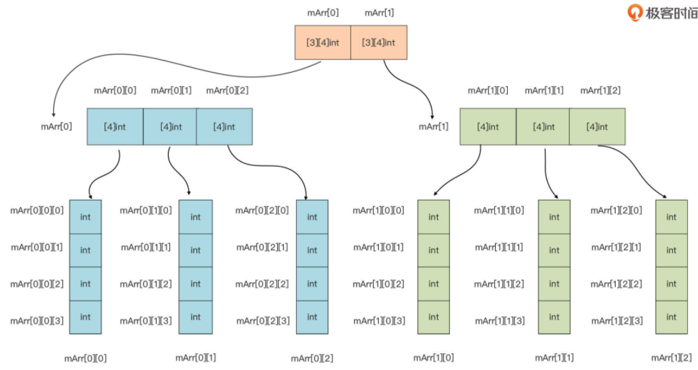
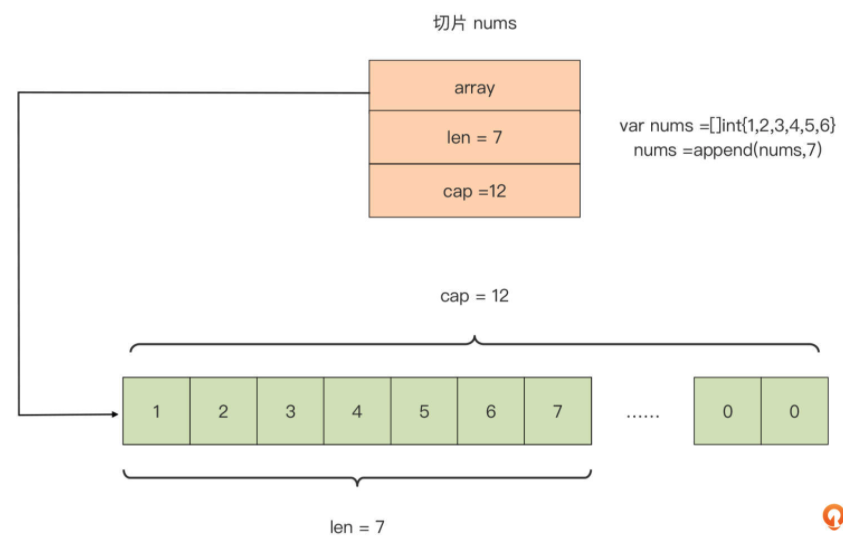
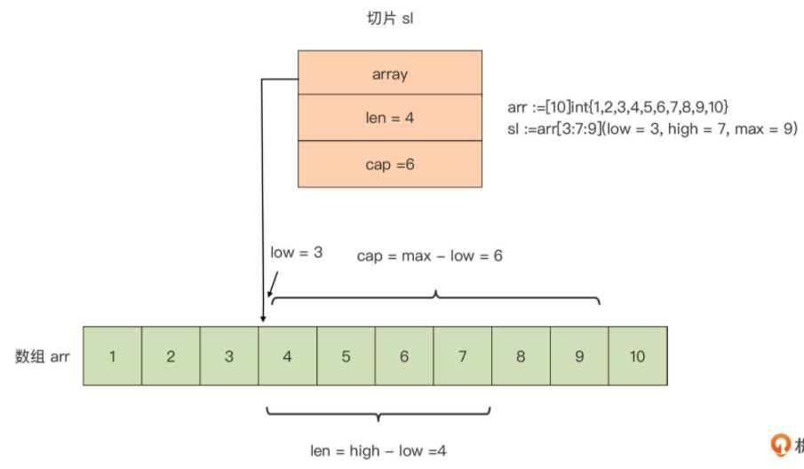
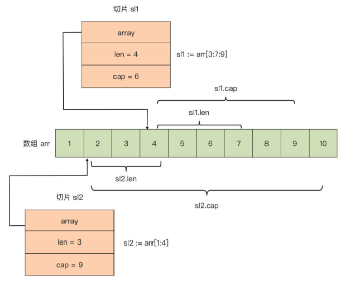

# Go Language Base Data Type

>Go 语言数据类型 之 复合数据类型

## 复合数据类型

Go 基本数据类型，主要包括数值类型与字符串类型。 但是，这些基本数据类型建立的抽象概念，还远不足以应对真实世界的各种问题。 

- 比如，要表示一组数量固定且连续的整型数，建立一个能表示书籍的抽象数据类型， 这个类型中包含书名、页数、出版信息等；
- 又或者，要建立一个学号与学生姓名的映射表等。

这些问题基本数据类型都无法解决，所以需要一类新类型来建立这些抽象， 丰富 Go 语言的表现力。

这种新类型是怎么样的呢？

- 可以通过这些例子总结出新类型的一个特点，那就是它们都是由多个同构类型（相同类型）或异构类型（不同类型）的元素的值组合而成的。
- 这类数据类型在 Go 语言中被称为复合类型，即 Go 语言的复合类型。

Go 语言原生内置了多种复合数据类型，包括**数组、切片（slice）、map、结构体**，以及像 **channel** 这类用于并发程序设计的高级复合数据类型。

## 数组

### 数组类型的逻辑定义

先来看数组类型的概念。Go 语言的数组是**一个长度固定的、由同构类型元素组成的连 续序列**。

通过这个定义，可以识别出 Go 的数组类型包含两个重要属性：**元素的类型和数组长度（元素的个数）**。这两个属性也直接构成了 Go 语言中数组类型变量的声明：

```go
// 数组声明
var arr [N]T
```

这里声明了一个数组变量 arr，它的类型为 [N]T，其中元素的类型为 T，数组的长度为 N。

这里，要注意，数组元素的类型可以为任意的 Go 原生类型或自定义类型，而且数组的长度必须在声明数组变量时提供，Go 编译器需要在编译阶段就知道数组类型的长度。所以，只能用整型数字面值或常量表达式作为 N 值。 

通过这句代码也可以看到，**如果两个数组类型的元素类型 T 与数组长度 N 都是一样的，那么这两个数组类型是等价的，如果有一个属性不同，它们就是两个不同的数组类型**。下面这个示例很好地诠释了这一点：

```go
func foo(arr [5]int) {

}

func main() {
   var arr1 [5]int
   var arr2 [6]int
   var arr3 [5]string

   foo(arr1) // ok
   foo(arr2) // 错误：[6]int与函数foo参数的类型[5]int不是同一数组类型 // cannot use arr2 (type [6]int) as type [5]int in argument to foo
   foo(arr3) // 错误：[5]string与函数foo参数的类型[5]int不是同一数组类型 // cannot use arr3 (type [5]string) as type [5]int in argument to foo
}
```

在这段代码里，arr2 与 arr3 两个变量的类型分别为 [6]int 和 [5]string，前者的长度属性与 [5]int 不一致，后者的元素类型属性与[5]int 不一致，因此这两个变量都不能作为调用函数 foo 时的实际参数。 

### 数组类型在内存中的实际表示

了解了数组类型的逻辑定义后，再来看看数组类型在内存中的实际表示是怎样的，这是数组区别于其他类型，也是区分不同数组类型的根本依据。 

数组类型不仅是逻辑上的连续序列，而且在实际内存分配时也占据着一整块内存。

Go 编译器在为数组类型的变量实际分配内存时，会为 Go 数组**分配一整块、可以容纳它所有元素的连续内存**，如下图所示：


从这个数组类型的内存表示中可以看出来，这块内存全部空间都被用来表示数组元素，所以说这块内存的大小，就等于各个数组元素的大小之和。

如果两个数组所分配的内存大小不同，那么它们肯定是不同的数组类型。Go 提供了**预定义函数 len **可以用于获取一个数组类型变量的长度，通过 **unsafe 包提供的 Sizeof 函数**，可以获得一个数组变量的总大小，如下面代码：

```go
var arr = [6]int{1, 2, 3, 4, 5, 6}
fmt.Println("数组长度: ", len(arr))           // 6
fmt.Println("数组大小: ", unsafe.Sizeof(arr)) // 48
```

数组大小就是所有元素的大小之和，这里数组元素的类型为 int。在 64 位平台上，int 类型的大小为 8，数组 arr 一共有 6 个元素，因此它的总大小为 6x8=48 个字节。

### 数组初始化

和基本数据类型一样，声明一个数组类型变量的同时，也可以显式地对它进行初始化。

如果不进行显式初始化，那么数组中的元素值就是它类型的**零值**。比如下面的数组类型变量 arr5 的各个元素值都为 0：

```go
// 数组默认初始化为零值
var arr5 [6]int
fmt.Println(arr5)  // [0 0 0 0 0 0]
```

如果要显式地对数组初始化，需要在右值中显式放置数组类型，并通过**大括号**的方式给各个元素赋值（如下面代码中的 arr6）。

当然，也可以忽略掉右值初始化表达式中数组类型的长度，用**“…”**替代，Go 编译器会根据数组元素的个数，自动计算出数组长度 （如下面代码中的 arr7）：

```go
// 大括号显示数组赋值
var arr6 = [6]int{
  11, 12, 13, 14, 15, 16,
}
fmt.Println(arr6) // [11 12 13 14 15 16]

// 自动计算数组长度
var arr7 = [...]int{
  21, 22, 23,
}
fmt.Println(arr7)      // [21 22 23]
fmt.Println(len(arr7)) // 3
```

如果要对一个长度较大的稀疏数组进行显式初始化，这样逐一赋值就太麻烦了，还有什么更好的方法吗？

可以通过使用下标赋值的方式对它进行初始化，比如下面代码中的 arr8：

```go
// 下标赋值的方式初始化
var arr8 = [...]int{
   99: 39, // 将第100个元素(下标值为99)的值赋值为39，其余元素值均为0
}
fmt.Println(arr8) // [0 0 ... 99]
```

### 数组的访问

通过数组类型变量以及下标值，可以很容易地访问到数组中的元素值，并且这种访问是十分高效的，不存在 Go 运行时带来的额外开销。

但要记住，数组的下标值是从 0 开 始的。如果下标值超出数组长度范畴，或者是负数，那么 Go 编译器会给出错误提示，防止访问溢出：

```go
// 数组的访问
var arr9 = [5]int{11, 12, 13, 14, 15}
fmt.Println(arr9[0], arr9[4])  // 11 15
fmt.Println(arr9[-1]) // invalid array index -1 (index must be non-negative) 错误：下标值不能为负数
fmt.Println(arr9[99]) // invalid array index 99 (out of bounds for 5-element array) 错误：下标值超出了arr的长度范围
```


## 多维数组

上面这些元素类型的数组都是简单的一维数组，但 Go 语言中，其实还有更复杂的数组类型，多维数组。

也就是说，数组类型自身也可以作为数组元素的类型，这样就会产生多维数组，比如下面的变量 mArr 的类型就是一个多维数组`[2][3][4]int`：

```go
var mArr [2][3][4]int

fmt.Println(mArr)
// [
//  [
//   [0 0 0 0]
//   [0 0 0 0]
//   [0 0 0 0]
//  ]
//  [
//   [0 0 0 0]
//   [0 0 0 0]
//   [0 0 0 0]
//   ]
// ]
```

多维数组也不难理解，以上面示例中的多维数组类型为例，从左向右逐维地去 看，这样就可以将一个多维数组分层拆解成这样：



- 从上向下看，首先将 mArr 这个数组看成是一个拥有两个元素，且元素类型都为 [3] [4]int 的数组，就像图中最上层画的那样。这样，mArr 的两个元素分别为 mArr[0]和 mArr [1]，它们的类型均为[3] [4]int，也就是说它们都是二维数组。 
- 而以 mArr[0]为例，可以将其看成一个拥有 3 个元素且元素类型为[4]int 的数组，也就是图中中间层画的那样。这样 mArr[0]的三个元素分别为 mArr[0] [0]、mArr[0] [1]以及 mArr[0] [2]，它们的类型均为[4]int，也就是说它们都是一维数组。 
- 图中的最后一层就是 mArr[0]的三个元素，以及 mArr[1]的三个元素的各自展开形式。

以此类推，会发现，无论多维数组究竟有多少维，都可以将它从左到右逐一展开，最终化为熟悉的一维数组。 

不过，虽然数组类型是 Go 语言中最基础的复合数据类型，但是在使用中它也会有一些**问题**。

数组类型变量是一个整体，这就意味着一个数组变量表示的是整个数组。这点与 C 语言完全不同，在 C 语言中，数组变量可视为指向数组第一个元素的指针。这样一来，无论是参与迭代，还是作为实际参数传给一个函数 / 方法，Go 传递数组的方式都是纯粹的**值拷贝**，这会带来较大的内存拷贝开销。 

这时，可能会想到可以使用指针的方式，来向函数传递数组。没错，这样做的确可以避免性能损耗，但这更像是 C 语言的惯用法。

其实，Go 语言为我们提供了一种更为灵活、更为地道的方式 ，**切片**，来解决这个问题。它的优秀特性让它成为了 Go 语言中最常用的同构复合类型。


## 切片

前面提到过，数组作为最基本同构类型在 Go 语言中被保留了下来，但数组在使用上确有两点不足：固定的元素个数，以及传值机制下导致的开销较大。

于是 Go 设计者们又引入了另外一种同构复合类型：**切片（slice）**，来弥补数组的这两处不足。 

### 切片变量的声明

切片和数组就像两个一母同胞的亲兄弟，长得像，但又各有各的行为特点。可以先声明并初始化一个切片变量看看：

```go
// 切片变量的声明
var nums = []int{1, 2, 3, 4, 5, 6}
fmt.Println(nums) // [1 2 3 4 5 6]
```

与数组声明相比，切片声明仅仅是少了一个“长度”属性。去掉“长度”这一束缚后，切片展现出更为灵活的特性。 

虽然不需要像数组那样在声明时指定长度，但切片也有自己的长度，只不过这个长度不是固定的，而是随着切片中元素个数的变化而变化的。

可以通过 **len 函数**获得切片类型变量的长度，比如上面那个切片变量的长度就是 6:

```go
fmt.Println(len(nums))  // 6
```

通过 Go 内置**函数 append**，可以动态地向切片中添加元素。当然，添加后切 片的长度也就随之发生了变化，如下面代码所示：

```go
// 添加切片元素
nums = append(nums, 7)

fmt.Println(nums)      // [1 2 3 4 5 6 7]
fmt.Println(len(nums)) // 7
```


### Go 是如何实现切片类型的？ 

Go 切片在运行时其实是一个三元组结构，它在 Go 运行时的表示如下：

```go
// runtime/slice.go
type slice struct {
   array unsafe.Pointer
   len   int
   cap   int
}
```

可以看到，每个切片包含三个字段：

- array: 是指向底层数组的指针； 
- len: 是切片的长度，即切片中当前元素的个数； 
- cap: 是底层数组的长度，也是切片的最大容量，cap 值永远大于等于 len 值。

如果用这个三元组结构表示切片类型变量 nums，会是这样：



可以看到，Go 编译器会自动为每个新创建的切片，建立一个底层数组，默认底层数组的长度与切片初始元素个数相同。

> 图中的底层数组长度是12与切片长度不同的原因是，append 了一个新的元素，此时就会默认执行切片的扩充，变为原来的二倍，即6的二倍为12。

### 创建切片

还可以用以下几种方法创建切片，并指定它底层数组的长度。 

#### make 函数创建切片

方法一：**通过 make 函数来创建切片，并指定底层数组的长度**。

直接看下面这行代码：

```go
//  make 函数创建切片
sl1 := make([]byte, 6, 19) // 其中19为cap值，即底层数组长度，6为切片的初始长度
fmt.Println(sl1)           // [0 0 0 0 0 0]
fmt.Println(len(sl1))      // 6
fmt.Println(cap(sl1))      // 19
```

如果没有在 make 中指定 cap 参数，那么底层数组长度 cap 就等于 len，比如：

```go
//  make 函数创建切片，默认 cap = len = 6
sl2 := make([]byte, 6) // 其中默认6为cap值，即底层数组长度，6为切片的初始长度 // cap = len = 6
fmt.Println(sl2)       // [0 0 0 0 0 0]
fmt.Println(len(sl2))  // 6
fmt.Println(cap(sl2))  // 6
```

到这里，肯定会有一个问题，为什么上面图中 nums 切片的底层数组长度为 12，而不是初始的 len 值 6 呢？

> 图中的底层数组长度是12与切片长度不同的原因是，append 了一个新的元素，此时就会默认执行切片的扩充，变为原来的二倍，即6的二倍为12。

#### 数组的切片化

方法二：**采用 array[low : high : max]语法基于一个已存在的数组创建切片**。

这种方式被称为**数组的切片化**，比如下面代码：

```go
// 数组的切片化
arr := [10]int{1, 2, 3, 4, 5, 6, 7, 8, 9, 10}
sl3 := arr[3:7:9]
fmt.Println(arr)      // [1 2 3 4 5 6 7 8 9 10]
fmt.Println(sl3)      // [4 5 6 7]
fmt.Println(len(sl3)) // 4
fmt.Println(cap(sl3)) // 6
```

基于数组 arr 创建了一个切片 sl3，这个切片 sl3 在运行时中的表示是这样：



可以看到，基于数组创建的切片，它的起始元素从 low 所标识的下标值开始，切片的长度 （len）是 high - low，它的容量是 max - low。

而且，由于切片 sl3 的底层数组就是数组 arr，**对切片 sl3 中元素的修改将直接影响数组 arr 变量**。如果将切片的第一个元素加 10，那么数组 arr 的第四个元素将变为 14：

```go
// 更改切片元素的值，会改变原数组的值
sl3[0] += 10
fmt.Println(arr)                // [1 2 3 14 5 6 7 8 9 10]
fmt.Println(sl3)                // [14 5 6 7]
fmt.Println("arr[3] =", arr[3]) // arr[3] = 14

fmt.Println(sl3[5])  // 测试：在切片在访问 大于长度 小于 cap 的元素，会报错：panic: runtime error: index out of range [5] with length 4
```

这样看来，切片好比打开了一个访问与修改数组的“窗口”，通过这个窗口，可以直接操作底层数组中的部分元素。

这有些类似于操作文件之前打开的“文件描述符”（Windows 上称为句柄），通过文件描述符可以对底层的真实文件进行相关操作。可以说，**切片之于数组就像是文件描述符之于文件**。 

在 Go 语言中，数组更多是“退居幕后”，承担的是底层存储空间的角色。切片就是数组 的“描述符”，也正是因为这一特性，切片才能在函数参数传递时避免较大性能开销。

因为传递的并不是数组本身，而是**数组的“描述符”**，而这个**描述符的大小是固定的** （见上面的三元组结构），无论底层的数组有多大，切片打开的“窗口”长度有多长，它都是不变的。

此外，在进行数组切片化的时候，**通常省略 max**，而 **max 的默认值为数组的长度**。（备注：这个默认值是数组的长度不太对吧！应该是原来数组被切片之后，从切片的起始位置到最后一个元素的个数。）


#### 数组的（多个切）片化

另外，针对一个已存在的数组，还可以**建立多个操作数组的切片**，这些切片共享同一底层数组，**切片对底层数组的操作也同样会反映到其他切片中**。

下面是为数组 arr 建立的两个切片的内存表示：



可以看到，上图中的两个切片 sl1 和 sl2 是数组 arr 的“描述符”，这样的情况下，无论通过哪个切片对数组进行的修改操作，都会反映到另一个切片中。

比如，将 sl2[2]置为 14，那么 sl1[0]也会变成 14，因为 sl2[2]直接操作的是底层数组 arr 的第四个元素 arr[3]。 

#### 切片创建切片

方法三：基于**切片创建切片**。 

不过这种切片的运行时表示原理与上面的是一样的。 

最后，回答一下前面切片变量 nums 在进行一次 append 操作后切片容量变为 12 的问题。

这里要清楚一个概念：切片与数组最大的不同，就在于其长度的不定长，这种 不定长需要 Go 运行时提供支持，这种支持就是切片的“动态扩容”。


### 切片的动态扩容 

“动态扩容”指的就是，当通过 append 操作向切片追加数据的时候，如果这时切片的 len 值和 cap 值是相等的，也就是说切片底层数组已经没有空闲空间再来存储追加的值了，Go 运行时就会对这个切片做扩容操作，来保证切片始终能存储下追加的新值。 

前面的切片变量 nums 之所以可以存储下新追加的值，就是因为 Go 对其进行了动态扩容，也就是重新分配了其底层数组，从一个长度为 6 的数组变成了一个长为 12 的数组。 

接下来，再通过一个**例子**来体会一下切片动态扩容的过程：

```go
var s []int
s = append(s, 11)
fmt.Println(len(s), cap(s)) // 1 1
s = append(s, 12)
fmt.Println(len(s), cap(s)) // 2 2
s = append(s, 13)
fmt.Println(len(s), cap(s)) // 3 4
s = append(s, 14)
fmt.Println(len(s), cap(s)) // 4 4
s = append(s, 15)
fmt.Println(len(s), cap(s)) // 5 8
```

在这个例子中，append 会根据切片对底层数组容量的需求，对底层数组进行 动态调整。

- 最开始，s 初值为零值（nil），这个时候 s 没有“绑定”底层数组。
- 先通过 append 操作向切片 s 添加一个元素 11，这个时候，append 会先分配底层数组 u1（数组长度 1），然后将 s 内部表示中的 array 指向 u1，并设置 len = 1, cap = 1; 
- 接着，通过 append 操作向切片 s 再添加第二个元素 12，这个时候 len(s) = 1， cap(s) = 1，append 判断底层数组剩余空间已经不能够满足添加新元素的要求了，于是它就创建了一个新的底层数组 u2，长度为 2（u1 数组长度的 2 倍），并把 u1 中的元素拷贝到 u2 中，最后将 s 内部表示中的 array 指向 u2，并设置 len = 2, cap = 2； 
- 然后，第三步，通过 append 操作向切片 s 添加了第三个元素 13，这时 len(s) = 2， cap(s) = 2，append 判断底层数组剩余空间不能满足添加新元素的要求了，于是又创建了 一个新的底层数组 u3，长度为 4（u2 数组长度的 2 倍），并把 u2 中的元素拷贝到 u3 中，最后把 s 内部表示中的 array 指向 u3，并设置 len = 3, cap 为 u3 数组长度，也就是 4 ；
- 第四步，依然通过 append 操作向切片 s 添加第四个元素 14，此时 len(s) = 3, cap(s) = 4，append 判断底层数组剩余空间可以满足添加新元素的要求，所以就把 14 放在下一个元素的位置 (数组 u3 末尾），并把 s 内部表示中的 len 加 1，变为 4； 
- 但第五步又通过 append 操作，向切片 s 添加最后一个元素 15，这时 len(s) = 4， cap(s) = 4，append 判断底层数组剩余空间又不够了，于是创建了一个新的底层数组 u4，长度为 8（u3 数组长度的 2 倍），并将 u3 中的元素拷贝到 u4 中，最后将 s 内部表示中的 array 指向 u4，并设置 len = 5, cap 为 u4 数组长度，也就是 8。 

到这里，这个动态扩容的过程就结束了。

可以看到，append 会根据切片的需要，在当前底层数组容量无法满足的情况下，**动态分配新的数组**，新数组长度会按一定规律扩展。

在上面这段代码中，针对元素是 int 型的数组，新数组的容量是当前数组的 2 倍。新数组建立后，append 会把旧数组中的数据拷贝到新数组中，之后新数组便成为了切片的底层数组，旧数组会被垃圾回收掉。 


### 动态扩容导致解除绑定问题

不过 append 操作的这种自动扩容行为，有些时候会给开发者带来一些**困惑**，比如基于一个已有数组建立的切片，一旦追加的数据操作触碰到切片的容量上限（实质上也是数组容量的上界)，切片就会和原数组**解除“绑定”**，后续对切片的任何修改都不会反映到原数组中了。再来看这段代码：

```go
// 自动扩容问题：切片与数组解除绑定
// 定义数组
u := [...]int{11, 12, 13, 14, 15}
fmt.Println("array:", u) // [11, 12, 13, 14, 15]
// 开始切片
s := u[1:3]
fmt.Printf("slice(len=%d, cap=%d): %v\n", len(s), cap(s), s) // [12, 13]
s = append(s, 24)
fmt.Println("after append 24, array:", u)
fmt.Printf("after append 24, slice(len=%d, cap=%d): %v\n", len(s), cap(s), s)
s = append(s, 25)
fmt.Println("after append 25, array:", u)
fmt.Printf("after append 25, slice(len=%d, cap=%d): %v\n", len(s), cap(s), s)
// 切片和原数组解除绑定
s = append(s, 26)
fmt.Println("after append 26, array:", u)
fmt.Printf("after append 26, slice(len=%d, cap=%d): %v\n", len(s), cap(s), s)
// 测试是否真的解除绑定
s[0] = 22
fmt.Println("after reassign 1st elem of slice, array:", u)
fmt.Printf("after reassign 1st elem of slice, slice(len=%d, cap=%d): %v\n", len(s), cap(s), s)
```

运行这段代码，得到这样的结果：

```sh
array: [11 12 13 14 15]
slice(len=2, cap=4): [12 13]
after append 24, array: [11 12 13 24 15]
after append 24, slice(len=3, cap=4): [12 13 24]
after append 25, array: [11 12 13 24 25]
after append 25, slice(len=4, cap=4): [12 13 24 25]
after append 26, array: [11 12 13 24 25]
after append 26, slice(len=5, cap=8): [12 13 24 25 26]
after reassign 1st elem of slice, array: [11 12 13 24 25]
after reassign 1st elem of slice, slice(len=5, cap=8): [22 13 24 25 26]
```

这里，在 append 25 之后，切片的元素已经触碰到了底层数组 u 的边界了。然后再 append 26 之后，append 发现底层数组已经无法满足 append 的要求，于是**新创建了一个底层数组**（数组长度为 cap(s) 的 2 倍，即 8），并将 slice 的元素拷贝到新数组中了。 

在这之后，即便再修改切片的第一个元素值，原数组 u 的元素也不会发生改变了，因 为这个时候切片 s 与数组 u 已经解除了“绑定关系”，s 已经不再是数组 u 的“描述符”了。

这种因切片的自动扩容而导致的“绑定关系”解除，有时候会成为实践道路上的一个小陷阱。


## 小结 

最常使用的两种同构复合数据类型：数组和切片。 

- **数组**是一个固定长度的、由同构类型元素组成的连续序列。
  - 这种连续不仅仅是逻辑上的， Go 编译器为数组类型变量分配的也是一整块可以容纳其所有元素的连续内存。
  - 而且，Go 编译器为数组变量的初始化也提供了很多便利。
  - 当数组元素的类型也是数组类型时，会出现多维数组。只需要按照变量声明从左到右、按维度分层拆解，直到出现一元数组就好了。 
  - 但是，Go 值传递的机制让数组在各个函数间传递起来比较“笨重”，开销较大，且开销随数组长度的增加而增加。
  - 为了解决这个问题，Go 引入了切片这一不定长同构数据类型。
- **切片**可以看成是数组的“描述符”，为数组打开了一个访问与修改的“窗口”。
  - 切片在 Go 运行时中被实现为一个“三元组（array, len, cap）”，其中的 array 是指向底层数组的指针，真正的数据都存储在这个底层数组中；len 表示切片的长度；而 cap 则是切片底层数组的容量。
  - 可以为一个数组建立多个切片，这些切片由于共享同一个底层数组，因此通过任一个切片对数组的修改都会反映到其他切片中。 
  - 切片是不定长同构复合类型，这个不定长体现在 Go 运行时对它提供的动态扩容的支撑。 
  - 当切片的 cap 值与 len 值相等时，如果再向切片追加数据，Go 运行时会自动对切片的底层数组进行扩容，追加数据的操作不会失败。 
  - 在大多数场合，都会使用切片以替代数组，
    - 原因之一是切片作为数组“描述符”的轻量性，无论它绑定的底层数组有多大，传递这个切片花费的开销都是恒定可控的；
    - 另外一个原因是切片相较于数组指针也是有优势的，切片可以提供比指针更为强大的功能，比如下标访问、边界溢出校验、动态扩容等。
    - 而且，指针本身在 Go 语言中的功能也受到的限制，比如不支持指针算术运算。


## 思考题

请描述一下下面这两个切片变量 sl1 与 sl2 的差异。

```go
var sl1 []int
var sl2 = []int{}
```

- s1是声明，还没初始化，是nil值，和nil比较返回true，底层没有分配内存空间。
- s2初始化为 empty slice，不是nil值，和nil比较返回false，底层分配了内存空间，有地址。


