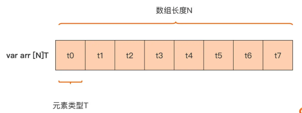
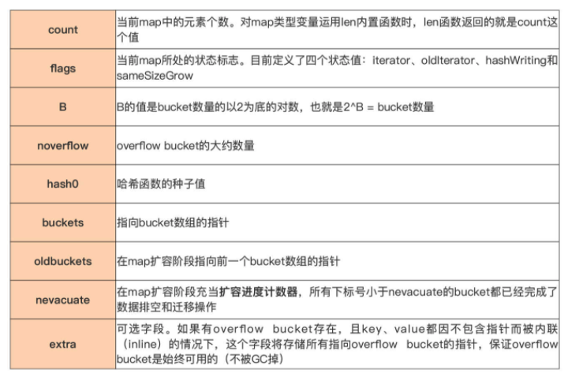
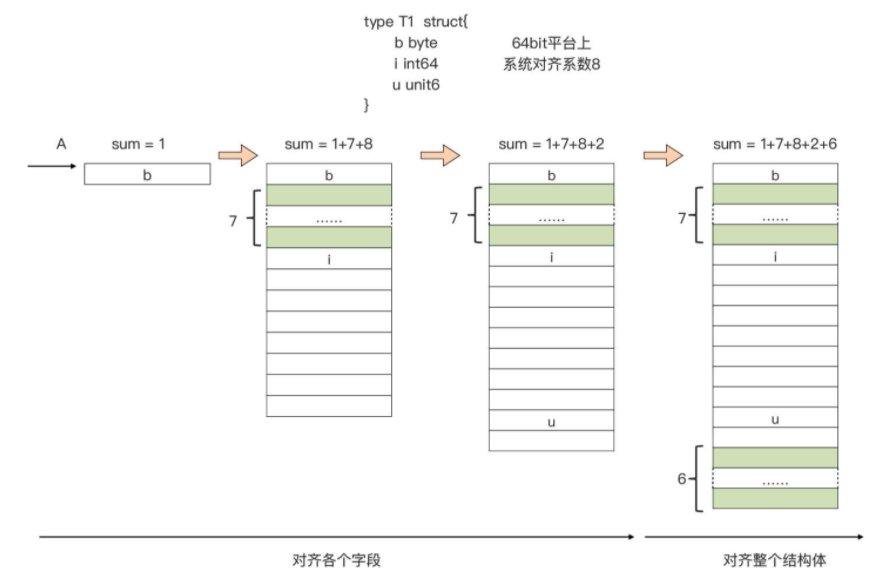

# Go Language Base Data Type

>Go 语言数据类型 之 复合数据类型

## 复合数据类型

Go 基本数据类型，主要包括数值类型与字符串类型。 但是，这些基本数据类型建立的抽象概念，还远不足以应对真实世界的各种问题。 

- 比如，要表示一组数量固定且连续的整型数，建立一个能表示书籍的抽象数据类型， 这个类型中包含书名、页数、出版信息等；
- 又或者，要建立一个学号与学生姓名的映射表等。

这些问题基本数据类型都无法解决，所以需要一类新类型来建立这些抽象， 丰富 Go 语言的表现力。

这种新类型是怎么样的呢？

- 可以通过这些例子总结出新类型的一个特点，那就是它们都是由多个同构类型（相同类型）或异构类型（不同类型）的元素的值组合而成的。
- 这类数据类型在 Go 语言中被称为复合类型，即 Go 语言的复合类型。

Go 语言原生内置了多种复合数据类型，包括**数组、切片（slice）、map、结构体**，以及像 **channel** 这类用于并发程序设计的高级复合数据类型。

## 数组

### 数组类型的逻辑定义

先来看数组类型的概念。Go 语言的数组是**一个长度固定的、由同构类型元素组成的连 续序列**。

通过这个定义，可以识别出 Go 的数组类型包含两个重要属性：**元素的类型和数组长度（元素的个数）**。这两个属性也直接构成了 Go 语言中数组类型变量的声明：

```go
// 数组声明
var arr [N]T
```

这里声明了一个数组变量 arr，它的类型为 [N]T，其中元素的类型为 T，数组的长度为 N。

这里，要注意，数组元素的类型可以为任意的 Go 原生类型或自定义类型，而且数组的长度必须在声明数组变量时提供，Go 编译器需要在编译阶段就知道数组类型的长度。所以，只能用整型数字面值或常量表达式作为 N 值。 

通过这句代码也可以看到，**如果两个数组类型的元素类型 T 与数组长度 N 都是一样的，那么这两个数组类型是等价的，如果有一个属性不同，它们就是两个不同的数组类型**。下面这个示例很好地诠释了这一点：

```go
func foo(arr [5]int) {

}

func main() {
   var arr1 [5]int
   var arr2 [6]int
   var arr3 [5]string

   foo(arr1) // ok
   foo(arr2) // 错误：[6]int与函数foo参数的类型[5]int不是同一数组类型 // cannot use arr2 (type [6]int) as type [5]int in argument to foo
   foo(arr3) // 错误：[5]string与函数foo参数的类型[5]int不是同一数组类型 // cannot use arr3 (type [5]string) as type [5]int in argument to foo
}
```

在这段代码里，arr2 与 arr3 两个变量的类型分别为 [6]int 和 [5]string，前者的长度属性与 [5]int 不一致，后者的元素类型属性与[5]int 不一致，因此这两个变量都不能作为调用函数 foo 时的实际参数。 

### 数组类型在内存中的实际表示

了解了数组类型的逻辑定义后，再来看看数组类型在内存中的实际表示是怎样的，这是数组区别于其他类型，也是区分不同数组类型的根本依据。 

数组类型不仅是逻辑上的连续序列，而且在实际内存分配时也占据着一整块内存。

Go 编译器在为数组类型的变量实际分配内存时，会为 Go 数组**分配一整块、可以容纳它所有元素的连续内存**，如下图所示：



从这个数组类型的内存表示中可以看出来，这块内存全部空间都被用来表示数组元素，所以说这块内存的大小，就等于各个数组元素的大小之和。

如果两个数组所分配的内存大小不同，那么它们肯定是不同的数组类型。Go 提供了**预定义函数 len **可以用于获取一个数组类型变量的长度，通过 **unsafe 包提供的 Sizeof 函数**，可以获得一个数组变量的总大小，如下面代码：

```go
var arr = [6]int{1, 2, 3, 4, 5, 6}
fmt.Println("数组长度: ", len(arr))           // 6
fmt.Println("数组大小: ", unsafe.Sizeof(arr)) // 48
```

数组大小就是所有元素的大小之和，这里数组元素的类型为 int。在 64 位平台上，int 类型的大小为 8，数组 arr 一共有 6 个元素，因此它的总大小为 6x8=48 个字节。

### 数组初始化

和基本数据类型一样，声明一个数组类型变量的同时，也可以显式地对它进行初始化。

如果不进行显式初始化，那么数组中的元素值就是它类型的**零值**。比如下面的数组类型变量 arr5 的各个元素值都为 0：

```go
// 数组默认初始化为零值
var arr5 [6]int
fmt.Println(arr5)  // [0 0 0 0 0 0]

// 数组类型
var arrinterface [200]interface{}
```

Go 语言数组在初始化之后大小就无法改变。

即使存储元素类型相同、但是大小不同的数组类型在 Go 语言看来也是完全不同的，只有两个条件都相同才是同一类型。

```go
// github.com/golang/go/src/cmd/compile/internal/types/type.go
// NewArray returns a new fixed-length array Type.
func NewArray(elem *Type, bound int64) *Type {
	if bound < 0 {
		Fatalf("NewArray: invalid bound %v", bound)
	}
	t := New(TARRAY)
	t.Extra = &Array{Elem: elem, Bound: bound}
	t.SetNotInHeap(elem.NotInHeap())
	return t
}
```

编译期间的数组类型是由上述的 NewArray 函数生成的，该类型包含两个字段，分别是元素类型 `Elem` 和数组的大小 `Bound`，这两个字段共同构成了数组类型，而当前数组是否应该在堆栈中初始化也在编译期就确定了。

如果要显式地对数组初始化，需要在右值中显式放置数组类型，并通过**大括号**的方式给各个元素赋值（如下面代码中的 arr6）。

当然，也可以忽略掉右值初始化表达式中数组类型的长度，用**“…”**替代，Go 编译器会在编译期间根据数组元素的个数，自动计算出数组长度 （如下面代码中的 arr7）：

```go
// 大括号显示数组赋值
var arr6 = [6]int{
  11, 12, 13, 14, 15, 16,
}
fmt.Println(arr6) // [11 12 13 14 15 16]

// 自动计算数组长度
var arr7 = [...]int{
  21, 22, 23,
}
fmt.Println(arr7)      // [21 22 23]
fmt.Println(len(arr7)) // 3
```

可以看出 `[...]T{1, 2, 3}` 和 `[3]T{1, 2, 3}` 在运行时是完全等价的，`[...]T` 这种初始化方式也只是 Go 语言提供的一种语法糖，当不想计算数组中的元素个数时可以通过这种方法减少一些工作量。

对于一个由字面量组成的数组（明确给出长度的数组），根据数组元素数量的不同，编译器会在负责初始化字面量的 `github.com/golang/go/src/cmd/compile/internal/gc/sinit.go#func anylit(n *Node, var_ *Node, init *Nodes) {}` 函数中做两种不同的优化：

1. 当元素数量小于或者等于 4 个时，会直接将数组中的元素放置在栈上；

   1. `github.com/golang/go/src/cmd/compile/internal/gc/sinit.go#func fixedlit(ctxt initContext, kind initKind, n *Node, var_ *Node, init *Nodes) {}` 函数会负责在函数编译之前将 `[3]{1, 2, 3}` 转换成更加原始的语句。

   2. ```go
      func fixedlit(ctxt initContext, kind initKind, n *Node, var_ *Node, init *Nodes) {
        ...
      	// build list of assignments: var[index] = expr
        setlineno(a)
        a = nod(OAS, a, value)
        a = typecheck(a, ctxStmt)
        switch kind {
        case initKindStatic:
           genAsStatic(a)
        case initKindDynamic, initKindLocalCode:
           a = orderStmtInPlace(a, map[string][]*Node{})
           a = walkstmt(a)
           init.Append(a)
        default:
           Fatalf("fixedlit: bad kind %d", kind)
        }
        ...
      }
      ```

   3. 当数组中元素的个数小于或者等于四个并且 `func fixedlit(ctxt initContext, kind initKind, n *Node, var_ *Node, init *Nodes) {}`函数接收的 `kind` 是 `initKindLocalCode` 时，会将原有的初始化语句 `[3]int{1, 2, 3}` **拆分**成一个声明变量的表达式和几个赋值表达式，这些表达式会完成对数组的初始化：

      ```go
      var arr [3]int
      arr[0] = 1
      arr[1] = 2
      arr[2] = 3
      ```

2. 当元素数量大于 4 个时，会将数组中的元素放置到静态区并在运行时取出；

   1. 但是如果当前数组的元素大于四个，`#func anylit(n *Node, var_ *Node, init *Nodes) {}`  会先获取一个唯一的 `staticname`，然后调用 `#func fixedlit(ctxt initContext, kind initKind, n *Node, var_ *Node, init *Nodes) {}` 函数在静态存储区初始化数组中的元素，并将临时变量赋值给数组：

   2. ```go
      func anylit(n *Node, var_ *Node, init *Nodes) {
      	t := n.Type
      	switch n.Op {
      	case OSTRUCTLIT, OARRAYLIT:
      		if n.List.Len() > 4 {
      			vstat := staticname(t)
      			vstat.Name.SetReadonly(true)
      
      			fixedlit(inNonInitFunction, initKindStatic, n, vstat, init)
      
            // copy static to var
      			a := nod(OAS, var_, vstat)
      			a = typecheck(a, ctxStmt)
      			a = walkexpr(a, init)
      			init.Append(a)
      			break
      		}
      
      		...
      	}
      }
      ```
   3. 假设代码需要初始化 `[5]int{1, 2, 3, 4, 5}`，那么可以将上述过程理解成以下的伪代码：
   
   4. ```go
      var arr [5]int
      statictmp_0[0] = 1
      statictmp_0[1] = 2
      statictmp_0[2] = 3
      statictmp_0[3] = 4
      statictmp_0[4] = 5
      arr = statictmp_0
      ```

总结起来，在不考虑逃逸分析的情况下，

- 如果数组中元素的个数小于或者等于 4 个，那么所有的变量会直接在栈上初始化，
- 如果数组元素大于 4 个，变量就会在静态存储区初始化然后拷贝到栈上，

这些转换后的代码才会继续进入 中间代码生成 和 机器码生成 两个阶段，最后生成可以执行的 二进制文件 。

如果要对一个长度较大的稀疏数组进行显式初始化，这样逐一赋值就太麻烦了，还有什么更好的方法吗？

可以通过使用下标赋值的方式对它进行初始化，比如下面代码中的 arr8：

```go
// 下标赋值的方式初始化
var arr8 = [...]int{
   99: 39, // 将第100个元素(下标值为99)的值赋值为39，其余元素值均为0
}
fmt.Println(arr8) // [0 0 ... 99]
```


### 数组的访问

通过数组类型变量以及下标值，可以很容易地访问到数组中的元素值，并且这种访问是十分高效的，不存在 Go 运行时带来的额外开销。

但要记住，数组的下标值是从 0 开 始的。如果下标值超出数组长度范畴，或者是负数，那么 Go 编译器会给出错误提示，防止访问溢出：

```go
// 数组的访问
var arr9 = [5]int{11, 12, 13, 14, 15}
fmt.Println(arr9[0], arr9[4])  // 11 15
fmt.Println(arr9[-1]) // invalid array index -1 (index must be non-negative) 错误：下标值不能为负数
fmt.Println(arr9[99]) // invalid array index 99 (out of bounds for 5-element array) 错误：下标值超出了arr的长度范围
```

数组访问越界是非常严重的错误，Go 语言可以在编译期间的静态类型检查判断数组越界，`func typecheck1` 会验证访问数组的索引：

```go
// github.com/golang/go/src/cmd/compile/internal/gc/typecheck.go
func typecheck1(n *Node, top int) (res *Node) {
	switch n.Op {
	case OINDEX:
		ok |= ctxExpr
		l := n.Left  // array
		r := n.Right // index
		switch n.Left.Type.Etype {
		case TSTRING, TARRAY, TSLICE:
			...
			if n.Right.Type != nil && !n.Right.Type.IsInteger() {
				yyerror("non-integer array index %v", n.Right)
				break
			}
			if !n.Bounded() && Isconst(n.Right, CTINT) {
				x := n.Right.Int64()
				if x < 0 {
					yyerror("invalid array index %v (index must be non-negative)", n.Right)
				} else if n.Left.Type.IsArray() && x >= n.Left.Type.NumElem() {
					yyerror("invalid array index %v (out of bounds for %d-element array)", n.Right, n.Left.Type.NumElem())
				}
			}
		}
	...
	}
}
```

1. 访问数组的索引是非整数时，报错 “non-integer array index %v”；
2. 访问数组的索引是负数时，报错 “invalid array index %v (index must be non-negative)"；
3. 访问数组的索引越界时，报错 “invalid array index %v (out of bounds for %d-element array)"；

数组和字符串的一些简单越界错误都会在编译期间发现，例如：

- 直接使用整数或者常量访问数组；
- 但是如果使用变量去访问数组或者字符串时，编译器就无法提前发现错误，需要 Go 语言运行时阻止不合法的访问：

```go
var arr10 = [5]int{11, 12, 13, 14, 15}
var ind = 6
fmt.Println(arr10)
fmt.Println(arr10[6])   // 编译器报错：invalid array index 6 (out of bounds for 5-element array)
fmt.Println(arr10[ind]) // 运行时报错：panic: runtime error: index out of range [6] with length 5
```

Go 语言运行时在发现数组、切片和字符串的越界操作会由运行时的 `runtime.panicIndex` 和 `runtime.goPanicIndex` 触发程序的运行时错误并导致崩溃退出：

```go
// github.com/golang/go/src/runtime/asm_386.s
TEXT runtime·panicIndex(SB),NOSPLIT,$0-8
	MOVL	AX, x+0(FP)
	MOVL	CX, y+4(FP)
	JMP	runtime·goPanicIndex(SB)

// github.com/golang/go/src/runtime/panic.go
func goPanicIndex(x int, y int) {
	panicCheck1(getcallerpc(), "index out of range")
	panic(boundsError{x: int64(x), signed: true, y: y, code: boundsIndex})
}
```

当数组的访问操作 `OINDEX` 成功通过编译器的检查后，会被转换成几个 SSA 指令，假设有如下所示的 Go 语言代码，通过如下的方式进行编译会得到 ssa.html 文件：

```go
package arrayssa

func outOfRange() int {
	// v1-越界
	arr := [3]int{1, 2, 3}
	i := 4
	elem := arr[i]
	return elem
	// v2-字面值整数
	// arr := [3]int{1, 2, 3}
	// elem := arr[2]
	// return elem
	// v3-复制操作
	// arr := [3]int{1, 2, 3}
	// arr[0] = 666
	// return arr[2]
}

$ GOSSAFUNC=outOfRange go build main.go
dumped SSA to ./ssa.html
```

`start` 阶段生成的 SSA 代码就是优化之前的第一版中间代码，下面展示的部分是 `elem := arr[i]` 对应的中间代码，在这段中间代码中发现 Go 语言为数组的访问操作生成了判断数组上限的指令 `IsInBounds` 以及当条件不满足时触发程序崩溃的 `PanicBounds` 指令：

```go
b1:
    ...
    v22 (6) = LocalAddr <*[3]int> {arr} v2 v20
    v23 (6) = IsInBounds <bool> v21 v11
If v23 → b2 b3 (likely) (6)

b2: ← b1-
    v26 (6) = PtrIndex <*int> v22 v21
    v27 (6) = Copy <mem> v20
    v28 (6) = Load <int> v26 v27 (elem[int])
    ...
Ret v30 (+7)

b3: ← b1-
    v24 (6) = Copy <mem> v20
    v25 (6) = PanicBounds <mem> [0] v21 v11 v24
Exit v25 (6)
```

编译器会将 `PanicBounds` 指令转换成上面提到的 `runtime.panicIndex` 函数（这个可以在ssa文件最后一步的 genssa 中看到）。

当数组下标**没有越界时**，编译器会先获取数组的内存地址和访问的下标、利用 `PtrIndex` 计算出目标元素的地址，最后使用 `Load` 操作将指针中的元素加载到内存中。

当然只有当编译器无法对数组下标是否越界做出判断时才会加入 `PanicBounds` 指令交给运行时进行判断。

在使用字面量整数访问数组下标时会生成非常简单的中间代码，将上述代码中的 `arr[i]` 改成 `arr[2]` 时，就会得到如下所示的代码：

```go
b1:
    ...
    v21 (5) = LocalAddr <*[3]int> {arr} v2 v20
    v22 (5) = PtrIndex <*int> v21 v14
    v23 (5) = Load <int> v22 v20 (elem[int])
    ...
```

Go 语言对于数组的访问还是有着比较多的检查的，它不仅会在编译期间提前发现一些简单的越界错误并插入用于检测数组上限的函数调用，还会在运行期间通过插入的函数保证不会发生越界。

数组的赋值和更新操作 `a[i] = 2` 也会在 SSA 生成期间计算出数组当前元素的内存地址，然后修改当前内存地址的内容，这些赋值语句会被转换成如下所示的 SSA 代码：

```go
b1:
    ...
    v21 (5) = LocalAddr <*[3]int> {arr} v2 v19
    v22 (5) = PtrIndex <*int> v21 v13
    v23 (5) = Store <mem> {int} v22 v20 v19
    ...
```

赋值的过程中会先确定目标数组的地址，再通过 `PtrIndex` 获取目标元素的地址，最后使用 `Store` 指令将数据存入地址中。

从上面的这些 SSA 代码中可以看出 上述数组寻址和赋值都是在编译阶段完成的，没有运行时的参与。


## 多维数组

上面这些元素类型的数组都是简单的一维数组，但 Go 语言中，其实还有更复杂的数组类型，多维数组。

也就是说，数组类型自身也可以作为数组元素的类型，这样就会产生多维数组，比如下面的变量 mArr 的类型就是一个多维数组`[2][3][4]int`：

```go
var mArr [2][3][4]int

fmt.Println(mArr)
// [
//  [
//   [0 0 0 0]
//   [0 0 0 0]
//   [0 0 0 0]
//  ]
//  [
//   [0 0 0 0]
//   [0 0 0 0]
//   [0 0 0 0]
//   ]
// ]
```

多维数组也不难理解，以上面示例中的多维数组类型为例，从左向右逐维地去 看，这样就可以将一个多维数组分层拆解成这样：


- 从上向下看，首先将 mArr 这个数组看成是一个拥有两个元素，且元素类型都为 [3] [4]int 的数组，就像图中最上层画的那样。这样，mArr 的两个元素分别为 mArr[0]和 mArr [1]，它们的类型均为[3] [4]int，也就是说它们都是二维数组。 
- 而以 mArr[0]为例，可以将其看成一个拥有 3 个元素且元素类型为[4]int 的数组，也就是图中中间层画的那样。这样 mArr[0]的三个元素分别为 mArr[0] [0]、mArr[0] [1]以及 mArr[0] [2]，它们的类型均为[4]int，也就是说它们都是一维数组。 
- 图中的最后一层就是 mArr[0]的三个元素，以及 mArr[1]的三个元素的各自展开形式。

以此类推，会发现，无论多维数组究竟有多少维，都可以将它从左到右逐一展开，最终化为熟悉的一维数组。 

不过，虽然数组类型是 Go 语言中最基础的复合数据类型，但是在使用中它也会有一些**问题**。

数组类型变量是一个整体，这就意味着一个数组变量表示的是整个数组。这点与 C 语言完全不同，在 C 语言中，数组变量可视为指向数组第一个元素的指针。这样一来，无论是参与迭代，还是作为实际参数传给一个函数 / 方法，Go 传递数组的方式都是纯粹的**值拷贝**，这会带来较大的内存拷贝开销。 

这时，可能会想到可以使用指针的方式，来向函数传递数组。没错，这样做的确可以避免性能损耗，但这更像是 C 语言的惯用法。

其实，Go 语言为我们提供了一种更为灵活、更为地道的方式 ，**切片**，来解决这个问题。它的优秀特性让它成为了 Go 语言中最常用的同构复合类型。


## 切片

前面提到过，数组作为最基本同构类型在 Go 语言中被保留了下来，但数组在使用上确有两点不足：固定的元素个数，以及传值机制下导致的开销较大。

于是 Go 设计者们又引入了另外一种同构复合类型：**切片（slice）**，来弥补数组的这两处不足。 

### 切片变量的声明

切片和数组就像两个一母同胞的亲兄弟，长得像，但又各有各的行为特点。可以先声明并初始化一个切片变量看看：

```go
// 切片变量的声明
var nums = []int{1, 2, 3, 4, 5, 6}
fmt.Println(nums) // [1 2 3 4 5 6]
```

与数组声明相比，切片声明仅仅是少了一个“长度”属性。去掉“长度”这一束缚后，切片展现出更为灵活的特性。 

虽然不需要像数组那样在声明时指定长度，但切片也有自己的长度，只不过这个长度不是固定的，而是随着切片中元素个数的变化而变化的。

可以通过 **len 函数**获得切片类型变量的长度，比如上面那个切片变量的长度就是 6:

```go
fmt.Println(len(nums))  // 6
```

通过 Go 内置**函数 append**，可以动态地向切片中添加元素。当然，添加后切 片的长度也就随之发生了变化，如下面代码所示：

```go
// 添加切片元素
nums = append(nums, 7)

fmt.Println(nums)      // [1 2 3 4 5 6 7]
fmt.Println(len(nums)) // 7
```

`cmd/compile/internal/types.NewSlice`就是在编译 期间 用于创建切片类型的函数：

```go
// github.com/golang/go/src/cmd/compile/internal/types/type.go
// NewSlice returns the slice Type with element type elem.
func NewSlice(elem *Type) *Type {
	if t := elem.Cache.slice; t != nil {
		if t.Elem() != elem {
			Fatalf("elem mismatch")
		}
		return t
	}

	t := New(TSLICE)
	t.Extra = Slice{Elem: elem}
	elem.Cache.slice = t
	return t
}
```

上述方法返回结构体中的 `Extra` 字段是一个**只包含切片内元素类型的结构**，也就是说切片内元素的类型都是在编译期间确定的，编译器确定了类型之后，会将类型存储在 `Extra` 字段中帮助程序在运行时动态获取。


### Go 是如何实现切片类型的？ 

Go 切片在运行时其实是一个三元组结构，它在 Go 运行时的表示如下：

```go
// runtime/slice.go
type slice struct {
   array unsafe.Pointer
   len   int
   cap   int
}
```

可以看到，每个切片包含三个字段：

- array: 是指向底层数组的指针； 
- len: 是切片的长度，即切片中当前元素的个数； 
- cap: 是底层数组的长度，也是切片的最大容量，cap 值永远大于等于 len 值。

如果用这个三元组结构表示切片类型变量 nums，会是这样：


可以看到，Go 编译器会自动为每个新创建的切片，建立一个底层数组，默认底层数组的长度与切片初始元素个数相同。

> 图中的底层数组长度是12与切片长度不同的原因是，append 了一个新的元素，此时就会默认执行切片的扩充，变为原来的二倍，即6的二倍为12。

编译期间的切片是 `cmd/compile/internal/types.Slice` 类型的，但是在运行时切片可以由如下的 `reflect.SliceHeader` 结构体表示，其中:

- `Data` 是指向数组的指针;
- `Len` 是当前切片的长度；
- `Cap` 是当前切片的容量，即 `Data` 数组的大小：

```go
// github.com/golang/go/src/reflect/value.go
// SliceHeader is the runtime representation of a slice.
// It cannot be used safely or portably and its representation may
// change in a later release.
// Moreover, the Data field is not sufficient to guarantee the data
// it references will not be garbage collected, so programs must keep
// a separate, correctly typed pointer to the underlying data.
type SliceHeader struct {
	Data uintptr
	Len  int
	Cap  int
}
```

`Data` 是一片连续的内存空间，这片内存空间可以用于存储切片中的全部元素。

数组中的元素只是逻辑上的概念，底层存储其实都是连续的，可以将切片理解成一片连续的内存空间加上长度与容量的标识。


### 创建切片

还可以用以下几种方法创建切片，并指定它底层数组的长度。 

Go 语言中包含三种初始化切片的方式：

1. 通过下标的方式获得数组或者切片的一部分；
2. 使用字面量初始化新的切片；
3. 使用关键字 `make` 创建切片：

```go
arr[0:3] or slice[0:3]
slice := []int{1, 2, 3}
slice := make([]int, 10)
```

#### make 函数创建切片

方法一：**通过 make 函数来创建切片，并指定底层数组的长度**。

直接看下面这行代码：

```go
//  make 函数创建切片
sl1 := make([]byte, 6, 19) // 其中19为cap值，即底层数组长度，6为切片的初始长度
fmt.Println(sl1)           // [0 0 0 0 0 0]
fmt.Println(len(sl1))      // 6
fmt.Println(cap(sl1))      // 19
```

如果没有在 make 中指定 cap 参数，那么底层数组长度 cap 就等于 len，比如：

```go
//  make 函数创建切片，默认 cap = len = 6
sl2 := make([]byte, 6) // 其中默认6为cap值，即底层数组长度，6为切片的初始长度 // cap = len = 6
fmt.Println(sl2)       // [0 0 0 0 0 0]
fmt.Println(len(sl2))  // 6
fmt.Println(cap(sl2))  // 6
```

到这里，肯定会有一个问题，为什么上面图中 nums 切片的底层数组长度为 12，而不是初始的 len 值 6 呢？

> 图中的底层数组长度是12与切片长度不同的原因是，append 了一个新的元素，此时就会默认执行切片的扩充，变为原来的二倍，即6的二倍为12。

当使用 `make` 关键字创建切片时，很多工作都需要运行时的参与；调用方必须向 `make` 函数传入切片的大小以及可选的容量，类型检查期间的 `cmd/compile/internal/gc.typecheck1` 函数会校验入参：

```go
// github.com/golang/go/src/cmd/compile/internal/gc/typecheck.go
func typecheck1(n *Node, top int) (res *Node) {
	switch n.Op {
	...
	case OMAKE:
		args := n.List.Slice()

		i := 1
		switch t.Etype {
		case TSLICE:
			if i >= len(args) {
				yyerror("missing len argument to make(%v)", t)
				return n
			}

			l = args[i]
			i++
			var r *Node
			if i < len(args) {
				r = args[i]
			}
			...
			if Isconst(l, CTINT) && r != nil && Isconst(r, CTINT) && l.Val().U.(*Mpint).Cmp(r.Val().U.(*Mpint)) > 0 {
				yyerror("len larger than cap in make(%v)", t)
				return n
			}

			n.Left = l
			n.Right = r
			n.Op = OMAKESLICE
		}
	...
	}
}
```

上述函数不仅会检查 `len` 是否传入，还会保证传入的容量 `cap` 一定大于或者等于 `len`。

除了校验参数之外，当前函数会将 `OMAKE` 节点转换成 `OMAKESLICE`，中间代码生成的 `cmd/compile/internal/gc.walkexpr` 函数会依据下面两个条件转换 `OMAKESLICE` 类型的节点：

1. 切片的大小和容量是否足够小；
2. 切片是否发生了逃逸，确定是否在堆上初始化。

当切片发生逃逸或者非常大时，运行时需要 `runtime.makeslice` 在**堆上初始化切片**。

如果当前的切片不会发生逃逸并且切片非常小的时候，`make([]int, 3, 4)` 会**被直接转换**成如下所示的代码：

```go
var arr [4]int
n := arr[:3]
```

上述代码会初始化数组并通过下标 `[:3]` 得到数组对应的切片，这两部分操作都会在编译阶段完成，编译器会在栈上或者静态存储区创建数组并将 `[:3]` 转换成 `OpSliceMake` 操作。

分析了主要由编译器处理的分支之后，回到用于创建切片的**运行时**函数 `runtime.makeslice`，这个函数的实现很简单：

```go
// github.com/golang/go/src/runtime/slice.go
func makeslice(et *_type, len, cap int) unsafe.Pointer {
	mem, overflow := math.MulUintptr(et.size, uintptr(cap))
	if overflow || mem > maxAlloc || len < 0 || len > cap {
		mem, overflow := math.MulUintptr(et.size, uintptr(len))
		if overflow || mem > maxAlloc || len < 0 {
			panicmakeslicelen()
		}
		panicmakeslicecap()
	}

  // Allocate an object of size bytes.
  // Small objects are allocated from the per-P cache's free lists.
  // Large objects (> 32 kB) are allocated straight from the heap.
	return mallocgc(mem, et, true)
}
```

上述函数的主要工作是计算切片占用的内存空间并在堆上申请一片连续的内存，它使用如下的方式计算占用的内存：

`内存空间=切片中元素大小×切片容量内存空间=切片中元素大小×切片容量`

虽然编译期间可以检查出很多错误，但是在创建切片的过程中如果发生了以下错误会直接**触发运行时错误并崩溃**：

1. 内存空间的大小发生了溢出；
2. 申请的内存大于最大可分配的内存；
3. 传入的长度小于 0 或者长度大于容量；

`runtime.makeslice` 在最后调用的 `runtime.mallocgc` 是用于申请内存的函数，这个函数的实现还是比较复杂，如果遇到了比较小的对象会直接初始化在 Go 语言调度器里面的 P 结构中，而大于 32KB 的对象会在堆上初始化。

在之前版本的 Go 语言中，数组指针、长度和容量会被合成一个 `runtime.slice` 结构，但是从 [cmd/compile: move slice construction to callers of makeslice](https://github.com/golang/go/commit/020a18c545bf49ffc087ca93cd238195d8dcc411#diff-d9238ca551e72b3a80da9e0da10586a4) 提交之后，构建结构体 `reflect.SliceHeader`的工作就都交给了 `runtime.makeslice` 的调用方，该函数仅会返回指向底层数组的指针，调用方会在编译期间构建切片结构体：

```go
// github.com/golang/go/src/cmd/compile/internal/gc/typecheck.go
func typecheck1(n *Node, top int) (res *Node) {
	switch n.Op {
	...
	case OSLICEHEADER:
	switch 
    // Errors here are Fatalf instead of yyerror because only the compiler
		// can construct an OSLICEHEADER node.
		// Components used in OSLICEHEADER that are supplied by parsed source code
		// have already been typechecked in e.g. OMAKESLICE earlier.
		t := n.Type
		n.Left = typecheck(n.Left, ctxExpr)
		l := typecheck(n.List.First(), ctxExpr)
		c := typecheck(n.List.Second(), ctxExpr)
		l = defaultlit(l, types.Types[TINT])
		c = defaultlit(c, types.Types[TINT])

		n.List.SetFirst(l)
		n.List.SetSecond(c)
	...
	}
}
```

`OSLICEHEADER` 操作会创建在上面介绍过的结构体 `reflect.SliceHeader`，其中包含数组指针、切片长度和容量，它是切片在运行时的表示：

```go
// github.com/golang/go/src/reflect/value.go
type SliceHeader struct {
	Data uintptr
	Len  int
	Cap  int
}
```

正是因为大多数对切片类型的操作并不需要直接操作原来的 `runtime.slice` 结构体，所以 `reflect.SliceHeader` 的引入能够减少切片初始化时的少量开销，该改动不仅能够减少 ~0.2% 的 Go 语言包大小，还能够减少 92 个 `runtime.panicIndex` 的调用，占 Go 语言二进制的 ~3.5%。


#### 数组的切片化

方法二：**采用 array[low : high : max]语法基于一个已存在的数组创建切片**。

这种方式被称为**数组的切片化**，比如下面代码：

```go
// 数组的切片化
arr := [10]int{1, 2, 3, 4, 5, 6, 7, 8, 9, 10}
sl3 := arr[3:7:9]
fmt.Println(arr)      // [1 2 3 4 5 6 7 8 9 10]
fmt.Println(sl3)      // [4 5 6 7]
fmt.Println(len(sl3)) // 4
fmt.Println(cap(sl3)) // 6
```

基于数组 arr 创建了一个切片 sl3，这个切片 sl3 在运行时中的表示是这样：


可以看到，基于数组创建的切片，它的起始元素从 low 所标识的下标值开始，切片的长度 （len）是 high - low，它的容量是 max - low。

而且，由于切片 sl3 的底层数组就是数组 arr，**对切片 sl3 中元素的修改将直接影响数组 arr 变量**。如果将切片的第一个元素加 10，那么数组 arr 的第四个元素将变为 14：

```go
// 更改切片元素的值，会改变原数组的值
sl3[0] += 10
fmt.Println(arr)                // [1 2 3 14 5 6 7 8 9 10]
fmt.Println(sl3)                // [14 5 6 7]
fmt.Println("arr[3] =", arr[3]) // arr[3] = 14

fmt.Println(sl3[5])  // 测试：在切片在访问 大于长度 小于 cap 的元素，会报错：panic: runtime error: index out of range [5] with length 4
```

这样看来，切片好比打开了一个访问与修改数组的“窗口”，通过这个窗口，可以直接操作底层数组中的部分元素。

这有些类似于操作文件之前打开的“文件描述符”（Windows 上称为句柄），通过文件描述符可以对底层的真实文件进行相关操作。可以说，**切片之于数组就像是文件描述符之于文件**。 

在 Go 语言中，数组更多是“退居幕后”，承担的是底层存储空间的角色。切片就是数组 的“描述符”，也正是因为这一特性，切片才能在函数参数传递时避免较大性能开销。

因为传递的并不是数组本身，而是**数组的“描述符”**，而这个**描述符的大小是固定的** （见上面的三元组结构），无论底层的数组有多大，切片打开的“窗口”长度有多长，它都是不变的。

此外，在进行数组切片化的时候，**通常省略 max**，而 **max 的默认值为数组的长度**。（备注：这个默认值是数组的长度不太对吧！应该是原来数组被切片之后，从切片的起始位置到最后一个元素的个数。）

使用下标创建切片（也就是基于数组初始化切片）是最原始也最接近汇编语言的方式，它是所有方法中最为底层的一种，编译器会将 `arr[0:3]` 或者 `slice[0:3]` 等语句转换成 `OpSliceMake` 操作，可以通过下面的代码来验证一下：

```go
package main

func newSlice() []int {
	arr := [3]int{1, 2, 3}
	slice := arr[0:1]
	return slice
}

$GOSSAFUNC=newSlice go build main.go
# command-line-arguments
dumped SSA to ./ssa.html
```

通过 `GOSSAFUNC` 变量编译上述代码可以得到一系列 SSA 中间代码，其中 `slice := arr[0:1]` 语句在 “decompose builtin” 阶段对应的代码如下所示：

```go
v27 (+5) = SliceMake <[]int> v11 v14 v17

name &arr[*[3]int]: v11
name slice.ptr[*int]: v11
name slice.len[int]: v14
name slice.cap[int]: v17
```


`SliceMake` 操作会接受四个参数创建新的切片：元素类型、数组指针、切片大小和容量。

需要注意的是使用下标初始化切片不会拷贝原数组或者原切片中的数据，它只会创建一个指向原数组的切片结构体，所以**修改新切片的数据也会修改原切片**。


#### 字面量创建切片

当使用字面量 `[]int{1, 2, 3}` 创建新的切片时，`cmd/compile/internal/gc.slicelit` 函数会在编译期间将它展开成如下所示的代码片段：

```go
// github.com/golang/go/src/cmd/compile/internal/gc/sinit.go
var vstat [3]int
vstat[0] = 1
vstat[1] = 2
vstat[2] = 3
var vauto *[3]int = new([3]int)
*vauto = vstat
slice := vauto[:]
```

1. 根据切片中的元素数量对底层数组的大小进行推断并创建一个数组；
2. 将这些字面量元素存储到初始化的数组中；
3. 创建一个同样指向 `[3]int` 类型的数组指针；
4. 将静态存储区的数组 `vstat` 赋值给 `vauto` 指针所在的地址；
5. 通过 `[:]` 操作获取一个底层使用 `vauto` 的切片；

第 5 步中的 `[:]` 就是使用下标创建切片的方法，从这一点也能看出 `[:]` 操作是创建切片最底层的一种方法。


#### 数组的（多个切）片化

另外，针对一个已存在的数组，还可以**建立多个操作数组的切片**，这些切片共享同一底层数组，**切片对底层数组的操作也同样会反映到其他切片中**。

下面是为数组 arr 建立的两个切片的内存表示：


可以看到，上图中的两个切片 sl1 和 sl2 是数组 arr 的“描述符”，这样的情况下，无论通过哪个切片对数组进行的修改操作，都会反映到另一个切片中。

比如，将 sl2[2]置为 14，那么 sl1[0]也会变成 14，因为 sl2[2]直接操作的是底层数组 arr 的第四个元素 arr[3]。 


#### 切片创建切片

方法三：基于**切片创建切片**。 

不过这种切片的运行时表示原理与上面的是一样的。 

最后，回答一下前面切片变量 nums 在进行一次 append 操作后切片容量变为 12 的问题。

这里要清楚一个概念：切片与数组最大的不同，就在于其长度的不定长，这种 不定长需要 Go 运行时提供支持，这种支持就是切片的“动态扩容”。


### 切片的动态扩容 

“动态扩容”指的就是，当通过 append 操作向切片追加数据的时候，如果这时切片的 len 值和 cap 值是相等的，也就是说切片底层数组已经没有空闲空间再来存储追加的值了，Go 运行时就会对这个切片做扩容操作，来保证切片始终能存储下追加的新值。 

前面的切片变量 nums 之所以可以存储下新追加的值，就是因为 Go 对其进行了动态扩容，也就是重新分配了其底层数组，从一个长度为 6 的数组变成了一个长为 12 的数组。 

接下来，再通过一个**例子**来体会一下切片动态扩容的过程：

```go
var s []int
s = append(s, 11)
fmt.Println(len(s), cap(s)) // 1 1
s = append(s, 12)
fmt.Println(len(s), cap(s)) // 2 2
s = append(s, 13)
fmt.Println(len(s), cap(s)) // 3 4
s = append(s, 14)
fmt.Println(len(s), cap(s)) // 4 4
s = append(s, 15)
fmt.Println(len(s), cap(s)) // 5 8
```

在这个例子中，append 会根据切片对底层数组容量的需求，对底层数组进行 动态调整。

- 最开始，s 初值为零值（nil），这个时候 s 没有“绑定”底层数组。
- 先通过 append 操作向切片 s 添加一个元素 11，这个时候，append 会先分配底层数组 u1（数组长度 1），然后将 s 内部表示中的 array 指向 u1，并设置 len = 1, cap = 1; 
- 接着，通过 append 操作向切片 s 再添加第二个元素 12，这个时候 len(s) = 1， cap(s) = 1，append 判断底层数组剩余空间已经不能够满足添加新元素的要求了，于是它就创建了一个新的底层数组 u2，长度为 2（u1 数组长度的 2 倍），并把 u1 中的元素拷贝到 u2 中，最后将 s 内部表示中的 array 指向 u2，并设置 len = 2, cap = 2； 
- 然后，第三步，通过 append 操作向切片 s 添加了第三个元素 13，这时 len(s) = 2， cap(s) = 2，append 判断底层数组剩余空间不能满足添加新元素的要求了，于是又创建了 一个新的底层数组 u3，长度为 4（u2 数组长度的 2 倍），并把 u2 中的元素拷贝到 u3 中，最后把 s 内部表示中的 array 指向 u3，并设置 len = 3, cap 为 u3 数组长度，也就是 4 ；
- 第四步，依然通过 append 操作向切片 s 添加第四个元素 14，此时 len(s) = 3, cap(s) = 4，append 判断底层数组剩余空间可以满足添加新元素的要求，所以就把 14 放在下一个元素的位置 (数组 u3 末尾），并把 s 内部表示中的 len 加 1，变为 4； 
- 但第五步又通过 append 操作，向切片 s 添加最后一个元素 15，这时 len(s) = 4， cap(s) = 4，append 判断底层数组剩余空间又不够了，于是创建了一个新的底层数组 u4，长度为 8（u3 数组长度的 2 倍），并将 u3 中的元素拷贝到 u4 中，最后将 s 内部表示中的 array 指向 u4，并设置 len = 5, cap 为 u4 数组长度，也就是 8。 

到这里，这个动态扩容的过程就结束了。

可以看到，append 会根据切片的需要，在当前底层数组容量无法满足的情况下，**动态分配新的数组**，新数组长度会按一定规律扩展。

在上面这段代码中，针对元素是 int 型的数组，新数组的容量是当前数组的 2 倍。新数组建立后，append 会把旧数组中的数据拷贝到新数组中，之后新数组便成为了切片的底层数组，旧数组会被垃圾回收掉。 

#### ssa 访问切片元素

使用 `len` 和 `cap` 获取长度或者容量是切片最常见的操作，编译器将它们看成两种特殊操作，即 `OLEN` 和 `OCAP`，`cmd/compile/internal/gc.state.expr` 函数会在 SSA 生成 阶段将它们分别转换成 `OpSliceLen` 和 `OpSliceCap`：

```go
// github.com/golang/go/src/cmd/compile/internal/gc/ssa.go
// expr converts the expression n to ssa, adds it to s and returns the ssa result.
func (s *state) expr(n *Node) *ssa.Value {
	switch n.Op {
	case OLEN, OCAP:
		switch {
		case n.Left.Type.IsSlice():
			op := ssa.OpSliceLen
			if n.Op == OCAP {
				op = ssa.OpSliceCap
			}
			return s.newValue1(op, types.Types[TINT], s.expr(n.Left))
		...
		}
	...
	}
}
```

访问切片中的字段可能会触发 “decompose builtin” 阶段的优化，`len(slice)` 或者 `cap(slice)` 在一些情况下会直接**替换成切片的长度或者容量**，不需要在运行时获取：

```go
// 这一步操作会在 before insert phis 之后中看到，在最后的 genssa 阶段就看不到了
(SlicePtr (SliceMake ptr _ _ )) -> ptr
(SliceLen (SliceMake _ len _)) -> len
(SliceCap (SliceMake _ _ cap)) -> cap
```

除了获取切片的长度和容量之外，访问切片中元素使用的 `OINDEX` 操作也会在中间代码生成期间转换成**对地址的直接访问**：

```go
// github.com/golang/go/src/cmd/compile/internal/gc/ssa.go
func (s *state) expr(n *Node) *ssa.Value {
	switch n.Op {
	case OINDEX:
		switch {
		case n.Left.Type.IsSlice():
			p := s.addr(n, false)
			return s.load(n.Left.Type.Elem(), p)
		...
		}
	...
	}
}
```

切片的操作基本都是在编译期间完成的，除了访问切片的长度、容量或者其中的元素之外，编译期间也会将包含 `range` 关键字的遍历转换成形式更简单的循环。

#### 切片容量足够时向切片中追加元素

使用 `append` 关键字向切片中追加元素也是常见的切片操作，中间代码生成阶段的 `cmd/compile/internal/gc.state.append` 方法会根据返回值是否会覆盖原变量，选择进入两种流程。

如果 `append` 返回的新切片**不需要赋值回原有的变量**，就会进入如下的处理流程：

```go
// github.com/golang/go/src/cmd/compile/internal/gc/ssa.go
// append(slice, 1, 2, 3)
ptr, len, cap := slice
newlen := len + 3
if newlen > cap {
    ptr, len, cap = growslice(slice, newlen)
    newlen = len + 3
}
*(ptr+len) = 1
*(ptr+len+1) = 2
*(ptr+len+2) = 3
return makeslice(ptr, newlen, cap)
```

先解构切片结构体获取它的数组指针、大小和容量，如果在追加元素后切片的大小大于容量，那么就会调用 `runtime.growslice`  对切片进行扩容并将新的元素依次加入切片。

如果使用 `slice = append(slice, 1, 2, 3)` 语句，那么 `append` 后的切片会覆盖原切片，这时 `cmd/compile/internal/gc.state.append` 方法会使用另一种方式展开关键字：

```go
// github.com/golang/go/src/cmd/compile/internal/gc/ssa.go
// slice = append(slice, 1, 2, 3)
a := &slice
ptr, len, cap := slice
newlen := len + 3
if uint(newlen) > uint(cap) {
   newptr, len, newcap = growslice(slice, newlen)
   vardef(a)
   *a.cap = newcap
   *a.ptr = newptr
}
newlen = len + 3
*a.len = newlen
*(ptr+len) = 1
*(ptr+len+1) = 2
*(ptr+len+2) = 3
```

是否覆盖原变量的逻辑其实差不多，最大的区别在于得到的新切片是否会赋值回原变量。

如果选择覆盖原有的变量，就不需要担心切片发生拷贝影响性能，因为 Go 语言编译器已经对这种常见的情况做出了优化。

#### 切片容量不足时向切片中追加元素

到这里已经清楚了 Go 语言如何在切片容量足够时向切片中追加元素，不过仍然需要研究切片容量不足时的处理流程。

##### 确定切片的容量

当切片的容量不足时，会调用 `runtime.growslice` 函数为切片扩容，扩容是**为切片分配新的内存空间并拷贝原切片中元素的过程**，先来看新切片的容量是如何确定的：

```go
// github.com/golang/go/src/runtime/slice.go
// growslice handles slice growth during append.
// It is passed the slice element type, the old slice, and the desired new minimum capacity,
// and it returns a new slice with at least that capacity, with the old data
// copied into it.
// The new slice's length is set to the old slice's length,
// NOT to the new requested capacity.
// This is for codegen convenience. The old slice's length is used immediately
// to calculate where to write new values during an append.
// TODO: When the old backend is gone, reconsider this decision.
// The SSA backend might prefer the new length or to return only ptr/cap and save stack space.
func growslice(et *_type, old slice, cap int) slice {
	newcap := old.cap
	doublecap := newcap + newcap
	if cap > doublecap {
		newcap = cap
	} else {
		if old.len < 1024 {
			newcap = doublecap
		} else {
			for 0 < newcap && newcap < cap {
				newcap += newcap / 4
			}
			if newcap <= 0 {
				newcap = cap
			}
		}
	}
```

在分配内存空间之前需要先确定新的切片容量，运行时根据切片的当前容量选择**不同的策略**进行扩容：

1. 如果期望容量大于当前容量的两倍就会使用期望容量；
2. 如果当前切片的长度小于 1024字节 就会将容量翻倍；
3. 如果当前切片的长度大于 1024字节 就会每次增加 25% 的容量，直到新容量大于期望容量；

##### 对齐内存

上述代码片段仅会确定切片的大致容量，下面还需要根据切片中的元素大小**对齐内存**，当数组中元素所占的字节大小为 1、8 或者 2 的倍数时，运行时会使用如下所示的代码对齐内存：

```go
// github.com/golang/go/src/runtime/slice.go
	var overflow bool
	var lenmem, newlenmem, capmem uintptr
	switch {
	case et.size == 1:
		lenmem = uintptr(old.len)
		newlenmem = uintptr(cap)
    // github.com/golang/go/src/runtime/msize.go
		capmem = roundupsize(uintptr(newcap))
		overflow = uintptr(newcap) > maxAlloc
		newcap = int(capmem)
	case et.size == sys.PtrSize:
		lenmem = uintptr(old.len) * sys.PtrSize
		newlenmem = uintptr(cap) * sys.PtrSize
		capmem = roundupsize(uintptr(newcap) * sys.PtrSize)
		overflow = uintptr(newcap) > maxAlloc/sys.PtrSize
		newcap = int(capmem / sys.PtrSize)
	case isPowerOfTwo(et.size):
		...
	default:
		...
	}
```

`runtime.roundupsize` 函数会将待申请的内存**向上取整**，取整时会使用 `runtime.class_to_size` 数组，使用**该数组中的整数可以提高内存的分配效率并减少碎片**：

```go
// github.com/golang/go/src/runtime/sizeclasses.go
var class_to_size = [_NumSizeClasses]uint16{
    0,
    8,
    16,
    32,
    48,
    64,
    80,
    ...,
}
```

##### 内存溢出崩溃

在默认情况下，会将目标容量和元素大小相乘得到占用的内存。

如果计算新容量时发生了内存溢出或者请求内存超过上限，就会**直接崩溃退出**程序，不过这里为了减少理解的成本，将相关的代码省略了。

```go
// github.com/golang/go/src/runtime/slice.go
  var overflow bool
	var newlenmem, capmem uintptr
	switch {
	...
	default:
		lenmem = uintptr(old.len) * et.size
		newlenmem = uintptr(cap) * et.size
		capmem, _ = math.MulUintptr(et.size, uintptr(newcap))
		capmem = roundupsize(capmem)
		newcap = int(capmem / et.size)
	}
	...
	var p unsafe.Pointer
	if et.kind&kindNoPointers != 0 {
		p = mallocgc(capmem, nil, false)
    // github.com/golang/go/src/runtime/stubs.go
		memclrNoHeapPointers(add(p, newlenmem), capmem-newlenmem)
	} else {
		p = mallocgc(capmem, et, true)
		if writeBarrier.enabled {
			bulkBarrierPreWriteSrcOnly(uintptr(p), uintptr(old.array), lenmem)
		}
	}
	// github.com/golang/go/src/runtime/stubs.go
	memmove(p, old.array, lenmem)
	return slice{p, old.len, newcap}  // 返回新的切片
}
```

如果切片中元素不是指针类型，那么会调用 `runtime.memclrNoHeapPointers`  将超出切片当前长度的位置清空并在最后使用 `runtime.memmove` 将原数组内存中的内容拷贝到新申请的内存中。这两个方法都是用目标机器上的汇编指令实现的。

`runtime.growslice` 函数最终会返回一个新的切片，其中包含了新的数组指针、大小和容量，这个返回的三元组最终会覆盖原切片。

```go
var arr []int64
arr = append(arr, 1, 2, 3, 4, 5)
```

##### 小结

简单总结一下扩容的过程，当执行上述代码时，会触发 `runtime.growslice` 函数扩容 `arr` 切片并传入期望的新容量 5，这时期望分配的内存大小为 40 字节；不过因为切片中的元素大小等于 `sys.PtrSize`，所以运行时会调用 `runtime.roundupsize` 向上取整内存的大小到 48 字节，所以新切片的容量为 48 / 8 = 6。


### 动态扩容导致解除绑定问题

不过 append 操作的这种自动扩容行为，有些时候会给开发者带来一些**困惑**，比如基于一个已有数组建立的切片，一旦追加的数据操作触碰到切片的容量上限（实质上也是数组容量的上界)，切片就会和原数组**解除“绑定”**，后续对切片的任何修改都不会反映到原数组中了。再来看这段代码：

```go
// 自动扩容问题：切片与数组解除绑定
// 定义数组
u := [...]int{11, 12, 13, 14, 15}
fmt.Println("array:", u) // [11, 12, 13, 14, 15]
// 开始切片
s := u[1:3]
fmt.Printf("slice(len=%d, cap=%d): %v\n", len(s), cap(s), s) // [12, 13]
s = append(s, 24)
fmt.Println("after append 24, array:", u)
fmt.Printf("after append 24, slice(len=%d, cap=%d): %v\n", len(s), cap(s), s)
s = append(s, 25)
fmt.Println("after append 25, array:", u)
fmt.Printf("after append 25, slice(len=%d, cap=%d): %v\n", len(s), cap(s), s)
// 切片和原数组解除绑定
s = append(s, 26)
fmt.Println("after append 26, array:", u)
fmt.Printf("after append 26, slice(len=%d, cap=%d): %v\n", len(s), cap(s), s)
// 测试是否真的解除绑定
s[0] = 22
fmt.Println("after reassign 1st elem of slice, array:", u)
fmt.Printf("after reassign 1st elem of slice, slice(len=%d, cap=%d): %v\n", len(s), cap(s), s)
```

运行这段代码，得到这样的结果：

```sh
array: [11 12 13 14 15]
slice(len=2, cap=4): [12 13]
after append 24, array: [11 12 13 24 15]
after append 24, slice(len=3, cap=4): [12 13 24]
after append 25, array: [11 12 13 24 25]
after append 25, slice(len=4, cap=4): [12 13 24 25]
after append 26, array: [11 12 13 24 25]
after append 26, slice(len=5, cap=8): [12 13 24 25 26]
after reassign 1st elem of slice, array: [11 12 13 24 25]
after reassign 1st elem of slice, slice(len=5, cap=8): [22 13 24 25 26]
```

这里，在 append 25 之后，切片的元素已经触碰到了底层数组 u 的边界了。然后再 append 26 之后，append 发现底层数组已经无法满足 append 的要求，于是**新创建了一个底层数组**（数组长度为 cap(s) 的 2 倍，即 8），并将 slice 的元素拷贝到新数组中了。 

在这之后，即便再修改切片的第一个元素值，原数组 u 的元素也不会发生改变了，因 为这个时候切片 s 与数组 u 已经解除了“绑定关系”，s 已经不再是数组 u 的“描述符”了。

这种因切片的自动扩容而导致的“绑定关系”解除，有时候会成为实践道路上的一个小陷阱。


### 切片的拷贝

切片的拷贝虽然不是常见的操作，但是却是学习切片实现原理必须要涉及的。

当使用 `copy(a, b)` 的形式对切片进行拷贝时，编译期间的 `cmd/compile/internal/gc.copyany` 也会分两种情况进行处理拷贝操作。

如果当前 `copy` **不是在**运行时调用的，`copy(a, b)` 会被直接转换成下面的代码：

```go
// github.com/golang/go/src/cmd/compile/internal/gc/walk.go
n := len(a)
if n > len(b) {
    n = len(b)
}
if a.ptr != b.ptr {
  	// github.com/golang/go/src/runtime/stubs.go
    memmove(a.ptr, b.ptr, n*sizeof(elem(a))) 
}
```

上述代码中的 `runtime.memmove` 会负责拷贝内存。

而如果拷贝**是在**运行时发生的，例如：`go copy(a, b)`，编译器会使用 `runtime.slicecopy` 替换运行期间调用的 `copy`，该函数的实现很简单：

```go
// github.com/golang/go/src/runtime/slice.go
// slicecopy is used to copy from a string or slice of pointerless elements into a slice.
func slicecopy(to, fm slice, width uintptr) int {
	if fm.len == 0 || to.len == 0 {
		return 0
	}
	n := fm.len
	if to.len < n {
		n = to.len
	}
	if width == 0 {
		return n
	}
	...

	size := uintptr(n) * width
	if size == 1 {
		*(*byte)(to.array) = *(*byte)(fm.array)
	} else {
    // github.com/golang/go/src/runtime/stubs.go
		memmove(to.array, fm.array, size)
	}
	return n
}
```

无论是编译期间拷贝还是运行时拷贝，两种拷贝方式都会通过 `runtime.memmove` 将整块内存的内容拷贝到目标的内存区域中：

相比于依次拷贝元素，`runtime.memmove`能够提供更好的性能。

需要注意的是，整块拷贝内存仍然会**占用非常多的资源**，在大切片上执行拷贝操作时一定要注意对性能的影响。


## 小结 

最常使用的两种同构复合数据类型：数组和切片。 

- **数组**是一个固定长度的、由同构类型元素组成的连续序列。
  - 这种连续不仅仅是逻辑上的， Go 编译器为数组类型变量分配的也是一整块可以容纳其所有元素的连续内存。
  - 而且，Go 编译器为数组变量的初始化也提供了很多便利。
  - 当数组元素的类型也是数组类型时，会出现多维数组。只需要按照变量声明从左到右、按维度分层拆解，直到出现一元数组就好了。 
  - 但是，Go 值传递的机制让数组在各个函数间传递起来比较“笨重”，开销较大，且开销随数组长度的增加而增加。
  - 为了解决这个问题，Go 引入了切片这一不定长同构数据类型。
- **切片**可以看成是数组的“描述符”，为数组打开了一个访问与修改的“窗口”。
  - 切片在 Go 运行时中被实现为一个“三元组（array, len, cap）”，其中的 array 是指向底层数组的指针，真正的数据都存储在这个底层数组中；len 表示切片的长度；而 cap 则是切片底层数组的容量。
  - 可以为一个数组建立多个切片，这些切片由于共享同一个底层数组，因此通过任一个切片对数组的修改都会反映到其他切片中。 
  - 切片是不定长同构复合类型，这个不定长体现在 Go 运行时对它提供的动态扩容的支撑。 
  - 当切片的 cap 值与 len 值相等时，如果再向切片追加数据，Go 运行时会自动对切片的底层数组进行扩容，追加数据的操作不会失败。 
  - 在大多数场合，都会使用切片以替代数组，
    - 原因之一是切片作为数组“描述符”的轻量性，无论它绑定的底层数组有多大，传递这个切片花费的开销都是恒定可控的；
    - 另外一个原因是切片相较于数组指针也是有优势的，切片可以提供比指针更为强大的功能，比如下标访问、边界溢出校验、动态扩容等。
    - 而且，指针本身在 Go 语言中的功能也受到的限制，比如不支持指针算术运算。


## 思考题

请描述一下下面这两个切片变量 sl1 与 sl2 的差异。

```go
var sl1 []int
var sl2 = []int{}
```

- s1是声明，还没初始化，是nil值，和nil比较返回true，底层没有分配内存空间。
- s2初始化为 empty slice，不是nil值，和nil比较返回false，底层分配了内存空间，有地址。


## map

Go 语言中最常用的两个复合类型：数组与切片。它们代表一组连续存储的同构类型元素集合。不同的是，数组的长度是确定的，而切片，可以理解为 一种“动态数组”，它的长度在运行时是可变的。

另外一种日常 Go 编码中比较常用的复合类型， 这种类型可以**将一个值（Value）唯一关联到一个特定的键（Key）上**，可以用于**实现特定键值的快速查找与更新**，这个复合数据类型就是 map。

很多中文 Go 编程语言类技术书籍都会将它翻译为映射、哈希表或字典，为了保持原汁原味，直接使用它的英文名，map。

map 是继切片之后，学到的第二个由 Go 编译器与运行时联合实现的复合数据类型， 它有着复杂的内部实现，但却提供了十分简单友好的开发者使用接口。

### 什么是 map 类型？ 

map 是 Go 语言提供的一种抽象数据类型，它表示一组无序的键值对。在后面的讲解中， 会直接使用 key 和 value 分别代表 map 的键和值。

而且，map 集合中每个 key 都是唯一的：


和切片类似，作为复合类型的 map，它在 Go 中的类型表示也是由 key 类型与 value 类型组成的，就像下面代码：

```go
map[key_type]value_type
```

key 与 value 的类型可以相同，也可以不同：

```go
map[string]string // key与value元素的类型相同
map[int]string // key与value元素的类型不同
```

如果两个 map 类型的 key 元素类型相同，value 元素类型也相同，那么可以说它们是同一个 map 类型，否则就是不同的 map 类型。 

这里，要注意，map 类型对 value 的类型没有限制，但是对 key 的类型却有严格要求，因为 map 类型要保证 key 的唯一性。Go 语言中要求，**key 的类型必须支持“==”和“!=”两种比较操作符**。 

但是，在 Go 语言中，**函数类型、map 类型自身，以及切片只支持与 nil 的比较**，而不支持同类型两个变量的比较。

如果像下面代码这样，进行这些类型的比较，Go 编译器将会报错：

```go
// == 的比较操作
s1 := make([]int, 1)
s2 := make([]int, 2)
f1 := func() {}
f2 := func() {}
m1 := make(map[int]string)
m2 := make(map[int]string)

println(s1 == s2) // 错误：invalid operation: s1 == s2 (slice can only be compared to nil)
println(f1 == f2) // 错误：invalid operation: f1 == f2 (func can only be compared to nil)
println(m1 == m2) // 错误：invalid operation: m1 == m2 (map can only be compared to nil)
```

因此在这里，一定要注意：**函数类型、map 类型自身，以及切片类型是不能作为 map 的 key 类型的**。 


### map 变量的声明 

可以这样声明一个 map 变量：

```go
// map 的声明
var m map[string]int // 一个map[string]int 类型的变量
```

和切片类型变量一样，如果没有显式地赋予 map 变量初值，map 类型变量的**默认值 为 nil**。 

不过切片变量和 map 变量在这里也有些不同。

- 初值为零值 nil 的切片类型变量，可以借助**内置的 append 的函数进行操作**，这种在 Go 语言中被称为“零值可用”。定义“零值可用”的类型，可以提升开发者的使用体验，不用再担心变量的初始状态是否有效。 

- 但 map 类型，因为它内部实现的复杂性，**无法“零值可用”**。所以，如果对处于零值状态的 map 变量直接进行操作，就会导致运行时异常（panic），从而导致程序进程异常退出：

  - ```go
    // map 的声明
    var m map[string]int // m = nil
    m["key"] = 1         // 发生运行时异常：panic: assignment to entry in nil map
    fmt.Println(m)       // map[]
    ```

所以，必须对 map 类型变量进行**显式初始化后才能使用**。

### map 变量的初始化 

和切片一样，为 map 类型变量显式赋值有两种方式：

- 一种是使用复合字面值；
- 另外一种是使用 make 这个预声明的内置函数。 

#### 复合字面值初始化

方法一：使用**复合字面值初始化 map 类型变量**。 

先来看这句代码：

```go
// 复合字面值初始化 map 类型变量
n := map[int]string{}
```

这里，显式初始化了 map 类型变量 n。不过，要注意，虽然此时 map 类型变量 n 中没有任何键值对，但变量 n 也不等同于初值为 nil 的 map 变量。

这个时候，对 n 进行键值对的插入操作，不会引发运行时异常。 

```go
// 复合字面值初始化 map 类型变量
n := map[int]string{}
n[1] = "liu"
fmt.Println(n) // map[1:liu]
```

这里再看看怎么通过稍微**复杂一些的复合字面值**，对 map 类型变量进行初始化：

```go
// 复杂字面值初始化
m1 := map[int][]string{
   1: []string{"val1_1", "val1_2"},
   3: []string{"val3_1", "val3_2", "val3_3"},
   7: []string{"val7_1"},
}

type Position struct {
   x float64
   y float64
}

m2 := map[Position]string{
   Position{29.935523, 52.568915}:  "school",
   Position{25.352594, 113.304361}: "shopping-mall",
   Position{73.224455, 111.804306}: "hospital",
}
fmt.Println(m1) // map[1:[val1_1 val1_2] 3:[val3_1 val3_2 val3_3] 7:[val7_1]]
fmt.Println(m2) // map[{25.352594 113.304361}:shopping-mall {29.935523 52.568915}:school {73.224455 111.804306}:hospital]
```

上面代码虽然完成了对两个 map 类型变量 m1 和 m2 的显式初始化，但有一个问题，作为初值的字面值似乎**有些“臃肿”**。

作为初值的字面值采用了复合类型的元素类型，而且在编写字面值时还带上了各自的元素类型，比如作为 map[int] []string 值类型的[]string，以及作为 map[Position]string 的 key 类型的 Position。 

针对这种情况，Go 提供了**“语法糖”**。

这种情况下，Go 允许**省略字面值中的元素类型**。因为 map 类型表示中包含了 key 和 value 的元素类型，Go 编译器已经有足够的信息，来推导出字面值中各个值的类型了。

以 m2 为例，这里的显式初始化代码和上面变量 m2 的初始化代码是等价的：

```go
// 省略字面值中的元素类型
m3 := map[Position]string{
   {29.935523, 52.568915}:  "school",
   {25.352594, 113.304361}: "shopping-mall",
   {73.224455, 111.804306}: "hospital",
}
fmt.Println(m3) // map[{25.352594 113.304361}:shopping-mall {29.935523 52.568915}:school {73.224455 111.804306}:hospital]
```

以后在无特殊说明的情况下，都将使用这种简化后的字面值初始化方式。 

这种使用字面量初始化的方式最终都会通过 `cmd/compile/internal/gc.maplit` 初始化，来分析一下该函数初始化哈希的过程：

```go
// github.com/golang/go/src/cmd/compile/internal/gc/sinit.go
func maplit(n *Node, m *Node, init *Nodes) {
	a := nod(OMAKE, nil, nil)
	a.Esc = n.Esc
	a.List.Set2(typenod(n.Type), nodintconst(int64(n.List.Len())))
	litas(m, a, init)

	entries := n.List.Slice()
	if len(entries) > 25 {
		...
		return
	}

  // For a small number of entries, just add them directly.
	// Build list of var[c] = expr.
	// Use temporaries so that mapassign1 can have addressable key, elem.
	...
}
```

当哈希表中的元素数量少于或者等于 25 个时，编译器会将字面量初始化的结构体转换成以下的代码，将所有的键值对一次加入到哈希表中：

```go
hash := make(map[string]int, 3)
hash["1"] = 2
hash["3"] = 4
hash["5"] = 6
```

这种初始化的方式与的数组和切片几乎完全相同，由此看来集合类型的初始化在 Go 语言中有着相同的处理逻辑。

一旦哈希表中元素的数量超过了 25 个，编译器会创建两个数组分别存储键和值，这些键值对会通过如下所示的 for 循环加入哈希：

```go
// github.com/golang/go/src/cmd/compile/internal/gc/sinit.go
// For a large number of entries, put them in an array and loop.
hash := make(map[string]int, 26)
vstatk := []string{"1", "2", "3", ... ， "26"}
vstatv := []int{1, 2, 3, ... , 26}
for i := 0; i < len(vstak); i++ {
    hash[vstatk[i]] = vstatv[i]
}
```

这里展开的两个切片 `vstatk` 和 `vstatv` 还会被编辑器继续展开，具体的展开方式可以参考切片的初始化，不过无论使用哪种方法，使用字面量初始化的过程都会使用 Go 语言中的关键字 `make` 来创建新的哈希并通过最原始的 `[]` 语法向哈希追加元素。


#### make 初始化

方法二：**使用 make 为 map 类型变量进行显式初始化**。

和切片通过 make 进行初始化一样，通过 make 的初始化方式，可以为 map 类型变量指定键值对的初始容量，但无法进行具体的键值对赋值，就像下面代码这样：

```go
// make 初始化
m4 := make(map[int]string)    // 未指定初始容量
m5 := make(map[int]string, 8) // 指定初始容量为8
```

不过，map 类型的容量不会受限于它的初始容量值，当其中的键值对数量超过初始容量后，Go 运行时会自动增加 map 类型的容量，保证后续键值对的正常插入。 

当创建的哈希被分配到栈上并且其容量小于 `BUCKETSIZE = 8` 时，Go 语言在编译阶段会使用如下方式快速初始化哈希，这也是**编译器对小容量的哈希做的优化**：

```go
var h *hmap
var hv hmap
var bv bmap
h := &hv
b := &bv
h.buckets = b
h.hash0 = fashtrand0()
```

除了上述特定的优化之外，无论 `make` 是从哪里来的，只要使用 `make` 创建哈希，Go 语言编译器都会在类型检查期间将它们转换成 `runtime.makemap`。

使用字面量初始化哈希也只是语言提供的辅助工具，最后调用的都是 `runtime.makemap`：

```go
// github.com/golang/go/src/runtime/map.go
// makemap implements Go map creation for make(map[k]v, hint).
func makemap(t *maptype, hint int, h *hmap) *hmap {
	mem, overflow := math.MulUintptr(uintptr(hint), t.bucket.size)
	if overflow || mem > maxAlloc {
		hint = 0
	}

	if h == nil {
		h = new(hmap)
	}
	h.hash0 = fastrand()

	B := uint8(0)
	for overLoadFactor(hint, B) {
		B++
	}
	h.B = B

	if h.B != 0 {
		var nextOverflow *bmap
		h.buckets, nextOverflow = makeBucketArray(t, h.B, nil)
		if nextOverflow != nil {
			h.extra = new(mapextra)
			h.extra.nextOverflow = nextOverflow
		}
	}
	return h
}
```

这个函数会按照下面的步骤执行：

1. 计算哈希占用的内存是否溢出或者超出能分配的最大值；
2. 调用 `runtime.fastrand` 获取一个随机的哈希种子；
3. 根据传入的 `hint` 计算出需要的最小需要的桶的数量；
4. 使用 `runtime.makeBucketArray` 创建用于保存桶的数组；

`runtime.makeBucketArray` 会根据传入的 `B` 计算出的需要创建的桶数量并在内存中分配一片连续的空间用于存储数据：

```go
// github.com/golang/go/src/runtime/map.go
// makeBucketArray initializes a backing array for map buckets.
func makeBucketArray(t *maptype, b uint8, dirtyalloc unsafe.Pointer) (buckets unsafe.Pointer, nextOverflow *bmap) {
	base := bucketShift(b)
	nbuckets := base
  // For small b, overflow buckets are unlikely.
	// Avoid the overhead of the calculation.
	if b >= 4 {
		nbuckets += bucketShift(b - 4)
		sz := t.bucket.size * nbuckets
		up := roundupsize(sz)
		if up != sz {
			nbuckets = up / t.bucket.size
		}
	}

	buckets = newarray(t.bucket, int(nbuckets))
	if base != nbuckets {
		nextOverflow = (*bmap)(add(buckets, base*uintptr(t.bucketsize)))
		last := (*bmap)(add(buckets, (nbuckets-1)*uintptr(t.bucketsize)))
		last.setoverflow(t, (*bmap)(buckets))
	}
	return buckets, nextOverflow
}
```

- 当桶的数量小于 2^4 时，由于数据较少、使用溢出桶的可能性较低，会省略创建的过程以减少额外开销；
- 当桶的数量多于 2^4 时，会额外创建 2^(𝐵−4) 个溢出桶；

根据上述代码，能确定在正常情况下，正常桶和溢出桶在内存中的存储空间是连续的，只是被 `runtime.hmap`中的不同字段引用，当溢出桶数量较多时会通过 `runtime.newobject` 创建新的溢出桶。

```go
// github.com/golang/go/src/runtime/malloc.go
// implementation of new builtin
// compiler (both frontend and SSA backend) knows the signature
// of this function
func newobject(typ *_type) unsafe.Pointer {
   return mallocgc(typ.size, typ, true)
}
```


### map 的基本操作 

针对一个 map 类型变量，可以进行诸如插入新键值对、获取当前键值对数量、查找特定键和读取对应值、删除键值对，以及遍历键值等操作。

#### 插入键值对

操作一：插入新键值对。 

面对一个非 nil 的 map 类型变量，可以在其中插入符合 map 类型定义的任意新键值对。插入新键值对的方式很简单，只需要把 value 赋值给 map 中对应的 key 就可以了：

```go
// 插入操作
m := make(map[int]string)
m[1] = "value1"
m[2] = "value2"
m[3] = "value3"
fmt.Println(m)  // map[1:value1 2:value2 3:value3]
```

而且，不需要自己判断数据有没有插入成功，因为 Go 会保证插入总是成功的。

这里，Go 运行时会负责 map 变量内部的内存管理，因此除非是系统内存耗尽，可以不用担心向 map 中插入新数据的数量和执行结果。

不过，如果插入新键值对的时候，某个 key 已经存在于 map 中了，那插入操 作就会**用新值覆盖旧值**：

```go
// 插入操作 之 新值覆盖旧值
m1 := map[string]int{
   "key1": 1,
   "key2": 2,
}
fmt.Println(m1) // map[key1:1 key2:2]
m1["key1"] = 11 // 11会覆盖掉"key1"对应的旧值1
m1["key3"] = 3  // 此时m1为map[key1:11 key2:2 key3:3]
fmt.Println(m1) // map[key1:11 key2:2 key3:3]
```

从这段代码中可以看到，map 类型变量 m1 在声明的同时就做了初始化，它的内部建立了两个键值对，其中就包含键 key1。

所以后面再给键 key1 进行赋值时，Go 不会重新创建 key1 键，而是会用新值 (11) 把 key1 键对应的旧值 (1) 替换掉。 

#### 获取键值对数量

操作二：获取键值对数量。 

如果在编码中，想知道当前 map 类型变量中已经建立了多少个键值对，那可以怎么做呢？

和切片一样，map 类型也可以通过**内置函数 len**，获取当前变量已经存储的键值对数量：

```go
// 获取键值对数量
m2 := map[string]int{
   "key1": 1,
   "key2": 2,
}
fmt.Println(len(m2)) // 2
m2["key3"] = 3
fmt.Println(len(m2)) // 3
```

不过，这里要注意的是不能对 map 类型变量调用 cap，来获取当前容量，这是 map 类型与切片类型的一个不同点。 

#### 查找和数据读取

操作三：查找和数据读取

和写入相比，map 类型更多用在查找和数据读取场合。所谓查找，就是判断某个 key 是否存在于某个 map 中。

有了向 map 插入键值对的基础，可能自然而然地想到，可以用下面代码去查找一个键并获得该键对应的值：

```go
// 查找
m3 := make(map[string]int)
v := m3["key1"]
fmt.Println(v) // 0

m3["key1"] = 666
v2 := m3["key1"]
fmt.Println(v2) // 666
```

乍一看，第二行代码在语法上好像并没有什么不当之处，但其实通过这行语句，还是无法确定键 key1 是否真实存在于 map 中。

这是因为，当尝试去获取一个键对应的值的时候，如果这个键在 map 中并不存在，也会得到一个值，这个值是 value 元素类型的**零值**。 

以上面这个代码为例，如果键 key1 在 map 中并不存在，那么 v 的值就会被赋予 value 元素类型 int 的零值，也就是 0。所以无法通过 v 值判断出，究竟是因为 key1 不存在返回的零值，还是因为 key1 本身对应的 value 就是 0。 

那么在 map 中查找 key 的正确姿势是什么呢？Go 语言的 map 类型支持通过用一种名 为“**comma ok**”的惯用法，进行对某个 key 的查询。

接下来就用“comma ok”惯用法改造一下上面的代码：

```go
// 查找 之 comma ok 手法
m4 := make(map[string]int)
m4["key1"] = 999
v4, ok := m4["key1"]
if !ok {
   // "key1" 不在 map 中
   fmt.Println("不存在的 key")
}
// "key1"在map中，v3将被赋予"key1"键对应的value
fmt.Println("key1 在map中，值为:", v4)
```

这里通过了一个布尔类型变量 ok，来判断键“key1”是否存在于 map 中。如果存在，变量 v4 就会被正确地赋值为键“key1”对应的 value。 

不过，如果并不关心某个键对应的 value，而**只关心某个键是否在于 map 中**，可以使用空标识符替代变量 v，忽略可能返回的 value：

```go
// 查找 之 comma ok 手法 之 空标识符
m5 := make(map[string]int)
_, ok1 := m5["key1"]
// ... ...
fmt.Println(ok1)  // false
```

因此，一定要记住：在 Go 语言中，请使用“comma ok”惯用法对 map 进行键查找和键值读取操作。

在编译的类型检查期间，`hash[key]` 以及类似的操作都会被转换成哈希的 `OINDEXMAP` 操作，中间代码生成阶段会在 `cmd/compile/internal/gc.walkexpr` 函数中将这些 `OINDEXMAP` 操作转换成如下的代码：

```go
// github.com/golang/go/src/cmd/compile/internal/gc/walk.go
func walkexpr(n *Node, init *Nodes) *Node {
  ...
  case OINDEXMAP:
  // Replace m[k] with *map{access1,assign}(maptype, m, &k)
  ...
}

// eg:
v     := hash[key] // => v     := *mapaccess1(maptype, hash, &key)
v, ok := hash[key] // => v, ok := mapaccess2(maptype, hash, &key)
```

赋值语句左侧接受参数的个数会决定使用的运行时方法：

- 当接受一个参数时，会使用 `runtime.mapaccess1`，该函数仅会返回一个指向目标值的指针；
- 当接受两个参数时，会使用 `runtime.mapaccess2`，除了返回目标值之外，它还会返回一个用于表示当前键对应的值是否存在的 `bool` 值：

`runtime.mapaccess1` 会先通过哈希表设置的哈希函数、种子获取当前键对应的哈希，再通过 `runtime.bucketMask` 和 `runtime.add` 拿到该键值对所在的桶序号和哈希高位的 8 位数字。

```go
// github.com/golang/go/src/runtime/map.go
func mapaccess1(t *maptype, h *hmap, key unsafe.Pointer) unsafe.Pointer {
	alg := t.key.alg
	hash := alg.hash(key, uintptr(h.hash0))
	m := bucketMask(h.B)
	b := (*bmap)(add(h.buckets, (hash&m)*uintptr(t.bucketsize)))
	top := tophash(hash)
bucketloop:
	for ; b != nil; b = b.overflow(t) {
		for i := uintptr(0); i < bucketCnt; i++ {
			if b.tophash[i] != top {
				if b.tophash[i] == emptyRest {
					break bucketloop
				}
				continue
			}
			k := add(unsafe.Pointer(b), dataOffset+i*uintptr(t.keysize))
			if alg.equal(key, k) {
				v := add(unsafe.Pointer(b), dataOffset+bucketCnt*uintptr(t.keysize)+i*uintptr(t.valuesize))
				return v
			}
		}
	}
	return unsafe.Pointer(&zeroVal[0])
}
```

在 `bucketloop` 循环中，哈希会依次遍历正常桶和溢出桶中的数据，它会先比较哈希的高 8 位和桶中存储的 `tophash`，后比较传入的和桶中的key值以加速数据的读写。

用于选择桶序号的是哈希的最低几位，而用于加速访问的是哈希的高 8 位，这种设计能够减少同一个桶中有大量相等 `tophash` 的概率影响性能。

每一个桶都是一整片的内存空间，当发现桶中的 `tophash` 与传入键的 `tophash` 匹配之后，会通过指针和偏移量获取哈希中存储的键 `keys[0]` 并与 `key` 比较，如果两者相同就会获取目标值的指针 `values[0]` 并返回。

另一个同样用于访问哈希表中数据的 `runtime.mapaccess2` 只是在 `runtime.mapaccess1` 的基础上多返回了一个标识键值对是否存在的 `bool` 值：

```go
// github.com/golang/go/src/runtime/map.go
func mapaccess2(t *maptype, h *hmap, key unsafe.Pointer) (unsafe.Pointer, bool) {
	...
bucketloop:
	for ; b != nil; b = b.overflow(t) {
		for i := uintptr(0); i < bucketCnt; i++ {
			if b.tophash[i] != top {
				if b.tophash[i] == emptyRest {
					break bucketloop
				}
				continue
			}
			k := add(unsafe.Pointer(b), dataOffset+i*uintptr(t.keysize))
			if alg.equal(key, k) {
				v := add(unsafe.Pointer(b), dataOffset+bucketCnt*uintptr(t.keysize)+i*uintptr(t.valuesize))
				return v, true
			}
		}
	}
	return unsafe.Pointer(&zeroVal[0]), false
}
```

使用 `v, ok := hash[k]` 的形式访问哈希表中元素时，能够通过这个布尔值更准确地知道当 `v == nil` 时，`v` 到底是哈希中存储的元素还是表示该键对应的元素不存在，所以在访问哈希时，更推荐使用这种方式判断元素是否存在。

上面的过程是在正常情况下，访问哈希表中元素时的表现，然而与数组一样，哈希表可能会在装载因子过高或者溢出桶过多时进行扩容，**哈希表扩容并不是原子过程**，在扩容的过程中保证哈希的访问是比较有意思的话题。


#### 删除数据

操作四：删除数据。 

在 Go 中，需要借助**内置函数 delete 来从 map 中删除数据**。使用 delete 函数的情况下，传入的第一个参数是 map 类型变量，第二个参数就是想要删除的键。

可以看看这个代码示例：

```go
// 删除操作
m6 := map[string]int{
   "key1": 1,
   "key2": 2,
}
fmt.Println(m6)    // map[key1:1 key2:2]
delete(m6, "key2") // 删除"key2"
fmt.Println(m6)    // map[key1:1]
```

这里要注意的是，**delete 函数是从 map 中删除键的唯一方法**。

即便传给 delete 的键在 map 中并不存在，delete 函数的执行也不会失败，更不会抛出运行时的异常。 

#### 遍历 map 中的键值数据

操作五：遍历 map 中的键值数据 

最后，来说一下如何遍历 map 中的键值数据。这一点虽然不像查询和读取操作那么常见，但日常开发中还是有这个需求的。

在 Go 中，遍历 map 的键值对只有一种方法， 那就是像对待切片那样**通过 for range 语句对 map 数据进行遍历**。来看一个例子：

```go
// 遍历操作
m7 := map[int]int{
   1: 11,
   2: 12,
   3: 13,
}

fmt.Printf("{ ")
for k, v := range m7 {
   fmt.Printf("[%d, %d]", k, v)
}
fmt.Printf("}\n") // 输出 { [1, 11] [2, 12] [3, 13] }
```

通过 for range 遍历 map 变量 m7，每次迭代都会返回一个键值对，其中键存在于变量 k 中，它对应的值存储在变量 v 中。

可以运行一下这段代码，可以得到符合预期的结果：

```go
{ [1, 11] [2, 12] [3, 13] }
```

如果只关心每次迭代的键，可以使用下面的方式对 map 进行遍历：

```go
// 只关心键
for k, _ := range m7 {
   // 只使用 k
   fmt.Printf("key: %d\n", k)
}
```

更地道的方式是这样的：

```go
// 只关心键 更地道方式
for k := range m7 {
   // 只使用 k
   fmt.Printf("key: %d\n", k)
}
```

如果只关心每次迭代返回的键所对应的 value，同样可以通过空标识符替代变量 k，就像下面这样：

```go
// 只关心值
for _, v := range m7 {
   // 只使用 k
   fmt.Printf("value: %d\n", v)
}
```

不过，前面 map 遍历的输出结果都非常理想，表象好像是迭代器按照 map 中元素的插入次序逐一遍历。那事实是不是这样呢？

再来试试，多遍历几次这个 map 看看。 先来改造一下代码：

```go
package main

// map 遍历
import "fmt"

func doIteration(m map[int]int) {
   fmt.Printf("{ ")
   for k, v := range m {
      fmt.Printf("[%d, %d] ", k, v)
   }
   fmt.Printf("}\n")
}

func main() {
   m := map[int]int{
      1: 11,
      2: 12,
      3: 13,
   }

   for i := 0; i < 3; i++ {
      doIteration(m)
   }
}
```

运行一下上述代码，可以得到这样结果：

```go
{ [2, 12] [3, 13] [1, 11] }
{ [1, 11] [2, 12] [3, 13] }
{ [1, 11] [2, 12] [3, 13] }
```

可以看到，对同一map 做多次遍历的时候，**每次遍历元素的次序都不相同**。

这是 Go 语言 map 类型的一个重要特点，也是很容易让 Go 初学者掉入坑中的一个地方。所以这里一定要记住：**程序逻辑千万不要依赖遍历 map 所得到的元素次序**。 


### map 变量的传递开销 

其实不用担心开销的问题。 和切片类型一样，**map 也是引用类型**。

这就意味着 map 类型变量作为参数被传递给函数或方法的时候，实质上**传递的只是一个“描述符”**，而不是整个 map 的数据拷贝，所以这个传递的开销是固定的，而且也很小。 

并且，当 map 变量被传递到函数或方法内部后，在函数内部对 map 类型参数的修改在函数外部也是可见的。比如从这个示例中就可以看到，函数 foo 中对 map 类型变量 m 进行了修改，而这些修改在 foo 函数外也可见。

```go
package main

import "fmt"

func foo(m map[string]int) {
   m["key1"] = 11
   m["key2"] = 12
}

func main() {
   m := map[string]int{
      "key1": 1,
      "key2": 2,
   }

   fmt.Println(m) // map[key1:1 key2:2]
   foo(m)
   fmt.Println(m) // map[key1:11 key2:12]
}
```


### map 的内部实现 

和切片相比，map 类型的内部实现要更加**复杂**。

Go 运行时使用一张**哈希表**来实现抽象的 map 类型。运行时实现了 map 类型操作的所有功能，包括查找、插入、删除等。

在编译阶段，Go 编译器会将 Go 语法层面的 map 操作，重写成运行时对应的函数调用。大致的对应关系是这样的：

```go
// 创建map类型变量实例
m := make(map[keyType]valType, capacityhint) → m := runtime.makemap(maptype, capacityhint, m)

// 插入新键值对或给键重新赋值
m["key"] = "value" → v := runtime.mapassign(maptype, m, "key") // v是用于后续存储value的空间的地址

// 获取某键的值
v := m["key"] → v := runtime.mapaccess1(maptype, m, "key")
v, ok := m["key"] → v, ok := runtime.mapaccess2(maptype, m, "key")

// 删除某键
delete(m, "key") → runtime.mapdelete(maptype, m, "key")
```

这是 map 类型在 Go 运行时层的实现示意图：


可以看到，和切片的运行时表示图相比，map 的实现示意图显然要复杂得多。接下来，结合这张图来简要描述一下 map 在运行时层的实现原理。

#### 初始状态 

从图中可以看到，与语法层面 map 类型变量（m）一一对应的是 runtime.hmap 的实例。

**hmap 类型**是 map 类型的头部结构（header），也就是前面在讲解 map 类型 变量传递开销时提到的 **map 类型的描述符**，它存储了后续 map 类型操作所需的所有信息，包括：



源码：

```go
// github.com/golang/go/src/runtime/map.go
// A header for a Go map.
type hmap struct {
   count     int // # live cells == size of map.  Must be first (used by len() builtin)
   flags     uint8
   B         uint8  // log_2 of # of buckets (can hold up to loadFactor * 2^B items)
   noverflow uint16 // approximate number of overflow buckets; see incrnoverflow for details
   hash0     uint32 // hash seed

   buckets    unsafe.Pointer // array of 2^B Buckets. may be nil if count==0.
   oldbuckets unsafe.Pointer // previous bucket array of half the size, non-nil only when growing
   nevacuate  uintptr        // progress counter for evacuation (buckets less than this have been evacuated)

   extra *mapextra // optional fields
}

// A bucket for a Go map.
type bmap struct {
	// tophash generally contains the top byte of the hash value
	// for each key in this bucket. If tophash[0] < minTopHash,
	// tophash[0] is a bucket evacuation state instead.
	tophash [bucketCnt]uint8
	// Followed by bucketCnt keys and then bucketCnt elems.
	// NOTE: packing all the keys together and then all the elems together makes the
	// code a bit more complicated than alternating key/elem/key/elem/... but it allows
	// us to eliminate padding which would be needed for, e.g., map[int64]int8.
	// Followed by an overflow pointer.
}
```

真正用来存储键值对数据的是**桶，也就是 bucket**，每个 bucket 中存储的是 Hash 值低 bit 位数值相同的元素，默认的元素个数为 **BUCKETSIZE（值为 8**，在 $GOROOT/src/cmd/compile/internal/gc/reflect.go 中定义，与 runtime/map.go 中常量 bucketCnt 保持一致）。 

```go
// cmd/compile/internal/gc/reflect.go
const (
	BUCKETSIZE  = 8
	// ...
)

// runtime/map.go
const(
    bucketCntBits = 3
    bucketCnt     = 1 << bucketCntBits  // bucketCnt = 8
)
```

当某个 bucket（比如 buckets[0]) 的 8 个**空槽 slot**）都填满了，且 map 尚未达到扩容的条件的情况下，**运行时会建立 overflow bucket**，并将这个 overflow bucket 挂在上面 bucket（如 buckets[0]）末尾的 overflow 指针上，这样两个 buckets 形成了一个**链表结构**，直到下一次 map 扩容之前，这个结构都会一直存在。 

正常桶和溢出桶在内存中是连续存储的，**溢出桶**是在 Go 语言还使用 C 语言实现时使用的设计，由于它能够减少扩容的频率所以一直使用至今。

从图中可以看到，每个 bucket 由三部分组成，从上到下分别是 tophash 区域、key 存储区域和 value 存储区域。


#### tophash 区域

向 map 插入一条数据，或者是从 map 按 key 查询数据的时候，运行时都会使用哈希函数对 key 做哈希运算，并获得一个**哈希值（hashcode）**。

这个 hashcode 非常关键，运行时会**把 hashcode“一分为二”**来看待，其中**低**位区的值用于选定 bucket，**高**位区的值用于在某个 bucket 中确定 key 的位置。

把这一过程整理成了下面这张示意图， 理解起来可以更直观：


因此，每个 bucket 的 tophash 区域其实是用来快速定位 key 位置的，这样就避免了逐个 key 进行比较这种代价较大的操作。

尤其是当 key 是 size 较大的字符串类型时，好处就更突出了。这是一种**以空间换时间**的思路。

桶的结构体 `runtime.bmap` 在 Go 语言源代码中的定义只包含一个简单的 `tophash` 字段，`tophash` 存储了键的哈希的高 8 位，通过比较不同键的哈希的高 8 位可以减少访问键值对次数以提高性能。

在运行期间，`runtime.bmap` 结构体其实不止包含 `tophash` 字段，因为哈希表中可能存储不同类型的键值对，而且 Go 语言也不支持泛型，所以键值对占据的内存空间大小只能在编译时进行推导。

`runtime.bmap` 中的其他字段在运行时也都是通过计算内存地址的方式访问的，所以它的定义中就不包含这些字段，不过能根据编译期间的 `cmd/compile/internal/gc.bmap` 函数重建它的结构：

```go
// github.com/golang/go/src/cmd/compile/internal/gc/reflect.go
type bmap struct {
    topbits  [8]uint8
    keys     [8]keytype  // 键
    values   [8]valuetype  // 值
    pad      uintptr // 内存对齐 padding
    overflow uintptr  // 溢出
}
```

随着哈希表存储的数据逐渐增多，会扩容哈希表或者使用额外的桶存储溢出的数据，不会让单个桶中的数据超过 8 个，不过溢出桶只是临**时的解决方案，创建过多的溢出桶**最终也会导致哈希的扩容。

从 Go 语言哈希的定义中可以发现，改进元素比数组和切片复杂得多，它的结构体中不仅包含大量字段，还使用**复杂的嵌套结构**。


#### key 存储区域

接着，看 tophash 区域下面是一块连续的内存区域(这个连续的存储结构是数组存储形式，A map is just a hash table. The data is arranged into an array of buckets.)，存储的是这个 bucket 承载的所有 key 数据。

运行时在分配 bucket 的时候需要知道 key 的 Size。那么运行时是如何知道 key 的 size 的呢？

当声明一个 map 类型变量，比如 var m map[string]int 时，Go 运行时就会为这个变量对应的特定 map 类型，**生成一个 runtime.maptype 实例**。如果这个实例已经存在，就会直接复用。

maptype 实例的结构是这样的：

```go
// runtime/type.go
type maptype struct {
   typ    _type
   key    *_type
   elem   *_type
   bucket *_type // internal type representing a hash bucket
   // function for hashing keys (ptr to key, seed) -> hash
   hasher     func(unsafe.Pointer, uintptr) uintptr
   keysize    uint8  // size of key slot
   elemsize   uint8  // size of elem slot
   bucketsize uint16 // size of bucket
   flags      uint32
}
```

可以看到，这个实例包含了需要的 **map 类型中的所有"元信息"**。

前面提到过，编译器会把语法层面的 map 操作重写成运行时对应的函数调用，这些运行时函数都有一个共同的特点，那就是第一个参数都是 maptype 指针类型的参数。 

Go 运行时就是利用 maptype 参数中的信息确定 key 的类型和大小的。map 所用的 **hash 函数也存放在 maptype.key.alg.hash(key, hmap.hash0) 中**。

同时 maptype 的存在也让 Go 中所有 map 类型都**共享一套运行时 map 操作函数**，而不是像 C++ 那样为每种 map 类型创建一套 map 操作函数，这样就节省了对最终二进制文件空间的占用。

#### value 存储区域

再接着看 key 存储区域下方的另外一块连续的内存区域，这个区域存储的是 key 对应的 value。

和 key 一样，这个区域的创建也是得到了 maptype 中信息的帮助。Go 运行时 采用了**把 key 和 value 分开存储的方式**，而不是采用一个 kv 接着一个 kv 的 kv 紧邻方式存储，这带来的其实是算法上的复杂性，但却**减少了因内存对齐带来的内存浪费**。 

以 map[int8]int64 为例，看看下面的存储空间利用率对比图：


当前 Go 运行时使用的方案内存利用效率很高，而 kv 紧邻存储的方案在 map[int8]int64 这样的例子中内存浪费十分严重，它的内存利用率是 72/128=56.25%（或者9字节/16字节=56.25%）， 有近一半的空间都浪费掉了。 

另外，还有一点要强调一下，如果 **key 或 value 的数据长度大于一定数值**，那么运行时不会在 bucket 中直接存储数据，而是会**存储 key 或 value 数据的指针**。

目前 Go 运行时定义的**最大 key 和 value 的长度**是这样的：

```go
// runtime/map.go
const(
    maxKeySize  = 128
    maxElemSize = 128
)
```


### map 扩容 

map 会对底层使用的内存进行自动管理。因此，在使用过程中，当插入元素个数超出一定数值后，map 一定会存在自动扩容的问题，也就是怎么**扩充 bucket 的数量**，并重新在 bucket 间均衡分配数据的问题。

那么 map 在什么情况下会进行扩容呢？

Go 运行时的 map 实现中引入了一个 **LoadFactor（负载因子）**，**当 count > LoadFactor * 2^B 或 overflow bucket 过多时**，运行时会自动对 map 进行扩容。

目前 Go 最新 1.17 版本 LoadFactor 设置为 6.5（loadFactorNum/ loadFactorDen）。(目前在 1.65 版本看到也是 6.5)

这里是 Go 中与 map 扩容相关的部分源码：

```go
// runtime/map.go
const(
	// Maximum average load of a bucket that triggers growth is 6.5.
	// Represent as loadFactorNum/loadFactorDen, to allow integer math.
	loadFactorNum = 13
	loadFactorDen = 2
)

func overLoadFactor(count int, B uint8) bool {
   return count > bucketCnt && uintptr(count) > loadFactorNum*(bucketShift(B)/loadFactorDen)
}

func mapassign(t *maptype, h *hmap, key unsafe.Pointer) unsafe.Pointer {
  // ...
	if !h.growing() && (overLoadFactor(h.count+1, h.B) || tooManyOverflowBuckets(h.noverflow, h.B)) {
		hashGrow(t, h)
		goto again // Growing the table invalidates everything, so try again
	}
  // ...
}
```

这两方面原因导致的扩容，在运行时的操作其实是不一样的。

- 如果是因为 overflow bucket 过多导致的“扩容”，实际上运行时会**新建一个和现有规模一样的 bucket 数组**， 然后在 assign 和 delete 时做排空和迁移。 
- 如果是因为当前数据数量超出 LoadFactor 指定水位而进行的扩容，那么运行时会**建立一个两倍于现有规模的 bucket 数组**，但真正的排空和迁移工作也是在 assign 和 delete 时逐步进行的。
  - 原 bucket 数组会挂在 hmap 的 oldbuckets 指针下面，直到原 buckets 数组中所有数据都迁移到新数组后，原 buckets 数组才会被释放。
  - 可以结合下面的 map 扩容示意图来理解这个过程，这会理解得更深刻一些：


### map 与并发 

从上面的实现原理来看，充当 map 描述符角色的 hmap 实例自身是有状态的（hmap.flags），而且对状态的读写是没有并发保护的。

所以说 map 实例不是并发写安全的，也**不支持并发读写**。如果对 map 实例进行并发读写，程序运行时就会抛出异常。

可以看看下面这个并发读写 map 的例子：

```go
package main

import (
   "fmt"
   "time"
)

func doIteration(m map[int]int) {
   for k, v := range m {
      _ = fmt.Sprintf("[%d, %d] ", k, v)
   }
}

func doWrite(m map[int]int) {
   for k, v := range m {
      m[k] = v + 1
   }
}

func main() {
   m := map[int]int{
      1: 11,
      2: 12,
      3: 13,
   }

   go func() {
      for i := 0; i < 1000; i++ {
         doIteration(m)
      }
   }()

   go func() {
      for i := 0; i < 1000; i++ {
         doWrite(m)
      }
   }()

   time.Sleep(5 * time.Second)
}
```

运行这个示例程序，会得到下面的执行错误结果：

```go
fatal error: concurrent map iteration and map write
```

不过，如果仅仅是进行并发读，map 是没有问题的。

而且，Go 1.9 版本中引入了**支持并发写安全的 sync.Map 类型**，可以用来在并发读写的场景下替换掉 map，可以查看一下 sync.Map 的手册。 

另外，要注意，考虑到 map 可以自动扩容，map 中数据元素的 value 位置可能在这一过程中发生变化，所以 **Go 不允许获取 map 中 value 的地址**，这个约束是在编译期间就生效的。

下面这段代码就展示了 Go 编译器识别出获取 map 中 value 地址的语句后，给出的编译错误：

```go
// 获取 map 中的 value 地址，编译不通过
m8 := make(map[string]int)
m8["key1"] = 678
p := &m8["key1"] // cannot take the address of m[key]
fmt.Println(p)
```


## 小结

在 Go 语言中，map 类型是一个无序的键值对的集合。它有两种类型元素，一类是键 （key），另一类是值（value）。在一个 map 中，键是唯一的，在集合中不能有两个相同的键。

Go 也是通过这两种元素类型来表示一个 map 类型，要记得这个通用的 map 类型表示：“map[key_type]value_type”。 

map 类型对 key 元素的类型是有约束的，它要求 key 元素的类型必须支 持"==“和”!="两个比较操作符。value 元素的类型可以是任意的。 

不过，map 类型变量声明后必须对它进行初始化后才能操作。

map 类型支持插入新键值对、查找和数据读取、删除键值对、遍历 map 中的键值数据等操作，Go 为开发者提供了十分简单的操作接口。这里要重点记住的是，在查找和数据读取时一定要使用“comma ok”惯用法。

此外，map 变量在函数与方法间传递的开销很小，并且在函数内部通过 map 描述符对 map 的修改会对函数外部可见。 

另外，map 的内部实现要比切片复杂得多，它是由 Go 编译器与运行时联合实现的。Go 编译器在编译阶段会将语法层面的 map 操作，重写为运行时对应的函数调用。Go 运行时则采用了高效的算法实现了 map 类型的各类操作，这里要结合 Go 项目源码来理解 map 的具体实现。 

和切片一样，map 是 Go 语言提供的重要数据类型，也是 Gopher 日常 Go 编码是最常使用的类型之一。在日常使用 map 的场合要把握住下面几个要点，不要走弯路：

- 不要依赖 map 的元素遍历顺序； 
- map 不是线程安全的，不支持并发读写； 
- 不要尝试获取 map 中元素（value）的地址。


## 思考题 

对 map 类型进行遍历所得到的键的次序是随机的，那么是否可以实现一个方法，能对 map 的进行稳定次序遍历？

- 取出map中的key，并且把把key存到有序切片中，用切片遍历；

- 也可以使用额外的链表来保存顺序，参考：java的LinkedHashMap；

- go 中可以基于container/list来实现。github上现成的功能，https://github.com/elliotchance/orderedmap

- Go 官网给出的解决方案：https://go.dev/blog/maps

  - Iteration order

  - When iterating over a map with a range loop, the iteration order is not specified and is not guaranteed to be the same from one iteration to the next. If you require a stable iteration order you must maintain a separate data structure that specifies that order. 

  - This example uses a separate sorted slice of keys to print a `map[int]string` in key order:

  - ```go
    import "sort"
    
    var m map[int]string
    var keys []int
    for k := range m {
        keys = append(keys, k)
    }
    sort.Ints(keys)
    for _, k := range keys {
        fmt.Println("Key:", k, "Value:", m[k])
    }
    ```

- 深入研究 map 的小伙伴，可以去研究这些博客：
  - 深度解密Go语言之map：https://www.qcrao.com/2019/05/22/dive-into-go-map/
  - 深度解密Go语言之sync.map：https://qcrao.com/2020/05/06/dive-into-go-sync-map/
  - 哈希表：https://draveness.me/golang/docs/part2-foundation/ch03-datastructure/golang-hashmap/


## 结构体

### 抽象能力

编写程序的目的就是与真实世界交互，解决真实世界的问题，帮助真实世界提高运行效率与改善运行质量。

所以就需要对真实世界事物体的重要属性进行提炼，并映射到程序世界中，这就是所谓的对真实世界的抽象。 

不同的数据类型具有不同的抽象能力，比如整数类型 int 可以用来抽象一个真实世界物体的长度，string 类型可以用来抽象真实世界物体的名字，等等。

但是光有这些类型的抽象能力还不够，还缺少一种通用的、对实体对象进行聚合抽象的能力。

目前可以用学过的各种类型抽象出书名、书的页数以及书的索引，但有没有一种类型，可以抽象出聚合了上述属性的“书”这个实体对象呢？ 有的。

在 Go 中，**提供这种聚合抽象能力的类型是结构体类型，也就是 struct**。


### 如何自定义一个新类型？ 

在 Go 中，自定义一个新类型一般有两种方法。

#### 类型定义（Type Definition）

第一种是类型定义（Type Definition），这也是最常用的**类型定义方法**。在这种方法中，会使用关键字 type 来定义一个新类型 T，具体形式是这样的：

```go
type T S // 定义一个新类型 T
```

在这里，S 可以是任何一个已定义的类型，包括 Go 原生类型，或者是其他已定义的自定义类型，来演示一下这两种情况：

```go
type T1 int
type T2 T1
```

这段代码中，新类型 T1 是基于 Go 原生类型 int 定义的新自定义类型，而新类型 T2 则是基于刚刚定义的类型 T1，定义的新类型。 

这里引入一个新概念，**底层类型**。如果一个新类型是基于某个 Go 原生类型定义的， 那么就叫 Go 原生类型为新类型的底层类型（**Underlying Type**)。比如这个例子中， 类型 int 就是类型 T1 的底层类型。

那如果不是基于 Go 原生类型定义的新类型，比如 T2，它的底层类型是什么呢？这时就要看它定义时是基于什么类型了。这里，T2 是基于 T1 类型创建的，那么 T2 类型的底层类型就是 T1 的底层类型，而 T1 的底层类型已经知道了，是类型 int，那么 **T2 的底层类型也是类型 int**。 

为什么要提到底层类型这个概念呢？因为底层类型在 Go 语言中有重要作用，它被用来**判断两个类型本质上是否相同（Identical）**。 

在上面例子中，虽然 T1 和 T2 是不同类型，但因为它们的底层类型都是类型 int，所以它们在本质上是相同的。而**本质上相同的两个类型，它们的变量可以通过显式转型进行相互赋值**，相反，如果本质上是不同的两个类型，它们的变量间连显式转型都不可能，更不要说相互赋值了。 

可以看看这个代码示例：

```go
package main

type T1 int
type T2 T1
type T3 string

func main() {
   var n1 T1
   var n2 T2 = 5
   n1 = T1(n2) // ok

   var s T3 = "hello"
   n1 = T1(s) // 错误：cannot convert s (type T3) to type T1
}
```

这段代码中，T1 和 T2 本质上是相同的类型，所以可以将 T2 变量 n2 的值，通过显式转型赋值给 T1 类型变量 n1。

而类型 T3 的底层类型为类型 string，与 T1/T2 的底层类型不同，所以它们本质上就不是相同的类型。这个时候，如果把 T3 类型变量 s 赋值给 T1 类型变量 n1，编译器就会给出编译错误的提示。 

#### 类型字面值定义

除了基于已有类型定义新类型之外，我们还可以**基于类型字面值来定义新类型**，这种方式多用于**自定义一个新的复合类型**，比如：

```go
type M map[int]string
type S []string
```

#### type 块定义

和变量声明支持使用 var 块的方式类似，类型定义也支持**通过 type 块的方式**进行，比如可以把上面代码中的 T1、T2 和 T3 的定义放在同一个 type 块中：

```go
type (
    T1 int
    T2 T1
    T3 string
)
```

#### 类型别名（Type Alias）

第二种自定义新类型的方式是使用**类型别名（Type Alias）**，这种类型定义方式通常**用在项目的渐进式重构**，还有对已有包的二次封装方面，它的形式是这样的：

```go
type T = S // type alias
```

与前面的第一种类型定义相比，类型别名的形式只是多了一个等号，但正是这 个等号让**新类型 T 与原类型 S 完全等价**。

完全等价的意思就是，类型别名并没有定义出新类型，类 T 与 S 实际上就是同一种类型，它们只是一种类型的两个名字罢了，就像一个人有一个大名、一个小名一样。

看下面这个简单的例子：

```go
// 类型别名定义新类型
type T = string
var s string = "hello"
var t T = s                                // ok
fmt.Printf("%T type, value is %s\n", t, t) // string type, value is hello
```

因为类型 T 是通过类型别名的方式定义的，T 与 string 实际上是一个类型，所以这里，使用 string 类型变量 s 给 T 类型变量 t 赋值的动作，实质上就是同类型赋值。

另外也可以看到，通过 Printf 输出的变量 t 的类型信息也是 string，这和预期也是一致的。

### 如何定义一个结构体类型？ 

复合类型的定义一般都是通过类型字面值的方式来进行的，作为复合类型之一的结构体类型也不例外，下面就是一个**典型的结构体类型的定义形式**：

```go
type T struct {
    Field1 T1
    Field2 T2
    ... ...
    FieldN Tn
}
```

根据这个定义，会得到一个名为 T 的结构体类型，定义中 struct 关键字后面的大括号包裹的内容就是一个类型字面值。

这个类型字面值由若干个字段（field）聚合而成，每个字段有自己的名字与类型，并且在一个结构体中，每个字段的名字应该都是唯一的。 

通过聚合其他类型字段，结构体类型展现出强大而灵活的抽象能力。直接上案例实操，来说明一下。 

#### 抽象现实中的书例子

前面提到过对**现实世界的书**进行抽象的情况，其实用结构体类型就可以实现，比如这里，就用前面的典型方法定义了一个结构体：

```go
package book

type Book struct {
   Title   string         // 书名
   Pages   int            // 书的页数
   Indexes map[string]int // 书的索引
}
```

在这个结构体定义中，会发现，在类型 Book，还有它的各个字段中都用了首字母大写的名字。这是为什么呢？

Go 用标识符名称的首字母大小写来判定这个标识符是否为**导出标识符**。所以，这里的类型 Book 以及它的各个字段都是导出标识符。

这样，只要其他包导入了包 book，就可以在这些包中直接引用类型名 Book，也可以通过 Book 类型变量引用 Name、Pages 等字段，就像下面代码中这样：

```go
package main

import "github.com/Kate-liu/GoBeginner/golanguagetype/compounddatatype/structdefinition/book"

func main() {
   var b book.Book

   b.Title = "The Go Programming Language"
   b.Pages = 678
}
```

如果结构体类型只在它定义的**包内使用**，那么可以将**类型名的首字母小写**；如果不想将结构体类型中的某个字段暴露给其他包，那么同样可以把这个**字段名字的首字母小写**。 

还可以用**空标识符“_”作为结构体类型定义中的字段名称**。这样以空标识符为名称的字段，不能被外部包引用，甚至无法被结构体所在的包使用。那这么做有什么实际意义呢？这里先留个悬念。 

除了通过类型字面值来定义结构体这种典型操作外，还有另外几种特殊的情况。 

#### 定义空结构体

第一种：定义一个空结构体。 

可以定义一个空结构体，也就是没有包含任何字段的结构体类型，就像下面示例代码这样：

```go
type Empty struct{} // Empty是一个不包含任何字段的空结构体类型
```

空结构体类型有什么用呢？继续看下面代码：

```go
var s Empty
println(unsafe.Sizeof(s)) // 0
```

输出的空结构体类型变量的大小为 0，也就是说，空结构体类型变量的内存占 用为 0。

基于**空结构体类型内存零开销**这样的特性，在日常 Go 开发中会经常使用空结构体类型元素，作为**一种“事件”信息进行 Goroutine 之间的通信**，就像下面示例代码这样：

```go
// goroutine之间通信的事件信息
var c = make(chan Empty) // 声明一个元素类型为Empty的channel
c <- Empty{}             // 向channel写入一个“事件”
```

这种以空结构体为元素类建立的 channel，是目前能实现的、内存占用最小的 Goroutine 间通信方式。 

#### 其他结构体作为结构体字段

第二种情况：**使用其他结构体作为自定义结构体中字段的类型**。 

看这段代码，这里结构体类型 Book 的字段 Author 的类型，就是另外一个结构体类 型 Person：

```go
package book

type Book struct {
   Title   string         // 书名
   Pages   int            // 书的页数
   Indexes map[string]int // 书的索引
   Author  Person         // 作者
   // ...
}

type Person struct {
   Name  string
   Phone string
   Addr  string
}
```

如果要访问 Book 结构体字段 Author 中的 Phone 字段，可以这样操作：

```go
// 访问 book 中的 author 字段中的 Phone 字段
var newbook book.Book
println(newbook.Author.Phone)
```

不过，对于包含结构体类型字段的结构体类型来说，Go 还提供了一种更为简便的定义方法，那就是可以**无需提供字段的名字，只需要使用其类型就可以了**，以上面的 Book 结构体定义为例，可以用下面的方式提供一个等价的定义：

```go
// Book 简便的定义：
type Book struct {
   Title string
   Person
   // ... ...
}
```

以这种方式定义的结构体字段，叫做**嵌入字段（Embedded Field）**。也可以将这种字段称为**匿名字段**，或者把类型名看作是这个字段的名字。

如果要访问 Person 中 的 Phone 字段，可以通过下面两种方式进行：

```go
// 访问 book 中的 author 字段中的 Phone 字段 之 简便的定义方法
println(newbook.Person.Phone) // 将类型名当作嵌入字段的名字
println(newbook.Phone)        // 支持直接访问嵌入字段所属类型中字段
```

第一种方式显然是通过把类型名当作嵌入字段的名字来进行操作的，而第二种方式更像是 一种“语法糖”，可以“绕过”Person 类型这一层，直接访问 Person 中的字段。

#### 自身结构体作为结构体字段

关于结构体定义，可能还有一个疑问，在**结构体类型 T 的定义中是否可以包含类型为 T 的字段**呢？比如这样：

```go
type T struct {
    t T
    ... ...
}
```

答案是**不可以**的。

Go 语言不支持这种在结构体类型定义中，**递归**地放入其自身类型字段的定义方式。面对上面的示例代码，编译器就会给出“invalid recursive type T”的错误信 息。

同样，下面这两个结构体类型 T1 与 T2 的定义也存在递归的情况，所以这也是不合法的。

```go
type T1 struct {
 	  t2 T2
}

type T2 struct {
    t1 T1
}
```

不过，虽然不能在结构体类型 T 定义中，拥有以自身类型 T 定义的字段，但却**可以拥有自身类型的指针类型、以自身类型为元素类型的切片类型**，以及**以自身类型作为 value 类型的 map 类型的字段**，比如这样：

```go
type T struct {
    t *T // ok
    st []T // ok
    m map[string]T // ok
}
```

知道为什么这样的定义是合法的吗？

- 指针、map、切片的变量元数据的内存占用大小是固定的。


### 结构体变量的声明

和其他所有变量的声明一样，也可以使用标准变量声明语句，或者是短变量声明语句声明一个结构体类型的变量：

```go
// 声明结构体
type Book struct {
   // ...
}

var book Book     // 变量声明方式
var book = Book{} // 标准变量声明语句
book := Book{}    // 短变量声明语句
```

不过，这里要注意，结构体类型通常是对真实世界复杂事物的抽象，这和简单的数值、字符串、数组 / 切片等类型有所不同，结构体类型的变量通常都要被赋予适当的初始值后，才会有合理的意义。 

### 结构体变量的初始化 

接下来，把结构体类型变量的初始化大致分为三种情况。 

#### 零值初始化

零值初始化说的是使用结构体的零值作为它的初始值。

**“零值”**这个术语反复出现过多次，它指的是**一个类型的默认值**。对于 Go 原生类型来说，这个默认值也称为零值。

Go 结构体类型由若干个字段组成，当这个结构体类型变量的各个字段的值都是 零值时，就说这个结构体类型变量处于零值状态。 

##### 零值不可用类型

前面提到过，结构体类型的零值变量，通常不具有或者很难具有合理的意义，比如通过下面代码得到的零值 book 变量就是这样：

```go
 var book Book // book为零值结构体变量
```

想象一下，一本书既没有书名，也没有作者、页数、索引等信息，那么通过 Book 类型对这本书的抽象就失去了实际价值。所以对于像 Book 这样的结构体类型，使用零值初始化并不是正确的选择。 

##### 零值可用类型

那么采用零值初始化的零值结构体变量就真的没有任何价值了吗？恰恰相反。如果一种类型采用零值初始化得到的零值变量，是有意义的，而且是直接可用的，称这种类型为**“零值可用”类型**。

可以说，定义零值可用类型是简化代码、改善开发者使用体验的一 种重要的手段。 

##### sync 包的 Mutex 类型（零值可用）

在 Go 语言标准库和运行时的代码中，有很多践行“零值可用”理念的好例子，最典型的莫过于 **sync 包的 Mutex 类型**了。Mutex 是 Go 标准库中提供的、用于多个并发 Goroutine 之间进行同步的互斥锁。

运用“零值可用”类型，给 **Go 语言中的线程互斥锁**带来了什么好处呢？

横向对比一 下 C 语言中的做法就知道了。如果要在 **C 语言中使用线程互斥锁**，通常需要这么做：

```c
pthread_mutex_t mutex;
pthread_mutex_init(&mutex, NULL);
pthread_mutex_lock(&mutex);
// ... ...
pthread_mutex_unlock(&mutex);
```

可以看到，在 C 中使用互斥锁，需要首先声明一个 mutex 变量。但这个时候， 不能直接使用声明过的变量，因为它的零值状态是不可用的，必须使用 pthread_mutex_init 函数对其进行专门的初始化操作后，它才能处于可用状态。再之后， 才能进行 lock 与 unlock 操作。 

但是在 Go 语言中，只需要这几行代码就可以了：

```go
// 零值可用 之 sync.Mutex
var mu sync.Mutex
mu.Lock()
// ... ...
mu.Unlock()
```

Go 标准库的设计者很贴心地将 sync.Mutex 结构体的零值状态，设计为可用状态，这样开发者便可直接**基于零值状态下的 Mutex 进行 lock 与 unlock 操作**，而且不需要额外显式地对它进行初始化操作了。

##### bytes.Buffer 结构体类型（零值可用）

Go 标准库中的 **bytes.Buffer 结构体类型**，也是一个零值可用类型的典型例子，这里演示了bytes.Buffer 类型的常规用法：

```go
// 零值可用 之 bytes.Buffer 结构体类型
var b bytes.Buffer

b.Write([]byte("Hello, Go"))
fmt.Println(b.String()) // 输出：Hello, Go
```

可以看到，不需要对 bytes.Buffer 类型的变量 b 进行任何显式初始化，就可以直接通过处于零值状态的变量 b，调用它的方法进行写入和读取操作。 

不过有些类型确实不能设计为零值可用类型，就比如前面的 Book 类型，它们的零值并非有效值。对于这类类型，需要对它的变量进行显式的初始化后，才能正确使用。 

在日常开发中，对结构体类型变量进行显式初始化的最常用方法就是使用复合字面值。 

#### 使用复合字面值初始化

已经不是第一次接触复合字面值了，之前讲解数组 / 切片、map 类型变量的 变量初始化的时候，都提到过用复合字面值的方法。 

##### 按字段顺序初始化

最简单的对结构体变量进行显式初始化的方式，就是**按顺序依次给每个结构体字段进行赋值**，比如下面的代码：

```go
type Book struct {
   Title   string         // 书名
   Pages   int            // 书的页数
   Indexes map[string]int // 书的索引
}

var book = Book{"The Go Programming Language", 700, make(map[string]int)}
```

依然可以用这种方法给结构体的每一个字段依次赋值，但这种方法也有很多问题： 

- 首先，当结构体类型定义中的字段顺序发生变化，或者字段出现增删操作时，就需要手动调整该结构体类型变量的显式初始化代码，让赋值顺序与调整后的字段顺序一致。 
- 其次，当一个结构体的字段较多时，这种逐一字段赋值的方式实施起来就会比较困难，而且容易出错，开发人员需要来回对照结构体类型中字段的类型与顺序，谨慎编写字面值表达式。 
- 最后，一旦结构体中**包含非导出字段，那么这种逐一字段赋值的方式就不再被支持了**，编译器会报错：

```go
// 结构体 T 需要放在一个单独的 go 文件中，才会报错
type T struct {
	F1 int
	F2 string
	f3 int
	F4 int
	F5 int
}

var t1 = typet.T{11, "hello", 13}
// 错误：implicit assignment of unexported field 'f3' in typet.T literal
// too few values in T{...}
// 或
var t2 = typet.T{11, "hello", 13, 14, 15} 
// 错误：implicit assignment of unexported field 'f3' in typet.T literal

fmt.Println(t1)
fmt.Println(t2.f3) // t2.f3 undefined (cannot refer to unexported field or method f3)
```

事实上，Go 语言并不推荐按字段顺序对一个结构体类型变量进行显式初始化，甚至 Go 官方还在提供的 **go vet 工具**中专门内置了一条检查规则：“composites”，用来静态检查代码中结构体变量初始化是否使用了这种方法，一旦发现，就会给出警告。 

##### “field:value”形式初始化

那应该用哪种形式的复合字面值给结构体变量赋初值呢？ 

Go 推荐**用“field:value”形式的复合字面值**，对结构体类型变量进行显式初始化， 这种方式可以降低结构体类型使用者和结构体类型设计者之间的耦合，这也是 Go 语言的惯用法。

这里，用“field:value”形式复合字面值，对上面的类型 T 的变量进行初始化看看：

```go
// field：value 初始化
var t = typet.T{
   F2: "hello",
   F1: 11,
   F4: 67,
}
fmt.Println(t) // {11 hello 0 67 0}
```

使用这种“field:value”形式的复合字面值对结构体类型变量进行初始化，非常灵活。和之前的顺序复合字面值形式相比，“field:value”形式字面值中的字段可以以任意次序出现。未显式出现在字面值中的结构体字段（比如上面例子中的 F5）将采用它对应类型的零值。 

复合字面值作为结构体类型变量初值被广泛使用，即便**结构体采用类型零值**时，也会使用复合字面值的形式：

```go
t1 := typet.T{}
fmt.Println(t1) // {0  0 0 0}
```

而比**较少使用 new** 这一个 Go 预定义的函数来创建结构体变量实例：

```go
tp := new(typet.T)
fmt.Println(tp) // &{0  0 0 0}
```

这里值得注意的是，**不能用从其他包导入的结构体中的未导出字段，来作为复合字面值中的 field**。这会导致编译错误，因为未导出字段是不可见的。 

那么，如果一个结构体类型中包含未导出字段，并且这个字段的零值还不可用时，要如何初始化这个结构体类型的变量呢？又或是一个结构体类型中的某些字段，需要一个复杂的初始化逻辑，又该怎么做呢？

这时就需要使用一个特定的构造函数，来创建并初始化结构体变量了。 

#### 使用特定的构造函数初始化

其实，使用特定的构造函数创建并初始化结构体变量的例子，并不罕见。

在 Go 标准库中就有很多，其中 **time.Timer** 这个结构体就是一个典型的例子，它的定义如下：

```go
// time/sleep.go
type runtimeTimer struct {
   pp       uintptr
   when     int64
   period   int64
   f        func(interface{}, uintptr) // NOTE: must not be closure
   arg      interface{}
   seq      uintptr
   nextwhen int64
   status   uint32
}

type Timer struct {
	C <-chan Time
	r runtimeTimer
}
```

Timer 结构体中包含了一个非导出字段 r，r 的类型为另外一个结构体类型 runtimeTimer。这个结构体更为复杂，而且一眼就可以看出来，这个 runtimeTimer 结构体不是零值可用的，那在创建一个 Timer 类型变量时就没法使用显式复合字面值的方式了。

这个时候，Go 标准库提供了一个 Timer 结构体**专用的构造函数 NewTimer**， 它的实现如下：

```go
// time/sleep.go
func NewTimer(d Duration) *Timer {
   c := make(chan Time, 1)
   t := &Timer{
      C: c,
      r: runtimeTimer{
         when: when(d),
         f:    sendTime,
         arg:  c,
      },
   }
   startTimer(&t.r)
   return t
}
```

NewTimer 这个函数只接受一个表示定时时间的参数 d，在经过一个复杂的初 始化过程后，它返回了一个处于可用状态的 Timer 类型指针实例。 

像这类通过专用构造函数进行结构体类型变量创建、初始化的例子还有很多，可以总结一下，它们的**专用构造函数大多都符合这种模式**：

```go
func NewT(field1, field2, ...) *T {
    // ... ...
}
```

这里，NewT 是结构体类型 T 的专用构造函数，它的参数列表中的参数通常与 T 定义中的导出字段相对应，返回值则是一个 T 指针类型的变量。T 的非导出字段在 NewT 内部进行初始化，一些需要复杂初始化逻辑的字段也会在 NewT 内部完成初始化。

这样，只要**调用 NewT 函数就可以得到一个可用的 T 指针类型变量**了。


### 结构体类型的内存布局 

#### 内存布局

Go 结构体类型是继数组类型之后，第二个将它的元素（结构体字段）一个接着一个**以“平 铺”形式，存放在一个连续内存块中**的。下图是一个结构体类型 T 的内存布局：


结构体类型 T 在内存中布局是非常紧凑的，Go 为它分配的内存都用来存储字 段了，没有被 Go 编译器插入的额外字段。

可以借助标准库 unsafe 包提供的函数，获得结构体类型变量占用的内存大小，以及它每个字段在内存中相对于结构体变量起始地址的偏移量：

```go
var t T
unsafe.Sizeof(t) // 结构体类型变量占用的内存大小
unsafe.Offsetof(t.Fn) // 字段Fn在内存中相对于变量t起始地址的偏移量
```

不过，上面这张示意图是比较理想的状态，真实的情况可能就没那么好了：


在真实情况下，虽然 Go 编译器没有在结构体变量占用的内存空间中插入额外字段，但结构体字段实际上可能并不是紧密相连的，中间可能存在**“缝隙”**。

#### 内存对齐

这些“缝隙”同样是结构体变量占用的内存空间的一部分，它们是 Go 编译器插入的“**填充物（Padding）**”。 那么，Go 编译器为什么要在结构体的字段间插入“填充物”呢？

这其实是**内存对齐**的要 求。所谓内存对齐，指的就是各种内存对象的内存地址不是随意确定的，必须满足特定要求。 

- 对于各种基本数据类型来说，它的变量的内存地址值必须是其类型本身大小的整数倍，
- 比如，一个 int64 类型的变量的内存地址，应该能被 int64 类型自身的大小，也就是 8 整除；
- 一个 uint16 类型的变量的内存地址，应该能被 uint16 类型自身的大小，也就是 2 整 除。 

这些基本数据类型的对齐要求很好理解，那么像结构体类型这样的复合数据类型，内存对齐又是怎么要求的呢？是不是它的内存地址也必须是它类型大小的整数倍呢？ 

实际上没有这么严格。对于结构体而言，它的变量的内存地址，只要是它最长字段长度与系统对齐系数两者之间较小的那个的整数倍就可以了。但对于结构体类型来说，还要**让它每个字段的内存地址都严格满足内存对齐要求**。 

#### 计算对齐系数

这么说依然比较绕，来看一个具体例子，计算一下这个**结构体类型 T 的对齐系数**：

```go
type T struct {
    b byte
    u uint16
    i int64
}
```

计算过程是这样的：



简单分析一下，整个计算过程分为两个阶段。

- 第一个阶段是**对齐结构体的各个字段**。 

  - 首先，看第一个字段 b 是长度 1 个字节的 byte 类型变量，这样字段 b 放在任意地址上都可以被 1 整除，所以说它是天生对齐的。用一个 sum 来表示当前已经对齐的 内存空间的大小，这个时候 sum=1； 
  - 接下来，看第二个字段 i，它是一个长度为 8 个字节的 int64 类型变量。按照内存对齐要求，它应该被放在可以被 8 整除的地址上。但是，如果把 i 紧邻 b 进行分配，当 i 的地 址可以被 8 整除时，b 的地址就无法被 8 整除。这个时候，需要在 b 与 i 之间做一些填充，使得 i 的地址可以被 8 整除时，b 的地址也始终可以被 8 整除，于是在 i 与 b 之间填充了 7 个字节，此时此刻 sum=1+7+8；
  - 再下来，看第三个字段 u，它是一个长度为 2 个字节的 uint16 类型变量，按照内存对 其要求，它应该被放在可以被 2 整除的地址上。有了对其的 i 作为基础，现在知道将 u 与 i 相邻而放，是可以满足其地址的对齐要求的。i 之后的那个字节的地址肯定可以被 8 整除，也一定可以被 2 整除。于是把 u 直接放在 i 的后面，中间不需要填充，此时此刻，sum=1+7+8+2。 

- 现在结构体 T 的所有字段都已经对齐里，开始第二个阶段，也就是**对齐整个结构体**。 

  - 前面提到过，结构体的内存地址为 min（结构体最长字段的长度，系统内存对齐系数）的整数倍，那么这里结构体 T 最长字段为 i，它的长度为 8，而 64bit 系统上的系统内存对齐系数一般为 8，两者相同，取 8 就可以了。

  - 那么整个结构体的对齐系数就是 8。 这个时候问题就来了！为什么上面的示意图还要在结构体的尾部填充了 6 个字节呢？ 

  - 说过结构体 T 的对齐系数是 8，那么就要保证每个结构体 T 的变量的内存地址， 都能被 8 整除。如果只分配一个 T 类型变量，不再继续填充，也可能保证其内存地址为 8 的倍数。

  - 但如果考虑分配的是一个元素为 T 类型的数组，比如下面这行代码，虽然可以保证 T[0]这个元素地址可以被 8 整除，但能保证 T[1]的地址也可以被 8 整除 吗？

  - ```go
    var array [10]T
    ```

  - 数组是元素连续存储的一种类型，元素 T[1]的地址为 T[0]地址 +T 的大小 (18)，显然无法被 8 整除，这将导致 T[1]及后续元素的地址都无法对齐，这显然不能满足 内存对齐的要求。 

  - 问题的根源在哪里呢？问题就在于 T 的当前大小为 18，这是一个不能被 8 整除的数值，如果 T 的大小可以被 8 整除，那问题就解决了。

  - 于是才有了最后一个步骤，从 18 开始向后找到第一个可以被 8 整除的数字，也就是将 18 后延到 8 的倍数上，得到 24。将 24 作为类型 T 最终的大小就可以了。

#### 空间换时间思维

为什么会出现内存对齐的要求呢？这是出于对**处理器存取数据效率**的考虑。

- 在早期的一些 处理器中，比如 Sun 公司的 Sparc 处理器仅支持内存对齐的地址，如果它遇到没有对齐的内存地址，会引发段错误，导致程序崩溃。
- 常见的 x86-64 架构处理器虽然处理未对齐的内存地址不会出现段错误，但数据的存取性能也会受到影响。 

从这个推演过程中，应该已经知道了，Go 语言中结构体类型的大小受内存对齐约束的影响。这样一来，不同的字段排列顺序也会影响到“填充字节”的多少，从而影响到整个结构体大小。

比如下面两个结构体类型表示的抽象是相同的，但正是**因为字段排列顺序不 同，导致它们的大小也不同**：

```go
package main

import "unsafe"

type T struct {
   b byte   // 1 + padding(7)
   i int64  // 8
   u uint16 // 2 + padding(6)
}

type S struct {
   b byte   // 1
   u uint16 // 2 + padding(5)
   i int64  // 8
}

func main() {
   var t T
   println(unsafe.Sizeof(t)) // 24

   var s S
   println(unsafe.Sizeof(s)) // 16
}
```

在日常定义结构体时，一定要注意结构体中字段顺序，尽量合理排序，降低结构体对内存空间的占用。 

#### 内存主动填充

另外，前面例子中的内存填充部分，是由编译器自动完成的。不过，有些时候，为了保证某个字段的内存地址有更为严格的约束，也会做**主动填充**。

比如 **runtime 包中的 mstats 结构体**定义就采用了主动填充：

```go
// runtime/mstats.go

const(
  // ...
  
  // Add an uint32 for even number of size classes to align below fields
	// to 64 bits for atomic operations on 32 bit platforms.
	_ [1 - _NumSizeClasses%2]uint32
  
	last_gc_nanotime uint64 // last gc (monotonic time)
	tinyallocs       uint64 // number of tiny allocations that didn't cause actual allocation; not exported to go directly
	last_next_gc     uint64 // next_gc for the previous GC
	last_heap_inuse  uint64 // heap_inuse at mark termination of the previous GC
  
  // ...
)
```

通常会通过**空标识符来进行主动填充**，因为填充的这部分内容并不关心。


## 小结 

Go 语言不是一门面向对象范式的编程语言，它没有 C++ 或 Java 中的那种 class 类型。如果非要在 Go 中选出一个与 class 接近的语法元素，那非结构体类型莫属。

Go 中的结构体类型提供了一种聚合抽象能力，开发者可以使用它建立对真 实世界的事物的抽象。 

在讲解结构体相关知识前，先介绍了如何自定义一个新类型，通常会使用类型 定义这种标准方式定义新类型另外，还可以用类型别名的方式自定义类型，要多注 意着这两种方式的区别。 

对于结构体这类复合类型，通过类型字面值方式来定义，它包含若干个字段，每个字段都有自己的名字与类型。如果不包含任何字段，称这个结构体类型为空结构体类型，空结构体类型的变量不占用内存空间，十分适合作为一种“事件”在并发的 Goroutine 间传递。 

当使用结构体类型作为字段类型时，Go 还提供了“嵌入字段”的语法糖。

另外，Go 的结构体定义不支持递归， 这点一定要注意。 

结构体类型变量的初始化有几种方式：零值初始化、复合字面值初始化，以及使用特定构造函数进行初始化，日常编码中最常见的是第二种。

- 支持零值可用的结构体类型对于简化代码，改善体验具有很好的作用。
- 另外，当复合字面值初始化无法满足要求的情况下，需要为结构体类型定义专门的构造函数，这种方式同样有广泛的应用。 

结构体类型是继数组类型之后，又一个以平铺形式存放在连续内存块中的类型。不过与数组类型不同，由于内存对齐的要求，结构体类型各个相邻字段间可能存在“填充物”，结构体的尾部同样可能被 Go 编译器填充额外的字节，满足结构体整体对齐的约束。正是因为这点，在定义结构体时，一定要合理安排字段顺序，要让结构体类型对内存空间的占用最小。 

关于结构体类型的知识点比较多，你先消化一下。在后面讲解方法的时候，我们还会继续 讲解与结构体类型有关的内容。


