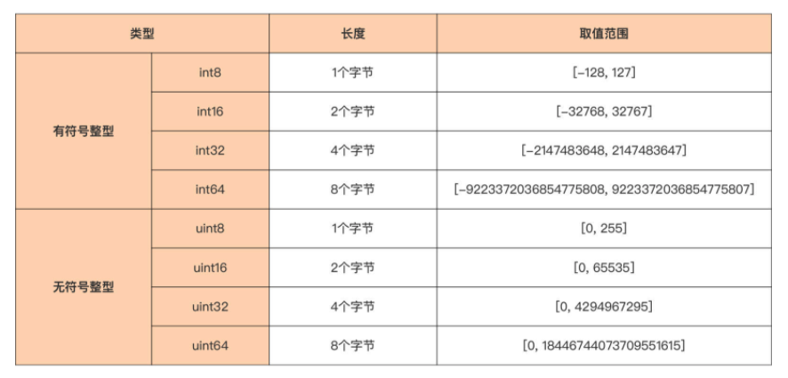
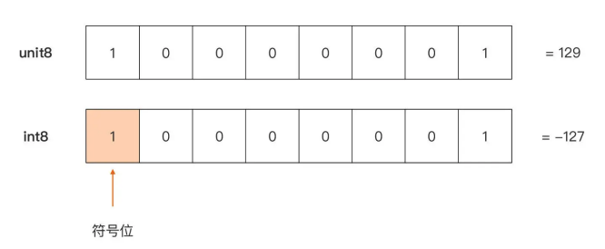
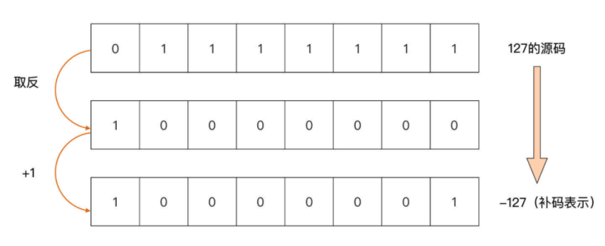
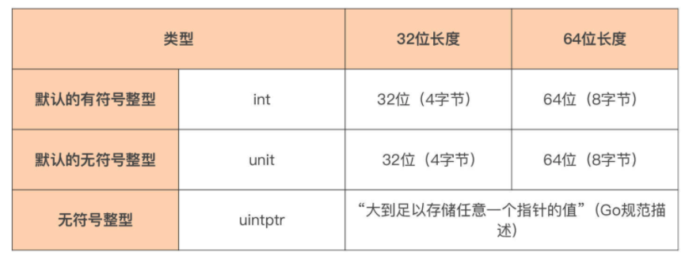
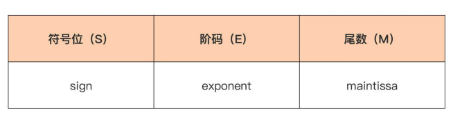
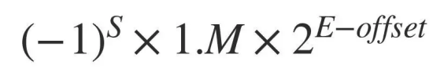
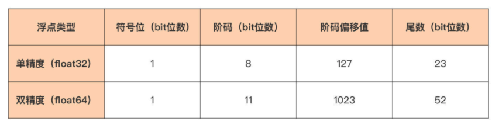
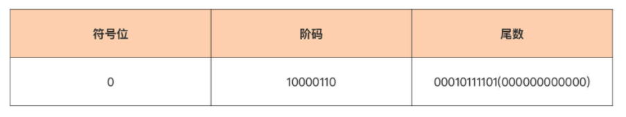
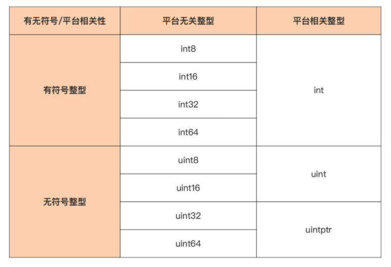

# Go Language Type

> Go 语言类型 之 基本数据类型。

变量所绑定的内存区域应该有明确的边界，而这个边界信息呢，是由变量的类型赋予的。

那么，深入讲解 Go 语言类型。 对 Go 这样的静态编程语言来说，类型是十分重要的。因为它不仅是静态语言编译器的要求，更是对现实事物进行抽象的基础。

## Go 语言类型

Go 语言的类型大体可分为**基本数据类型、复合数据类型和接口类型**这三种。

其中，日常 Go 编码中使用最多的就是基本数据类型，而基本数据类型中使用占比最大的又是数值类型。

 那么，就先来讲数值类型。Go 语言原生支持的数值类型包括整型、浮点型以及复数类型，它们适用于不同的场景。

## 整型 

Go 语言的整型，主要用来表示现实世界中整型数量，比如：人的年龄、班级人数等。

它可 以分为**平台无关整型**和**平台相关整型**这两种，它们的区别主要就在，这些整数类型在不同 CPU 架构或操作系统下面，它们的长度是否是一致的。 

### 平台无关整型

先来看平台无关整型，它们在任何 CPU 架构或任何操作系统下面，长度都是固定不变的。

在下面这张表中总结了 Go 提供的平台无关整型：



这些平台无关的整型也可以分成两类：**有符号整型（int8~int64）和无符号整型（uint8~uint64）**。

两者的本质差别在于**最高二进制位（bit 位）**是否被解释为符号位，这点会影响到无符号整型与有符号整型的取值范围。 

以下图中的这个 8 比特（一个字节）的整型值为例，当它被解释为无符号整型 uint8 时，和它被解释为有符号整型 int8 时表示的值是不同的：



在同样的比特位表示下，

- 当最高比特位被解释为符号位时，它代表一个有符号整型 （int8），它表示的值为 -127；
- 当最高比特位不被解释为符号位时，它代表一个无符号整 型 (uint8)，它表示的值为 129。 

这里可能就会问了：即便最高比特位被解释为符号位，上面的有符号整型所表示值也应该为 -1 啊，怎么会是 -127 呢？ 

- 这是因为 Go 采用 **2 的补码（Two’s Complement）**作为整型的比特位编码方法。
- 因此，不能简单地将最高比特位看成负号，把其余比特位表示的值看成负号后面的数值。
- Go 的补码是通过原码逐位取反后再加 1 得到的，比如，以 -127 这个值为例，它的**补码转换过程**就是这样的：（这里其实没有很理解！）
  - 

### 平台相关整型

平台相关整型，它们的长度会根据运行平台的改变而改变。

Go 语言原生提供了三个平台相关整型，它们是 int、uint 与 uintptr，同样也列了一张表：



在这里要特别注意一点，由于这三个类型的长度是平台相关的，所以在编写有移植性要求的代码时，千万不要强依赖这些类型的长度。

如果不知道这三个类型在目标运行平台上的长度，可以通过 **unsafe 包提供的 SizeOf 函数**来获取，比如在 x86-64 平台上，它们的长度均为 8：

```go
package main

import (
   "fmt"
   "unsafe"
)

func main() {
   var a, b = int(5), uint(6)
   var p uintptr = 0x12345678

   fmt.Println("signed integer a's length is", unsafe.Sizeof(a))   // 8
   fmt.Println("unsigned integer b's length is", unsafe.Sizeof(b)) // 8
   fmt.Println("uintptr's length is", unsafe.Sizeof(p))            // 8
}
```

现在已经搞清楚 Go 语言中整型的分类和长度了，但是在使用整型的过程中，还会遇到一个常见问题：整型溢出。 

### 整型的溢出问题 

无论哪种整型，都有它的取值范围，也就是有它可以表示的值边界。

如果这个整型因为参与某个运算，导致结果超出了这个整型的值边界，就说发生了整型溢出的问题。

由于整型无法表示它溢出后的那个“结果”，所以出现溢出情况后，对应的整型变量的值依然会落到它的取值范围内，只是**结果值与预期不符**，导致程序逻辑出错。

比如这就是一个无符号整型与一个有符号整型的溢出情况：

```go
package main

import "fmt"

func main() {
   var s int8 = 127
   s += 1
   // 预期 128，实际结果 -128
   fmt.Println(s)

   var u uint8 = 1
   u -= 2
   // 预期 -1，实际结果 255
   fmt.Println(u)
}
```

- 有符号整型变量 s 初始值为 127，在加 1 操作后，预期得到 128，但由于 128 超出了 int8 的取值边界，其实际结果变成了 -128。
- 无符号整型变量 u 也是一样的道理， 它的初值为 1，在进行减 2 操作后，预期得到 -1，但由于 -1 超出了 uint8 的取值边界，它的实际结果变成了 255。 

这个问题**最容易发生在循环语句的结束条件判断中**，因为这也是经常使用整型变量的地方。

无论无符号整型，还是有符号整型都存在溢出的问题，所以要十分小心地选择参与循环语句结束判断的整型变量类型，以及与之比较的边界值。 

在了解了整型的这些基本信息后，再来看看整型支持的不同进制形式的字面值，以及如何输出不同进制形式的数值。 

### 数值字面值

Go 语言在设计开始，就继承了 C 语言关于**数值字面值（Number Literal）**的语法形式。 

早期 Go 版本支持十进制、八进制、十六进制的数值字面值形式，比如：

```go
// 早期 go 版本
a := 53        // 十进制
b := 0700      // 八进制，以"0"为前缀
c1 := 0xaabbcc // 十六进制，以"0x"为前缀
c2 := 0Xddeeff // 十六进制，以"0X"为前缀
```

Go 1.13 版本中，Go 又增加了对二进制字面值的支持和两种八进制字面值的形式，比如：

```go
// go 1.13 版本
d1 := 0b10000001 // 二进制，以"0b"为前缀
d2 := 0B10000001 // 二进制，以"0B"为前缀
e1 := 0o700      // 八进制，以"0o"为前缀
e2 := 0O700      // 八进制，以"0O"为前缀
```

为提升字面值的可读性，Go 1.13 版本还支持在字面值中增加**数字分隔符“_”**，分隔符可以用来将数字分组以提高可读性。

比如每 3 个数字一组，也可以用来分隔前缀与字面值中的第一个数字：

```go
// 数字分隔符 '_'
a := 5_3_7        // 十进制: 537
b := 0b_1000_0111 // 二进制位表示为10000111
c1 := 0_700       // 八进制: 0700
c2 := 0o_700      // 八进制: 0700
d1 := 0x_5c_6d    // 十六进制：5c6d
```

这里要注意一下，Go 1.13 中增加的二进制字面值以及数字分隔符，只在 **go.mod 中的 go version 指示字段为 Go 1.13 以及以后版本**的时候，才会生效，否则编译器会报错。

### 格式化输出

反过来，也可以通过标准库 fmt 包的格式化输出函数，将一个整型变量输出为不同进制的形式。

比如下面就是将十进制整型值 59，格式化输出为二进制、八进制和十六进制的 代码：

```go
// 格式化输出
var a int8 = 59
fmt.Printf("%b\n", a) // 输出二进制：111011
fmt.Printf("%d\n", a) // 输出十进制：59
fmt.Printf("%o\n", a) // 输出八进制：73
fmt.Printf("%O\n", a) // 输出八进制(带0o前缀)：0o73
fmt.Printf("%x\n", a) // 输出十六进制(小写)：3b
fmt.Printf("%X\n", a) // 输出十六进制(大写)：3B
```


## 浮点型 

和使用广泛的整型相比，浮点型的使用场景就相对聚焦了，主要集中在**科学数值计算、图形图像处理和仿真、多媒体游戏以及人工智能**等领域。

### IEEE 754 标准

要想知道 Go 语言中的浮点类型的二进制表示是怎样的，首先要来了解 **IEEE 754 标准**。 

IEEE 754 是 IEEE 制定的二进制浮点数算术标准，它是 20 世纪 80 年代以来最广泛使用的浮点数运算标准，被许多 CPU 与浮点运算器采用。

现存的大部分主流编程语言，包括 Go 语言，都提供了符合 IEEE 754 标准的浮点数格式与算术运算。 

IEEE 754 标准规定了四种表示浮点数值的方式：**单精度（32 位）、双精度（64 位）、扩展单精度（43 比特以上）与扩展双精度（79 比特以上，通常以 80 位实现）**。

后两种其实很少使用，重点关注前面两个就好了。 

### 浮点型的二进制表示 

Go 语言提供了 float32 与 float64 两种浮点类型，它们分别对应的就是 IEEE 754 中的单精度与双精度浮点数值类型。

不过，这里要注意，Go 语言中没有提供 float 类型。这不像整型那样，Go 既提供了 int16、int32 等类型，又有 int 类型。

换句话说，**Go 提供的浮点类型都是平台无关的**。 

那 float32 与 float64 这两种浮点类型有什么异同点呢？

- 无论是 float32 还是 float64，它们的变量的**默认值都为 0.0**，不同的是它们占用的内存空间大小是不一样的，可以表示的浮点数的范围与精度也不同。

那么浮点数在内存中的二进制表示究竟是怎么样的呢？ 

- 浮点数在内存中的二进制表示（Bit Representation）要比整型复杂得多，IEEE 754 规范给出了在内存中存储和表示一个浮点数的标准形式，见下图：
  - 
  - 浮点数在内存中的二进制表示分三个部分：**符号位、阶码（即经过换算的指数），以及尾数**。
- 这样表示的一个浮点数，它的值等于：
  - 
  - 其中浮点值的符号由符号位决定：当符号位为 1 时，浮点值为负值；当符号位为 0 时，浮点值为正值。公式中 offset 被称为阶码偏移值。

#### 阶码与尾数

首先来看**单精度（float32）与双精度（float64）浮点数在阶码和尾数上的不同**。

这两种浮点数的阶码与尾数所使用的**位数是不一样的**，可以看下 IEEE 754 标准中单精度和双精度浮点数的各个部分的长度规定：



- 单精度浮点类型（float32）为符号位分配了 1 个 bit，为阶码分配了 8 个 bit，剩下的 23 个 bit 分给了尾数。
- 双精度浮点类型，除了符号位的长度与单精度一样之外，其余两个部分的长度都要远大于单精度浮点型，阶码可用的 bit 位数量为 11，尾数则更是拥有了 52 个 bit 位。 

#### 浮点值转换为单精度二进制

接着，再来看前面提到的“阶码偏移值”，用一个例子直观地感受一下。

在这个例子中，来看看如何将一个十进制形式的浮点值 139.8125，转换为 IEEE 754 规定中的那种单精度二进制表示。 

**步骤一**：要把这个**浮点数值的整数部分和小数部分，分别转换为二进制形式**（后缀 d 表示十进制数，后缀 b 表示二进制数）：

- 整数部分：139d => 1000_1011b； 
- 小数部分：0.8125d => 0.1101b（十进制小数转换为二进制可采用“乘 2 取整”的竖式计算）。

这样，原浮点值 139.8125d 进行二进制转换后，就变成 1000_1011.1101b。 

**步骤二**：**移动小数点**，直到整数部分仅有一个 1，也就是 1000_1011.1101b => 1.000_1011_1101b。

看到，为了整数部分仅保留一个 1，小数点向左移了 7 位，这样**指数就为 7**，**尾数为 000_1011_1101b**。

**步骤三**：**计算阶码**。 

IEEE 754 规定不能将小数点移动而得到的指数，直接填到阶码部分，指数到阶码还需要一个转换过程。

对于 float32 的单精度浮点数而言，**阶码 = 指数 + 偏移值**。

偏移值的计算公式为 2^(e-1)-1，其中 e 为阶码部分的 bit 位数，这里为 8，于是单精度浮点数的阶码偏移值就为 2^(8-1)-1 = 127。

这样在这个例子中，阶码 = 7 + 127 = 134d = 1000_0110b。 

float64 的双精度浮点数的阶码计算也是这样的。 

**步骤四**：**将符号位、阶码和尾数填到各自位置**，得到最终浮点数的二进制表示。

尾数位数不足 23 位，可在后面补 0。



这样，最终浮点数 139.8125d 的二进制表示就为 0b_0_10000110_00010111101_000000000000。 

**最后**，再通过 Go 代码输出浮点数 139.8125d 的二进制表示，和前面手工转换 的做一下比对，看是否一致。

```go
package main

import (
   "fmt"
   "math"
)

func main() {
   var f float32 = 139.8125
   bits := math.Float32bits(f)

   fmt.Printf("%b\n", bits) // 1000011000010111101000000000000
}
```

在这段代码中，通过标准库的 math 包，将 float32 转换为整型。

在这种转换过程中，float32 的内存表示是不会被改变的。然后再通过前面提过的整型值的格式化输出，将它以二进制形式输出出来。

运行这个程序，得到下面的结果：

```sh
1000011000010111101000000000000
```

这个值在填上省去的最高位的 0 后，与手工得到的浮点数的二进制表示一模 一样。这就说明手工推导的思路并没有错。

#### 浮点数范围与精度

而且，可以从这个例子中感受到，阶码和尾数的长度决定了浮点类型可以表示的浮点数范围与精度。

因为双精度浮点类型（float64）阶码与尾数使用的比特位数更多，它可以表 示的精度要远超单精度浮点类型，所以在日常开发中，使用双精度浮点类型 （float64）的情况更多，这也是 Go 语言中浮点常量或字面值的默认类型。 

而 float32 由于表示范围与精度有限，经常会给开发者造成一些困扰。比如可能会因为 float32 精度不足，导致输出结果与常识不符。

比如下面这个例子就是这样，f1 与 f2 两个浮点类型变量被两个不同的浮点字面值初始化，但逻辑比较的结果却是两个变量的值相等。

```go
package main

import "fmt"

func main() {
   var f1 float32 = 16777216.0
   var f2 float32 = 16777217.0

   fmt.Println(f1 == f2) // true
}
```

结合前面讲解的浮点类型表示方法， 对这个例子进行分析：

- 分析一：

  - f1 转换成二进制是：1266679808

  - f2 转换成二进制也是：1266679808

  - 这个为什么是相等的，是因为转换成二进制的数据是相等的。

  - ```go
    // 验证为啥不是 false
    bitsf1 := math.Float32bits(f1)
    bitsf2 := math.Float32bits(f2)
    fmt.Printf("%b\n", bitsf1) // 10010111_00000000000000000000000
    fmt.Printf("%b\n", bitsf2) // 10010111_00000000000000000000000
    ```

- 分析二：

  - 16777216.0 = 2^24 = (1+.0) * 2^24，因为 float32 的尾数只有23bit，能够表示的下一个数是 (1+2^(-23))*2^24 = 2^24+2 = 16777218.0
  - 16777217.0 = 2^24 + 1 = (1+2^(-24)) * 2^24，尾数得是2^(-24)，需要24bit才能表示
  - 直观上理解的话，实数是无限的，浮点数的二进制表示是有限的，所以必然有实数是无法用浮点数表示的。
  - 在实数轴上标出浮点数的话，相邻的浮点数之间就存在空洞。而且随着指数的增加，相邻浮点数之间的空洞也会越来越大。
  - 对于 float32 来说，2^24+1是第一个落在这样的空洞上的整数。而从2^25开始，下一个能表示的数就是(1+2^(-23))*2^25 = 2^25 + 4，中间会有3个整数无法表示。
  - 同理，对于 float64 来说第一个无法表示的整数就是2^53+1（因为尾数只有52bit）

看到这里，是不是觉得浮点类型很神奇？和易用易理解的整型相比，浮点类型无论在二进制表示层面，还是在使用层面都要复杂得多。

即便是浮点字面值，有时候也不是一眼就能看出其真实的浮点值是多少的。


### 浮点型的字面值

Go 浮点类型字面值大体可分为两类，一类是**直白地用十进制表示的浮点值**形式。

这一类， 通过字面值就可直接确定它的浮点值，比如：

```go
// 直接用十进制表示的浮点值
3.1415
.15 // 整数部分如果为0，整数部分可以省略不写
81.80
82. // 小数部分如果为0，小数点后的0可以省略不写
```

另一类则是**科学计数法**形式。

采用科学计数法表示的浮点字面值，需要通过一定的**换算**才能确定其浮点值。

而且在这里，科学计数法形式又分为**十进制形式表示**的，和**十六进制形式表示**的两种。 

先来看十进制科学计数法形式的浮点数字面值，这里字面值中的 e/E 代表的幂运算的底数为 10：

```go
// 科学计数法 之 十进制科学计数法形式
6674.28e-2 // 6674.28 * 10^(-2) = 66.742800
.12345E+5  // 0.12345 * 10^5 = 12345.000000
```

接着是十六进制科学计数法形式的浮点数：

```go
// 科学计数法 之 十六进制科学计数法形式
0x2.p10  // 2.0 * 2^10 = 2048.000000
0x1.Fp+0 // 1.9375 * 2^0 = 1.937500
```

这里，要注意，十六进制科学计数法的整数部分、小数部分用的都是十六进制形式， 但指数部分依然是十进制形式，并且字面值中的 p/P 代表的幂运算的底数为 2。 

### 格式化输出

知道了浮点型的字面值后，和整型一样，fmt 包也提供了针对浮点数的格式化输出。

最常使用的格式化输出形式是 %f。通过 %f，可以输出浮点数最直观的原值形式。

```go
var f float64 = 123.45678
fmt.Printf("%f\n", f) // 123.456780
```

也可以将浮点数输出为科学计数法形式，如下面代码：

```go
// 科学计数法形式输出
fmt.Printf("%e\n", f) // 1.234568e+02
fmt.Printf("%x\n", f) // 0x1.edd3be22e5de1p+06
```

其中 %e 输出的是十进制的科学计数法形式，而 %x 输出的则是十六进制的科学计数法形式。 


## 复数类型 

数学课本上将形如 z=a+bi（a、b 均为实数，a 称为实部，b 称为虚部）的数称为复数， 这里也可以这么理解。

相比 C 语言直到采用 C99 标准，才在 complex.h 中引入了对复数类型的支持，Go 语言则原生支持复数类型。

不过，和整型、浮点型相比，复数类型在 Go 中的应用就更为局限和小众，主要用于**专业领域的计算，比如矢量计算**等。

Go 提供两种复数类型，它们分别是 c**omplex64 和 complex128**，complex64 的实部与虚部都是 float32 类型，而 complex128 的实部与虚部都是 float64 类型。

如果一个复数没有显示赋予类型，那么它的默认类型为 complex128。 

### 复数类型的字面值

关于复数字面值的表示，其实有三种方法。 

第一种，可以通过**复数字面值直接初始化一个复数类型变量**：

```go
// 复数字面值直接初始化一个复数类型变量
var c = 5 + 6i
var d = 0o123 + .12345e+5i // 83+12345i
```

第二种，Go 还提供了 **complex 函数**，方便创建一个 complex128 类型值：

```go
// 使用 complex 函数
var c = complex(5, 6)             // 5 + 6i
var d = complex(0o123, .12345e+5) // 83+12345i
```

第三种，还可以通过 Go 提供的**预定义的函数 real 和 imag**，来获取一个复数的实部与虚部，返回值为一个浮点类型：

```go
// 使用预定义的函数 real 和 imag
var c = complex(5, 6) // 5 + 6i
r := real(c)          // 5.000000
i := imag(c)          // 6.000000
```

### 格式化输出

至于复数形式的格式化输出的问题，由于 complex 类型的实部与虚部都是浮点类型，所以可以直接运用浮点型的格式化输出方法，来输出复数类型。 


## 创建自定义的数值类型

在原生数值类型不满足对现实世界的抽象的情况下，可能还需要通过 Go 提供的类型定义语法来创建自定义的数值类型。

### type 关键字自定义

如果要通过 Go 提供的类型定义语法，来创建自定义的数值类型，可以通过 **type 关键字**基于原生数值类型来声明一个新类型。 

但是自定义的数值类型，在和其他类型相互赋值时容易**出现一些问题**。下面就来建立 一个名为 MyInt 的新的数值类型看看：

```go
type MyInt int32
```

因为 MyInt 类型的底层类型是 int32，所以它的数值性质与 int32 完全相同，但它们仍然是完全不同的两种类型。

根据 **Go 的类型安全规则**，无法直接让它们相互赋值，或者是把它们放在同一个运算中直接计算，这样编译器就会报错。

```go
// 错误
var m int = 5
var n int32 = 6
var a MyInt = m // 错误：在赋值中不能将m（int类型）作为MyInt类型使用
var a MyInt = n // 错误：在赋值中不能将n（int32类型）作为MyInt类型使用
```

要避免这个错误，需要**借助显式转型**，让赋值操作符左右两边的操作数保持类型一致，像下面代码中这样做：

```go
// 正确，显式转型
var m int = 5
var n int32 = 6
var a MyInt = MyInt(m) // ok
var a MyInt = MyInt(n) // ok
```


### 类型别名（Type Alias）语法自定义

也可以通过 Go 提供的**类型别名（Type Alias）语法**来自定义数值类型。

和上面使用标准 type 语法的定义不同的是，通过类型别名语法定义的新类型与原类型别无二致，可以完全相互替代。

来看下面代码：

```go
// 类型别名语法自定义
type MyInt = int32

var n int32 = 6
var a MyInt = n // ok
```

通过类型别名定义的 **MyInt 与 int32 完全等价**，所以这个时候两种类型就是 同一种类型，不再需要显式转型，就可以相互赋值。


## 小结 

Go 的原生数值类型有三类：整型、浮点型和复数型。 

- 首先，**整数类型**包含的具体类型比较多，这里用一个表格做个总结：
  - 
  - Go 语言中的整型的二进制表示采用 2 的补码形式，一个负数的补码计算方式是 “原码取反加 1”即可。 
  - 另外，学习整型时要特别注意，每个整型都有自己的取值范围和表示边界，一旦超出边界，便会出现溢出问题。溢出问题多出现在循环语句中进行结束条件判断的位置，在选择参与循环语句结束判断的整型变量类型以及比较边界值时要尤其小心。 
- 接下来，讲了 Go 语言实现了 IEEE 754 标准中的浮点类型二进制表示。
  - 在这种表示中，一个浮点数被分为符号位、阶码与尾数三个部分，用一个实例讲解了如何推导出 一个浮点值的二进制表示。
  - 如果理解了那个推导过程，就基本掌握浮点类型了。
  - 虽然在例子中使用的是 float32 类型做的演示，但日常使用中尽量使用 float64，这样不容易出现浮点溢出的问题。
- 复数类型也是基于浮点型实现的，日常使用较少。 
- 最后，还了解了如何利用类型定义语法与类型别名语法创建自定义数值类型。
  - 通过类型定义语法实现的自定义数值类型虽然在数值性质上与原类型是一致的，但它们却是完全不同的类型，不能相互赋值，比如通过显式转型才能避免编译错误。
  - 而通过类型别名创建的新类型则等价于原类型，可以互相替代。


