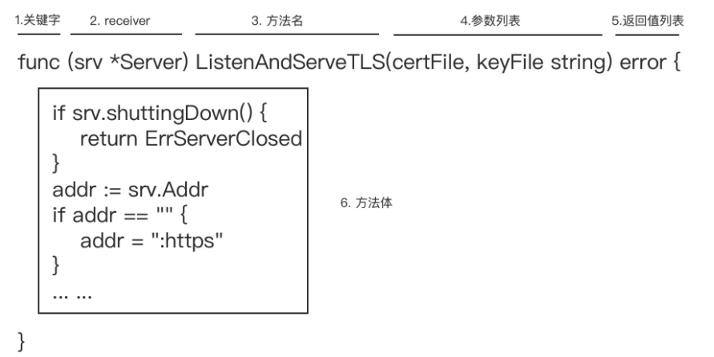

# Go Method

> Go 语言的方法。

函数是 Go 代码中的基本功能逻辑单元，它承载了 Go 程序的所有执行逻辑。可以说，Go 程序的执行流本质上就是在函数调用栈中上下流动，从一个函数到另一个函数。 

Go 语言还有一种语法元素，方法（method），它也可以承载代码逻辑，程序也可以从一个方法流动到另外一个方法。 

系统讲解 Go 语言中的方法，将围绕方法的本质、方法 receiver 的类型选择、方法集合，以及如何实现方法的“继承”这几个主题。 

## Method

### 认识 Go 方法 

Go 语言从设计伊始，就不支持经典的面向对象语法元素，比如类、对象、继 承，等等，但 Go 语言仍保留了名为“方法（method）”的语法元素。

当然，Go 语言中 的方法和面向对象中的方法并不是一样的。Go 引入方法这一元素，并不是要支持面向对象编程范式，而是 Go 践行**组合设计哲学**的一种实现层面的需要。

#### Go 方法的一般形式

简单了解之后，就以 **Go 标准库 net/http 包**中 *Server 类型的方法 ListenAndServeTLS 为例，讲解一下 Go 方法的一般形式：



Go 中方法的声明和函数的声明有很多相似之处，可以参照着来学习。比如，Go 的方法也是以 func 关键字修饰的，并且和函数一样，也包含方法名（对应函数名）、参数列表、返回值列表与方法体（对应函数体）。 

而且，方法中的这几个部分和函数声明中对应的部分，在形式与语义方面都是一致的，比如：方法名字首字母大小写决定该方法是否是导出方法；方法参数列表支持变长参数；方法的返回值列表也支持具名返回值等。

不过，它们也有**不同的地方**。从上面这张图可以看到，和由五个部分组成的函数声明不同，Go 方法的声明有六个组成部分，多的一个就是图中的 **receiver 部分**。

在 receiver 部分声明的参数，Go 称之为 receiver 参数，这个 receiver 参数也是方法与类型之间的纽带，也是方法与函数的最大不同。

#### receiver 参数

Go 中的方法必须是归属于一个类型的，而 receiver 参数的类型就是这个方法归属的类型，或者说这个方法就是这个类型的一个方法。

以上图中的 ListenAndServeTLS 为例，这里的 receiver 参数 srv 的类型为 *Server，那么可以说，这个方法就是 *Server 类型的方法， 注意！这里说的是 ListenAndServeTLS 是 *Server 类型的方法，而不是 Server 类型的方法。

为了方便讲解，将上面例子中的方法声明，转换为一个**方法的一般声明形式**：

```go
func (t *T或T) MethodName(参数列表) (返回值列表) {
  // 方法体
}
```

无论 receiver 参数的类型为 *T 还是 T，都把一般声明形式中的 T 叫做 receiver 参数 t 的基类型。

- 如果 t 的类型为 T，那么说这个方法是类型 T 的一个方法；
- 如果 t 的类型为 *T，那么就说这个方法是类型 *T 的一个方法。

而且，要注意的是，**每个方法只能有一个 receiver 参数**，Go 不支持在方法的 receiver 部分放置包含多个 receiver 参数的参数列表，或者变长 receiver 参数。 

那么，**receiver 参数的作用域**是什么呢？ 

关于函数 / 方法作用域的结论：方法接收器（receiver）参数、函数 / 方法参数，以及返回值变量对应的作用域范围，都是函数 / 方法体对应的显式代码块。

这就意味着，receiver 部分的参数名不能与方法参数列表中的形参名，以及具名返回值中的变量名存在冲突，必须在这个方法的作用域中具有**唯一性**。

如果这个唯一不存在，比如像下面例子中那样，Go 编译器就会报错：

```go
// 参数名与方法参数的形参名重复
type T struct{}

func (t T) M(t string) { // 编译器报错：duplicate argument t (重复声明参数t)
	// ... ...
}
```

不过，如果在方法体中，没有用到 receiver 参数，也可以**省略 receiver 的参数 名**，就像下面这样：

```go
// 省略 receiver 的参数 名
type T struct{}

func (T) M(t string) {
	// ... ...
}
```

仅当方法体中的实现不需要 receiver 参数参与时，才会省略 receiver 参数名，不过这一情况很少使用，了解一下就好了。 

#### receiver 参数的基类型

除了 receiver 参数名字要保证唯一外，Go 语言对 receiver 参数的基类型也有约束，那就是 **receiver 参数的基类型**本身不能为指针类型或接口类型。

下面的例子分别演示了基类型为指针类型和接口类型时，Go 编译器报错的情况：

```go
// receiver 参数的基类型为指针类型
type MyInt *int

func (r MyInt) String() string { // r的基类型为MyInt，编译器报错：invalid receiver type MyInt (MyInt is a pointer type)
   return fmt.Sprintf("%d", *(*int)(r))
}

// receiver 参数的基类型为接口类型
type MyReader io.Reader

func (r MyReader) Read(p []byte) (int, error) { // r的基类型为MyReader，编译器报错：invalid receiver type MyReader (MyReader is an interface type)
   return r.Read(p)
}
```

#### Go 方法声明的位置

最后，Go 对方法声明的位置也是有约束的，Go 要求，**方法声明要与 receiver 参数的基类型声明放在同一个包内**。

基于这个约束，还可以得到两个推论。

第一个推论：**不能为原生类型（诸如 int、float64、map 等）添加方法**。

比如，下面的代码试图为 Go 原生类型 int 增加新方法 Foo，这样做，Go 编译器会报 错：

```go
// 不能为原生类型添加方法
func (i int) Foo() string { // 编译器报错：cannot define new methods on non-local type int
   return fmt.Sprintf("%d", i)
}
```

第二个推论：**不能跨越 Go 包为其他包的类型声明新方法**。

比如，下面的代码试图跨越包边界，为 Go 标准库中的 http.Server 类型添加新方法 Foo，这样做，Go 编译器同样会报错：

```go
// 不能跨越Go包为其他包的类型声明新方法
func (s http.Server) Foo() { // 编译器报错：cannot define new methods on non-local type http.Server
   
}
```

#### 使用 Go 方法

到这里，已经基本了解了 Go 方法的声明形式以及对 receiver 参数的相关约束。有了 这些基础后，就可以看一下如何使用这些方法（method）。 

直接还是通过一个例子理解一下。如果 receiver 参数的基类型为 T，那么说 **receiver 参数绑定在 T** 上，可以通过 *T 或 T 的变量实例调用该方法：

```go
// 使用 Go 方法
type T struct{}

func (t T) M(n int) {
   fmt.Println(n)
}

func main() {
   var t T
   t.M(1) // 通过类型T的变量实例调用方法M
   
   p := &T{}
   p.M(2) // 通过类型*T的变量实例调用方法M
}
```

这段代码中，方法 M 是类型 T 的方法，那为什么通过 *T 类型变量也可以调用 M 方法呢？

从上面这些分析中，也可以看到，和其他主流编程语言相比，Go 语言的方法，只比函数多出了一个 receiver 参数，这就大大降低了 Gopher 们学习方法这一语法元素的门槛。 

但即便如此，在使用方法时可能仍然会有一些疑惑，比如，方法的类型是什么？是否可以将方法赋值给函数类型的变量？调用方法时方法对 receiver 参数的修改是不是外部可见的？

### 方法的本质是什么？

#### 自定义方法

Go 的方法与 Go 中的类型是通过 receiver 联系在一起，可以**为任何非内置原生类型定义方法**，比如下面的类型 T：

```go
// 自定义方法
type T struct {
   a int
}

func (t T) Get() int {
   return t.a
}

func (t *T) Set(a int) int {
   t.a = a
   return t.a
}
```

可以和典型的面向对象语言 C++ 做下对比。

如果了解 C++ 语言，尤其是看过 C++ 大牛、《C++ Primer》作者 Stanley B·Lippman 的大作《深入探索 C++ 对象模型》，大约会知道，C++ 中的对象在调用方法时，编译器会自动传入指向对象自身的 **this 指针**作为方法的第一个参数。 

而 Go 方法中的原理也是相似的，只不过是**将 receiver 参数以第一个参数的身份并入 到方法的参数列表中**。按照这个原理，示例中的类型 T 和 *T 的方法，就可以分别等价转换为下面的普通函数：

```go
// Get 类型T的方法Get的等价函数
func Get(t T) int {
	return t.a
}

// Set 类型*T的方法Set的等价函数
func Set(t *T, a int) int {
	t.a = a
	return t.a
}
```

这种等价转换后的函数的类型就是方法的类型。只不过在 Go 语言中，这种等价转换是由 Go 编译器在编译和生成代码时**自动完成**的。

#### 方法表达式 （Method Expression）

Go 语言规范中还提供了**方法表达式 （Method Expression）**的概念，可以更充分地理解上面的等价转换。 

还以上面类型 T 以及它的方法为例，结合前面说过的 Go 方法的调用方式，可以得到下面代码：

```go
var t T
t.Get()
t.Set(1)
```

可以用另一种方式，把上面的方法调用做一个等价替换：

```go
var t T
T.Get(t)
(*T).Set(&t, 1)
```

这种直接以类型名 T 调用方法的表达方式，被称为 Method Expression。通过 Method Expression 这种形式，类型 T 只能调用 T 的**方法集合（Method Set）**中的方法，同理类型 *T 也只能调用 *T 的方法集合中的方法。

Method Expression 有些类似于 **C++ 中的静态方法（Static Method）**， 

- C++ 中的静态方法在使用时，以该 C++ 类的某个对象实例作为第一个参数，
- 而 Go 语言 的 Method Expression 在使用时，同样以 receiver 参数所代表的类型实例作为第一个参数。 

这种通过 Method Expression 对方法进行调用的方式，与之前所做的方法到函数的等价转换是如出一辙的。

#### 方法的本质是函数

所以，Go 语言中的**方法的本质就是，一个以方法的 receiver 参数作为第一个参数的普通函数。** 

而且，Method Expression 就是 Go 方法本质的最好体现，因为方法自身的类型就是一个普通函数的类型，甚至可以将它作为右值，**赋值给一个函数类型的变量**，比如下面示 例：

```go
func main() {
   var t T
   f1 := (*T).Set                           // f1的类型，也是T类型Set方法的类型：func (t *T, int)int
   f2 := T.Get                              // f2的类型，也是T类型Get方法的类型：func(t T)int
   fmt.Printf("the type of f1 is %T\n", f1) // the type of f1 is func(*main.T, int) int
   fmt.Printf("the type of f2 is %T\n", f2) // the type of f2 is func(main.T) int
   f1(&t, 3)
   fmt.Println(f2(t)) // 3
}
```

既然**方法本质上也是函数**，可能会问：知道方法的本质是函数又怎么样呢？它对在实际编码工作有什么帮助吗？ 

下面就以一个实际例子来看看，如何基于对方法本质的深入理解，来分析解决实际编码工作中遇到的真实问题。

### 巧解难题 

#### 问题

这个例子是来一次真实的读者咨询，问题代码是这样的：

```go
package main

import (
   "fmt"
   "time"
)

type field struct {
   name string
}

func (p *field) print() {
   fmt.Println(p.name)
}

func main() {
   data1 := []*field{{"one"}, {"two"}, {"three"}}
   for _, v := range data1 {
      go v.print()
   }
  
   data2 := []field{{"four"}, {"five"}, {"six"}}
   for _, v := range data2 {
      go v.print()
   }
  
   time.Sleep(3 * time.Second)
}
```

这段代码在多核 macOS 上的运行结果是这样（由于 **Goroutine 调度顺序不同**，运行结果中的行序可能与下面的有差异）：

```sh
one
two
three
six
six
six
```

这位读者的问题显然是：为什么对 data2 迭代输出的结果是三个“six”，而不是 four、 five、six？ 那就来分析一下。 

#### 问题的本质

首先，根据 **Go 方法的本质**，也就是一个以方法的 receiver 参数作为第一个参数的普通函数，**对这个程序做个等价变换**。这里利用 Method Expression 方式，等价变换后的源码如下：

```go
package main

import (
   "fmt"
   "time"
)

type field struct {
   name string
}

func (p *field) print() {
   fmt.Println(p.name)
}

func main() {
   data1 := []*field{{"one"}, {"two"}, {"three"}}
   for _, v := range data1 {
      go (*field).print(v)
   }

   data2 := []field{{"four"}, {"five"}, {"six"}}
   for _, v := range data2 {
      go (*field).print(&v)
   }

   time.Sleep(3 * time.Second)
}
```

这段代码中，把对 field 的方法 print 的调用，替换为 Method Expression 形式，替换前后的程序输出结果是一致的。

但变换后，问题是不是豁然开朗了！可以很清楚地看到**使用 go 关键字启动一个新 Goroutine 时**，method expression 形式的 print 函数是如何绑定参数的：

- 迭代 data1 时，由于 data1 中的元素类型是 field 指针 (\*field)，因此赋值后 v 就是元素地址，与 print 的 receiver 参数类型相同，每次调用 (*field).print 函数时直接传入 v 即可，实际上传入的也是各个 field 元素的地址；
- 迭代 data2 时，由于 data2 中的元素类型是 field（非指针），与 print 的 receiver 参数类型不同，因此需要将其取地址后再传入 (*field).print 函数。这样每次传入的 &v 实际上是变量 v 的地址，而不是切片 data2 中各元素的地址。

在学习 for range 使用时应注意的几个问题，其中**循环变量复用**是关键的一个。这里的 v 在整个 for range 过程中只有一个，因此 data2 迭代完成之后，v 是元素“six”的拷贝。 

这样，一旦启动的各个子 goroutine 在 main goroutine 执行到 Sleep 时才被调度执行， 

- 那么最后的三个 goroutine 在打印 &v 时，实际打印的也就是在 v 中存放的值“six”。
- 而前三个子 goroutine 各自传入的是元素“one”、“two”和“three”的地址，所以打印 的就是“one”、“two”和“three”了。 

#### 解决问题

那么**原程序要如何修改**，才能让它按期望，输 出“one”、“two”、“three”、“four”、 “five”、“six”呢？ 

其实，只需要将 field 类型 print 方法的 receiver 类型由 *field 改为 field 就可以了。 直接来看一下**修改后的代码**：

```go
package main

import (
   "fmt"
   "time"
)

type field struct {
   name string
}

func (p field) print() {
   fmt.Println(p.name)
}

func main() {
   data1 := []*field{{"one"}, {"two"}, {"three"}}
   for _, v := range data1 {
      go v.print()
   }

   data2 := []field{{"four"}, {"five"}, {"six"}}
   for _, v := range data2 {
      go v.print()
   }
   
   time.Sleep(3 * time.Second)
}
```

修改后的程序的输出结果是这样的（因 Goroutine 调度顺序不同，在结果输出顺序可能会有不同）：

```sh
one
six
three
two
five
four
```

为什么这回就可以输出预期的值了呢？


### 小结 

Go 语言中除函数之外的、另一种可承载代码执行逻辑的语法元素：方法（method）。 

Go 提供方法这种语法，并非出自对经典面向对象编程范式支持的考虑，而是出自 Go 的组合设计哲学下类型系统实现层面上的需要。 

Go 方法在声明形式上相较于 Go 函数多了一个 receiver 组成部分，这个部分是方法与类型之间联系的纽带。可以在 receiver 部分声明 receiver 参数。但 Go 对 receiver 参数有诸多限制，比如只能有一个、参数名唯一、不能是变长参数等等。 

除此之外，Go 对 receiver 参数的基类型也是有约束的，即基类型本身不能是指针类型或接口类型。Go 方法声明的位置也受到了 Go 规范的约束，方法声明必须与 receiver 参数的基类型在同一个包中。 

Go 方法本质上其实是一个函数，这个函数以方法的 receiver 参数作为第一个参数，Go 编译器会在进行方法调用时协助进行这样的转换。牢记并理解方法的这个本质可以在实际编码中解决一些奇怪的问题。


### 思考题 

在“巧解难题”部分，为啥只需要将 field 类型 print 方法的 receiver 类型，由 *field 改为 field 就可以输出预期的结果了呢？

- 由 \*field 改为 field结果正确的原因是， \*field的方法的第一个参数是*field， 这个对于[]\*field数组直接传入成员就可以了， 而对于[]field数组， 则是要取地址，也就是指针。 但是这个指针指的是for range 循环的局部变量的地址， 这个地址在for 循环中是不变的， 在for循环结束后这个地址就指向了最后一个元素， goroutine 真正实行打印的引用的地址是局部变量的地址， 自然只会打印最后一个元素了

- 使用 field 的方法， 不涉及引用， 传参都是拷贝复制

- 基于方法的本质，进行解决问题后的源码转换，得：

- ```go
  package main
  
  import (
     "fmt"
     "time"
  )
  
  type field struct {
     name string
  }
  
  func (p field) print() {
     fmt.Println(p.name)
  }
  
  func main() {
     data1 := []*field{{"one"}, {"two"}, {"three"}}
     for _, v := range data1 {
        go field.print(*v)
     }
  
     data2 := []field{{"four"}, {"five"}, {"six"}}
     for _, v := range data2 {
        go field.print(v)
     }
  
     time.Sleep(3 * time.Second)
  }
  ```

  


