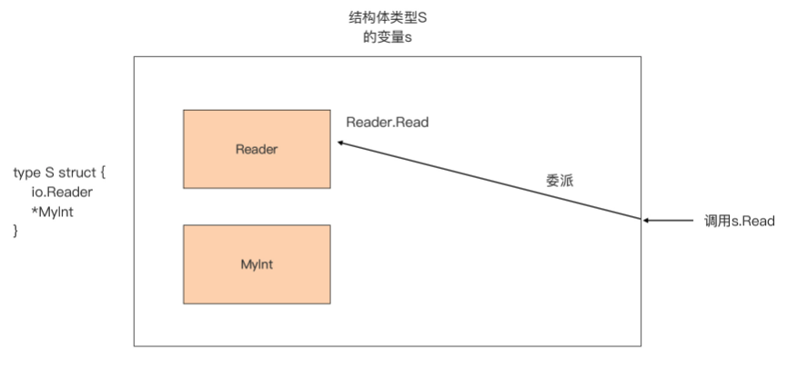

# Go Method

> Go 语言的方法。

函数是 Go 代码中的基本功能逻辑单元，它承载了 Go 程序的所有执行逻辑。可以说，Go 程序的执行流本质上就是在函数调用栈中上下流动，从一个函数到另一个函数。 

Go 语言还有一种语法元素，方法（method），它也可以承载代码逻辑，程序也可以从一个方法流动到另外一个方法。 

系统讲解 Go 语言中的方法，将围绕方法的本质、方法 receiver 的类型选择、方法集合，以及如何实现方法的“继承”这几个主题。 

## Method

### 认识 Go 方法 

Go 语言从设计伊始，就不支持经典的面向对象语法元素，比如类、对象、继 承，等等，但 Go 语言仍保留了名为“方法（method）”的语法元素。

当然，Go 语言中 的方法和面向对象中的方法并不是一样的。Go 引入方法这一元素，并不是要支持面向对象编程范式，而是 Go 践行**组合设计哲学**的一种实现层面的需要。

#### Go 方法的一般形式

简单了解之后，就以 **Go 标准库 net/http 包**中 *Server 类型的方法 ListenAndServeTLS 为例，讲解一下 Go 方法的一般形式：


Go 中方法的声明和函数的声明有很多相似之处，可以参照着来学习。比如，Go 的方法也是以 func 关键字修饰的，并且和函数一样，也包含方法名（对应函数名）、参数列表、返回值列表与方法体（对应函数体）。 

而且，方法中的这几个部分和函数声明中对应的部分，在形式与语义方面都是一致的，比如：方法名字首字母大小写决定该方法是否是导出方法；方法参数列表支持变长参数；方法的返回值列表也支持具名返回值等。

不过，它们也有**不同的地方**。从上面这张图可以看到，和由五个部分组成的函数声明不同，Go 方法的声明有六个组成部分，多的一个就是图中的 **receiver 部分**。

在 receiver 部分声明的参数，Go 称之为 receiver 参数，这个 receiver 参数也是方法与类型之间的纽带，也是方法与函数的最大不同。

#### receiver 参数

Go 中的方法必须是归属于一个类型的，而 receiver 参数的类型就是这个方法归属的类型，或者说这个方法就是这个类型的一个方法。

以上图中的 ListenAndServeTLS 为例，这里的 receiver 参数 srv 的类型为 *Server，那么可以说，这个方法就是 *Server 类型的方法， 注意！这里说的是 ListenAndServeTLS 是 *Server 类型的方法，而不是 Server 类型的方法。

为了方便讲解，将上面例子中的方法声明，转换为一个**方法的一般声明形式**：

```go
func (t *T或T) MethodName(参数列表) (返回值列表) {
  // 方法体
}
```

无论 receiver 参数的类型为 *T 还是 T，都把一般声明形式中的 T 叫做 receiver 参数 t 的基类型。

- 如果 t 的类型为 T，那么说这个方法是类型 T 的一个方法；
- 如果 t 的类型为 *T，那么就说这个方法是类型 *T 的一个方法。

而且，要注意的是，**每个方法只能有一个 receiver 参数**，Go 不支持在方法的 receiver 部分放置包含多个 receiver 参数的参数列表，或者变长 receiver 参数。 

那么，**receiver 参数的作用域**是什么呢？ 

关于函数 / 方法作用域的结论：方法接收器（receiver）参数、函数 / 方法参数，以及返回值变量对应的作用域范围，都是函数 / 方法体对应的显式代码块。

这就意味着，receiver 部分的参数名不能与方法参数列表中的形参名，以及具名返回值中的变量名存在冲突，必须在这个方法的作用域中具有**唯一性**。

如果这个唯一不存在，比如像下面例子中那样，Go 编译器就会报错：

```go
// 参数名与方法参数的形参名重复
type T struct{}

func (t T) M(t string) { // 编译器报错：duplicate argument t (重复声明参数t)
	// ... ...
}
```

不过，如果在方法体中，没有用到 receiver 参数，也可以**省略 receiver 的参数 名**，就像下面这样：

```go
// 省略 receiver 的参数 名
type T struct{}

func (T) M(t string) {
	// ... ...
}
```

仅当方法体中的实现不需要 receiver 参数参与时，才会省略 receiver 参数名，不过这一情况很少使用，了解一下就好了。 

#### receiver 参数的基类型

除了 receiver 参数名字要保证唯一外，Go 语言对 receiver 参数的基类型也有约束，那就是 **receiver 参数的基类型**本身不能为指针类型或接口类型。

下面的例子分别演示了基类型为指针类型和接口类型时，Go 编译器报错的情况：

```go
// receiver 参数的基类型为指针类型
type MyInt *int

func (r MyInt) String() string { // r的基类型为MyInt，编译器报错：invalid receiver type MyInt (MyInt is a pointer type)
   return fmt.Sprintf("%d", *(*int)(r))
}

// receiver 参数的基类型为接口类型
type MyReader io.Reader

func (r MyReader) Read(p []byte) (int, error) { // r的基类型为MyReader，编译器报错：invalid receiver type MyReader (MyReader is an interface type)
   return r.Read(p)
}
```

#### Go 方法声明的位置

最后，Go 对方法声明的位置也是有约束的，Go 要求，**方法声明要与 receiver 参数的基类型声明放在同一个包内**。

基于这个约束，还可以得到两个推论。

第一个推论：**不能为原生类型（诸如 int、float64、map 等）添加方法**。

比如，下面的代码试图为 Go 原生类型 int 增加新方法 Foo，这样做，Go 编译器会报 错：

```go
// 不能为原生类型添加方法
func (i int) Foo() string { // 编译器报错：cannot define new methods on non-local type int
   return fmt.Sprintf("%d", i)
}
```

第二个推论：**不能跨越 Go 包为其他包的类型声明新方法**。

比如，下面的代码试图跨越包边界，为 Go 标准库中的 http.Server 类型添加新方法 Foo，这样做，Go 编译器同样会报错：

```go
// 不能跨越Go包为其他包的类型声明新方法
func (s http.Server) Foo() { // 编译器报错：cannot define new methods on non-local type http.Server
   
}
```

#### 使用 Go 方法

到这里，已经基本了解了 Go 方法的声明形式以及对 receiver 参数的相关约束。有了 这些基础后，就可以看一下如何使用这些方法（method）。 

直接还是通过一个例子理解一下。如果 receiver 参数的基类型为 T，那么说 **receiver 参数绑定在 T** 上，可以通过 *T 或 T 的变量实例调用该方法：

```go
// 使用 Go 方法
type T struct{}

func (t T) M(n int) {
   fmt.Println(n)
}

func main() {
   var t T
   t.M(1) // 通过类型T的变量实例调用方法M
   
   p := &T{}
   p.M(2) // 通过类型*T的变量实例调用方法M
}
```

这段代码中，方法 M 是类型 T 的方法，那为什么通过 *T 类型变量也可以调用 M 方法呢？

从上面这些分析中，也可以看到，和其他主流编程语言相比，Go 语言的方法，只比函数多出了一个 receiver 参数，这就大大降低了 Gopher 们学习方法这一语法元素的门槛。 

但即便如此，在使用方法时可能仍然会有一些疑惑，比如，方法的类型是什么？是否可以将方法赋值给函数类型的变量？调用方法时方法对 receiver 参数的修改是不是外部可见的？

### 方法的本质是什么？

#### 自定义方法

Go 的方法与 Go 中的类型是通过 receiver 联系在一起，可以**为任何非内置原生类型定义方法**，比如下面的类型 T：

```go
// 自定义方法
type T struct {
   a int
}

func (t T) Get() int {
   return t.a
}

func (t *T) Set(a int) int {
   t.a = a
   return t.a
}
```

可以和典型的面向对象语言 C++ 做下对比。

如果了解 C++ 语言，尤其是看过 C++ 大牛、《C++ Primer》作者 Stanley B·Lippman 的大作《深入探索 C++ 对象模型》，大约会知道，C++ 中的对象在调用方法时，编译器会自动传入指向对象自身的 **this 指针**作为方法的第一个参数。 

而 Go 方法中的原理也是相似的，只不过是**将 receiver 参数以第一个参数的身份并入 到方法的参数列表中**。按照这个原理，示例中的类型 T 和 *T 的方法，就可以分别等价转换为下面的普通函数：

```go
// Get 类型T的方法Get的等价函数
func Get(t T) int {
	return t.a
}

// Set 类型*T的方法Set的等价函数
func Set(t *T, a int) int {
	t.a = a
	return t.a
}
```

这种等价转换后的函数的类型就是方法的类型。只不过在 Go 语言中，这种等价转换是由 Go 编译器在编译和生成代码时**自动完成**的。

#### 方法表达式 （Method Expression）

Go 语言规范中还提供了**方法表达式 （Method Expression）**的概念，可以更充分地理解上面的等价转换。 

还以上面类型 T 以及它的方法为例，结合前面说过的 Go 方法的调用方式，可以得到下面代码：

```go
var t T
t.Get()
t.Set(1)
```

可以用另一种方式，把上面的方法调用做一个等价替换：

```go
var t T
T.Get(t)
(*T).Set(&t, 1)
```

这种直接以类型名 T 调用方法的表达方式，被称为 Method Expression。通过 Method Expression 这种形式，类型 T 只能调用 T 的**方法集合（Method Set）**中的方法，同理类型 *T 也只能调用 *T 的方法集合中的方法。

Method Expression 有些类似于 **C++ 中的静态方法（Static Method）**， 

- C++ 中的静态方法在使用时，以该 C++ 类的某个对象实例作为第一个参数，
- 而 Go 语言 的 Method Expression 在使用时，同样以 receiver 参数所代表的类型实例作为第一个参数。 

这种通过 Method Expression 对方法进行调用的方式，与之前所做的方法到函数的等价转换是如出一辙的。

#### 方法的本质是函数

所以，Go 语言中的**方法的本质就是，一个以方法的 receiver 参数作为第一个参数的普通函数。** 

而且，Method Expression 就是 Go 方法本质的最好体现，因为方法自身的类型就是一个普通函数的类型，甚至可以将它作为右值，**赋值给一个函数类型的变量**，比如下面示 例：

```go
func main() {
   var t T
   f1 := (*T).Set                           // f1的类型，也是T类型Set方法的类型：func (t *T, int)int
   f2 := T.Get                              // f2的类型，也是T类型Get方法的类型：func(t T)int
   fmt.Printf("the type of f1 is %T\n", f1) // the type of f1 is func(*main.T, int) int
   fmt.Printf("the type of f2 is %T\n", f2) // the type of f2 is func(main.T) int
   f1(&t, 3)
   fmt.Println(f2(t)) // 3
}
```

既然**方法本质上也是函数**，可能会问：知道方法的本质是函数又怎么样呢？它对在实际编码工作有什么帮助吗？ 

下面就以一个实际例子来看看，如何基于对方法本质的深入理解，来分析解决实际编码工作中遇到的真实问题。

### 巧解难题 

#### 问题

这个例子是来一次真实的读者咨询，问题代码是这样的：

```go
package main

import (
   "fmt"
   "time"
)

type field struct {
   name string
}

func (p *field) print() {
   fmt.Println(p.name)
}

func main() {
   data1 := []*field{{"one"}, {"two"}, {"three"}}
   for _, v := range data1 {
      go v.print()
   }
  
   data2 := []field{{"four"}, {"five"}, {"six"}}
   for _, v := range data2 {
      go v.print()
   }
  
   time.Sleep(3 * time.Second)
}
```

这段代码在多核 macOS 上的运行结果是这样（由于 **Goroutine 调度顺序不同**，运行结果中的行序可能与下面的有差异）：

```sh
one
two
three
six
six
six
```

这位读者的问题显然是：为什么对 data2 迭代输出的结果是三个“six”，而不是 four、 five、six？ 那就来分析一下。 

#### 问题的本质

首先，根据 **Go 方法的本质**，也就是一个以方法的 receiver 参数作为第一个参数的普通函数，**对这个程序做个等价变换**。这里利用 Method Expression 方式，等价变换后的源码如下：

```go
package main

import (
   "fmt"
   "time"
)

type field struct {
   name string
}

func (p *field) print() {
   fmt.Println(p.name)
}

func main() {
   data1 := []*field{{"one"}, {"two"}, {"three"}}
   for _, v := range data1 {
      go (*field).print(v)
   }

   data2 := []field{{"four"}, {"five"}, {"six"}}
   for _, v := range data2 {
      go (*field).print(&v)
   }

   time.Sleep(3 * time.Second)
}
```

这段代码中，把对 field 的方法 print 的调用，替换为 Method Expression 形式，替换前后的程序输出结果是一致的。

但变换后，问题是不是豁然开朗了！可以很清楚地看到**使用 go 关键字启动一个新 Goroutine 时**，method expression 形式的 print 函数是如何绑定参数的：

- 迭代 data1 时，由于 data1 中的元素类型是 field 指针 (\*field)，因此赋值后 v 就是元素地址，与 print 的 receiver 参数类型相同，每次调用 (*field).print 函数时直接传入 v 即可，实际上传入的也是各个 field 元素的地址；
- 迭代 data2 时，由于 data2 中的元素类型是 field（非指针），与 print 的 receiver 参数类型不同，因此需要将其取地址后再传入 (*field).print 函数。这样每次传入的 &v 实际上是变量 v 的地址，而不是切片 data2 中各元素的地址。

在学习 for range 使用时应注意的几个问题，其中**循环变量复用**是关键的一个。这里的 v 在整个 for range 过程中只有一个，因此 data2 迭代完成之后，v 是元素“six”的拷贝。 

这样，一旦启动的各个子 goroutine 在 main goroutine 执行到 Sleep 时才被调度执行， 

- 那么最后的三个 goroutine 在打印 &v 时，实际打印的也就是在 v 中存放的值“six”。
- 而前三个子 goroutine 各自传入的是元素“one”、“two”和“three”的地址，所以打印 的就是“one”、“two”和“three”了。 

#### 解决问题

那么**原程序要如何修改**，才能让它按期望，输 出“one”、“two”、“three”、“four”、 “five”、“six”呢？ 

其实，只需要将 field 类型 print 方法的 receiver 类型由 *field 改为 field 就可以了。 直接来看一下**修改后的代码**：

```go
package main

import (
   "fmt"
   "time"
)

type field struct {
   name string
}

func (p field) print() {
   fmt.Println(p.name)
}

func main() {
   data1 := []*field{{"one"}, {"two"}, {"three"}}
   for _, v := range data1 {
      go v.print()
   }

   data2 := []field{{"four"}, {"five"}, {"six"}}
   for _, v := range data2 {
      go v.print()
   }
   
   time.Sleep(3 * time.Second)
}
```

修改后的程序的输出结果是这样的（因 Goroutine 调度顺序不同，在结果输出顺序可能会有不同）：

```sh
one
six
three
two
five
four
```

为什么这回就可以输出预期的值了呢？


### 小结 

Go 语言中除函数之外的、另一种可承载代码执行逻辑的语法元素：方法（method）。 

Go 提供方法这种语法，并非出自对经典面向对象编程范式支持的考虑，而是出自 Go 的组合设计哲学下类型系统实现层面上的需要。 

Go 方法在声明形式上相较于 Go 函数多了一个 receiver 组成部分，这个部分是方法与类型之间联系的纽带。可以在 receiver 部分声明 receiver 参数。但 Go 对 receiver 参数有诸多限制，比如只能有一个、参数名唯一、不能是变长参数等等。 

除此之外，Go 对 receiver 参数的基类型也是有约束的，即基类型本身不能是指针类型或接口类型。Go 方法声明的位置也受到了 Go 规范的约束，方法声明必须与 receiver 参数的基类型在同一个包中。 

Go 方法本质上其实是一个函数，这个函数以方法的 receiver 参数作为第一个参数，Go 编译器会在进行方法调用时协助进行这样的转换。牢记并理解方法的这个本质可以在实际编码中解决一些奇怪的问题。


### 思考题 

在“巧解难题”部分，为啥只需要将 field 类型 print 方法的 receiver 类型，由 *field 改为 field 就可以输出预期的结果了呢？

- 由 \*field 改为 field结果正确的原因是， \*field的方法的第一个参数是*field， 这个对于[]\*field数组直接传入成员就可以了， 而对于[]field数组， 则是要取地址，也就是指针。 但是这个指针指的是for range 循环的局部变量的地址， 这个地址在for 循环中是不变的， 在for循环结束后这个地址就指向了最后一个元素， goroutine 真正实行打印的引用的地址是局部变量的地址， 自然只会打印最后一个元素了

- 使用 field 的方法， 不涉及引用， 传参都是拷贝复制

- 基于方法的本质，进行解决问题后的源码转换，得：

- ```go
  package main
  
  import (
     "fmt"
     "time"
  )
  
  type field struct {
     name string
  }
  
  func (p field) print() {
     fmt.Println(p.name)
  }
  
  func main() {
     data1 := []*field{{"one"}, {"two"}, {"three"}}
     for _, v := range data1 {
        go field.print(*v)
     }
  
     data2 := []field{{"four"}, {"five"}, {"six"}}
     for _, v := range data2 {
        go field.print(v)
     }
  
     time.Sleep(3 * time.Second)
  }
  ```

  

### Go 方法设计

在 Go 语言中，方法本质上就是函数，所以之前讲解的、关于函数设计的内容对方法也同样适用，比如错误处理设计、针对异常的处理策略、使用 defer 提升简洁性，等等。 

但关于 Go 方法中独有的 receiver 组成部分，却没有现成的、可供我参考的内容。初学者在学习 Go 方法时，最头疼的一个问题恰恰就是如何选择 receiver 参数的 类型。

### receiver 参数类型

#### receiver 参数类型对 Go 方法的影响 

要想为 receiver 参数选出合理的类型，先要了解不同的 receiver 参数类型会对 Go 方法产生怎样的影响。

**Go 方法的本质，是以方法的 receiver 参数作为第一个参数的普通函数**。 

对于函数参数类型对函数的影响，是很熟悉的。那么能不能将方法等价转换为对应的函数，再通过分析 receiver 参数类型对函数的影响，从而**间接**得出它对 Go 方法的影响呢？ 

可以基于这个思路试试看。直接来看下面例子中的两个 Go 方法，以及它们等价转换后的函数：

```go
func (t T) M1() <=> F1(t T)
func (t *T) M2() <=> F2(t *T)
```

这个例子中有方法 M1 和 M2。M1 方法是 receiver 参数类型为 T 的一类方法的代表，而 M2 方法则代表了 receiver 参数类型为 *T 的另一类。下面分别来看看不同的 receiver 参数类型对 M1 和 M2 的影响。

- 首先，当 receiver 参数的类型为 T 时：
  - 当选择以 T 作为 receiver 参数类型时，M1 方法等价转换为F1(t T)。
  - Go 函数的参数采用的是**值拷贝传递**，也就是说，F1 函数体中的 t 是 T 类型实例的一个**副本**。这样，在 F1 函数的实现中对参数 t 做任何修改，都只会影响副本，而不会影响到原 T 类型实例。

据此可以得出结论：当方法 M1 采用类型为 T 的 receiver 参数时，代表 T 类型实例的 receiver 参数以值传递方式传递到 M1 方法体中的，实际上是 T 类型实例的副本，M1 方法体中对副本的任何修改操作，都不会影响到原 T 类型实例。

- 第二，当 receiver 参数的类型为 *T 时：
  - 当选择以 *T 作为 receiver 参数类型时，M2 方法等价转换为F2(t *T)。
  - 同上面分析，传递给 F2 函数的 t 是 T 类型实例的**地址**，这样 F2 函数体中对参数 t 做的任何修改，都会反映到原 T 类型实例上。

据此也可以得出结论：当方法 M2 采用类型为 *T 的 receiver 参数时，代表 *T 类型实例的 receiver 参数以值传递方式传递到 M2 方法体中的，实际上是 T 类型实例的地址，M2 方法体通过该地址可以对原 T 类型实例进行任何修改操作。 

#### receiver 类型对原类型实例的影响

再通过一个更直观的例子，证明一下上面这个分析结果，看一下 Go 方法选择不同的 receiver 类型**对原类型实例的影响**：

```go
package main

type T struct {
   a int
}

func (t T) M1() {
   t.a = 10
}

func (t *T) M2() {
   t.a = 11
}

func main() {
   var t T
   println(t.a) // 0

   t.M1()
   println(t.a) // 0
   
   p := &t
   p.M2()
   println(t.a) // 11
}
```

在这个示例中，为基类型 T 定义了两个方法 M1 和 M2，其中 M1 的 receiver 参数类型为 T，而 M2 的 receiver 参数类型为 *T。M1 和 M2 方法体都通过 receiver 参数 t 对 t 的字段 a 进行了修改。

但运行这个示例程序后，

- 方法 M1 由于使用了 T 作为 receiver 参数类型，它在 方法体中修改的仅仅是 T 类型实例 t 的副本，原实例并没有受到影响。因此 M1 调用后， 输出 t.a 的值仍为 0。 
- 而方法 M2 呢，由于使用了 *T 作为 receiver 参数类型，它在方法体中通过 t 修改的是实例本身，因此 M2 调用后，t.a 的值变为了 11，这些输出结果与前面的分析是一致 的。 

了解了不同类型的 receiver 参数对 Go 方法的影响后，就可以总结一下，日常编码中 选择 receiver 的参数类型的时候，可以参考哪些原则。 

#### 选择 receiver 参数类型的第一个原则 

基于上面的影响分析，可以得到选择 receiver 参数类型的第一个原则：**如果 Go 方法要把对 receiver 参数代表的类型实例的修改，反映到原类型实例上，那么应该选择 *T 作为 receiver 参数的类型**。 

这个原则似乎很好掌握，不过这个时候，可能会有个疑问：如果选择了 *T 作为 Go 方法 receiver 参数的类型，那么是不是只能通过 *T 类型变量调用该方法，而不能通过 T 类型变量调用了呢？

这个问题恰恰也是遗留的一个问题。改造一下上面例子看一下：

```go
package main

type T struct {
   a int
}

func (t T) M1() {
   t.a = 10
}

func (t *T) M2() {
   t.a = 11
}

func main() {
   var t1 T
   println(t1.a) // 0
   t1.M1()
   println(t1.a) // 0
   t1.M2()
   println(t1.a) // 11

   var t2 = &T{}
   println(t2.a) // 0
   t2.M1()
   println(t2.a) // 0
   t2.M2()
   println(t2.a) // 11
}
```

先来看看类型为 T 的实例 t1。

- 看到它不仅可以调用 receiver 参数类型为 T 的方 法 M1，它还可以直接调用 receiver 参数类型为 *T 的方法 M2，并且调用完 M2 方法 后，t1.a 的值被修改为 11 了。 
- 其实，T 类型的实例 t1 之所以可以调用 receiver 参数类型为 *T 的方法 M2，都是 Go 编译器在背后自动进行转换的结果。
- 或者说，t1.M2() 这种用法是 Go 提供的“语法糖”： Go 判断 t1 的类型为 T，也就是与方法 M2 的 receiver 参数类型 *T 不一致后，会自动将 t1.M2()转换为(&t1).M2()。 

同理，类型为 *T 的实例 t2，

- 它不仅可以调用 receiver 参数类型为 *T 的方法 M2，还可以调用 receiver 参数类型为 T 的方法 M1，这同样是因为 Go 编译器在背后做了转换。
- 也就是，Go 判断 t2 的类型为 \*T，与方法 M1 的 receiver 参数类型 T 不一致，就会自动将 t2.M1()转换为(*t2).M1()。 

通过这个实例，知道了这样一个结论：无论是 T 类型实例，还是 *T 类型实例，都既可以调用 receiver 为 T 类型的方法，也可以调用 receiver 为 *T 类型的方法。

这样，在为方法选择 receiver 参数的类型的时候，就不需要担心这个方法不能被与 receiver 参数类型不一致的类型实例调用了。

#### 选择 receiver 参数类型的第二个原则 

前面第一个原则说的是，在方法中对 receiver 参数代表的类型实例进行修改，那就要为 receiver 参数选择 *T 类型，但是如果不需要在方法中对类型实例进行修改呢？

这个时候是为 receiver 参数选择 T 类型还是 *T 类型呢？ 这也得分情况。

一般情况下，通常会**为 receiver 参数选择 T 类型**，因为这样可以缩窄外部修改类型实例内部状态的“接触面”，也就是**尽量少暴露可以修改类型内部状态的方法**。 

不过也有一个例外需要特别注意。

- 考虑到 Go 方法调用时，receiver 参数是以值拷贝的形式传入方法中的。
- 那么，如果 receiver 参数类型的 size 较大，以值拷贝形式传入就会导致**较大的性能开销**，这时选择 *T 作为 receiver 类型可能更好些。 

以上这些可以作为选择 receiver 参数类型的第二个原则。 

#### 方法集合（Method Set）

先了解一个基本概念：方法集合（Method Set）， 它是理解第三条原则的前提。 

##### 方法集合解决的问题

在了解方法集合是什么之前，先通过一个示例，直观了解一下为什么要有方法集合， 它主要用来解决什么问题：

```go
package main

type Interface interface {
   M1()
   M2()
}

type T struct{}

func (t T) M1()  {}
func (t *T) M2() {}

func main() {
   var t T
   var pt *T
   var i Interface
   i = pt
   i = t // cannot use t (type T) as type Interface in assignment: T does not implement Interface (M2 method has pointer receiver)
}
```

在这个例子中，

- 定义了一个接口类型 Interface 以及一个自定义类型 T。
- Interface 接口类型包含了两个方法 M1 和 M2，它们的基类型都是 T，但它们的 receiver 参数类型不同，一个为 T，另一个为 *T。
- 在 main 函数中，分别将 T 类型实例 t 和 *T 类型实例 pt 赋值给 Interface 类型变量 i。 

运行一下这个示例程序，在i = t这一行会得到 Go 编译器的错误提示，**Go 编译器提示：T 没有实现 Interface 类型方法列表中的 M2，因此类型 T 的实例 t 不能赋值给 Interface 变量**。 

为什么 *T 类型的 pt 可以被正常赋值给 Interface 类型变量 i，而 T 类型 的 t 就不行呢？如果说 T 类型是因为只实现了 M1 方法，未实现 M2 方法而不满足 Interface 类型的要求，那么 *T 类型也只是实现了 M2 方法，并没有实现 M1 方法啊？ 

有些事情并不是表面看起来这个样子的。了解方法集合后，这个问题就迎刃而解了。同时，**方法集合也是用来判断一个类型是否实现了某接口类型的唯一手段**，可以说，“方法集合决定了接口实现”。

那么，什么是类型的方法集合呢？ 

- Go 中任何一个类型都有属于自己的方法集合，或者说方法集合是 Go 类型的一个“属性”。但不是所有类型都有自己的方法呀，比如 int 类型就没有。
- 所以，对于没有定义方法的 Go 类型，称其拥有**空方法集合**。 
- 接口类型相对特殊，它只会列出代表接口的方法列表，不会具体定义某个方法，它的方法集合就是它的方法列表中的所有方法，可以一目了然地看到。
- 因此，下面重点讲解的是非接口类型的方法集合。 

##### dumpMethodSet

为了方便查看一个**非接口类型的方法集合**，这里提供了一个函数 dumpMethodSet，用于输出一个非接口类型的方法集合：

```go
func dumpMethodSet(i interface{}) {
   dynTyp := reflect.TypeOf(i)
   if dynTyp == nil {
      fmt.Printf("there is no dynamic type\n")
      return
   }
   n := dynTyp.NumMethod()
   if n == 0 {
      fmt.Printf("%s's method set is empty!\n", dynTyp)
      return
   }
   fmt.Printf("%s's method set:\n", dynTyp)
   for j := 0; j < n; j++ {
      fmt.Println("-", dynTyp.Method(j).Name)
   }
   fmt.Printf("\n")
}
```

下面利用这个函数，试着输出一下 **Go 原生类型以及自定义类型的方法集合**，看下面 代码：

```go
type T struct{}

func (T) M1()  {}
func (T) M2()  {}

func (*T) M3() {}
func (*T) M4() {}

func main() {
   var n int
   dumpMethodSet(n)
   dumpMethodSet(&n)
   
   var t T
   dumpMethodSet(t)
   dumpMethodSet(&t)
}
```

运行这段代码，得到如下结果：

```sh
int's method set is empty!
*int's method set is empty!
main.T's method set:
- M1
- M2

*main.T's method set:
- M1
- M2
- M3
- M4
```

可以看到：

- 以 int、*int 为代表的 Go 原生类型由于没有定义方法，所以它们的方法集合都是空的。
- 自定义类型 T 定义了方法 M1 和 M2，因此它的方法集合包含了 M1 和 M2，也符合预期。
- 但 \*T 的方法集合中除了预期的 M3 和 M4 之外，居然还包含了类型 T 的方 法 M1 和 M2！ 不过，这里程序的输出并没有错误。 

这是因为，Go 语言规定，***T 类型的方法集合包含所有以 *T 为 receiver 参数类型的方法，以及所有以 T 为 receiver 参数类型的方法**。这就是这个示例中为何 *T 类型的方法集合包含四个方法的原因。 

##### 验证方法集合

这个时候，是不是也找到了前面那个示例中为何i = pt没有报编译错误的原因了呢？

同样可以使用 dumpMethodSet 工具函数，输出一下那个例子中 pt 与 t 各自所属类型 的方法集合：

```go
package main

import (
   "fmt"
   "reflect"
)

// 输出方法集合，确定问题

type Interface interface {
   M1()
   M2()
}

type T struct{}

func (t T) M1()  {}
func (t *T) M2() {}

func dumpMethodSet(i interface{}) {
   dynTyp := reflect.TypeOf(i)
   if dynTyp == nil {
      fmt.Printf("there is no dynamic type\n")
      return
   }
   n := dynTyp.NumMethod()
   if n == 0 {
      fmt.Printf("%s's method set is empty!\n", dynTyp)
      return
   }
   fmt.Printf("%s's method set:\n", dynTyp)
   for j := 0; j < n; j++ {
      fmt.Println("-", dynTyp.Method(j).Name)
   }
   fmt.Printf("\n")
}

func main() {
   var t T
   var pt *T
   dumpMethodSet(t)
   dumpMethodSet(pt)
}
```

运行上述代码，得到如下结果：

```sh
main.T's method set:
- M1

*main.T's method set:
- M1
- M2
```

通过这个输出结果，可以一目了然地看到 T、*T 各自的方法集合。 

- T 类型的方法集合中只包含 M1，没有 Interface 类型方法集合中的 M2 方法， 这就是 Go 编译器认为变量 t 不能赋值给 Interface 类型变量的原因。 
- 在输出的结果中，还看到 \*T 类型的方法集合除了包含它自身定义的 M2 方法外，还包含了 T 类型定义的 M1 方法，*T 的方法集合与 Interface 接口类型的方法集合是一样的， 因此 pt 可以被赋值给 Interface 接口类型的变量 i。 

到这里，已经知道了所谓的**方法集合决定接口实现**的含义就是：

- 如果某类型 T 的方法集合与某接口类型的方法集合相同，或者类型 T 的方法集合是接口类型 I 方法集合的超集，那么就说这个类型 T 实现了接口 I。
- 或者说，方法集合这个概念在 Go 语言中的主要用途，就是用来判断某个类型是否实现了某个接口。 

有了方法集合的概念做铺垫，选择 receiver 参数类型的第三个原则已经呼之欲出了。

#### 选择 receiver 参数类型的第三个原则 

这个原则的选择依据就是 **T 类型是否需要实现某个接口**。 

- 如果 T 类型需要实现某个接口，那就要使用 T 作为 receiver 参数的类型，来满足接口类型方法集合中的所有方法。
- 如果 T 不需要实现某一接口，但 \*T 需要实现该接口，那么根据方法集合概念，*T 的方法集合是包含 T 的方法集合的，这样在确定 Go 方法的 receiver 的类型时，参考原则一 和原则二就可以了。 

如果说前面的两个原则更多聚焦于类型内部，从单个方法的实现层面考虑，那么这第三个原则是更多从全局的设计层面考虑，聚焦于这个类型与接口类型间的耦合关系。


### 小结 

Go 方法本质上也是函数。所以 Go 方法设计的多数地方，都可以借鉴函数设计的相关内容。唯独 Go 方法的 receiver 部分，是没有现成经验可循的。

如何为 Go 方法的 receiver 参数选择类型。 

- 先了解了不同类型的 receiver 参数对 Go 方法行为的影响，这是进行 receiver 参 数选型的前提。 
- 在这个前提下，提出了 receiver 参数选型的三个经验原则，实际进行 Go 方法设计时，首先应该考虑的是原则三，即 T 类型是否要实现某一接口。 
  - 如果 T 类型需要实现某一接口的全部方法，那么就需要使用 T 作为 receiver 参数的类型来满足接口类型方法集合中的所有方法。 
  - 如果 T 类型不需要实现某一接口，那么就可以参考原则一和原则二来为 receiver 参数选择类型了。
  - 也就是，如果 Go 方法要把对 receiver 参数所代表的类型实例的修改反映到 原类型实例上，那么应该选择 *T 作为 receiver 参数的类型。
  - 否则通常会为 receiver 参数选择 T 类型，这样可以减少外部修改类型实例内部状态的“渠道”。
  - 除非 receiver 参数类型的 size 较大，考虑到传值的较大性能开销，选择 *T 作为 receiver 类型可能更适合。 
- Go 语言中的一个重要概念：方法集合。
  - 它在 Go 语言中的主要用途就是判断某个类型是否实现了某个接口。
  - 方法集合像“胶水”一样，将自定义类型与接口隐式地“粘结”在一起，后面理解带有类型嵌入的类型时还会借助这个概 念。 

### 思考题 

方法集合是一个很重要也很实用的概念， 如果一个类型 T 包含两个方法 M1 和 M2：

```go
type T struct{}

func (T) M1() {}
func (T) M2() {}
```

然后，再使用类型定义语法，又基于类型 T 定义了一个新类型 S：

```go
type S T
```

那么，这个 S 类型包含哪些方法呢？*S 类型又包含哪些方法呢？

- 验证：

  - ```go
    type T struct{}
    
    func (T) M1() {}
    func (T) M2() {}
    
    type S T
    // type S =  T
    
    func main() {
       var t T
       dumpMethodSet(t)
       dumpMethodSet(&t)
       
       var s S
       dumpMethodSet(s)
       dumpMethodSet(&s)
    }
    ```

- 输出：

  - ```sh
    main.T's method set:
    - M1
    - M2
    
    *main.T's method set:
    - M1
    - M2
    
    main.S's method set is empty!
    *main.S's method set is empty!
    ```

- S 类型 和 *S 类型都没有包含方法

- 因为S是新的类型，它不能调用T的方法，必须显示转换之后 才可以调用，所以本身的S或*S类型都不具有任何的方法

- 但是如果用 type S = T 则S和*S类型都包含两个方法。


### 独立的自定义类型

什么是独立的自定义类型呢？就是这个类型的所有方法都是自己显式实现的。

举个例子，自定义类型 T 有两个方法 M1 和 M2，如果 T 是一个独立的自定义类型，在声明类型 T 的 Go 包源码文件中一定可以找到其所有方法的实现代码，比如：

```go
func (T) M1() { ... }
func (T) M2() { ... }
```

难道还有某种自定义类型的方法不是自己显式实现的吗？

当然有！这就是：如何**让某个自定义类型“继承”其他类型的方法实现**。 

不是说过 Go 不支持经典的面向对象编程范式吗？怎么还会有继承这一说法呢？没错！Go 语言从设计伊始，就决定不支持经典面向对象的编程范式与语法元素，所以这里只是借用了“继承”这个词汇而已，说是“继承”，实则依旧是一种**组合的思想**。 

而这种“继承”，是通过 Go 语言的**类型嵌入（Type Embedding）**来实现的。

### 什么是类型嵌入 

类型嵌入指的就是在一个类型的定义中嵌入了其他类型。Go 语言支持两种类型嵌入，分别是接口类型的类型嵌入和结构体类型的类型嵌入。 

#### 接口类型的类型嵌入 

先用一个案例，直观地了解一下什么是接口类型的类型嵌入。虽然现在还没有系统学习接口类型，但已经多次接触了接口类型。

##### 接口类型的类型嵌入定义

**接口类型声明了由一个方法集合代表的接口**，比如下面接口类型 E：

```go
type E interface {
   M1()
   M2()
}
```

这个接口类型 E 的方法集合，包含两个方法，分别是 M1 和 M2，它们组成了 E 这个接口类型所代表的接口。如果某个类型实现了方法 M1 和 M2，就说这个类型实现了 E 所代表的接口。

此时，再定义另外一个接口类型 I，它的方法集合中包含了三个方法 M1、M2 和 M3，如下面代码：

```go
type I interface {
   M1()
   M2()
   M3()
}
```

接口类型 I 方法集合中的 M1 和 M2，与接口类型 E 的方法集合中的方法完全相 同。在这种情况下，可以**用接口类型 E 替代上面接口类型 I 定义中 M1 和 M2**，如下 面代码：

```go
type I interface {
   E
   M3()
}
```

像这种在一个接口类型（I）定义中，嵌入另外一个接口类型（E）的方式，就是接口类型的类型嵌入。 

而且，这个带有类型嵌入的接口类型 I 的定义与上面那个包含 M1、M2 和 M3 的接口类型 I 的定义，是**等价**的。

因此，可以得到一个结论，这种接口类型嵌入的语义就是**新接口类型（如接口类型 I）将嵌入的接口类型（如接口类型 E）的方法集合，并入到自己的方法集合中**。 

到这里可能会问，在接口类型定义中平铺方法列表就好了，为啥要使用类型嵌入方式定义接口类型呢？其实这也是 **Go 组合设计哲学**的一种体现。 

按 Go 语言惯例，Go 中的接口类型中只包含少量方法，并且常常只是一个方法。通过在接口类型中嵌入其他接口类型可以实现**接口的组合**，这也是 Go 语言中基于已有接口类型构建新接口类型的惯用法。

##### Go 标准库的组合应用

在 Go 标准库中可以看到很多这种组合方式的应用，最常见的莫过于 **io 包**中一系列接 口的定义了。

- 比如，io 包的 ReadWriter、ReadWriteCloser 等接口类型就是通过嵌入 Reader、Writer 或 Closer 三个基本的接口类型组合而成的。

- 下面是仅包含单一方法的 io 包 Reader、Writer 和 Closer 的定义：

- ```go
  // io/io.go
  type Reader interface {
     Read(p []byte) (n int, err error)
  }
  
  type Writer interface {
  	Write(p []byte) (n int, err error)
  }
  
  type Closer interface {
  	Close() error
  }
  ```

- 下面的 io 包的 ReadWriter、ReadWriteCloser 等接口类型，通过嵌入上面基本接口类型组合而形成：

- ```go
  // io/io.go
  type ReadWriter interface {
     Reader
     Writer
  }
  
  type ReadCloser interface {
  	Reader
  	Closer
  }
  
  type WriteCloser interface {
  	Writer
  	Closer
  }
  
  type ReadWriteCloser interface {
  	Reader
  	Writer
  	Closer
  }
  ```

##### 嵌入接口类型的约束

不过，这种通过嵌入其他接口类型来创建新接口类型的方式，在 **Go 1.14 版本之前是有约束**的：

- 如果新接口类型嵌入了多个接口类型，这些嵌入的接口类型的方法集合不能有交集，
- 同时嵌入的接口类型的方法集合中的方法名字，也不能与新接口中的其他方法同名。 

比如我们用 **Go 1.12.7 版本**运行下面例子，Go 编译器就会报错：

```go
package main

type Interface1 interface {
	M1()
}

type Interface2 interface {
	M1()
	M2()
}

type Interface3 interface {
	Interface1
	Interface2 // Error: duplicate method M1
}

type Interface4 interface {
	Interface2
	M2() // Error: duplicate method M2
}

func main() {
}
```

具体看一下例子中的两个编译报错：

- 第一个是因为 Interface3 中嵌入的两个接口类型 Interface1 和 Interface2 的方法集合有交集，交集是方法 M1；
- 第二个报错是因为 Interface4 类型中的方法 M2 与嵌入的接口类型 Interface2 的方法 M2 重名。 

但自 Go 1.14 版本开始，Go 语言**去除了这些约束**，使用 Go 1.17 版本运行上面这个 示例就不会得到编译错误了。 

当然，接口类型的类型嵌入比较简单，只要把握好它的语义，也就是“方法集合并 入”就可以了。结构体类型的类型嵌入就要更复杂一些了。 

#### 结构体类型的类型嵌入

##### 基本结构体类型

之前遇到的Go 结构体类型都是类似下面这样的：

```go
type S struct {
   A int
   b string
   c T
   p *P
   _ [10]int8
   F func()
}
```

结构体类型 S 中的每个字段（field）都有唯一的名字与对应的类型，即便是使用空标识符占位的字段，它的类型也是明确的，但这还不是 Go 结构体类型的“完全体”。

##### 带嵌入字段的结构体类型

Go 结构体类型定义还有另外一种形式，那就是带有**嵌入字段（Embedded Field）的结构体定义**。 看下面这个例子：

```go
type T1 int

type t2 struct {
	n int
	m int
}

type I interface {
	M1()
}

type S1 struct {
	T1
	*t2
	I
	a int
	b string
}
```

结构体 S1 定义中有三个“非常规形式”的标识符，分别是 T1、t2 和 I，这三个标识符究竟代表的是什么呢？是字段名还是字段的类型呢？

答案：它们**既代表字段的名字，也代表字段的类型**。分别以这三个标识符为例，说明一下它们的具体含义：

- 标识符 T1 表示字段名为 T1，它的类型为自定义类型 T1； 
- 标识符 t2 表示字段名为 t2，它的类型为自定义结构体类型 t2 的指针类型； 
- 标识符 I 表示字段名为 I，它的类型为接口类型 I。

这种以某个类型名、类型的指针类型名或接口类型名，直接作为结构体字段的方式就叫做结构体的类型嵌入，这些字段也被叫做嵌入字段（Embedded Field）。 

##### 嵌入字段的用法

那么，嵌入字段怎么用呢？它跟普通结构体字段有啥不同呢？结合具体的例子，简单说一下嵌入字段的用法：

```go
package main

import (
   "fmt"
   "io"
   "strings"
)

type MyInt int

func (n *MyInt) Add(m int) {
   *n = *n + MyInt(m)
}

type t struct {
   a int
   b int
}

type S struct {
   *MyInt
   t
   io.Reader
   s string
   n int
}

func main() {
   m := MyInt(17)
   r := strings.NewReader("hello, go")
   s := S{
      MyInt: &m,
      t: t{
         a: 1,
         b: 2,
      },
      Reader: r,
      s:      "demo",
   }
   
   var sl = make([]byte, len("hello, go"))
   s.Reader.Read(sl)
   fmt.Println(string(sl)) // hello, go
   s.MyInt.Add(5)
   fmt.Println(*(s.MyInt)) // 22
}
```

> 在分析这段代码之前，要先明确一点，那就是**嵌入字段的可见性**与嵌入字段的类型的可见性是一致的。如果嵌入类型的名字是**首字母大写**的，那么也就说明这个嵌入字段是可导出的。 

现在来看这个例子。 

- 首先，这个例子中的结构体类型 S 使用了类型嵌入方式进行定义，它有三个嵌入字段 MyInt、t 和 Reader。
  - 为什么第三个嵌入字段的名字为 Reader 而不是 io.Reader？这是因为，Go 语言规定如果结构体使用从其他包导入的类型作为嵌入字段，比如 pkg.T，那么这个嵌入字段的字段名就是 T，代表的类型为 pkg.T。 
- 接下来，再来看结构体类型 S 的变量的初始化。
  - 使用 field:value 方式对 S 类型的变量 s 的各个字段进行初始化。
  - 和普通的字段一样，初始化嵌入字段时，可以直接用嵌入字段名作为 field。 
- 而且，通过变量 s 使用这些嵌入字段时，也可以像普通字段那样直接用变量s+字段选择符.+嵌入字段的名字，比如 s.Reader。
  - 还可以通过这种方式调用嵌入字段的方法， 比如 s.Reader.Read 和 s.MyInt.Add。 
- 这样看起来，嵌入字段的用法和普通字段没啥不同呀？
  - 也不完全是，Go 还是对嵌入字段有 一些约束的。
  - 比如，和 Go 方法的 receiver 的基类型一样，嵌入字段类型的底层类型**不能 为指针类型**。
  - 而且，**嵌入字段的名字在结构体定义也必须是唯一的**，这也意味这如果两个类型的名字相同，它们无法同时作为嵌入字段放到同一个结构体定义中。
  - 不过，这些约束了解一下就可以了，一旦违反，Go 编译器会提示的。 

到这里，嵌入字段在使用上确实和普通字段没有多大差别，那为什么要用嵌入字段这种方式来定义结构体类型呢？。


#### “实现继承”的原理 

将上面例子代码做一下细微改动，如下所示：

```go
package main

import (
   "fmt"
   "io"
   "strings"
)

type MyInt int

func (n *MyInt) Add(m int) {
   *n = *n + MyInt(m)
}

type t struct {
   a int
   b int
}

type S struct {
   *MyInt
   t
   io.Reader
   s string
   n int
}

func main() {
   m := MyInt(17)
   r := strings.NewReader("hello, go")
   s := S{
      MyInt: &m,
      t: t{
         a: 1,
         b: 2,
      },
      Reader: r,
      s:      "demo",
   }

   var sl = make([]byte, len("hello, go"))
   s.Read(sl)
   fmt.Println(string(sl))
   s.Add(5)
   fmt.Println(*(s.MyInt))
}
```

看到这段代码，肯定会有这个疑问：类型 S 也没有定义 Read 方法和 Add 方法啊，这样写会导致 Go 编译器报错的。

运行这段程序，不但没有引发编译器报错，还可以正常运行并输出与前面例子相同的结果！ 

这段代码表示：**Read 方法与 Add 方法就是类型 S 方法集合中的方法**。但是， 这里类型 S 明明没有显式实现这两个方法呀，它是从哪里得到这两个方法的实现的呢？ 

其实，这两个方法就来自结构体类型 S 的两个嵌入字段 Reader 和 MyInt。结构体类型 S**“继承”**了 Reader 字段的方法 Read 的实现，也“继承”了 *MyInt 的 Add 方法的实现。

注意，这里的“继承”用了引号，说明这并不是真正的继承，它只是 Go 语言的一 种“障眼法”。 

- 这种“障眼法”的工作机制是这样的，当通过结构体类型 S 的变量 s 调用 Read 方法时，Go 发现结构体类型 S 自身并没有定义 Read 方法，于是 Go 会查看 S 的嵌入字段对应的类型是否定义了 Read 方法。
- 这个时候，Reader 字段就被找了出来，之后 s.Read 的调用就被转换为 s.Reader.Read 调用。 
- 这样一来，嵌入字段 Reader 的 Read 方法就被提升为 S 的方法，放入了类型 S 的方法集合。
- 同理 *MyInt 的 Add 方法也被提升为 S 的方法而放入 S 的方法集合。
- 从外部来看，这种嵌入字段的**方法的提升**就给了，一种结构体类型 S“继承”了 io.Reader 类型 Read 方法的实现，以及 *MyInt 类型 Add 方法的实现的错觉。 

到这里，就清楚了，嵌入字段的使用的确可以在 Go 中实现方法的“继承”。

#### 组合中的代理模式

类型嵌入这种看似“继承”的机制，实际上是一种组合的思想。 更具体点，它是一种**组合中的代理（delegate）模式**，如下图所示：



S 只是一个代理（delegate），对外它提供了它可以代理的所有方法，如例子中的 Read 和 Add 方法。当外界发起对 S 的 Read 方法的调用后，S 将该调用委派给它内部的 Reader 实例来实际执行 Read 方法。 

当然，嵌入字段的类型不同，自定义结构体类型可以代理的方法就不同，那自定义结构体类型究竟可以代理哪些方法呢？

换个角度说，嵌入字段对结构体的方法集合有哪些影响呢？下面就分情况来看看嵌入不同类型的结构体类型的方法集合中，都包含哪些方法。

### 类型嵌入与方法集合 

在讲解接口类型的类型嵌入时，

- 提到过接口类型的类型嵌入的本质，就是嵌入类型的方法集合并入到新接口类型的方法集合中，并且，接口类型只能嵌入接口类型。
- 而结构体类型对嵌入类型的要求就比较宽泛了，可以是任意自定义类型或接口类型。 

下面就分别看看，在这两种情况下，结构体类型的方法集合会有怎样的变化。依旧借助于 dumpMethodSet 函数来输出各个类型的方法集合。

#### 结构体类型中嵌入接口类型 

##### 结构体类型的方法集合

在结构体类型中嵌入接口类型后，结构体类型的方法集合会发生什么变化呢？通过下面这个例子来看一下：

```go
package main

import (
   "fmt"
   "reflect"
)

func dumpMethodSet(i interface{}) {
   dynTyp := reflect.TypeOf(i)
   if dynTyp == nil {
      fmt.Printf("there is no dynamic type\n")
      return
   }
   n := dynTyp.NumMethod()
   if n == 0 {
      fmt.Printf("%s's method set is empty!\n", dynTyp)
      return
   }
   fmt.Printf("%s's method set:\n", dynTyp)
   for j := 0; j < n; j++ {
      fmt.Println("-", dynTyp.Method(j).Name)
   }
   fmt.Printf("\n")
}

type I interface {
   M1()
   M2()
}

type T struct {
   I
}

func (T) M3() {}

func main() {
   var t T
   var p *T
   dumpMethodSet(t)
   dumpMethodSet(p)
}
```

运行这个示例，会得到以下结果：

```sh
main.T's method set:
- M1
- M2
- M3

*main.T's method set:
- M1
- M2
- M3
```

可以看到，原本结构体类型 T 只带有一个方法 M3，但在嵌入接口类型 I 后，结构体类型 T 的方法集合中又并入了接口类型 I 的方法集合。

并且，由于 *T 类型方法集合包括 T 类型的方法集合，因此无论是类型 T 还是类型 *T，它们的方法集合都包含 M1、M2 和 M3。

于是可以得出一个结论：**结构体类型的方法集合，包含嵌入的接口类型的方法集 合**。

##### 嵌入的多个接口类型存在交集问题

不过有一种情况，要注意一下，那就是当**结构体嵌入的多个接口类型的方法集合存在交集**时，要小心编译器可能会出现的**错误提示**。 

看到这里，可能会问：不是说 Go 1.14 版本解决了嵌入接口类型的方法集合有交集的情况吗？

没错，但那仅限于接口类型中嵌入接口类型，这里说的是在结构体类型中嵌入方法集合有交集的接口类型。 这是什么意思呢？

根据嵌入了其他类型的结构体类型本身是一个代理，在调用其实例所代理的方法时，Go 会首先查看结构体自身是否实现了该方法。 

- 如果实现了，Go 就会优先使用结构体自己实现的方法。
- 如果没有实现，那么 Go 就会查找结构体中的嵌入字段的方法集合中，是否包含了这个方法。
  - 如果多个嵌入字段的方法集合中都包含这个方法，那么就说方法集合存在交集。
  - 这个时候，Go 编译器就会因无法确定究竟使用哪个方法而报错，下面的这个**例子**就演示了这种情况：

```go
package main

// 多个嵌入字段的方法集合中都包含这个方法，有交集

type E1 interface {
   M1()
   M2()
   M3()
}

type E2 interface {
   M1()
   M2()
   M4()
}

type T struct {
   E1
   E2
}

func main() {
   t := T{}
   t.M1()
   t.M2()
}
```

运行这个例子，会得到：

```go
./main.go:24:3: ambiguous selector t.M1
./main.go:25:3: ambiguous selector t.M2
```

Go 编译器给出了错误提示，表示在调用 t.M1 和 t.M2 时，编译器都出现了分歧。

在这个例子中，结构体类型 T 嵌入的两个接口类型 E1 和 E2 的方法集合存在交集，都包含 M1 和 M2，而结构体类型 T 自身呢，又没有实现 M1 和 M2，所以编译器会因无法做出选择而报错。 那怎么解决这个问题呢？

##### 交集问题解决方案

其实有**两种解决方案**。

- 一是，可以消除 E1 和 E2 方法集合存在交集的情况。
- 二是为 T 增加 M1 和 M2 方法的实现，这样的话，编译器便会直接选择 T 自己实现的 M1 和 M2，不会陷入两难境地。

比如，下面的例子演示的就是 T 增加了 M1 和 M2 方法实现的情况：

```go
// 多个嵌入字段的方法集合中都包含这个方法，有交集 解决方案

type E1 interface {
   M1()
   M2()
   M3()
}

type E2 interface {
   M1()
   M2()
   M4()
}

type T struct {
   E1
   E2
}

func (T) M1() { println("T's M1") }
func (T) M2() { println("T's M2") }

func main() {
   t := T{}
   t.M1() // T's M1
   t.M2() // T's M2
}
```

##### 简化单元测试的编写

结构体类型嵌入接口类型在日常编码中有一个妙用，就是可以**简化单元测试的编写**。

由于嵌入某接口类型的结构体类型的方法集合包含了这个接口类型的方法集合，这就意味着， 这个结构体类型也是它嵌入的接口类型的一个实现。

即便结构体类型自身并没有实现这个接口类型的任意一个方法，也没有关系。来看一个直观的例子：

```go
package employee

type Result struct {
   Count int
}

func (r Result) Int() int { return r.Count }

type Rows []struct{}

type Stmt interface {
   Close() error
   NumInput() int
   Exec(stmt string, args ...string) (Result, error)
   Query(args []string) (Rows, error)
}

// 返回男性员工总数

func MaleCount(s Stmt) (int, error) {
   result, err := s.Exec("select count(*) from employee_tab where gender=?", "1")
   if err != nil {
      return 0, err
   }
  
   return result.Int(), nil
}
```

在这个例子中，有一个 employee 包，这个包中的方法 MaleCount，通过传入的 Stmt 接口的实现从数据库获取男性员工的数量。 

现在的任务是要**对 MaleCount 方法编写单元测试代码**。

对于这种依赖外部数据库操作的方法，惯例是使用“**伪对象（fake object）**”来冒充真实的 Stmt 接口实现。 

不过现在有一个**问题**，那就是 Stmt 接口类型的方法集合中有四个方法，而 MaleCount 函数只使用了 Stmt 接口的一个方法 Exec。如果针对每个测试用例所用的伪对象都实现这四个方法，那么这个工作量有些大。 

那么这个时候，怎样快速建立伪对象呢？结构体类型嵌入接口类型便可以实现， 下面是**解决方案**：

```go
package employee

import "testing"

type fakeStmtForMaleCount struct {
   Stmt
}

func (fakeStmtForMaleCount) Exec(stmt string, args ...string) (Result, error) {
   return Result{Count: 5}, nil
}

func TestEmployeeMaleCount(t *testing.T) {
   f := fakeStmtForMaleCount{}
   c, _ := MaleCount(f)
   if c != 5 {
      t.Errorf("want: %d, actual: %d", 5, c)
      return
   }
}
```

为 TestEmployeeMaleCount 测试用例建立了一个 fakeStmtForMaleCount 的伪对象类型，然后在这个类型中嵌入了 Stmt 接口类型。

这样 fakeStmtForMaleCount 就实现 了 Stmt 接口，也实现了快速建立伪对象的目的。接下来只需要为 fakeStmtForMaleCount 实现 MaleCount 所需的 Exec 方法，就可以满足这个测试的要求了。 

那说完了在结构体中嵌入接口类型的情况后，再来看在结构体中嵌入结构体类型会对方法集合产生什么影响。

#### 结构体类型中嵌入结构体类型 

在结构体类型中嵌入结构体类型，为 Gopher 们提供了一种“实现继承”的手段，外部的结构体类型 T 可以“继承”嵌入的结构体类型的所有方法的实现。

并且，无论是 T 类型的变量实例还是 *T 类型变量实例，都可以调用所有“继承”的方法。但这种情况下，带有嵌入类型的新类型究竟“继承”了哪些方法，还要通过下面这个具体的示例来看一下。

```go
package main

import (
   "fmt"
   "reflect"
)

func dumpMethodSet(i interface{}) {
   dynTyp := reflect.TypeOf(i)
   if dynTyp == nil {
      fmt.Printf("there is no dynamic type\n")
      return
   }
   n := dynTyp.NumMethod()
   if n == 0 {
      fmt.Printf("%s's method set is empty!\n", dynTyp)
      return
   }
   fmt.Printf("%s's method set:\n", dynTyp)
   for j := 0; j < n; j++ {
      fmt.Println("-", dynTyp.Method(j).Name)
   }
   fmt.Printf("\n")
}

// 结构体类型中嵌入结构体类型

type T1 struct{}

func (T1) T1M1()   { println("T1's M1") }
func (*T1) PT1M2() { println("PT1's M2") }

type T2 struct{}

func (T2) T2M1()   { println("T2's M1") }
func (*T2) PT2M2() { println("PT2's M2") }

type T struct {
   T1
   *T2
}

func main() {
   t := T{
      T1: T1{},
      T2: &T2{},
   }

   dumpMethodSet(t)
   dumpMethodSet(&t)
}
```

在这个例子中，结构体类型 T 有两个嵌入字段，分别是 T1 和 *T2，根据对结构体的方法集合的讲解，知道 T1 与 *T1、T2 与 *T2 的方法集合是不同的：

- T1 的方法集合包含：T1M1； 
- *T1 的方法集合包含：T1M1、PT1M2； 
- T2 的方法集合包含：T2M1； 
- *T2 的方法集合包含：T2M1、PT2M2。

它们作为嵌入字段嵌入到 T 中后，对 T 和 *T 的方法集合的影响也是不同的。运行一 下这个示例，看一下输出结果：

```sh
main.T's method set:
- PT2M2
- T1M1
- T2M1

*main.T's method set:
- PT1M2
- PT2M2
- T1M1
- T2M1
```

通过输出结果，看到了 T 和 *T 类型的方法集合果然有差别的：

- 类型 T 的方法集合 = T1 的方法集合 + *T2 的方法集合 
- 类型 *T 的方法集合 = *T1 的方法集合 + *T2 的方法集合

这里，尤其要注意 *T 类型的方法集合，它包含的可不是 T1 类型的方法集合，而是 *T1 类型的方法集合。这和结构体指针类型的方法集合包含结构体类型方法集合，是一个道理。 

讲到这里，基于类型嵌入“继承”方法实现的原理，基本都讲清楚了。但不知道会不会还有一点**疑惑**：只有通过类型嵌入才能实现方法“继承”吗？

如果使用**类型声明语法**基于一个已有类型 T 定义一个新类型 NT，那么 NT 是不是可以直接继承 T 的所有方法呢？ 为了解答这个疑惑，继续来看看 defined 类型与 alias 类型是否可以实现方法集合 的“继承”。 

#### defined 类型的方法集合 

Go 语言中，凡**通过类型声明语法声明的类型都被称为 defined 类型**，下面是一些 defined 类型的声明的例子：

```go
package main

type I interface {
   M1()
   M2()
}

type T int

type NT T // 基于已存在的类型T创建新的defined类型NT
type NI I // 基于已存在的接口类型I创建新defined接口类型NI
```

新定义的 defined 类型与原 defined 类型是**不同的类型**，那么它们的方法集合上又会有什么关系呢？新类型是否“继承”原 defined 类型的方法集合呢？ 

这个问题，也要分情况来看。 

- 对于那些基于**接口类型**创建的 defined 的接口类型，它们的方法集合与原接口类型的方法集合是一致的。
- 但对于基于**非接口类型的 defined 类型**创建的非接口类型，通过下面例子来看一下：

```GO
package main

import (
   "fmt"
   "reflect"
)

func dumpMethodSet(i interface{}) {
   dynTyp := reflect.TypeOf(i)
   if dynTyp == nil {
      fmt.Printf("there is no dynamic type\n")
      return
   }
   n := dynTyp.NumMethod()
   if n == 0 {
      fmt.Printf("%s's method set is empty!\n", dynTyp)
      return
   }
   fmt.Printf("%s's method set:\n", dynTyp)
   for j := 0; j < n; j++ {
      fmt.Println("-", dynTyp.Method(j).Name)
   }
   fmt.Printf("\n")
}

type T struct{}

func (T) M1()  {}
func (*T) M2() {}

type T1 T

func main() {
   var t T
   var pt *T
   var t1 T1
   var pt1 *T1

   dumpMethodSet(t)
   dumpMethodSet(t1)
   dumpMethodSet(pt)
   dumpMethodSet(pt1)
}
```

在这个例子中，基于一个 defined 的非接口类型 T 创建了新 defined 类型 T1，并且分别输出 T1 和 *T1 的方法集合来确认它们是否“继承”了 T 的方法集合。 

运行这个示例程序，得到如下结果：

```SH
main.T's method set:
- M1

main.T1's method set is empty!
*main.T's method set:
- M1
- M2

*main.T1's method set is empty!
```

从输出结果上看，新类型 T1 并没有“继承”原 defined 类型 T 的任何一个方法。从逻辑上来说，这也符合 T1 与 T 是两个不同类型的语义。 

基于**自定义非接口类型的 defined 类型的方法集合为空的事实**，也决定了即便原类型实现了某些接口，基于其创建的 defined 类型也没有“继承”这一隐式关联。

也就是说，新 defined 类型要想实现那些接口，仍然需要重新实现接口的所有方法。 

#### alias 类型的方法集合 

那么，基于**类型别名（type alias）定义的新类型**有没有“继承”原类型的方法集合呢？还是来看一个例子：

```go
package main

import (
   "fmt"
   "reflect"
)

func dumpMethodSet(i interface{}) {
   dynTyp := reflect.TypeOf(i)
   if dynTyp == nil {
      fmt.Printf("there is no dynamic type\n")
      return
   }
   n := dynTyp.NumMethod()
   if n == 0 {
      fmt.Printf("%s's method set is empty!\n", dynTyp)
      return
   }
   fmt.Printf("%s's method set:\n", dynTyp)
   for j := 0; j < n; j++ {
      fmt.Println("-", dynTyp.Method(j).Name)
   }
   fmt.Printf("\n")
}

type T struct{}

func (T) M1()  {}
func (*T) M2() {}

type T1 = T

func main() {
   var t T
   var pt *T
   var t1 T1
   var pt1 *T1

   dumpMethodSet(t)
   dumpMethodSet(t1)

   dumpMethodSet(pt)
   dumpMethodSet(pt1)
}
```

这个例子改自之前那个例子，只是将 T1 的定义方式由类型声明改成了类型别名，看一下这个例子的输出结果：

```sh
main.T's method set:
- M1

main.T's method set:
- M1

*main.T's method set:
- M1
- M2

*main.T's method set:
- M1
- M2
```

通过这个输出结果，可以看到，dumpMethodSet 函数甚至都无法识别出“类型别 名”，无论类型别名还是原类型，输出的都是原类型的方法集合。 

由此可以得到一个结论：无论原类型是接口类型还是非接口类型，**类型别名都与原类型拥有完全相同的方法集合**。

### 小结 

类型嵌入分为两种，

- 一种是接口类型的类型嵌入，对于接口类型的类型嵌入只要把握好其语义“方法集合并入”就可以了。
- 另外一种是结构体类型的类型嵌入。

通过在结构体定义中的嵌入字段，可以实现对嵌入类型的方法集合的“继承”。 但这种“继承”并非经典面向对象范式中的那个继承，Go 中的“继承”实际是一种组合， 更具体点是组合思想下代理（delegate）模式的运用，也就是新类型代理了其嵌入类型的所有方法。

当外界调用新类型的方法时，Go 编译器会首先查找新类型是否实现了这个方 法，如果没有，就会将调用委派给其内部实现了这个方法的嵌入类型的实例去执行。 

此外，还要牢记类型嵌入对新类型的方法集合的影响，包括：

- 结构体类型的方法集合包含嵌入的接口类型的方法集合； 
- 当结构体类型 T 包含嵌入字段 E 时，*T 的方法集合不仅包含类型 E 的方法集合，还要包含类型 *E 的方法集合。

最后，基于非接口类型的 defined 类型创建的新 defined 类型不会继承原类型的方法集合，而通过类型别名定义的新类型则和原类型拥有相同的方法集合。 

### 思考题 

下面带有类型嵌入的结构体 S1 与不带类型嵌入的结构体 S2 是否是等价的，如不等价，区别在哪里？

```go
type T1 int

type t2 struct {
   n int
   m int
}

type I interface {
   M1()
}

type S1 struct {
   T1
   *t2
   I
   a int
   b string
}

type S2 struct {
   T1 T1
   t2 *t2
   I  I
   a  int
   b  string
}
```

- S2 不是嵌入的，相当的正常书写的字段，所有没有对应接口的方法集合

- 这两个S1与S2是不等价的，区别是：S1结构体能调用代理嵌入类型的所有方法，S2结构体是没有代理嵌入类型方法。

- 测试程序：

  - ```go
    package main
    
    import (
       "fmt"
       "reflect"
    )
    
    func dumpMethodSet(i interface{}) {
       dynTyp := reflect.TypeOf(i)
       if dynTyp == nil {
          fmt.Printf("there is no dynamic type\n")
          return
       }
       n := dynTyp.NumMethod()
       if n == 0 {
          fmt.Printf("%s's method set is empty!\n", dynTyp)
          return
       }
       fmt.Printf("%s's method set:\n", dynTyp)
       for j := 0; j < n; j++ {
          fmt.Println("-", dynTyp.Method(j).Name)
       }
       fmt.Printf("\n")
    }
    
    type T1 int
    
    type t2 struct {
       n int
       m int
    }
    
    type I interface {
       M1()
    }
    
    type S1 struct {
       T1
       *t2
       I
       a int
       b string
    }
    
    type S2 struct {
       T1 T1
       t2 *t2
       I  I
       a  int
       b  string
    }
    
    func main() {
       var s1 S1
       var ps1 *S1
       var s2 S2
       var ps2 *S2
    
       dumpMethodSet(s1)
       dumpMethodSet(ps1)
       dumpMethodSet(s2)
       dumpMethodSet(ps2)
    }
    ```

- 输出结果：

  - ```sh
    main.S1's method set:
    - M1
    
    *main.S1's method set:
    - M1
    
    main.S2's method set is empty!
    *main.S2's method set is empty!
    ```


