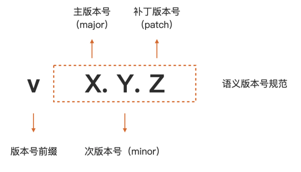
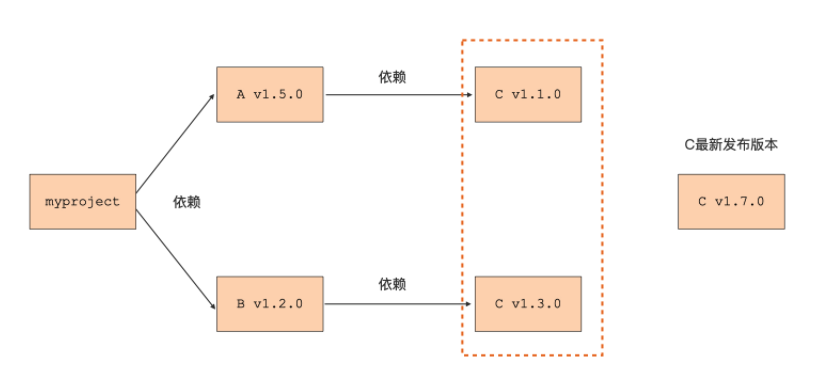
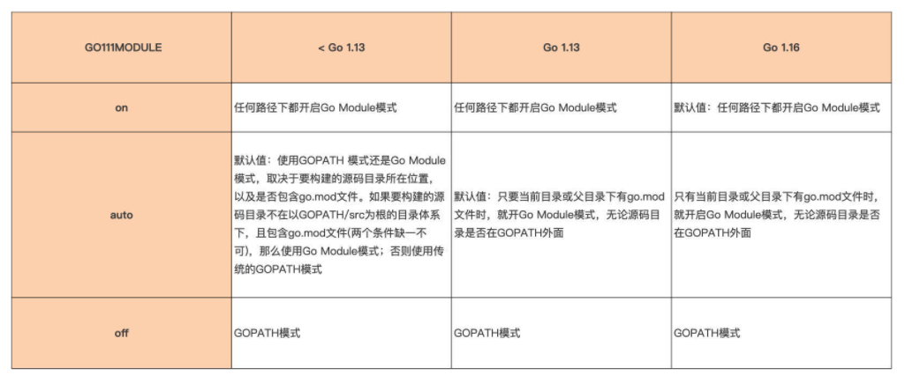

# Go Module

先了解 Go 构建模式演化的前世今生，重点来探讨现在被广泛采用的构建模式，Go Module 的基本概念和应用构建方式。 接着，分析 Go Module 的工作原理。

## Go 构建模式是怎么演化的？ 

Go 程序由 Go 包组合而成的，Go 程序的构建过程就是确定包版本、编译包以及将编译后得到的目标文件链接在一起的过程。

Go 语言的构建模式历经了三个迭代和演化过程，分别是最初期的 GOPATH、1.5 版本的 Vendor 机制，以及现在的 Go Module。

### GOPATH

Go 语言在首次开源时，就内置了一种名为 GOPATH 的构建模式。在这种构建模式下， Go 编译器可以在本地 GOPATH 环境变量配置的路径下，搜寻 Go 程序依赖的第三方包。 如果存在，就使用这个本地包进行编译；如果不存在，就会报编译错误。 

给出一段在 GOPATH 构建模式下编写的代码，先来感受一下：

```go
package main

import "github.com/sirupsen/logrus"

func main() {
   logrus.Println("hello, gopath mode")
}
```

这段代码依赖了第三方包 logrus（logrus 是 Go 社区使用最为广泛的第三方 log 包）。 

接下来，这个构建过程演示了 Go 编译器（这里使用 Go 1.10.8）在 GOPATH 环境变量所配置的目录下（这里为 /Users/tonybai/Go），无法找到程序依赖的 logrus 包而报错的情 况：

```sh
$go1.10.8 build gomodule.go
main.go:3:8: cannot find package "github.com/sirupsen/logrus" in any of:
	/Users/rmliu/sdk/go1.10.8/src/github.com/sirupsen/logrus (from $GOROOT)
	/Users/rmliu/workspace/golang/src/github.com/sirupsen/logrus (from $GOPATH)

# 备注：自行下载 Go 1.10.8 ，参见 install_go.md
```

那么 Go 编译器在 GOPATH 构建模式下，究竟怎么在 GOPATH 配置的路径下搜寻第三 方依赖包呢？ 

为了说清楚搜寻规则，先假定 Go 程序导入了 github.com/user/repo 这个包， 也同时假定当前 GOPATH 环境变量配置的值为：

```sh
export GOPATH=Users/rmliu/sdk/go1.10.8:Users/rmliu/workspace/golang
```

那么在 GOPATH 构建模式下，Go 编译器在编译 Go 程序时，就会在下面两个路径下搜索 第三方依赖包是否存在：

```sh
Users/rmliu/sdk/go1.10.8/src/github.com/user/repo
Users/rmliu/workspace/golang/src/github.com/user/repo
```

这里注意一下，如果没有显式设置 GOPATH 环境变量，Go 会将 GOPATH 设置为默认值，不同操作系统下默认值的路径不同，在 macOS 或 Linux 上，它的默认值是 $HOME/go。 

### go get

那么，当遇到像上面例子一样，没有在本地找到程序的第三方依赖包的情况，该如何 解决这个问题呢？ 

这个时候就要让 go get 登场了！ 

可以通过 go get 命令将本地缺失的第三方依赖包下载到本地，比如：

```sh
$go1.10.8 get github.com/sirupsen/logrus
# $go get github.com/sirupsen/logrus
# 目前这个想法可以实现，但是代码没法运行，已经出现了无法兼容，会报错
```

这里的 go get 命令，不仅能将 logrus 包下载到 GOPATH 环境变量配置的目录下，它还会检查 logrus 的依赖包在本地是否存在，如果不存在，go get 也会一并将它们下载到本地。 

不过，go get 下载的包只是那个时刻各个依赖包的**最新主线版本**，这样会给后续 Go 程序的构建带来一些问题。

- 比如，依赖包持续演进，可能会导致不同开发者在不同时间获取和编译同一个 Go 包时，得到不同的结果，也就是不能保证可重现的构建（Reproduceable Build）。
- 又比如，如果依赖包引入了不兼容代码，程序将无法通过编译。 
- 最后还有一点，如果依赖包因引入新代码而无法正常通过编译，并且该依赖包的作者又没有及时修复这个问题，这种错误也会传导到程序，导致程序无法通过编译。 

也就是说，在 GOPATH 构建模式下，Go 编译器实质上并没有关注 Go 项目所依赖的第三方包的版本。但 Go 开发者希望自己的 Go 项目所依赖的第三方包版本能受到自己的控制，而不是随意变化。

于是 Go 核心开发团队引入了 Vendor 机制试图解决上面的问题。


### Vendor 机制

Go 在 1.5 版本中引入 vendor 机制。

vendor 机制本质上就是在 Go 项目的某个特定目录下，将项目的所有依赖包缓存起来，这个特定目录名就是 vendor。 

Go 编译器会优先感知和使用 vendor 目录下缓存的第三方包版本，而不是 GOPATH 环境变量所配置的路径下的第三方包版本。这样，无论第三方依赖包自己如何变化，无论 GOPATH 环境变量所配置的路径下的第三方包是否存在、版本是什么，都不会影响到 Go 程序的构建。 

如果将 vendor 目录和项目源码一样提交到代码仓库，那么其他开发者下载项目 后，就可以实现可重现的构建。因此，如果使用 vendor 机制管理第三方依赖包，最佳实 践就是将 vendor 一并提交到代码仓库中。 

下面这个目录结构就是为上面的代码示例添加 vendor 目录后的结果：

```sh
.
├── main.go
└── vendor/
    ├── github.com/
    │ 		└── sirupsen/
    │ 				└── logrus/
    └── golang.org/
        └── x/
            └── sys/
                └── unix/
```

在添加完 vendor 后，重新编译 main.go，这个时候 Go 编译器就会在 vendor 目录 下搜索程序依赖的 logrus 包以及后者依赖的 golang.org/x/sys/unix 包了。 

这里要注意一点，要想开启 vendor 机制，**Go 项目必须位于 GOPATH 环境变量配置的某个路径的 src 目录下面**。如果不满足这一路径要求，那么 Go 编译器是不会理会 Go 项目目录下的 vendor 目录的。 

不过 vendor 机制虽然一定程度解决了 Go 程序可重现构建的问题，但对开发者来说，它的体验却不那么好。

- 一方面，Go 项目必须放在 GOPATH 环境变量配置的路径下，庞大的 vendor 目录需要提交到代码仓库，不仅占用代码仓库空间，减慢仓库下载和更新的速度， 而且还会干扰代码评审，对实施代码统计等开发者效能工具也有比较大影响。 
- 另外，还需要手工管理 vendor 下面的 Go 依赖包，包括项目依赖包的分析、版本的记录、依赖包获取和存放，等等，最让开发者头疼的就是这一点。 

为了解决这个问题，Go 核心团队与社区将 Go 构建的重点转移到如何解决包依赖管理上。 

Go 社区先后开发了诸如 gb、glide、dep 等工具，来帮助 Go 开发者对 vendor 下的第三方包进行自动依赖分析和管理，但这些工具也都有自身的问题。 

就在 Go 社区为包依赖管理焦虑并抱怨没有官方工具的时候，Go 核心团队基于社区实践的经验和教训，推出了 Go 官方的解决方案：Go Module。

### Go Module 

从 Go 1.11 版本开始，除了 GOPATH 构建模式外，Go 又增加了一种 Go Module 构建模式。

一个 Go Module 是一个 **Go 包的集合**。

module 是有版本的，所以 module 下的包也就有了版本属性。这个 module 与这些包会组成一个独立的版本单元，它们一起打版本、发布和分发。 

在 Go Module 模式下，通常一个代码仓库对应一个 Go Module。一个 Go Module 的顶层目录下会放置一个 go.mod 文件，每个 go.mod 文件会定义唯一一个 module，也就是说 Go Module 与 go.mod 是一一对应的。 

go.mod 文件所在的顶层目录也被称为 module 的根目录，module 根目录以及它子目录下的所有 Go 包均归属于这个 Go Module，这个 module 也被称为 **main module**。 

先来将上面的例子改造成为一个基于 Go Module 构建模式的 Go 项目。


## 创建一个 Go Module 

将基于当前项目创建一个 Go Module，通常有如下几个步骤： 

- 第一步，通过 go mod init 创建 go.mod 文件，将当前项目变为一个 Go Module； 
- 第二步，通过 go mod tidy 命令自动更新当前 module 的依赖信息； 
- 第三步，执行 go build，执行新 module 的构建。 

### 创建新项目 gomodule

先建立一个新项目 gomodule 用来演示 Go Module 的创建，可以在任 意路径下创建这个项目，不必非要在 GOPATH 环境变量的配置路径下。 

这个项目的 main.go 修改自上面的例子，修改后的 main.go 的代码是这样的，依旧 依赖外部包 logrus：

```sh
package main

import "github.com/sirupsen/logrus"

func main() {
	logrus.Println("hello, go module mode")
}
```

### go mod init

这个项目目录下只有 main.go 一个源文件，现在就来为这个项目添加 Go Module 支持。通过 go mod init 命令为这个项目创建一个 Go Module（这里使用的是 Go 版本为 1.16.5，Go 1.16 版本默认采用 Go Module 构建模式）：

```sh
$go1.16.5 mod init github.com/Kate-liu/GoBeginner/gomodule/gomodule
go: creating new go.mod: module github.com/Kate-liu/GoBeginner/gomodule/gomodule
go: to add module requirements and sums:
	go mod tidy
```

### go.mod

现在，go mod init 在当前项目目录下创建了一个 go.mod 文件，这个 go.mod 文件将当前项目变为了一个 Go Module，项目根目录变成了 module 根目录。go.mod 的内容是这样的：

```go
module github.com/Kate-liu/GoBeginner/gomodule/gomodule

go 1.16
```

这个 go.mod 文件现在处于初始状态，它的第一行内容用于声明 module 路径 (module path)，最后一行是一个 Go 版本指示符，用于表示这个 module 是在某个特定的 Go 版本 的 module 语义的基础上编写的。 

### go mod tidy

go mod init 命令还输出了两行日志，提示可以使用 go mod tidy 命令，添加 module 依赖以及校验和。

go mod tidy 命令会扫描 Go 源码，并自动找出项目依赖的外部 Go Module 以及版本，下载这些依赖并更新本地的 go.mod 文件。

按照这个提示执行一下 go mod tidy 命令：

```sh
$go1.16.5 mod tidy
go: finding module for package github.com/sirupsen/logrus
go: downloading github.com/sirupsen/logrus v1.8.1
go: found github.com/sirupsen/logrus in github.com/sirupsen/logrus v1.8.1
go: downloading golang.org/x/sys v0.0.0-20191026070338-33540a1f6037
go: downloading github.com/stretchr/testify v1.2.2
```

对于一个处于初始状态的 module 而言，go mod tidy 分析了当前 main module 的所有源文件，找出了当前 main module 的所有第三方依赖，确定第三方依赖 的版本，还下载了当前 main module 的直接依赖包（比如 logrus），以及相关间接依赖 包（直接依赖包的依赖，比如上面的 golang.org/x/sys 等）。 

### Go Module 代理服务

Go Module 还支持通过 Go Module 代理服务**加速第三方依赖的下载**。

在 Go 环境安装时，提到过 GOPROXY 环境变量，这个环境变量的默认值为“https: // proxy.golang.org,direct”，可以配置更适合于中国大陆地区的 Go Module 代理服务。 

由 go mod tidy 下载的依赖 module 会被放置在本地的 module 缓存路径下，默认值为 `$GOPATH[0]/pkg/mod`，Go 1.15 及以后版本可以通过 GOMODCACHE 环境变量，自定义本地 module 的缓存路径。 

执行 go mod tidy 后，示例 go.mod 的内容更新如下：

```go
module github.com/Kate-liu/GoBeginner/gomodule/gomodule

go 1.16

require github.com/sirupsen/logrus v1.8.1
```

当前 module 的直接依赖 logrus，还有它的版本信息都被写到了 go.mod 文件的 require 段中。 

### go.sum

而且，执行完 go mod tidy 后，当前项目除了 go.mod 文件外，还多了一个新文件 go.sum，内容是这样的：

```sh
github.com/davecgh/go-spew v1.1.1 h1:vj9j/u1bqnvCEfJOwUhtlOARqs3+rkHYY13jYWTU9
github.com/davecgh/go-spew v1.1.1/go.mod h1:J7Y8YcW2NihsgmVo/mv3lAwl/skON4iLHj
github.com/pmezard/go-difflib v1.0.0 h1:4DBwDE0NGyQoBHbLQYPwSUPoCMWR5BEzIk/f1l
github.com/pmezard/go-difflib v1.0.0/go.mod h1:iKH77koFhYxTK1pcRnkKkqfTogsbg7g
github.com/sirupsen/logrus v1.8.1 h1:dJKuHgqk1NNQlqoA6BTlM1Wf9DOH3NBjQyu0h9+AZ
github.com/sirupsen/logrus v1.8.1/go.mod h1:yWOB1SBYBC5VeMP7gHvWumXLIWorT60ONW
github.com/stretchr/testify v1.2.2 h1:bSDNvY7ZPG5RlJ8otE/7V6gMiyenm9RtJ7IUVIAo
github.com/stretchr/testify v1.2.2/go.mod h1:a8OnRcib4nhh0OaRAV+Yts87kKdq0PP7p
golang.org/x/sys v0.0.0-20191026070338-33540a1f6037 h1:YyJpGZS1sBuBCzLAR1VEpK1
golang.org/x/sys v0.0.0-20191026070338-33540a1f6037/go.mod h1:h1NjWce9XRLGQEsW
```

这同样是由 go mod 相关命令维护的一个文件，它存放了特定版本 module 内容的哈希值。 

这是 Go Module 的一个安全措施。当将来这里的某个 module 的特定版本被再次下载的时候，go 命令会使用 go.sum 文件中对应的哈希值，和新下载的内容的哈希值进行比对， 只有**哈希值比对一致**才是合法的，这样可以确保项目所依赖的 module 内容，不会被恶意或意外篡改。

因此，推荐把 go.mod 和 go.sum 两个文件与源码，一并提交到代码版本控制服务器上。 

### go build

现在，go mod init 和 go mod tidy 已经为当前 Go Module 的构建铺平了道路，接 下来，只需在当前 module 的根路径下，执行 go build 就可以完成 module 的构建 了！ 

go build 命令会读取 go.mod 中的依赖及版本信息，并在本地 module 缓存路径下找到对应版本的依赖 module，执行编译和链接。如果顺利的话，会在当前目录下看到一个新生成的可执行文件 gomodule，执行这个文件我们就能得到正确结果了。 整个过程的执行步骤是这样的：

```sh
$go build

$ls
go.mod go.sum main.go gomodule*

$./gomodule
INFO[0000] hello, go module mode
```

到这里，已经完成了一个有着多个第三方依赖的项目的构建了。

但关于 Go Module 的操作还远不止这些。随着 Go 项目的演进，会在代码中导入新的第三方包，删除一些旧的依赖包，更新一些依赖包的版本等。

那么，在看到 Go Module 机制会自动分析项目的依赖包，并选出最适合的版本后，不知道会不会有这样的疑惑：项目所依赖的包有很多版本，Go Module 是如何选出最适合的那个版本的呢？要想回答这个问题，就需要深入到 Go Module 构建模式 的工作原理中去。


## 深入 Go Module 构建模式 

Go 语言设计者在设计 Go Module 构建模式，来解决“包依赖管理”的问题时，进行了几项创新，这其中就包括语义导入版本 (Semantic Import Versioning)，以及和其他主流语言不同的最小版本选择 (Minimal Version Selection) 等机制。

只要深入理解了这些 机制，就能真正掌握 Go Module 构建模式。 

### Go Module 的语义导入版本机制

在上面的例子中，看到 go.mod 的 require 段中依赖的版本号，都符合 vX.Y.Z 的格 式。

在 Go Module 构建模式下，一个符合 Go Module 要求的版本号，由前缀 v 和一个 满足语义版本规范的版本号组成。 

可以看看下面这张图，语义版本号分成 3 部分：主版本号 (major)、次版本号 (minor) 和补丁版本号 (patch)。例如上面的 logrus module 的版本号是 v1.8.1，这就表示它的主版本号为 1，次版本号为 8，补丁版本号为 1。



Go 命令和 go.mod 文件都使用上面这种符合语义版本规范的版本号，作为描述 Go Module 版本的标准形式。

借助于语义版本规范，Go 命令可以确定同一 module 的两个版本发布的先后次序，而且可以确定它们是否兼容。 

按照语义版本规范，

- 主版本号不同的两个版本是相互不兼容的。
- 而且，在主版本号相同的情况下，次版本号大都是向后兼容次版本号小的版本。
- 补丁版本号也不影响兼容性。 

而且，**Go Module 规定**：**如果同一个包的新旧版本是兼容的，那么它们的包导入路径应该是相同的**。怎么理解呢？

就**以 logrus 为例**，它有很多发布版本，从中选出两个版本 v1.7.0 和 v1.8.1.。按照上面的语义版本规则，这两个版本的主版本号相同，新版本 v1.8.1 是兼容老版本 v1.7.0 的。那么，就可以知道，如果一个项目依赖 logrus，无论它使用的是 v1.7.0 版本还是 v1.8.1 版本，它都可以使用下面的包导入语句导入 logrus 包：

```go
import "github.com/sirupsen/logrus"
```

那么问题又来了，假如在未来的某一天，logrus 的作者发布了 logrus v2.0.0 版本。那么根据语义版本规则，该版本的主版本号为 2，已经与 v1.7.0、v1.8.1 的主版本号不同了， 那么 v2.0.0 与 v1.7.0、v1.8.1 就是不兼容的包版本。

然后再按照 Go Module 的规定，如果一个项目依赖 logrus v2.0.0 版本，那么它的包导入路径就不能再与上面的导入方式相同了。那应该使用什么方式导入 logrus v2.0.0 版本呢？ 

Go Module 创新性地给出了一个方法：**将包主版本号引入到包导入路径中**，可以像下面这样导入 logrus v2.0.0 版本依赖包：

```go
import "github.com/sirupsen/logrus/v2"
```

这就是 Go 的“语义导入版本”机制，也就是说通过在包导入路径中引入主版本号的方 式，来区别同一个包的不兼容版本，这样一来甚至可以同时依赖一个包的两个不兼容 版本：

```go
import (
  "github.com/sirupsen/logrus"
  logv2 "github.com/sirupsen/logrus/v2"
)
```

v0.y.z 版本应该使用哪种导入路径呢？

按照语义版本规范的说法，v0.y.z 这样的版本号是用于项目初始开发阶段的版本号。在这个阶段任何事情都有可能发生，其 API 也不应该被认为是稳定的。

Go Module 将这样的**版本 (v0) 与主版本号 v1 做同等对待**，也就是采用不带主版本号的包导入路径，这样一定程度降低了 Go 开发人员使用这样版本号包时的心智负担。 

Go 语义导入版本机制是 Go Module 机制的基础规则，同样它也是 Go Module 其他规则 的基础。

### Go Module 的最小版本选择原则

在前面的例子中，Go 命令都是在项目初始状态分析项目的依赖，并且项目中两个依赖包之间没有共同的依赖，这样的包依赖关系解决起来还是比较容易的。但依赖关系一旦复杂起 来，比如像下图中展示的这样，Go 又是如何确定使用依赖包 C 的哪个版本的呢？



在这张图中，myproject 有两个直接依赖 A 和 B，A 和 B 有一个共同的依赖包 C，但 A 依赖 C 的 v1.1.0 版本，而 B 依赖的是 C 的 v1.3.0 版本，并且此时 C 包的最新发布版为 C v1.7.0。

这个时候，Go 命令是如何为 myproject 选出间接依赖包 C 的版本呢？选出的究竟是 v1.7.0、v1.1.0 还是 v1.3.0 呢？

#### 最新最大 (Latest Greatest) 版本

其实，当前存在的主流编程语言，以及 Go Module 出现之前的很多 Go 包依赖管理工具都会选择依赖项的“最新最大 (Latest Greatest) 版本”，对应到图中的例子，这个版本就是 v1.7.0。 

当然了，理想状态下，如果语义版本控制被正确应用，并且这种“社会契约”也得到了很好的遵守，那么这种选择算法是有道理的，而且也可以正常工作。在这样的情况下，依赖项的“最新最大版本”应该是最稳定和安全的版本，并且应该有向后兼容性。至少在相同的主版本 (Major Verion) 依赖树中是这样的。 但并不是这样的。

#### 最小版本

Go 设计者另辟蹊径，在诸多兼容性版本间，不光要考虑最新最大的稳定与安全，还要尊重各个 module 的述求：A 明明说只要求 C v1.1.0，B 明明说只要求 C v1.3.0。

所以 Go 会在该项目依赖项的所有版本中，选出符合项目整体要求的“最小版本”。 

这个例子中，C v1.3.0 是符合项目整体要求的版本集合中的版本最小的那个，于是 Go 命令选择了 C v1.3.0，而不是最新最大的 C v1.7.0。并且，Go 团队认为“最小版本选择”为Go 程序实现持久的和可重现的构建提供了最佳的方案。 

了解了语义导入版本与最小版本选择两种机制后，就已经掌握了 Go Module 的精髓。 

但很多 Go 开发人员的起点，并非是默认开启 Go Module 构建模式的 Go 1.16 版本，多数 Go 开发人使用的环境中都存在着多套 Go 版本，有用于体验最新功能特性的 Go 版本，也有某些遗留项目所使用的老版本 Go 编译器。 

它们工作时采用的构建模式是不一样的，并且即便是引入 Go Module 的 Go 1.11 版本， 它的 Go Module 机制，和后续进化后的 Go 版本的 Go Module 构建机制在表现行为上也有所不同。

因此 Go 开发人员可能需要经常在各个 Go 版本间切换。而明确具体版本下 Go Module 的实际表现行为对 Go 开发人员是十分必要的。


## Go 各版本构建模式机制和切换 

在 Go 1.11 版本中，Go 开发团队引入 Go Modules 构建模式。这个时候，GOPATH 构建模式与 Go Modules 构建模式各自独立工作，可以通过设置环境 变量 **GO111MODULE** 的值在两种构建模式间切换。 

然后，随着 Go 语言的逐步演进，从 Go 1.11 到 Go 1.16 版本，不同的 Go 版本在 GO111MODULE 为不同值的情况下，开启的构建模式几经变化，直到 Go 1.16 版本，Go Module 构建模式成为了默认模式。 

所以，要分析 Go 各版本的具体构建模式的机制和切换，只需要找到这几个代表性的 版本就好了。 

这里将 Go 1.13 版本之前、Go 1.13 版本以及 Go 1.16 版本，在 GO111MODULE 为不同值的情况下的行为做了一下对比，这样可以更好地理解不同版本下、不同构建模式下的行为特性，下面就来用表格形式做一下比对：




