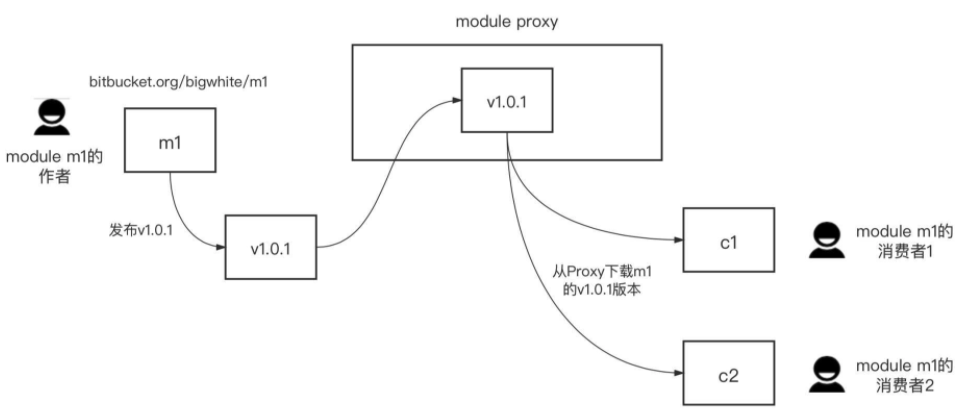
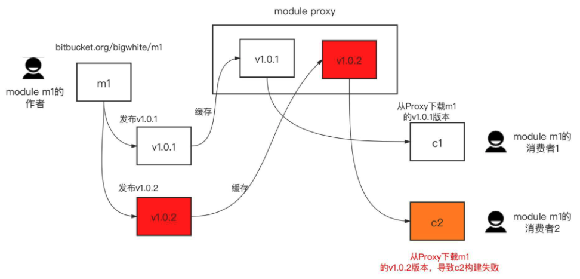
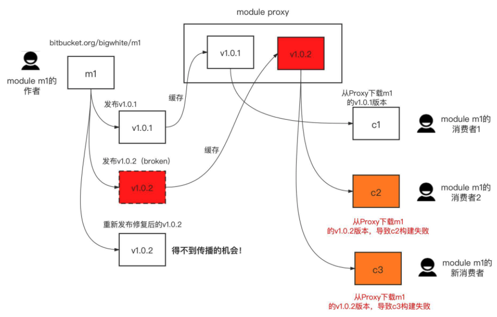
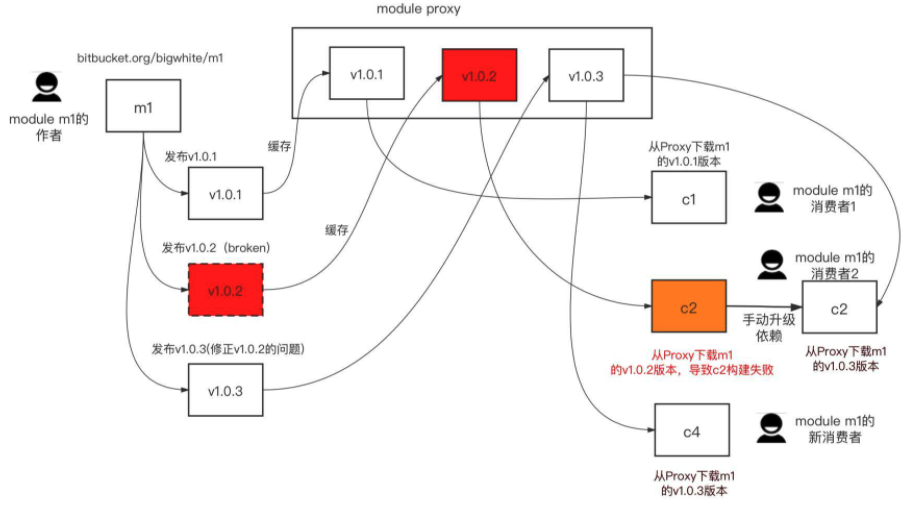
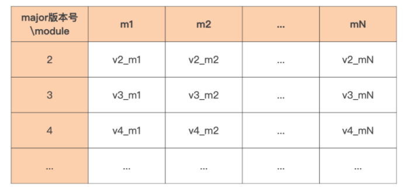

# Go Module

先了解 Go 构建模式演化的前世今生，重点来探讨现在被广泛采用的构建模式，Go Module 的基本概念和应用构建方式。 接着，分析 Go Module 的工作原理。

## Go 构建模式是怎么演化的？ 

Go 程序由 Go 包组合而成的，Go 程序的构建过程就是确定包版本、编译包以及将编译后得到的目标文件链接在一起的过程。

Go 语言的构建模式历经了三个迭代和演化过程，分别是最初期的 GOPATH、1.5 版本的 Vendor 机制，以及现在的 Go Module。

### GOPATH

Go 语言在首次开源时，就内置了一种名为 GOPATH 的构建模式。在这种构建模式下， Go 编译器可以在本地 GOPATH 环境变量配置的路径下，搜寻 Go 程序依赖的第三方包。 如果存在，就使用这个本地包进行编译；如果不存在，就会报编译错误。 

给出一段在 GOPATH 构建模式下编写的代码，先来感受一下：

```go
package main

import "github.com/sirupsen/logrus"

func main() {
   logrus.Println("hello, gopath mode")
}
```

这段代码依赖了第三方包 logrus（logrus 是 Go 社区使用最为广泛的第三方 log 包）。 

接下来，这个构建过程演示了 Go 编译器（这里使用 Go 1.10.8）在 GOPATH 环境变量所配置的目录下（这里为 /Users/tonybai/Go），无法找到程序依赖的 logrus 包而报错的情 况：

```sh
$go1.10.8 build gomodule.go
main.go:3:8: cannot find package "github.com/sirupsen/logrus" in any of:
	/Users/rmliu/sdk/go1.10.8/src/github.com/sirupsen/logrus (from $GOROOT)
	/Users/rmliu/workspace/golang/src/github.com/sirupsen/logrus (from $GOPATH)

# 备注：自行下载 Go 1.10.8 ，参见 install_go.md
```

那么 Go 编译器在 GOPATH 构建模式下，究竟怎么在 GOPATH 配置的路径下搜寻第三 方依赖包呢？ 

为了说清楚搜寻规则，先假定 Go 程序导入了 github.com/user/repo 这个包， 也同时假定当前 GOPATH 环境变量配置的值为：

```sh
export GOPATH=Users/rmliu/sdk/go1.10.8:Users/rmliu/workspace/golang
```

那么在 GOPATH 构建模式下，Go 编译器在编译 Go 程序时，就会在下面两个路径下搜索 第三方依赖包是否存在：

```sh
Users/rmliu/sdk/go1.10.8/src/github.com/user/repo
Users/rmliu/workspace/golang/src/github.com/user/repo
```

这里注意一下，如果没有显式设置 GOPATH 环境变量，Go 会将 GOPATH 设置为默认值，不同操作系统下默认值的路径不同，在 macOS 或 Linux 上，它的默认值是 $HOME/go。 

### go get

那么，当遇到像上面例子一样，没有在本地找到程序的第三方依赖包的情况，该如何 解决这个问题呢？ 

这个时候就要让 go get 登场了！ 

可以通过 go get 命令将本地缺失的第三方依赖包下载到本地，比如：

```sh
$go1.10.8 get github.com/sirupsen/logrus
# $go get github.com/sirupsen/logrus
# 目前这个想法可以实现，但是代码没法运行，已经出现了无法兼容，会报错
```

这里的 go get 命令，不仅能将 logrus 包下载到 GOPATH 环境变量配置的目录下，它还会检查 logrus 的依赖包在本地是否存在，如果不存在，go get 也会一并将它们下载到本地。 

不过，go get 下载的包只是那个时刻各个依赖包的**最新主线版本**，这样会给后续 Go 程序的构建带来一些问题。

- 比如，依赖包持续演进，可能会导致不同开发者在不同时间获取和编译同一个 Go 包时，得到不同的结果，也就是不能保证可重现的构建（Reproduceable Build）。
- 又比如，如果依赖包引入了不兼容代码，程序将无法通过编译。 
- 最后还有一点，如果依赖包因引入新代码而无法正常通过编译，并且该依赖包的作者又没有及时修复这个问题，这种错误也会传导到程序，导致程序无法通过编译。 

也就是说，在 GOPATH 构建模式下，Go 编译器实质上并没有关注 Go 项目所依赖的第三方包的版本。但 Go 开发者希望自己的 Go 项目所依赖的第三方包版本能受到自己的控制，而不是随意变化。

于是 Go 核心开发团队引入了 Vendor 机制试图解决上面的问题。


### Vendor 机制

Go 在 1.5 版本中引入 vendor 机制。

vendor 机制本质上就是在 Go 项目的某个特定目录下，将项目的所有依赖包缓存起来，这个特定目录名就是 vendor。 

Go 编译器会优先感知和使用 vendor 目录下缓存的第三方包版本，而不是 GOPATH 环境变量所配置的路径下的第三方包版本。这样，无论第三方依赖包自己如何变化，无论 GOPATH 环境变量所配置的路径下的第三方包是否存在、版本是什么，都不会影响到 Go 程序的构建。 

如果将 vendor 目录和项目源码一样提交到代码仓库，那么其他开发者下载项目 后，就可以实现可重现的构建。因此，如果使用 vendor 机制管理第三方依赖包，最佳实 践就是将 vendor 一并提交到代码仓库中。 

下面这个目录结构就是为上面的代码示例添加 vendor 目录后的结果：

```sh
.
├── main.go
└── vendor/
    ├── github.com/
    │ 		└── sirupsen/
    │ 				└── logrus/
    └── golang.org/
        └── x/
            └── sys/
                └── unix/
```

在添加完 vendor 后，重新编译 main.go，这个时候 Go 编译器就会在 vendor 目录 下搜索程序依赖的 logrus 包以及后者依赖的 golang.org/x/sys/unix 包了。 

这里要注意一点，要想开启 vendor 机制，**Go 项目必须位于 GOPATH 环境变量配置的某个路径的 src 目录下面**。如果不满足这一路径要求，那么 Go 编译器是不会理会 Go 项目目录下的 vendor 目录的。 

不过 vendor 机制虽然一定程度解决了 Go 程序可重现构建的问题，但对开发者来说，它的体验却不那么好。

- 一方面，Go 项目必须放在 GOPATH 环境变量配置的路径下，庞大的 vendor 目录需要提交到代码仓库，不仅占用代码仓库空间，减慢仓库下载和更新的速度， 而且还会干扰代码评审，对实施代码统计等开发者效能工具也有比较大影响。 
- 另外，还需要手工管理 vendor 下面的 Go 依赖包，包括项目依赖包的分析、版本的记录、依赖包获取和存放，等等，最让开发者头疼的就是这一点。 

为了解决这个问题，Go 核心团队与社区将 Go 构建的重点转移到如何解决包依赖管理上。 

Go 社区先后开发了诸如 gb、glide、dep 等工具，来帮助 Go 开发者对 vendor 下的第三方包进行自动依赖分析和管理，但这些工具也都有自身的问题。 

就在 Go 社区为包依赖管理焦虑并抱怨没有官方工具的时候，Go 核心团队基于社区实践的经验和教训，推出了 Go 官方的解决方案：Go Module。

### Go Module 

从 Go 1.11 版本开始，除了 GOPATH 构建模式外，Go 又增加了一种 Go Module 构建模式。

一个 Go Module 是一个 **Go 包的集合**。

module 是有版本的，所以 module 下的包也就有了版本属性。这个 module 与这些包会组成一个独立的版本单元，它们一起打版本、发布和分发。 

在 Go Module 模式下，通常一个代码仓库对应一个 Go Module。一个 Go Module 的顶层目录下会放置一个 go.mod 文件，每个 go.mod 文件会定义唯一一个 module，也就是说 Go Module 与 go.mod 是一一对应的。 

go.mod 文件所在的顶层目录也被称为 module 的根目录，module 根目录以及它子目录下的所有 Go 包均归属于这个 Go Module，这个 module 也被称为 **main module**。 

先来将上面的例子改造成为一个基于 Go Module 构建模式的 Go 项目。


## 创建一个 Go Module 

将基于当前项目创建一个 Go Module，通常有如下几个步骤： 

- 第一步，通过 go mod init 创建 go.mod 文件，将当前项目变为一个 Go Module； 
- 第二步，通过 go mod tidy 命令自动更新当前 module 的依赖信息； 
- 第三步，执行 go build，执行新 module 的构建。 

### 创建新项目 gomodule

先建立一个新项目 gomodule 用来演示 Go Module 的创建，可以在任 意路径下创建这个项目，不必非要在 GOPATH 环境变量的配置路径下。 

这个项目的 main.go 修改自上面的例子，修改后的 main.go 的代码是这样的，依旧 依赖外部包 logrus：

```sh
package main

import "github.com/sirupsen/logrus"

func main() {
	logrus.Println("hello, go module mode")
}
```

### go mod init

这个项目目录下只有 main.go 一个源文件，现在就来为这个项目添加 Go Module 支持。通过 go mod init 命令为这个项目创建一个 Go Module（这里使用的是 Go 版本为 1.16.5，Go 1.16 版本默认采用 Go Module 构建模式）：

```sh
$go1.16.5 mod init github.com/Kate-liu/GoBeginner/gomodule/gomodule
go: creating new go.mod: module github.com/Kate-liu/GoBeginner/gomodule/gomodule
go: to add module requirements and sums:
	go mod tidy
```

### go.mod

现在，go mod init 在当前项目目录下创建了一个 go.mod 文件，这个 go.mod 文件将当前项目变为了一个 Go Module，项目根目录变成了 module 根目录。go.mod 的内容是这样的：

```go
module github.com/Kate-liu/GoBeginner/gomodule/gomodule

go 1.16
```

这个 go.mod 文件现在处于初始状态，它的第一行内容用于声明 module 路径 (module path)，最后一行是一个 Go 版本指示符，用于表示这个 module 是在某个特定的 Go 版本 的 module 语义的基础上编写的。 

### go mod tidy

go mod init 命令还输出了两行日志，提示可以使用 go mod tidy 命令，添加 module 依赖以及校验和。

go mod tidy 命令会扫描 Go 源码，并自动找出项目依赖的外部 Go Module 以及版本，下载这些依赖并更新本地的 go.mod 文件。

按照这个提示执行一下 go mod tidy 命令：

```sh
$go1.16.5 mod tidy
go: finding module for package github.com/sirupsen/logrus
go: downloading github.com/sirupsen/logrus v1.8.1
go: found github.com/sirupsen/logrus in github.com/sirupsen/logrus v1.8.1
go: downloading golang.org/x/sys v0.0.0-20191026070338-33540a1f6037
go: downloading github.com/stretchr/testify v1.2.2
```

对于一个处于初始状态的 module 而言，go mod tidy 分析了当前 main module 的所有源文件，找出了当前 main module 的所有第三方依赖，确定第三方依赖 的版本，还下载了当前 main module 的直接依赖包（比如 logrus），以及相关间接依赖 包（直接依赖包的依赖，比如上面的 golang.org/x/sys 等）。 

### Go Module 代理服务

Go Module 还支持通过 Go Module 代理服务**加速第三方依赖的下载**。

在 Go 环境安装时，提到过 GOPROXY 环境变量，这个环境变量的默认值为“https: // proxy.golang.org,direct”，可以配置更适合于中国大陆地区的 Go Module 代理服务。 

由 go mod tidy 下载的依赖 module 会被放置在本地的 module 缓存路径下，默认值为 `$GOPATH[0]/pkg/mod`，Go 1.15 及以后版本可以通过 GOMODCACHE 环境变量，自定义本地 module 的缓存路径。 

执行 go mod tidy 后，示例 go.mod 的内容更新如下：

```go
module github.com/Kate-liu/GoBeginner/gomodule/gomodule

go 1.16

require github.com/sirupsen/logrus v1.8.1
```

当前 module 的直接依赖 logrus，还有它的版本信息都被写到了 go.mod 文件的 require 段中。 

### go.sum

而且，执行完 go mod tidy 后，当前项目除了 go.mod 文件外，还多了一个新文件 go.sum，内容是这样的：

```sh
github.com/davecgh/go-spew v1.1.1 h1:vj9j/u1bqnvCEfJOwUhtlOARqs3+rkHYY13jYWTU9
github.com/davecgh/go-spew v1.1.1/go.mod h1:J7Y8YcW2NihsgmVo/mv3lAwl/skON4iLHj
github.com/pmezard/go-difflib v1.0.0 h1:4DBwDE0NGyQoBHbLQYPwSUPoCMWR5BEzIk/f1l
github.com/pmezard/go-difflib v1.0.0/go.mod h1:iKH77koFhYxTK1pcRnkKkqfTogsbg7g
github.com/sirupsen/logrus v1.8.1 h1:dJKuHgqk1NNQlqoA6BTlM1Wf9DOH3NBjQyu0h9+AZ
github.com/sirupsen/logrus v1.8.1/go.mod h1:yWOB1SBYBC5VeMP7gHvWumXLIWorT60ONW
github.com/stretchr/testify v1.2.2 h1:bSDNvY7ZPG5RlJ8otE/7V6gMiyenm9RtJ7IUVIAo
github.com/stretchr/testify v1.2.2/go.mod h1:a8OnRcib4nhh0OaRAV+Yts87kKdq0PP7p
golang.org/x/sys v0.0.0-20191026070338-33540a1f6037 h1:YyJpGZS1sBuBCzLAR1VEpK1
golang.org/x/sys v0.0.0-20191026070338-33540a1f6037/go.mod h1:h1NjWce9XRLGQEsW
```

这同样是由 go mod 相关命令维护的一个文件，它存放了特定版本 module 内容的哈希值。 

这是 Go Module 的一个安全措施。当将来这里的某个 module 的特定版本被再次下载的时候，go 命令会使用 go.sum 文件中对应的哈希值，和新下载的内容的哈希值进行比对， 只有**哈希值比对一致**才是合法的，这样可以确保项目所依赖的 module 内容，不会被恶意或意外篡改。

因此，推荐把 go.mod 和 go.sum 两个文件与源码，一并提交到代码版本控制服务器上。 

### go build

现在，go mod init 和 go mod tidy 已经为当前 Go Module 的构建铺平了道路，接 下来，只需在当前 module 的根路径下，执行 go build 就可以完成 module 的构建 了！ 

go build 命令会读取 go.mod 中的依赖及版本信息，并在本地 module 缓存路径下找到对应版本的依赖 module，执行编译和链接。如果顺利的话，会在当前目录下看到一个新生成的可执行文件 gomodule，执行这个文件我们就能得到正确结果了。 整个过程的执行步骤是这样的：

```sh
$go build

$ls
go.mod go.sum main.go gomodule*

$./gomodule
INFO[0000] hello, go module mode
```

到这里，已经完成了一个有着多个第三方依赖的项目的构建了。

但关于 Go Module 的操作还远不止这些。随着 Go 项目的演进，会在代码中导入新的第三方包，删除一些旧的依赖包，更新一些依赖包的版本等。

那么，在看到 Go Module 机制会自动分析项目的依赖包，并选出最适合的版本后，不知道会不会有这样的疑惑：项目所依赖的包有很多版本，Go Module 是如何选出最适合的那个版本的呢？要想回答这个问题，就需要深入到 Go Module 构建模式 的工作原理中去。


## 深入 Go Module 构建模式 

Go 语言设计者在设计 Go Module 构建模式，来解决“包依赖管理”的问题时，进行了几项创新，这其中就包括语义导入版本 (Semantic Import Versioning)，以及和其他主流语言不同的最小版本选择 (Minimal Version Selection) 等机制。

只要深入理解了这些 机制，就能真正掌握 Go Module 构建模式。 

### Go Module 的语义导入版本机制

在上面的例子中，看到 go.mod 的 require 段中依赖的版本号，都符合 vX.Y.Z 的格 式。

在 Go Module 构建模式下，一个符合 Go Module 要求的版本号，由前缀 v 和一个 满足语义版本规范的版本号组成。 

可以看看下面这张图，语义版本号分成 3 部分：主版本号 (major)、次版本号 (minor) 和补丁版本号 (patch)。例如上面的 logrus module 的版本号是 v1.8.1，这就表示它的主版本号为 1，次版本号为 8，补丁版本号为 1。


Go 命令和 go.mod 文件都使用上面这种符合语义版本规范的版本号，作为描述 Go Module 版本的标准形式。

借助于语义版本规范，Go 命令可以确定同一 module 的两个版本发布的先后次序，而且可以确定它们是否兼容。 

按照语义版本规范，

- 主版本号不同的两个版本是相互不兼容的。
- 而且，在主版本号相同的情况下，次版本号大都是向后兼容次版本号小的版本。
- 补丁版本号也不影响兼容性。 

而且，**Go Module 规定**：**如果同一个包的新旧版本是兼容的，那么它们的包导入路径应该是相同的**。怎么理解呢？

就**以 logrus 为例**，它有很多发布版本，从中选出两个版本 v1.7.0 和 v1.8.1.。按照上面的语义版本规则，这两个版本的主版本号相同，新版本 v1.8.1 是兼容老版本 v1.7.0 的。那么，就可以知道，如果一个项目依赖 logrus，无论它使用的是 v1.7.0 版本还是 v1.8.1 版本，它都可以使用下面的包导入语句导入 logrus 包：

```go
import "github.com/sirupsen/logrus"
```

那么问题又来了，假如在未来的某一天，logrus 的作者发布了 logrus v2.0.0 版本。那么根据语义版本规则，该版本的主版本号为 2，已经与 v1.7.0、v1.8.1 的主版本号不同了， 那么 v2.0.0 与 v1.7.0、v1.8.1 就是不兼容的包版本。

然后再按照 Go Module 的规定，如果一个项目依赖 logrus v2.0.0 版本，那么它的包导入路径就不能再与上面的导入方式相同了。那应该使用什么方式导入 logrus v2.0.0 版本呢？ 

Go Module 创新性地给出了一个方法：**将包主版本号引入到包导入路径中**，可以像下面这样导入 logrus v2.0.0 版本依赖包：

```go
import "github.com/sirupsen/logrus/v2"
```

这就是 Go 的“语义导入版本”机制，也就是说通过在包导入路径中引入主版本号的方 式，来区别同一个包的不兼容版本，这样一来甚至可以同时依赖一个包的两个不兼容 版本：

```go
import (
  "github.com/sirupsen/logrus"
  logv2 "github.com/sirupsen/logrus/v2"
)
```

v0.y.z 版本应该使用哪种导入路径呢？

按照语义版本规范的说法，v0.y.z 这样的版本号是用于项目初始开发阶段的版本号。在这个阶段任何事情都有可能发生，其 API 也不应该被认为是稳定的。

Go Module 将这样的**版本 (v0) 与主版本号 v1 做同等对待**，也就是采用不带主版本号的包导入路径，这样一定程度降低了 Go 开发人员使用这样版本号包时的心智负担。 

Go 语义导入版本机制是 Go Module 机制的基础规则，同样它也是 Go Module 其他规则 的基础。

### Go Module 的最小版本选择原则

在前面的例子中，Go 命令都是在项目初始状态分析项目的依赖，并且项目中两个依赖包之间没有共同的依赖，这样的包依赖关系解决起来还是比较容易的。但依赖关系一旦复杂起 来，比如像下图中展示的这样，Go 又是如何确定使用依赖包 C 的哪个版本的呢？


在这张图中，myproject 有两个直接依赖 A 和 B，A 和 B 有一个共同的依赖包 C，但 A 依赖 C 的 v1.1.0 版本，而 B 依赖的是 C 的 v1.3.0 版本，并且此时 C 包的最新发布版为 C v1.7.0。

这个时候，Go 命令是如何为 myproject 选出间接依赖包 C 的版本呢？选出的究竟是 v1.7.0、v1.1.0 还是 v1.3.0 呢？

#### 最新最大 (Latest Greatest) 版本

其实，当前存在的主流编程语言，以及 Go Module 出现之前的很多 Go 包依赖管理工具都会选择依赖项的“最新最大 (Latest Greatest) 版本”，对应到图中的例子，这个版本就是 v1.7.0。 

当然了，理想状态下，如果语义版本控制被正确应用，并且这种“社会契约”也得到了很好的遵守，那么这种选择算法是有道理的，而且也可以正常工作。在这样的情况下，依赖项的“最新最大版本”应该是最稳定和安全的版本，并且应该有向后兼容性。至少在相同的主版本 (Major Verion) 依赖树中是这样的。 但并不是这样的。

#### 最小版本

Go 设计者另辟蹊径，在诸多兼容性版本间，不光要考虑最新最大的稳定与安全，还要尊重各个 module 的述求：A 明明说只要求 C v1.1.0，B 明明说只要求 C v1.3.0。

所以 Go 会在该项目依赖项的所有版本中，选出符合项目整体要求的“最小版本”。 

这个例子中，C v1.3.0 是符合项目整体要求的版本集合中的版本最小的那个，于是 Go 命令选择了 C v1.3.0，而不是最新最大的 C v1.7.0。并且，Go 团队认为“最小版本选择”为Go 程序实现持久的和可重现的构建提供了最佳的方案。 

了解了语义导入版本与最小版本选择两种机制后，就已经掌握了 Go Module 的精髓。 

但很多 Go 开发人员的起点，并非是默认开启 Go Module 构建模式的 Go 1.16 版本，多数 Go 开发人使用的环境中都存在着多套 Go 版本，有用于体验最新功能特性的 Go 版本，也有某些遗留项目所使用的老版本 Go 编译器。 

它们工作时采用的构建模式是不一样的，并且即便是引入 Go Module 的 Go 1.11 版本， 它的 Go Module 机制，和后续进化后的 Go 版本的 Go Module 构建机制在表现行为上也有所不同。

因此 Go 开发人员可能需要经常在各个 Go 版本间切换。而明确具体版本下 Go Module 的实际表现行为对 Go 开发人员是十分必要的。


## Go 各版本构建模式机制和切换 

在 Go 1.11 版本中，Go 开发团队引入 Go Modules 构建模式。这个时候，GOPATH 构建模式与 Go Modules 构建模式各自独立工作，可以通过设置环境 变量 **GO111MODULE** 的值在两种构建模式间切换。 

然后，随着 Go 语言的逐步演进，从 Go 1.11 到 Go 1.16 版本，不同的 Go 版本在 GO111MODULE 为不同值的情况下，开启的构建模式几经变化，直到 Go 1.16 版本，Go Module 构建模式成为了默认模式。 

所以，要分析 Go 各版本的具体构建模式的机制和切换，只需要找到这几个代表性的 版本就好了。 

这里将 Go 1.13 版本之前、Go 1.13 版本以及 Go 1.16 版本，在 GO111MODULE 为不同值的情况下的行为做了一下对比，这样可以更好地理解不同版本下、不同构建模式下的行为特性，下面就来用表格形式做一下比对：


## Go Module 的6类常规操作

### 为当前 module 添加一个依赖 

在一个项目的初始阶段，会经常为项目引入第三方包，并借助这些包完成特定功能。 即便是项目进入了稳定阶段，随着项目的演进，偶尔还需要在代码中引入新的第三方 包。 

那么如何为一个 Go Module 添加一个新的依赖包呢？ 

以 gomodule 项目为例。如果要为这个项目增加一个新依赖：github.com/google/uuid，那需要怎么做呢？ 

首先会更新源码，就像下面代码中这样：

```go
package main

import (
	"github.com/google/uuid"
	"github.com/sirupsen/logrus"
)

func main() {
	logrus.Println("hello, go module mode")
	logrus.Println(uuid.NewString())
}
```

新源码中，通过 import 语句导入了 github.com/google/uuid，并在 main 函数中调用了 uuid 包的函数 NewString。

此时，如果直接构建这个 module，会得到 一个错误提示：

```sh
$go build
main.go:4:2: no required module provides package github.com/google/uuid; to add it:
        go get github.com/google/uuid
```

#### go get 命令

Go 编译器提示，go.mod 里的 require 段中，没有哪个 module 提供了 github.com/google/uuid 包，如果要增加这个依赖，可以手动执行 go get 命令。 

那来按照提示手工执行一下这个命令：

```sh
$go get github.com/google/uuid
go: downloading github.com/google/uuid v1.3.0
go get: added github.com/google/uuid v1.3.0
```

go get 命令将新增的依赖包下载到了本地 module 缓存里，并在 go.mod 文件的 require 段中新增了一行内容：

```go
require (
	github.com/google/uuid v1.3.0 // indirect // 新增的依赖
	github.com/sirupsen/logrus v1.8.1
)
```

这新增的一行表明，当前项目依赖的是 uuid 的 v1.3.0 版本。

#### go mod tidy 命令

也可以使用 go mod tidy 命令，在执行构建前自动分析源码中的依赖变化，识别新增依赖项并下载它们：

```sh
$go mod tidy
go: finding module for package github.com/google/uuid
go: found github.com/google/uuid in github.com/google/uuid v1.3.0
```

对于这个例子而言，手工执行 go get 新增依赖项，和执行 go mod tidy 自动分析和下载依赖项的最终效果，是等价的。

但对于复杂的项目变更而言，逐一手工添加依赖项显然很**没有效率**，**go mod tidy 是更佳的选择**。 


### 升级 / 降级依赖的版本

#### 降级

先以对依赖的版本进行降级为例，分析一下。 

在实际开发工作中，如果认为 Go 命令会自动确定的某个依赖的版本存在一些问 题，比如，引入了不必要复杂性导致可靠性下降、性能回退等等，可以手工将它降级 为之前发布的某个兼容版本。 

那这个操作依赖于什么原理呢？ 

答案就是“语义导入版本”机制。

> 再来简单复习一下，Go Module 的版本号采用了语义版本规范，也就是版本号使用 vX.Y.Z 的格式。
>
> 其中 X 是主版本号(major)，Y 为次版本号 (minor)，Z 为补丁版本号 (patch)。
>
> 主版本号相同的两个版本，较新的版本是兼容旧版本的。如果主版本号不同，那么两个版本是不兼容的。 

有了语义版本号作为基础和前提，就可以从容地手工对依赖的版本进行升降级了，Go 命令也可以根据版本兼容性，自动选择出合适的依赖版本了。 

还是以上面提到过的 logrus 为例，logrus 现在就存在着多个发布版本，可以通过下面命令来进行查询：

```sh
$go list -m -versions github.com/sirupsen/logrus
github.com/sirupsen/logrus v0.1.0 v0.1.1 v0.2.0 v0.3.0 v0.4.0 v0.4.1 v0.5.0 v0.5.1 v0.6.0 v0.6.1 v0.6.2 v0.6.3 v0.6.4 v0.6.5 v0.6.6 v0.7.0 v0.7.1 v0.7.2 v0.7.3 v0.8.0 v0.8.1 v0.8.2 v0.8.3 v0.8.4 v0.8.5 v0.8.6 v0.8.7 v0.9.0 v0.10.0 v0.11.0 v0.11.1 v0.11.2 v0.11.3 v0.11.4 v0.11.5 v1.0.0 v1.0.1 v1.0.3 v1.0.4 v1.0.5 v1.0.6 v1.1.0 v1.1.1 v1.2.0 v1.3.0 v1.4.0 v1.4.1 v1.4.2 v1.5.0 v1.6.0 v1.7.0 v1.7.1 v1.8.0 v1.8.1
```

在这个例子中，基于初始状态执行的 go mod tidy 命令，选择了 logrus 的最新发布版本 v1.8.1。

##### go get 命令

如果觉得这个版本存在某些问题，想将 logrus 版本降至某个之前发布的 兼容版本，比如 v1.7.0，那么可以在项目的 module 根目录下，执行带有版本号的 go get 命令：

```sh
$go get github.com/sirupsen/logrus@v1.7.0
go: downloading github.com/sirupsen/logrus v1.7.0
go get: downgraded github.com/sirupsen/logrus v1.8.1 => v1.7.0
```

从这个执行输出的结果，可以看到，go get 命令下载了 logrus v1.7.0 版本，并将 go.mod 中对 logrus 的依赖版本从 v1.8.1 降至 v1.7.0。 

```go
require (
   github.com/google/uuid v1.3.0
   github.com/sirupsen/logrus v1.7.0
)
```

##### go mod tidy 命令

当然也可以使用万能命令 go mod tidy 来帮助降级，但前提是首先要用 go mod edit 命令，明确告知要依赖 v1.7.0 版本，而不是 v1.8.1，这个执行步骤是这样的：

```sh
$go mod edit -require=github.com/sirupsen/logrus@v1.7.0
$go mod tidy
go: downloading github.com/sirupsen/logrus v1.7.0
```

#### 升级

降级后，再假设 logrus v1.7.1 版本是一个安全补丁升级，修复了一个严重的安全漏 洞，而且必须使用这个安全补丁版本，这就意味着需要将 logrus 依赖从 v1.7.0 升级到 v1.7.1。 

可以使用与降级同样的步骤来完成升级，这里列出了使用 go get 实现依赖版本升 级的命令和输出结果。

```sh
$go get github.com/sirupsen/logrus@v1.7.1
go: downloading github.com/sirupsen/logrus v1.7.1
go: downloading github.com/magefile/mage v1.10.0
go get: upgraded github.com/sirupsen/logrus v1.7.0 => v1.7.1
```

使用 go mod tidy 实现依赖版本升级 v1.8.0 的命令和输出结果。

```sh
$go mod edit -require=github.com/sirupsen/logrus@v1.8.0
$go mod tidy
go: downloading github.com/sirupsen/logrus v1.8.0
```


### 添加一个主版本号大于 1 的依赖

在前面的例子中，Go Module 的依赖的主版本号都是 1。

根据语义导入版本的规范，在 Go Module 构建模式下，当依赖的主版本号为 0 或 1 的时候，在 Go 源码中导入依赖包，不需要在包的导入路径上增加版本号，也就是：

```go
import github.com/user/repo/v0 等价于 import github.com/user/repo
import github.com/user/repo/v1 等价于 import github.com/user/repo
```

但是，如果要依赖的 module 的主版本号大于 1，这又要怎么办呢？

语义版本规则中对主版本号大于 1 情况有一个**原则**：如果新旧版本的包使用相同的导入路径，那么新包与旧包是兼容的。也就是说，如果新旧两个包不兼容，那么就应该采用不同的导入路 径。 

按照语义版本规范，如果要为项目引入主版本号大于 1 的依赖，比如 v2.0.0，那么由于这个版本与 v1、v0 开头的包版本都不兼容，在导入 v2.0.0 包时，不能再直接使用 github.com/user/repo，而要使用像下面代码中那样不同的包导入路径：

```go
import github.com/user/repo/v2/xxx
```

也就是说，如果要为 Go 项目添加主版本号大于 1 的依赖，就需要使用“语义导 入版本”机制，在声明它的导入路径的基础上，加上版本号信息。

以“向 gomodule 项目添加 github.com/go-redis/redis 依赖包的 v7 版本”为例，看看添加步骤。 

首先，在源码中，以**空导入的方式**导入 v7 版本的 github.com/go-redis/redis 包：

```go
package main

import (
	_ "github.com/go-redis/redis/v7"
	"github.com/google/uuid"
	"github.com/sirupsen/logrus"
)

func main() {
	logrus.Println("hello, go module mode")
	logrus.Println(uuid.NewString())
}
```

接下来的步骤就与添加兼容依赖一样，通过 go get 获取 redis 的 v7 版本：

```sh
$go get github.com/go-redis/redis/v7
go: downloading github.com/go-redis/redis v6.15.9+incompatible
go get: added github.com/go-redis/redis/v7 v7.4.1
```

go get 选择了 go-redis v7 版本下当前的最新版本 v7.4.1。 

不过呢，这里说的是为项目添加一个主版本号大于 1 的依赖的步骤。有些时候，出于要使 用依赖包最新功能特性等原因，可能需要将某个依赖的版本升级为其不兼容版本，也就是主版本号不同的版本，这又该怎么做呢？ 

### 升级依赖版本到一个不兼容版本

还以 go-redis/redis 这个依赖为例，将这个依赖从 v7 版本升级到最新的 v8 版本。

按照语义导入版本的原则，不同主版本的包的导入路径是不同的。所以， 同样地，这里也需要先将代码中 redis 包导入路径中的版本号改为 v8：

```go
import (
   _ "github.com/go-redis/redis/v8"
   "github.com/google/uuid"
   "github.com/sirupsen/logrus"
)
```

接下来，再通过 go get 来获取 v8 版本的依赖包：

```sh
$go get github.com/go-redis/redis/v8
go: downloading github.com/go-redis/redis/v8 v8.11.4
go: downloading github.com/dgryski/go-rendezvous v0.0.0-20200823014737-9f7001d12a5f
go: downloading github.com/cespare/xxhash/v2 v2.1.2
go get: added github.com/go-redis/redis/v8 v8.11.4
```

这样，就完成了向一个不兼容依赖版本的升级。是不是很简单啊！ 

但是项目继续演化到一个阶段的时候，可能还需要移除对之前某个包的依赖。 


### 移除一个依赖 

看 go-redis/redis 示例，如果不需要再依赖 go-redis/redis 了，会怎么做呢？ 

可能会删除掉代码中对 redis 的空导入这一行，之后再利用 go build 命令成功地构建这个项目。 

会发现，与添加一个依赖时 Go 命令给出友好提示不同，这次 go build 没有给出任何关于项目已经将 go-redis/redis 删除的提示，并且 go.mod 里 require 段中的 go-redis/redis/v8 的依赖依旧存在着。 

再通过 go list 命令列出当前 module 的所有依赖，也会发现 go-redis/redis/v8 仍 出现在结果中：

```sh
$go list -m all
github.com/Kate-liu/GoBeginner/gomodule/gomodule
...
github.com/go-redis/redis/v8 v8.11.4
...
github.com/google/uuid v1.3.0
...
github.com/sirupsen/logrus v1.8.1
...
gopkg.in/yaml.v2 v2.4.0
```

这是怎么回事呢？ 

其实，要想彻底从项目中移除 go.mod 中的依赖项，仅从源码中删除对依赖项的导入语句还不够。这是因为如果源码满足成功构建的条件，go build 命令是不会“多管闲事”地清理 go.mod 中多余的依赖项的。

那正确的做法是怎样的呢？

还得用 go mod tidy 命令，将这个依赖项彻底从 Go Module 构建上下文中清除掉。

> go mod tidy 会自动分析源码依赖，而且将不再使用的依 赖从 go.mod 和 go.sum 中移除。 


### 特殊情况：使用 vendor 

还有一种特殊情况，需要借用 vendor 机制。 

为什么 Go Module 的维护，还有要用 vendor 的情况？ 

其实，**vendor 机制**虽然诞生于 GOPATH 构建模式主导的年代，但在 Go Module 构建模式下，它依旧被保留了下来，并且**成为了 Go Module 构建机制的一个很好的补充**。

特别是在一些不方便访问外部网络，并且对 Go 应用构建性能敏感的环境，比如在一些**内部的持续集成或持续交付环境 (CI/CD)** 中，使用 vendor 机制可以实现与 Go Module 等价的构建。 

#### go mod vendor 命令

和 GOPATH 构建模式不同，Go Module 构建模式下，再也无需手动维护 vendor 目录下的依赖包了，Go 提供了可以快速建立和更新 vendor 的命令，还是以前面的 gomodule 项目为例，通过下面命令为该项目建立 vendor：

```sh
$go mod vendor
$tree -LF 2 vendor
vendor/
├── github.com/
│   ├── google/
│   └── sirupsen/
├── golang.org/
│   └── x/
└── modules.txt
```

go mod vendor 命令在 vendor 目录下，创建了一份这个项目的依赖包的副本，并且通过 vendor/modules.txt 记录了 vendor 下的 module 以及版本。

如果要**基于 vendor 构建**，而不是基于本地缓存的 Go Module 构建，需要在 go build 后面加上 -mod=vendor 参数。 

```sh
$go build -mod=vender
```

在 Go 1.14 及以后版本中，如果 Go 项目的顶层目录下存在 vendor 目录，那么 go build 默认也会优先基于 vendor 构建，除非你给 go build 传入 -mod=mod 的参数。

```sh
# Go 1.14 及以后版本 vender 构建
$go build -mod=vender
$go build 
# mod 构建
$go build -mod=mod
```


## 如何拉取私有的Go Module？

下面这两个有关 Go Module 的问题比较突出：

- 在某 module 尚未发布到类似 GitHub 这样的网站前，如何 import 这个本地的 module？ 
- 如何拉取私有 module？

首先来看第一个问题：如何导入本地的 module。

### 导入本地 module 

Go Module 从 Go 1.11 版本开始引入到 Go 中，现在它已经成为了 Go 语言的依赖管理与构建的标准，因此，建议彻底抛弃 Gopath 构建模式，全面拥抱 Go Module 构建模式。

当项目依赖已发布在 GitHub 等代码托管站点的公共 Go Module 时，Go 命令工具可以很好地完成依赖版本选择以及 Go Module 拉取的工作。 

不过，如果项目依赖的是本地正在开发、尚未发布到公共站点上的 Go Module， 那么应该如何做呢？来看一个例子。 

假设有一个项目，这个项目中的 module a 依赖 module b，而 module b 是另外一个项目中的 module，它本来是要发布到github.com/user/b上的。 

但此时此刻，module b 还没有发布到公共托管站点上，它源码还在开发机器上。也就是说，go 命令无法在github.com/user/b上找到并拉取 module a 的依赖 module b。

这时，如果针对 module a 所在项目使用 go mod tidy 命令，就会收到类似下面这样的报错信息：

```sh
$go mod tidy
go: finding module for package github.com/user/b
github.com/user/a imports
	github.com/user/b: cannot find module providing package github.com/user/b: module github.com/user/b: reading https://goproxy.io/github.com/user/b/@v/list: 404 Not Found
	server response:
	not found: github.com/user/b@latest: terminal prompts disabled
	Confirm the import path was entered correctly.
	If this is a private repository, see https://golang.org/doc/faq#git_https for additional information.
```

#### replace 指示符

这个时候，就可以借助 **go.mod 的 replace 指示符**，来解决这个问题。解决的步骤是这样的： 

首先，需要在 module a 的 go.mod 中的 require 块中，手工加上这一条（这也可以通过 go mod edit 命令实现）：

```go
require github.com/user/b v1.0.0
```

注意了，这里的 v1.0.0 版本号是一个“假版本号”，目的是满足 go.mod 中 require 块的语法要求。 

然后，再在 module a 的 go.mod 中使用 replace，将上面对 module b v1.0.0 的依 赖，替换为本地路径上的 module b:

```go
replace github.com/user/b v1.0.0 => module b的本地源码路径
```

这样修改之后，go 命令就会让 module a 依赖本地正在开发、尚未发布到代码托管网站的 module b 的源码了。 

而且，如果 module b 已经提交到类 GitHub 的站点上，但 module b 的作者正在本地开发新版本，那么上面这种方法，也同样适合 module b 的作者在本地测试验证 module b 的最新版本源码。 

#### 瑕疵

虽然“伪造”go.mod 文件内容，可以解决上述这两个场景中的问题，但显然这种方法也是有“瑕疵”的。 

首先，这个方法中，require 指示符将github.com/user/b v1.0.0替换为一个本地路 径下的 module b 的源码版本，但这个本地路径是因开发者环境而异的。 

go.mod 文件通常是要上传到代码服务器上的，这就意味着，另外一个开发人员下载了这份代码后，极大可能是无法成功编译的，要想完成 module a 的编译，就得将 replace 后面的本地路径改为适配自己环境下的路径。 

于是，每当开发人员 pull 代码后，第一件事就是要修改 module a 的 go.mod 中的 replace 块，每次上传代码前，可能也要将 replace 路径复原，这是一个很糟心的事情。 

但即便如此，目前 Go 版本（最新为 Go 1.17.x）也没有一个完美的应对方案。

#### Go 工作区（Go workspace）

针对这个问题，Go 核心团队在 Go 社区的帮助下，在预计 2022 年 2 月发布的 Go 1.18 版本中加入了 Go 工作区（Go workspace，也译作 Go 工作空间）辅助构建机制。 

基于这个机制，可以将多个本地路径放入同一个 workspace 中，这样，在这个 workspace 下各个 module 的构建将优先使用 workspace 下的 module 的源码。

工作区配置数据会放在一个名为 go.work 的文件中，这个文件是开发者环境相关的，因此并不需要提交到源码服务器上，这就解决了上面“伪造 go.mod”方案带来的那些问题。 

不过，Go 1.18 版本尚未发布，不再深入讲解了 Go workspace 机制了，可以去下载 Go 1.18 Beta1 版本抢先体验。 

接下来，再来看看拉取私有 module 的可行解决方案。 

### 拉取私有 module 

#### 私有 Go Module 的需求

Go 1.11 版本引入 Go Module 构建模式后，用 Go 命令拉取项目依赖的公共 Go Module，已不再是“痛点”，只需要在每个开发机上为环境变量 GOPROXY，配置 一个高效好用的公共 GOPROXY 服务，就可以轻松拉取所有公共 Go Module 了：


但随着公司内 Go 使用者和 Go 项目的增多，“重造轮子”的问题就出现了。抽取公共代码放入一个独立的、可被复用的内部私有仓库成为了必然，这样就有了拉取私有 Go Module 的需求。 

#### 放在公共 vcs 托管服务商

一些公司或组织的所有代码，都放在公共 vcs 托管服务商那里（比如 github.com），私有 Go Module 则直接放在对应的公共 vcs 服务的 private repository（私有仓库）中。

如果公司也是这样，那么拉取托管在公共 vcs 私有仓库中的私有 Go Module，也很容易，见下图：


也就是说，只要在每个开发机上，配置公共 GOPROXY 服务拉取公共 Go Module， 同时再把私有仓库配置到 GOPRIVATE 环境变量，就可以了。

这样，所有私有 module 的拉取，都会直连代码托管服务器，不会走 GOPROXY 代理服务，也不会去 GOSUMDB 服务器做 Go 包的 hash 值校验。 

当然，这个方案有一个前提，那就是每个开发人员都需要具有访问公共 vcs 服务上的私有 Go Module 仓库的权限，凭证的形式不限，可以是 basic auth 的 user 和 password，也可以是 personal access token（类似 GitHub 那种），只要按照公共 vcs 的身份认证要求提供就可以了。

####  放在公司 / 组织内部的 vcs 服务器

不过，更多的公司 / 组织，可能会将私有 Go Module 放在公司 / 组织内部的 vcs（代码版 本控制）服务器上，就像下面图中所示：


那么这种情况，该如何让 Go 命令，自动拉取内部服务器上的私有 Go Module 呢？ 这里给出两个参考方案。 

##### 直连私有 Go Module 服务器

第一个方案是通过**直连组织公司内部的私有 Go Module 服务器拉取**。


在这个方案中，可以看到，公司内部会搭建一个内部 goproxy 服务（也就是上图中的 in-house goproxy）。

这样做有两个目的，

- 一是为那些无法直接访问外网的开发机器，以及 ci 机器提供拉取外部 Go Module 的途径，
- 二来，由于 in-house goproxy 的 cache 的存在，这样做还可以加速公共 Go Module 的拉取效率。 

另外，对于私有 Go Module，开发机只需要将它配置到 GOPRIVATE 环境变量中就可以了，这样，Go 命令在拉取私有 Go Module 时，就不会再走 GOPROXY，而会采用直接访问 vcs（如上图中的 git.yourcompany.com）的方式拉取私有 Go Module。

这个方案十分适合内部有完备 IT 基础设施的公司。这类型的公司内部的 vcs 服务器都可以通过域名访问（比如 git.yourcompany.com/user/repo），因此，公司内部员工可以像访问公共 vcs 服务那样，访问内部 vcs 服务器上的私有 Go Module。 

##### 内部统一的 GOPROXY 服务

第二种方案，是**将外部 Go Module 与私有 Go Module 都交给内部统一的 GOPROXY 服务去处理**：


在这种方案中，开发者只需要把 GOPROXY 配置为 in-house goproxy，就可以统一拉取外部 Go Module 与私有 Go Module。 

但由于 go 命令默认会对所有通过 goproxy 拉取的 Go Module，进行 sum 校验（默认到 sum.golang.org)，而私有 Go Module 在公共 sum 验证 server 中又没有数据记录。

因此，开发者需要将私有 Go Module 填到 GONOSUMDB 环境变量中，这样，go 命令就不会对其进行 sum 校验了。 

不过这种方案有一处要注意：in-house goproxy 需要拥有对所有 private module 所在 repo 的访问权限，才能保证每个私有 Go Module 都拉取成功。 

可以对比一下上面这两个参考方案，看看更倾向于哪一个，推荐第二个方案。在第 二个方案中，可以将所有复杂性都交给 in-house goproxy 这个节点，开发人员可以 无差别地拉取公共 module 与私有 module，心智负担降到最低。 

那么该怎么实现这个方案呢？接下来分析一个可行的实现思路与具体步骤。

### 统一 Goproxy 方案的实现思路与步骤 

>拉取私有 Go Module 的方案

先为后续的方案实现准备一个示例环境，它的拓扑如下图：


#### 选择一个 GOPROXY 实现 

Go module proxy 协议规范发布后，Go 社区出现了很多成熟的 Goproxy 开源实现， 比如有最初的 athens，还有国内的两个优秀的开源实现：goproxy.cn和goproxy.io 等。

其中，goproxy.io 在官方站点给出了企业内部部署的方法，所以今天就**基于 goproxy.io** 来实现我们的方案。

在上图中的 in-house goproxy 节点上执行这几个步骤安装 goproxy：

```sh
$mkdir ~/.bin/goproxy
$cd ~/.bin/goproxy
$git clone https://github.com/goproxyio/goproxy.git
$cd goproxy
$make
```

编译后，会在当前的 bin 目录（~/.bin/goproxy/goproxy/bin）下看到名为 goproxy 的可执行文件。 

然后，建立 goproxy cache 目录：

```sh
$mkdir /root/.bin/goproxy/goproxy/bin/cache
```

再启动 goproxy：

```sh
$./goproxy -listen=0.0.0.0:8081 -cacheDir=/root/.bin/goproxy/goproxy/bin/cache
goproxy.io: ProxyHost https://goproxy.io
```

启动后，goproxy 会在 8081 端口上监听（即便不指定，goproxy 的默认端口也是 8081），指定的上游 goproxy 服务为 goproxy.io。 

不过要注意下：goproxy 的这个启动参数并不是最终版本的，这里仅仅想验证一下 goproxy 是否能按预期工作。

现在就来实际**验证**一下。 

首先，在开发机上配置 GOPROXY 环境变量指向 10.10.20.20:8081：

```sh
// .bashrc
export GOPROXY=http://10.10.20.20:8081
```

生效环境变量后，执行下面命令：

```sh
$go get github.com/pkg/errors
```

结果和预期的一致，开发机顺利下载了 github.com/pkg/errors 包。可以在 goproxy 侧，看到了相应的日志：

```sh
goproxy.io: ------ --- /github.com/pkg/@v/list [proxy]
goproxy.io: ------ --- /github.com/pkg/errors/@v/list [proxy]
goproxy.io: ------ --- /github.com/@v/list [proxy]
goproxy.io: 0.146s 404 /github.com/@v/list
goproxy.io: 0.156s 404 /github.com/pkg/@v/list
goproxy.io: 0.157s 200 /github.com/pkg/errors/@v/list
```

在 goproxy 的 cache 目录下，也看到了下载并缓存的 github.com/pkg/errors 包：

```sh
$cd /root/.bin/goproxy/goproxy/bin/cache
$tree
.
└── pkg
  └── mod
    └── cache
      └── download
        └── github.com
          └── pkg
            └── errors
              └── @v
                └── list
8 directories, 1 file
```

这就标志着 goproxy 服务搭建成功，并可以正常运作了。 

#### 自定义包导入路径并将其映射到内部的 vcs 仓库 

一般公司可能没有为 vcs 服务器分配域名，也不能在 Go 私有包的导入路径中放入 ip 地址，因此需要给私有 Go Module 自定义一个路径，比如： mycompany.com/go/module1。

统一将私有 Go Module 放在 mycompany.com/go 下面的代码仓库中。 

那么，接下来的问题就是，当 goproxy 去拉取 mycompany.com/go/module1 时，应该得到 mycompany.com/go/module1 对应的内部 vcs 上 module1 仓库的地址，这样， goproxy 才能从内部 vcs 代码服务器上下载 module1 对应的代码，具体的过程如下：


那么如何实现为私有 module 自定义包导入路径，并将它映射到内部的 vcs 仓库呢？ 

其实方案不止一种，这里使用了 Google 云开源的一个**名为 govanityurls 的工具**，来为私有 module 自定义包导入路径。

然后，**结合 govanityurls 和 nginx**，就可以将私有 Go Module 的导入路径映射为其在 vcs 上的代码仓库的真实地址。具体原理可以看一下这张图：


首先，goproxy 要想不把收到的拉取私有 Go Module（mycompany.com/go/module1）的请求转发给公共代理，需要在其启动参数上做一些手脚，比如下面这个就是修改后的 goproxy 启动命令：

```sh
$./goproxy -listen=0.0.0.0:8081 -cacheDir=/root/.bin/goproxy/goproxy/bin/cache -proxy https://goproxy.io -exclude "mycompany.com/go"
```

这样，凡是与 -exclude 后面的值匹配的 Go Module 拉取请求，goproxy 都不会转给 goproxy.io，而是直接请求 Go Module 的“源站”。 

而上面这张图中要做的，就是将这个“源站”的地址，转换为企业内部 vcs 服务中的一个仓库地址。然后假设 mycompany.com 这个域名并不存在（很多小公司没有内部域名解析能力），从图中可以看到，会在 goproxy 所在节点的 /etc/hosts 中加上这 样一条记录：

```sh
127.0.0.1 mycompany.com
```

这样做了后，goproxy 发出的到 mycompany.com 的请求实际上是发向了本机。而上面这图中显示，监听本机 80 端口的正是 nginx，nginx 关于 mycompany.com 这一主机的配置如下：

```sh
// /etc/nginx/conf.d/gomodule.conf
server {
  listen 80;
  server_name mycompany.com;
  location /go {
    proxy_pass http://127.0.0.1:8080;
    proxy_redirect off;
    proxy_set_header Host $host;
    proxy_set_header X-Real-IP $remote_addr;
    proxy_set_header X-Forwarded-For $proxy_add_x_forwarded_for;
    proxy_http_version 1.1;
    proxy_set_header Upgrade $http_upgrade;
    proxy_set_header Connection "upgrade";
  }
}
```

可以看到，对于路径为 mycompany.com/go/xxx 的请求，nginx 将请求转发给了 127.0.0.1:8080，而这个服务地址恰恰就是 govanityurls 工具监听的地址。 

govanityurls 这个工具，是前 Go 核心开发团队成员 Jaana B.Dogan开源的一个工具， 这个工具可以帮助 Gopher 快速实现自定义 Go 包的 go get 导入路径。 

govanityurls 本身，就好比一个“导航”服务器。当 go 命令向自定义包地址发起请求 时，实际上是将请求发送给了 govanityurls 服务，之后，govanityurls 会将请求中的包所在仓库的真实地址（从 vanity.yaml 配置文件中读取）返回给 go 命令，后续 go 命令再从真实的仓库地址获取包数据。

> 注：govanityurls 的安装方法很简单，直接 go install/go get github.com/GoogleCloudPlatform/govanityurls 就可以了。 
>
> 在示例中，vanity.yaml 的配置如下：

```sh
host: mycompany.com

paths:
  /go/module1:
    repo: ssh://admin@10.10.30.30/module1
    vcs: git
```

也就是说，当 govanityurls 收到 nginx 转发的请求后，会将请求与 vanity.yaml 中配置的 module 路径相匹配，如果匹配 ok，就会将该 module 的真实 repo 地址，通过 go 命令期望的应答格式返回。

在这里可以看到，module1 对应的真实 vcs 上的仓库地址为： ssh://admin@10.10.30.30/module1。 

所以，goproxy 会收到这个地址，并再次向这个真实地址发起请求，并最终将 module1 缓存到本地 cache 并返回给客户端。

#### 开发机 (客户端) 的设置

前面示例中，已经将开发机的 GOPROXY 环境变量，设置为 goproxy 的服务地址。 凡是通过 GOPROXY 拉取的 Go Module，go 命令都会默认把它的 sum 值放到公共 GOSUM 服务器上去校验。 

但实质上拉取的是私有 Go Module，GOSUM 服务器上并没有 Go Module 的 sum 数据。这样就会导致 go build 命令报错，无法继续构建过程。 

因此，开发机客户端还需要将 mycompany.com/go，作为一个值设置到 GONOSUMDB 环境变量中：

```sh
export GONOSUMDB=mycompany.com/go
```

这个环境变量配置一旦生效，就相当于告诉 go 命令，凡是与 mycompany.com/go 匹配的 Go Module，都不需要在做 sum 校验了。 

到这里，就实现了拉取私有 Go Module 的方案。 

#### 方案的“不足”

当然这个方案并不是完美的，它也有自己的不足的地方： 

第一点：**开发者还是需要额外配置 GONOSUMDB 变量**。 

由于 Go 命令默认会对从 GOPROXY 拉取的 Go Module 进行 sum 校验，因此需要 将私有 Go Module 配置到 GONOSUMDB 环境变量中，这就给开发者带来了一个小小 的“负担”。 

对于这个问题，解决的建议是：公司内部可以将私有 go 项目都放在一个特定域名下， 这样就不需要为每个 go 私有项目单独增加 GONOSUMDB 配置了，只需要配置一次就可以了。 

第二点：**新增私有 Go Module，vanity.yaml 需要手工同步更新**。

这是这个方案最不灵活的地方了，由于目前 govanityurls 功能有限，针对每个私有 Go Module，可能都需要单独配置它对应的 vcs 仓库地址，以及获取方式（git、svn or hg）。 

关于这一点，建议是：在一个 vcs 仓库中管理多个私有 Go Module。相比于最初 go 官方建议的一个 repo 只管理一个 module，新版本的 go 在一个 repo 下管理多个 Go Module方面，已经有了长足的进步，已经可以通过 repo 的 tag 来区别同一个 repo 下的不同 Go Module。 

不过对于一个公司或组织来说，这点额外工作与得到的收益相比，应该也不算什么！

第三点：**无法划分权限**。 

在讲解上面的方案的时候也提到过，goproxy 所在节点需要具备访问所有私有 Go Module 所在 vcs repo 的权限，但又无法对 go 开发者端做出有差别授权，这样，只要是 goproxy 能拉取到的私有 Go Module，go 开发者都能拉取到。 

不过对于多数公司而言，内部所有源码原则上都是企业内部公开的，这个问题似乎也不大。如果觉得这是个问题，那么只能使用前面提到的第一个方案，也就是直连私有 Go Module 的源码服务器的方案了。

### 小结 

针对导入本地 Go Module 的问题，在 Go 1.18 版本未发布之前，最好的方法就是使用 replace“大法”，通过“伪造”的 go.mod 让 go 命令优先使用项目依赖的 Go Module 的本地版本。

不过这个方案，也会给开发人员协作方面带去一些额外负担，要想完美解决这一问题，还需要等待加入了 Go 工作区机制的 Go 1.18 版本。 

无论大厂小厂，当对 Go 的使用逐渐深入，接纳 Go 的人以及 Go 项目逐渐增多后，拉取私有 Go Module 这样的问题肯定会摆到桌面上来。

介绍了直连私有 Go Module 源码服务器和使用统一 GOPROXY 代理两种方案，推荐使用第二种方案，可以降低开发人员拉取私有 module 的心智负担。


## 当 Go Module 的作者

前面对 Go Module 构建模式的原理，以及如何使用 Go Module 构建模式做了详细的讲解。更多是从 Go Module 的使用者角度出发的。

现在再从 Go Module 的作者或维护者的视角，来聊聊在规划、发布和维护 Go Module 时需要考虑和注意什么事情，包括 go 项目仓库布局、Go Module 的发布、升级 module 主版本号、 作废特定版本的 module，等等。

先来看看作为 Go Module 作者在规划 module 时遇到的第一个问题：一个代码仓库 （repo）管理一个 module，还是一个仓库管理多个 module？ 

### 仓库布局：是单 module 还是多 module 

如果没有单一仓库（monorepo）的强约束，那么在默认情况下，选择一个仓库管理一个 module 是不会错的，这是管理 Go Module 的最简单的方式，也是最常用的标准方式。

这种方式下，module 维护者维护起来会很方便，module 的使用者在引用 module 下面的包时，也可以很容易地确定包的导入路径。 

举个简单的例子，在 github.com/bigwhite/srsm 这个仓库下管理着一个 Go Module（srsm 是 single repo single module 的缩写）。 

通常情况下，module path 与仓库地址保持一致，都是 github.com/bigwhite/srsm，这点会体现在 go.mod 中：

```go
// go.mod
module github.com/bigwhite/srsm

go 1.17
```

然后对仓库打 tag，这个 tag 也会成为 Go Module 的版本号，这样，对仓库的版本管理其实就是对 Go Module 的版本管理。 

如果这个仓库下的布局是这样的：

```go
./srsm
├── go.mod
├── go.sum
├── pkg1/
│ 	└── pkg1.go
└── pkg2/
		└── pkg2.go
```

那么这个 module 的使用者可以很轻松地确定 pkg1 和 pkg2 两个包的导入路径，一个是 github.com/bigwhite/srsm/pkg1，另一个则是 github.com/bigwhite/srsm/pkg2。 

如果 module 演进到了 v2.x.x 版本，那么以 pkg1 包为例，它的包的导入路径就变成了 github.com/bigwhite/srsm/v2/pkg1。 

如果组织层面要求采用单一仓库（monorepo）模式，也就是所有 Go Module 都必须放在一个 repo 下，那只能使用单 repo 下管理多个 Go Module 的方法了。 

记得 Go Module 的设计者 Russ Cox 曾说过：“在单 repo 多 module 的布局下，添加 module、删除 module，以及对 module 进行版本管理，都需要相当谨慎和深思熟虑， 因此，管理一个单 module 的版本库，几乎总是比管理现有版本库中的多个 module 要容易和简单”。 

也用一个例子来感受一下这句话的深意。 

这里是一个单 repo 多 module 的例子，假设 repo 地址是 github.com/bigwhite/srmm。这个 repo 下的结构布局如下（srmm 是 single repo multiple modules 的缩写）：

```go
./srmm
├── module1
│ 	├── go.mod
│ 	└── pkg1
│				└── pkg1.go
└── module2
    ├── go.mod
    └── pkg2
        └── pkg2.go
```

srmm 仓库下面有两个 Go Module，分为位于子目录 module1 和 module2 的下面，这两个目录也是各自 module 的根目录（module root）。

这种情况下，module 的 path 也不能随意指定，必须包含子目录的名字。

以 module1 为例分析一下，它的 path 是 github.com/bigwhite/srmm/module1， 只有这样，Go 命令才能根据用户导入包的路径，找到对应的仓库地址和在仓库中的相对位置。

同理，module1 下的包名同样是以 module path 为前缀的，比如： github.com/bigwhite/srmm/module1/pkg1。 

在单仓库多 module 的模式下，各个 module 的版本是独立维护的。因此，在通过打 tag 方式发布某个 module 版本时，tag 的名字必须包含子目录名。

比如：如果要发布 module1 的 v1.0.0 版本，不能通过给仓库打 v1.0.0 这个 tag 号来发布 module1 的 v1.0.0 版本，正确的作法应该是打 module1/v1.0.0 这个 tag 号。 

现在可能觉得这样理解起来也没有多复杂，但当各个 module 的主版本号升级时，就会感受到这种方式带来的繁琐了，稍后再细说。 

### 发布 Go Module

当 module 完成开发与测试，module 便可以发布了。发布的步骤也十分简单，就是为 repo 打上 tag 并推送到代码服务器上就好了。 

如果采用单 repo 单 module 管理方式，那么给 repo 打的 tag 就是 module 的版本。

如果采用的是单 repo 多 module 的管理方式，那么就需要注意在 tag 中加上各个 module 的子目录名，这样才能起到发布某个 module 版本的作用，否则 module 的用户通过 go get xxx@latest 也无法看到新发布的 module 版本。 

而且，这里还有一个需要特别注意的地方，如果在发布正式版之前先发布了 alpha 或 beta 版给大家公测使用，那么一定要提醒 module 的使用者，让他们通过 go get 指定公测版本号来**显式升级依赖**，比如：

```sh
$go get github.com/bigwhite/srsm@v1.1.0-beta.1
```

这样，go get 工具才会将使用者项目依赖的 github.com/bigwhite/srsm 的版本更新为 v1.1.0-beta.1。而通过go get github.com/bigwhite/srsm@latest，是不会获取到像上面 v1.1.0-beta.1 这样的发布前的公测版本的。

多数情况下，Go Module 的维护者可以正确地发布 Go Module。但人总是会犯错的，作为 Go Module 的作者或维护者，偶尔也会出现这样的低级错误：将一个处于 broken 状态的 module 发布了出去。

那一旦出现这样的情况，该怎么做呢？继续向下看。 

### 作废特定版本的 Go Module 

先来看看如果发布了错误的 module 版本会对 module 的使用者带去什么影响。 

直接来看一个例子。假设 bitbucket.org/bigwhite/m1 是维护的一个 Go Module，它目前已经演进到 v1.0.1 版本了，并且有两个使用者 c1 和 c2，可以看下这个示意图，能更直观地了解 m1 当前的状态：



某一天，一不小心，就把一个处于 broken 状态的 module 版本，m1@v1.0.2 发布出去了！

此时此刻，m1 的 v1.0.2 版本还只存在于它的源仓库站点上，也就是 bitbucket/bigwhite/m1 中，在任何一个 GoProxy 服务器上都还没有这个版本的缓存。 

这个时候，依赖 m1 的两个项目 c1 和 c2 依赖的仍然是 m1@v1.0.1 版本。也就是说，如果没有显式升级 m1 的版本，c1 和 c2 的构建就不会受到处于 broken 状态的 module v1.0.2 版本的影响，这也是 **Go Module 最小版本选择**的优点。 

而且，由于 m1@v1.0.2 还没有被 GoProxy 服务器缓存，在 GOPROXY 环境变量开启的情况下，go list 是查不到 m1 有可升级的版本的：

```sh
// 以c2为例：
$go list -m -u all
github.com/bigwhite/c2
bitbucket.org/bigwhite/m1 v1.0.1
```

但如若绕开 GOPROXY，那么 go list 就可以查找到 m1 的最新版本为 v1.0.2（通过设置 GONOPROXY 来让 go list 查询 m1 的源仓库而不是代理服务器上的缓存）：

```sh
$GONOPROXY="bitbucket.org/bigwhite/m1" go list -m -u all
github.com/bigwhite/c2
bitbucket.org/bigwhite/m1 v1.0.1 [v1.0.2]
```

之后，如果某个 m1 的消费者，比如 c2，通过 go get bitbucket.org/bigwhite/m1@v1.0.2 对 m1 的依赖版本进行了显式更新，那就会触发 GOPROXY 对 m1@v1.0.2 版本的缓存。

这样一通操作后，module proxy 以及 m1 的消费者的当前的状态就会变成这样：



由于 Goproxy 服务已经缓存了 m1 的 v1.0.2 版本，这之后，m1 的其他消费者，比如 c1 就能够在 GOPROXY 开启的情况下查询到 m1 存在新版本 v1.0.2，即便它是 broken 的：

```go
// 以c1为例：
$go list -m -u all
github.com/bigwhite/c1
bitbucket.org/bigwhite/m1 v1.0.1 [v1.0.2]
```

但是，一旦 broken 的 m1 版本（v1.0.2）进入到 GoProxy 的缓存，那么它的“危害性”就会“大肆传播”开。这时 module m1 的新消费者都将受到影响！ 

比如这里引入一个新的消费者 c3，c3 的首次构建就会因 m1 的损坏而报错：


到这里，糟糕的情况已经出现了！那怎么作废掉 m1@v1.0.2 版本来修复这个问题呢？ 

如果在 GOPATH 时代，废掉一个之前发的包版本是分分钟的事情，因为那时包消费者依赖的都是 latest commit。包作者只要 fix 掉问题、提交并重新发布就可以了。 

但是在 Go Module 时代，作废掉一个已经发布了的 Go Module 版本还真不是一件能轻易做好的事情。这很大程度是源于大量 Go Module 代理服务器的存在，Go Module 代理服务器会将已发布的 broken 的 module 缓存起来。

下面来看看可能的问题解决方法。 

### 修复 broken 版本并重新发布

要解决掉这个问题，Go Module 作者有一个很直接的解决方法，就是：修复 broken 的 module 版本并重新发布。

它的操作步骤也很简单：m1 的作者只需要删除掉远程的 tag: v1.0.2，在本地 fix 掉问题，然后重新 tag v1.0.2 并 push 发布到 bitbucket 上的仓库中就可以了。 

但这样做真的能生效么？ 

理论上，如果 m1 的所有消费者，都通过 m1 所在代码托管服务器（bitbucket）来获取 m1 的特定版本，那么这种方法还真能解决掉这个问题。

- 对于已经 get 到 broken v1.0.2 的消费者来说，只需清除掉本地的 module cache（go clean -modcache），然后再重新构建就可以了；
- 对于 m1 的新消费者，直接得到的就是重新发布后的 v1.0.2 版 本。 

但现实的情况时，现在大家都是通过 Goproxy 服务来获取 module 的。 所以，一旦一个 module 版本被发布，当某个消费者通过他配置的 goproxy 获取这个版本时，这个版本就会在被缓存在对应的代理服务器上。后续 m1 的消费者通过这个 goproxy 服务器获取那个版本的 m1 时，请求不会再回到 m1 所在的源代码托管服务器。 

这样，即便 m1 的源服务器上的 v1.0.2 版本得到了重新发布，散布在各个 goproxy 服务器上的 broken v1.0.2 也依旧存在，并且被“传播”到各个 m1 消费者的开发环境中，而重新发布后的 v1.0.2 版本却得不到“传播”的机会，还是用一张图来直观展示下这种“窘境”：



因此，从消费者的角度看，m1 的 v1.0.2 版本依旧是那个 broken 的版本，这种解决措施无效！ 

那可能会问，如果 m1 的作者删除了 bitbucket 上的 v1.0.2 这个发布版本，各大 goproxy 服务器上的 broken v1.0.2 版本是否也会被同步删除呢？ 

遗憾地说：不会。 

Goproxy 服务器当初的一个设计目标，就是尽可能地缓存更多 module。所以，即便某个 module 的源码仓库都被删除了，这个 module 的各个版本依旧会缓存在 goproxy 服务器上，这个 module 的消费者依然可以正常获取这个 module，并顺利构建。 

因此，goproxy 服务器当前的实现都没有主动删掉某个 module 缓存的特性。

当然了，这可能也不是绝对的，毕竟不同 goproxy 服务的实现有所不同。 那这种问题该怎么解决呢？

这种情况下，Go 社区更为常见的解决方式就是发布 module 的新 patch 版本 。

### 发布 module 的新 patch 版本

依然以上面的 m1 为例，现在废除掉 v1.0.2，在本地修正问题后，直接打 v1.0.3 标签，并发布 push 到远程代码服务器上。

这样 m1 的消费者以及 module proxy 的整体状态就变成这个样子了：



在这样的状态下，分别看看 m1 的消费者的情况：

- 对于依赖 m1@v1.0.1 版本的 c1，在未手工更新依赖版本的情况下，它仍然可以保持成功的构建； 
- 对于 m1 的新消费者，比如 c4，它首次构建时使用的就是 m1 的最新 patch 版 v1.0.3，跨过了作废的 v1.0.2，并成功完成构建； 
- 对于之前曾依赖 v1.0.2 版本的消费者 c2 来说，这个时候需要手工介入才能解决问题，也就是需要在 c2 环境中手工升级依赖版本到 v1.0.3，这样 c2 也会得到成功构建。

那这样，错误版本的问题就得到了缓解。 

从 Go 1.16 版本开始，Go Module 作者还可以在 go.mod 中使用新增加的**retract 指示符**，标识出哪些版本是**作废的且不推荐使用的**。retract 的语法形式如下：

```go
// go.mod
retract v1.0.0 // 作废v1.0.0版本
retract [v1.1.0, v1.2.0] // 作废v1.1.0和v1.2.0两个版本
```

还用 m1 为例，将 m1 的 go.mod 更新为如下内容：

```go
// m1的go.mod
module bitbucket.org/bigwhite/m1

go 1.17

retract v1.0.2
```

然后将 m1 放入 v1.0.3 标签中并发布。现在 m1 的消费者 c2 要查看 m1 是否有最新版本时，可以查看到以下内容（c2 本地环境使用 go1.17 版本）：

```go
$GONOPROXY=bitbucket.org/bigwhite/m1 go list -m -u all
... ...
bitbucket.org/bigwhite/m1 v1.0.2 (retracted) [v1.0.3]
```

从 go list 的输出结果中，看到了 v1.0.2 版本上有了 retracted 的提示，提示这个版本已经被 m1 的作者作废了，不应该再使用，应升级为 v1.0.3。 

但 retracted 仅仅是一个提示作用，并不影响 go build 的结果，c2 环境（之前在 go.mod 中依赖 m1 的 v1.0.2）下的 go build 不会自动绕过 v1.0.2，除非显式更新到 v1.0.3。 

不过，上面的这个 retract 指示符适合标记要作废的独立的 minor 和 patch 版本，如果要提示用**某个 module 的某个大版本整个作废**，用 Go 1.17 版本引入的 **Deprecated 注释行**更适合。

下面是使用 Deprecated 注释行的例子：

```go
// Deprecated: use bitbucket.org/bigwhite/m1/v2 instead.
module bitbucket.org/bigwhite/m1
```

如果在 module m1 的 go.mod 中使用了 Deprecated 注释，那么 m1 的消费者在 go get 获取 m1 版本时，或者是通过 go list 查看 m1 版本时，会收到相应的作废提示， 以 go get 为例：

```go
$go get bitbucket.org/bigwhite/m1@latest
go: downloading bitbucket.org/bigwhite/m1 v1.0.3
go: module bitbucket.org/bigwhite/m1 is deprecated: use bitbucket.org/bigwhite
... ...
```

不过 Deprecated 注释的影响也仅限于提示，它不会影响到消费者的项目构建与使用。 

### 升级 module 的 major 版本号 

随着 module 的演化，总有一天 module 会出现不兼容以前版本的 change，这就到了需要升级 module 的 major 版本号的时候了。 

在前面的讲解中，学习了 Go Module 的**语义导入版本机制**，也就是 Go Module 规定：如果同一个包的新旧版本是兼容的，那么它们的包导入路径应该是相同的。

反过来说，如果新旧两个包不兼容，那么应该采用不同的导入路径。 而且，Go 团队采用了将“major 版本”作为导入路径的一部分的设计。这种设计支持在同一个项目中，导入同一个 repo 下的不同 major 版本的 module，比如：

```go
import (
  "bitbucket.org/bigwhite/m1/pkg1" // 导入major版本号为v0或v1的module下的pkg1
  pkg1v2 "bitbucket.org/bigwhite/m1/v2/pkg1" // 导入major版本号为v2的module下的pkg1
)
```

可以认为：在同一个 repo 下，不同 major 号的 module 就是完全不同的 module，甚至同一repo 下，不同 major 号的 module 可以相互导入。 

这样一来，对于 module 作者 / 维护者而言，升级 major 版本号，也就意味着高版本的代码要与低版本的代码彻底分开维护，通常 Go 社区会采用为新的 major 版本建立新的major 分支的方式，来将不同 major 版本的代码分离开，这种方案被称为**“major branch”的方案**。 

#### “major branch”的方案

major branch 方案对于多数 gopher 来说，是一个过渡比较自然的方案，它通过建立 vN 分支并基于 vN 分支打 vN.x.x 的 tag 的方式，做 major 版本的发布。

那么，采用这种方案的 Go Module 作者升级 major 版本号时要怎么操作呢？ 

以将 bitbucket.org/bigwhite/m1 的 major 版本号升级到 v2 为例看看。

首先，要建立 v2 代码分支并切换到 v2 分支上操作，然后修改 go.mod 文件中的 module path，增加 v2 后缀：

```go
// go.mod
module bitbucket.org/bigwhite/m1/v2

go 1.17
```

这里要特别注意一点，如果 module 内部包间有相互导入，那么在升级 major 号的时候， 这些包的 import 路径上也要增加 v2，否则，就会存在 在高 major 号的 module 代码中，引用低 major 号的 module 代码的情况，这也是 module 作者最容易忽略的事情。 

这样一通操作后，就将 repo 下的 module 分为了两个 module 了，一个是原先的 v0/v1 module，在 master/main 分支上；新建的 v2 分支承载了 major 号为 2 的 module 的代码。

major 号升级的这个操作过程还是很容易出错的，操作时一定要谨慎。 

对于消费者而言，在它依赖的 module 进行 major 版本号升级后，只需要在这个依赖 module 的 import 路径的后面，增加 /vN 就可以了（这里是 /v2），当然代码中也要针对不兼容的部分进行修改，然后 go 工具就会自动下载相关 module。 

#### 子目录分割不同 major 版本的方案

早期 Go 团队还提供了利用**子目录分割不同 major 版本的方案**，也看看这种方式怎么 样。

还是以 bitbucket.org/bigwhite/m1 为例，如果这个 module 已经演化到 v3 版本了，那么这个 module 所在仓库的目录结构应该是这样的：

```go
# tree m1
m1
├── pkg1
│ 	└── pkg1.go
├── go.mod
├── v2
│ 	├── pkg1
│ 	│ 	└── pkg1.go
│ 	└── go.mod
└── v3
    ├── pkg1
    │ 	└── pkg1.go
    └── go.mod
```

这里直接用 vN 作为子目录名字，在代码仓库中将不同版本 module 放置在不同的子目录中，这样，go 命令就会将仓库内的子目录名与 major 号匹配并找到对应版本的 module。 

从描述上看，似乎这种通过子目录方式来实现 major 版本号升级，会更“简单”一些。但总感觉这种方式有些“怪”，而且，其他主流语言也很少有用这种方式进行 major 版本号升级的。 

另外一旦使用这种方式，似乎也很难利用 git 工具在不同 major 版本之间进行代码的 merge 了。

#### major 分支方案

目前 Go 文档中似乎也不再提这种方案了，个人也建议尽量使用 major 分支方案。 

在实际操作中，也有一些 Go Module 的仓库，始终将 master 或 main 分支作为最高 major 版本的分支，然后建立低版本分支来维护低 major 版本的 module 代码，比如： etcd、go-redis等。 

这种方式本质上和前面建立 major 分支的方式是一样的，并且这种方式更符合一个 Go Module 演化的趋势和作者的意图，也就是低版本的 Go Module 随着时间的推移将渐渐不再维护，而最新最高版本的 Go Module 是 module 作者最想让使用者使用的版本。

但在单 repo 多 module 管理方式下，升级 module 的 major 版本号有些复杂，需要分为两种情况来考虑。 

**第一种情况：repo 下的所有 module 统一进行版本发布。** 

在这种情况下，只需要向上面所说的那样建立 vN 版本分支就可以了，在 vN 分支上对 repo 下所有 module 进行演进，统一打 tag 并发布。

当然 tag 要采用带有 module 子目录名的那种方式，比如：module1/v2.0.0。 etcd 项目对旗下的 Go Module 的统一版本发布，就是用的这种方式。

如果翻看一下 etcd 的项目，会发现 etcd 只会建立少量的像 release-3.4、release-3.5 这样的 major 分 支，基于这些分支，etcd 会统一发布 moduleName/v3.4.x 和 moduleName/v3.5.x 版本。 

**第二个情况：repo 下的 module 各自独立进行版本发布。** 

在这种情况下，简单创建一个 major 号分支来维护 module 的方式，就会显得不够用了， 很可能需要建立 major 分支矩阵。

假设一个 repo 下管理了多个 module，从 m1 到 mN，那么 major 号需要升级时，就需要将 major 版本号与 module 做一个组合，形成下面的分支矩阵：



以 m1 为例，当 m1 的 major 版本号需要升级到 2 时，建立 v2_m1 major 分支专门用于维护和发布 m1 module 的 v2.x.x 版本。 

当然上述的矩阵是一个全矩阵 (所有项中都有值)，实际项目中可能采用的是稀疏矩阵，也就是并非所有的表格项中都有值，因为 repo 下各个 module 的 major 号升级并不是同步的，有些 module 的 major 号可能已经升级到了 4，但有些 module 的 major 号可能还停留在 2。 

### 小结

从 Go Module 的作者或维护者的角度出发，去思考规划、发布和维护 Go Module 过程中可能遇到的问题以及解决方法。 

Go Module 经过多年打磨已经逐渐成熟，对各种 Go Module 仓库的布局方式都提供了很好的支持。

通常情况下，会采用在单仓库单 module 的布局方式，无论是发布 module 打版本号还是升级 major 版本号，这种方式都简单易懂，心智负担低。 

当然 Go Module 也支持在一个仓库下管理多个 module，如果使用这种方式，要注意发布某 module 时，tag 名字要包含 module 目录名，比如：module1/v1.0.1。 

升级 module 的 major 版本号时，一定要注意：如果 module 内部包间有相互导入， 那么这些包的 import 路径上也要增加 vN，否则就会存在在高 major 号的 module 代码中，引用低 major 号的 module 代码的情况，导致出现一些奇怪的问题。 

此外，发布 Go Module 时也一定要谨慎小心，因为一旦将 broken 的版本发布出去， 要想作废这个版本是没有太好的方案的，现有的方案都或多或少对 module 使用者有些影响。尤其是采用单 repo 多 module 的布局方式时，发布 module 时更是要格外细心。 


