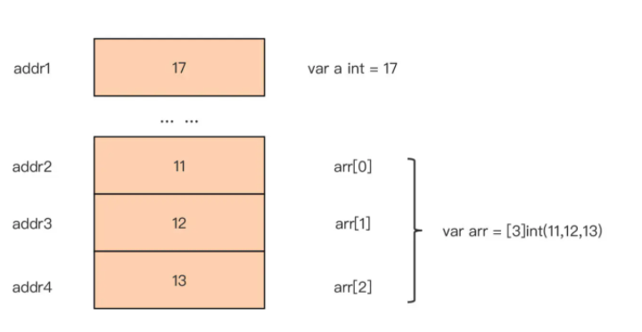
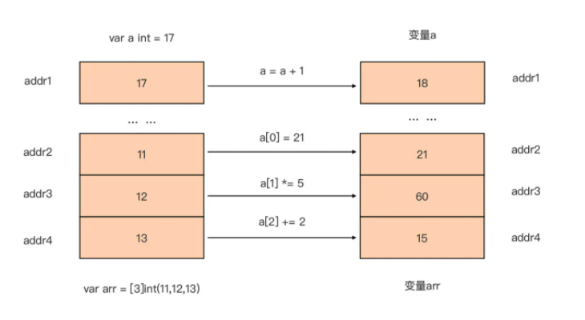
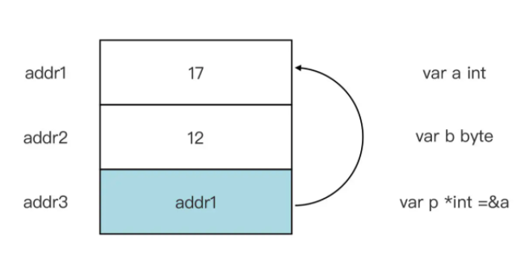
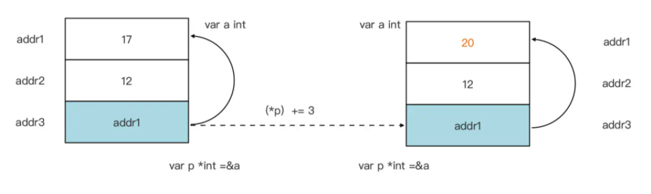
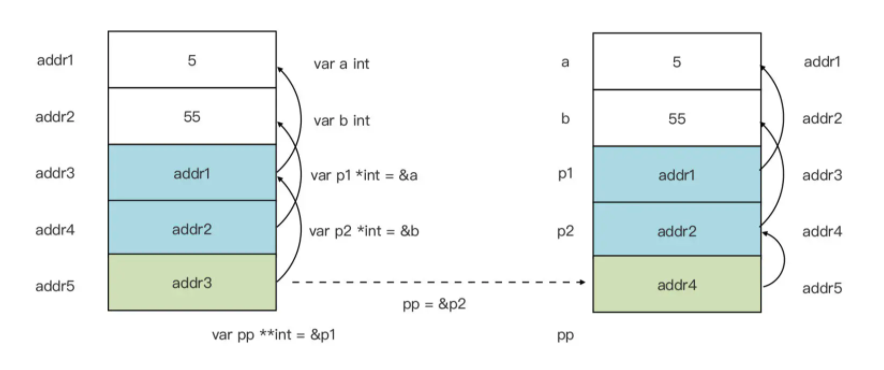
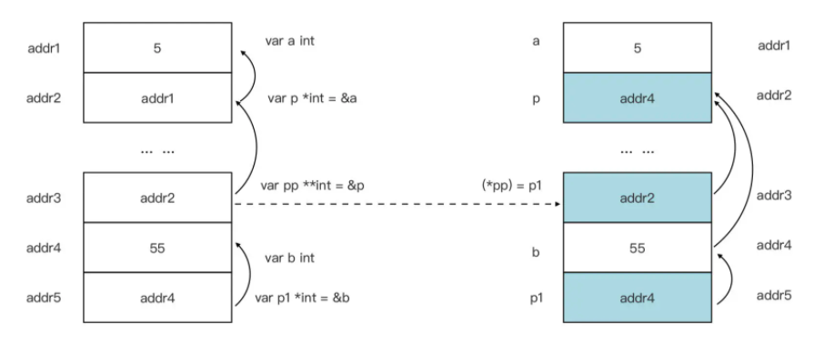

# Go Pointer

> go 语言的指针

如果是编程初学者，或者只有动态语言的经验，又或者只有像 Java 这类不支持指针的静态语言编程的经验，缺少指针的讲解就可能会给学习过程带来一些困惑。

那么什么是指针呢？它和常见的 Go 类型，比如 int、string、切片类型等有什么区别呢？

## 什么是指针类型

和学过的所有类型都不同，指针类型是依托某一个类型而存在的，比如：一个整型为 int，那么它对应的整型指针就是 *int，也就是在 int 的前面加上一个星号。

没有 int 类型，就不会有 *int 类型。而 int 也被称为 *int 指针类型的基类型。

泛化一下指针类型的这个定义：如果拥有一个类型 T，那么以 T 作为基类型的指针类型为 *T。

声明一个指针类型变量的语法与非指针类型的普通变量是一样的，以声明一个 *T 指针类型的变量为例：

```go
var p *T
```

不过 Go 中也有一种指针类型是例外，它不需要基类型，它就是 unsafe.Pointer。

unsafe.Pointer 类似于 C 语言中的 void*，用于**表示一个通用指针类型**，也就是任何指针类型都可以显式转换为一个 unsafe.Pointer，而 unsafe.Pointer 也可以显式转换为任意指针类型，如下面代码所示：

```go
var p *T

var p1 = unsafe.Pointer(p) // 任意指针类型显式转换为unsafe.Pointer

p = (*T)(p1)               // unsafe.Pointer也可以显式转换为任意指针类型
```

unsafe.Pointer 是 Go 语言的高级特性，在 Go 运行时与 Go 标准库中 unsafe.Pointer 都有着广泛的应用。

但 unsafe.Pointer 属于 unsafe 编程范畴，这里就不深入了。

如果指针类型变量没有被显式赋予初值，那么它的**值为 nil**：

```go
var p *T
println(p == nil) // true
```

那么，如果要给一个指针类型变量赋值，该怎么做呢？

以一个整型指针类型为例来看一下：

```go
var a int = 13
var p *int = &a  // 给整型指针变量p赋初值
```

在这个例子中，用&a作为 *int 指针类型变量 p 的初值，这里变量 a 前面的**&符号称为取地址符号**，这一行的含义就是将变量 a 的地址赋值给指针变量 p。

这里要注意，只能使用基类型变量的地址给对应的指针类型变量赋值，如果类型不匹配，Go 编译器是会报错的，比如下面这段代码：

```go
var b byte = 10
var p *int = &b // Go编译器报错：cannot use &b (value of type *byte) as type *int in variable declaration 
```

到这里，可以看到：指针类型变量的值与之前所了解的任何类型的值都不同，那它究竟有什么特别之处呢？

学习过如何在 Go 中声明一个变量。每当声明一个变量，Go 都会为变量分配对应的内存空间。如果声明的是非指针类型的变量，那么 Go 在这些变量对应的内存单元中究竟存储了什么呢？

以最简单的整型变量为例，看看对应的**内存单元存储的内容**：



可以看到，对于非指针类型变量，Go 在对应的内存单元中放置的就是该变量的值。对这些变量进行修改操作的结果，也会直接体现在这个内存单元上，如下图所示：



那么，指针类型变量在对应的内存空间中放置的又是什么呢？

还以 *int 类型指针变量为例，下面这张示意图就展示了该变量对应内存空间存储的值究竟是什么：



从图中看到，Go 为指针变量 p 分配的内存单元中存储的是整型变量 a 对应的内存单元的地址。也正是由于**指针类型变量存储的是内存单元的地址**，指针类型变量的大小与其基类型大小无关，而是和系统地址的表示长度有关。比如下面例子：

```go
package main

import "unsafe"

type foo struct {
	id   string
	age  int8
	addr string
}

func main() {
	var p1 *int
	var p2 *bool
	var p3 *byte
	var p4 *[20]int
	var p5 *foo
	var p6 unsafe.Pointer

	println(unsafe.Sizeof(p1)) // 8
	println(unsafe.Sizeof(p2)) // 8
	println(unsafe.Sizeof(p3)) // 8
	println(unsafe.Sizeof(p4)) // 8
	println(unsafe.Sizeof(p5)) // 8
	println(unsafe.Sizeof(p6)) // 8
}
```

这里的例子通过 unsafe.Sizeof 函数来计算每一个指针类型的大小，可以看到，无论指针的基类型是什么，不同类型的指针类型的大小在同一个平台上是一致的。

在 x86-64 平台上，地址的长度都是 8 个字节。unsafe 包的 Sizeof 函数原型如下：

```go
func Sizeof(x ArbitraryType) uintptr
```

这个函数的**返回值类型是 uintptr**，这是一个 Go 预定义的标识符。

通过 go doc 可以查到这一类型代表的含义：uintptr 是一个整数类型，它的大小足以容纳任何指针的比特模式（bit pattern）。这句话比较拗口，也不好理解。

换个方式，可以将这句话理解为：在 Go 语言中 uintptr 类型的大小就代表了指针类型的大小。一旦指针变量得到了正确赋值，也就是指针指向某一个合法类型的变量，就可以通过指针读取或修改其指向的内存单元所代表的基类型变量，比如：

```go
var a int = 17
var p *int = &a
println(*p) // 17 

(*p) += 3
println(a)  // 20
```

用一副示意图来更直观地表示这个过程：



通过指针变量读取或修改其指向的内存地址上的变量值，这个操作被称为**指针的解引用（dereference）**。

它的形式就是在指针类型变量的前面加上一个星号，就像前面的例子中那样。从上面的例子和图中，都可以看到，通过解引用输出或修改的，并不是指针变量本身的值，而是指针指向的内存单元的值。

要输出指针自身的值，也就是指向的内存单元的地址，可以使用 Printf 通过 %p 来实现：

```go
fmt.Printf("%p\n", p) // 0xc0000160d8
```

**指针变量可以变换其指向的内存单元**，对应到语法上，就是为指针变量重新赋值，比如下面代码：

```go
var a int = 5
var b int = 6

var p *int = &a  // 指向变量a所在内存单元
println(*p)      // 输出变量a的值
p = &b           // 指向变量b所在内存单元
println(*p)      // 输出变量b的值
```

多个指针变量可以指向同一个变量的内存单元，这样通过其中一个指针变量对内存单元的修改，是可以通过另外一个指针变量的解引用反映出来的，比如下面例子：

```go
var a int = 5
var p1 *int = &a // p1指向变量a所在内存单元
var p2 *int = &a // p2指向变量a所在内存单元
(*p1) += 5       // 通过p1修改变量a的值
println(*p2)     // 10 对变量a的修改可以通过另外一个指针变量p2的解引用反映出来
```

讲到这里，应该对指针的概念有一定的了解了。

不过，可能会问：既然指针变量也作为一个内存单元存储在内存中，那么是否可以被其他指针变量指向呢？

好，下面我们就来回答这个问题！

## 二级指针

首先剧透一下：可以！来看下面这个例子：

```go
package main

func main() {
    var a int = 5
    var p1 *int = &a
    println(*p1) // 5
  
    var b int = 55
    var p2 *int = &b
    println(*p2) // 55

    var pp **int = &p1
    println(**pp) // 5
    pp = &p2      
    println(**pp) // 55
}  
```

在这个例子中，声明了两个 *int 类型指针 p1 和 p2，分别指向两个整型变量 a 和 b，还声明了一个 **int 型的指针变量 pp，它的初值为指针变量 p1 的地址。之后用 p2 的地址为 pp 变量作了重新赋值。

通过下面这个示意图，能更容易理解这个例子（注意：这里只是示意图，并非真实内存布局图）：



可以看到，**int 类型的变量 pp 中存储的是 *int 型变量的地址，这和前面的 *int 型变量存储的是 int 型变量的地址的情况，其实是一种原理。**

int 被称为二级指针，也就是指向指针的指针，那自然，可以理解 *int 就是一级指针了。前面说过，对一级指针解引用，得到的其实是指针指向的变量。而对二级指针 pp 解引用一次，得到将是 pp 指向的指针变量：

```go
println((*pp) == p1) // true
```

那么对 pp 解引用二次，将得到啥呢？对 pp 解引用两次，其实就相当于对一级指针解引用一次，得到的是 pp 指向的指针变量所指向的整型变量：

```go
println((**pp) == (*p1)) // true
println((**pp) == a)     // true
```

那么二级指针通常用来做什么呢？

知道一级指针常被用来改变普通变量的值，那么可以推断，**二级指针就可以用来改变指针变量的值**，也就是指针变量的指向。

前面提到过，在同一个函数中，改变指针的指向十分容易，只需要给一级指针重新赋值为另外一个变量的地址就可以了。但是，如果需要**跨函数改变一个指针变量的指向**，就不能选择一级指针类型作为形参类型了。因为一级指针只能改变普通变量的值，无法改变指针变量的指向。

只能选择二级指针类型作为形参类型。来看一个例子：

```go
package main

func foo(pp **int) {
    var b int = 55
    var p1 *int = &b
    (*pp) = p1
}

func main() {
    var a int = 5
    var p *int = &a
    println(*p) // 5
  
    foo(&p)
    println(*p) // 55
}
```

对应这段代码的示意图如下（注意：仅是示意图，不是内存真实布局（这个图的右边有点问题））：



在这个例子中可以看到，通过二级指针 pp，改变的是它指向的一级指针变量 p 的指向，从指向变量 a 的地址变为指向变量 b 的地址。

即便有图有真相，可能也会觉得理解二级指针还是很困难，这很正常。无论是学习 C 还是学习 Go，又或是其他带有指针的静态编程语言，二级指针虽然仅仅是增加了一个“间接环节”，但理解起来都十分困难，这也是二级指针在 Go 中很少使用的原因。

至于三级指针或其他多级指针，更是要慎用，对它们的使用会大幅拉低 Go 代码的可读性。接下来再来看看指针在 Go 中的用途以及使用上的限制。

## Go 中的指针用途与使用限制

Go 是带有垃圾回收的编程语言，指针在 Go 中依旧位于 C 位，它的作用不仅体现在语法层面上，更体现在 Go 运行时层面，尤其是**内存管理与垃圾回**收这两个地方，这两个运行时机制只关心指针。

在语法层面，相对于“指针为王”的 C 语言来说，Go 指针的使用要少不少，这很大程度上是因为 Go 提供了更灵活和高级的复合类型，比如切片、map 等，并将使用指针的复杂性隐藏在运行时的实现层面了。

这样，Go 程序员自己就不需要在语法层面通过指针来实现这些高级复合类型的功能。

指针无论是在 Go 中，还是在其他支持指针的编程语言中，存在的意义就是为了是**“可改变”**。

在 Go 中，使用 *T 类型的变量调用方法、以 *T 类型作为函数或方法的形式参数、返回 *T 类型的返回值等的目的，也都是因为指针可以改变其指向的内存单元的值。当然，指针的好处，还包括它传递的开销是常数级的（在 x86-64 平台上仅仅是 8 字节的拷贝），可控可预测。

无论指针指向的是一个字节大小的变量，还是一个拥有 10000 个元素的[10000]int 型数组，**传递指针的开销都是一样的**。

不过，虽然 Go 在语法层面上保留了指针，但 Go 语言的目标之一是成为一门**安全的**编程语言，因此，它对指针的使用做了一定的限制，包括这两方面：

### 限制一：限制了显式指针类型转换

在 C 语言中，可以像下面代码这样实现显式指针类型转换：

```c
#include <stdio.h>
  
int main() {
    int a = 0x12345678;
    int *p = &a;
    char *p1 = (char*)p; // 将一个整型指针显式转换为一个char型指针
    printf("%x\n", *p1); 
}
```

但是在 Go 中，这样的显式指针转换会得到 Go 编译器的报错信息：

```go
package main

import (
    "fmt"
    "unsafe"
)

func main() {
    var a int = 0x12345678
    var pa *int = &a
    var pb *byte = (*byte)(pa) // 编译器报错：cannot convert pa (variable of type *int) to type *byte
    fmt.Printf("%x\n", *pb)
}
```

如果“一意孤行”，非要进行这个转换，Go 也提供了 unsafe 的方式，因为需要使用到 unsafe.Pointer，如下面代码：

```go
func main() {                                                                         
    var a int = 0x12345678                                                            
    var pa *int = &a                                                                  
    var pb *byte = (*byte)(unsafe.Pointer(pa)) // ok
    fmt.Printf("%x\n", *pb) // 78                                                          
} 
```

如果使用 unsafe 包中类型或函数，代码的安全性就要由开发人员自己保证，也就是开发人员得明确知道自己在做啥！

### 限制二：不支持指针运算。

指针运算是 C 语言的大杀器，在 C 语言中，可以通过指针运算实现各种高级操作，比如简单的**数组元素的遍历**：

```c
#include <stdio.h>
  
int main() {
    int a[] = {1, 2, 3, 4, 5};
    int *p = &a[0];
    for (int i = 0; i < sizeof(a)/sizeof(a[0]); i++) {
            printf("%d\n", *p);
            p = p + 1; 
    }
}
```

但指针运算也是安全问题的“滋生地”。为了安全性，Go 在语法层面抛弃了指针运算这个特性。在 Go 语言中，下面的代码将得到 Go 编译器的报错信息：

```go
package main

func main() {
    var arr = [5]int{1, 2, 3, 4, 5}
    var p *int = &arr[0]
    println(*p)
    p = p + 1  // 编译器报错：cannot convert 1 (untyped int constant) to *int
    println(*p)
}
```

如果非要做指针运算，Go 依然提供了 unsafe 的途径，比如下面**通过 unsafe 遍历数组**的代码：

```go
package main

import "unsafe"

func main() {
    var arr = [5]int{11, 12, 13, 14, 15}
    var p *int = &arr[0]
    var i uintptr
    for i = 0; i < uintptr(len(arr)); i++ {
        p1 := (*int)(unsafe.Pointer(uintptr(unsafe.Pointer(p)) + i*unsafe.Sizeof(*p)))
        println(*p1)
    }           
}
```

上面这段代码就通过 unsafe.Pointer 与 uintptr 的相互转换，间接实现了“指针运算”。

但即便可以使用 unsafe 方法实现“指针运算”，Go 编译器也不会为开发人员提供任何帮助，开发人员需要自己告诉编译器要加减的绝对地址偏移值，而不是像前面 C 语言例子中那样，可以根据指针类型决定指针运算中数值 1 所代表的实际地址偏移值。

## 小结

指针变量是一种在它对应的内存单元中，存储另外一个变量 a 对应的内存单元地址的变量，也称该指针指向变量 a。

指针类型通常需要依托某一类型而存在，unsafe 包的 Pointer 类型是个例外。

指针变量的声明与普通变量别无二异，可以用一个指针的基类型的变量的地址，为指针变量赋初值。如果指针变量没有初值，那它的默认值为 nil。通过对指针变量的解引用，可以读取和修改其指向的变量的值。

可以声明指向指针的指针变量，这样的指针被称为二级指针。二级指针可以用来改变指针变量的值，也就是指针变量的指向。不过二级指针以及多级指针很难理解，一旦使用会降低代码的可读性，建议一定要慎用。

另外，出于内存安全性的考虑，Go 语言对指针的使用做出了限制，不允许在 Go 代码中进行显式指针类型转换以及指针运算，当然可以通过 unsafe 方式实现这些功能，但在使用 unsafe 包的类型与函数时，一定要知道自己正在做什么，确保代码的正确性。


