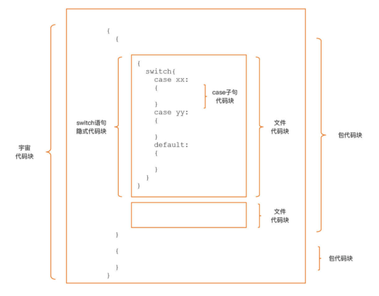
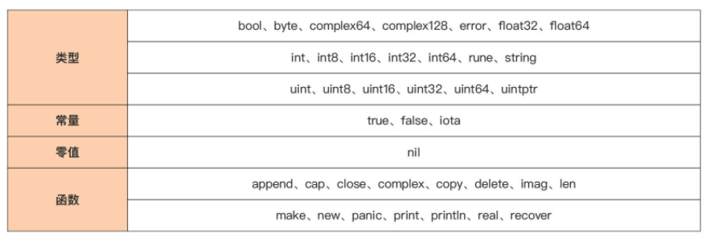

# Variable Block Scope

>Go 程序的代码块与作用域

## Go 变量遮蔽（Variable Shadowing）的问题

什么是变量遮蔽呢？来看下面这段示例代码：

```go
package main

import "fmt"

var a = 11

func foo(n int) {
   a := 1
   a += n
}

func main() {
   fmt.Println("a = ", a)  // 11
   foo(5)
   fmt.Println("after calling foo, a = ", a)  // 11
}
```

在这段代码中，函数 foo 调用前后，包级变量 a 的值都没有发生变化。

这是因为，虽然 foo 函数中也使用了变量 a，但是 foo 函数中的变量 a 遮蔽了外面的包级变量 a，这使得包级变量 a 没有参与到 foo 函数的逻辑中，所以就没有发生变化了。 

变量遮蔽是 Go 开发人员在日常开发工作中最容易犯的编码错误之一，它低级又不容易查找，常常会陷入漫长的调试过程。

上面的示例较为简单，可以通过肉眼很快找到问题所在，但一旦遇到更为复杂的变量遮蔽的问题，就可能会被折腾很久，甚至只能通过 工具才能帮助捕捉问题所在。 

变量遮蔽只是个引子，真正想说的是**代码块（Block，也可译作词法块）**和**作用域 （Scope）**这两个概念，因为要想彻底保证不出现变量遮蔽问题，需要深入了解这两个概念以及其背后的规则。 


## 代码块与作用域 

### 代码块

先来解析一下 Go 里面的代码块。 

#### 空代码块

Go 语言中的代码块是包裹在一对大括号内部的声明和语句序列，如果一对大括号内部没有任何声明或其他语句，我们就把它叫做**空代码块**。

Go 代码块支持嵌套，可以在一个代 码块中嵌入多个层次的代码块，如下面示例代码所示：

```go
func foo() {  // 代码块1
   {  // 代码块2
      {  // 代码块3
         {  // 代码块4
            
         }
      }
   }
}
```

在这个示例中，函数 foo 的函数体是最外层的代码块，这里将它编号为“代码块 1”。而且，在它的函数体内部，又嵌套了三层代码块，由外向内看分别为代码块 2、代码块 3 以及代码块 4。 

#### 显式代码块（Explicit Blocks）

像代码块 1 到代码块 4 这样的代码块，它们都是由两个肉眼可见的且配对的大括号包裹起来的，称这样的代码块为**显式代码块（Explicit Blocks）**。

#### 隐式代码块（Implicit Block）

既然提到了显式代码块，肯定也不能忽略另外一类代码块的存在，也就是**隐式代码块（Implicit Block）**。

顾名思义，隐式代码块没有显式代码块那样的肉眼可见的配对大括号包裹，无法通过大括号来识别隐式代码块。 

虽然隐式代码块身着“隐身衣”，但也不是没有方法来识别它，因为 Go 语言规范对现存的几类隐式代码块做了明确的定义，可以先花一两分钟看看下面这张图。



按代码块范围从大到小，逐一说明一下。 

- **宇宙代码块（Universe Block）**
  - 首当其冲的就是位于最外层的宇宙代码块（Universe Block），它囊括的范围最大，所有 Go 源码都在这个隐式代码块中，也可以将该隐式代码块想象为在所有 Go 代码的最外层加一对大括号，就像图中最外层的那对大括号那样。
- **包代码块（Package Block）**
  - 在宇宙代码块内部嵌套了包代码块（Package Block），每个 Go 包都对应一个隐式包代码块，每个包代码块包含了该包中的所有 Go 源码，不管这些代码分布在这个包里的多少个的源文件中。 
- **文件代码块（File Block）**
  - 再往里面看，在包代码块的内部嵌套着若干文件代码块（File Block），每个 Go 源文件都对应着一个文件代码块，也就是说一个 Go 包如果有多个源文件，那么就会有多个对 应的文件代码块。 
- **控制语句层面  if、for 与 switch**
  - 再下一个级别的隐式代码块就在控制语句层面了，包括 if、for 与 switch。可以把每个控制语句都视为在它自己的隐式代码块里。不过要注意，这里的控制语句隐式代码块与控制语句使用大括号包裹的显式代码块并不是一个代码块。
  - 再看一下前面的图， switch 控制语句的隐式代码块的位置是在它显式代码块的外面的。 
- **switch 或 select 语句的每个 case/default 子句**
  - 最后，位于最内层的隐式代码块是 switch 或 select 语句的每个 case/default 子句中，虽然没有大括号包裹，但实质上，每个子句都自成一个代码块。 

### 作用域

有了这些代码块的概念后，能更好理解作用域的概念了。

作用域的概念是**针对标识符**的，不局限于变量。每个标识符都有自己的作用域，而一个标识符的作用域就是指这个标 识符在被声明后可以被有效使用的源码区域。

显然，作用域是一个**编译期的概念**，也就是说，编译器在编译过程中会对每个标识符的作用域进行检查，对于在标识符作用域外使用该标识符的行为会给出编译错误的报错。 

不过，可以使用代码块的概念来划定每个标识符的作用域。这个划定原则是什么呢？ 

原则就是**声明于外层代码块中的标识符，其作用域包括所有内层代码块**。而且，这一原则 同时适于显式代码块与隐式代码块。

现在，对照上面的示意图，再举一些典型的例子。 

#### 宇宙隐式代码块的标识符

- 首先，来看看位于最外层的**宇宙隐式代码块的标识符**。 
  - 先来看第一个问题：要怎么声明这一区域的标识符呢？ 
    - 这个问题的答案是，并不能声明这一块的标识符，因为这一区域是 Go 语言预定义标识符的自留地。
    - 这里整理了 Go 语言当前版本定义里的所有**预定义标识符**，可以看看。
    - 
    - 由于这些预定义标识符位于包代码块的外层，所以它们的作用域是范围最大的，对于开发者而言，它们的作用域就是源代码中的任何位置。
    - 不过，这些预定义标识符不是关键字， 同样可以在内层代码块中声明同名的标识符。 

#### 包代码块级作用域

- 那现在第二个问题就来了：既然宇宙代码块里存在预定义标识符，而且宇宙代码块的下一层是包代码块，那还有哪些标识符具有**包代码块级作用域**呢？ 
  - 答案是，包顶层声明中的常量、类型、变量或函数（不包括方法）对应的标识符的作用域是包代码块。
  - 不过，对于作用域为包代码块的标识符，需要知道一个特殊情况。那就是当一个包 A 导入另外一个包 B 后，包 A 仅可以使用被导入包包 B 中的**导出标识符（Exported Identifier）**。 这是为什么呢？而且，什么是导出标识符呢？ 
  - 按照 Go 语言定义，一个标识符要成为导出标识符需同时具备**两个条件**：
    - 一是这个标识符声明在包代码块中，或者它是一个字段名或方法名；
    - 二是它名字第一个字符是一个大写的 Unicode 字符。
  - 这两个条件缺一不可。 从前面的讲解中，大部分在包顶层声明的标识符都具有包代码块范围的作用域，

#### 文件代码块范围

- 那还有标识符的作用域是**文件代码块范围**的吗？

  - 确实不多了。但还有一个，它就是导入的**包名**。 

  - 也就是说，如果一个包 A 有两个源文件要实现，而且这两个源文件中的代码都依赖包 B 中的标识符，那么这两个源文件都需要导入包 B。 

  - 在源文件层面，去掉拥有包代码块作用域的标识符后，剩余的就都是一个个函数 / 方法的实现了。在这些函数 / 方法体中，标识符作用域划分原则更为简单，因为可以凭借肉眼可见的、配对的大括号来明确界定一个标识符的作用域范围，来看下面这个示例：

  - ```go
    func (t T) M1(x int) (err error) {
       // 代码块1
       m := 13
       // 代码块1 是包含 m、t、x 和 err 四个标识符的最内部代码块
       {
          // 代码块2
          // 代码块2 是包含类型 bar 标识符的最内部的那个包含代码块
          type bar struct{} // 类型标识符 bar 的作用域始于此
          {
             // 代码块3
             // 代码块3 是包含变量 a 标识符的最内部的那个包含代码块
             a := 5 // a 作用域开始于此
             {
                // 代码块4
                // ...
             }
             // a 作用域终止于此
          }
          // 类型标识符 bar 的作用域终止于此
       }
       // m、t、x 和 err 的作用域终止于此
    }
    ```

  - 上面示例中定义了类型 T 的一个方法 M1，方法接收器 (receiver) 变量 t、 函数参数 x，以及返回值变量 err 对应的标识符的作用域范围是 M1 函数体对应的显式代码块 1。

  - 虽然 t、x 和 err 并没有被函数体的大括号所显式包裹，但它们属于函数定义的一部分，所以作用域依旧是代码块 1。 

  - 说完了函数体外部的诸如函数参数、返回值等元素的作用域后，现在就来分析函数体内部的那些语法元素。

    - **函数内部声明的常量或变量对应的标识符的作用域范围**开始于常量或变量声明语句的末尾，并终止于其最内部的那个包含块的末尾。
    - 在上述例子中，变量 m、自定义类型 bar 以及在代码块 3 中声明的变量 a 均符合这个划分规则。 

#### 控制语句隐式代码块中的标识符

- 接下来，再看看位于控制语句隐式代码块中的标识符的作用域划分。以下面这个 **if 条件分支语句**为例来分析一下：

  - ```go
    func bar() {
       if a := 1; false {
    
       } else if b := 2; false {
    
       } else if c := 3; false {
    
       } else {
          println(a, b, c)
       }
    }
    ```

  - 这是一个复杂的“if - else if - else”条件分支语句结构，根据前面讲过的隐式代码块规则，将上面示例中隐式代码块**转换为显式代码块**后，会得到下面这段等价的代码：

  - ```go
    func bar() {
       { // 等价于第一个 if 的隐式代码块
          a := 1 // 变量 a 作用域始于此
          if false {
    
          } else {
             { // 等价于第一个 else if 的隐式代码块
                b := 2 // 变量 b 作用域始于此
                if false {
    
                } else {
                   { // 等价于第二个 else if 的隐式代码块
                      c := 3 // 变量 c 作用域始于此
                      if false {
    
                      } else {
                         println(a, b, c)
                      }
                      // 变量 c 作用域终止于此
                   }
                }
                // 变量 b 作用域终止于此
             }
          }
          // 变量 a 作用域终止于此
       }
    }
    ```

  - 经过这么一个等价转换，各个声明于 if 表达式中的变量的作用域就变得一目了然了。

  - 声明于不同层次的隐式代码块中的变量 a、b 和 c 的实际作用域都位于最内层的 else 显式代码块之外，于是在 println 的那个显式代码块中，变量 a、b、c 都是合法的， 而且还保持了初始值。 

好了，到这里已经了解代码块与作用域的概念与规则了，那么要怎么利用这些知识避免在实际编码中的变量遮蔽问题呢？避免变量遮蔽的原则又是什么呢？ 


## 避免变量遮蔽的原则 

变量是标识符的一种，所以前面说的标识符的作用域规则同样适用于变量。

一个变量的作用域起始于其声明所在的代码块，并且可以一直扩展到嵌入到该代码块中的所有内层代码块，而正是这样的作用域规则，成为了滋生“变 量遮蔽问题”的土壤。 

变量遮蔽问题的根本原因，就是**内层代码块中声明了一个与外层代码块同名且同类型的变量**，这样，内层代码块中的同名变量就会替代那个外层变量，参与此层代码块内的相关计算，也就说内层变量遮蔽了外层同名变量。

### 变量遮蔽示例

现在，先来看一下这个示例代码，它就存在着多种变量遮蔽的问题：

```go
package main

import (
   "errors"
   "fmt"
)

var a int = 2020

func checkYear() error {
   err := errors.New("wrong year")
   switch a, err := getYear(); a {
   case 2020:
      fmt.Println("it is", a, err)
   case 2021:
      fmt.Println("it is", a)
      err = nil
   }
   fmt.Println("after check, it is", a)
   return err
}

type new int

func getYear() (new, error) {
   var b int16 = 2021
   return new(b), nil
}

func main() {
   err := checkYear()
   if err != nil {
      fmt.Println("call checkYear error:", err)
      return
   }
   fmt.Println("call checkYear ok")
}
```

这个变量遮蔽的例子还是有点复杂的，为了讲解方便，给代码加上了行编号。首先运行一下这个例子：

```sh
$go run complexvariableshadowing.go
it is 2021
after check, it is 2020
call checkYear error: wrong year
```

可以看到，第 20 行定义的 getYear 函数返回了正确的年份 (2021)，但是 checkYear 在结尾却输出“after check, it is 2020”，并且返回的 err 并非为 nil，这显然是变量遮蔽 的“锅”！ 

根据前面给出的变量遮蔽的根本原因，来“找找茬”，看看上面这段代码究竟有 几处变量遮蔽问题（包括标识符遮蔽问题）。

### 遮蔽预定义标识符

第一个问题：遮蔽预定义标识符。 

面对上面代码，一眼就看到了位于第 18 行的 **new，这本是 Go 语言的一个预定义标识符**，但上面示例代码呢，却用 new 这个名字定义了一个新类型，于是 new 这个标识符就被遮蔽了。

如果这个时候在 main 函数下方放上下面代码：

```go
p := new(int)
*p = 11
```

就会收到 Go 编译器的错误提示：“type int is not an expression”，如果没有意识到 new 被遮蔽掉，这个提示就会不知所措。

不过，在上面示例代码中，遮蔽 new 并不是示例未按预期输出结果的真实原因，还得继续往下看。

### 遮蔽包代码块中的变量

这时发现了第二个问题：遮蔽包代码块中的变量。 

位于第 13 行的 **switch 语句在它自身的隐式代码块中**，通过短变量声明形式重新声明了一个变量 a，这个**变量 a 就遮蔽了外层包代码块中的包级变量 a**，这就是打印“after check, it is 2020”的原因。

包级变量 a 没有如预期那样被 getYear 的返回值赋值为正确的年份 2021，2021 被赋值给了遮蔽它的 switch 语句隐式代码块中的那个新声明的 a。

### 遮蔽外层显示代码块中的变量

不过，同一行里，其实还有第三个问题：遮蔽外层显式代码块中的变量。 

同样还是第 7 行的 switch 语句，除了声明一个新的变量 a 之外，它还**声明了一个名为 err 的变量**，这个变量就遮蔽了第 4 行 checkYear 函数在显式代码块中声明的 err 变量，这导致第 12 行的 nil 赋值动作作用到了 switch 隐式代码块中的 err 变量上，而不是外层 checkYear 声明的本地变量 err 变量上，后者并非 nil，这样 checkYear 虽然从 getYear 得到了正确的年份值，但却返回了一个错误给 main 函数，这直接导致了 main 函数打印了错误：“call checkYear error: wrong year”。 

通过这个示例，也可以看到，短变量声明与控制语句的结合十分容易导致变量遮蔽问题，并且很不容易识别，因此在日常 go 代码开发中要尤其注意两者结合使用的地方。 

不过，依靠肉眼识别变量遮蔽问题终归不是长久之计，有没有工具可以帮助识别这类 问题呢？其实是有的。


## 利用工具检测变量遮蔽问题 

Go 官方提供了 **go vet 工具**可以用于对 Go 源码做一系列静态检查，在 Go 1.14 版以前默认支持变量遮蔽检查，Go 1.14 版之后，变量遮蔽检查的插件就需要单独安装了，安装方法如下：

```sh
$go1.16.5 install golang.org/x/tools/go/analysis/passes/shadow/cmd/shadow@latest
go: downloading golang.org/x/tools v0.1.8
go: downloading golang.org/x/sys v0.0.0-20211019181941-9d821ace8654
```

一旦安装成功，就可以通过 **go vet 扫描代码并检查**这里面有没有变量遮蔽的问题了。 

现在就来检查一下前面的示例代码，看看效果怎么样。执行检查的命令如下：

```sh
$go1.16.5 vet -vettool=$(which shadow) -strict complexvariableshadowing.go
# command-line-arguments
./complexvariableshadowing.go:13:12: declaration of "err" shadows declaration at line 11
```

go vet 只给出了 err 变量被遮蔽的提示，变量 a 以及预定义标识符 new 被遮 蔽的情况并没有给出提示。

可以看到，工具确实可以辅助检测，但也不是万能的，不能穷尽找出代码中的所有问题，所以还是要深入理解代码块与作用域的概念，尽可能在日常 编码时就主动规避掉所有遮蔽问题。


## 小结 

两个变量相关的概念：代码块与作用域。 

- 代码块有显式与隐式之分，
  - 显式代码块就是包裹在一对配对大括号内部的语句序列，
  - 而隐 式代码块则不容易肉眼分辨，它是通过 Go 语言规范明确规定的。
  - 隐式代码块有五种，分别是宇宙代码块、包代码块、文件代码块、分支控制语句隐式代码块，以及 switch/select 的子句隐式代码块，理解隐式代码块是理解代码块概念以及后续作用域概念的前提与基 础。 
- 作用域的概念是 Go 源码编译过程中标识符（包括变量）的一个属性。
  - Go 编译器会校验每个标识符的作用域，如果它的使用范围超出其作用域，编译器会报错。 
  - 不过呢，可以使用代码块的概念来划定每个标识符的作用域。
  - 划定原则就是声明于外层代码块中的标识符，其作用域包括所有内层代码块。
  - 但是，Go 的这种作用域划定也带来了变量遮蔽问题。

简单的遮蔽问题，通过分析代码可以很快找出，复杂的遮蔽问题， 即便是通过 go vet 这样的静态代码分析工具也难于找全。 

因此，只有了解变量遮蔽问题本质，在日常编写代码时注意同名变量的声明，注意短变量声明与控制语句的结合，才能从根源上尽量避免变量遮蔽问题的发生。


