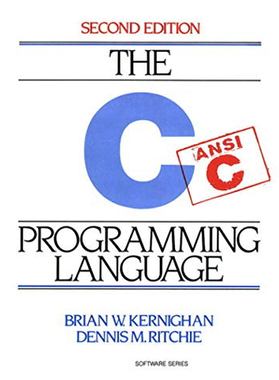

# Hello World

## Hello world 源起

程序员这个历史并不算悠久的行当，却有着一个历史悠久的传统，那就是每种编程语言都 将一个名为“hello, world”的示例作为这门语言学习的第一个例子，这个传统始于 20 世 纪 70 年代那本大名鼎鼎的由布莱恩·科尼根（Brian W. Kernighan）与 C 语言之父丹尼斯· 里奇（Dennis M. Ritchie）合著的《C 程序设计语言》。



## Go 的命名规则

Go 的命名规则。Go 源文件总是用全小写字母形式的短小单词命名，并且以.go 扩展名结尾。

> 对于文件夹的名字，也遵循这一规则。

如果要在源文件的名字中使用多个单词，通常直接是将多个单词连接起来作为源文件 名，而不是使用其他分隔符，比如下划线。也就是说，通常使用 helloworld.go 作为 文件名而不是 hello_world.go。 

这是因为下划线这种分隔符，在 Go 源文件命名中有特殊作用，这个会在以后的讲解 中详细说明。总的来说，尽量不要用两个以上的单词组合作为文件名，否则就很难分 辨了。 


## Go 的代码风格（Gofmt）

Go 语言内置了一套 Go 社区约定俗称的代码风格，并随安装包提供了一个名为 Gofmt 的工具，这个工具可以将代码自动格式化为约定的风格。

Gofmt 是 Go 语言在解决规模化（scale）问题上的一个最佳实践，并成为了 Go 语言吸引 其他语言开发者的一大卖点。很多其他主流语言也在效仿 Go 语言推出自己的 format 工 具，比如：Java formatter、Clang formatter、Dartfmt 等。

因此，作为 Go 开发人员， 请在提交代码前使用 Gofmt 格式化 Go 源码。 

在 Go 语言中，只有首字母为大写的标识符（fmt.Println()）是导出的 （Exported），才能对包外的代码可见；如果首字母是小写的，那么就说明这个标识符仅限于在声明它的包内可见。


## Go 的语法规范

最后，整个Hello world 示例程序源码中，都没有使用过分号来标识语句的结束，这与 C、C++、Java 那些传统编译型语言好像不太一样呀？

不过，其实 Go 语言的正式语法规范是使用分号“;”来做结尾标识符的。那为什么很少在 Go 代码中使用和看到分号呢？这是因为，大多数分号都是可选的，常常被省略，不过在源码编译时，Go 编译器会自动插入这些被省略的分号。 

给“hello，world”示例程序加上分号也是完全合法的，是可以直接通过 Go 编译器编译并正常运行的。不过，gofmt 在按约定格式化代码时，会自动删除这些被手工加入的分号的。 


## Hello world 示例

在 Go 语言中编写一个可以打印出“hello，world”的示例程序，只需要简单两步， 一是创建文件夹，二是开始编写和运行。

### 创建“hello，world”文件夹 

通常来说，Go 不会限制存储代码的位置（Go 1.11 之前的版本另当别论）。但是针对 各种练习和项目，建议创建一个可以集合所有项目的根文件夹 （比如：~/goprojects），然后将所有的项目都放在里面。 

现在，可以打开终端并输入相应命令，来创建用于储存“hello，world”示例的文件夹 helloworld 了。

对于 Linux 系统、macOS 系统，以及 Windows 系统的 PowerShell 终端来说，用下面这个命令就可以建立 helloworld 文件夹了：

```sh
$mkdir ~/goprojects // 创建一个可以集合所有项目的根文件夹
$cd ~/goprojects
$mkdir helloworld // 创建存储helloworld示例的文件夹
$cd helloworld

$mkdir main  // 创建 main 文件夹，作为存储 main.go 的文件夹(其实也可以忽不创建，但是需要指定main包)
$cd main
```


### 编写并运行第一个 Go 程序 

首先，需要创建一个名为 main.go 的源文件。 

打开刚刚创建的 main.go 文件，键入下面这些代码：

```go
package main

import "fmt"

func main() {
   fmt.Println("hello, world")
}
```

写完后，保存文件并回到终端窗口，然后在 Linux 或 macOS 系统中，可以通过 输入下面这个命令来编译和运行这个文件了：

```sh
$go build main.go
$./main
hello, world
```

如果是在 Windows 系统中呢，需要把上面命令中的./main 替换为.\main.exe。

```sh
>go build main.go
>.\main.exe
hello, world
```

无论使用哪种操作系统，到这里都应该能看到终端输出的“hello, world”字符串了。

如果没有看到这个输出结果，要么是 Go 安装过程的问题，要么是源文件编辑出现了问题，需要再次认真地确认。如果一切顺利，那么已经完成了第一个 Go 程序，并正式成为了 Go 开发者！欢迎来到 Go 语言的世界！


## “hello，world”示例程序的结构 

现在，来仔细看看“hello，world”示例程序中到底发生了什么。第一个值得注意的部分是这个：

```go
package main
```

这一行代码定义了 Go 中的一个包 package。包是 Go 语言的基本组成单元，通常使用单个的小写单词命名，一个 Go 程序本质上就是一组包的集合。

所有 Go 代码都有自己隶属的包，“hello，world”示例的所有代码都在一个名为 main 的包中。main 包在 Go 中是一个特殊的包，整个 Go 程序中仅允许存在一个名为 main 的包。 main 包中的主要代码是一个名为 main 的函数：

```go
func main() {
   fmt.Println("hello, world")
}
```

这里的 main 函数会比较特殊：当运行一个可执行的 Go 程序的时候，所有的代码都会 从这个入口函数开始运行。

这段代码的第一行声明了一个名为 main 的、没有任何参数和 返回值的函数。如果某天需要给函数声明参数的话，那么就必须把它们放置在圆括号 () 中。 

另外，那对花括号{}被用来标记函数体，Go 要求所有的函数体都要被花括号包裹起来。按照惯例，推荐把左花括号与函数声明置于同一行并以空格分隔。

再来看一看 main 函数体中的代码：

```go
fmt.Println("hello, world")
```

这一行代码已经完成了整个示例程序的所有工作了：将字符串输出到终端的标准输出 （stdout）上。

还有几个需要注意的细节。 

- 注意点 1：标准 Go 代码风格**使用 Tab** 而不是空格来实现缩进的，当然这个代码风格的格 式化工作也可以交由 gofmt 完成。 

- 注意点 2：调用了一个名为 Println 的函数，这个函数位于 Go 标准库的 fmt 包中。 为了在示例程序中使用 fmt 包定义的 Println 函数，其实做了两步操作。 

  - 第一步是在源文件的开始处通过 import 声明导入 fmt 包的包路径：

    - ```go
      import "fmt"
      ```

  - 第二步则是在 main 函数体中，通过 fmt 这个限定标识符（Qualified Identifier）调用 Println 函数。虽然两处都使用了“fmt”这个字面值，但在这两处“fmt”字面值所代表的含义却是不一样的：

    - import “fmt” 一行中“fmt”代表的是包的导入路径（Import），它表示的是标准库下的 **fmt 目录**，整个 import 声明语句的含义是导入标准库 fmt 目录下的包； 
    - fmt.Println 函数调用一行中的“fmt”代表的则是**包名**。

  - 通常导入路径的最后一个分段名与包名是相同的，这也很容易让人误解 import 声明语句中 的“fmt”指的是包名，其实并不是这样的。 

  - main 函数体中之所以可以调用 fmt 包的 Println 函数，还有最后一个原因，那就是 **Println 函数名的首字母是大写**的。在 Go 语言中，只有首字母为大写的标识符才是导出的 （Exported），才能对包外的代码可见；如果首字母是小写的，那么就说明这个标识符仅限于在声明它的包内可见。 

  - 另外，在 Go 语言中，main 包是不可以像标准库 fmt 包那样被导入（Import）的，如果 导入 main 包，在代码编译阶段会收到一个 Go 编译器错误：`import “xx/main” is a program, not an importable package`。 

- 注意点 3：回到 main 函数体实现上，把关注点放在传入到 Println 函数的字符 串“hello, world”上面。传入的字符串也就是执行程序后在终端的标准输出上看到的字符串。 

  - 这种“所见即所得”得益于 Go 源码文件本身采用的是 Unicode 字符集，而且用的是 UTF-8 标准的字符编码方式，这与编译后的程序所运行的环境所使用的字符集和字符编码方式是一致的。 

  - 这里，即便将代码中的"hello, world"换成中文字符串“你好，世界”，像下面这样：

    - ```go
      package main
      
      import "fmt"
      
      func main() {
      	fmt.Println("你好，世界")
      }
      ```

  - 依旧可以在终端的标准输出上看到正确的输出。


## Go 语言中程序是怎么编译的？ 

### go build

在运行"hello, world"程序之前，输入了 go build 命令，还有它附带的源文件名参数来编译它：

```sh
$go build main.go 
```

假如曾经有过 C/C++ 语言的开发背景，那么就会发现这个步骤与 gcc 或 clang 编译 十分相似。一旦编译成功，就会获得一个二进制的可执行文件。在 Linux 系统、 macOS 系统，以及 Windows 系统的 PowerShell 中，可以通过输入下面这个 ls 命 令看到刚刚生成的可执行文件：

```sh
$ls
main* main.go
```

上面显示的文件里面有刚刚创建的、以.go 为后缀的源代码文件，还有刚生成的可执行文件（Windows 系统下为 main.exe，其余系统下为 main）。

如果之前更熟悉某种类似于 Ruby、Python 或 JavaScript 之类的动态语言，可能还不 太习惯在运行之前需要先进行编译的情况。

Go 是一种编译型语言，这意味着只有编译完Go 程序之后，才可以将生成的可执行文件交付于其他人，并运行在没有安装 Go 的环境中。 

而如果交付给其他人的是一份.rb、.py 或.js 的动态语言的源文件，那么目标环境中就必须要拥有对应的 Ruby、Python 或 JavaScript 实现才能解释执行这些源文件。 

### go run

当然，Go 也借鉴了动态语言的一些对开发者体验较好的特性，比如基于源码文件的直接执行，Go 提供了 run 命令可以直接运行 Go 源码文件，比如也可以使用下面命令直接基于 main.go 运行：

```go
$go run main.go
hello, world
```

当然像 go run 这类命令更多用于开发调试阶段，真正的交付成果还是需要使用 go build 命令构建的。 

### 生产环境

但是在生产环境里，Go 程序的编译往往不会像前面，基于单个 Go 源文件构建 类似“hello，world”这样的示例程序那么简单。越贴近真实的生产环境，也就意味着项 目规模越大、协同人员越多，项目的依赖和依赖的版本都会变得复杂。 

那在更复杂的生产环境中，go build 命令也能圆满完成编译任务吗？


## 复杂项目下 Go 程序的编译是怎样的?

### go build

直接上项目，给 go build 一个机会，看看它的复杂依赖管理到底怎么样。 

现在创建一个新项目“hellomodule”，在新项目中将使用两个第三方库，zap 和 fasthttp，给 go build 的构建过程增加一些难度。和“hello，world”示例一样，通过下面命令创建“hellomodule”项目：

```sh
$cd ~/goprojects
$mkdir hellomodule
$cd hellomodule

$mkdir main  // 创建 main 文件夹，作为存储 main.go 的文件夹(其实也可以忽不创建，但是需要指定main包。此次示例，就不创建main文件夹。)
$cd main
```

接着，在“hellomodule“下创建并编辑示例源码文件：

```go
package main

import (
   "github.com/valyala/fasthttp"
   "go.uber.org/zap"
)

var logger *zap.Logger

func init() {
   logger, _ = zap.NewProduction()
}

func fastHTTPHandler(ctx *fasthttp.RequestCtx) {
   logger.Info("hello, go module", zap.ByteString("uri", ctx.RequestURI()))
}

func main() {
   fasthttp.ListenAndServe(":8081", fastHTTPHandler)
}
```

这个示例创建了一个在 8081 端口监听的 http 服务，当向它发起请求后，这个服务会 在终端标准输出上输出一段访问日志。 

会看到，和“hello，world“相比，这个示例显然要复杂许多。但不用担心，现在大 可不必知道每行代码的功用，只需要在这个稍微有点复杂的示例中引入了两个第三方依赖库，zap 和 fasthttp 就可以了。 

尝试一下使用编译“hello，world”的方法来编译“hellomodule”中的 main.go 源 文件，go 编译器的输出结果是这样的：

```sh
$go build main.go
main.go:4:2: cannot find module providing package github.com/valyala/fasthttp: working directory is not part of a module
main.go:5:2: cannot find module providing package go.uber.org/zap: working directory is not part of a module
```

看这结果，这回运气似乎不佳，main.go 的编译失败了！ 

从编译器的输出来看，go build 似乎在找一个名为 go.mod 的文件，来解决程序对第三方包的依赖决策问题。 

### Go module

是时候让 Go module 登场了！ 

Go module 构建模式是在 Go 1.11 版本正式引入的，为的是彻底解决 Go 项目复杂版本依赖的问题，在 Go 1.16 版本中，Go module 已经成为了 Go 默认的包依赖管理机制和 Go 源码构建机制。 

Go Module 的**核心是一个名为 go.mod 的文件**，在这个文件中存储了这个 module 对第三方依赖的全部信息。

接下来，通过下面命令为“hello，module”这个示例程序 添加 go.mod 文件：

```sh
$go mod init github.com/Kate-liu/GoBeginner
go: creating new go.mod: module github.com/Kate-liu/GoBeginner
go: to add module requirements and sums:
	go mod tidy
```

会看到，go mod init 命令的执行结果是在当前目录下生成了一个 go.mod 文件：

```sh
$cat go.mod
module github.com/Kate-liu/GoBeginner

go 1.14
```

其实，**一个 module 就是一个包的集合**，这些包和 module 一起打版本、发布和分发。 go.mod 所在的目录被称为它声明的 module 的根目录。 

不过呢，这个时候的 go.mod 文件内容还比较简单，第一行内容是用于声明 module 路径 （module path）的。

而且，module 隐含了一个命名空间的概念，**module 下每个包的导入路径**都是由 module path 和包所在子目录的名字结合在一起构成。

> 比如，如果 GoBeginner 下有子目录 pkg/pkg1，那么 pkg1 下面的包的导入路径就是由 module path（github.com/Kate-liu/GoBeginner）和包所在子目录的名字 （pkg/pkg1）结合而成，也就是 github.com/Kate-liu/GoBeginner/pkg/pkg1。 

另外，go.mod 的最后一行是一个 Go 版本指示符，用于表示这个 module 是在某个特定的 Go 版本的 module 语义的基础上编写的。 

有了 go.mod 后，是不是就可以构建 hellomodule 示例了呢？ 

执行一下构建，Go 编译器输出结果是这样的：

```sh
$go build main.go
main.go:4:2: no required module provides package github.com/valyala/fasthttp;
	go get github.com/valyala/fasthttp
main.go:5:2: no required module provides package go.uber.org/zap; to add it:
	go get go.uber.org/zap
```

会看到，Go 编译器提示源码依赖 fasthttp 和 zap 两个第三方包，但是 go.mod 中没有这两个包的版本信息，需要按提示手工添加信息到 go.mod 中。 

这个时候，除了按提示手动添加外，也可以使用 go mod tidy 命令，让 Go 工具自动 添加：

```sh
$go mod tidy
go: finding module for package go.uber.org/zap
go: finding module for package github.com/valyala/fasthttp
go: downloading github.com/valyala/fasthttp v1.31.0
go: found github.com/valyala/fasthttp in github.com/valyala/fasthttp v1.31.0
go: found go.uber.org/zap in go.uber.org/zap v1.19.1
go: downloading github.com/klauspost/compress v1.13.4
go: downloading github.com/valyala/bytebufferpool v1.0.0
go: downloading github.com/andybalholm/brotli v1.0.2
```

从输出结果中，看到 Go 工具不仅下载并添加了 GoBeginner 直接依赖的 zap 和 fasthttp 包的信息，还下载了这两个包的相关依赖包(compress/bytebufferpool/brotli)。

go mod tidy 执行后，go.mod 的最新内容变成了这个样子：

```go
module github.com/Kate-liu/GoBeginner

go 1.14

require (
	github.com/valyala/fasthttp v1.31.0
	go.uber.org/zap v1.19.1
)
```

这个时候，go.mod 已经记录了 GoBeginner 直接依赖的包的信息。不仅如此， 目录下还多了一个名为 **go.sum 的文件** (直接使用 Goland，会发现 go.sum 从属于 go.mod)，这个文件记录了 GoBeginner 的 直接依赖和间接依赖包的相关版本的 hash 值，用来校验本地包的真实性。在构建的时候，如果本地依赖包的 hash 值与 go.sum 文件中记录的不一致，就会被拒绝构建。 

有了 go.mod 以及 GoBeginner 依赖的包版本信息后，再来执行构建：

```sh
$go build main.go
$ls
go.mod go.sum main* main.go
```

这次成功构建出了可执行文件 main，运行这个文件，新开一个终端窗口，在新窗口中使用 curl 命令访问该 http 服务：`curl localhost:8081/foo/bar` 或者 `curl 127.0.0.1:8081/foo/bar `，就会看到服务端输 出如下日志：

```sh
$./main
{"level":"info","ts":1639502562.7302542,"caller":"hellomodule/main.go:15","msg":"hello, go module","uri":"/foo/bar"}
```

这下，“ hellomodule”程序可算创建成功了。

使用 Go Module 的构建模式，go build 完全可以承担其构建规模较大、依赖复杂的 Go 项目的重任。


