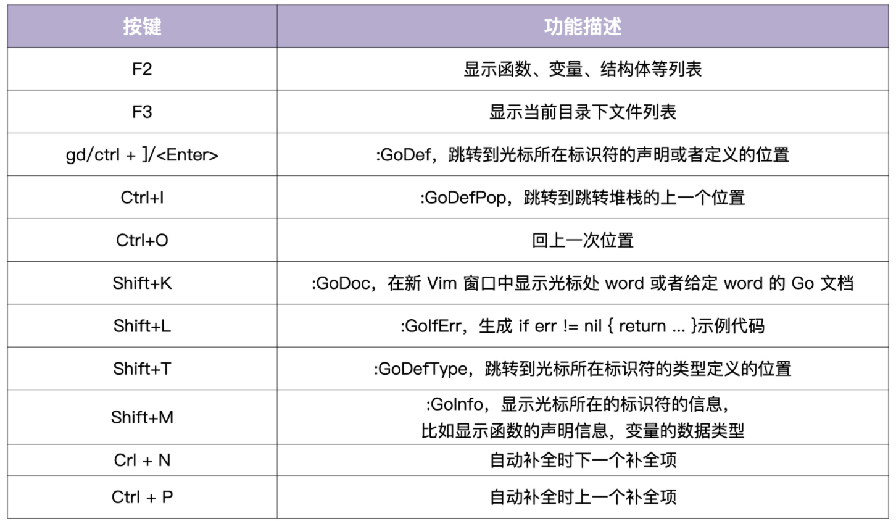

# Install IDE

集成开发环境（Integrated Development Environment，IDE）。


## GoLand

GoLand 是知名 IDE 出品公司 JetBrains 针对 Go 语言推出的 IDE 产品，也是目前市面上最好用的 Go IDE；


## Visual Studio Code（简称 VS Code）

VS Code 则 是微软开源的跨语言源码编辑器，通过集成语言插件（Go 开发者可以使用 Go 官方维护的 vscode-go 插件），可以让它变成类 IDE 的工具。 


## Vim、Emacs

如果有黑客情怀，喜欢像黑客一样优雅高效地使用命令行，那么像 Vim、Emacs 这样的基于终端的编辑器同样可以用于编写 Go 源码。

以 Vim 为例，结合 vim-go、coc.nvim（代码补全）以及 Go 官方维护的 gopls语言服务器，在编写 Go 代码时 同样可以体会到“飞一般”的感觉。


## Vim IDE

可以通过 **SpaceVim** 将 Vim 配置成一个 Go IDE。

SpaceVim 是一个社区驱动的模块化的 Vim IDE，以模块的方式组织管理插件以及相关配置， 为不同的语言开发量身定制了相关的开发模块，该模块提供代码自动补全、 语法检查、格式化、调试、REPL等特性。只需要载入相关语言的模块就能得到一个开箱即用的 Vim IDE 了。

Vim 可以选择 **NeoVim**。

NeoVim 是基于 Vim 的一个 fork 分支，它主要解决了 Vim8 之前版本中的异步执行、开发模式等问题，对 Vim 的兼容性很好。同时对 vim 的代码进行了大量地清理和重构，去掉了对老旧系统的支持，添加了新的特性。

虽然 **Vim8** 后来也新增了异步执行等特性，在使用层面两者差异不大，但是 NeoVim 开发更激进，新特性更多，架构也相对更合理，所以选择了 NeoVim，也可以根据个人爱好来选择（都是很优秀的编辑器，这里不做优缺点比较）。

Vim IDE 的安装和配置主要分五步。

第一步，安装 NeoVim。

直接执行 pip3 和 yum 命令安装即可，安装方法如下：

```bash
$ sudo pip3 install pynvim
$ sudo yum -y install neovim
```

第二步，配置 `$HOME/.bashrc`。

先配置 nvim 的别名为 vi，这样当执行 vi 时，Linux 系统就会默认调用 nvim。同时，配置 EDITOR 环境变量，可以使一些工具，例如 Git 默认使用 nvim。配置方法如下：

```bash
tee -a $HOME/.bashrc <<'EOF'
# Configure for nvim
export EDITOR=nvim  # 默认的编辑器（git 会用到）
alias vi="nvim"
EOF
```

第三步，检查 nvim 是否安装成功。

可以通过查看 NeoVim 版本来确认是否成功安装，如果成功输出版本号，说明 NeoVim 安装成功。

```bash
$ bash
$ vi --version # 输出 NVIM v0.3.8 说明安装成功
NVIM v0.3.8
Build type: RelWithDebInfo
...
```

第四步，离线安装 SpaceVim。

安装 SpaceVim 步骤稍微有点复杂，为了简化安装，同时消除网络的影响，将安装和配置 SpaceVim 的步骤做成了一个离线安装包
marmotVim 。

marmotVim 可以进行 SpaceVim 的安装、卸载、打包等操作，安装步骤如下：

```bash
$ cd /tmp
$ wget https://marmotedu-1254073058.cos.ap-beijing.myqcloud.com/tools/marmotVim.tar.gz
$ tar -xvzf marmotVim.tar.gz
$ cd marmotVim
$ ./marmotVimCtl install
```

SpaceVim 配置文件为：`$HOME/.SpaceVim.d/init.toml` 和`$HOME/.SpaceVim.d/autoload/custom_init.vim`，可自行配置（配置文件中有配置说明）：

- init.toml：SpaceVim 的配置文件
- custom_init.vim：兼容 vimrc，用户自定义的配置文件

SpaceVim Go IDE 常用操作的按键映射如下表所示：



第五步，Go 工具安装。

SpaceVim 会用到一些 Go 工具，比如在函数跳转时会用到 guru、godef 工具，在格式化时会用到 goimports，所以需要安装这些工具。安装方法有 2 种：

1. Vim 底线命令安装：vi test.go，然后执行：`:GoInstallBinaries` 安装。
2. 拷贝工具：直接将整理好的工具文件拷贝到 `$GOPATH/bin` 目录下。

为了方便，可以直接拷贝已经打包好的 Go 工具到指定目录下：

```bash
$ cd /tmp
$ wget https://marmotedu-1254073058.cos.ap-beijing.myqcloud.com/tools/gotools-for-spacevim.tgz
$ mkdir -p $GOPATH/bin
$ tar -xvzf gotools-for-spacevim.tgz -C $GOPATH/bin
```


