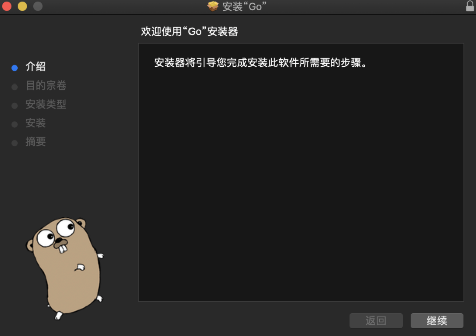
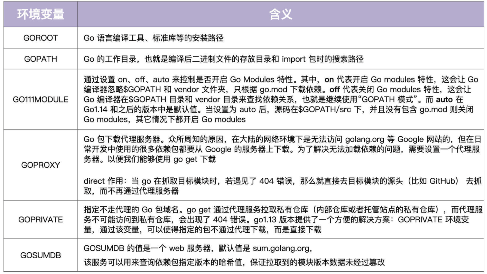
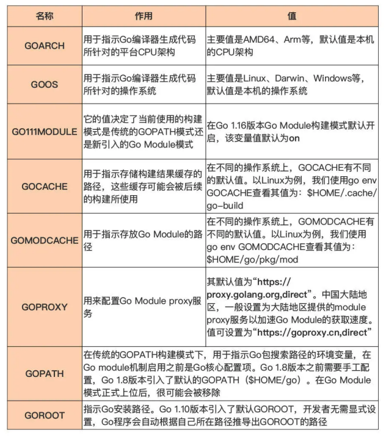

# Install Go

## Go 语言的版本发布策略

如今，Go 团队已经将版本发布节奏稳定在每年发布两次大版本上，一般是在二月份和八月 份发布。

Go 团队承诺对最新的两个 Go 稳定大版本提供支持，比如目前最新的大版本是 Go 1.17，那么 Go 团队就会为 Go 1.17 和 Go 1.16 版本提供支持。如果 Go 1.18 版本发 布，那支持的版本将变成 Go 1.18 和 Go 1.17。

支持的范围主要包括修复版本中存在的重 大问题、文档变更以及安全问题更新等。 


## 选择 Go 版本 

基于版本发布策略，在选择版本时可以参考这几种思路： 

- 一般情况下，建议采用最新版本。
  - 因为 Go 团队发布的 Go 语言稳定版本的平均质量 一直是很高的，少有影响使用的重大 bug。
  - 也不用太担心新版本的支持问题，Google 的自有产品，比如 Google App Engine（以下简称为 GAE）支持都会很快，一般在 Go 新版本发布不久后，GAE 便会宣布支持最新版本的 Go。
- 可以根据不同实际项目需要或开源社区的情况使用不同的版本。 
  - 有的开源项目采纳了 Go 团队的建议，在 Go 最新版本发布不久就将当前项目的 Go 编译器版本升级到最新版，比如 Kubernetes 项目；
  - 而有的开源项目（比如：docker 项目）则 比较谨慎，在 Go 团队发布 Go 1.17 版本之后，这些项目可能还在使用两个发布周期之前 的版本，比如 Go 1.15。
- 但多数项目处于两者之间，也就是使用次新版，即最新版本之前的那个版本。
  - 比如，当前 最新版本为 Go 1.17，那么这些项目会使用 Go 1.16 版本的最新补丁版本（Go 1.16.x）， 直到发布 Go 1.18 后，这些项目才会切换到 Go 1.17 的最新补丁版本（Go 1.17.x）。
  - 如果不是那么“激进”，也可以采用这种版本选择策略。

建议直接使用 Go 最新发布版，这样可以体验到 Go 的最新语言特性，应用到标准库的最新 API 以及 Go 工具链的最新功能。

在这里以 Go 1.16.5 版本为例讲述一下其安装、配置和使用方法。


## 安装 Go 

Go 从 2009 年开源并演化到今天，它的安装方法其实都已经很成熟了，接下来，逐一介绍在 Linux、macOS、Windows 这三大主流操作系统上安装 Go 的方法，假 设这些操作系统都安装在 x86-64 的平台上。 

官网安装链接：https://go.dev/doc/install

### 在 Linux 上安装 Go 

Go 几乎支持 Linux 所有的主流发行版操作系统，常见的包括 Ubuntu、CentOS（Redhat 企业版 linux 的社区开源版）、Fedora、SUSE 等等，Go 在这些主流的 Linux 发行版操作系统上的安装方法都是一样的（当然某个发行版也可能会利用其软件安装管理器提供仅属于其自己的安装方法）。

首先，需要下载并解压 Go Linux 安装包：

```sh
$wget -c https://golang.google.cn/dl/go1.16.5.linux-amd64.tar.gz
```

这里有个小提醒：虽然 Go 官方下载站点是 golang.org/dl，但我们可以用针对中国大陆 的镜像站点 golang.google.cn/dl 来下载，在中国大陆地区使用大陆镜像站点可以大幅缩 短下载时间。 

第二步，将下载完毕的 Go 安装包解压到安装目录中：

```sh
$tar -C /usr/local -xzf go1.16.5.linux-amd64.tar.gz
```

执行完上面解压缩命令后，将在 /usr/local 下面看到名为 go 的目录，这个目录就是 Go 的安装目录，也是 Go 官方推荐的 Go 安装目录。

执行下面命令可以查看该安装目录下的组成：

```sh
$ls -F /usr/local/go/
AUTHORS          CONTRIBUTORS     PATENTS          SECURITY.md      api/             doc/             lib/             pkg/             src/
CONTRIBUTING.md  LICENSE          README.md        VERSION          bin/             favicon.ico      misc/            robots.txt       test/
```

不过呢，为了可以在任意路径下使用 go 命令，需要将 Go 二进制文件所在路径加入 到用户环境变量 PATH 中（以用户使用 bash 为例），具体操作是将下面这行环境变量设 置语句添加到 $HOME/.profile 文件的末尾：

```sh
export PATH=$PATH:/usr/local/go/bin
```

然后执行下面命令使上述环境变量的设置立即生效：

```sh
$source ~/.profile
```

最后，可以通过下面命令验证此次安装是否成功：

```sh
$go version
```

如果这个命令输出了“go version go1.16.5 linux/amd64”，那么说明这次的 Go 安装是成功的。 

### 在 Mac 上安装 Go 

在 Mac 上可以在图形界面的引导下进行 Go 的安装。不过，先要下载适用于 Mac 的 Go 安装包：

```sh
$wget -c https://golang.google.cn/dl/go1.16.5.darwin-amd64.pkg
```

安装包下载完毕后，可以双击安装包，打开标准的 Mac 软件安装界面，如下图所示：



按软件安装向导提示，一路点击“继续”，便可以完成 Go 在 Mac 上的安装。 

和 Linux 一样，Mac 上的 Go 安装包默认也会将 Go 安装到 `/usr/local/go` 路径下面。因此，如果要在任意路径下使用 Go，也需将这个路径加入到用户的环境变量 `PATH` 中。具体操作方法与上面 Linux 中的步骤一样，也是将下面环境变量设置语句加入到 `$HOME/.profile` 中，然后执行 source 命令让它生效就可以了：

```sh
export PATH=$PATH:/usr/local/go/bin
```

在Mac中，如果使用的是 zsh，可以将环境便令设置语句加入到 `$HOME/.zshrc` 中，然后执行 source 命令让它生效就可以了。

最后，同样可以通过 `go version` 命令验证一下这次安装是否成功。 

当然了，在 Mac 上，也可以采用像 Linux 那样的通过命令行安装 Go 的方法，如果采 用这种方法，就要下载下面的 Mac Go 安装包：

```sh
$wget -c https://golang.google.cn/dl/go1.16.5.darwin-amd64.tar.gz
```

后续的步骤与 Linux 上安装 Go 几乎没有差别。 

### 在 Windows 上安装 Go 

在 Windows 上，最好的安装方式就是采用图形界面引导下的 Go 安装方法。 打开 [Go 包的下载页面](https://go.dev/dl/)，在页面上找到 go 1.16.5 版本的 Windows msi 安装包 （AMD64 架构下的）：go1.16.5.windows-amd64.msi，通过浏览器自带的下载工具，把它下载到本地任意目录下。 

双击打开已下载的 go1.16.5.windows-amd64.msi 文件，就能看到下面这个安装引导 界面：


和所有使用图形界面方式安装的 Windows 应用程序一样，只需一路点击“继续 （next）”就可完成 Go 程序的安装了，安装程序默认会把 Go 安装在 `C:\Program Files\Go` 下面，当然也可以自己定制安装目录。

除了会将 Go 安装到系统中之外，Go 安装程序还会自动设置好 Go 使用所需的环 境变量，包括在用户环境变量中增加 GOPATH，它的值默认为 `C:\Users\[用户名]\go`，在 系统变量中也会为 Path 变量增加一个值：`C:\Program Files\Go\bin`，这样就可以在 任意路径下使用 Go 了。

安装完成后，可以打开Windows的“命令提示符”窗口（也就是cmd命令）来验证一下Go有没有安装成功。

```sh
C:\Users\rmliu>go version
go version go1.16.5 windows/amd64
```


### 在 CentoOS 上安装 GO

首先，从 Go 语言官方网站下载对应的 Go 安装包以及源码包，这里下载的是 go1.16.2 版本：

```bash
$ wget https://golang.org/dl/go1.16.2.linux-amd64.tar.gz -O /tmp/go1.16.2.linux-amd64.tar.gz
```

在下载的时候，要选择：linux-amd64 的格式。

如果因为被墙的原因访问不了 golang.org，也可以执行下面的命令下载 ：

```bash
$ wget https://marmotedu-1254073058.cos.ap-beijing.myqcloud.com/tools/go1.16.2.linux-amd64.tar.gz -O /tmp/go1.16.2.linux-amd64.tar.gz
```

接着，完成解压和安装，命令如下：

```bash
$ mkdir -p $HOME/go
$ tar -xvzf /tmp/go1.16.2.linux-amd64.tar.gz -C $HOME/go
$ mv $HOME/go/go $HOME/go/go1.16.2
```

最后，执行以下命令，将下列环境变量追加到`$HOME/.bashrc`文件中。

```bash
tee -a $HOME/.bashrc <<'EOF'
# Go envs
export GOVERSION=go1.16.2  # Go 版本设置
export GO_INSTALL_DIR=$HOME/go  # Go 安装目录
export GOROOT=$GO_INSTALL_DIR/$GOVERSION  # GOROOT 设置
export GOPATH=$WORKSPACE/golang  # GOPATH 设置，其中设置 export WORKSPACE="$HOME/workspace"，并且创建 workspace 文件夹
export PATH=$GOROOT/bin:$GOPATH/bin:$PATH  # 将 GO 语言自带的和通过 go install 安装的二进制文件加入到 PATH 路径中
export GO111MODULE="on"  # 开启 Go moudles 特性
export GOPROXY=https://goproxy.cn,direct  # 安装 Go 模块时，代理服务器设置
export GOPRIVATE=
export GOSUMDB=off  # 关闭校验 Go 依赖包的哈希值
EOF
```

为什么要增加这么多的环境变量呢？

这是因为，Go语言就是通过一系列的环境变量来控制Go编译器行为的。因此一定要理解每一个环境变量的含义。



因为 Go 以后会用 Go modules 来管理依赖，所以建议将 GO111MODULE 设置为 on。

在使用模块的时候，` $GOPATH` 是无意义的，不过它还是会把下载的依赖储存在 `$GOPATH/pkg/mod`目录中，也会把 go install 的二进制文件存放在 `$GOPATH/bin`目录中。所以，还要将 `$GOPATH/bin`、`$GOROOT/bin`加入到Linux可执行文件搜索路径中。这样，就可以直接在 bash shell 中执行 go 自带的命令，以及通过 go install 安装的命令。

最后进行测试，执行 go version 命令，可以成功输出 Go 的版本，就说明 Go 编译环境安装成功。具体命令如下：

```bash
$ bash  # 由于更改了 .bashrc 所以需要重新应用一下新文件
$ go version
go version go1.16.2 linux/amd64
```


## 安装多个 Go 版本 

一般来说，Go 初学者安装一个最新的 Go 版本就足够了，但随着 Go 编程的深入，通常会有使用多个 Go 版本的需求，比如一个版本用于学习或本地开发，另外一个版本用于 生产构建等等。 

安装多个 Go 版本其实也很简单，这里介绍三种方法。 

### 方法一：重新设置 PATH 环境变量 

只需要将不同版本的 Go 安装在不同路径下，然后将它们的 Go 二进制文件的所在路径 加入到 PATH 环境变量中就可以了。 

以 Linux 环境为例，在前面介绍 Go 标准安装方法的时候，已经将 go 1.16.5 版本安装到了 /usr/local/go 下面，也将 /usr/local/go/bin 这个路径加入到了 PATH 路径 下了，当前状态在任意路径下敲入 go，执行的都是 go 1.16.5 版本对应的 Go 二进制 文件。

那这个时候，如果想再安装一个 Go 1.15.13 版本要怎么办呢？

首先，需要按照标准步骤将 go 1.15.13 安装到事先建好的 `/usr/local/go1.15.13` 路径 下：

```sh
$mkdir /usr/local/go1.15.13
$wget -c https://golang.google.cn/dl/go1.15.13.linux-amd64.tar.gz
$tar -C /usr/local/go1.15.13 -xzf go1.15.13.linux-amd64.tar.gz
```

接下来，设置 PATH 环境变量，将原先 $HOME/.profile 中的 PATH 变量的值由：

```sh
export PATH=$PATH:/usr/local/go/bin
```

改为：

```sh
export PATH=$PATH:/usr/local/go1.15.13/go/bin
```

这样通过执行 source 命令重新使 PATH 环境变量生效后，再执行 go version 命令， 会得到下面这样的结果：

```sh
$go version
go version go1.15.13 linux/amd64
```

这样，已经安装好两个 Go 版本了。这之后，如果要在 Go 1.16.5 和 Go 1.15.13 两个版本之间切换，只需要重新设置 PATH 环境变量并生效即可。

不过，可能会觉得通过重新设置 PATH 环境变量的方法有些麻烦。没关系，Go 官 方也提供了一种在系统中安装多个 Go 版本的方法。


### 方法二：go get 命令 

这种方法有一个前提，那就是当前系统中已经通过标准方法安装过某个版本的 Go 了。

还以 Linux 环境为例，假设目前环境中已经存在了采用标准方法安装的 Go 1.16.5 版 本，接下来想再安装一个 Go 1.15.13 版本。按照 Go 官方方法，可以这样来做：

首先，将 `HOME/go/bin` 加入到 PATH 环境变量中并生效，即便 `HOME/go/bin` 这个目录当前不存在也没关系：

```sh
export PATH=$PATH:/usr/local/go/bin:~/go/bin
```

然后，要执行下面这个命令安装 Go 1.15.13 版本的下载器：

```sh
$go get golang.org/dl/go1.15.13
go: downloading golang.org/dl v0.0.0-20211209150512-4ab242f9ec73
```

这个命令会将名为 go1.15.13 的可执行文件安装到 `$HOME/go/bin` 这个目录下，它是 Go 1.15.13 版本的专用下载器，下面再来执行 Go 1.15.13 的下载安装命令：

```sh
$go1.15.13 download

Downloaded   0.0% (    16384 / 121120420 bytes) ...
Downloaded   4.7% (  5750752 / 121120420 bytes) ...
Downloaded  93.2% (112868528 / 121120420 bytes) ...
Downloaded 100.0% (121120420 / 121120420 bytes)
Unpacking /home/going/sdk/go1.15.13/go1.15.13.linux-amd64.tar.gz ...
Success. You may now run 'go1.15.13'
```

现在，看到这个命令下载了 go1.15.13.linux-amd64.tar.gz 安装包，也将它安装到 $HOME/sdk/go1.15.13 下面了。下载安装结束后，就可以利用带有版本号的 go 命 令来使用特定版本的 Go 了：

```sh
$go1.15.13 version
go version go1.15.13 linux/amd64
```

同样的，也可以通过下面这个命令查看特定 Go 版本的安装位置：

```sh
$go1.15.13 env GOROOT
/root/sdk/go1.15.13
```


### 方法三：go get 命令安装非稳定版本 

其实，除了 Go 团队正式发布的稳定版本 (stable version)，像前面安装的 Go 1.16.5 或 Go 1.15.13，还可以通过 go get 的方法安装 Go 团队正在开发的非稳定版本 (Unstable Version)，包括每个稳定版发布前的 beta 版本或当前最新的 tip 版本，这些非稳定版本可以让 Go 开发人员提前体验到即将加入到稳定版本中的新特性。

> 所谓tip就是源码最最新的版本。
>
> tip 一般代表最新的开发进展，不稳定也是很正常的，想稳定就用特定的 tag 版，这也是 tag 这个功能的意义。

但是，通过 go get 安装不同 Go 版本的方法在中国大陆地区会因网络问题而失败。如果已经克服了网络问题，那安装非稳定版本的步骤其实和上面的步骤一样。

现在，以 Go 1.17beta1 和 Go Tip 版本为例，体验一下它们的安装步骤和验证方法。 

首先来看 Go 1.17beta1：

```sh
$go get golang.org/dl/go1.17beta1

$go1.17beta1 download
Downloaded   0.0% (     3233 / 134470397 bytes) ...
Downloaded   6.2% (  8371600 / 134470397 bytes) ...
Downloaded  93.9% (126286912 / 134470397 bytes) ...
Downloaded 100.0% (134470397 / 134470397 bytes)
Unpacking /home/going/sdk/go1.17beta1/go1.17beta1.linux-amd64.tar.gz ...
Success. You may now run 'go1.17beta1'

$go1.17beta1 version
go version go1.17beta1 linux/amd64
```

接着来看 Go Tip 版本：

```sh
$go get golang.org/dl/gotip
$gotip download  # 这块下载会很慢，需要等待
```

go get 为安装 tip 版本提供了极大方便，要知道在以前，如果要安装 tip 版本， 需要手工下载 Go 源码并自行编译。

要注意的是：不是每次 gotip 安装都会成功，因为这毕竟是正在积极开发的版本，一次代码的提交就可能会导致 gotip 版本构建失败！ 

## 配置 Go 

其实 Go 在安装后是开箱即用的，这也意味着在使用 Go 之前无需做任何配置。但为 了更好地了解和学习 Go，还是要认识一些 Go 自带的常用配置项。

Go 的配置项是以 环境变量的形式存在的，可以通过下面这个命令查看 Go 的这些配置项：

```sh
$go env
```

这里总结了一些常用配置项：



如果还要了解更多关于 Go 配置项的说明，可以通过 go help environment 命令查 看。

> 可以参考 [在 CentoOS 上安装 GO](#在 CentoOS 上安装 GO) 中的设置。


## GO 命令

- go build主要用于编译代码。
- go clean 移除当前源码包和关联源码包。
  


