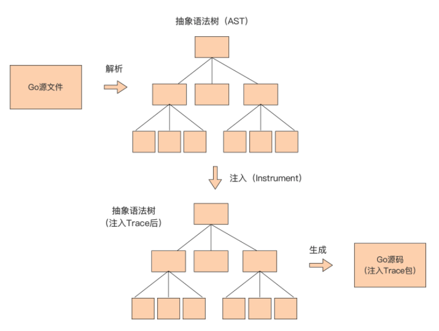

# Function Trace Chain

> 实战项目之函数调用链。

安排了一个小实战项目。

## 引子 

一道思考题：“除了捕捉 panic、延迟释放资源外，日常编码中还有哪些使用 defer 的小技巧呢？” 

可以得到：使用 defer 可以跟踪函数的执行过程。没错！这的确是 defer 的一个常见的使用技巧，很多 Go 教程在讲解 defer 时也会经常使用这个用途举例。

那么，具体是怎么用 defer 来实现函数执行过程的跟踪呢？这里，给出了一个最简单的实现：

```go
package main

func Trace(name string) func() {
   println("enter:", name)
   return func() {
      println("exit:", name)
   }
}

func foo() {
   defer Trace("foo")()
   bar()
}

func bar() {
   defer Trace("bar")()
}

func main() {
   defer Trace("main")()
   foo()
}
```

在讲解这段代码的原理之前，先看一下这段代码的执行结果，直观感受一下什么是函数调用跟踪：

```sh
enter: main
enter: foo
enter: bar
exit: bar
exit: foo
exit: main
```

这个 Go 程序的函数调用的全过程一目了然地展现在了面前：程序按main -> foo -> bar的函数调用次序执行，代码在函数的入口与出口处分别输出了跟踪日志。 

那这段代码是怎么做到的呢？简要分析一下。 

在这段实现中，在每个函数的入口处都使用 defer 设置了一个 deferred 函数。根据 defer 的运作机制，Go 会在 defer 设置 deferred 函数时对 defer 后 面的表达式进行求值。 

以 foo 函数中的defer Trace("foo")() 这行代码为例，Go 会对 defer 后面的表达式Trace("foo")() 进行求值。由于这个表达式包含一个函数调用Trace("foo")，所以这个函数会被执行。 

上面的 Trace 函数只接受一个参数，这个参数代表函数名，Trace 会首先打印进入某函数的日志，比如：“enter: foo”。然后返回一个闭包函数，这个闭包函数一旦被执行，就会输出离开某函数的日志。

在 foo 函数中，这个由 Trace 函数返回的闭包函数就被设置为了 deferred 函数，于是当 foo 函数返回后，这个闭包函数就会被执行，输出“exit: foo”的日志。 

搞清楚上面跟踪函数调用链的实现原理后，再来看看这个实现。会发现这里还是有一些“瑕疵”，也就是离期望的“跟踪函数调用链”的实现还有一些**不足之处**。这里列举了几点：

- 调用 Trace 时需手动显式传入要跟踪的函数名； 
- 如果是并发应用，不同 Goroutine 中函数链跟踪混在一起无法分辨； 
- 输出的跟踪结果缺少层次感，调用关系不易识别； 
- 对要跟踪的函数，需手动调用 Trace 函数。

逐一分析并解决上面提出的这几点问题，并经过逐步地代码演进，最终实现一个**自动注入跟踪代码**，并输出有层次感的函数调用链跟踪命令行工具。

## 自动获取所跟踪函数的函数名 

要解决“调用 Trace 时需要手动显式传入要跟踪的函数名”的问题，也就是要让 Trace 函数能够自动获取到它跟踪函数的函数名信息。

以跟踪 foo 为例，看看这样做能带来什么好处。 在手动显式传入的情况下，需要用下面这个代码对 foo 进行跟踪：

```go
defer Trace("foo")()
```

一旦实现了自动获取函数名，所有支持函数调用链跟踪的函数都只需使用下面调用形式的 Trace 函数就可以了：

```go
defer Trace()()
```

这种一致的 Trace 函数调用方式也为后续的自动向代码中注入 Trace 函数奠定了基础。那么如何实现 Trace 函数对它跟踪函数名的自动获取呢？

需要借助 **Go 标准库 runtime 包**的帮助。 这里，给出了新版 Trace 函数的实现以及它的使用方法，先看一下：

```go
package main

import "runtime"

func Trace() func() {
   pc, _, _, ok := runtime.Caller(1)
   if !ok {
      panic("not found caller")
   }

   fn := runtime.FuncForPC(pc)
   name := fn.Name()

   println("enter:", name)
   return func() {
      println("exit:", name)
   }
}

func foo() {
   defer Trace()()
   bar()
}

func bar() {
   defer Trace()()
}

func main() {
   defer Trace()()
   foo()
}
```

在这一版 Trace 函数中，通过 runtime.Caller 函数获得当前 Goroutine 的函数调用栈上的信息，runtime.Caller 的参数标识的是要获取的是哪一个栈帧的信息。当参数为 0 时，返回的是 Caller 函数的调用者的函数信息，在这里就是 Trace 函数。但需要的是 Trace 函数的调用者的信息，于是传入 1。 

Caller 函数有四个返回值：第一个返回值代表的是程序计数（pc）；第二个和第三个参数代表对应函数所在的源文件名以及所在行数，这里暂时不需要；最后一个参数代表是否能成功获取这些信息，如果获取失败，抛出 panic。 

接下来，通过 runtime.FuncForPC 函数和程序计数器（PC）得到被跟踪函数的函数名称。运行一下改造后代码：

```sh
enter: main.main
enter: main.foo
enter: main.bar
exit: main.bar
exit: main.foo
exit: main.main
```

runtime.FuncForPC 返回的名称中不仅仅包含函数名，还包含了被跟踪函数所在的包名。也就是说，第一个问题已经圆满解决了。 

接下来，来解决第二个问题，也就是当程序中有多 Goroutine 时，Trace 输出的跟踪信息混杂在一起难以分辨的问题。

## 增加 Goroutine 标识 

上面的 Trace 函数在面对只有一个 Goroutine 的时候，还是可以支撑的，但当程序中并发运行多个 Goroutine 的时候，多个函数调用链的出入口信息输出就会混杂在一起，无法分辨。 

那么，接下来还继续对 Trace 函数进行改造，让它支持多 Goroutine 函数调用链的跟踪。方案就是**在输出的函数出入口信息时，带上一个在程序每次执行时能唯一区分 Goroutine 的 Goroutine ID**。 

可能会说，Goroutine 也没有 ID 信息啊！的确如此，Go 核心团队为了避免 Goroutine ID 的滥用，故意没有将 Goroutine ID 暴露给开发者。

>Go 团队认为引入 ID 会让部分 Goroutine 变得更特殊，从而限制语言的并发能力；
>
>Why is there no goroutine ID?
>
> https://go.dev/doc/faq#no_goroutine_id

但在 **Go 标准库的 h2_bundle.go** 中，却发现了一个获取 Goroutine ID 的标准方法，看下面代码：

```go
// net/http/h2_bundle.go
var http2goroutineSpace = []byte("goroutine ")

func http2curGoroutineID() uint64 {
   bp := http2littleBuf.Get().(*[]byte)
   defer http2littleBuf.Put(bp)
   b := *bp
   b = b[:runtime.Stack(b, false)]
   // Parse the 4707 out of "goroutine 4707 ["
   b = bytes.TrimPrefix(b, http2goroutineSpace)
   i := bytes.IndexByte(b, ' ')
   if i < 0 {
      panic(fmt.Sprintf("No space found in %q", b))
   }
   b = b[:i]
   n, err := http2parseUintBytes(b, 10, 64)
   if err != nil {
      panic(fmt.Sprintf("Failed to parse goroutine ID out of %q: %v", b, err))
   }
   return n
}

var http2littleBuf = sync.Pool{
	New: func() interface{} {
		buf := make([]byte, 64)
		return &buf
	},
}

// parseUintBytes is like strconv.ParseUint, but using a []byte.
func http2parseUintBytes(s []byte, base int, bitSize int) (n uint64, err error) {
  // ...
}
```

不过，由于 http2curGoroutineID 不是一个导出函数，无法直接使用。可以把它 复制出来改造一下：

```go
package main

import (
   "bytes"
   "fmt"
   "runtime"
   "strconv"
)

var goroutineSpace = []byte("goroutine ")

func curGoroutineID() uint64 {
   b := make([]byte, 64)
   b = b[:runtime.Stack(b, false)]
   // Parse the 4707 out of "goroutine 4707 ["
   b = bytes.TrimPrefix(b, goroutineSpace)
   i := bytes.IndexByte(b, ' ')
   if i < 0 {
      panic(fmt.Sprintf("No space found in %q", b))
   }
   b = b[:i]
   n, err := strconv.ParseUint(string(b), 10, 64)
   if err != nil {
      panic(fmt.Sprintf("Failed to parse goroutine ID out of %q: %v", b, err))
   }
   return n
}
```

这里，改造了两个地方。

- 一个地方是通过直接创建一个 byte 切片赋值给 b，替代原 http2curGoroutineID 函数中从一个 pool 池获取 byte 切片的方式，
- 另外一个是使用 strconv.ParseUint 替代了原先的 http2parseUintBytes。

改造后，就可以直接使用 curGoroutineID 函数来获取 Goroutine 的 ID 信息了。 

接下来，**在 Trace 函数中添加 Goroutine ID 信息**的输出：

```go
func Trace() func() {
   pc, _, _, ok := runtime.Caller(1)
   if !ok {
      panic("not found caller")
   }

   fn := runtime.FuncForPC(pc)
   name := fn.Name()
   gid := curGoroutineID()

   fmt.Printf("g[%05d]: enter: [%s]\n", gid, name)
   return func() {
      fmt.Printf("g[%05d]: exit: [%s]\n", gid, name)
   }
}
```

从上面代码看到，在出入口输出的跟踪信息中加入了 Goroutine ID 信息，输出的 Goroutine ID 为 5 位数字，如果 ID 值不足 5 位，则左补零，这一切都是 Printf 函数的格式控制字符串“%05d”实现的。

这样对齐 Goroutine ID 的位数，为的是输出信息格式的一致性更好。如果 Go 程序中 Goroutine 的数量超过了 5 位数可以表示的数值范围，也可以自行调整控制字符串。 

接下来，也要对示例进行一些调整，将这个程序**由单 Goroutine 改为多 Goroutine 并发**的，这样才能验证支持多 Goroutine 的新版 Trace 函数是否好用：

```go
package main

import (
   "bytes"
   "fmt"
   "runtime"
   "strconv"
   "sync"
)

var goroutineSpace = []byte("goroutine ")

func curGoroutineID() uint64 {
   b := make([]byte, 64)
   b = b[:runtime.Stack(b, false)]
   // Parse the 4707 out of "goroutine 4707 ["
   b = bytes.TrimPrefix(b, goroutineSpace)
   i := bytes.IndexByte(b, ' ')
   if i < 0 {
      panic(fmt.Sprintf("No space found in %q", b))
   }
   b = b[:i]
   n, err := strconv.ParseUint(string(b), 10, 64)
   if err != nil {
      panic(fmt.Sprintf("Failed to parse goroutine ID out of %q: %v", b, err))
   }
   return n
}

func Trace() func() {
   pc, _, _, ok := runtime.Caller(1)
   if !ok {
      panic("not found caller")
   }

   fn := runtime.FuncForPC(pc)
   name := fn.Name()
   gid := curGoroutineID()

   fmt.Printf("g[%05d]: enter: [%s]\n", gid, name)
   return func() {
      fmt.Printf("g[%05d]: exit: [%s]\n", gid, name)
   }
}

func A1() {
   defer Trace()()
   B1()
}

func B1() {
   defer Trace()()
   C1()
}

func C1() {
   defer Trace()()
   D()
}

func D() {
   defer Trace()()
}

func A2() {
   defer Trace()()
   B2()
}

func B2() {
   defer Trace()()
   C2()
}

func C2() {
   defer Trace()()
   D()
}

func main() {
   var wg sync.WaitGroup
   wg.Add(1)
   go func() {
      A2()
      wg.Done()
   }()

   A1()
   wg.Wait()
}
```

新示例程序共有两个 Goroutine，main groutine 的调用链为A1 -> B1 -> C1 -> D， 而另外一个 Goroutine 的函数调用链为A2 -> B2 -> C2 -> D。

来看一下这个程序的执行结果是否和原代码中两个 Goroutine 的调用链一致：

```sh
g[00001]: enter: [main.A1]
g[00001]: enter: [main.B1]
g[00001]: enter: [main.C1]
g[00006]: enter: [main.A2]
g[00001]: enter: [main.D]
g[00001]: exit: [main.D]
g[00001]: exit: [main.C1]
g[00001]: exit: [main.B1]
g[00001]: exit: [main.A1]
g[00006]: enter: [main.B2]
g[00006]: enter: [main.C2]
g[00006]: enter: [main.D]
g[00006]: exit: [main.D]
g[00006]: exit: [main.C2]
g[00006]: exit: [main.B2]
g[00006]: exit: [main.A2]
```

新示例程序输出了带有 Goroutine ID 的出入口跟踪信息，通过 Goroutine ID 可以快速确认某一行输出是属于哪个 Goroutine 的。 

但由于 **Go 运行时对 Goroutine 调度顺序的不确定性**，各个 Goroutine 的输出还是会存在交织在一起的问题，这给查看某个 Goroutine 的函数调用链跟踪信息带来阻碍。

这里提供一个**小技巧**：可以将程序的输出重定向到一个本地文件中，然后通过 Goroutine ID 过滤出（可使用 grep 工具）想查看的 groutine 的全部函数跟踪信息。 

到这里，就实现了输出带有 Goroutine ID 的函数跟踪信息，不过，有没有觉得输出的函数调用链信息还是不够美观，缺少层次感，体验依旧不那么优秀呢？

下面就来美化一下信息的输出形式。


## 让输出的跟踪信息更具层次感 

对于程序员来说，缩进是最能体现出“层次感”的方法，如果将上面示例中 Goroutine 00001 的函数调用跟踪信息以下面的形式展示出来，函数的调用顺序是不是更加一目了然了呢？

```go
g[00001]:       ->main.A1
g[00001]:               ->main.B1
g[00001]:                       ->main.C1
g[00001]:                               ->main.D
g[00001]:                               <-main.D
g[00001]:                       <-main.C1
g[00001]:               <-main.B1
g[00001]:       <-main.A1
```

那么就以这个形式为目标，考虑如何实现输出这种带缩进的函数调用跟踪信息。还是直接上代码吧：

```go
package main

import (
   "bytes"
   "fmt"
   "runtime"
   "strconv"
   "sync"
)

var goroutineSpace = []byte("goroutine ")

func curGoroutineID() uint64 {
   b := make([]byte, 64)
   b = b[:runtime.Stack(b, false)]
   // Parse the 4707 out of "goroutine 4707 ["
   b = bytes.TrimPrefix(b, goroutineSpace)
   i := bytes.IndexByte(b, ' ')
   if i < 0 {
      panic(fmt.Sprintf("No space found in %q", b))
   }
   b = b[:i]
   n, err := strconv.ParseUint(string(b), 10, 64)
   if err != nil {
      panic(fmt.Sprintf("Failed to parse goroutine ID out of %q: %v", b, err))
   }
   return n
}

var mu sync.Mutex
var m = make(map[uint64]int)

func Trace() func() {
   pc, _, _, ok := runtime.Caller(1)
   if !ok {
      panic("not found caller")
   }

   fn := runtime.FuncForPC(pc)
   name := fn.Name()
   gid := curGoroutineID()

   mu.Lock()
   indents := m[gid]    // 获取当前 gid 对应的缩进层次
   m[gid] = indents + 1 // 缩进层次 +1 后存入 map
   mu.Unlock()

   printTrace(gid, name, "->", indents+1)

   return func() {
      mu.Lock()
      indents := m[gid]    // 获取当前 gid 对应的缩进层次
      m[gid] = indents - 1 // 缩进层次 -1 后存入 map
      mu.Unlock()

      printTrace(gid, name, "<-", indents)
   }
}

func printTrace(id uint64, name string, arrow string, indent int) {
   indents := ""
   for i := 0; i < indent; i++ {
      indents += "   "
   }
   fmt.Printf("g[%05d]: %s%s%s\n", id, indents, arrow, name)
}

func A1() {
   defer Trace()()
   B1()
}

func B1() {
   defer Trace()()
   C1()
}

func C1() {
   defer Trace()()
   D()
}

func D() {
   defer Trace()()
}

func A2() {
   defer Trace()()
   B2()
}

func B2() {
   defer Trace()()
   C2()
}

func C2() {
   defer Trace()()
   D()
}

func main() {
   var wg sync.WaitGroup
   wg.Add(1)
   go func() {
      A2()
      wg.Done()
   }()

   A1()
   wg.Wait()
}
```

在上面这段代码中，使用了一个 map 类型变量 m 来保存每个 Goroutine 当前的缩进信息：m 的 key 为 Goroutine 的 ID，值为缩进的层次。

然后，考虑到 Trace 函数可能在并发环境中运行，根据“map 不支持并发写”的注意事项，增加了一个 sync.Mutex 实例 mu 用于同步对 m 的写操作。 

这样，对于一个 Goroutine 来说，

- 每次刚进入一个函数调用，就在输出入口跟踪信息之前，将缩进层次加一，并输出入口跟踪信息，加一后的缩进层次值也保存到 map 中。
- 然后，在函数退出前，取出当前缩进层次值并输出出口跟踪信息，之后再将缩进层次减一后保存到 map 中。 

除了增加缩进层次信息外，在这一版的 Trace 函数实现中，也把输出出入口跟踪信息 的操作提取到了一个独立的函数 printTrace 中，这个函数会根据传入的 Goroutine ID、 函数名、箭头类型与缩进层次值，按预定的格式拼接跟踪信息并输出。 

运行新版示例代码，会得到下面的结果：

```sh
g[00001]:       ->main.A1
g[00001]:               ->main.B1
g[00001]:                       ->main.C1
g[00001]:                               ->main.D
g[00001]:                               <-main.D
g[00001]:                       <-main.C1
g[00001]:               <-main.B1
g[00001]:       <-main.A1
g[00018]:       ->main.A2
g[00018]:               ->main.B2
g[00018]:                       ->main.C2
g[00018]:                               ->main.D
g[00018]:                               <-main.D
g[00018]:                       <-main.C2
g[00018]:               <-main.B2
g[00018]:       <-main.A2
```

显然，通过这种带有缩进层次的函数调用跟踪信息，可以更容易地识别某个 Goroutine 的函数调用关系。 

到这里，函数调用链跟踪已经支持了多 Goroutine，并且可以输出有层次感的跟踪 信息了，但对于 Trace 特性的使用者而言，依然需要手工在自己的函数中添加对 Trace 函数的调用。

那么是否可以将 Trace 特性自动注入特定项目下的各个源码文件中呢？接下来继续来改进 Trace 工具。


## 利用代码生成自动注入 Trace 函数 

要实现向目标代码中的函数 / 方法自动注入 Trace 函数，首先要做的就是将上面 Trace 函数相关的代码打包到一个 module 中以方便其他 module 导入。

### 将 Trace 函数放入一个独立的 module 中 

创建一个名为 instrument_trace 的目录，进入这个目录后，通过 go mod init 命令创建一个名为 github.com/Kate-liu/GoBeginner/instrument_trace 的 module：

```sh
$mkdir instrument_trace
$cd instrument_trace/
$go mod init github.com/Kate-liu/GoBeginner/instrument_trace
go: creating new go.mod: module github.com/Kate-liu/GoBeginner/instrument_trace
```

接下来，将最新版的 trace.go 放入到该目录下，将包名改为 trace，并仅保留 Trace 函数、Trace 使用的函数以及包级变量，其他函数一律删除掉。这样，一个独立的 trace 包就提取完毕了。 

作为 trace 包的作者，有义务告诉大家如何使用 trace 包。在 Go 中，通常会用 一个 example_test.go 文件来编写使用 trace 包的演示代码，下面就是为 trace 包提 供的 example_test.go 文件：

```go
package trace_test

import trace "github.com/Kate-liu/GoBeginner/instrument_trace"

func a() {
   defer trace.Trace()()
   b()
}

func b() {
   defer trace.Trace()()
   c()
}

func c() {
   defer trace.Trace()()
   d()
}

func d() {
   defer trace.Trace()()
}

func ExampleTrace() {
   a()
   // Output:
   // g[00001]:   ->github.com/Kate-liu/GoBeginner/instrument_trace_test.a
   // g[00001]:      ->github.com/Kate-liu/GoBeginner/instrument_trace_test.b
   // g[00001]:         ->github.com/Kate-liu/GoBeginner/instrument_trace_test.c
   // g[00001]:            ->github.com/Kate-liu/GoBeginner/instrument_trace_test.d
   // g[00001]:            <-github.com/Kate-liu/GoBeginner/instrument_trace_test.d
   // g[00001]:         <-github.com/Kate-liu/GoBeginner/instrument_trace_test.c
   // g[00001]:      <-github.com/Kate-liu/GoBeginner/instrument_trace_test.b
   // g[00001]:   <-github.com/Kate-liu/GoBeginner/instrument_trace_test.a
}
```

在 example_test.go 文件中，用 ExampleXXX 形式的函数表示一个示例，go test 命令会扫描 example_test.go 中的以 Example 为前缀的函数并执行这些函数。 

**每个 ExampleXXX 函数需要包含预期的输出**，就像上面 ExampleTrace 函数尾部那样，在一大段注释中提供这个函数执行后的预期输出，预期输出的内容从// Output:的下一行开始。go test 会将 ExampleTrace 的输出与预期输出对比，如果不一致，会报测试错误。

从这一点，可以看出 example_test.go 也是 trace 包单元测试的一部分。 现在 Trace 函数已经被放入到独立的包中了，接下来就来看看如何将它自动注入到要跟踪的函数中去。

### 自动注入 Trace 函数 

现在，在 instrument_trace module 下面增加一个命令行工具，这个工具可以以一个 Go 源文件为单位，自动向这个 Go 源文件中的所有函数注入 Trace 函数。 

根据带有可执行文件的 Go 项目布局，在 instrument_trace module 中增加 cmd/instrument 目录，这个工具的 main 包就放在这个目录下，而真正 实现自动注入 Trace 函数的代码呢，被放在了 instrumenter 目录下。 

#### 目录结构

下面是变化后的 instrument_trace module 的目录结构：

```sh
$tree ./instrument_trace/ -F
./instrument_trace/
├── cmd/
│   └── instrument/
│       └── main.go # instrument命令行工具的main包
├── example_test.go
├── go.mod
├── go.sum
├── instrumenter/ # 自动注入逻辑的相关结构
│   ├── ast/
│   │   └── ast.go
│   └── instrumenter.go
└── trace.go
```

#### main.go

先来看一下 cmd/instrument/main.go 源码，然后自上而下沿着 main 函数的调用逻辑逐一看一下这个功能的实现。下面是 main.go 的源码：

```go
package main

import (
   "flag"
   "fmt"
   "github.com/Kate-liu/GoBeginner/instrument_trace/instrumenter"
   "github.com/Kate-liu/GoBeginner/instrument_trace/instrumenter/ast"
   "io/ioutil"
   "os"
   "path/filepath"
)

var (
   wrote bool
)

func init() {
   flag.BoolVar(&wrote, "w", false, "write result to (source) file instead of stdout")
}

func usage() {
   fmt.Println("instrument [-w] xxx.go")
   flag.PrintDefaults()
}

func main() {
   fmt.Println(os.Args)
   flag.Usage = usage
   flag.Parse() // 解析命令行参数

   if len(os.Args) < 2 { // 对命令行参数个数进行校验
      usage()
      return
   }

   var file string
   if len(os.Args) == 3 {
      file = os.Args[2]
   }
   if len(os.Args) == 2 {
      file = os.Args[1]
   }

   if filepath.Ext(file) != ".go" { // 对源文件扩展名进行校验
      usage()
      return
   }

   var ins instrumenter.Instrumenter // 声明 instrumenter.Instrumenter 接口类型变量

   // 创建以 ast 方式实现 Instrumenter 接口的 ast.instrumenter 实例
   ins = ast.New("github.com/Kate-liu/GoBeginner/instrument_trace", "trace", "Trace")
   newSrc, err := ins.Instrument(file) // 向 Go 源文件所有函数注入 Trace 函数
   if err != nil {
      panic(err)
   }

   if newSrc == nil {
      // add nothing to the source file. no change
      fmt.Printf("no trace added for %s\n", file)
   }

   if !wrote {
      fmt.Println(string(newSrc)) // 将生成的新代码内容输出到 stdout 上
      return
   }

   // 将生成的新代码内容写回原 Go 源文件
   if err = ioutil.WriteFile(file, newSrc, 0666); err != nil {
      fmt.Printf("write %s error: %v\n", file, err)
      return
   }
   fmt.Printf("instrument trace for %s ok\n", file)

}
```

作为命令行工具，instrument 使用标准库的 flag 包实现对命令行参数（这里是 -w）的解析，通过 os.Args 获取待注入的 Go 源文件路径。

在完成对命令行参数个数与值的校验后，instrument 程序声明了一个 instrumenter.Instrumenter 接口类型变量 ins，然后创 建了一个实现了 Instrumenter 接口类型的 ast.instrumenter 类型的实例，并赋值给变量 ins。

#### instrumenter.go

instrumenter.Instrumenter 接口类型的声明放在了 instrumenter/instrumenter.go 中：

```go
package instrumenter

type Instrumenter interface {
	Instrument(string) ([]byte, error)
}
```

这里可以看到，这个接口类型的方法列表中只有一个方法 Instrument，这个方法接受一个 Go 源文件路径，返回注入了 Trace 函数的新源文件内容以及一个 error 类型值，作为错误状态标识。

之所以要抽象出一个接口类型，考虑的就是注入 Trace 函数的实现方法不 一，为后续的扩展做好预留。

#### ast.go

在这个例子中，**默认提供**了一种自动注入 Trace 函数的实现，那就是 ast.instrumenter，它注入 Trace 的实现原理是这样的：



从原理图中可以清楚地看到，在这一实现方案中，先将传入的 Go 源码转换为抽象语法树。 

在计算机科学中，**抽象语法树（abstract syntax tree，AST）**是源代码的抽象语法结构的树状表现形式，树上的每个节点都表示源代码中的一种结构。因为 Go 语言是开源编程语言，所以它的抽象语法树的操作包也和语言一起开放给了 Go 开发人员，可以基于 Go 标准库以及 Go 实验工具库提供的 **ast 相关包**，快速地构建基于 AST 的应用，这里的 ast.instrumenter 就是一个应用 AST 的典型例子。 

一旦通过 ast 相关包解析 Go 源码得到相应的抽象语法树后，便可以操作这棵语 法树，并按逻辑在语法树中注入Trace 函数，最后再将修改后的抽象语法树转换为 Go 源码，就完成了整个自动注入的工作了。 

了解了原理后，再看一下具体的代码实现。下面是 **ast.instrumenter 的 Instructment 方法**的代码：

```go
func (a instrumenter) Instrument(filename string) ([]byte, error) {
   fset := token.NewFileSet()
   curAST, err := parser.ParseFile(fset, filename, nil, parser.ParseComments)
   if err != nil {
      return nil, fmt.Errorf("error parsing %s: %w", filename, err)
   }
   
   if !hasFuncDecl(curAST) { // 如果整个源码都不包含函数声明，则无需注入操作，直接返回
      return nil, nil
   }
   
   // 在AST上添加包导入语句
   astutil.AddImport(fset, curAST, a.traceImport)
   
   // 向AST上的所有函数注入Trace函数
   a.addDeferTraceIntoFuncDecls(curAST)
   
   buf := &bytes.Buffer{}
   err = format.Node(buf, fset, curAST) // 将修改后的AST转换回Go源码
   if err != nil {
      return nil, fmt.Errorf("error formatting new code: %w", err)
   }
   return buf.Bytes(), nil // 返回转换后的Go源码
}
```

通过代码，看到 Instrument 方法的基本步骤与上面原理图大同小异。

- Instrument 首先通过 go/paser 的 ParserFile 函数对传入的 Go 源文件中的源码进行解析，并得到对应的抽象语法树 AST，
- 然后向 AST 中导入 Trace 函数所在的包，并向这个 AST 的所有函数声明注入 Trace 函数调用。 实际的注入操作发生在 instrumenter 的 addDeferTraceIntoFuncDecls 方法中，来看一下这个方法的实现：

```go
func (a instrumenter) addDeferTraceIntoFuncDecls(f *ast.File) {
   for _, decl := range f.Decls { // 遍历所有声明语句
      fd, ok := decl.(*ast.FuncDecl) // 类型断言：是否为函数声明
      if ok {
         // 如果是函数声明，则注入跟踪设施
         a.addDeferStmt(fd)
      }
   }
}
```

- 这个方法的逻辑十分清晰，就是遍历语法树上所有声明语句，如果是函数声明，就调用 instrumenter 的 addDeferStmt 方法进行注入，如果不是，就直接返回。addDeferStmt 方法的实现如下：

```go
func (a instrumenter) addDeferStmt(fd *ast.FuncDecl) (added bool) {
   stmts := fd.Body.List

   // check whether "defer trace.Trace()()" has already exists
   // 判断"defer trace.Trace()()"语句是否已经存在
   for _, stmt := range stmts {
      ds, ok := stmt.(*ast.DeferStmt)
      if !ok {
         // 如果不是defer语句，则继续for循环
         continue
      }

      // 如果是defer语句，则要进一步判断是否是defer trace.Trace()()
      // it is a defer stmt
      ce, ok := ds.Call.Fun.(*ast.CallExpr)
      if !ok {
         continue
      }

      se, ok := ce.Fun.(*ast.SelectorExpr)
      if !ok {
         continue
      }

      x, ok := se.X.(*ast.Ident)
      if !ok {
         continue
      }
      if (x.Name == a.tracePkg) && (se.Sel.Name == a.traceFunc) {
         // defer trace.Trace()()已存在，返回
         // already exist , return
         return false
      }
   }

   // 没有找到"defer trace.Trace()()"，注入一个新的跟踪语句
   // 在AST上构造一个defer trace.Trace()()
   // not found "defer trace.Trace()()"
   // add one
   ds := &ast.DeferStmt{
      Call: &ast.CallExpr{
         Fun: &ast.CallExpr{
            Fun: &ast.SelectorExpr{
               X: &ast.Ident{
                  Name: a.tracePkg,
               },
               Sel: &ast.Ident{
                  Name: a.traceFunc,
               },
            },
         },
      },
   }

   newList := make([]ast.Stmt, len(stmts)+1)
   copy(newList[1:], stmts)
   newList[0] = ds // 注入新构造的defer语句
   fd.Body.List = newList
   return true
}
```

- 虽然 addDeferStmt 函数体略长，但逻辑也很清晰，就是先判断函数是否已经注入了 Trace，
  - 如果有，则略过；
  - 如果没有，就构造一个 Trace 语句节点，并将它插入到 AST 中。 
- Instrument 的最后一步就是将注入 Trace 后的 AST 重新转换为 Go 代码，这就是期望得到的带有 Trace 特性的 Go 代码了。

### 利用 instrument 工具注入跟踪代码 

有了 instrument 工具后，再来看看如何使用这个工具，在目标 Go 源文件中自动注入 跟踪设施。 

这里，在 instrument_trace 项目的 examples 目录下建立了一个名为 demo 的项目， 就来看看如何使用 instrument 工具为 demo 项目下的 demo.go 文件自动注入跟踪 设施。

#### demo.go

demo.go 文件内容很简单：

```go
package main

func foo() {
   bar()
}

func bar() {
   
}

func main() {
   foo()
}
```

#### 构建 instrument 工具

首先构建一下 instrument_trace 下的 instrument 工具：

```sh
$cd instrument_trace/ 
$go build github.com/Kate-liu/GoBeginner/instrument_trace/cmd/instrument
$./instrument  version
[./instrument version]
instrument [-w] xxx.go
  -w    write result to (source) file instead of stdout
```

接下来，使用 instrument 工具向 examples/demo/demo.go 源文件中的函数自动注 入跟踪设施：

```sh
$./instrument  -w examples/demo/demo.go  
[./instrument -w examples/demo/demo.go]
instrument trace for examples/demo/demo.go ok
```

注入后的 demo.go 文件变为了下面这个样子：

```go
package main

import "github.com/Kate-liu/GoBeginner/instrument_trace"

func foo() {
	defer trace.Trace()()
	bar()
}

func bar() {
	defer trace.Trace()()

}

func main() {
	defer trace.Trace()()
	foo()
}
```

此时，如果再对已注入 Trace 函数的 demo.go 执行一次 instrument 命令，由于 instrument 会判断 demo.go 各个函数已经注入了 Trace，demo.go 的内容将保持不 变。 

#### go.mod

由于 github.com/bigwhite/instrument_trace 并没有真正上传到 github.com 上，所以如果要运行 demo.go，可以为它配置一个下面这样的 go.mod：

```go
module demo

go 1.14

require github.com/Kate-liu/GoBeginner/instrument_trace v1.0.0

replace github.com/Kate-liu/GoBeginner/instrument_trace v1.0.0 => ../../
```

这样运行 demo.go 就不会遇到障碍了：

```sh
$go run demo.go
g[00001]:       ->main.main
g[00001]:               ->main.foo
g[00001]:                       ->main.bar
g[00001]:                       <-main.bar
g[00001]:               <-main.foo
g[00001]:       <-main.main
```


## 小结 

已经实现了设定的目标：实现一个自动注入跟踪代码并输出有层次感的函数调用链跟踪命令行工具。

回顾一下这个工具的实现思路：

- 首先基于 defer 实现了一个最简单的函数跟踪机制，
- 然后针对这个最简单的实现提出若干问题，接下来逐一把这些问题解决掉了，
- 最终将第一版相对粗糙的代码实现演进重构为一个相对完善的命令行工具。 

关于这个实战项目，有两点注意事项要： 

- 第一，在代码中注入函数调用跟踪代码仅适用于日常调试代码和阅读理解代码时使用，被注入了跟踪设施的代码是不适合上生产环境的；
- 第二，在这里使用到了 Go 核心团队不推荐使用的 Goroutine id，这也是由这个实战项目的性质所决定的。如果代码是上生产，建议还是尽量听从 Go 核心团队的建议， 不要依赖 Goroutine ID。


## 思考题 

通过 instrument 命令行工具对 Go 源文件进行注入后，defer trace.Trace()() 就会成为 Go 源码的一部分被编译进最终的可执行文件中。

开启了 Trace 的代码不要上生产环境，这样在构建上生产的应用之前需要手工删掉这些 Trace 代码，操作起来十分繁琐易错。 

所以，为 Trace 增加一个开关功能，有了这个开关后，日常开发调试过程中编译出的程序中的 Trace 是起作用的，但为生产环境编译出的可执行程序中虽然也包含 Trace，但 Trace 不会真正起作用（提示：使用 build tag）。

- 一个思路：

  - 在instrument_trace目录下新建一个config目录，里面有dev.go和prod.go两个文件：

  - ```go
    dev.go
    //go:build dev
    package config
    
    const ShouldPrint = true
    ```

  - ```go
    prod.go
    
    //go:build prod
    package config
    
    const ShouldPrint = false
    ```

  - 修改Trace()函数，在方法体内先判断ShouldPrint的值，若为false则返回一个空的匿名函数。

  - 通过go build -tags dev(prod) 可以指定config目录下哪个文件参与编译。


