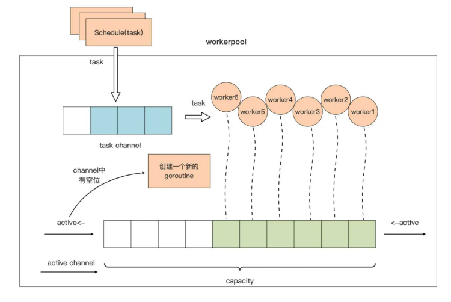

# Light Weight Thread Pool

> 轻量级线程池

Go 的两个核心语法知识点：接口与并发原语。它们分别是耦合设计与并发设计的主要参与者，Go 应用的骨架设计离不开它们。 

关于接口类型做为“关节”作用的演示，前面的两个小实战项目中都有一定的体现。

而且，接口类型对 Go 应用静态骨架的编织作用，在接口类型数量较多的项目中体现得更明显。 

因此，这一讲的实战项目，主要围绕 Go 并发来做，实现一个轻量级线程池，也就是 Goroutine 池。

## 为什么要用到 Goroutine 池？ 

在学习 Goroutine 的时候，就说过：相对于操作系统线程，Goroutine 的开销十分小，一个 Goroutine 的起始栈大小为 2KB，而且创建、切换与销毁的代价很低， 可以创建成千上万甚至更多 Goroutine。 

所以和其他语言不同的是，Go 应用通常可以为每个新建立的连接创建一个对应的新 Goroutine，甚至是为每个传入的请求生成一个 Goroutine 去处理。

这种设计还有一个好处，实现起来十分简单，Gopher 们在编写代码时也没有很高的心智负担。 

不过，Goroutine 的开销虽然“廉价”，但也不是免费的。 

最明显的，一旦规模化后，这种非零成本也会成为瓶颈。以一个 Goroutine 分配 2KB 执行栈为例，100w Goroutine 就是 2GB 的内存消耗。 

其次，Goroutine 从 Go 1.4 版本开始采用了**连续栈**的方案，也就是每个 Goroutine 的执行栈都是一块连续内存，如果空间不足，运行时会分配一个更大的连续内存空间作为这个 Goroutine 的执行栈，将原栈内容拷贝到新分配的空间中来。 

连续栈的方案，虽然能避免 Go 1.3 采用的**分段栈**会导致的“hot split”问题，但连续栈的原理也决定了，一旦 Goroutine 的执行栈发生了 grow，那么即便这个 Goroutine 不再需要那么大的栈空间，这个 Goroutine 的栈空间也不会被 Shrink（收缩）了，这些空间可能会处于长时间闲置的状态，直到 Goroutine 退出。 

另外，随着 Goroutine 数量的增加，Go 运行时进行 Goroutine 调度的处理器消耗，也会随之增加，成为阻碍 Go 应用性能提升的重要因素。 

那么面对这样的问题，常见的应对方式是什么呢？

Goroutine 池就是一种常见的解决方案。这个方案的核心思想是对 Goroutine 的重用，也就是把 M 个计算任务调度到 N 个 Goroutine 上，而不是为每个计算任务分配一个独享的 Goroutine，从而提高计算资源的利用率。 

接下来，就来真正实现一个简单的 Goroutine 池，叫它 workerpool。

## workerpool 的实现原理

workerpool 的工作逻辑通常都很简单，所以即便是用于生产环境的 workerpool 实现， 代码规模也都在千行左右。 

当然，workerpool 有很多种实现方式，这里为了更好地演示 Go 并发模型的应用模式，以及并发原语间的协作，采用完全**基于 channel+select 的实现方案**，不使用其他数据结构，也不使用 sync 包提供的各种同步结构，比如 Mutex、RWMutex，以及 Cond 等。 

workerpool 的实现主要分为三个部分：

- pool 的创建与销毁； 
- pool 中 worker（Goroutine）的管理； 
- task 的提交与调度。

其中，后两部分是 pool 的“精髓”所在，这两部分的原理也用一张图表示了出来：



先看一下图中 pool 对 worker 的管理。

capacity 是 pool 的一个属性，代表整个 pool 中 worker 的最大容量。使用一个带缓冲的 channel：active，作为 worker 的“计数器”，这种 channel 使用模式就是讲过的**计数信号量**。 

当 active channel 可写时，就创建一个 worker，用于处理用户通过 Schedule 函数 提交的待处理的请求。当 active channel 满了的时候，pool 就会停止 worker 的创建，直到某个 worker 因故退出，active channel 又空出一个位置时，pool 才会创建新的 worker 填补那个空位。 

这张图里，把用户要提交给 workerpool 执行的请求抽象为一个 Task。Task 的提交 与调度也很简单：Task 通过 Schedule 函数提交到一个 task channel 中，已经创建的 worker 将从这个 task channel 中读取 task 并执行。 

好了！接下来，就来写一版 workerpool 的代码，来验证一下这里分析的原理是否可行。 

## workerpool 的一个最小可行实现

### 项目准备

先建立 workerpool 目录作为实战项目的源码根目录，然后为这个项目创建 go module：

```sh
$mkdir workerpool1
$cd workerpool1
$go mod init github.com/bigwhite/workerpool

# self test
$go mod init github.com/Kate-liu/GoBeginner/practiceproject/lightweightthreadpool/workpoolMVP
```

### Pool 结构体

接下来，创建 pool.go 作为 workpool 包的主要源码文件。在这个源码文件中，定义了 Pool 结构体类型，这个类型的实例代表一个 workerpool：

```go
type Pool struct {
	capacity int            // workerpool大小
  
	active   chan struct{}  // 对应上图中的active channel
	tasks    chan Task      // 对应上图中的task channel
  
	wg       sync.WaitGroup // 用于在pool销毁时等待所有worker退出
	quit     chan struct{}  // 用于通知各个worker退出的信号channel
}
```

workerpool 包对外主要提供三个 API，它们分别是：

- workerpool.New：用于创建一个 pool 类型实例，并将 pool 池的 worker 管理机制运行起来；
-  workerpool.Free：用于销毁一个 pool 池，停掉所有 pool 池中的 worker；
- Pool.Schedule：这是 Pool 类型的一个导出方法，workerpool 包的用户通过该方法向 pool 池提交待执行的任务（Task）。

接下来就重点看看这三个 API 的实现。 

### workerpool.New

先来看看 workerpool.New 是如何创建一个 pool 实例的：

```go
func New(capacity int) *Pool {
	if capacity <= 0 {
		capacity = defaultCapacity
	}
	if capacity > maxCapacity {
		capacity = maxCapacity
	}
  
	p := &Pool{
		capacity: capacity,
		tasks:    make(chan Task),
		quit:     make(chan struct{}),
		active:   make(chan struct{}, capacity),
	}
	fmt.Printf("workerpool start\n")
  
	go p.run()
  
	return p
}
```

可以看到，New 函数接受一个参数 capacity 用于指定 workerpool 池的容量，这个参数 用于控制 workerpool 最多只能有 capacity 个 worker，共同处理用户提交的任务请求。 

函数开始处有一个对 capacity 参数的“防御性”校验，当用户传入不合理的值时，函数 New 会将它纠正为合理的值。 

### Pool 类型的 run 方法

Pool 类型实例变量 p 完成初始化后，创建了一个新的 Goroutine，用于对 workerpool 进行管理，这个 Goroutine 执行的是 Pool 类型的 run 方法：

```go
func (p *Pool) run() {
	idx := 0
  
	for {
		select {
		case <-p.quit:
			return
		case p.active <- struct{}{}:
			// create a new worker
			idx++
			p.newWorker(idx)
		}
	}
}
```

run 方法内是一个无限循环，循环体中使用 select 监视 Pool 类型实例的两个 channel： quit 和 active。

这种**在 for 中使用 select 监视多个 channel 的实现**，在 Go 代码中十分常见，是一种惯用法。 

当接收到来自 quit channel 的退出“信号”时，这个 Goroutine 就会结束运行。而当 active channel 可写时，run 方法就会创建一个新的 worker Goroutine。 

此外，为了方便在程序中区分各个 worker 输出的日志，这里将一个从 1 开始的变量 idx 作为 worker 的编号，并把它以参数的形式传给创建 worker 的方法。 

### newWorker 的方法

再将创建新的 worker goroutine 的职责，封装到一个名为 newWorker 的方法中：

```go
func (p *Pool) newWorker(i int) {
	p.wg.Add(1)
	go func() {
		defer func() {
			if err := recover(); err != nil {
				fmt.Printf("worker[%03d]: recover panic[%s] and exit\n", i, err)
				<-p.active
			}
			p.wg.Done()
		}()

		fmt.Printf("worker[%03d]: start\n", i)

		for {
			select {
			case <-p.quit:
				fmt.Printf("worker[%03d]: exit\n", i)
				<-p.active
				return
			case t := <-p.tasks:
				fmt.Printf("worker[%03d]: receive a task\n", i)
				t()
			}
		}
	}()
}
```

可以看到，在创建一个新的 worker goroutine 之前，newWorker 方法会先调用 p.wg.Add 方法将 WaitGroup 的等待计数加一。

由于每个 worker 运行于一个独立的Goroutine 中，newWorker 方法通过 go 关键字创建了一个新的 Goroutine 作为 worker。 

新 worker 的核心，依然是一个基于 for-select 模式的循环语句，在循环体中，新 worker 通过 select 监视 quit 和 tasks 两个 channel。

- 和前面的 run 方法一样，当接收到来自 quit channel 的退出“信号”时，这个 worker 就会结束运行。
- tasks channel 中放置的是用户通过 Schedule 方法提交的请求，新 worker 会从这个 channel 中获取最新的 Task 并运行这个 Task。 

### Task 函数类型

Task 是一个对用户提交的请求的抽象，它的本质就是一个函数类型：

```go
type Task func()
```

这样，用户通过 Schedule 方法实际上提交的是一个函数类型的实例。 

在新 worker 中，为了防止用户提交的 task 抛出 panic，进而导致整个 workerpool 受到影响，在 worker 代码的开始处，**使用了 defer+recover 对 panic 进行捕捉**，捕捉后 worker 也是要退出的，于是还通过<-p.active更新了 worker 计数器。

并且一旦 worker goroutine 退出，p.wg.Done 也需要被调用，这样可以减少 WaitGroup 的 Goroutine 等待数量。 

### Schedule 方法

再来看 workerpool 提供给用户提交请求的导出方法 Schedule：

```go
var ErrWorkerPoolFreed = errors.New("workerpool freed") // workerpool

func (p *Pool) Schedule(t Task) error {
	select {
	case <-p.quit:
		return ErrWorkerPoolFreed
	case p.tasks <- t:
		return nil
	}
}
```

Schedule 方法的核心逻辑，是将传入的 Task 实例发送到 workerpool 的 tasks channel 中。

但考虑到现在 workerpool 已经被销毁的状态，这里通过一个 select，检视 quit channel 是否有“信号”可读，

- 如果有，就返回一个哨兵错误 ErrWorkerPoolFreed。
- 如果没有，一旦 p.tasks 可写，提交的 Task 就会被写入 tasks channel，以供 pool 中的 worker 处理。 

这里要注意的是，这里的 Pool 结构体中的 tasks 是一个无缓冲的 channel，如果 pool 中 worker 数量已达上限，而且 worker 都在处理 task 的状态，那么 Schedule 方法就会阻 塞，直到有 worker 变为 idle 状态来读取 tasks channel，schedule 的调用阻塞才会解除。 

### 验证逻辑

至此，workerpool 的最小可行实现的主要逻辑都实现完了。来验证一下它是否能按照预期逻辑运行。 

现在建立一个使用 workerpool 的项目 demo1：

```sh
$mkdir demo1
$cd demo1
$go mod init demo1

# self test
$go1.17 mod init workpoolMVPtest
```

由于要引用本地的 module，所以需要手工修改一下 demo1 的 go.mod 文件， 并利用 replace 指示符将 demo1 对 workerpool 的引用指向本地 workerpool1 路径：

```go
module demo1

go 1.17

require github.com/bigwhite/workerpool v1.0.0
replace github.com/bigwhite/workerpool v1.0.0 => ../workerpool1
```

然后创建 demo1 的 main.go 文件，源码如下：

```go
package main

import (
	"github.com/Kate-liu/GoBeginner/practiceproject/lightweightthreadpool/workpoolMVP"
	"time"
)

func main() {
	p := workpoolMVP.New(5)
	
	for i := 0; i < 10; i++ {
		err := p.Schedule(func() {
			time.Sleep(time.Second * 3)
		})
		if err != nil {
			println("task: ", i, "err:", err)
		}
	}

	p.Free()
}
```

这个示例程序创建了一个 capacity 为 5 的 workerpool 实例，并连续向这个 workerpool 提交了 10 个 task，每个 task 的逻辑很简单，只是 Sleep 3 秒后就退出。

main 函数在提交完任务后，调用 workerpool 的 Free 方法销毁 pool，pool 会等待所有 worker 执行完 task 后再退出。 

demo1 示例的运行结果如下：

```sh
$go run main.go
# 备注：直接使用 idea 运行，可能会报错！
workerpool start
worker[005]: start
worker[005]: receive a task
worker[003]: start
worker[003]: receive a task
worker[004]: start
worker[004]: receive a task
worker[001]: start
worker[002]: start
worker[001]: receive a task
worker[002]: receive a task
worker[004]: receive a task
worker[005]: receive a task
worker[003]: receive a task
worker[002]: receive a task
worker[001]: receive a task
worker[001]: exit
worker[005]: exit
worker[002]: exit
worker[003]: exit
worker[004]: exit
workerpool freed
```

从运行的输出结果来看，workerpool 的最小可行实现的运行逻辑与原理图是一致 的。 

不过，目前的 workerpool 实现好比“铁板一块”，虽然通过 capacity 参数可以 指定 workerpool 容量，但无法对 workerpool 的行为进行定制。 

比如当 workerpool 中的 worker 数量已达上限，而且 worker 都在处理 task 时，用户调用 Schedule 方法将阻塞，如果用户不想阻塞在这里，以目前的实现是做不到的。 

那可以怎么改进呢？可以尝试在上面实现的基础上，为 workerpool 添加功能选项（functional option）机制。

## 添加功能选项机制 

### 准备

功能选项机制，可以让某个包的用户可以根据自己的需求，通过设置不同功能选项来定制包的行为。

Go 语言中实现功能选项机制有多种方法，但 Go 社区目前使用最为广泛的一个方案，是 Go 语言之父 Rob Pike  2014 年在博文《自引用函数与选项设计》中论述的 一种，这种方案也被后人称为“功能选项（functional option）”方案。 

接下来，就来看看如何使用 Rob Pike 的这种“功能选项”方案，让 workerpool 支 持行为定制机制。 

首先，将 workerpool1 目录拷贝一份形成 workerpool2 目录，将在这个目录下 为 workerpool 包添加功能选项机制。 

### option.go

然后，在 workerpool2 目录下创建 option.go 文件，在这个文件中，定义用于 代表功能选项的类型 Option：

```go
type Option func(*Pool)
```

可以看到，这个 Option 实质是一个接受 *Pool 类型参数的函数类型。那么如何运用这个 Option 类型呢？

现在要做的是，明确给 workerpool 添加 什么功能选项。

这里为 workerpool 添加两个功能选项：

- Schedule 调用是否阻塞，
- 以及是否预创建所有的 worker。 

### 改造 Pool 类型

为了支持这两个功能选项，需要在 Pool 类型中增加两个 bool 类型的字段，字段的具 体含义，也在代码中注释了：

```go
type Pool struct {
	capacity int // workerpool大小

	active chan struct{} // 对应上图中的active channel
	tasks  chan Task     // 对应上图中的task channel

	wg   sync.WaitGroup // 用于在pool销毁时等待所有worker退出
	quit chan struct{}  // 用于通知各个worker退出的信号channel

	preAlloc bool // 是否在创建pool的时候就预创建workers，默认值为：false

	// 当pool满的情况下，新的Schedule调用是否阻塞当前goroutine。默认值：true
	// 如果block = false，则Schedule返回 ErrNoWorkerAvailInPool
	block bool
}
```

针对这两个字段，在 option.go 中添加两个功能选项，WithBlock 与 WithPreAllocWorkers：

```go
func WithBlock(block bool) Option {
	return func(p *Pool) {
		p.block = block
	}
}

func WithPreAllocWorkers(preAlloc bool) Option {
	return func(p *Pool) {
		p.preAlloc = preAlloc
	}
}
```

可以看到，这两个功能选项实质上是两个返回闭包函数的函数。

### 改造 New 函数

为了支持将这两个 Option 传给 workerpool，还需要改造一下 workerpool 包的 New 函数，改造后的 New 函数代码如下：

```go
func New(capacity int, opts ...Option) *Pool {
	if capacity <= 0 {
		capacity = defaultCapacity
	}
	if capacity > maxCapacity {
		capacity = maxCapacity
	}

	p := &Pool{
		capacity: capacity,
		tasks:    make(chan Task),
		quit:     make(chan struct{}),
		active:   make(chan struct{}, capacity),
	}

	for _, opt := range opts {
		opt(p)
	}

	fmt.Printf("workerpool start(preAlloc=%t)\n", p.preAlloc)
	
	if p.preAlloc {
		// create all goroutines and send into works channel
		for i := 0; i < p.capacity; i++ {
			p.newWorker(i + 1)
			p.active <- struct{}{}
		}
	}

	go p.run()

	return p
}
```

新版 New 函数除了接受 capacity 参数之外，还在它的参数列表中增加了一个类型为 Option 的可变长参数 opts。在 New 函数体中，通过一个 for 循环，将传入的 Option 运用到 Pool 类型的实例上。 

新版 New 函数还会根据 preAlloc 的值来判断是否预创建所有的 worker，如果需要，就调用 newWorker 方法把所有 worker 都创建出来。newWorker 的实现与上一版代码并没有什么差异，这里就不再详说了。 

### Pool 的 run 方法

但由于 preAlloc 选项的加入，Pool 的 run 方法的实现有了变化，来看一下：

```go
func (p *Pool) run() {
	idx := len(p.active)
	
	if !p.preAlloc {
	loop:
		for t := range p.tasks {
			p.returnTask(t)
			select {
			case <-p.quit:
				return
			case p.active <- struct{}{}:
				idx++
				p.newWorker(idx)
			default:
				break loop
			}
		}
	}
	
	for {
		select {
		case <-p.quit:
			return
		case p.active <- struct{}{}:
			// create a new worker
			idx++
			p.newWorker(idx)
		}
	}
}
```

新版 run 方法在 preAlloc=false 时，会根据 tasks channel 的情况在适合的时候创建 worker，直到 active channel 写满，才会进入到和第一版代码一样的调度逻辑中。 

### Schedule 函数

而且，提供给用户的 Schedule 函数也因 WithBlock 选项，有了一些变化：

````go
var (
	ErrNoIdleWorkerInPool = errors.New("no idle worker in pool") // workerpool中任务已满，没有空闲goroutine用于处理新任务
	ErrWorkerPoolFreed    = errors.New("workerpool freed")       // workerpool已终止运行
)

func (p *Pool) Schedule(t Task) error {
	select {
	case <-p.quit:
		return ErrWorkerPoolFreed
	case p.tasks <- t:
		return nil
	default:
		if p.block {
			p.tasks <- t
			return nil
		}
		return ErrNoIdleWorkerInPool
	}
}
````

Schedule 在 tasks chanel 无法写入的情况下，进入 default 分支。在 default 分支中， Schedule 根据 block 字段的值，决定究竟是继续阻塞在 tasks channel 上，还是返回 ErrNoIdleWorkerInPool 错误。 

### 验证逻辑

和第一版 worker 代码一样，也来验证一下新增的功能选项是否好用。

建立一个使用新版 workerpool 的项目 demo2，demo2 的 go.mod 与 demo1 的 go.mod 相 似：

```sh
module demo2

go 1.17

require github.com/bigwhite/workerpool v1.0.0
replace github.com/bigwhite/workerpool v1.0.0 => ../workerpool2
```

demo2 的 main.go 文件如下：

```go
package main

import (
	"fmt"
	"github.com/Kate-liu/GoBeginner/practiceproject/lightweightthreadpool/workpoolMVPOption"
	"time"
)

func main() {
	p := workpoolMVPOption.New(5, workpoolMVPOption.WithPreAllocWorkers(false), workpoolMVPOption.WithBlock(false))

	time.Sleep(time.Second * 2)
	for i := 0; i < 10; i++ {
		err := p.Schedule(func() {
			time.Sleep(time.Second * 3)
		})
		if err != nil {
			fmt.Printf("task[%d]: error: %s\n", i, err.Error())
		}
	}
  
	p.Free()
}
```

在 demo2 中，使用 workerpool 包提供的功能选项，设置了期望的 workerpool 的运作行为，包括不要预创建 worker，以及不要阻塞 Schedule 调用。 

考虑到 Goroutine 调度的次序的不确定性，这里在创建 workerpool 与真正开始调用 Schedule 方法之间，做了一个 Sleep，尽量减少 Schedule 都返回失败的频率（但这仍然无法保证这种情况不会发生）。 

运行 demo2，会得到这个结果：

```sh
$go run main.go
# 备注：直接使用 idea 运行，可能会报错！
workerpool start(preAlloc=false)
task[1]: error: no idle worker in pool
worker[001]: start
task[2]: error: no idle worker in pool
task[4]: error: no idle worker in pool
task[5]: error: no idle worker in pool
task[6]: error: no idle worker in pool
task[7]: error: no idle worker in pool
task[8]: error: no idle worker in pool
task[9]: error: no idle worker in pool
worker[001]: receive a task
worker[002]: start
worker[002]: exit
worker[001]: receive a task
worker[001]: exit
workerpool freed(preAlloc=false)
```

不过，由于 Goroutine 调度的不确定性，这个结果仅仅是很多种结果的一种。

可以看到， 仅仅 001 这个 worker 收到了 task，其余的 worker 都因为 worker 尚未创建完毕，而返回了错误，而不是像 demo1 那样阻塞在 Schedule 调用上。 

## 小结 

基于Go 并发方面的内容，设计并实现了一个 workerpool 的最小可行实现，只用了不到 200 行代码。

为了理解 Go 并发原语是如何运用的，这个 workerpool 实现完全基于 channel+select，并没有使用到 sync 包提供的各种锁。 

还基于 workerpool 的最小可行实现，为这个 pool 增加了功能选项的支持，采用的功能选项方案也是 Go 社区最为流行的方案，日常编码中如果遇到了类似的需求可 以重点参考。 

最后要提醒：上面设计与实现的 workerpool 只是一个演示项目，不能作为生产项目 使用。 


