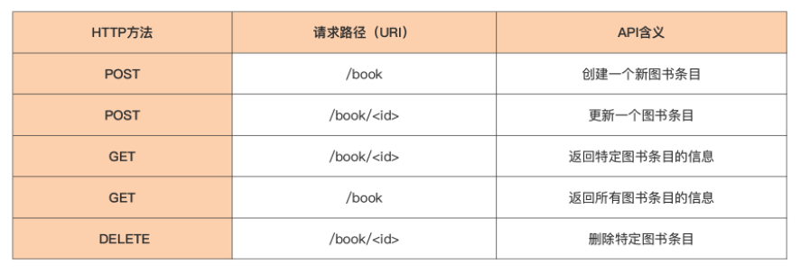
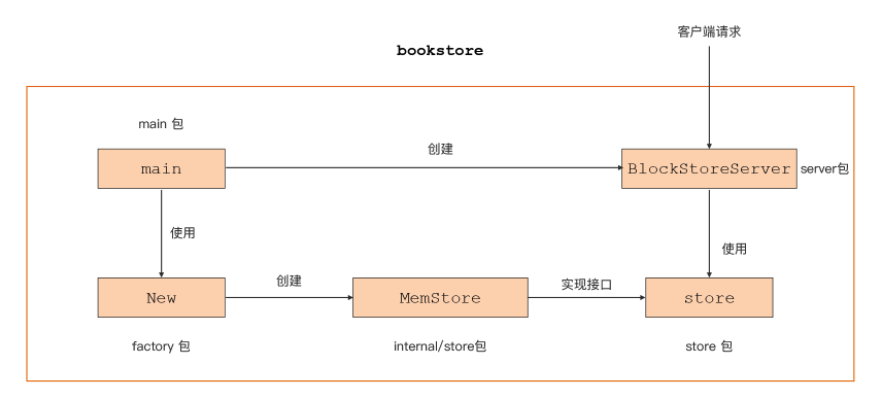

# web server project

在这个小项目里，不要困在各种语法里，而是先“照猫画虎”地写一遍、跑一次，感受 Go 项目的结构，体会 Go 语言的魅力。 

## 预热：最简单的 HTTP 服务 

查阅 Go 官方用户 2020 调查报告，找到 Go 应用最广泛的领域调查结果图，如下所示：


Go 应用的前 4 个领域中，有两个都是 Web 服务相关的。一个是排在第一位的 API/RPC 服务，另一个是排在第四位的 Web 服务（返回 html 页面）。

后续把Go 应用于 Web 服务领域的机会比较大，所以，就选择一个 Web 服务项目 作为实战小项目。 

不过在真正开始实战小项目前，先来预热一下，做一下技术铺垫。

先来给演示一下在 Go 中创建一个基于 HTTP 协议的 Web 服务是多么的简单。 这种简单又要归功于 **Go“面向工程”特性**。

在介绍 Go 的设计哲学时，Go“面向工程”的特性，不仅体现在语言设计方面时刻考虑开发人员的体验，而且它还提供了完善的工具链和“自带电池”的标准库，这就使得 Go 程序大大减少了对外部第三方包的依赖。

以开发 Web 服务为例，可以基于 Go 标准库提供的 **net/http 包**，轻 松构建一个承载 Web 内容传输的 HTTP 服务。 

下面，就来构建一个最简单的 HTTP 服务，这个服务的功能很简单，就是当收到一个 HTTP 请求后，给请求方返回包含“hello, world”数据的响应。 

首先按下面步骤建立一个 simple-http-server 目录，并创建一个名为 simple-http-server 的 Go Module：

```sh
$mkdir simple-http-server
$cd simple-http-server
$go mod init simple-http-server
```

### main.go

由于这个 HTTP 服务比较简单，采用最简项目布局，也就是在 simple-http-server 目 录下创建一个 main.go 源文件：

```go
package main

import "net/http"

func main() {
	http.HandleFunc("/", func(w http.ResponseWriter, r *http.Request) {
		w.Write([]byte("hello world"))
	})

	http.ListenAndServe(":8080", nil)
}
```

这些代码就是一个最简单的 HTTP 服务的实现了。在这个实现中，只使用了 Go 标准库的 http 包。只需要大致了解上面 代码的结构与原理就可以了。 

这段代码里，要注意两个重要的函数，一个是 ListenAndServe，另一个是 HandleFunc。 

### ListenAndServe 函数

代码的第 9 行，通过 http 包提供的 ListenAndServe 函数，建立起一个 HTTP 服务，这个服务监听本地的 8080 端口。客户端通过这个端口与服务建立连接，发送 HTTP 请求就可以得到相应的响应结果。 

### 处理客户端发送的请求函数

那么服务端是如何处理客户端发送的请求的呢？看上面代码中的第 6 行。在这一行 中，为这个服务设置了一个处理函数。

这个函数的函数原型是这样的：

```go
func(w http.ResponseWriter, r *http.Request)
```

这个函数里有两个参数，w 和 r。第二个参数 r 代表来自客户端的 HTTP 请求，第一个参数 w 则是用来操作返回给客户端的应答的，基于 http 包实现的 HTTP 服务的处理函数都要符合这一原型。 

### URI 路径匹配

在这个例子中，所有来自客户端的请求，无论请求的 URI 路径 （RequestURI）是什么，请求都会被设置的处理函数处理。为什么会这样呢？ 

这是因为，通过 http.HandleFunc 设置这个处理函数时，传入的模式字符串 为“/”。

HTTP 服务器在收到请求后，会将请求中的 URI 路径与设置的模式字符串进行**最 长前缀匹配**，并执行匹配到的模式字符串所对应的处理函数。

在这个例子中，仅设置了“/”这一个模式字符串，并且所有请求的 URI 都能与之匹配，自然所有请求都会被设置的处理函数处理。 

### 编译运行

接着，再来编译运行一下这个程序，直观感受一下 HTTP 服务处理请求的过程。

首先按下面步骤来编译并运行这个程序：

```sh
$cd simple-http-server
$go build
$./simple-http-server
```

### curl 测试

接下来，用 curl 命令行工具模拟客户端，向上述服务建立连接并发送 http 请求：

```sh
$curl localhost:8080/
# 或者
$curl 127.0.0.1:8080/ 
hello world
```

curl 成功得到了 http 服务返回的“hello, world”响应数据。到此，HTTP 服务就构建成功了。 

当然了，真实世界的 Web 服务不可能像上述例子这么简单，这仅仅是一个“预热”。使用 Go 构建 Web 服务是非常容易的。并且，这样的预热也能初步了解实 现代码的结构，先有一个技术铺垫。 


## 图书管理 API 服务 

首先，先来明确一下业务逻辑。 

在这个实战小项目中，模拟的是真实世界的一个书店的图书管理后端服务。这个服务 为平台前端以及其他客户端，提供针对图书的 CRUD（创建、检索、更新与删除）的基于 HTTP 协议的 API。

API 采用典型的 Restful 风格设计，这个服务提供的 API 集合如下：



这个 API 服务的逻辑并不复杂。简单来说，通过 id 来唯一标识一本书，对于图书来说，这个 id 通常是 ISBN 号。

至于客户端和服务端中请求与响应的数据，采用放在 HTTP 协议包体（Body）中的 Json 格式数据来承载。 

### 项目建立与布局设计 

按照下面步骤创建一个名为 bookstore 的 Go 项目并创建对应的 Go Module：

```sh
$mkdir bookstore
$cd bookstore
$go mod init bookstore
go: creating new go.mod: module bookstore
```

通过上面的业务逻辑说明，可以把这个服务大体拆分为两大部分，

- 一部分是 HTTP 服务器，用来对外提供 API 服务；
- 另一部分是图书数据的存储模块，所有的图书数据均存储在这里。 

同时，这是一个以构建可执行程序为目的的 Go 项目，参考 Go 项目布局标准中的项目布局，把这个项目的结构布局设计成这样：

```go
.
├── cmd/
│   └── bookstore/  // 放置bookstore main包源码
│       └── main.go
├── go.mod   // module bookstore 的go.mod
├── internal/  // 存放项目内部包的目录
│   └── store/
│       └── memstore.go
├── server/   // HTTP服务器模块
│   ├── middleware/
│   │   └── middleware.go
│   └── server.go
└── store/  // 图书数据存储模块
    ├── factory/
    │   └── factory.go
    └── store.go
```

### 项目 main 包 

main 包是主要包，为了搞清楚各个模块之间的关系，在这里给出了 main 包的实现逻辑图：



同时，也列出了 main 包（main.go）的所有代码：

```go
package main

import (
   "context"
   _ "github.com/Kate-liu/GoBeginner/webserverproject/bookstore/internal/store"
   "github.com/Kate-liu/GoBeginner/webserverproject/bookstore/server"
   "github.com/Kate-liu/GoBeginner/webserverproject/bookstore/store/factory"
   "log"
   "os"
   "os/signal"
   "syscall"
   "time"
)

func main() {
   s, err := factory.New("mem") // 创建图书数据存储模块实例
   if err != nil {
      panic(err)
   }

   srv := server.NewBookStoreServer(":8080", s) // 创建http服务实例
   
   errChan, err := srv.ListenAndServe()         // 运行http服务
   if err != nil {
      log.Println("web server start failed:", err)
      return
   }
   log.Println("web server start ok")
   
   c := make(chan os.Signal, 1)
   signal.Notify(c, syscall.SIGINT, syscall.SIGTERM)
   
   select { // 监视来自errChan以及c的事件
   case err = <-errChan:
      log.Println("web server run failed:", err)
      return
   case <-c:
      log.Println("bookstore program is exiting...")
      ctx, cf := context.WithTimeout(context.Background(), time.Second)
      defer cf()
      err = srv.Shutdown(ctx) // 优雅关闭http服务实例
   }
   
   if err != nil {
      log.Println("bookstore program exit error:", err)
      return
   }
   log.Println("bookstore program exit ok")
}
```

在 Go 中，main 包不仅包含了整个程序的入口，它还是整个程序中主要模块初始化与组装的场所。

那对应在这个程序中，主要模块就是第 16 行的创建图书存储模块实例，以及第 21 行创建 HTTP 服务模块实例。

而且，还要注意的是，第 21 行创建 HTTP 服务模块实例的时候，把图书数据存储实例 s 作为参数，传递给了 NewBookStoreServer 函 数。

这里，重点来看 main 函数的后半部分（第 30 行~ 第 42 行），这里表示的是，通过监视系统信号实现了 http 服务实例的**优雅退出**。

所谓优雅退出，指的就是程序有机会等待其他的事情处理完再退出。比如尚未完成的事务处理、清理资源（比如关闭文件描述符、关闭 socket）、保存必要中间状态、内存数据持久化落盘，等等。

如果经常用 Go 来编写 http 服务，那么 http 服务如何优雅退出，就是经常要考虑的问题。 在这个问题的具体实现上，**通过 signal 包的 Notify 捕获了 SIGINT、SIGTERM 这两 个系统信号**。这样，当这两个信号中的任何一个触发时，http 服务实例都有机会在退出前做一些清理工作。 

然后，再使用 **http 服务实例（srv）自身提供的 Shutdown 方法**，来实现 http 服务实例内部的退出清理工作，包括：立即关闭所有 listener、关闭所有空闲的连接、等待处于活动状态的连接处理完毕，等等。

当 http 服务实例的清理工作完成后，整个程序就可 以正常退出了。 

接下来，再重点看看构成 bookstore 程序的两个主要模块：图书数据存储模块与 HTTP 服务模块的实现。按照 main 函数中的初始化顺序，先来看看图书数据存储模 块。


### 图书数据存储模块（store)

图书数据存储模块的职责很清晰，就是用来存储整个 bookstore 的图书数据的。图书数据存储有很多种实现方式，最简单的方式莫过于在内存中创建一个 map，以图书 id 作为 key，来保存图书信息，采用这种方式。

但如果要考虑上生产环 境，数据要进行持久化，那么最实际的方式就是通过 Nosql 数据库甚至是关系型数据库， 实现对图书数据的存储与管理。

#### store 接口

考虑到对多种存储实现方式的支持，将针对图书的有限种存储操作，放置在一个接口 类型 Store 中，如下源码所示：

```go
// store/store.go

package store

type Book struct {
   Id      string   `json:"id"`      // 图书ISBN ID
   Name    string   `json:"name"`    // 图书名称
   Authors []string `json:"authors"` // 图书作者
   Press   string   `json:"press"`   // 出版社
}

type Store interface {
   Create(*Book) error       // 创建一个新图书条目
   Update(*Book) error       // 更新某图书条目
   Get(string) (Book, error) // 获取某图书信息
   GetAll() ([]Book, error)  // 获取所有图书信息
   Delete(string) error      // 删除某图书条目
}
```

建立了一个对应图书条目的抽象数据类型 Book，以及针对 Book 存取的接口类 型 Store。

这样，对于想要进行图书数据操作的一方来说，只需要得到一个满足 Store 接口的实例，就可以实现对图书数据的存储操作了，不用再关心图书数据究竟采用了何种 存储方式。

这就实现了图书存储操作与底层图书数据存储方式的解耦。而且，这种**面向接口编程**也是 Go 组合设计哲学的一个重要体现。 

具体如何创建一个满足 Store 接口的实例呢？

可以参考《设计模式》提供的多种**创建型模式**，选择一种 Go 风格的工厂模式（创建型模式的一种）来实现满足 Store 接口实例的创建。

#### store/factory 包

看一下 store/factory 包的源码：

```go
// store/factory/factory.go

package factory

import (
   "fmt"
   "github.com/Kate-liu/GoBeginner/webserverproject/bookstore/store"
   "sync"
)

var (
   providersMu sync.RWMutex
   providers   = make(map[string]store.Store)
)

func Register(name string, p store.Store) {
   providersMu.Lock()
   defer providersMu.Unlock()
   if p == nil {
      panic("store: Register provider is nil")
   }
   if _, dup := providers[name]; dup {
      panic("store: Register called twice for provider " + name)
   }
   providers[name] = p
}

func New(providerName string) (store.Store, error) {
   providersMu.RLock()
   p, ok := providers[providerName]
   providersMu.RUnlock()
  
   if !ok {
      return nil, fmt.Errorf("store: unknown provider %s", providerName)
   }
   return p, nil
}
```

这段代码实际上是效仿了 Go 标准库的 database/sql 包采用的方式，factory 包采用了一 个 **map 类型数据**，对工厂可以“生产”的、满足 Store 接口的实例类型进行管理。 factory 包还提供了 **Register 函数**，让各个实现 Store 接口的类型可以把自己“注册”到 工厂中来。 

一旦注册成功，factory 包就可以“生产”出这种满足 Store 接口的类型实例。而依赖 Store 接口的使用方，只需要调用 factory 包的 New 函数，再传入期望使用的图书存储实现的名称，就可以得到对应的类型实例了。 

#### internal/store

在项目的 internal/store 目录下，还提供了一个**基于内存 map 的 Store 接口的实 现**，具体看一下这个实现是怎么自注册到 factory 包中的：

```go
// internal/store/memstore.go

package store

import (
   mystore "github.com/Kate-liu/GoBeginner/webserverproject/bookstore/store"
   factory "github.com/Kate-liu/GoBeginner/webserverproject/bookstore/store/factory"
   "sync"
)

func init() {
   factory.Register("mem", &MemStore{
      books: make(map[string]*mystore.Book),
   })
}

type MemStore struct {
   sync.RWMutex
   books map[string]*mystore.Book
}
```

从 memstore 的代码来看，它是在包的 init 函数中调用 factory 包提供的 Register 函数，把自己的实例以“mem”的名称注册到 factory 中的。

这样做有一个好处，依赖 Store 接口进行图书数据管理的一方，只要导入 internal/store 这个包，就可以自动完成注册动作了。 

理解了这个之后，再看下面 main 包中，创建图书数据存储模块实例时采用的代码， 是不是就豁然开朗了？

```go
package main

import (
   _ "github.com/Kate-liu/GoBeginner/webserverproject/bookstore/internal/store"  // internal/store将自身注册到factory中
  // ...
)

func main() {
   s, err := factory.New("mem") // 创建图书数据存储模块实例
   if err != nil {
      panic(err)
   }
  
  // ...
}
```

至于 memstore.go 中图书数据存储的具体逻辑，就比较简单了。 


### HTTP 服务模块（server）

HTTP 服务模块的职责是对外提供 HTTP API 服务，处理来自客户端的各种请求，并通过 Store 接口实例执行针对图书数据的相关操作。

这里，抽象处理一个 server 包，这个 包中定义了一个 BookStoreServer 类型如下：

```go
// server/server.go

package server

import (
   "github.com/Kate-liu/GoBeginner/webserverproject/bookstore/store"
   "net/http"
)

type BookStoreServer struct {
   s store.Store
   srv *http.Server
}
```

这个类型实质上就是一个标准库的 http.Server，并且组合了来自 store.Store 接口的能力。

server 包提供了 NewBookStoreServer 函数，用来创建一个 BookStoreServer 类型实例：

```go
// server/server.go

func NewBookStoreServer(addr string, s store.Store) *BookStoreServer {
   srv := &BookStoreServer{
      s: s,
      srv: &http.Server{
         Addr: addr,
      },
   }

   router := mux.NewRouter()
   router.HandleFunc("/book", srv.createBookHandler).Methods("POST")
   router.HandleFunc("/book/{id}", srv.updateBookHandler).Methods("POST")
   router.HandleFunc("/book/{id}", srv.getBookHandler).Methods("GET")
   router.HandleFunc("/book", srv.getAllBooksHandler).Methods("GET")
   router.HandleFunc("/book/{id}", srv.delBookHandler).Methods("DELETE")

   srv.srv.Handler = middleware.Logging(middleware.Validating(router))
   return srv
}
```

函数 NewBookStoreServer 接受两个参数，一个是 HTTP 服务监听的服务地 址，另外一个是实现了 store.Store 接口的类型实例。

这种函数原型的设计是 Go 语言的一种惯用设计方法，也就是**接受一个接口类型参数，返回一个具体类型**。返回的具体类型组合了传入的接口类型的能力。 

这个时候，和前面预热时实现的简单 http 服务一样，还需为 HTTP 服务器设置请求的处理函数。 

由于这个服务请求 URI 的模式字符串比较复杂，标准库 http 包内置的 URI 路径模式匹配器（ServeMux，也称为路由管理器）不能满足需求，因此在这里，需要借助一个**第三方包 github.com/gorilla/mux** 来实现需求。 

在上面代码的第 11 行到第 16 行，针对不同 URI 路径模式设置了不同的处理函数。

以 createBookHandler 和 getBookHandler 为例来看看这些处理函数的实现：

```go
// server/server.go

func (bs *BookStoreServer) createBookHandler(w http.ResponseWriter, req *http.Request) {
	dec := json.NewDecoder(req.Body)
	var book store.Book
	if err := dec.Decode(&book); err != nil {
		http.Error(w, err.Error(), http.StatusBadRequest)
		return
	}
	if err := bs.s.Create(&book); err != nil {
		http.Error(w, err.Error(), http.StatusBadRequest)
		return
	}
}

func (bs *BookStoreServer) getBookHandler(w http.ResponseWriter, req *http.Request) {
	id, ok := mux.Vars(req)["id"]
	if !ok {
		http.Error(w, "no id found in request", http.StatusBadRequest)
		return
	}
	book, err := bs.s.Get(id)
	if err != nil {
		http.Error(w, err.Error(), http.StatusBadRequest)
		return
	}
	response(w, book)
}

func response(w http.ResponseWriter, v interface{}) {
	data, err := json.Marshal(v)
	if err != nil {
		http.Error(w, err.Error(), http.StatusInternalServerError)
		return
	}
	w.Header().Set("Content-Type", "application/json")
	w.Write(data)
}
```

这些处理函数的实现都大同小异，都是先获取 http 请求包体数据，然后通过标准库 json 包将这些数据，解码（decode）为需要的 store.Book 结构体实例，再通过 Store 接口对图书数据进行存储操作。

如果是获取图书数据的请求，那么处理函数将通过 response 函数，把取出的图书数据编码到 http 响应的包体中，并返回给客户端。 

然后，在 NewBookStoreServer 函数实现的尾部，还看到了这样一行代码：

```go
srv.srv.Handler = middleware.Logging(middleware.Validating(router))
```

这行代码的意思是说，在 router 的外围包裹了两层 middleware。

什么是 middleware 呢？对于上下文来说，这些 middleware 就是一些通用的 http 处理函数。

看一下这里的两个 middleware，也就是 Logging 与 Validating 函数的实现：

```go
// server/middleware/middleware.go

package middleware

import (
   "log"
   "mime"
   "net/http"
)

func Logging(next http.Handler) http.Handler {
   return http.HandlerFunc(func(w http.ResponseWriter, req *http.Request) {
      log.Printf("recv a %s request from %s", req.Method, req.RemoteAddr)
      next.ServeHTTP(w, req)
   })
}

func Validating(next http.Handler) http.Handler {
   return http.HandlerFunc(func(w http.ResponseWriter, req *http.Request) {
      contentType := req.Header.Get("Content-Type")
      mediatype, _, err := mime.ParseMediaType(contentType)
      if err != nil {
         http.Error(w, err.Error(), http.StatusBadRequest)
         return
      }
      if mediatype != "application/json" {
         http.Error(w, "invalid Content-Type", http.StatusUnsupportedMediaType)
         return
      }
      next.ServeHTTP(w, req)
   })
}
```

Logging 函数主要用来输出每个到达的 HTTP 请求的一些概要信息，而 Validating 则会对每个 http 请求的头部进行检查，检查 Content-Type 头字段所表示的 媒体类型是否为 application/json。

这些通用的 middleware 函数，会被串联到每个真正的处理函数之前，避免在每个处理函数中重复实现这些逻辑。 

创建完 BookStoreServer 实例后，就可以**调用其 ListenAndServe 方法**运行这个 http 服务了，显然这个方法的名字是仿效 http.Server 类型的同名方法，实现是这 样的：

```go
// server/server.go

func (bs *BookStoreServer) ListenAndServe() (<-chan error, error) {
   var err error
   errChan := make(chan error)
   go func() {
      err = bs.srv.ListenAndServe()
      errChan <- err
   }()
   select {
   case err = <-errChan:
      return nil, err
   case <-time.After(time.Second):
      return errChan, nil
   }
}
```

这个函数把 BookStoreServer 内部的 http.Server 的运行，放置到一个单独的 轻量级线程 Goroutine 中。

这是因为，http.Server.ListenAndServe 会阻塞代码的继续运行，如果不把它放在单独的 Goroutine 中，后面的代码将无法得到执行。

为了检测到 http.Server.ListenAndServe 的运行状态，再通过一个 channel（位于第 5 行的 errChan），在新创建的 Goroutine 与主 Goroutine 之间建立的通信渠道。通过这个渠道，能及时得到 http server 的运行状态。 


### 编译、运行与验证 

到这里，bookstore 项目的大部分重要代码都分析了一遍，是时候将程序跑起来看看 了。 

不过，因为在程序中引入了一个第三方依赖包，所以在构建项目之前，需要执行 下面这个命令，让 Go 命令自动分析依赖项和版本，并更新 go.mod：

```sh
$go mod tidy
go: finding module for package github.com/gorilla/mux
go: downloading github.com/gorilla/mux v1.8.0
go: found github.com/gorilla/mux in github.com/gorilla/mux v1.8.0
```

完成后，就可以按下面的步骤来构建并执行 bookstore 了：

```sh
$go build cmd/bookstore/main.go
$./main
2021/12/22 12:34:46 web server start ok
```

如果看到上面这个输出的日志，说明程序启动成功了。 

现在，就可以使用 **curl 命令行工具**，模仿客户端向 bookstore 服务发起请 求了，比如创建一个新书条目：

```sh
$curl -X POST -H "Content-Type:application/json" -d '{"id": "978-7-111-55842-2", "name": "The Go Programming Language", "authors":["Alan A.A.Donovan", "Brian W. Kergnighan"],"press": "Pearson Education"}' 127.0.0.1:8080/book
```

此时服务端会输出如下日志，表明 bookstore 服务收到了客户端请求。

```sh
2021/12/22 12:49:08 recv a POST request from 127.0.0.1:57575
```

接下来，再来获取一下这本书的信息：

```sh
$curl -X GET -H "Content-Type:application/json" 127.0.0.1:8080/book/978-7-111-55842-2
{"id":"978-7-111-55842-2","name":"The Go Programming Language","authors":["Alan A.A.Donovan","Brian W. Kergnighan"],"press":"Pearson Education"}
```

看到 curl 得到的响应与预期的是一致的。 

该项目包含，Go 编码时常用的一些惯用法，比如基于接口的组合、类似 database/sql 所使用的惯用创建模式，等等。 


