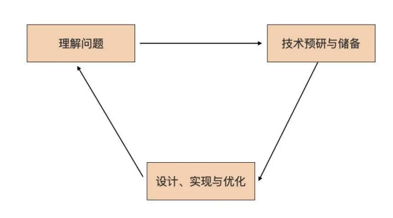
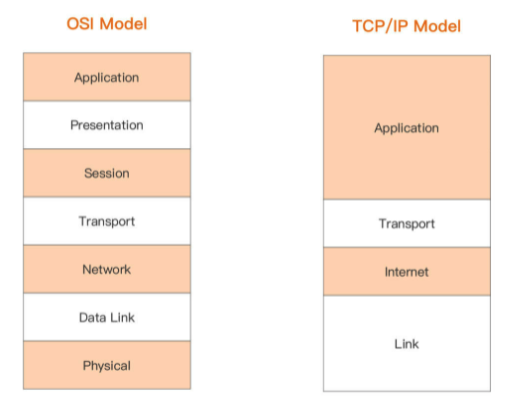
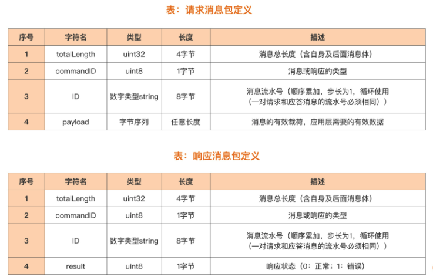
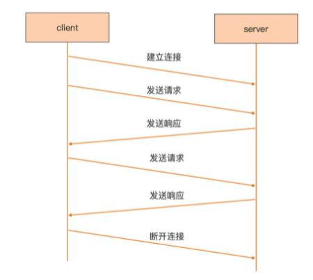
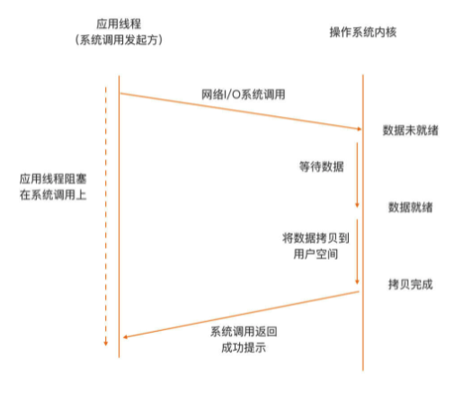
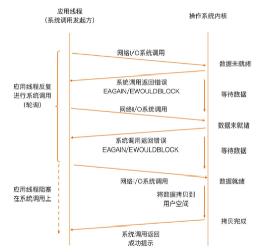
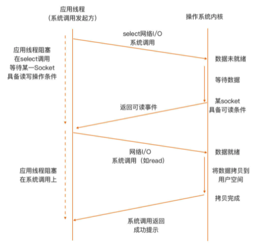
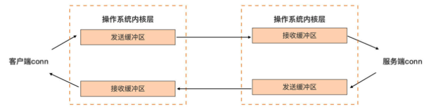

# Web TCP Server

## 实际问题的解决思路

实战篇的职责是走完 Go 语言学习的“最后一公里”，那究竟什么是“最后一公里呢？该如何理解这最后一公里呢？ 

在掌握了前面的 Go 语言语法的前提下，这“最后一公里”就是面对一个实际问题的解决思路。

很多语言初学者都有这样一个问题，即便学完了语法，面对一个实际问题时，还是也不知道该从何处着手。 其实这个事并没有那么难，尤其是程序员这一行，遇到一个实际问题，通常使用这个思路：



简单解释一下这张图。 

首先是要理解问题。解决实际问题的过程起始于对问题的理解。要搞清楚为什么会有这个问题，问题究竟是什么。对于技术人员来说，最终目的是识别出可能要用到的技术点。 

然后要对识别出的技术点，做相应的技术预研与储备。怎么做技术预研呢？至少要了解技术诞生的背景、技术的原理、技术能解决哪些问题以及不能解决哪些问题，还有技术的优点与不足，等等。当然，如果没有新技术点，可以忽略这一步。

最后，要基于技术预研和储备的结果，进行解决方案的设计与实现，这个是技术人最擅长的。 

那为什么这个解决实际问题的步骤是一个循环呢？这是由问题的难易程度，以及人的认知能力有差别所决定的。

如果问题简单或人的认知能力很强，可以一次性解决这个实际问题；如果问题复杂或人的认知能力稍弱，那么一个循环可能无法彻底解决这个问题，就会再一次进入该循环，直到问题得到完美解决。 

在实战篇的三讲中，就来“走一遍”这个过程。 

那选一个什么例子呢？还是从Go 官方用户 2020 调查报告中寻找答案，看 看“用 Go 在哪些领域开展工作”的调查结果：


可以看到，“Web 编程”和“网络编程”分别位列第一名和第四名，曾接触过简单的 Web 编程，因此这里，选择一个不同于 Web 编程的网络编程的例子，做为实战篇的实战项目。

在实战篇的三讲中，就参照这个实际问题解决过程循环，逐步来解决一个网络编程类的实际问题。 

## 什么是网络编程

什么是网络编程呢？

网络编程的范围很大，因为熟知的网络是分层的，OSI 规定了七 层参考模型，而实际上使用的主流网络模型实现，是 TCP/IP 模型，它只有四层：



通常来说，更多关注 OSI 网络模型中的传输层（四层）与应用层（七层），也就是 TCP/IP 网络模型中的最上面两层。 

TCP/IP 网络模型，实现了两种传输层协议：TCP 和 UDP。

- TCP 是面向连接的流协议，为通信的两端提供稳定可靠的数据传输服务；
- 而 UDP 则提供了一种无需建立连接就可以发送数据包的方法。

两种协议各有擅长的应用场景。 

日常开发中使用最多的是 TCP 协议。基于 TCP 协议，实现了各种各样的满足用 户需求的应用层协议。比如，常用的 HTTP 协议就是应用层协议的一种，而且是使用得最广泛的一种。

而基于 HTTP 的 Web 编程就是一种针对应用层的网络编程。还可以基于传输层暴露给开发者的编程接口，实现应用层的自定义应用协议。 

这个传输层暴露给开发者的编程接口，究竟是什么呢？目前各大主流操作系统平台中，最常用的传输层暴露给用户的网络编程接口，就是套接字（socket）。

直接基于 socket 编程实现应用层通信业务，也是最常见的一种网络编程形式。

所以，就使用一个基于 socket 网络编程的例子，先来看看这个例子对应的实际问题是什么。

## 问题描述 

面临的实际问题是这样的：实现一个基于 TCP 的自定义应用层协议的通信服务端。

仅仅这一句话，可能还不是很清楚，展开说明一下。 

输入，是一个基于传输层自定义的应用层协议规范。由于 TCP 是面向连接的流协议传输机制，数据流本身没有明显的边界，这样定义协议时，就需要自行定义确定边界的方法。

因此，基于 TCP 的自定义应用层协议通常有两种常见的定义模式：

- **二进制模式**：采用长度字段标识独立数据包的边界。采用这种方式定义的常见协议包括 MQTT（物联网最常用的应用层协议之一）、SMPP（短信网关点对点接口协议）等； 
- **文本模式**：采用特定分隔符标识流中的数据包的边界，常见的包括 HTTP 协议等。

相比之下，二进制模式要比文本模式编码更紧凑也更高效，所以这个问题中的自定义协议也采用了二进制模式，协议规范内容如下图：



关于协议内容的分析，放到设计与实现的那一讲中再细说，这里再看一下使用这个协议的通信两端的通信流程：



可以看到，这是一个典型的“请求 / 响应”通信模型。

连接由客户端发起，建立连接后， 客户端发起请求，服务端收到请求后处理并返回响应，就这样一个请求一个响应的进行下去，直到客户端主动断开连接为止。 

而任务，就是实现支持这个协议通信的服务端。 

先假设各位小伙伴都没有亲自开发过类似的通信服务器，所以当理解完这个问题后， 需要识别出解决这一问题可能使用到的技术点。

不过这个问题并不复杂，可以很 容易地识别出其中的技术点。 

首先，前面说过 socket 是传输层给用户提供的编程接口，要进行的网络通信绕不开 socket，因此首先需要了解 socket 编程模型。 

其次，一旦通过 socket 将双方的连接建立后，剩下的就是通过网络 I/O 操作在两端收发数据了，学习基本网络 I/O 操作的方法与注意事项也必不可少。 

最后，任何一端准备发送数据或收到数据后都要对数据进行操作，由于 TCP 是流协议，需要了解针对字节的操作。 

按照问题解决循环，一旦识别出技术点，接下来要做的就是技术预研与储备。

在 Go 中，字节操作基本上就是 byte 切片的操作。所以，就来学习一下 socket 编程模型以及网络 I/O 操作，为后两讲的设计与实现打稳根基，做好铺垫。 

## TCP Socket 编程模型

TCP Socket 诞生以来，它的编程模型，也就是网络 I/O 模型已几经演化。网络 I/O 模型定义的是应用线程与操作系统内核之间的交互行为模式。

通常用阻塞（Blocking）/非阻塞（Non-Blocking）来描述网络 I/O 模型。 阻塞 / 非阻塞，是以内核是否等数据全部就绪后，才返回（给发起系统调用的应用线程） 来区分的。

如果内核一直等到全部数据就绪才返回，这种行为模式就称为阻塞。如果内核 查看数据就绪状态后，即便没有就绪也立即返回错误（给发起系统调用的应用线程），那么这种行为模式则称为非阻塞。 

常用的网络 I/O 模型包括下面这几种：

### 阻塞 I/O(Blocking I/O)

阻塞 I/O 是最常用的模型，这个模型下应用线程与内核之间的交互行为模式是这样的：



可以看到，在阻塞 I/O 模型下，当用户空间应用线程，向操作系统内核发起 I/O 请求后 （一般为操作系统提供的 I/O 系列系统调用），内核会尝试执行这个 I/O 操作，并等所有数据就绪后，将数据从内核空间拷贝到用户空间，最后系统调用从内核空间返回。

而在这个期间内，用户空间应用线程将阻塞在这个 I/O 系统调用上，无法进行后续处理，只能等待。 

因此，在这样的模型下，一个线程仅能处理一个网络连接上的数据通信。即便连接上没有数据，线程也只能阻塞在对 Socket 的读操作上（以等待对端的数据）。

虽然这个模型对应用整体来说是低效的，但对开发人员来说，这个模型却是最容易实现和使用的，所以，各大平台在默认情况下都将 Socket 设置为阻塞的。

### 非阻塞 I/O（Non-Blocking I/O）

非阻塞 I/O 模型下，应用线程与内核之间的交互行为模式是这样的：



和阻塞 I/O 模型正相反，在非阻塞模型下，当用户空间线程向操作系统内核发起 I/O 请求后，内核会执行这个 I/O 操作，如果这个时候数据尚未就绪，就会立即将“未就绪”的状态以错误码形式（比如：EAGAIN/EWOULDBLOCK），返回给这次 I/O 系统调用的发起者。

而后者就会根据系统调用的返回状态来决定下一步该怎么做。 

在非阻塞模型下，位于用户空间的 I/O 请求发起者通常会通过轮询的方式，去一次次发起 I/O 请求，直到读到所需的数据为止。

不过，这样的轮询是对 CPU 计算资源的极大浪费， 因此，非阻塞 I/O 模型单独应用于实际生产的比例并不高。

### I/O 多路复用（I/O Multiplexing）

为了避免非阻塞 I/O 模型轮询对计算资源的浪费，同时也考虑到阻塞 I/O 模型的低效，开发人员首选的网络 I/O 模型，逐渐变成了建立在内核提供的多路复用函数 select/poll 等 （以及性能更好的 epoll 等函数）基础上的 I/O 多路复用模型。 

这个模型下，应用线程与内核之间的交互行为模式如下图：



从图中看到，在这种模型下，应用线程首先将需要进行 I/O 操作的 Socket，都添加到多路复用函数中（这里以 select 为例），然后阻塞，等待 select 系统调用返回。

当内核发现有数据到达时，对应的 Socket 具备了通信条件，这时 select 函数返回。然后用户线程会针对这个 Socket 再次发起网络 I/O 请求，比如一个 read 操作。

由于数据已就绪，这次网络 I/O 操作将得到预期的操作结果。 

可以看到，相比于阻塞模型一个线程只能处理一个 Socket 的低效，I/O 多路复用模型中， 一个应用线程可以同时处理多个 Socket。

同时，I/O 多路复用模型由内核实现可读 / 可写事件的通知，避免了非阻塞模型中轮询，带来的 CPU 计算资源浪费的问题。 

目前，主流网络服务器采用的都是“I/O 多路复用”模型，有的也结合了多线程。

不过， I/O 多路复用模型在支持更多连接、提升 I/O 操作效率的同时，也给使用者带来了不小的复杂度，以至于后面出现了许多高性能的 I/O 多路复用框架，比如：libevent、 libev、libuv等，以帮助开发者简化开发复杂性，降低心智负担。 

那么，在这三种 socket 编程模型中，Go 语言使用的是哪一种呢？

## Go 语言 socket 编程模型

Go 语言设计者考虑得更多的是 Gopher 的开发体验。

阻塞 I/O 模型是对开发人员最友好的，也是心智负担最低的模型，而 I/O 多路复用的这种通过回调割裂执行流的模型，对开发人员来说还是过于复杂了，于是 Go 选择了为开发人员提供阻塞 I/O 模型，Gopher 只需在 Goroutine 中以最简单、最易用的“阻塞 I/O 模型”的方式，进行 Socket 操作就可以了。 

再加上，Go 没有使用基于线程的并发模型，而是使用了开销更小的 Goroutine 作为基本执行单元，这让每个 Goroutine 处理一个 TCP 连接成为可能，并且在高并发下依旧表现出色。 

不过，网络 I/O 操作都是系统调用，Goroutine 执行 I/O 操作的话，一旦阻塞在系统调用上，就会导致 M 也被阻塞，为了解决这个问题，Go 设计者将这个“复杂性”隐藏在 Go 运行时中，在运行时中实现了网络轮询器（netpoller)，netpoller 的作用，就是只阻塞执行网络 I/O 操作的 Goroutine，但不阻塞执行 Goroutine 的线程（也就是 M）。 

这样一来，对于 Go 程序的用户层（相对于 Go 运行时层）来说，它眼中看到的 goroutine 采用了“阻塞 I/O 模型”进行网络 I/O 操作，Socket 都是“阻塞”的。 

但实际上，这样的“假象”，是通过 Go 运行时中的 netpoller I/O 多路复用机制，“模拟”出来的，对应的、真实的底层操作系统 Socket，实际上是非阻塞的。只是运行时拦截了针对底层 Socket 的系统调用返回的错误码，并通过 netpoller 和 Goroutine 调度，让 Goroutine“阻塞”在用户层所看到的 Socket 描述符上。

比如：当用户层针对某个 Socket 描述符发起read操作时，如果这个 Socket 对应的连接上还没有数据，运行时就会将这个 Socket 描述符加入到 netpoller 中监听，同时发起此次读操作的 Goroutine 会被挂起。

直到 Go 运行时收到这个 Socket 数据可读的通知，Go 运行时才会重新唤醒等待在这个 Socket 上准备读数据的那个 Goroutine。

而这个过程，从 Goroutine 的视角来看，就像是 read 操作一直阻塞在那个 Socket 描述符上一样。 

而且，Go 语言在网络轮询器（netpoller）中采用了 I/O 多路复用的模型。考虑到最常见的多路复用系统调用 select 有比较多的限制，比如：监听 Socket 的数量有上限 （1024）、时间复杂度高，等等，Go 运行时选择了在不同操作系统上，使用操作系统各自实现的高性能多路复用函数，比如：Linux 上的 epoll、Windows 上的 iocp、 FreeBSD/MacOS 上的 kqueue、Solaris 上的 event port 等，这样可以最大程度提高 netpoller 的调度和执行性能。 

了解完 Go socket 编程模型后，接下来，就深入到几个常用的基于 socket 的网络 I/O 操作中，逐一了解一下这些操作的机制与注意事项。

### 服务端

#### socket 监听（listen）与接收连接（accept） 

socket 编程的核心在于服务端，而服务端有着自己一套相对固定的套路： Listen+Accept。

在这套固定套路的基础上，服务端程序通常采用一个 Goroutine 处理一个连接，它的大致结构如下：

```go
func handleConn(c net.Conn) {
	defer c.Close()
	for {
		// read from the connection
		// ... ...
		// write to the connection
		// ... ...
	}
}

func main() {
	l, err := net.Listen("tcp", ":8888")
	if err != nil {
		fmt.Println("listen error:", err)
		return
	}
	
	for {
		c, err := l.Accept()
		if err != nil {
			fmt.Println("accept error:", err)
			break
		}
		// start a new goroutine to handle
		// the new connection.
		go handleConn(c)
	}
}
```

在这个服务端程序中，使用了 net 包的 Listen 函数绑定（bind）服务器端 口 8888，并将它转换为监听状态，Listen 返回成功后，这个服务会进入一个循环，并调用 net.Listener 的 Accept 方法接收新客户端连接。 

在没有新连接的时候，这个服务会阻塞在 Accept 调用上，直到有客户端连接上来， Accept 方法将返回一个 net.Conn 实例。

通过这个 net.Conn，可以和新连上的客户端进行通信。这个服务程序启动了一个新 Goroutine，并将 net.Conn 传给这个 Goroutine，这样这个 Goroutine 就专职负责处理与这个客户端的通信了。 

而 net.Listen 函数很少报错，除非是监听的端口已经被占用，那样程序将输出类似这样的错误：

```go
 bind: address already in use
```

当服务程序启动成功后，可以通过 netstat 命令，查看端口的监听情况：

```sh
$netstat -an|grep 8888
tcp46      0      0  *.8888                 *.*                    LISTEN
```

了解了服务端的“套路”后，再来看看客户端。 

### 客户端

#### 向服务端建立 TCP 连接 

一旦服务端按照上面的Listen + Accept结构成功启动，客户端便可以使用net.Dial或 net.DialTimeout向服务端发起连接建立的请求：

```go
conn, err := net.Dial("tcp", "localhost:8888")
conn, err := net.DialTimeout("tcp", "localhost:8888", 2*time.Second)
```

Dial 函数向服务端发起 TCP 连接，这个函数会一直阻塞，直到连接成功或失败后，才会返回。

而 DialTimeout 带有超时机制，如果连接耗时大于超时时间，这个函数会返回超时错误。 

对于客户端来说，连接的建立还可能会遇到几种特殊情形。 

第一种情况：**网络不可达或对方服务未启动**。 

如果传给Dial的服务端地址是网络不可达的，或者服务地址中端口对应的服务并没有启动，端口未被监听（Listen），Dial几乎会立即返回类似这样的错误：

```go
dial error: dial tcp :8888: getsockopt: connection refused
```

第二种情况：**对方服务的 listen backlog 队列满**。 

当对方服务器很忙，瞬间有大量客户端尝试向服务端建立连接时，服务端可能会出现 listen backlog 队列满，接收连接（accept）不及时的情况，这就会导致客户端的Dial调用阻塞，直到服务端进行一次 accept，从 backlog 队列中腾出一个槽位，客户端的 Dial 才会返回成功。 

而且，不同操作系统下 backlog 队列的长度是不同的，在 macOS 下，这个默认值如下：

```sh
$sysctl -a|grep kern.ipc.somaxconn
kern.ipc.somaxconn: 128
```

在 Ubuntu Linux 下，backlog 队列的长度值与系统中 net.ipv4.tcp_max_syn_backlog的设置有关。 

那么，极端情况下，如果服务端一直不执行accept操作，那么客户端会一直阻塞吗？

答案是不会！

看一个实测结果。如果服务端运行在 macOS 下，那么客户端会阻塞大约 1 分多钟，才会返回超时错误：

```go
dial error: dial tcp :8888: getsockopt: operation timed out
```

而如果服务端运行在 Ubuntu 上，客户端的Dial调用大约在 2 分多钟后提示超时错误，这个结果也和 Linux 的系统设置有关。 

第三种情况：**若网络延迟较大，Dial 将阻塞并超时**。

如果网络延迟较大，TCP 连接的建立过程（三次握手）将更加艰难坎坷，会经历各种丢包，时间消耗自然也会更长，这种情况下，Dial函数会阻塞。

如果经过长时间阻塞后依旧无法建立连接，那么Dial也会返回类似getsockopt: operation timed out 的错误。 

在连接建立阶段，多数情况下Dial是可以满足需求的，即便是阻塞一小会儿也没事。但对于那些需要有严格的连接时间限定的 Go 应用，如果一定时间内没能成功建立连接，程序可能会需要执行一段“错误”处理逻辑，所以，这种情况下，使用DialTimeout函数更适合。 

### 全双工通信

一旦客户端调用 Dial 成功，就在客户端与服务端之间建立起了一条全双工的通信通道。

通信双方通过各自获得的 Socket，可以在向对方发送数据包的同时，接收来自对方的数据包。

下图展示了系统层面对这条全双工通信通道的实现原理：



任何一方的操作系统，都会为已建立的连接分配一个发送缓冲区和一个接收缓冲区。 

以客户端为例，客户端会通过成功连接服务端后得到的 conn（封装了底层的 socket）向服务端发送数据包。

这些数据包会先进入到己方的发送缓冲区中，之后，这些数据会被操作系统内核通过网络设备和链路，发到服务端的接收缓冲区中，服务端程序再通过代表客户端连接的 conn 读取服务端接收缓冲区中的数据，并处理。 

反之，服务端发向客户端的数据包也是先后经过服务端的发送缓冲区、客户端的接收缓冲区，最终到达客户端的应用的。 

理解了这个通信原理，再理解下面的 Socket 操作就容易许多了。

### Socket 操作 

#### Socket 读操作

连接建立起来后，就要在连接上进行读写以完成业务逻辑。

Go 运行时隐藏了 I/O 多路复用的复杂性。Go 语言使用者只需采用 Goroutine+ 阻塞 I/O 模型，就可以满足大部分场景需求。

Dial 连接成功后，会返回一个 net.Conn 接口类型的变量值，这个接口变量的底层类型为一个 *TCPConn：

```go
//$GOROOT/src/net/tcpsock.go
type TCPConn struct {
  conn
}
```

TCPConn 内嵌了一个非导出类型：conn（封装了底层的 socket），因此， TCPConn“继承”了conn类型的Read和Write方法，后续通过Dial函数返回值调用的 Read和Write方法都是 net.conn 的方法，它们分别代表了对 socket 的读和写。 

接下来，先来通过几个场景来总结一下 Go 中从 socket 读取数据的行为特点。 

首先是 **Socket 中无数据的场景**。 

连接建立后，如果客户端未发送数据，服务端会阻塞在 Socket 的读操作上，这和前面提到的“阻塞 I/O 模型”的行为模式是一致的。执行这个操作的 Goroutine 也会被挂起。

Go 运行时会监视这个 Socket，直到它有数据读事件，才会重新调度这个 Socket 对应的 Goroutine 完成读操作。 

第二种情况是 **Socket 中有部分数据**。

如果 Socket 中有部分数据就绪，且数据数量小于一次读操作期望读出的数据长度，那么读操作将会成功读出这部分数据，并返回，而不是等待期望长度数据全部读取后，再返回。 

举个例子，服务端创建一个长度为 10 的切片作为接收数据的缓冲区，等待 Read 操作将读取的数据放入切片。当客户端在已经建立成功的连接上，成功写入两个字节的数据（比如：hi）后，服务端的 Read 方法将成功读取数据，并返回n=2，err=nil，而不是等收满 10 个字节后才返回。 

第三种情况是 **Socket 中有足够数据**。

如果连接上有数据，且数据长度大于等于一次Read操作期望读出的数据长度，那么Read将会成功读出这部分数据，并返回。

这个情景是最符合对Read的期待的了。 

以上面的例子为例，当客户端在已经建立成功的连接上，成功写入 15 个字节的数据后，服务端进行第一次Read时，会用连接上的数据将传入的切片缓冲区（长度为 10）填满后返回：n = 10, err = nil。

这个时候，内核缓冲区中还剩 5 个字节数据， 当服务端再次调用Read方法时，就会把剩余数据全部读出。 

最后一种情况是**设置读操作超时**。

有些场合，对 socket 的读操作的阻塞时间有严格限制的，但由于 Go 使用的是阻塞 I/O 模型，如果没有可读数据，Read 操作会一直阻塞在对 Socket 的读操作上。 

这时，可以通过 net.Conn 提供的 SetReadDeadline 方法，设置读操作的超时时间， 当超时后仍然没有数据可读的情况下，Read 操作会解除阻塞并返回超时错误，这就给 Read 方法的调用者提供了进行其他业务处理逻辑的机会。

SetReadDeadline 方法接受一个绝对时间作为超时的 deadline，一旦通过这个方法设置了某个 socket 的 Read deadline，那么无论后续的 Read 操作是否超时，只要不重新设置 Deadline，那么后面与这个 socket 有关的所有读操作，都会返回超时失败错误。 

下面是结合 SetReadDeadline 设置的服务端一般处理逻辑：

```go
func handleConn(c net.Conn) {
	defer c.Close()
	for {
		// read from the connection
		var buf = make([]byte, 128)
		c.SetReadDeadline(time.Now().Add(time.Second))
		n, err := c.Read(buf)
		if err != nil {
			log.Printf("conn read %d bytes, error: %s", n, err)
			if nerr, ok := err.(net.Error); ok && nerr.Timeout() {
				// 进行其他业务逻辑的处理
				continue
			}
			return
		}
		log.Printf("read %d bytes, content is %s\n", n, string(buf[:n]))
	}
}
```

如果要取消超时设置，可以使用 SetReadDeadline（time.Time{}）实现。 

#### Socket 写操作 

通过 net.Conn 实例的 Write 方法，可以将数据写入 Socket。

当 Write 调用的返回值 n 的值，与预期要写入的数据长度相等，且 err = nil 时，就执行了一次成功的 Socket 写操作，这是在调用 Write 时遇到的最常见的情形。 

和 Socket 的读操作一些特殊情形相比，Socket 写操作遇到的特殊情形同样不少，逐一看一下。 

第一种情况：**写阻塞**。 

TCP 协议通信两方的操作系统内核，都会为这个连接保留数据缓冲区，调用 Write 向 Socket 写入数据，实际上是将数据写入到操作系统协议栈的数据缓冲区中。

TCP 是全双工通信，因此每个方向都有独立的数据缓冲。当发送方将对方的接收缓冲区，以及自身的发送缓冲区都写满后，再调用 Write 方法就会出现阻塞的情况。 

来看一个具体例子。这个例子的客户端代码如下：

```go
func main() {
	log.Println("begin dial...")
	conn, err := net.Dial("tcp", ":8888")
	if err != nil {
		log.Println("dial error:", err)
		return
	}
	defer conn.Close()
	log.Println("dial ok")
	
	data := make([]byte, 65536)
	var total int
	for {
		n, err := conn.Write(data)
		if err != nil {
			total += n
			log.Printf("write %d bytes, error:%s\n", n, err)
			break
		}
		total += n
		log.Printf("write %d bytes this time, %d bytes in total\n", n, total)
	}
	log.Printf("write %d bytes in total\n", total)
}
```

客户端每次调用 Write 方法向服务端写入 65536 个字节，并在 Write 方法返回后，输出此次 Write 的写入字节数和程序启动后写入的总字节数量。 

服务端的处理程序逻辑，也摘录了主要部分，可以看一下：

```go
... ...
func handleConn(c net.Conn) {
	defer c.Close()
	time.Sleep(time.Second * 10)
	for {
		// read from the connection
		time.Sleep(5 * time.Second)
		var buf = make([]byte, 60000)
		log.Println("start to read from conn")
		n, err := c.Read(buf)
		if err != nil {
			log.Printf("conn read %d bytes, error: %s", n, err)
			if nerr, ok := err.(net.Error); ok && nerr.Timeout() {
				continue
			}
		}
    
		log.Printf("read %d bytes, content is %s\n", n, string(buf[:n]))
	}
}
... ...
```

可以看到，服务端在前 10 秒中并不读取数据，因此当客户端一直调用 Write 方法写入数据时，写到一定量后就会发生阻塞。

可以看一下客户端的执行输出：

```go
2022/01/14 14:57:33 begin dial...
2022/01/14 14:57:33 dial ok
2022/01/14 14:57:33 write 65536 bytes this time, 65536 bytes in total
... ...
2022/01/14 14:57:33 write 65536 bytes this time, 589824 bytes in total
2022/01/14 14:57:33 write 65536 bytes this time, 655360 bytes in total  <-- 之后，写操作将阻塞
```

后续当服务端每隔 5 秒进行一次读操作后，内核 socket 缓冲区腾出了空间，客户端就又可以写入了：

```go
服务端：
2022/01/14 15:07:01 accept a new connection
2022/01/14 15:07:16 start to read from conn
2022/01/14 15:07:16 read 60000 bytes, content is
2022/01/14 15:07:21 start to read from conn
2022/01/14 15:07:21 read 60000 bytes, content is
2022/01/14 15:07:26 start to read from conn
2022/01/14 15:07:26 read 60000 bytes, content is
....
客户端(得以继续写入)：
2022/01/14 15:07:01 write 65536 bytes this time, 720896 bytes in total
2022/01/14 15:07:06 write 65536 bytes this time, 786432 bytes in total
2022/01/14 15:07:16 write 65536 bytes this time, 851968 bytes in total
2022/01/14 15:07:16 write 65536 bytes this time, 917504 bytes in total
2022/01/14 15:07:27 write 65536 bytes this time, 983040 bytes in total
2022/01/14 15:07:27 write 65536 bytes this time, 1048576 bytes in total
```

第二种情况：**写入部分数据**。 

Write 操作存在写入部分数据的情况，比如上面例子中，当客户端输出日志停留在“write 65536 bytes this time, 655360 bytes in total”时，杀掉服务端，这时就会看到客户端输出以下日志：

```go
...
2022/01/14 15:19:14 write 65536 bytes this time, 655360 bytes in total
2022/01/14 15:19:16 write 24108 bytes, error:write tcp 127.0.0.1:62245->127.0.0.1:8888: write: broken pipe
2022/01/14 15:19:16 write 679468 bytes in total
```

显然，Write并不是在 655360 这个地方阻塞的，而是后续又写入 24108 个字节后发生了阻塞，服务端 Socket 关闭后，看到客户端又写入 24108 字节后，才返回的broken pipe错误。

由于这 24108 字节数据并未真正被服务端接收到，程序需要考虑妥善处理这 些数据，以防数据丢失。 

第三种情况：**写入超时**。

如果非要给 Write 操作增加一个期限，可以调用 SetWriteDeadline 方法。

比如，可以将上面例子中的客户端源码拷贝一份，然后在新客户端源码中的 Write 调用之前，增加一行超时时间设置代码：

```go
conn.SetWriteDeadline(time.Now().Add(time.Microsecond * 10))
```

然后先后启动服务端与新客户端，可以看到写入超时的情况下，Write 方法的返回结果：

```go
客户端输出：
2022/01/14 15:26:34 begin dial...
2022/01/14 15:26:34 dial ok
2022/01/14 15:26:34 write 65536 bytes this time, 65536 bytes in total
... ...
2022/01/14 15:26:34 write 65536 bytes this time, 655360 bytes in total
2022/01/14 15:26:34 write 24108 bytes, error:write tcp 127.0.0.1:62325->127.0.0.1:8888: i/o timeout
2022/01/14 15:26:34 write 679468 bytes in total
```

可以看到，在 Write 方法写入超时时，依旧存在数据部分写入（仅写入 24108 个字节）的情况。

另外，和 SetReadDeadline 一样，只要通过 SetWriteDeadline 设置了写超时，那无论后续 Write 方法是否成功，如果不重新设置写超时或取消写超时，后续对 Socket 的写操作都将以超时失败告终。 

综合上面这些例子，虽然 Go 提供了阻塞 I/O 的便利，但在调用Read和Write时， 依旧要综合函数返回的n和err的结果以做出正确处理。 

不过，前面说的 Socket 读与写都是限于单 Goroutine 下的操作，如果多个 Goroutine 并发读或写一个 socket 会发生什么呢？ 

#### 并发 Socket 读写

Goroutine 的网络编程模型，决定了存在着不同 Goroutine 间共享conn的情况，那么 conn的读写是否是 Goroutine 并发安全的呢？

不过，在深入这个问题之前，先从应用的角度上，看看并发 read 操作和 write 操作的 Goroutine 安全的必要性。 

- 对于 Read 操作而言，由于 TCP 是面向字节流，conn.Read无法正确区分数据的业务边界，因此，多个 Goroutine 对同一个 conn 进行 read 的意义不大，Goroutine 读到不完整的业务包，反倒增加了业务处理的难度。 
- 但对与 Write 操作而言，倒是有多个 Goroutine 并发写的情况。不过 conn 读写是否是 Goroutine 安全的测试并不是很好做，先深入一下运行时代码，从理论上给这个问题定个性。 

首先，net.conn只是*netFD 的外层包裹结构，最终 Write 和 Read 都会落在其中的fd 字段上：

```go
//$GOROOT/src/net/net.go
type conn struct {
	fd *netFD
}
```

另外，netFD 在不同平台上有着不同的实现，以net/fd_posix.go中的netFD为例看看：

```go
// $GOROOT/src/net/fd_unix.go
// Network file descriptor.
type netFD struct {
  pfd poll.FD
  // immutable until Close
  family int
  sotype int
  isConnected bool // handshake completed or use of association with peer
  net string
  laddr Addr
  raddr Addr
}
```

netFD 中最重要的字段是 poll.FD 类型的 pfd，它用于表示一个网络连接。也把它的结构摘录了一部分：

```go
// $GOROOT/src/internal/poll/fd_unix.go
// FD is a file descriptor. The net and os packages use this type as a
// field of a larger type representing a network connection or OS file.
type FD struct {
  // Lock sysfd and serialize access to Read and Write methods.
  fdmu fdMutex
  // System file descriptor. Immutable until Close.
  Sysfd int
  // I/O poller.
  pd pollDesc
  // Writev cache.
  iovecs *[]syscall.Iovec
  ... ...
}
```

看到，FD类型中包含了一个运行时实现的fdMutex类型字段。从它的注释来看，这个 fdMutex用来串行化对字段Sysfd的 Write 和 Read 操作。也就是说，所有对这个 FD 所代表的连接的 Read 和 Write 操作，都是由fdMutex来同步的。

从FD的 Read 和 Write 方法的实现，也证实了这一点：

```go
// $GOROOT/src/internal/poll/fd_unix.go
// Read implements io.Reader.
func (fd *FD) Read(p []byte) (int, error) {
	if err := fd.readLock(); err != nil {
		return 0, err
	}
	defer fd.readUnlock()
	if len(p) == 0 {
		// If the caller wanted a zero byte read, return immediately
		// without trying (but after acquiring the readLock).
		// Otherwise syscall.Read returns 0, nil which looks like
		// io.EOF.
		// TODO(bradfitz): make it wait for readability? (Issue 15735)
		return 0, nil
	}
	if err := fd.pd.prepareRead(fd.isFile); err != nil {
		return 0, err
	}
	if fd.IsStream && len(p) > maxRW {
		p = p[:maxRW]
	}
	for {
		n, err := ignoringEINTRIO(syscall.Read, fd.Sysfd, p)
		if err != nil {
			n = 0
			if err == syscall.EAGAIN && fd.pd.pollable() {
				if err = fd.pd.waitRead(fd.isFile); err == nil {
					continue
				}
			}
		}
		err = fd.eofError(n, err)
		return n, err
	}
}

// Write implements io.Writer.
func (fd *FD) Write(p []byte) (int, error) {
	if err := fd.writeLock(); err != nil {
		return 0, err
	}
	defer fd.writeUnlock()
	if err := fd.pd.prepareWrite(fd.isFile); err != nil {
		return 0, err
	}
	var nn int
	for {
		max := len(p)
		if fd.IsStream && max-nn > maxRW {
			max = nn + maxRW
		}
		n, err := ignoringEINTRIO(syscall.Write, fd.Sysfd, p[nn:max])
		if n > 0 {
			nn += n
		}
		if nn == len(p) {
			return nn, err
		}
		if err == syscall.EAGAIN && fd.pd.pollable() {
			if err = fd.pd.waitWrite(fd.isFile); err == nil {
				continue
			}
		}
		if err != nil {
			return nn, err
		}
		if n == 0 {
			return nn, io.ErrUnexpectedEOF
		}
	}
}
```

每次 Write 操作都是受 lock 保护，直到这次数据全部写完才会解锁。

因此，在应用层面，要想保证多个 Goroutine 在一个conn上 write 操作是安全的，需要一次 write 操作完整地写入一个“业务包”。一旦将业务包的写入拆分为多次 write，那也无法保证某个 Goroutine 的某“业务包”数据在conn发送的连续性。

同时，也可以看出即便是 Read 操作，也是有 lock 保护的。多个 Goroutine 对同一 conn的并发读，不会出现读出内容重叠的情况，但就像前面讲并发读的必要性时说的那样，一旦采用了不恰当长度的切片作为 buf，很可能读出不完整的业务包，这反倒会带来业务上的处理难度。 

比如一个完整数据包：world，当 Goroutine 的读缓冲区长度 < 5 时，就存在这样一种可能：一个 Goroutine 读出了“worl”，而另外一个 Goroutine 读出了"d"。 

#### Socket 关闭

通常情况下，当客户端需要断开与服务端的连接时，客户端会调用 net.Conn 的 Close 方法关闭与服务端通信的 Socket。

如果客户端主动关闭了 Socket，那么服务端的Read调用将会读到什么呢？

这里要分“有数据关闭”和“无数据关闭”两种情况。 

- “有数据关闭”是指在客户端关闭连接（Socket）时，Socket 中还有服务端尚未读取的数据。在这种情况下，服务端的 Read 会成功将剩余数据读取出来，最后一次 Read 操作将得到io.EOF错误码，表示客户端已经断开了连接。
- 如果是在“无数据关闭”情形下，服务端调用的 Read 方法将直接返回io.EOF。 

不过因为 Socket 是全双工的，客户端关闭 Socket 后，如果服务端 Socket 尚未关闭，这个时候服务端向 Socket 的写入操作依然可能会成功，因为数据会成功写入己方的内核 socket 缓冲区中，即便最终发不到对方 socket 缓冲区也会这样。

因此，当发现对方 socket 关闭后，己方应该正确合理处理自己的 socket，再继续 write 已经没有任何意义 了。 

## 小结

在实战篇中，从空有一身 Go“绝技”到可以解决实际问题的进化，在这个过程中，需要怎么做？可以跟着理解问题、技术预研与储备，以及设计、实现与优化这三个循环解决思路，完成这个进化。

实际问题聚焦在实现一个基于 TCP 的自定义应用层协议的通信服务端，分析了通信协议与通信过程，并识别出若干技术点，其中以 socket 编程模型与网络 I/O 操作为重点，对这两个技术点进行了预研与储备。 

虽然目前主流 socket 网络编程模型是 I/O 多路复用模型，但考虑到这个模型在使用时的体验较差，Go 语言将这种复杂性隐藏到运行时层，并结合 Goroutine 的轻量级特性，在用户层提供了基于 I/O 阻塞模型的 Go socket 网络编程模型，这一模型就大大降低了 gopher 在编写 socket 应用程序时的心智负担。

而且，Go 在 net 包中提供了针对 socket 的各种操作函数与方法，详细分析了其中的重要函数的使用，以及这些函数在特殊场景下需要注意的事项。 


## 基于 TCP 的通信服务端


