# Web TCP Server

## Go 解决实际问题

### 实际问题的解决思路

实战篇的职责是走完 Go 语言学习的“最后一公里”，那究竟什么是“最后一公里呢？该如何理解这最后一公里呢？ 

在掌握了前面的 Go 语言语法的前提下，这“最后一公里”就是面对一个实际问题的解决思路。

很多语言初学者都有这样一个问题，即便学完了语法，面对一个实际问题时，还是也不知道该从何处着手。 其实这个事并没有那么难，尤其是程序员这一行，遇到一个实际问题，通常使用这个思路：


简单解释一下这张图。 

首先是要理解问题。解决实际问题的过程起始于对问题的理解。要搞清楚为什么会有这个问题，问题究竟是什么。对于技术人员来说，最终目的是识别出可能要用到的技术点。 

然后要对识别出的技术点，做相应的技术预研与储备。怎么做技术预研呢？至少要了解技术诞生的背景、技术的原理、技术能解决哪些问题以及不能解决哪些问题，还有技术的优点与不足，等等。当然，如果没有新技术点，可以忽略这一步。

最后，要基于技术预研和储备的结果，进行解决方案的设计与实现，这个是技术人最擅长的。 

那为什么这个解决实际问题的步骤是一个循环呢？这是由问题的难易程度，以及人的认知能力有差别所决定的。

如果问题简单或人的认知能力很强，可以一次性解决这个实际问题；如果问题复杂或人的认知能力稍弱，那么一个循环可能无法彻底解决这个问题，就会再一次进入该循环，直到问题得到完美解决。 

在实战篇的三讲中，就来“走一遍”这个过程。 

那选一个什么例子呢？还是从Go 官方用户 2020 调查报告中寻找答案，看 看“用 Go 在哪些领域开展工作”的调查结果：


可以看到，“Web 编程”和“网络编程”分别位列第一名和第四名，曾接触过简单的 Web 编程，因此这里，选择一个不同于 Web 编程的网络编程的例子，做为实战篇的实战项目。

在实战篇的三讲中，就参照这个实际问题解决过程循环，逐步来解决一个网络编程类的实际问题。 

### 什么是网络编程

什么是网络编程呢？

网络编程的范围很大，因为熟知的网络是分层的，OSI 规定了七 层参考模型，而实际上使用的主流网络模型实现，是 TCP/IP 模型，它只有四层：


通常来说，更多关注 OSI 网络模型中的传输层（四层）与应用层（七层），也就是 TCP/IP 网络模型中的最上面两层。 

TCP/IP 网络模型，实现了两种传输层协议：TCP 和 UDP。

- TCP 是面向连接的流协议，为通信的两端提供稳定可靠的数据传输服务；
- 而 UDP 则提供了一种无需建立连接就可以发送数据包的方法。

两种协议各有擅长的应用场景。 

日常开发中使用最多的是 TCP 协议。基于 TCP 协议，实现了各种各样的满足用 户需求的应用层协议。比如，常用的 HTTP 协议就是应用层协议的一种，而且是使用得最广泛的一种。

而基于 HTTP 的 Web 编程就是一种针对应用层的网络编程。还可以基于传输层暴露给开发者的编程接口，实现应用层的自定义应用协议。 

这个传输层暴露给开发者的编程接口，究竟是什么呢？目前各大主流操作系统平台中，最常用的传输层暴露给用户的网络编程接口，就是套接字（socket）。

直接基于 socket 编程实现应用层通信业务，也是最常见的一种网络编程形式。

所以，就使用一个基于 socket 网络编程的例子，先来看看这个例子对应的实际问题是什么。

### 问题描述 

面临的实际问题是这样的：实现一个基于 TCP 的自定义应用层协议的通信服务端。

仅仅这一句话，可能还不是很清楚，展开说明一下。 

输入，是一个基于传输层自定义的应用层协议规范。由于 TCP 是面向连接的流协议传输机制，数据流本身没有明显的边界，这样定义协议时，就需要自行定义确定边界的方法。

因此，基于 TCP 的自定义应用层协议通常有两种常见的定义模式：

- **二进制模式**：采用长度字段标识独立数据包的边界。采用这种方式定义的常见协议包括 MQTT（物联网最常用的应用层协议之一）、SMPP（短信网关点对点接口协议）等； 
- **文本模式**：采用特定分隔符标识流中的数据包的边界，常见的包括 HTTP 协议等。

相比之下，二进制模式要比文本模式编码更紧凑也更高效，所以这个问题中的自定义协议也采用了二进制模式，协议规范内容如下图：


关于协议内容的分析，放到设计与实现的那一讲中再细说，这里再看一下使用这个协议的通信两端的通信流程：


可以看到，这是一个典型的“请求 / 响应”通信模型。

连接由客户端发起，建立连接后， 客户端发起请求，服务端收到请求后处理并返回响应，就这样一个请求一个响应的进行下去，直到客户端主动断开连接为止。 

而任务，就是实现支持这个协议通信的服务端。 

先假设各位小伙伴都没有亲自开发过类似的通信服务器，所以当理解完这个问题后， 需要识别出解决这一问题可能使用到的技术点。

不过这个问题并不复杂，可以很 容易地识别出其中的技术点。 

首先，前面说过 socket 是传输层给用户提供的编程接口，要进行的网络通信绕不开 socket，因此首先需要了解 socket 编程模型。 

其次，一旦通过 socket 将双方的连接建立后，剩下的就是通过网络 I/O 操作在两端收发数据了，学习基本网络 I/O 操作的方法与注意事项也必不可少。 

最后，任何一端准备发送数据或收到数据后都要对数据进行操作，由于 TCP 是流协议，需要了解针对字节的操作。 

按照问题解决循环，一旦识别出技术点，接下来要做的就是技术预研与储备。

在 Go 中，字节操作基本上就是 byte 切片的操作。所以，就来学习一下 socket 编程模型以及网络 I/O 操作，为后两讲的设计与实现打稳根基，做好铺垫。 

### TCP Socket 编程模型

TCP Socket 诞生以来，它的编程模型，也就是网络 I/O 模型已几经演化。网络 I/O 模型定义的是应用线程与操作系统内核之间的交互行为模式。

通常用阻塞（Blocking）/非阻塞（Non-Blocking）来描述网络 I/O 模型。 阻塞 / 非阻塞，是以内核是否等数据全部就绪后，才返回（给发起系统调用的应用线程） 来区分的。

如果内核一直等到全部数据就绪才返回，这种行为模式就称为阻塞。如果内核 查看数据就绪状态后，即便没有就绪也立即返回错误（给发起系统调用的应用线程），那么这种行为模式则称为非阻塞。 

常用的网络 I/O 模型包括下面这几种：

#### 阻塞 I/O(Blocking I/O)

阻塞 I/O 是最常用的模型，这个模型下应用线程与内核之间的交互行为模式是这样的：


可以看到，在阻塞 I/O 模型下，当用户空间应用线程，向操作系统内核发起 I/O 请求后 （一般为操作系统提供的 I/O 系列系统调用），内核会尝试执行这个 I/O 操作，并等所有数据就绪后，将数据从内核空间拷贝到用户空间，最后系统调用从内核空间返回。

而在这个期间内，用户空间应用线程将阻塞在这个 I/O 系统调用上，无法进行后续处理，只能等待。 

因此，在这样的模型下，一个线程仅能处理一个网络连接上的数据通信。即便连接上没有数据，线程也只能阻塞在对 Socket 的读操作上（以等待对端的数据）。

虽然这个模型对应用整体来说是低效的，但对开发人员来说，这个模型却是最容易实现和使用的，所以，各大平台在默认情况下都将 Socket 设置为阻塞的。

#### 非阻塞 I/O（Non-Blocking I/O）

非阻塞 I/O 模型下，应用线程与内核之间的交互行为模式是这样的：


和阻塞 I/O 模型正相反，在非阻塞模型下，当用户空间线程向操作系统内核发起 I/O 请求后，内核会执行这个 I/O 操作，如果这个时候数据尚未就绪，就会立即将“未就绪”的状态以错误码形式（比如：EAGAIN/EWOULDBLOCK），返回给这次 I/O 系统调用的发起者。

而后者就会根据系统调用的返回状态来决定下一步该怎么做。 

在非阻塞模型下，位于用户空间的 I/O 请求发起者通常会通过轮询的方式，去一次次发起 I/O 请求，直到读到所需的数据为止。

不过，这样的轮询是对 CPU 计算资源的极大浪费， 因此，非阻塞 I/O 模型单独应用于实际生产的比例并不高。

#### I/O 多路复用（I/O Multiplexing）

为了避免非阻塞 I/O 模型轮询对计算资源的浪费，同时也考虑到阻塞 I/O 模型的低效，开发人员首选的网络 I/O 模型，逐渐变成了建立在内核提供的多路复用函数 select/poll 等 （以及性能更好的 epoll 等函数）基础上的 I/O 多路复用模型。 

这个模型下，应用线程与内核之间的交互行为模式如下图：


从图中看到，在这种模型下，应用线程首先将需要进行 I/O 操作的 Socket，都添加到多路复用函数中（这里以 select 为例），然后阻塞，等待 select 系统调用返回。

当内核发现有数据到达时，对应的 Socket 具备了通信条件，这时 select 函数返回。然后用户线程会针对这个 Socket 再次发起网络 I/O 请求，比如一个 read 操作。

由于数据已就绪，这次网络 I/O 操作将得到预期的操作结果。 

可以看到，相比于阻塞模型一个线程只能处理一个 Socket 的低效，I/O 多路复用模型中， 一个应用线程可以同时处理多个 Socket。

同时，I/O 多路复用模型由内核实现可读 / 可写事件的通知，避免了非阻塞模型中轮询，带来的 CPU 计算资源浪费的问题。 

目前，主流网络服务器采用的都是“I/O 多路复用”模型，有的也结合了多线程。

不过， I/O 多路复用模型在支持更多连接、提升 I/O 操作效率的同时，也给使用者带来了不小的复杂度，以至于后面出现了许多高性能的 I/O 多路复用框架，比如：libevent、 libev、libuv等，以帮助开发者简化开发复杂性，降低心智负担。 

那么，在这三种 socket 编程模型中，Go 语言使用的是哪一种呢？

### Go 语言 socket 编程模型

Go 语言设计者考虑得更多的是 Gopher 的开发体验。

阻塞 I/O 模型是对开发人员最友好的，也是心智负担最低的模型，而 I/O 多路复用的这种通过回调割裂执行流的模型，对开发人员来说还是过于复杂了，于是 Go 选择了为开发人员提供阻塞 I/O 模型，Gopher 只需在 Goroutine 中以最简单、最易用的“阻塞 I/O 模型”的方式，进行 Socket 操作就可以了。 

再加上，Go 没有使用基于线程的并发模型，而是使用了开销更小的 Goroutine 作为基本执行单元，这让每个 Goroutine 处理一个 TCP 连接成为可能，并且在高并发下依旧表现出色。 

不过，网络 I/O 操作都是系统调用，Goroutine 执行 I/O 操作的话，一旦阻塞在系统调用上，就会导致 M 也被阻塞，为了解决这个问题，Go 设计者将这个“复杂性”隐藏在 Go 运行时中，在运行时中实现了网络轮询器（netpoller)，netpoller 的作用，就是只阻塞执行网络 I/O 操作的 Goroutine，但不阻塞执行 Goroutine 的线程（也就是 M）。 

这样一来，对于 Go 程序的用户层（相对于 Go 运行时层）来说，它眼中看到的 goroutine 采用了“阻塞 I/O 模型”进行网络 I/O 操作，Socket 都是“阻塞”的。 

但实际上，这样的“假象”，是通过 Go 运行时中的 netpoller I/O 多路复用机制，“模拟”出来的，对应的、真实的底层操作系统 Socket，实际上是非阻塞的。只是运行时拦截了针对底层 Socket 的系统调用返回的错误码，并通过 netpoller 和 Goroutine 调度，让 Goroutine“阻塞”在用户层所看到的 Socket 描述符上。

比如：当用户层针对某个 Socket 描述符发起read操作时，如果这个 Socket 对应的连接上还没有数据，运行时就会将这个 Socket 描述符加入到 netpoller 中监听，同时发起此次读操作的 Goroutine 会被挂起。

直到 Go 运行时收到这个 Socket 数据可读的通知，Go 运行时才会重新唤醒等待在这个 Socket 上准备读数据的那个 Goroutine。

而这个过程，从 Goroutine 的视角来看，就像是 read 操作一直阻塞在那个 Socket 描述符上一样。 

而且，Go 语言在网络轮询器（netpoller）中采用了 I/O 多路复用的模型。考虑到最常见的多路复用系统调用 select 有比较多的限制，比如：监听 Socket 的数量有上限 （1024）、时间复杂度高，等等，Go 运行时选择了在不同操作系统上，使用操作系统各自实现的高性能多路复用函数，比如：Linux 上的 epoll、Windows 上的 iocp、 FreeBSD/MacOS 上的 kqueue、Solaris 上的 event port 等，这样可以最大程度提高 netpoller 的调度和执行性能。 

了解完 Go socket 编程模型后，接下来，就深入到几个常用的基于 socket 的网络 I/O 操作中，逐一了解一下这些操作的机制与注意事项。

#### 服务端

##### socket 监听（listen）与接收连接（accept） 

socket 编程的核心在于服务端，而服务端有着自己一套相对固定的套路： Listen+Accept。

在这套固定套路的基础上，服务端程序通常采用一个 Goroutine 处理一个连接，它的大致结构如下：

```go
func handleConn(c net.Conn) {
	defer c.Close()
	for {
		// read from the connection
		// ... ...
		// write to the connection
		// ... ...
	}
}

func main() {
	l, err := net.Listen("tcp", ":8888")
	if err != nil {
		fmt.Println("listen error:", err)
		return
	}
	
	for {
		c, err := l.Accept()
		if err != nil {
			fmt.Println("accept error:", err)
			break
		}
		// start a new goroutine to handle
		// the new connection.
		go handleConn(c)
	}
}
```

在这个服务端程序中，使用了 net 包的 Listen 函数绑定（bind）服务器端 口 8888，并将它转换为监听状态，Listen 返回成功后，这个服务会进入一个循环，并调用 net.Listener 的 Accept 方法接收新客户端连接。 

在没有新连接的时候，这个服务会阻塞在 Accept 调用上，直到有客户端连接上来， Accept 方法将返回一个 net.Conn 实例。

通过这个 net.Conn，可以和新连上的客户端进行通信。这个服务程序启动了一个新 Goroutine，并将 net.Conn 传给这个 Goroutine，这样这个 Goroutine 就专职负责处理与这个客户端的通信了。 

而 net.Listen 函数很少报错，除非是监听的端口已经被占用，那样程序将输出类似这样的错误：

```go
 bind: address already in use
```

当服务程序启动成功后，可以通过 netstat 命令，查看端口的监听情况：

```sh
$netstat -an|grep 8888
tcp46      0      0  *.8888                 *.*                    LISTEN
```

了解了服务端的“套路”后，再来看看客户端。 

#### 客户端

##### 向服务端建立 TCP 连接 

一旦服务端按照上面的Listen + Accept结构成功启动，客户端便可以使用net.Dial或 net.DialTimeout向服务端发起连接建立的请求：

```go
conn, err := net.Dial("tcp", "localhost:8888")
conn, err := net.DialTimeout("tcp", "localhost:8888", 2*time.Second)
```

Dial 函数向服务端发起 TCP 连接，这个函数会一直阻塞，直到连接成功或失败后，才会返回。

而 DialTimeout 带有超时机制，如果连接耗时大于超时时间，这个函数会返回超时错误。 

对于客户端来说，连接的建立还可能会遇到几种特殊情形。 

第一种情况：**网络不可达或对方服务未启动**。 

如果传给Dial的服务端地址是网络不可达的，或者服务地址中端口对应的服务并没有启动，端口未被监听（Listen），Dial几乎会立即返回类似这样的错误：

```go
dial error: dial tcp :8888: getsockopt: connection refused
```

第二种情况：**对方服务的 listen backlog 队列满**。 

当对方服务器很忙，瞬间有大量客户端尝试向服务端建立连接时，服务端可能会出现 listen backlog 队列满，接收连接（accept）不及时的情况，这就会导致客户端的Dial调用阻塞，直到服务端进行一次 accept，从 backlog 队列中腾出一个槽位，客户端的 Dial 才会返回成功。 

而且，不同操作系统下 backlog 队列的长度是不同的，在 macOS 下，这个默认值如下：

```sh
$sysctl -a|grep kern.ipc.somaxconn
kern.ipc.somaxconn: 128
```

在 Ubuntu Linux 下，backlog 队列的长度值与系统中 net.ipv4.tcp_max_syn_backlog的设置有关。 

那么，极端情况下，如果服务端一直不执行accept操作，那么客户端会一直阻塞吗？

答案是不会！

看一个实测结果。如果服务端运行在 macOS 下，那么客户端会阻塞大约 1 分多钟，才会返回超时错误：

```go
dial error: dial tcp :8888: getsockopt: operation timed out
```

而如果服务端运行在 Ubuntu 上，客户端的Dial调用大约在 2 分多钟后提示超时错误，这个结果也和 Linux 的系统设置有关。 

第三种情况：**若网络延迟较大，Dial 将阻塞并超时**。

如果网络延迟较大，TCP 连接的建立过程（三次握手）将更加艰难坎坷，会经历各种丢包，时间消耗自然也会更长，这种情况下，Dial函数会阻塞。

如果经过长时间阻塞后依旧无法建立连接，那么Dial也会返回类似getsockopt: operation timed out 的错误。 

在连接建立阶段，多数情况下Dial是可以满足需求的，即便是阻塞一小会儿也没事。但对于那些需要有严格的连接时间限定的 Go 应用，如果一定时间内没能成功建立连接，程序可能会需要执行一段“错误”处理逻辑，所以，这种情况下，使用DialTimeout函数更适合。 

#### 全双工通信

一旦客户端调用 Dial 成功，就在客户端与服务端之间建立起了一条全双工的通信通道。

通信双方通过各自获得的 Socket，可以在向对方发送数据包的同时，接收来自对方的数据包。

下图展示了系统层面对这条全双工通信通道的实现原理：


任何一方的操作系统，都会为已建立的连接分配一个发送缓冲区和一个接收缓冲区。 

以客户端为例，客户端会通过成功连接服务端后得到的 conn（封装了底层的 socket）向服务端发送数据包。

这些数据包会先进入到己方的发送缓冲区中，之后，这些数据会被操作系统内核通过网络设备和链路，发到服务端的接收缓冲区中，服务端程序再通过代表客户端连接的 conn 读取服务端接收缓冲区中的数据，并处理。 

反之，服务端发向客户端的数据包也是先后经过服务端的发送缓冲区、客户端的接收缓冲区，最终到达客户端的应用的。 

理解了这个通信原理，再理解下面的 Socket 操作就容易许多了。

#### Socket 操作 

##### Socket 读操作

连接建立起来后，就要在连接上进行读写以完成业务逻辑。

Go 运行时隐藏了 I/O 多路复用的复杂性。Go 语言使用者只需采用 Goroutine+ 阻塞 I/O 模型，就可以满足大部分场景需求。

Dial 连接成功后，会返回一个 net.Conn 接口类型的变量值，这个接口变量的底层类型为一个 *TCPConn：

```go
//$GOROOT/src/net/tcpsock.go
type TCPConn struct {
  conn
}
```

TCPConn 内嵌了一个非导出类型：conn（封装了底层的 socket），因此， TCPConn“继承”了conn类型的Read和Write方法，后续通过Dial函数返回值调用的 Read和Write方法都是 net.conn 的方法，它们分别代表了对 socket 的读和写。 

接下来，先来通过几个场景来总结一下 Go 中从 socket 读取数据的行为特点。 

首先是 **Socket 中无数据的场景**。 

连接建立后，如果客户端未发送数据，服务端会阻塞在 Socket 的读操作上，这和前面提到的“阻塞 I/O 模型”的行为模式是一致的。执行这个操作的 Goroutine 也会被挂起。

Go 运行时会监视这个 Socket，直到它有数据读事件，才会重新调度这个 Socket 对应的 Goroutine 完成读操作。 

第二种情况是 **Socket 中有部分数据**。

如果 Socket 中有部分数据就绪，且数据数量小于一次读操作期望读出的数据长度，那么读操作将会成功读出这部分数据，并返回，而不是等待期望长度数据全部读取后，再返回。 

举个例子，服务端创建一个长度为 10 的切片作为接收数据的缓冲区，等待 Read 操作将读取的数据放入切片。当客户端在已经建立成功的连接上，成功写入两个字节的数据（比如：hi）后，服务端的 Read 方法将成功读取数据，并返回n=2，err=nil，而不是等收满 10 个字节后才返回。 

第三种情况是 **Socket 中有足够数据**。

如果连接上有数据，且数据长度大于等于一次Read操作期望读出的数据长度，那么Read将会成功读出这部分数据，并返回。

这个情景是最符合对Read的期待的了。 

以上面的例子为例，当客户端在已经建立成功的连接上，成功写入 15 个字节的数据后，服务端进行第一次Read时，会用连接上的数据将传入的切片缓冲区（长度为 10）填满后返回：n = 10, err = nil。

这个时候，内核缓冲区中还剩 5 个字节数据， 当服务端再次调用Read方法时，就会把剩余数据全部读出。 

最后一种情况是**设置读操作超时**。

有些场合，对 socket 的读操作的阻塞时间有严格限制的，但由于 Go 使用的是阻塞 I/O 模型，如果没有可读数据，Read 操作会一直阻塞在对 Socket 的读操作上。 

这时，可以通过 net.Conn 提供的 SetReadDeadline 方法，设置读操作的超时时间， 当超时后仍然没有数据可读的情况下，Read 操作会解除阻塞并返回超时错误，这就给 Read 方法的调用者提供了进行其他业务处理逻辑的机会。

SetReadDeadline 方法接受一个绝对时间作为超时的 deadline，一旦通过这个方法设置了某个 socket 的 Read deadline，那么无论后续的 Read 操作是否超时，只要不重新设置 Deadline，那么后面与这个 socket 有关的所有读操作，都会返回超时失败错误。 

下面是结合 SetReadDeadline 设置的服务端一般处理逻辑：

```go
func handleConn(c net.Conn) {
	defer c.Close()
	for {
		// read from the connection
		var buf = make([]byte, 128)
		c.SetReadDeadline(time.Now().Add(time.Second))
		n, err := c.Read(buf)
		if err != nil {
			log.Printf("conn read %d bytes, error: %s", n, err)
			if nerr, ok := err.(net.Error); ok && nerr.Timeout() {
				// 进行其他业务逻辑的处理
				continue
			}
			return
		}
		log.Printf("read %d bytes, content is %s\n", n, string(buf[:n]))
	}
}
```

如果要取消超时设置，可以使用 SetReadDeadline（time.Time{}）实现。 

##### Socket 写操作 

通过 net.Conn 实例的 Write 方法，可以将数据写入 Socket。

当 Write 调用的返回值 n 的值，与预期要写入的数据长度相等，且 err = nil 时，就执行了一次成功的 Socket 写操作，这是在调用 Write 时遇到的最常见的情形。 

和 Socket 的读操作一些特殊情形相比，Socket 写操作遇到的特殊情形同样不少，逐一看一下。 

第一种情况：**写阻塞**。 

TCP 协议通信两方的操作系统内核，都会为这个连接保留数据缓冲区，调用 Write 向 Socket 写入数据，实际上是将数据写入到操作系统协议栈的数据缓冲区中。

TCP 是全双工通信，因此每个方向都有独立的数据缓冲。当发送方将对方的接收缓冲区，以及自身的发送缓冲区都写满后，再调用 Write 方法就会出现阻塞的情况。 

来看一个具体例子。这个例子的客户端代码如下：

```go
func main() {
	log.Println("begin dial...")
	conn, err := net.Dial("tcp", ":8888")
	if err != nil {
		log.Println("dial error:", err)
		return
	}
	defer conn.Close()
	log.Println("dial ok")
	
	data := make([]byte, 65536)
	var total int
	for {
		n, err := conn.Write(data)
		if err != nil {
			total += n
			log.Printf("write %d bytes, error:%s\n", n, err)
			break
		}
		total += n
		log.Printf("write %d bytes this time, %d bytes in total\n", n, total)
	}
	log.Printf("write %d bytes in total\n", total)
}
```

客户端每次调用 Write 方法向服务端写入 65536 个字节，并在 Write 方法返回后，输出此次 Write 的写入字节数和程序启动后写入的总字节数量。 

服务端的处理程序逻辑，也摘录了主要部分，可以看一下：

```go
... ...
func handleConn(c net.Conn) {
	defer c.Close()
	time.Sleep(time.Second * 10)
	for {
		// read from the connection
		time.Sleep(5 * time.Second)
		var buf = make([]byte, 60000)
		log.Println("start to read from conn")
		n, err := c.Read(buf)
		if err != nil {
			log.Printf("conn read %d bytes, error: %s", n, err)
			if nerr, ok := err.(net.Error); ok && nerr.Timeout() {
				continue
			}
		}
    
		log.Printf("read %d bytes, content is %s\n", n, string(buf[:n]))
	}
}
... ...
```

可以看到，服务端在前 10 秒中并不读取数据，因此当客户端一直调用 Write 方法写入数据时，写到一定量后就会发生阻塞。

可以看一下客户端的执行输出：

```go
2022/01/14 14:57:33 begin dial...
2022/01/14 14:57:33 dial ok
2022/01/14 14:57:33 write 65536 bytes this time, 65536 bytes in total
... ...
2022/01/14 14:57:33 write 65536 bytes this time, 589824 bytes in total
2022/01/14 14:57:33 write 65536 bytes this time, 655360 bytes in total  <-- 之后，写操作将阻塞
```

后续当服务端每隔 5 秒进行一次读操作后，内核 socket 缓冲区腾出了空间，客户端就又可以写入了：

```go
服务端：
2022/01/14 15:07:01 accept a new connection
2022/01/14 15:07:16 start to read from conn
2022/01/14 15:07:16 read 60000 bytes, content is
2022/01/14 15:07:21 start to read from conn
2022/01/14 15:07:21 read 60000 bytes, content is
2022/01/14 15:07:26 start to read from conn
2022/01/14 15:07:26 read 60000 bytes, content is
....
客户端(得以继续写入)：
2022/01/14 15:07:01 write 65536 bytes this time, 720896 bytes in total
2022/01/14 15:07:06 write 65536 bytes this time, 786432 bytes in total
2022/01/14 15:07:16 write 65536 bytes this time, 851968 bytes in total
2022/01/14 15:07:16 write 65536 bytes this time, 917504 bytes in total
2022/01/14 15:07:27 write 65536 bytes this time, 983040 bytes in total
2022/01/14 15:07:27 write 65536 bytes this time, 1048576 bytes in total
```

第二种情况：**写入部分数据**。 

Write 操作存在写入部分数据的情况，比如上面例子中，当客户端输出日志停留在“write 65536 bytes this time, 655360 bytes in total”时，杀掉服务端，这时就会看到客户端输出以下日志：

```go
...
2022/01/14 15:19:14 write 65536 bytes this time, 655360 bytes in total
2022/01/14 15:19:16 write 24108 bytes, error:write tcp 127.0.0.1:62245->127.0.0.1:8888: write: broken pipe
2022/01/14 15:19:16 write 679468 bytes in total
```

显然，Write并不是在 655360 这个地方阻塞的，而是后续又写入 24108 个字节后发生了阻塞，服务端 Socket 关闭后，看到客户端又写入 24108 字节后，才返回的broken pipe错误。

由于这 24108 字节数据并未真正被服务端接收到，程序需要考虑妥善处理这 些数据，以防数据丢失。 

第三种情况：**写入超时**。

如果非要给 Write 操作增加一个期限，可以调用 SetWriteDeadline 方法。

比如，可以将上面例子中的客户端源码拷贝一份，然后在新客户端源码中的 Write 调用之前，增加一行超时时间设置代码：

```go
conn.SetWriteDeadline(time.Now().Add(time.Microsecond * 10))
```

然后先后启动服务端与新客户端，可以看到写入超时的情况下，Write 方法的返回结果：

```go
客户端输出：
2022/01/14 15:26:34 begin dial...
2022/01/14 15:26:34 dial ok
2022/01/14 15:26:34 write 65536 bytes this time, 65536 bytes in total
... ...
2022/01/14 15:26:34 write 65536 bytes this time, 655360 bytes in total
2022/01/14 15:26:34 write 24108 bytes, error:write tcp 127.0.0.1:62325->127.0.0.1:8888: i/o timeout
2022/01/14 15:26:34 write 679468 bytes in total
```

可以看到，在 Write 方法写入超时时，依旧存在数据部分写入（仅写入 24108 个字节）的情况。

另外，和 SetReadDeadline 一样，只要通过 SetWriteDeadline 设置了写超时，那无论后续 Write 方法是否成功，如果不重新设置写超时或取消写超时，后续对 Socket 的写操作都将以超时失败告终。 

综合上面这些例子，虽然 Go 提供了阻塞 I/O 的便利，但在调用Read和Write时， 依旧要综合函数返回的n和err的结果以做出正确处理。 

不过，前面说的 Socket 读与写都是限于单 Goroutine 下的操作，如果多个 Goroutine 并发读或写一个 socket 会发生什么呢？ 

##### 并发 Socket 读写

Goroutine 的网络编程模型，决定了存在着不同 Goroutine 间共享conn的情况，那么 conn的读写是否是 Goroutine 并发安全的呢？

不过，在深入这个问题之前，先从应用的角度上，看看并发 read 操作和 write 操作的 Goroutine 安全的必要性。 

- 对于 Read 操作而言，由于 TCP 是面向字节流，conn.Read无法正确区分数据的业务边界，因此，多个 Goroutine 对同一个 conn 进行 read 的意义不大，Goroutine 读到不完整的业务包，反倒增加了业务处理的难度。 
- 但对与 Write 操作而言，倒是有多个 Goroutine 并发写的情况。不过 conn 读写是否是 Goroutine 安全的测试并不是很好做，先深入一下运行时代码，从理论上给这个问题定个性。 

首先，net.conn只是*netFD 的外层包裹结构，最终 Write 和 Read 都会落在其中的fd 字段上：

```go
//$GOROOT/src/net/net.go
type conn struct {
	fd *netFD
}
```

另外，netFD 在不同平台上有着不同的实现，以net/fd_posix.go中的netFD为例看看：

```go
// $GOROOT/src/net/fd_unix.go
// Network file descriptor.
type netFD struct {
  pfd poll.FD
  // immutable until Close
  family int
  sotype int
  isConnected bool // handshake completed or use of association with peer
  net string
  laddr Addr
  raddr Addr
}
```

netFD 中最重要的字段是 poll.FD 类型的 pfd，它用于表示一个网络连接。也把它的结构摘录了一部分：

```go
// $GOROOT/src/internal/poll/fd_unix.go
// FD is a file descriptor. The net and os packages use this type as a
// field of a larger type representing a network connection or OS file.
type FD struct {
  // Lock sysfd and serialize access to Read and Write methods.
  fdmu fdMutex
  // System file descriptor. Immutable until Close.
  Sysfd int
  // I/O poller.
  pd pollDesc
  // Writev cache.
  iovecs *[]syscall.Iovec
  ... ...
}
```

看到，FD类型中包含了一个运行时实现的fdMutex类型字段。从它的注释来看，这个 fdMutex用来串行化对字段Sysfd的 Write 和 Read 操作。也就是说，所有对这个 FD 所代表的连接的 Read 和 Write 操作，都是由fdMutex来同步的。

从FD的 Read 和 Write 方法的实现，也证实了这一点：

```go
// $GOROOT/src/internal/poll/fd_unix.go
// Read implements io.Reader.
func (fd *FD) Read(p []byte) (int, error) {
	if err := fd.readLock(); err != nil {
		return 0, err
	}
	defer fd.readUnlock()
	if len(p) == 0 {
		// If the caller wanted a zero byte read, return immediately
		// without trying (but after acquiring the readLock).
		// Otherwise syscall.Read returns 0, nil which looks like
		// io.EOF.
		// TODO(bradfitz): make it wait for readability? (Issue 15735)
		return 0, nil
	}
	if err := fd.pd.prepareRead(fd.isFile); err != nil {
		return 0, err
	}
	if fd.IsStream && len(p) > maxRW {
		p = p[:maxRW]
	}
	for {
		n, err := ignoringEINTRIO(syscall.Read, fd.Sysfd, p)
		if err != nil {
			n = 0
			if err == syscall.EAGAIN && fd.pd.pollable() {
				if err = fd.pd.waitRead(fd.isFile); err == nil {
					continue
				}
			}
		}
		err = fd.eofError(n, err)
		return n, err
	}
}

// Write implements io.Writer.
func (fd *FD) Write(p []byte) (int, error) {
	if err := fd.writeLock(); err != nil {
		return 0, err
	}
	defer fd.writeUnlock()
	if err := fd.pd.prepareWrite(fd.isFile); err != nil {
		return 0, err
	}
	var nn int
	for {
		max := len(p)
		if fd.IsStream && max-nn > maxRW {
			max = nn + maxRW
		}
		n, err := ignoringEINTRIO(syscall.Write, fd.Sysfd, p[nn:max])
		if n > 0 {
			nn += n
		}
		if nn == len(p) {
			return nn, err
		}
		if err == syscall.EAGAIN && fd.pd.pollable() {
			if err = fd.pd.waitWrite(fd.isFile); err == nil {
				continue
			}
		}
		if err != nil {
			return nn, err
		}
		if n == 0 {
			return nn, io.ErrUnexpectedEOF
		}
	}
}
```

每次 Write 操作都是受 lock 保护，直到这次数据全部写完才会解锁。

因此，在应用层面，要想保证多个 Goroutine 在一个conn上 write 操作是安全的，需要一次 write 操作完整地写入一个“业务包”。一旦将业务包的写入拆分为多次 write，那也无法保证某个 Goroutine 的某“业务包”数据在conn发送的连续性。

同时，也可以看出即便是 Read 操作，也是有 lock 保护的。多个 Goroutine 对同一 conn的并发读，不会出现读出内容重叠的情况，但就像前面讲并发读的必要性时说的那样，一旦采用了不恰当长度的切片作为 buf，很可能读出不完整的业务包，这反倒会带来业务上的处理难度。 

比如一个完整数据包：world，当 Goroutine 的读缓冲区长度 < 5 时，就存在这样一种可能：一个 Goroutine 读出了“worl”，而另外一个 Goroutine 读出了"d"。 

##### Socket 关闭

通常情况下，当客户端需要断开与服务端的连接时，客户端会调用 net.Conn 的 Close 方法关闭与服务端通信的 Socket。

如果客户端主动关闭了 Socket，那么服务端的Read调用将会读到什么呢？

这里要分“有数据关闭”和“无数据关闭”两种情况。 

- “有数据关闭”是指在客户端关闭连接（Socket）时，Socket 中还有服务端尚未读取的数据。在这种情况下，服务端的 Read 会成功将剩余数据读取出来，最后一次 Read 操作将得到io.EOF错误码，表示客户端已经断开了连接。
- 如果是在“无数据关闭”情形下，服务端调用的 Read 方法将直接返回io.EOF。 

不过因为 Socket 是全双工的，客户端关闭 Socket 后，如果服务端 Socket 尚未关闭，这个时候服务端向 Socket 的写入操作依然可能会成功，因为数据会成功写入己方的内核 socket 缓冲区中，即便最终发不到对方 socket 缓冲区也会这样。

因此，当发现对方 socket 关闭后，己方应该正确合理处理自己的 socket，再继续 write 已经没有任何意义 了。 

### 小结

在实战篇中，从空有一身 Go“绝技”到可以解决实际问题的进化，在这个过程中，需要怎么做？可以跟着理解问题、技术预研与储备，以及设计、实现与优化这三个循环解决思路，完成这个进化。

实际问题聚焦在实现一个基于 TCP 的自定义应用层协议的通信服务端，分析了通信协议与通信过程，并识别出若干技术点，其中以 socket 编程模型与网络 I/O 操作为重点，对这两个技术点进行了预研与储备。 

虽然目前主流 socket 网络编程模型是 I/O 多路复用模型，但考虑到这个模型在使用时的体验较差，Go 语言将这种复杂性隐藏到运行时层，并结合 Goroutine 的轻量级特性，在用户层提供了基于 I/O 阻塞模型的 Go socket 网络编程模型，这一模型就大大降低了 gopher 在编写 socket 应用程序时的心智负担。

而且，Go 在 net 包中提供了针对 socket 的各种操作函数与方法，详细分析了其中的重要函数的使用，以及这些函数在特殊场景下需要注意的事项。 


## 基于 TCP 的通信服务端

解决 Go 语言学习“最后一公里”的实用思路，那就是“理解问题” -> “技术预研与储备” -> “设计与实现”的三角循环，并且也完成了“理解问题”和“技术预研与储备”这两个环节，按照“三角循环”中的思路，应该针对实际问题进行一轮设计与实现。 

目标是实现一个基于 TCP 的自定义应用层协议的通信服务端，要完成这一目 标，需要建立协议的抽象、实现协议的打包与解包、服务端的组装、验证与优化等工作。

### 建立对协议的抽象

程序是对现实世界的抽象。对于现实世界的自定义应用协议规范，需要在程序世界建立起对这份协议的抽象。

在进行抽象之前，先建立这次实现要用的源码项目 tcpserver-demo1，建立的步骤如下：

```go
$mkdir tcp-server-demo1
$cd tcp-server-demo1
$go mod init github.com/bigwhite/tcp-server-demo1
go: creating new go.mod: module github.com/bigwhite/tcp-server-demo1
```

为了方便学习，这里再将自定义协议规范贴出来对照参考：


#### 深入协议字段 

在建立抽象之前，有必要了解一下各个字段的具体含义。

这是一个高度简化的、基于二进制模式定义的协议。二进制模式定义的特点，就是采用长度字段标识独立数据包的边界。 

在这个协议规范中，可以看到：请求包和应答包的第一个字段（totalLength）都是包的总长度，它就是用来标识包边界的那个字段，也是在应用层用于“分割包”的最重要字段。

请求包与应答包的第二个字段也一样，都是 commandID，这个字段用于标识包类型，这里定义四种包类型：

- 连接请求包（值为 0x01） 
- 消息请求包（值为 0x02） 
- 连接响应包（值为 0x81） 
- 消息响应包（值为 0x82）

换为对应的代码就是：

```go
const (
  CommandConn = iota + 0x01 // 0x01，连接请求包
  CommandSubmit // 0x02，消息请求包
)

const (
  CommandConnAck = iota + 0x80 // 0x81，连接请求的响应包
  CommandSubmitAck // 0x82，消息请求的响应包
)
```

请求包与应答包的第三个字段都是 ID，ID 是每个连接上请求包的消息流水号，顺序累加， 步长为 1，循环使用，多用来请求发送方后匹配响应包，所以要求一对请求与响应消息的流水号必须相同。 

请求包与响应包唯一的不同之处，就在于最后一个字段：请求包定义了有效载荷 （payload），这个字段承载了应用层需要的业务数据；而响应包则定义了请求包的响应状态字段（result），这里其实简化了响应状态字段的取值，成功的响应用 0 表示，如果是失败的响应，无论失败原因是什么，都用 1 来表示。 

明确了应用层协议的各个字段定义之后，接下来就看看如何建立起对这个协议的抽 象。 

#### 建立 Frame 抽象

首先要知道，TCP 连接上的数据是一个没有边界的字节流，但在业务层眼中，没有字节流，只有各种协议消息。

因此，无论是从客户端到服务端，还是从服务端到客户端，业务层在连接上看到的都应该是一个挨着一个的协议消息流。 

现在建立第一个抽象：Frame。

每个 Frame 表示一个协议消息，这样在业务层眼中， 连接上的字节流就是由一个接着一个 Frame 组成的，如下图所示：

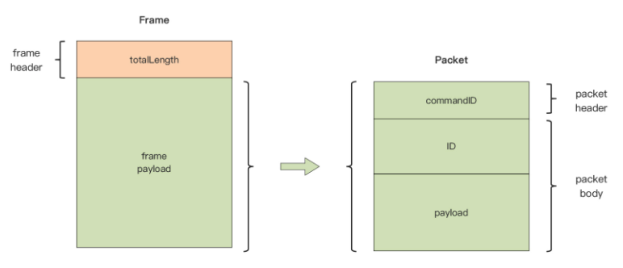

自定义协议就封装在这一个个的 Frame 中。

协议规定了将 Frame 分割开来的方法，那就是利用每个 Frame 开始处的 totalLength，每个 Frame 由一个 totalLength 和 Frame 的负载（payload）构成，比如可以看看下图中左侧的 Frame 结构：

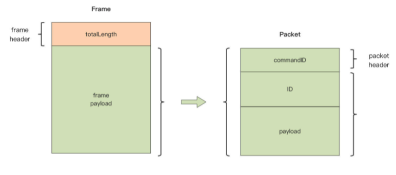

这样，通过 Frame header: totalLength 就可以将 Frame 之间隔离开来。 

#### 建立 Packet 抽象

在这个基础上，建立协议的第二个抽象：Packet。

将 Frame payload 定义为一 个 Packet。上图右侧展示的就是 Packet 的结构。 

Packet 就是业务层真正需要的消息，每个 Packet 由 Packet 头和 Packet Body 部分组成。

Packet 头就是 commandID，用于标识这个消息的类型；而 ID 和 payload（packet payload）或 result 字段组成了 Packet 的 Body 部分，对业务层有价值的数据都包含在 Packet Body 部分。 

那么到这里，就通过 Frame 和 Packet 两个类型结构，完成了程序世界对私有协议规范的抽象。

接下来，要做的就是基于 Frame 和 Packet 这两个概念，实现的对私有协议的解包与打包操作。 

### 协议的解包与打包

所谓协议的解包（decode），就是指识别 TCP 连接上的字节流，将一组字节“转换”成一个特定类型的协议消息结构，然后这个消息结构会被业务处理逻辑使用。 

而打包（encode）刚刚好相反，是指将一个特定类型的消息结构转换为一组字节，然后这组字节数据会被放在连接上发送出去。

具体到这个自定义协议上，解包就是指字节流 -> Frame，打包是指Frame -> 字节流。

可以看一下针对这个协议的服务端解包与打包的流程图：

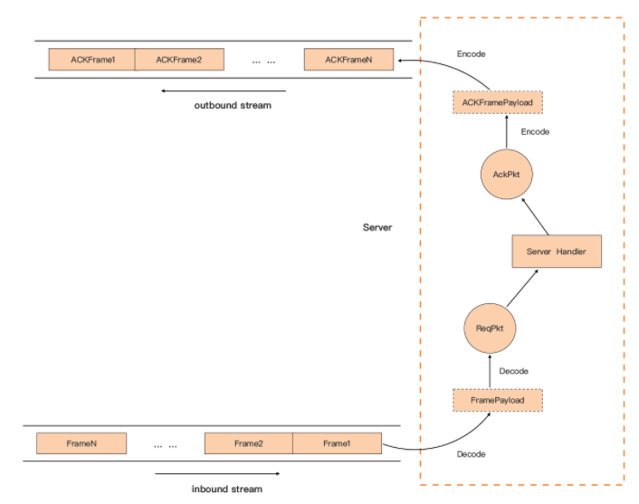

可以看到，TCP 流数据先后经过 frame decode 和 packet decode，得到应用层所需的 packet 数据，而业务层回复的响应，则先后经过 packet 的 encode 与 frame 的 encode，写入 TCP 数据流中。 

到这里，实际上已经完成了协议抽象的设计与解包打包原理的设计过程了。接下来，先来看看私有协议部分的相关代码实现。 

#### Frame 的实现 

协议部分最重要的两个抽象是 Frame 和 Packet，于是就在项目中建立 frame 包与 packet 包，分别与两个协议抽象对应。

frame 包的职责是提供识别 TCP 流边界的编解码器，可以很容易为这样的编解码器，定义出一个统一的接口类型 StreamFrameCodec：

```go
// tcp-server-demo1/frame/frame.go

type FramePayload []byte

type StreamFrameCodec interface {
	Encode(io.Writer, FramePayload) error   // data -> frame，并写入io.Writer
	Decode(io.Reader) (FramePayload, error) // 从io.Reader中提取frame payload，并返回给上层
}
```

StreamFrameCodec 接口类型有两个方法 Encode 与 Decode。

Encode 方法用于将输入的 Frame payload 编码为一个 Frame，然后写入 io.Writer 所代表的输出（outbound） TCP 流中。

而 Decode 方法正好相反，它从代表输入（inbound）TCP 流的 io.Reader 中 读取一个完整 Frame，并将得到的 Frame payload 解析出来并返回。 

这里，给出一个针对协议的 StreamFrameCodec 接口的实现：

```go
// tcp-server-demo1/frame/frame.go

var ErrShortWrite = errors.New("short write")
var ErrShortRead = errors.New("short read")

type myFrameCodec struct{}

func NewMyFrameCodec() StreamFrameCodec {
	return &myFrameCodec{}
}

func (p *myFrameCodec) Encode(w io.Writer, framePayload FramePayload) error {
	var f = framePayload
	var totalLen int32 = int32(len(framePayload)) + 4

	err := binary.Write(w, binary.BigEndian, &totalLen)
	if err != nil {
		return err
	}

	n, err := w.Write([]byte(f)) // write the frame payload to outbound stream
	if err != nil {
		return err
	}

	if n != len(framePayload) {
		return ErrShortWrite
	}
	return nil
}

func (p *myFrameCodec) Decode(r io.Reader) (FramePayload, error) {
	var totalLen int32
	err := binary.Read(r, binary.BigEndian, &totalLen)
	if err != nil {
		return nil, err
	}

	buf := make([]byte, totalLen-4)
	n, err := io.ReadFull(r, buf)
	if err != nil {
		return nil, err
	}

	if n != int(totalLen-4) {
		return nil, ErrShortRead
	}
	return FramePayload(buf), nil
}
```

在这段实现中，有三点事项需要注意：

- 网络字节序使用大端字节序（BigEndian），因此无论是 Encode 还是 Decode，都是用 binary.BigEndian； 
- binary.Read 或 Write 会根据参数的宽度，读取或写入对应的字节个数的字节，这里 totalLen 使用 int32，那么 Read 或 Write 只会操作数据流中的 4 个字节； 
- 这里没有设置网络 I/O 操作的 Deadline，io.ReadFull 一般会读满所需的字节数，除非遇到 EOF 或 ErrUnexpectedEOF。

在工程实践中，保证打包与解包正确的最有效方式就是**编写单元测试**， StreamFrameCodec 接口的 Decode 和 Encode 方法的参数都是接口类型，这可以很容易为 StreamFrameCodec 接口的实现编写测试用例。

下面是为 myFrameCodec 编写了两个测试用例：

```go
// tcp-server-demo1/frame/frame_test.go

func TestEncode(t *testing.T) {
	codec := NewMyFrameCodec()
	buf := make([]byte, 0, 128)
	rw := bytes.NewBuffer(buf)

	err := codec.Encode(rw, []byte("hello"))
	if err != nil {
		t.Errorf("want nil, actual %s", err.Error())
	}

	// 验证Encode的正确性
	var totalLen int32
	err = binary.Read(rw, binary.BigEndian, &totalLen)
	if err != nil {
		t.Errorf("want nil, actual %s", err.Error())
	}

	if totalLen != 9 {
		t.Errorf("want 9, actual %d", totalLen)
	}

	left := rw.Bytes()
	if string(left) != "hello" {
		t.Errorf("want hello, actual %s", string(left))
	}
}

func TestDecode(t *testing.T) {
	codec := NewMyFrameCodec()
	data := []byte{0x0, 0x0, 0x0, 0x9, 'h', 'e', 'l', 'l', 'o'}

	payload, err := codec.Decode(bytes.NewReader(data))
	if err != nil {
		t.Errorf("want nil, actual %s", err.Error())
	}
	
	if string(payload) != "hello" {
		t.Errorf("want hello, actual %s", string(payload))
	}
}
```

可以看到，测试 Encode 方法，其实不需要建立真实的网络连接，只要用一个满足 io.Writer 的 bytes.Buffer 实例“冒充”真实网络连接就可以了，同时 bytes.Buffer 类型也实现了 io.Reader 接口，可以很方便地从中读取出 Encode 后的内容，并进行校验 比对。 

为了**提升测试覆盖率**，还需要尽可能让测试覆盖到所有可测的错误执行分支上。

这里，模拟了 Read 或 Write 出错的情况，让执行流进入到 Decode 或 Encode 方法的错误分支中：

```go
type ReturnErrorWriter struct {
	W  io.Writer
	Wn int // 第几次调用Write返回错误
	wc int // 写操作次数 计数
}

func (w *ReturnErrorWriter) Write(p []byte) (n int, err error) {
	w.wc++
	if w.wc >= w.Wn {
		return 0, errors.New("write error")
	}
	return w.W.Write(p)
}

type ReturnErrorReader struct {
	R  io.Reader
	Rn int // 第几次调用Read返回错误
	rc int // 读操作次数计数
}

func (r *ReturnErrorReader) Read(p []byte) (n int, err error) {
	r.rc++
	if r.rc >= r.Rn {
		return 0, errors.New("read error")
	}
	return r.R.Read(p)
}

func TestEncodeWithWriteFail(t *testing.T) {
	codec := NewMyFrameCodec()
	buf := make([]byte, 0, 128)
	w := bytes.NewBuffer(buf)
	
	// 模拟binary.Write返回错误
	err := codec.Encode(&ReturnErrorWriter{
		W:  w,
		Wn: 1,
	}, []byte("hello"))
	if err == nil {
		t.Errorf("want non-nil, actual nil")
	}
	
	// 模拟w.Write返回错误
	err = codec.Encode(&ReturnErrorWriter{
		W:  w,
		Wn: 2,
	}, []byte("hello"))
	if err == nil {
		t.Errorf("want non-nil, actual nil")
	}
}

func TestDecodeWithReadFail(t *testing.T) {
	codec := NewMyFrameCodec()
	data := []byte{0x0, 0x0, 0x0, 0x9, 'h', 'e', 'l', 'l', 'o'}
	
	// 模拟binary.Read返回错误
	_, err := codec.Decode(&ReturnErrorReader{
		R:  bytes.NewReader(data),
		Rn: 1,
	})
	if err == nil {
		t.Errorf("want non-nil, actual nil")
	}
	
	// 模拟io.ReadFull返回错误
	_, err = codec.Decode(&ReturnErrorReader{
		R:  bytes.NewReader(data),
		Rn: 2,
	})
	if err == nil {
		t.Errorf("want non-nil, actual nil")
	}
}
```

为了实现错误分支的测试，在测试代码源文件中创建了两个类型：ReturnErrorWriter 和 ReturnErrorReader，它们分别实现了 io.Writer 与 io.Reader。 

可以控制在第几次调用这两个类型的 Write 或 Read 方法时，返回错误，这样就可以让 Encode 或 Decode 方法按照意图，进入到不同错误分支中去。

有了这两个用例，frame 包的测试覆盖率（通过 `go test -cover .`可以查看）就可以达到 90% 以上了。 

#### Packet 的实现 

接下来，再看看 Packet 这个抽象的实现。和 Frame 不同，Packet 有多种类型（这里只定义了 Conn、submit、connack、submit ack)。

所以要先抽象一下这些类型需要遵循的共同接口：

```go
// tcp-server-demo1/packet/packet.go
type Packet interface {
  Decode([]byte) error // []byte -> struct
  Encode() ([]byte, error) // struct -> []byte
}
```

其中，Decode 是将一段字节流数据解码为一个 Packet 类型，可能是 conn，可能是 submit 等，具体要根据解码出来的 commandID 判断。

而 Encode 则是将一个 Packet 类型编码为一段字节流数据。 

这里只完成 submit 和 submitack 类型的 Packet 接口实现， 省略了 conn 流程，也省略 conn 以及 connack 类型的实现，可以自己思考一下有 conn 流程时代码应该如何调整。

```go
// tcp-server-demo1/packet/packet.go

type Submit struct {
	ID      string
	Payload []byte
}

func (s *Submit) Decode(pktBody []byte) error {
	s.ID = string(pktBody[:8])
	s.Payload = pktBody[8:]
	return nil
}

func (s *Submit) Encode() ([]byte, error) {
	return bytes.Join([][]byte{[]byte(s.ID[:8]), s.Payload}, nil), nil
}

type SubmitAck struct {
	ID     string
	Result uint8
}

func (s *SubmitAck) Decode(pktBody []byte) error {
	s.ID = string(pktBody[0:8])
	s.Result = uint8(pktBody[8])
	return nil
}

func (s *SubmitAck) Encode() ([]byte, error) {
	return bytes.Join([][]byte{[]byte(s.ID[:8]), []byte{s.Result}}, nil), nil
}
```

这里各种类型的编解码被调用的前提，是明确数据流是什么类型的，因此需要在包级提供一个导出的函数 Decode，这个函数负责**从字节流中解析出对应的类型（根据 commandID）**，并调用对应类型的 Decode 方法：

```go
// tcp-server-demo1/packet/packet.go

func Decode(packet []byte) (Packet, error) {
	commandID := packet[0]
	pktBody := packet[1:]
	switch commandID {
	case CommandConn:
		return nil, nil
	case CommandConnAck:
		return nil, nil
	case CommandSubmit:
		s := Submit{}
		err := s.Decode(pktBody)
		if err != nil {
			return nil, err
		}
		return &s, nil
	case CommandSubmitAck:
		s := SubmitAck{}
		err := s.Decode(pktBody)
		if err != nil {
			return nil, err
		}
		return &s, nil
	default:
		return nil, fmt.Errorf("unknown commandID [%d]", commandID)
	}
}
```

同样，也需要包级的 Encode 函数，根据传入的 packet 类型调用对应的 Encode 方法实现对象的编码：

```go
// tcp-server-demo1/packet/packet.go

func Encode(p Packet) ([]byte, error) {
	var commandID uint8
	var pktBody []byte
	var err error

	switch t := p.(type) {
	case *Submit:
		commandID = CommandSubmit
		pktBody, err = p.Encode()
		if err != nil {
			return nil, err
		}
	case *SubmitAck:
		commandID = CommandSubmitAck
		pktBody, err = p.Encode()
		if err != nil {
			return nil, err
		}
	default:
		return nil, fmt.Errorf("unknown type [%s]", t)
	}
	return bytes.Join([][]byte{[]byte{commandID}, pktBody}, nil), nil
}
```

不过，对 packet 包中各个类型的 Encode 和 Decode 方法的测试，与 frame 包的相似， 这里就把为 packet 包编写单元测试的任务就交给自己完成了。 

下面就来编写服务端的程序结构，将 tcp conn 与 Frame、Packet 连接起来。 

### 服务端的组装 

按照每个连接一个 Goroutine 的模型，给出了典型 Go 网络服务端程序的结构，这里就以这个结构为基础，将 Frame、Packet 加进来，形成第一版服务端实现：

```go
// tcp-server-demo1/cmd/server/main.go
package main

import (
	"fmt"
	"github.com/Kate-liu/GoBeginner/practiceproject/webtcpserver/webtcpserversimple/frame"
	"github.com/Kate-liu/GoBeginner/practiceproject/webtcpserver/webtcpserversimple/packet"
	"net"
)

func handlePacket(framePayload []byte) (ackFramePayload []byte, err error) {
	var p packet.Packet
	p, err = packet.Decode(framePayload)
	if err != nil {
		fmt.Println("handleConn: packet decode error:", err)
		return
	}

	switch p.(type) {
	case *packet.Submit:
		submit := p.(*packet.Submit)
		fmt.Printf("recv submit: id = %s, payload=%s\n", submit.ID, string(submit.Payload))
		submitAck := &packet.SubmitAck{
			ID:     submit.ID,
			Result: 0,
		}
		ackFramePayload, err = packet.Encode(submitAck)
		if err != nil {
			fmt.Println("handleConn: packet encode error:", err)
			return nil, err
		}
		return ackFramePayload, nil
	default:
		return nil, fmt.Errorf("unknown packet type")
	}
}

func handleConn(c net.Conn) {
	defer c.Close()
	frameCodec := frame.NewMyFrameCodec()

	for {
		// decode the frame to get the payload
		framePayload, err := frameCodec.Decode(c)
		if err != nil {
			fmt.Println("handleConn: frame decode error:", err)
			return
		}

		// do something with the packet
		ackFramePayload, err := handlePacket(framePayload)
		if err != nil {
			fmt.Println("handleConn: handle packet error:", err)
			return
		}

		// write ack frame to the connection
		err = frameCodec.Encode(c, ackFramePayload)
		if err != nil {
			fmt.Println("handleConn: frame encode error:", err)
			return
		}
	}
}

func main() {
	l, err := net.Listen("tcp", ":8888")
	if err != nil {
		fmt.Println("listen error:", err)
		return
	}

	for {
		c, err := l.Accept()
		if err != nil {
			fmt.Println("accept error:", err)
			break
		}
		// start a new goroutine to handle the new connection.
		go handleConn(c)
	}
}
```

这个程序的逻辑非常清晰，服务端程序监听 8888 端口，并在每次调用 Accept 方法后得到 一个新连接，服务端程序将这个新连接交到一个新的 Goroutine 中处理。 

新 Goroutine 的主函数为 handleConn，有了 Packet 和 Frame 这两个抽象的加持，这个函数同样拥有清晰的代码调用结构：

```go
// handleConn的调用结构
read frame from conn
  ->frame decode
    -> handle packet
      -> packet decode
    	-> packet(ack) encode
  ->frame(ack) encode
write ack frame to conn
```

到这里，一个基于 TCP 的自定义应用层协议的经典阻塞式的服务端就完成了。

不过这里的服务端依旧是一个简化的实现，比如这里没有考虑支持优雅退出、没有捕捉某个链接上出现的可能导致整个程序退出的 panic 等。 

接下来，就来验证一下这个服务端实现是否能正常工作。 

### 验证测试

要验证服务端的实现是否可以正常工作，需要实现一个自定义应用层协议的客户端。 

这里，同样基于 frame、packet 两个包，实现了一个自定义应用层协议的客户端。下面是客户端的 main 函数：

```go
// tcp-server-demo1/cmd/client/main.go

func main() {
	var wg sync.WaitGroup
	var num int = 5
  
	wg.Add(5)
  
	for i := 0; i < num; i++ {
		go func(i int) {
			defer wg.Done()
			startClient(i)
		}(i + 1)
	}
	wg.Wait()
}
```

可以看到，客户端启动了 5 个 Goroutine，模拟 5 个并发连接。startClient 函数是每个连接的主处理函数，来看一下：

```go
func startClient(i int) {
	quit := make(chan struct{})
	done := make(chan struct{})
	conn, err := net.Dial("tcp", ":8888")
	if err != nil {
		fmt.Println("dial error:", err)
		return
	}
	defer conn.Close()
	fmt.Printf("[client %d]: dial ok", i)

	// 生成payload
	rng, err := codename.DefaultRNG()
	if err != nil {
		panic(err)
	}

	frameCodec := frame.NewMyFrameCodec()
	var counter int

	go func() {
		// handle ack
		for {
			select {
			case <-quit:
				done <- struct{}{}
				return
			default:
			}

			conn.SetReadDeadline(time.Now().Add(time.Second * 1))
			ackFramePayLoad, err := frameCodec.Decode(conn)
			if err != nil {
				if e, ok := err.(net.Error); ok {
					if e.Timeout() {
						continue
					}
				}
				panic(err)
			}

			p, err := packet.Decode(ackFramePayLoad)
			submitAck, ok := p.(*packet.SubmitAck)
			if !ok {
				panic("not submitack")
			}
			fmt.Printf("[client %d]: the result of submit ack[%s] is %d\n", i, submitAck.ID, submitAck.Result)
		}
	}()

	for {
		// send submit
		counter++
		id := fmt.Sprintf("%08d", counter) // 8 byte string
		payload := codename.Generate(rng, 4)
		s := &packet.Submit{
			ID:      id,
			Payload: []byte(payload),
		}

		framePayload, err := packet.Encode(s)
		if err != nil {
			panic(err)
		}

		fmt.Printf("[client %d]: send submit id = %s, payload=%s, frame length = %d\n",
			i, s.ID, s.Payload, len(framePayload)+4)

		err = frameCodec.Encode(conn, framePayload)
		if err != nil {
			panic(err)
		}

		time.Sleep(1 * time.Second)
		if counter >= 10 {
			quit <- struct{}{}
			<-done
			fmt.Printf("[client %d]: exit ok", i)
			return
		}
	}
}
```

关于 startClient 函数，需要简单说明几点。 

- 首先，startClient 函数启动了两个 Goroutine，一个负责向服务端发送 submit 消息请求，另外一个 Goroutine 则负责读取服务端返回的响应； 
- 其次，客户端发送的 submit 请求的负载（payload）是由第三方包 github.com/lucasepe/codename 负责生成的，这个包会生成一些对人类可读的随机字符串，比如：firm-iron、 moving-colleen、game-nova 这样的字符串； 
- 另外，负责读取服务端返回响应的 Goroutine，使用 SetReadDeadline 方法设置了读超时，这主要是考虑该 Goroutine 可以在收到退出通知时，能及时从 Read 阻塞中跳出来。 

现在就来构建和运行一下这两个程序。 

在 tcp-server-demo1 目录下提供了 Makefile，如果使用的是 Linux 或 macOS 操作系统，可以直接敲入 make 构建两个程序，如果是在 Windows 下构建，可以直接敲入下面的 go build 命令构建：

```sh
$make
go build github.com/bigwhite/tcp-server-demo1/cmd/server
go build github.com/bigwhite/tcp-server-demo1/cmd/client
```

构建成功后，先来启动 server 程序：

```sh
$./server
server start ok(on *.8888)
```

然后，启动 client 程序，启动后 client 程序便会向服务端建立 5 条连接，并发送 submit 请求，client 端的部分日志如下：

```sh
$./client
[client 5]: dial ok
[client 1]: dial ok
[client 5]: send submit id = 00000001, payload=credible-deathstrike-33e1, fram
[client 3]: dial ok
[client 1]: send submit id = 00000001, payload=helped-lester-8f15, frame lengt
[client 4]: dial ok
[client 4]: send submit id = 00000001, payload=strong-timeslip-07fa, frame len
[client 3]: send submit id = 00000001, payload=wondrous-expediter-136e, frame
[client 5]: the result of submit ack[00000001] is 0
[client 1]: the result of submit ack[00000001] is 0
[client 3]: the result of submit ack[00000001] is 0
[client 2]: dial ok
... ...
[client 3]: send submit id = 00000010, payload=bright-monster-badoon-5719, fra
[client 4]: send submit id = 00000010, payload=crucial-wallop-ec2d, frame leng
[client 2]: send submit id = 00000010, payload=pro-caliban-c803, frame length
[client 1]: send submit id = 00000010, payload=legible-shredder-3d81, frame le
[client 5]: send submit id = 00000010, payload=settled-iron-monger-bf78, frame
[client 3]: the result of submit ack[00000010] is 0
[client 4]: the result of submit ack[00000010] is 0
[client 1]: the result of submit ack[00000010] is 0
[client 2]: the result of submit ack[00000010] is 0
[client 5]: the result of submit ack[00000010] is 0
[client 4]: exit ok
[client 1]: exit ok
[client 3]: exit ok
[client 5]: exit ok
[client 2]: exit ok
```

client 在每条连接上发送 10 个 submit 请求后退出。这期间服务端会输出如下日志：

```sh
recv submit: id = 00000001, payload=credible-deathstrike-33e1
recv submit: id = 00000001, payload=helped-lester-8f15
recv submit: id = 00000001, payload=wondrous-expediter-136e
recv submit: id = 00000001, payload=strong-timeslip-07fa
recv submit: id = 00000001, payload=delicate-leatherneck-4b12
recv submit: id = 00000002, payload=certain-deadpool-779d
recv submit: id = 00000002, payload=clever-vapor-25ce
recv submit: id = 00000002, payload=causal-guardian-4f84
recv submit: id = 00000002, payload=noted-tombstone-1b3e
... ...
recv submit: id = 00000010, payload=settled-iron-monger-bf78
recv submit: id = 00000010, payload=pro-caliban-c803
recv submit: id = 00000010, payload=legible-shredder-3d81
handleConn: frame decode error: EOF
handleConn: frame decode error: EOF
handleConn: frame decode error: EOF
handleConn: frame decode error: EOF
handleConn: frame decode error: EOF
```

从结果来看，实现的这一版服务端运行正常！ 

### 小结 

在完成对 socket 编程模型、网络 I/O 操作的技术预研后，正式进入基于 TCP 的自定义应用层协议的通信服务端的设计与实现环节。 

在这一环节中，首先建立了对协议的抽象，这是实现通信服务端的基石。使用 Frame 的概念来表示 TCP 字节流中的每一个协议消息，这使得在业务层的视角下，连接上的字节流就是由一个接着一个 Frame 组成的。

接下来，又建立了第二个抽象 Packet，来表示业务层真正需要的消息。 

在这两个抽象的基础上，实现了 frame 与 packet 各自的打包与解包，整个实现是低耦合的，可以在对 frame 编写测试用例时体会到这一点。 

最后，把一个 Goroutine 负责处理一个连接的典型 Go 网络服务端程序结构与 frame、packet 的实现组装到一起，就实现了第一版服务端。

之后，还编写了客户端模拟器对这个服务端的实现做了验证。 

这个服务端采用的是 Go 经典阻塞 I/O 的编程模型，是不是已经感受到了这种模型在开发阶段带来的好处了呢！ 

### 思考题

作业：

- 为 packet 包编写单元测试； 
- 为服务端增加优雅退出机制，以及捕捉某个链接上出现的可能导致整个程序退出的 panic。


## 优化 Go 程序

初步实现了一个基于 TCP 的自定义应用层协议的通信服务端。对于一个常驻内存的服务端而言，更高的性能以及更低的资源消耗，始终是后端开发人员的追求。 

同时，更高性能的服务程序，也意味着在处理相同数量访问请求的前提下，使用的机器数量更少，这可是为公司节省真金白银的有效策略。 

而且，Go 语言最初设计时就被定位为“系统级编程语言”，这说明高性能也一直是 Go 核心团队的目标之一。很多来自动态类型语言的开发者转到 Go 语言，几乎都有着性能方面的考量。

所以，就结合实现的自定义应用层协议的通信服务端，看看优化 Go 程序使用的常用工具与套路。 

### Go 程序优化的基本套路 

Go 程序的优化，也有着固定的套路可循，这里将它整理成了这张示意图：

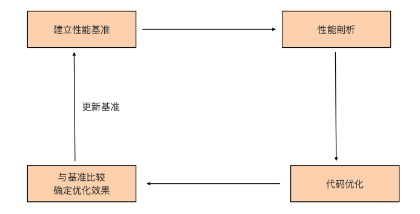

这张图也不难理解，简单解释一下。 

首先要建立性能基准。要想对程序实施优化，首先要有一个初始“参照物”，这 样才能在执行优化措施后，检验优化措施是否有效，所以这是优化循环的第一步。 

第二步是性能剖析。要想优化程序，首先要找到可能影响程序性能的“瓶颈点”，这一步的任务，就是通过各种工具和方法找到这些“瓶颈点”。 

第三步是代码优化。要针对上一步找到的“瓶颈点”进行分析，找出它们成为瓶颈的原因，并有针对性地实施优化。 

第四步是与基准比较，确定优化效果。这一步，会采集优化后的程序的性能数据，与第一步的性能基准进行比较，看执行上述的优化措施后，是否提升了程序的性能。

如果有提升，那就说明这一轮的优化是有效的。如果优化后的性能指标仍然没有达到预期，可以再执行一轮优化，这时就要用新的程序的性能指标作为新的性能基准，作为下一轮性能优化参考。 

接下来就围绕这个优化循环，看看怎么对实现的自定义应用层协议的通信服务端进行优化。首先要做的是建立性能基准，这是 Go 应用性能优化的基础与前 提。 

### 建立性能基准

已经初步实现了自定义应用层协议的通信服务端，那它的性能如何呢？ 肯定不能拍脑门说这个程序性能很好、一般或很差吧？

需要用数据说话，也就是为 Go 程序建立性能基准。

通过这个性能基准，不仅可以了解当前程序的性能水平，也可以据此判断后面的代码优化措施有没有起到效果。 

建立性能基准的方式大概有两种，

- 一种是通过编写 Go 原生提供的性能基准测试 （benchmark test）用例来实现，这相当于对程序的局部热点建立性能基准，常用于一些算法或数据结构的实现，比如分布式全局唯一ID 生成算法、树的插入 / 查找等。 
- 另外一种是基于度量指标为程序建立起图形化的性能基准，这种方式适合针对程序的整体建立性能基准。而自定义协议服务端程序就十分适合用这种方式。

接下来就来看一下基于度量指标建立基准的一种可行方案。 

### 建立观测设施

这些年，基于 Web 的可视化工具、开源监控系统以及时序数据库的兴起，给建立性能基准带来了很大的便利，业界有比较多成熟的工具组合可以直接使用。但业界最常用的还是 **Prometheus+Grafana 的组合**，这也是日常使用比较多的组合，所以在这里也使 用这个工具组合来为程序建立性能指标观测设施。 

以 Docker 为代表的轻量级容器（container）的兴起，让这些工具的部署、安装都变得十分简单，这里就使用 docker-compose 工具，基于容器安装 Prometheus+Grafana 的组合。

建议使用一台 Linux 主机来安装这些工具，因为 docker 以及 docker-compose 工具，在 Linux 平台上的表现最为成熟稳定。

这里不再详细说明 docker 与 docker-compose 工具的安装方法了，可以参考docker 安装教程以及docker-compose 安装教程自行在 Linux 上安装这两个工具。 

>Mac 的 Docker 桌面版和 Docker Toolbox 已经包括 Compose 和其他 Docker 应用程序，因此 Mac 用户不需要单独安装 Compose。

这里简单描述一下安装 Prometheus+Grafana 的组合的步骤。 

首先，要在 Linux 主机上建立一个目录 monitor，这个目录下，创建 docker-compose.yml 文件，它的内容是这样的：

```yaml
version: "3.2"
services:
  prometheus:
    container_name: prometheus
    image: prom/prometheus:latest
    network_mode: "host"
    volumes:
      - ./conf/tcp-server-prometheus.yml:/etc/prometheus/prometheus.yml
      - /etc/localtime:/etc/localtime
    #ports:
    #  - "9090:9090"
    restart: on-failure

  grafana:
    container_name: grafana
    image: grafana/grafana:latest
    network_mode: "host"
    #ports:
    #  - 3000:3000
    restart: on-failure
    volumes:
      - /etc/localtime:/etc/localtime
      - ./data/grafana:/var/lib/grafana

  # linux node_exporter
  node_exporter:
    image: quay.io/prometheus/node-exporter:latest
    restart: always
    container_name: node_exporter
    command:
      - '--path.rootfs=/host'
    network_mode: host
    pid: host
    volumes:
      - '/:/host:ro,rslave'
```

docker-compose.yml 是 docker-compose 工具的配置文件，基于这个配置文件， docker-compose 工具会拉取对应容器镜像文件，并在本地启动对应的容器。 

这个 docker-compose.yml 文件中包含了三个工具镜像，分别是 Prometheus、 Grafana 与 node-exporter。

其中，node-exporter 是 prometheus 开源的主机度量数据的采集工具，通过 node-exporter，可以采集到主机的 CPU、内存、磁盘、网络 I/O 等主机运行状态数据。结合这些数据，可以查看应用在运行时的系统资源占用情况。 

docker-compose.yml 中 Prometheus 容器挂载的 tcp-server-prometheus.yml 文件放在了 monitor/conf 下面，它的内容是这样：

```yaml
global:
  scrape_interval: 5s # Set the scrape interval to every 15 seconds. Default is every 1 minute.
  evaluation_interval: 15s # Evaluate rules every 15 seconds. The default is every 1 minute.
  # scrape_timeout is set to the global default (10s).

# Alertmanager configuration
alerting:
  alertmanagers:
    - static_configs:
        - targets:
          # - alertmanager:9093

# Load rules once and periodically evaluate them according to the global 'evaluation_interval'.
rule_files:
  # - "first_rules.yml"
  # - "second_rules.yml"

# A scrape configuration containing exactly one endpoint to scrape:
# Here it's Prometheus itself.
scrape_configs:
  # The job name is added as a label `job=<job_name>` to any timeseries scraped from this config.
  - job_name: "prometheus"
    # metrics_path defaults to '/metrics'
    # scheme defaults to 'http'.
    static_configs:
      - targets: ["localhost:9090"]

  - job_name: "tcp-server"
    static_configs:
      - targets: ["localhost:8889"]

  - job_name: "node"
    static_configs:
      - targets: ["localhost:9100"]
```

可以看到，在上面 Prometheus 的配置文件的 scrpae_configs 下面，配置了三个采集 job，分别用于采集 Prometheus 自身度量数据、 tcp server 的度量数据，以及 node-exporter 的度量数据。 

grafana 容器会挂载本地的 data/grafana 路径到容器中，为了避免访问权限带来的问题， 在创建 data/grafana 目录后，最好再为这个目录赋予足够的访问权限，比如：

```sh
$chmod -R 777 data
```

运行下面命令，docker-compose 就会自动拉取镜像，并启动 docker-compose.yml 中 的三个容器：

```sh
$docker-compose -f docker-compose.yml up -d
```

> 直接卡住了。。。。node-exporter 下载不下来啊，尬住了，
>
> 硬抗进度条，最终下载成功！
>
> 但是运行的时候，报错了：
>
> ```sh
> ERROR: for node_exporter  Cannot start service node_exporter: path / is mounted on / but it is not a shared or slave mount
> 
> ERROR: for node_exporter  Cannot start service node_exporter: path / is mounted on / but it is not a shared or slave mount
> ERROR: Encountered errors while bringing up the project.
> ```
>
> 最终更改 yaml 文件了，
>
> ```yaml
>     volumes:
>       - /:/host
> ```

等待一段时间后，执行 docker ps 命令，如果能看到下面三个正在运行的容器，就说明安装就成功了：

```sh
$docker ps
CONTAINER ID   IMAGE                                     COMMAND                  CREATED          STATUS          PORTS     NAMES
fa6ebb79c684   quay.io/prometheus/node-exporter:latest   "/bin/node_exporter …"   54 seconds ago   Up 53 seconds             node_exporter
b907624c17f2   grafana/grafana:latest                    "/run.sh"                15 minutes ago   Up 5 minutes              grafana
d43ee5627122   prom/prometheus:latest                    "/bin/prometheus --c…"   15 minutes ago   Up 5 minutes              prometheus
```

为了更直观地了解到整个观测设施中各个工具之间的关系，这里画了一幅示意图，对照着这幅图，再来理解上面的配置与执行步骤会容易许多：

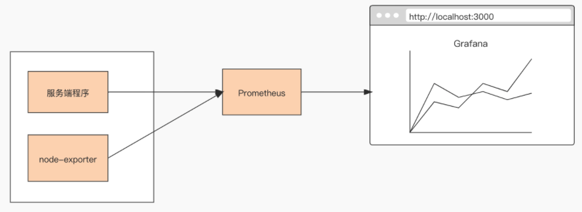

### 配置 Grafana 

一旦成功启动，Prometheus 便会启动各个采集 job，从 tcp server 以及 node-exporter 中拉取度量数据，并存储在其时序数据库中，这个时候需要对 Grafana 进行一些简单配置，才能让这些数据以图形化的方式展现出来。 

> 此时又出现，找不到网址进入 Grafana。
>
> 然后就继续更改 yaml 文件，
>
> ```yaml
> #    network_mode: "host"
>     ports:
>       - "9090:9090"
> 
> #    network_mode: "host"
>     ports:
>       - "3000:3000"
> ```
>
> 不使用 host 的 network_mode，此时访问 ：http://127.0.0.1:3000/ 就可以看到主界面了。
>
> 默认使用 admin :admin 登录即可。
>
> 可更改密码，1234！@#￥。

首先需要为 Grafana 配置一个新的数据源（data source），在数据源选择页面，选择 Prometheus，就像下图这样：


选择后，在 Prometheus 数据源配置页面，配置这个数据源的 HTTP URL 就可以了。如果点击“Save & test”按钮后提示成功，那么数据源就配置好了。 

接下来，再添加一个 node-exporter 仪表板（dashboard），把从 node-exporter 拉取的度量数据以图形化方式展示出来。

这个时候不需要手工一个一个设置仪表板上的 panel，Grafana 官方有现成的 node-exporter 仪表板可用，只需要在 grafana 的 import 页面中输入相应的 dashboard ID，就可以导入相关仪表板的设置：

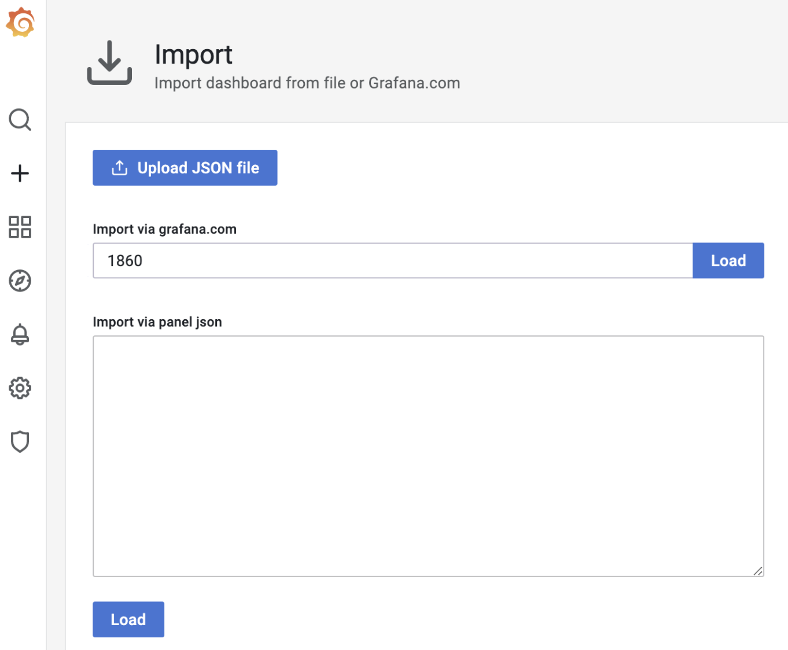

这里，使用的是 ID 为 1860 的 node-exporter 仪表板，导入成功后，进入这个仪表 板页面，等待一段时间后，就可以看到类似下面的可视化结果：

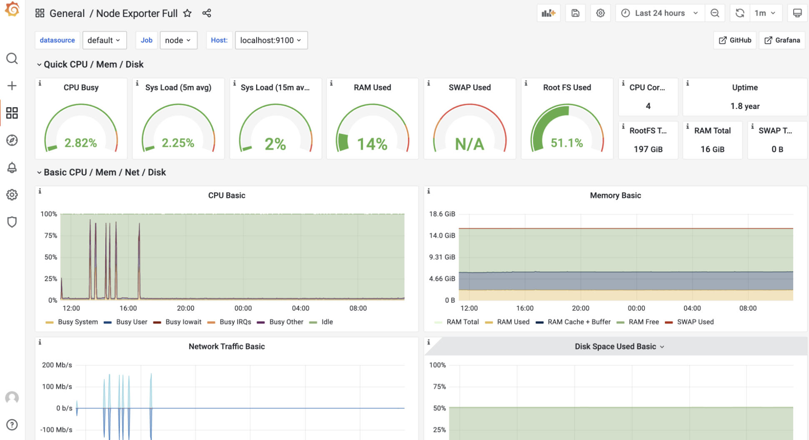


> 等待了一回儿，还是出不来，估计是数据源获取不到。
>
> 待补充解决办法。目前还么有办法，由于目前用不上，先等等吧！过了！  

好了，到这里 node-exporter 的度量数据，已经可以以图形化的形式呈现在面前了， 那么自定义协议的服务端的数据又如何采集与呈现呢？继续向下看。 

### 在服务端埋入度量数据采集点

要建立服务端的性能基准，那么哪些度量数据能反映出服务端的性能指标呢？这里定义三个度量数据项：

- 当前已连接的客户端数量（client_connected）； 
- 每秒接收消息请求的数量（req_recv_rate）； 
- 每秒发送消息响应的数量（rsp_send_rate）。

那么如何在服务端的代码中埋入这三个度量数据项呢？ 

将 tcp-server-demo1 项目拷贝一份，形成 tcp-server-demo2 项目，要在 tcp-server-demo2 项目中实现这三个度量数据项的采集。 

在 tcp-server-demo2 下，创建新的 metrics 包负责定义度量数据项，metrics 包的源码如下：

```go
// tcp-server-demo2/metrics/metrics.go

package metrics

import (
	"fmt"
	"github.com/prometheus/client_golang/prometheus"
	"github.com/prometheus/client_golang/prometheus/promhttp"
	"net/http"
)

const metricsHTTPPort = 8889 // for prometheus to connect

var (
	ClientConnected prometheus.Gauge
	ReqRecvTotal    prometheus.Counter
	RspSendTotal    prometheus.Counter
)

func init() {
	ReqRecvTotal = prometheus.NewCounter(prometheus.CounterOpts{
		Name: "tcp_server_demo2_req_recv_total",
	})
  
	RspSendTotal = prometheus.NewCounter(prometheus.CounterOpts{
		Name: "tcp_server_demo2_rsp_send_total",
	})

	ClientConnected = prometheus.NewGauge(prometheus.GaugeOpts{
		Name: "tcp_server_demo2_client_connected",
	})

	prometheus.MustRegister(ReqRecvTotal, RspSendTotal, ClientConnected)

	// start the metrics server
	metricsServer := &http.Server{
		Addr: fmt.Sprintf(":%d", metricsHTTPPort),
	}

	mu := http.NewServeMux()
	mu.Handle("/metrics", promhttp.Handler())
	metricsServer.Handler = mu
	go func() {
		err := metricsServer.ListenAndServe()
		if err != nil {
			fmt.Println("prometheus-exporter http server start failed:", err)
		}
	}()
	fmt.Println("metrics server start ok(*:8889)")
}
```

在这段代码中，使用 prometheus 提供的 go client 包中的类型定义了三个度量数据项。

- 其中 ClientConnected 的类型为 prometheus.Gauge，Gauge 是对一个数值的即时测量值，它反映一个值的瞬时快照；
- 而 ReqRecvTotal 和 RspSendTotal 的类型都为 prometheus.Counter。 Counter 顾名思义，就是一个计数器，可以累加，也可以减少。不过要想反映预期的每秒处理能力的指标，还需要将这两个计数器与 rate 函数一起使用才行。 

在 metrics 包的 init 函数中启动了一个 http server，这个 server 监听 8889 端口， 还记得前面 prometheus 配置文件中 tcp-server job 采集的目标地址吗？正是这个 8889 端口。也就是说，Prometheus 定期从 8889 端口拉取度量数据项的值。

有了 metrics 包以及度量数据项后，还需要将度量数据项埋到服务端的处理流程中， 来看对 main 包的改造：

```go
// tcp-server-demo2/cmd/server/main.go

func handleConn(c net.Conn) {
	metrics.ClientConnected.Inc() // 连接建立，ClientConnected加1
	defer func() {
		metrics.ClientConnected.Dec() // 连接断开，ClientConnected减1
		c.Close()
	}()
	frameCodec := frame.NewMyFrameCodec()
	
	for {
		// read from the connection
		// decode the frame to get the payload
		// the payload is undecoded packet
		framePayload, err := frameCodec.Decode(c)
		if err != nil {
			fmt.Println("handleConn: frame decode error:", err)
			return
		}
		metrics.ReqRecvTotal.Add(1) // 收到并解码一个消息请求，ReqRecvTotal消息计数器加1
		
		// do something with the packet
		ackFramePayload, err := handlePacket(framePayload)
		if err != nil {
			fmt.Println("handleConn: handle packet error:", err)
			return
		}
		
		// write ack frame to the connection
		err = frameCodec.Encode(c, ackFramePayload)
		if err != nil {
			fmt.Println("handleConn: frame encode error:", err)
			return
		}
		metrics.RspSendTotal.Add(1) // 返回响应后，RspSendTotal消息计数器减1
	}
}
```

可以看到，在每个连接的处理主函数 handleConn 中都埋入了各个度量数据项，并在特定事件发生时修改度量数据的值。

服务端建立完度量数据项后，还需要在 Grafana 中建立对应的仪表板来展示这些度量数据项，这一次，就需要手动创建仪表板 tcp-server-demo，并为仪表板手动添加 panel 了。 

建立三个 panel：req_recv_rate、rsp_send_rate 和 client_connected，如下图所示：

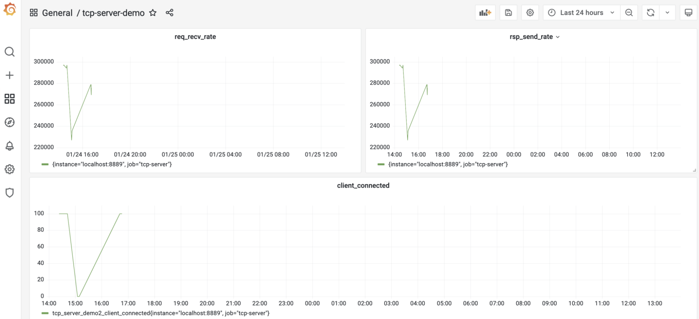

client_connected panel 比较简单，直接取 tcp_server_demo2_client_connected 这个注册到 prometheus 中的度量项的值就可以了。 

而 req_recv_rate 和 rsp_send_rate 就要结合度量项的值与 rate 函数来实现。以 req_recv_rate 这个 panel 为例，它的 panel 配置是这样：


看到图中的 Metrics Browser 后面的表达式是： rate(tcp_server_demo2_req_recv_total[15s])，这个表达式返回的是在 15 秒 内测得的 req_recv_total 的每秒速率，这恰恰是可以反映服务端处理性能的指标。 

到这里，支持输出度量数据指标的服务端以及对应的 grafana 仪表板都准备好了。 下面就来为服务端建立第一版的性能基准。 

### 第一版性能基准

要建立性能基准，还需要一个可以对服务端程序“施加压力”的客户端模拟器，可以基于 tcp-server-demo1/cmd/client 实现这个模拟器。 

新版模拟器的原理与 tcp-server-demo1/cmd/client 基本一致，所以具体的改造过程就不多说了，新版模拟器的代码，放在了 tcp-server-demo2/cmd/client 下面，可以自行查看源码。

建立以及使用性能基准的前提，是服务端的压测硬件条件要尽量保持一致，以保证得到的结果受外界干扰较少，性能基准才更有参考意义。

在一个 4 核 8G 的 Centos Linux 主机上跑这个压力测试，后续的压测也是在同样的条件下。 压测的步骤很简单，首先在 tcp-server-demo2 下构建出 server 与 client 两个可执行程序。

然后先启动 server，再启动 client。运行几分钟后，停掉程序就可以了，这时，在 grafana 的 tcp-server 的仪表板中，就能看到类似下面的图形化数据展示了：

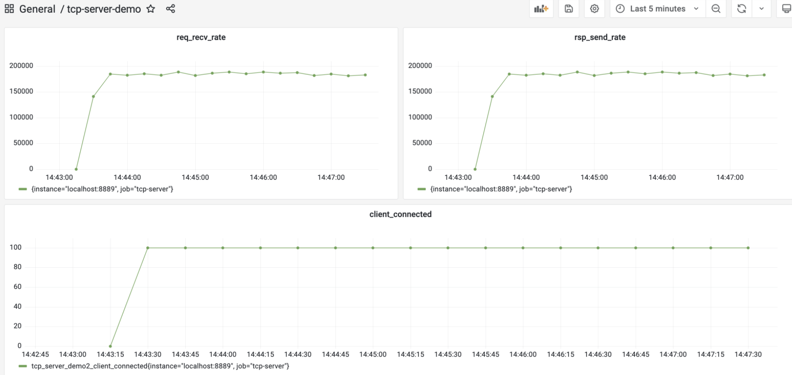

从这张图中，大约看到服务端的处理性能大约在 18.5w/ 秒左右，就将这个结果作为服务端的第一个性能基准。 

### 尝试用 pprof 剖析 

按照 Go 应用性能优化循环的思路，接下来就应该尝试对服务端做性能剖析，识别出瓶颈点。 

Go 是“自带电池”（battery included）的语言，拥有着让其他主流语言羡慕的工具链， Go 同样也内置了对 Go 代码进行性能剖析的工具：pprof。 

pprof 源自 Google Perf Tools 工具套件，在 Go 发布早期就被集成到 Go 工具链中了，所以 pprof 也是 Gopher 最常用的、对 Go 应用进行性能剖析的工具。这里也使用这一工具对服务端程序进行剖析。

Go 应用支持 pprof 性能剖析的方式有多种，最受 Gopher 青睐的是通过导入 net/http/pprof包的方式。

改造一下 tcp-server-demo2，让它通过这种方式支持 pprof 性能剖析。 

改造后的代码放在 tcp-server-demo2-with-pprof 目录下，下面是支持 pprof 的 main 包的代码节选：

```go
// tcp-server-demo2-with-pprof/cmd/server/main.go
import (
  ... ...
  "net/http"
  _ "net/http/pprof"
  ... ...
)

... ...

func main() {
  go func() {
  http.ListenAndServe(":6060", nil)
  }()
  ... ...
}
```

从这个代码变更可以看到，只需要以空导入的方式导入 net/http/pprof 包，并在一个单独的 goroutine 中启动一个标准的 http 服务，就可以实现对 pprof 性能剖析的支持。 

pprof 工具可以通过 6060 端口采样到 Go 程序的运行时数据。 

接下来，就来进行性能剖析数据的采集。

编译 tcp-server-demo2-with-pprof 目录下的 server 与 client，先后启动 server 与 client，让 client 对 server 保持持续的压 力。 然后在自己的开发机上执行下面命令：

```sh
// 192.168.10.18为服务端的主机地址
$go tool pprof -http=:9090 http://192.168.10.18:6060/debug/pprof/profile
Fetching profile over HTTP from http://192.168.10.18:6060/debug/pprof/profile
Saved profile in /Users/tonybai/pprof/pprof.server.samples.cpu.004.pb.gz
Serving web UI on http://localhost:9090

# self test
# 默认出不来，需要安装graphviz，命令： brew install graphviz
$go tool pprof -http=:9090 http://127.0.0.1:6060/debug/pprof/profile
```

go tool pprof 命令默认会从 http://192.168.10.18:6060/debug/pprof/profile 服务上， **采集 CPU 类型的性能剖析数据**，然后打开本地浏览器，默认显示如下页面：

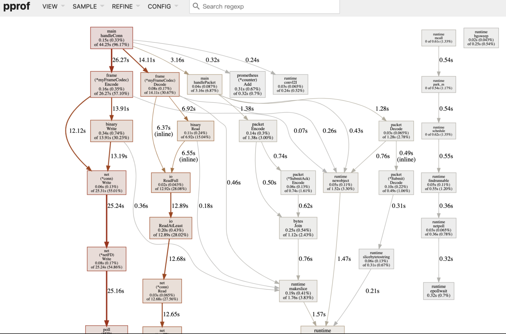

debug/pprof/profile 提供的是 CPU 的性能采样数据。CPU 类型采样数据是性能剖析中最常见的采样数据类型。 

一旦启用 CPU 数据采样，Go 运行时会每隔一段短暂的时间（10ms）就中断一次（由 SIGPROF 信号引发），并记录当前所有 goroutine 的函数栈信息。它能帮助识别出代码关键路径上出现次数最多的函数，而往往这个函数就是程序的一个瓶颈。

上图沿着粗红线向下看，会看到下面图中的信息：

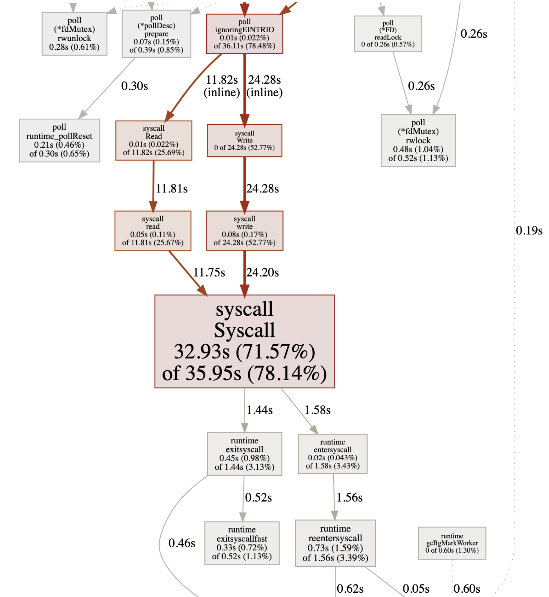

可以看到图中间的 Syscall 函数占据了一个最大的方框，并用黑体标记了出来，这就是程序的第一个瓶颈：花费太多时间在系统调用上了。

在向上寻找，发现 Syscall 的调用者基本都是网络 read 和 write 导致的。 

### 代码优化 

好了，第一个瓶颈点已经找到！

该进入优化循环的第三个环节：代码优化了。那么该如何优化代码呢？可以分为两个部分来看。 

#### 带缓存的网络 I/O 

为什么网络 read 和 write 导致的 Syscall 会那么多呢？回顾第一版服务端的实 现。

可以看到，在 handleConn 函数中，直接将 net.Conn 实例传给 frame.Decode 作为 io.Reader 参数的实参，这样，每次调用 Read 方法都是直接从 net.Conn 中读取数据，而 Read 将转变为一次系统调用（Syscall），哪怕是仅仅读取一个字节也是如此。

因此，优化目标是降低 net.Conn 的 Write 和 Read 的频率。 那么如何降低 net.Conn 的读写频率呢？增加缓存不失为一个有效的方法。

而且，服务端采用的是一个 goroutine 处理一个客户端连接的方式，由于没有竞态，这个模型更适合在读写 net.Conn 时使用带缓存的方式。 

所以，下面就来为 tcp-server-demo2 增加 net.Conn 的缓存读与缓存写。优化后的代码放在了 tcp-server-demo3 下：

```go
// tcp-server-demo3/cmd/server/main.go
func handleConn(c net.Conn) {
	metrics.ClientConnected.Inc()
	defer func() {
		metrics.ClientConnected.Dec()
		c.Close()
	}()
	frameCodec := frame.NewMyFrameCodec()
	rbuf := bufio.NewReader(c)
	wbuf := bufio.NewWriter(c)
	
	defer wbuf.Flush()
	
	for {
		// read from the connection
		// decode the frame to get the payload
		// the payload is undecoded packet
		framePayload, err := frameCodec.Decode(rbuf)
		if err != nil {
			fmt.Println("handleConn: frame decode error:", err)
			return
		}
		metrics.ReqRecvTotal.Add(1)
		
		// do something with the packet
		ackFramePayload, err := handlePacket(framePayload)
		if err != nil {
			fmt.Println("handleConn: handle packet error:", err)
			return
		}
		
		// write ack frame to the connection
		err = frameCodec.Encode(wbuf, ackFramePayload)
		if err != nil {
			fmt.Println("handleConn: frame encode error:", err)
			return
		}
		metrics.RspSendTotal.Add(1)
	}
}
```

tcp-server-demo3 唯一的改动，就是 main 包中的 handleConn 函数。在这个函数中， 新增了一个读缓存变量（rbuf）和一个写缓存变量（wbuf），用这两个变量替换掉传给 frameCodec.Decode 和 frameCodec.Encode 的 net.Conn 参数。 

以 rbuf 为例，来看看它是如何起到降低 syscall 调用频率的作用的。 

将 net.Conn 改为 rbuf 后，frameCodec.Decode 中的每次网络读取实际调用的都是 bufio.Reader 的 Read 方法。bufio.Reader.Read 方法内部，每次从 net.Conn 尝试读取其**内部缓存大小的数据**，而不是用户传入的希望读取的数据大小。这些数据缓存在内存中，这样，后续的 Read 就可以直接从内存中得到数据，而不是每次都要从 net.Conn 读取，从而降低 Syscall 调用的频率。 

对优化后的 tcp-server-demo3 做一次压测，看看它的处理性能到底有没有提升，压测的步骤可以参考前面的内容。压测后，得到下面的结果：

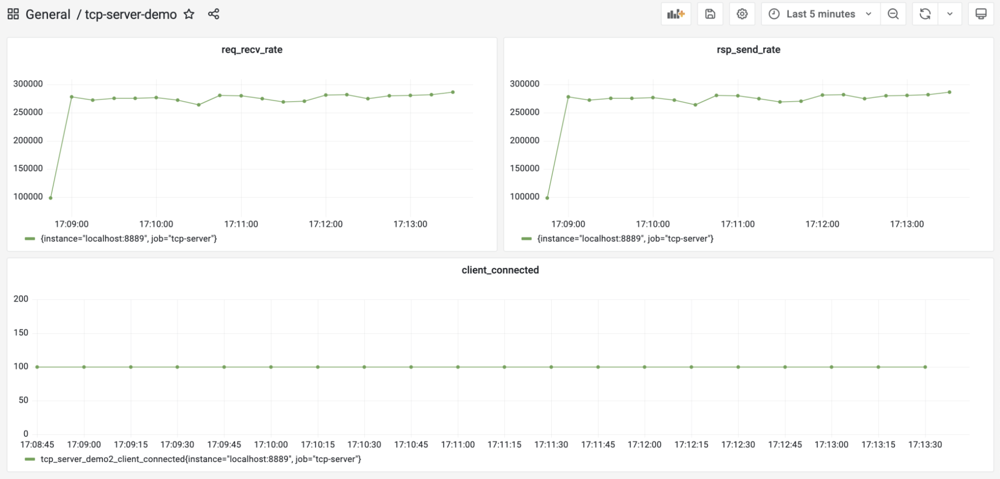

从图中可以看到，优化后的服务端的处理性能提升到 27w/s 左右，相比于第一版性能基准 (18.5w/s)，性能提升了足有 45%。 

#### 重用内存对象

前面这个带缓存的网络 I/O，是从 CPU 性能采样数据中找到的“瓶颈点”。不过，在 Go 中还有另外一个十分重要的性能指标，那就是**堆内存对象的分配**。

因为 Go 是带有垃圾回收（GC）的语言，频繁的堆内存对象分配或分配较多，都会给 GC 带去较大压力，而 GC 的压力显然会转化为对 CPU 资源的消耗，从而挤压处理正常业务逻辑的 goroutine 的 CPU 时间。 

下面就来采集一下 tcp-server-demo2-with-pprof 目录下的 server 的内存分配采样数据，看看有没有值得优化的点。 

这次直接使用 go tool pprof 的命令行采集与交互模式。在启动 server 和 client 后， 手工执行下面命令进行内存分配采样数据的获取：

```sh
$go tool pprof http://192.168.10.18:6060/debug/pprof/allocs
Fetching profile over HTTP from http://192.168.10.18:6060/debug/pprof/allocs
Saved profile in /root/pprof/pprof.server.alloc_objects.alloc_space.inuse_obje
File: server
Type: alloc_space
Time: Jan 23, 2022 at 6:05pm (CST)
Entering interactive mode (type "help" for commands, "o" for options)

# self test
$go tool pprof http://127.0.0.1:6060/debug/pprof/allocs
```

数据获取到后，就可以**使用 go tool pprof 提供的命令行交互指令**，来查看各个函数的堆内存对象的分配情况，其中最常用的一个指令就是 top，执行 top 后，得到如下 结果：

```sh
(pprof) top
Showing nodes accounting for 134.01MB, 98.89% of 135.51MB total
Dropped 15 nodes (cum <= 0.68MB)
Showing top 10 nodes out of 24
      flat  flat%   sum%        cum   cum%
      42MB 30.99% 30.99%    49.50MB 36.53%  github.com/Kate-liu/GoBeginner/practiceproject/webtcpserver/webtcpservermetricspprof/packet.Decode
   34.50MB 25.46% 56.45%    34.50MB 25.46%  github.com/Kate-liu/GoBeginner/practiceproject/webtcpserver/webtcpservermetricspprof/frame.(*myFrameCodec).Decode
   24.50MB 18.08% 74.53%    24.50MB 18.08%  bytes.Join
      17MB 12.55% 87.08%       91MB 67.15%  main.handlePacket
    7.50MB  5.53% 92.61%     7.50MB  5.53%  github.com/Kate-liu/GoBeginner/practiceproject/webtcpserver/webtcpservermetricspprof/packet.(*Submit).Decode (inline)
    5.50MB  4.06% 96.67%     5.50MB  4.06%  encoding/binary.Write
       3MB  2.22% 98.89%        3MB  2.22%  runtime.allocm
         0     0% 98.89%     5.50MB  4.06%  github.com/Kate-liu/GoBeginner/practiceproject/webtcpserver/webtcpservermetricspprof/frame.(*myFrameCodec).Encode
         0     0% 98.89%    13.50MB  9.96%  github.com/Kate-liu/GoBeginner/practiceproject/webtcpserver/webtcpservermetricspprof/packet.(*SubmitAck).Encode
         0     0% 98.89%    24.50MB 18.08%  github.com/Kate-liu/GoBeginner/practiceproject/webtcpserver/webtcpservermetricspprof/packet.Encode
```

top 命令的输出结果默认按flat(flat%)列从大到小的顺序输出。flat列的值在不同采样类型下表示的含义略有不同。 

在 CPU 类型采样数据下，它表示函数自身代码在数据采样过程的执行时长；在上面的堆内存分配类型采样数据下，它表示在采用过程中，某个函数中堆内存分配大小的和。而 flat%列的值表示这个函数堆内存分配大小占堆内存总分配大小的比例。 

从上面的输出结果来看，packet.Decode 函数排在第一位。那么，现在就来深入探究 一下 Decode 函数中究竟哪一行代码分配的堆内存量最大。

使用 list 命令可以进一步进入 Decode 函数的源码中查看：

```sh
(pprof) list packet.Decode
Total: 135.51MB
ROUTINE ======================== github.com/Kate-liu/GoBeginner/practiceproject/webtcpserver/webtcpservermetricspprof/packet.Decode in /Users/rmliu/workspace/golang/src/github.com/Kate-liu/GoBeginner/practiceproject/webtcpserver/webtcpservermetricspprof/packet/packet.go
      42MB    49.50MB (flat, cum) 36.53% of Total
         .          .     57:   case CommandConn:
         .          .     58:           return nil, nil
         .          .     59:   case CommandConnAck:
         .          .     60:           return nil, nil
         .          .     61:   case CommandSubmit:
      42MB       42MB     62:           s := Submit{}
         .     7.50MB     63:           err := s.Decode(pktBody)
         .          .     64:           if err != nil {
         .          .     65:                   return nil, err
         .          .     66:           }
         .          .     67:           return &s, nil
         .          .     68:   case CommandSubmitAck:
(pprof)
```

可以看到，s := Submit{}这一行是分配内存的“大户”，每次服务端收到一个客户端 submit 请求时，都会在堆上分配一块内存表示 Submit 类型的实例。

这个在程序关键路径上的堆内存对象分配会给 GC 带去压力，要尽量避免或减小它的分配频度，一个可行的办法是尽量重用对象。 

在 Go 中，一提到重用内存对象，就会想到了 sync.Pool。

简单来说，sync.Pool 就是官方实现的一个可复用的内存对象池，使用 sync.Pool，可以减少堆对象分配的频度，进而降低给 GC 带去的压力。 

继续在 tcp-server-demo3 的基础上，使用 sync.Pool 进行堆内存对象分配的优化， 新版的代码放在了 tcp-server-demo3-with-syncpool 中。 

新版代码相对于 tcp-server-demo3 有两处改动，第一处是在 packet.go 中，创建了 一个 SubmitPool 变量，它的类型为 sync.Pool，这就是内存对象池，池中的对象都是 Submit。

这样在 packet.Decode 中收到 Submit 类型请求时，也不需要新分配一个 Submit 对象，而是直接从 SubmitPool 代表的 Pool 池中取出一个复用。这些代码变更如下：

```go
// tcp-server-demo3-with-syncpool/packet/packet.go
var SubmitPool = sync.Pool{
	New: func() interface{} {
		return &Submit{}
	},
}

func Decode(packet []byte) (Packet, error) {
	commandID := packet[0]
	pktBody := packet[1:]
	switch commandID {
	case CommandConn:
		return nil, nil
	case CommandConnAck:
		return nil, nil
	case CommandSubmit:
		s := SubmitPool.Get().(*Submit) // 从SubmitPool池中获取一个Submit内存对象
		err := s.Decode(pktBody)
		if err != nil {
			return nil, err
		}
		return s, nil
	case CommandSubmitAck:
		s := SubmitAck{}
		err := s.Decode(pktBody)
		if err != nil {
			return nil, err
		}
		return &s, nil
	default:
		return nil, fmt.Errorf("unknown commandID [%d]", commandID)
	}
}
```

第二处变更是在 Submit 对象用完后，归还回 Pool 池，最理想的“归还地点”是在 main 包的 handlePacket 函数中，这里处理完 Submit 消息后，Submit 对象就没有什么用了， 于是在这里将其归还给 Pool 池，代码如下：

```go
// tcp-server-demo3-with-syncpool/cmd/server/main.go
func handlePacket(framePayload []byte) (ackFramePayload []byte, err error) {
	var p packet.Packet
	p, err = packet.Decode(framePayload)
	if err != nil {
		fmt.Println("handleConn: packet decode error:", err)
		return
	}
	
	switch p.(type) {
	case *packet.Submit:
		submit := p.(*packet.Submit)
		submitAck := &packet.SubmitAck{
			ID:     submit.ID,
			Result: 0,
		}
		packet.SubmitPool.Put(submit) // 将submit对象归还给Pool池
		ackFramePayload, err = packet.Encode(submitAck)
		if err != nil {
			fmt.Println("handleConn: packet encode error:", err)
			return nil, err
		}
		return ackFramePayload, nil
	default:
		return nil, fmt.Errorf("unknown packet type")
	}
}
```

改完这两处后，内存分配优化就完成了。

和前面一样，构建一下 tcp-server-demo3-with-syncpool 目录下的服务端，并使用客户端对其进行一次压测，压测几分钟后，就能看到如下的结果：

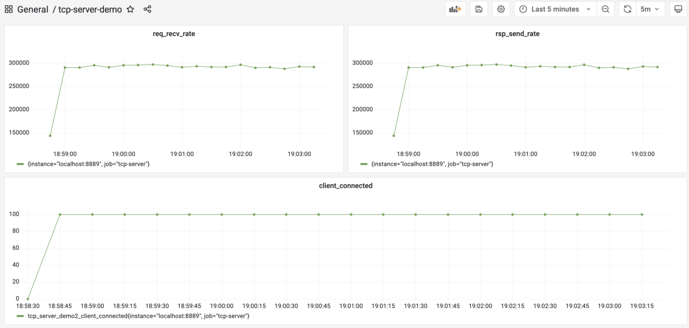

从采集的性能指标来看，优化后的服务端的处理能力平均可以达到 29.2w/s，这相比于上一次优化后的 27w/s，又小幅提升了 8% 左右。 

到这里，按照性能优化循环，已经完成了一轮优化，并且取得了不错的效果，现在可以将最新的性能指标作为新一版的性能基准了。 

至于是否要继续新一轮的优化，这就要看当前的性能是否能满足要求了。如果满足， 就不需再进行新的优化，否则还需要继续一轮或几轮优化活动，直到性能满足要求。 

### 小结

讲解了如何针对实现的第一版服务端进行优化。

给出了 Go 程序优化的四步循环方法，这四步依次是建立性能基准、性能剖析、代码优化和与性能基准比较，确定优化效果。

如果经过一轮优化，Go 应用的性能仍然无法达到要求，那么还可以按这个循环，进行多轮优化。

建立性能基准是整个优化过程的前提，基准提供了性能优化的起点与参照物。

而建立性能基准的前提又是建立观测设施。观测设施的建立方法有很多，这里基于 Prometheus+Grafana 的组合，实现了一个可视化的观测平台。基于这个平台，为第一版服务端实现建立了性能基准。 

另外，剖析 Go 应用性能有很多工具，而 Gopher 的最爱依然是 Go 原生提供的 pprof， 可以以图形化的形式或命令行的方式，收集和展示获取到的采样数据。

针对服务端程序，进行了带缓冲的网络 I/O 以及重用内存对象的优化，取得了很不错的效果。 


