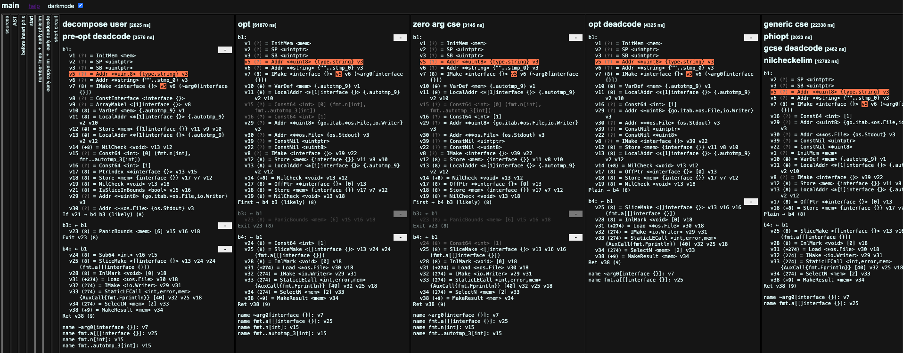
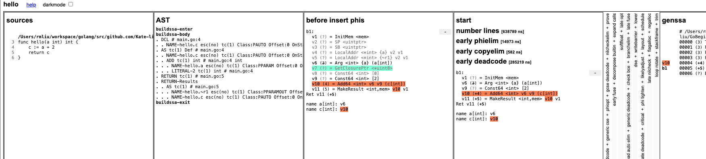

# Tools

> 提供常用的命令行工具。

## 代码统计工具 CLOC

CLOC(Count Lines of Code)，是一个可以统计多种编程语言中空行、评论行和物理行的工具。这个工具还是蛮实用的，可以帮我们快速了解一个项目中代码的信息。

### windows 10

win10下可以去github上下载其最新版，截止本文时，最新版为1.8.0。下载[链接](https://github.com/AlDanial/cloc/releases)。

### linux mac下安装

在linux下安装就简单的多了，使用你的发行版的包管理器下载安装即可。

```sh
# mac安装Homebrew后
brew install cloc
# ubuntu debian deepin mint等
sudo apt install cloc
# arch manjaro等
sudo pacman -S cloc 
# 或者
sudo yaourt -S cloc
# redhat centOS 
sudo yun install cloc
# Fedora 
sudo dnf install cloc
# ipv6可用时
sudo dnf -6 install cloc
```


### 使用

在命令输入下面命令即可：

```sh
$ cloc src/
    5688 text files.
    5552 unique files.
     930 files ignored.

github.com/AlDanial/cloc v 1.88  T=20.85 s (228.5 files/s, 96147.2 lines/s)
```


## Go 命令行工具

### 获取汇编指令的优化过程 SSA

如果想要了解 Go 语言更详细的编译过程，可以通过下面的命令获取汇编指令的优化过程。

```sh
$GOSSAFUNC=main go1.17 build main.go
# runtime
dumped SSA to /Users/rmliu/workspace/golang/src/github.com/Kate-liu/GoBeginner/helloworld/main/ssa.html
# command-line-arguments
dumped SSA to ./ssa.html
```

上述命令会在当前文件夹下生成一个 `ssa.html` 文件，打开这个文件后就能看到汇编代码优化的每一个步骤：



上述 HTML 文件是**可以交互**的，当点击网页上的汇编指令时，页面会使用相同的颜色在 SSA 中间代码生成的不同阶段标识出相关的代码行，更方便开发者分析编译优化的过程。



上述文件中包含源代码对应的抽象语法树、几十个版本的中间代码以及最终生成的 SSA，在这里截取文件的一部分让读者简单了解该文件的内容：

如上图所示，其中最左侧就是源代码，中间是源代码生成的抽象语法树，最右侧是生成的第一轮中间代码，后面还有几十轮。

`hello` 函数对应的**抽象语法树**会包含当前函数的 `Enter`、`NBody` 和 `Exit` 三个属性

上述图片中生成SSA需要经历多轮的处理，其都存在这里（src/cmd/compile/internal/ssa/compile.go:427（var passes = [...]pass{....}））passes 变量中，目前的编译器总共引入了将近 50 个需要执行的过程，我们能在 `GOSSAFUNC=main go1.17 build main.go` 命令生成的文件中看到每一轮处理后的中间代码，例如最后一个 `trim` 阶段。

**SSA 降级**是在中间代码生成的过程中完成的，其中将近 50 轮处理的过程中，`lower` 以及后面的阶段都属于 SSA 降级这一过程，这么多轮的处理会将 SSA 转换成机器特定的操作。


### Go 代码转换为汇编代码

使用下面的命令，可以在当前文件生成汇编代码。

其中main.s文件中是原go程序的汇编，可以根据(main.go:24)的行号，来对照原文件查找转换后的汇编代码。

参考链接：A Quick Guide to Go's Assembler：https://go.dev/doc/asm

```sh
$go tool compile -S main.go > main.s
 
$ls -al
total 120
drwxr-xr-x   5 rmliu  staff    160 Jan  4 19:51 .
drwxr-xr-x  15 rmliu  staff    480 Jan  4 19:51 ..
-rw-r--r--   1 rmliu  staff    308 Jan  4 19:50 main.go
-rw-r--r--   1 rmliu  staff  17826 Jan  4 19:51 main.o
-rw-r--r--   1 rmliu  staff  36214 Jan  4 19:51 main.s

# 或者使用这条命令
$GOOS=linux GOARCH=amd64 go tool compile -S hello.go
"".hello STEXT nosplit size=5 args=0x8 locals=0x0 funcid=0x0
        0x0000 00000 (main.go:3)        TEXT    "".hello(SB), NOSPLIT|ABIInternal, $0-8
        0x0000 00000 (main.go:3)        FUNCDATA        $0, gclocals·33cdeccccebe80329f1fdbee7f5874cb(SB)
        0x0000 00000 (main.go:3)        FUNCDATA        $1, gclocals·33cdeccccebe80329f1fdbee7f5874cb(SB)
        0x0000 00000 (main.go:3)        FUNCDATA        $5, "".hello.arginfo1(SB)
        0x0000 00000 (main.go:4)        ADDQ    $2, AX
        0x0004 00004 (main.go:5)        RET
        0x0000 48 83 c0 02 c3                                   H....
go.cuinfo.packagename. SDWARFCUINFO dupok size=0
        0x0000 68 65 6c 6c 6f                                   hello
gclocals·33cdeccccebe80329f1fdbee7f5874cb SRODATA dupok size=8
        0x0000 01 00 00 00 00 00 00 00                          ........
"".hello.arginfo1 SRODATA static dupok size=3
        0x0000 00 08 ff                                         ...
        

# 或者使用这条命令
$go1.17 build -gcflags -S main.go 
# command-line-arguments
"".main STEXT size=103 args=0x0 locals=0x40 funcid=0x0
...
gclocals·1a65e721a2ccc325b382662e7ffee780 SRODATA dupok size=10
        0x0000 02 00 00 00 01 00 00 00 01 00                    ..........
gclocals·69c1753bd5f81501d95132d08af04464 SRODATA dupok size=8
        0x0000 02 00 00 00 00 00 00 00                          ........
os.(*File).close.arginfo1 SRODATA static dupok size=3
        0x0000 00 08 ff                                         ...

```


### Go 语言的汇编器

汇编器是将汇编语言翻译为机器语言的程序，Go 语言的汇编器是基于 Plan 9 汇编器的输入类型设计的，官方对汇编器在不同处理器架构上的实现细节也没有明确定义：

> The details vary with architecture, and we apologize for the imprecision; the situation is **not well-defined**.

参考链接：**A Manual for the Plan 9 assembler**：https://9p.io/sys/doc/asm.html


## mac 命令行工具

### 获得当前机器的硬件信息

在命令行中输入 `uname -m` 就能获得当前机器的硬件信息：

```sh
$uname -m
x86_64
```

x86 是目前比较常见的指令集，除了 x86 之外，还有 arm 等指令集，苹果最新 Macbook 的自研芯片就使用了 arm 指令集，不同的处理器使用了不同的架构和机器语言，所以很多编程语言为了在不同的机器上运行需要将源代码根据架构翻译成不同的机器代码。

复杂指令集计算机（CISC）和精简指令集计算机（RISC）是两种遵循不同设计理念的指令集，从名字就可以推测出这两种指令集的区别：

- 复杂指令集：通过增加指令的类型减少需要执行的指令数；
- 精简指令集：使用更少的指令类型完成目标的计算任务；

早期的 CPU 为了减少机器语言指令的数量一般使用复杂指令集完成计算任务，这两者并没有绝对的优劣，它们只是在一些设计上的选择不同以达到不同的目的

Go 语言源代码的 [`src/cmd/compile/internal`](https://github.com/golang/go/tree/master/src/cmd/compile/internal) 目录中包含了很多**机器码生成相关的包**，不同类型的 CPU 分别使用了不同的包生成机器码，其中包括 amd64、arm、arm64、mips、mips64、ppc64、s390x、x86 和 wasm，其中比较有趣的就是 [WebAssembly](https://webassembly.org/)（Wasm）了。

作为一种在栈虚拟机上使用的二进制指令格式，它的设计的主要目标就是在 Web 浏览器上提供一种具有高可移植性的目标语言。Go 语言的编译器既然能够生成 Wasm 格式的指令，那么就能够运行在常见的主流浏览器中。

```bash
$ GOARCH=wasm GOOS=js go1.17 build -o lib.wasm main.go
```

可以使用上述的命令将 Go 的源代码编译成能够在浏览器上运行 WebAssembly 文件，当然除了这种新兴的二进制指令格式之外，Go 语言经过编译还可以运行在几乎全部的主流机器上，不过它的兼容性在除 Linux 和 Darwin 之外的机器上可能还有一些问题，例如：Go Plugin 至今仍然不支持 [Windows](https://github.com/golang/go/issues/19282)。


## Git 命令行工具

### 切换项目版本命令

```sh
$git checkout go1.3 // 切换到go 1.3版本

# 使用 checkout 进行版本的切换
```


## lex 实现词法分析器

[lex](http://dinosaur.compilertools.net/lex/index.html)是用于生成词法分析器的工具，lex 生成的代码能够将一个文件中的字符分解成 Token 序列，很多语言在设计早期都会使用它快速设计出原型。词法分析作为具有固定模式的任务，出现这种更抽象的工具必然的，lex 作为一个代码生成器，使用了类似 C 语言的语法，将 lex 理解为正则匹配的生成器，它会使用正则匹配扫描输入的字符流，下面是一个 lex 文件的示例：

```c
// simplego.l 文件
%{
#include <stdio.h>
%}

%%
package      printf("PACKAGE ");
import       printf("IMPORT ");
\.           printf("DOT ");
\{           printf("LBRACE ");
\}           printf("RBRACE ");
\(           printf("LPAREN ");
\)           printf("RPAREN ");
\"           printf("QUOTE ");
\n           printf("\n");
[0-9]+       printf("NUMBER ");
[a-zA-Z_]+   printf("IDENT ");
%%
```

这个定义好的文件能够解析 `package` 和 `import` 关键字、常见的特殊字符、数字以及标识符，虽然这里的规则可能有一些简陋和不完善，但是用来解析下面的这一段代码还是比较轻松的：

```go
// main.go 文件
package main

import (
  "fmt"
)

func main() {
  fmt.Println("Hello")
}
```

`.l` 结尾的 lex 代码并不能直接运行，首先需要通过 `lex` 命令将上面的 `simplego.l` 展开成 C 语言代码，这里可以直接执行如下所示的命令编译并打印文件中的内容：

```c
$ lex simplego.l  // 会生成lex.yy.c的新文件
$ cat lex.yy.c
...
int yylex (void) {
  ...
  while ( 1 ) {
    ...
yy_match:
    do {
      register YY_CHAR yy_c = yy_ec[YY_SC_TO_UI(*yy_cp)];
      if ( yy_accept[yy_current_state] ) {
        (yy_last_accepting_state) = yy_current_state;
        (yy_last_accepting_cpos) = yy_cp;
      }
      while ( yy_chk[yy_base[yy_current_state] + yy_c] != yy_current_state ) {
        yy_current_state = (int) yy_def[yy_current_state];
        if ( yy_current_state >= 30 )
          yy_c = yy_meta[(unsigned int) yy_c];
        }
      yy_current_state = yy_nxt[yy_base[yy_current_state] + (unsigned int) yy_c];
      ++yy_cp;
    } while ( yy_base[yy_current_state] != 37 );
    ...

do_action:
    switch ( yy_act )
      case 0:
          ...

      case 1:
          YY_RULE_SETUP
          printf("PACKAGE ");
          YY_BREAK
      ...
}
```

`lex.yy.c` 的前 600 行基本都是宏和函数的声明和定义，后面生成的代码大都是为 `yylex` 这个函数服务的，这个函数使用[有限自动机（Deterministic Finite Automaton、DFA）](https://en.wikipedia.org/wiki/Deterministic_finite_automaton)的程序结构来分析输入的字符流，上述代码中 `while` 循环就是这个有限自动机的主体，如果仔细看这个文件生成的代码会发现当前的文件中并不存在 `main` 函数，`main` 函数是在 liblex 库中定义的，所以在编译时其实需要添加额外的 `-ll` 选项：

```sh
$ cc lex.yy.c -o simplego -ll  # 此时会生成一个 simplego 的二进制文件
$ cat main.go | ./simplego
```

将 C 语言代码通过 gcc 编译成二进制代码之后，就可以使用管道将上面提到的 Go 语言代码作为输入传递到生成的词法分析器中，这个词法分析器会打印出如下的内容：

```go
PACKAGE  IDENT

IMPORT  LPAREN
  QUOTE IDENT QUOTE
RPAREN

IDENT  IDENT LPAREN RPAREN  LBRACE
  IDENT DOT IDENT LPAREN QUOTE IDENT QUOTE RPAREN
RBRACE
```

从上面的输出能够看到 Go 源代码的影子，lex 生成的词法分析器 lexer 通过正则匹配的方式将机器原本很难理解的字符串进行分解成很多的 Token，有利于后面的处理。

到这里已经展示了从定义 `.l` 文件、使用 lex 将 `.l` 文件编译成 C 语言代码以及二进制的全过程，而最后生成的词法分析器也能够将简单的 Go 语言代码进行转换成 Token 序列。


