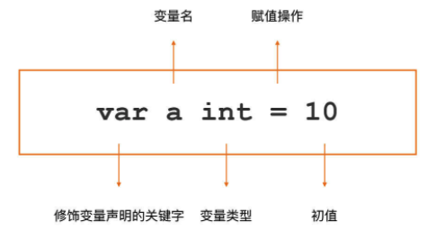
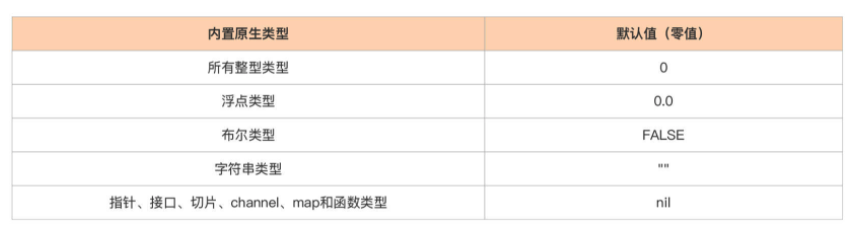
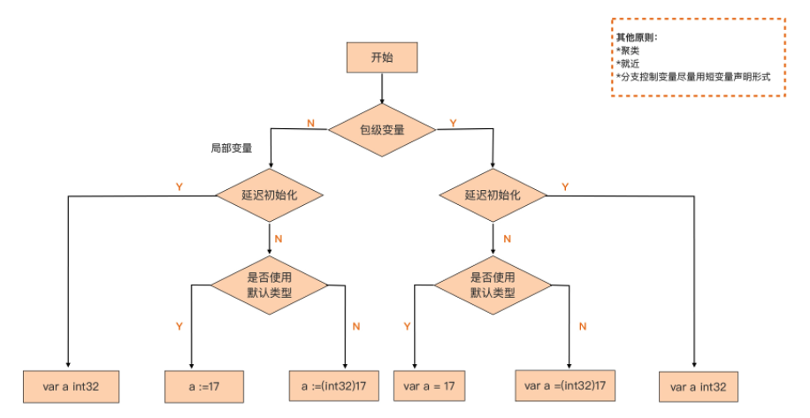

# Variable Declaration

> 深入 Go 语法细节，学习静态语言有别于动态语言的一个重要特征：变量声明。

## 变量的概念

那么变量声明究竟解决的是什么问题呢？

先从**变量**这个概念说起。 

在编程语言中，为了方便操作内存特定位置的数据，用一个特定的名字与位于特定位置的内存块绑定在一起，这个名字被称为变量。 

但这并不代表可以通过变量随意引用或修改内存，变量所绑定的内存区域是要有一个**明确的边界**的。

也就是说，通过这样一个变量，究竟可以操作 4 个字节内存还是 8 个字节内存，又或是 256 个字节内存，编程语言的编译器或解释器需要明确地知道。

那么，编程语言的编译器或解释器是如何知道一个变量所能引用的内存区域边界呢？ 

其实，动态语言和静态语言有不同的处理方式。

- **动态语言**（比如 Python、Ruby 等）的解释器可以在运行时通过对变量赋值的分析，自动确定变量的边界。并且在动态语言中，一个变量可以在运行时被赋予大小不同的边界。 
- 而**静态编程语言**在这方面的“体验略差”。静态类型语言编译器必须明确知道一个变量的 边界才允许使用这个变量，但静态语言编译器又没能力自动提供这个信息，这个边界信息必须由这门语言的使用者提供，于是就有了“变量声明”。

通过变量声明，语言使用者可以显式告知编译器一个变量的边界信息。在具体实现层面呢，这个边界信息由变量的类型属性赋予。 

作为身处静态编程语言阵营的 Go 语言，它沿袭了静态语言的这一要求：使用变量之前需要先进行变量声明。 


## Go 语言的变量声明方法

Go 是静态语言，所有变量在使用前必须先进行声明。

声明的意义在于告诉编译器该变量可以操作的内存的边界信息，而这种边界通常又是由变量的类型信息提供的。 

### 通用的变量声明方法

在 Go 语言中，有一个通用的变量声明方法是这样的：



这个变量声明分为四个部分：

- var 是修饰变量声明的关键字； 
- a 为变量名； 
- int 为该变量的类型； 
- 10 是变量的初值。

其实 Go 语言的变量声明形式与其他主流静态语言有一个显著的差异，那就是它将变量名放在了类型的前面。

这个类型为变量提供了边界信息，在 Go 语言中，无论什么类型的变量，都可以使用这种形式进行变量声明。 

### 默认赋予类型零值

但是，如果没有显式为变量赋予初值，Go 编译器会为变量赋予这个类型的**零值**：

```go
var a int  // a的初值为int类型的零值：0
```

什么是类型的零值呢？

Go 语言的每种原生类型都有它的默认值，这个默认值就是这个类型的零值。

这里给出 Go 规范定义的**内置原生类型的 默认值**（即零值）：



另外，像数组、结构体这样复合类型变量的零值就是它们组成元素都为零值时的结果。 

### 变量声明块（block）

除了单独声明每个变量外，Go 语言还提供了变量声明块（block）的语法形式，可以用一 个 var 关键字将多个变量声明放在一起，像下面代码这样：

```go
// 变量声明块
var (
   c int    = 128
   d int8   = 6
   e string = "hello"
   f rune   = 'A'
   g bool   = true
)
```

在这个变量声明块中，通过一个 var 关键字声明了 5 个不同类型的变量。

而且， Go 语言还支持在一行变量声明中同时声明多个变量：

```go
// 变量声明块(一行实现方式)
var h, i, j int = 6, 7, 8
```

这样的多变量声明同样也可以用在变量声明块中，像下面这样：

```go
// 变量声明块(一行变量声明实现方式)
var (
   k, l, m int  = 7, 8, 9
   n, o, p rune = 'B', 'C', 'D'
)
```

当然了，虽然现在写的多变量声明都是在声明同一类型的变量，但是它也适用于声明不同类型的变量。 

除了上面这种通用的变量声明形式，为了给开发者带来更好的使用体验，Go 语言还提供了 两种变量声明的“语法糖”。


## 变量声明的“语法糖”

### 省略类型信息的声明

在通用的变量声明的基础上，Go 编译器允许省略变量声明中的类型信息，它的标准范式是“var varName = initExpression”，比如下面就是一个省略了类型信息的变量声明：

```go
// 省略类型信息的声明
var q = 13
```

那么 Go 编译器在遇到这样的变量声明后是如何确定变量的类型信息呢？ 

其实很简单，Go 编译器会**根据右侧变量初值自动推导出变量的类型**，并给这个变量赋予初值所对应的默认类型。

- 比如，整型值的默认类型 int，
- 浮点值的默认类型为 float64，
- 复数值的默认类型为 complex128。

其他类型值的默认类型就更好分辨了，在 Go 语言中仅有唯一与之对应的类型，

- 比如布尔值的默认类型只能是 bool，
- 字符值默认类型只能是 rune，
- 字符串值的默认类型只能是 string 等。 

如果不接受默认类型，而是要显式地为变量指定类型，除了通用的声明形式，还可以通过**显式类型转型**达到目的：

```go
// 显示类型转型
var r = int32(61)
```

显然这种省略类型信息声明的“语法糖”仅适用于在变量声明的同时显式赋予变量初值的情况，下面这种没有初值的声明形式是不被允许的：

```go
// 没有初值的声明（不被允许）
var s
```

结合多变量声明，可以使用这种变量声明“语法糖”声明多个不同类型的变量：

```go
// 多变量声明 + 省略类型信息的声明
var t, u, v = 23, 'A', "world"
```

在这个变量声明中，声明了三个变量 t、u 和 v，但它们分别具有不同的类型，分别为 int、rune 和 string。 

在这种变量声明语法糖中，省去了变量类型信息，但 Go 编译器会为自动推导出类型信息。

那是否还有更简化的变量声明形式呢？答案是有的。下面就来看看短变量 声明。

### 短变量声明

其实，Go 语言还提供了最简化的变量声明形式：短变量声明。

使用短变量声明时， 甚至可以省去 var 关键字以及类型信息，它的标准范式是“varName := initExpression”。

这里也举了几个例子：

```go
// 短变量声明
w := 45
x := 'S'
y := "liu"
```

短变量声明将通用变量声明中的四个部分省去了两个，但它并没有使用赋 值操作符“=”，而是使用了短变量声明专用的“**:=**”。

这个原理和上一种省略类型信息的声明语法糖一样，短变量声明中的变量类型也是由 Go 编译器自动推导出来的。 

而且，短变量声明也支持一次声明多个变量，而且形式更为简洁，是这个样子的：

```go
// 短变量声明 + 一次声明多个变量
aa, bb, cc := 22, 'M', "ming"
```

不过呢，短变量声明的使用也是**有约束**的，并不是所有变量都能用短变量声明来声明的。 


## Go 语言的两类变量

通常来说，Go 语言的变量可以分为两类：

- 一类称为**包级变量 (package varible)**，也就是 在包级别可见的变量。如果是导出变量（大写字母开头），那么这个包级变量也可以被视 为全局变量；
- 另一类则是**局部变量 (local varible)**，也就是 Go 函数或方法体内声明的变 量，仅在函数或方法体内可见。

声明的所有变量都逃不开这两种。 


### 包级变量的声明形式 

首先，先下个结论：包级变量只能使用带有 var 关键字的变量声明形式，不能使用短变量声明形式，但在形式细节上可以有一定灵活度。

具体这个灵活度怎么去考虑呢？

可以从“变量声明时是否延迟初始化”这个角度，对包级变量的声明形式进行一次分类。 

#### 声明并同时显示初始化

第一类：声明并同时显式初始化。 

先看看这个代码：

```go
// io/io.go
var ErrShortWrite = errors.New("short write")
var ErrShortBuffer = errors.New("short buffer")
var EOF = errors.New("EOF")
```

这个代码块里声明的变量都是 io 包的包级变量。

在 Go 标准库中，对于变量声明的同时进行显式初始化的这类包级变量，实践中多使用这种省略类型信息的“语法糖”格式：

```go
var varName = initExpression
```

Go 编译器会自动根据等号右侧 InitExpression 结果值的类型，来确定左侧声明的变量的类型，这个类型会是结果值对应类型的默认类型。 

当然，如果不接受默认类型，而是要**显式地为包级变量指定类型**，那么有两种方 式，这里给出了两种包级变量的声明形式的对比示例。 

```go
//第一种：
var a = 13 // 使用默认类型
var b int32 = 17 // 显式指定类型
var f float32 = 3.14 // 显式指定类型

//第二种：(推荐使用)
var a = 13 // 使用默认类型
var b = int32(17) // 显式指定类型
var f = float32(3.14) // 显式指定类型
```

虽然这两种方式都是可以使用的，但从声明一致性的角度出发，Go 更推荐使用后者，这样能统一接受默认类型和显式指定类型这两种声明形式，尤其是在将这些变量放在一个 var 块中声明时，会更明显地看到这一点。 

所以更青睐下面这样的形式：

```go
// 变量声明块 + 显示类型转型 (推荐使用)
var (
   dd = 13
   ee = int32(34)
   ff = float32(3.24)
)
```

而不是下面这种看起来不一致的声明形式：

```go
// 不推荐使用
var (
   dd = 13
   ee int32 = 34
   ff float32 = 3.24
)
```

#### 声明但延迟初始化

第二类：声明但延迟初始化。 

对于声明时并不立即显式初始化的包级变量，可以使用下面这种通用变量声明形式：

```go
var a int32
var f float64
```

虽然没有显式初始化，Go 语言也会让这些变量拥有初始的“零值”。

如果是自定义的类型，也建议尽量保证它的零值是可用的。 

这里还有一个注意事项，就是**声明聚类**与**就近原则**。 

### 声明聚类

正好，Go 语言提供了变量声明块用来把多个的变量声明放在一起，并且在语法上也不会限制放置在 var 块中的声明类型，那就应该学会充分利用 var 变量声明块，让变量 声明更规整，更具可读性，现在就来试试看。 

通常，会将同一类的变量声明放在一个 var 变量声明块中，不同类的声明放在不同的 var 声明块中，比如下面就是从**标准库 net 包**中摘取的两段变量声明代码：

```go
// net/net.go
var (
   netGo  bool 
   netCgo bool 
)

var (
	aLongTimeAgo = time.Unix(1, 0)
	noDeadline = time.Time{}
	noCancel   = (chan struct{})(nil)
)
```

上面这两个 var 声明块各自声明了一类特定用途的包级变量。

其实，可以将延迟初始化的变量声明放在一个 var 声明块 (比如上面的第一个 var 声明块)，然后将声明且显式初始化的变量放在另一个 var 块中（比如上面的第二个 var 声明 块），这里称这种方式为“声明聚类”，声明聚类可以提升代码可读性。 

可能还会有一个问题：是否应该将包级变量的声明全部集中放在源文件头部呢？答案不能一概而论。 

### 就近原则

使用静态编程语言的开发人员都知道，变量声明最佳实践中还有一条：就近原则。

也就是说尽可能在靠近第一次使用变量的位置声明这个变量。就近原则实际上也是**对变量的作用域最小化**的一种实现手段。

在 Go 标准库中也很容易找到符合就近原则的变量声明的例子，比如下面这段**标准库 http 包**中的代码就是这样：

```go
// net/http/request.go
var ErrNoCookie = errors.New("http: named cookie not present")

func (r *Request) Cookie(name string) (*Cookie, error) {
   for _, c := range readCookies(r.Header, name) {
      return c, nil
   }
   return nil, ErrNoCookie
}
```

在这个代码块里，ErrNoCookie 这个变量在整个包中仅仅被用在了 Cookie 方法中，因此它被声明在紧邻 Cookie 方法定义的地方。

当然了，如果一个包级变量在包内部被多处使用，那么这个变量还是放在源文件头部声明比较适合的。


### 局部变量的声明形式 

和包级变量相比，局部变量又多了一种短变量声明形式，这是局部变量特有的一种变量声明形式，也是局部变量采用最多的一种声明形式。

这里也从“变量声明的时候是否延迟初始化”这个角度，对本地变量的声明形式进行 分类说明。 

#### 声明但延迟初始化

第一类：对于延迟初始化的局部变量声明，采用**通用的变量声明形式** 

其实，之前讲过的省略类型信息的声明和短变量声明这两种“语法糖”变量声明形式都不支持变量的延迟初始化，因此对于这类局部变量，和包级变量一样，只能采用通用的变量声明形式：

```go
var err error
```

#### 声明并同时显示初始化

第二类：对于声明且显式初始化的局部变量，建议使用**短变量声明形式** 

短变量声明形式是局部变量最常用的声明形式，它遍布在 Go 标准库代码中。

对于**接受默认类型的变量**，使用下面这种形式：

```go
a := 17
f := 3.14
s := "hello, gopher!"
```

对于**不接受默认类型的变量**，依然可以使用短变量声明形式，只是在":="右侧要做一个显式转型，以保持声明的一致性：

```go
a := int32(17)
f := float32(3.14)
s := []byte("hello, gopher!")
```

这里还要注意：**尽量在分支控制时使用短变量声明形式**。 

分支控制应该是 Go 中短变量声明形式应用得最广泛的场景了。

在编写 Go 代码时，很少单独声明用于分支控制语句中的变量，而是将它与 if、for 等控制语句通过短变量声明形式融合在一起，即**在控制语句中直接声明用于控制语句代码块中的变量**。 

看一下下面这个摘自 Go 标准库中的代码，**strings 包的 LastIndexAny 方法** 很好地诠释了如何将短变量声明形式与分支控制语句融合在一起使用：

```go
// strings/strings.go
func LastIndexAny(s, chars string) int {
   if chars == "" {
      // Avoid scanning all of s.
      return -1
   }
   // ...  
   if len(s) > 8 {
      // 作者注：在if条件控制语句中使用短变量声明形式声明了if代码块中要使用的变量as和isASCII
      if as, isASCII := makeASCIISet(chars); isASCII {
         for i := len(s) - 1; i >= 0; i-- {
            if as.contains(s[i]) {
               return i
            }
         }
         return -1
      }
   }
   // ...
   for i := len(s); i > 0; {
      // 作者注：在for循环控制语句中使用短变量声明形式声明了for代码块中要使用的变量i
      r, size := utf8.DecodeLastRuneInString(s[:i])
      i -= size
      if IndexRune(chars, r) >= 0 {
         return i
      }
   }
   return -1
}
```

而且，短变量声明的这种融合的使用方式也体现出**“就近”原则**，让变量的作用域最小化。 

另外，虽然良好的函数 / 方法设计都讲究“单一职责”，所以每个函数 / 方法规模都不大，很少需要应用 **var 块来聚类声明局部变量**，但是如果在声明局部变量时遇到了适合聚类的应用场景，也应该毫不犹豫地使用 var 声明块来声明多于一个的局部变量，具体写法可以参考 **Go 标准库 net 包中 resolveAddrList 方法**：

```go
// net/dial.go
func (r *Resolver) resolveAddrList(ctx context.Context, op, network, addr string, hint Addr) (addrList, error) {
   // ...
   var (
      tcp      *TCPAddr
      udp      *UDPAddr
      ip       *IPAddr
      wildcard bool
   )
  // ...
}
```


## 小结 

Go 语言提供了一种通用变量声明形式以及两种变量声明“语法糖”形式，而且 Go 包级变量和局部变量会根据具体情况选择不同的变量声明形式，这里用一幅图来做个形象化的小结：



良好的变量声明实践需要考虑多方面因素，包括明确要声明的变量是包级变量还是局部变量、是否要延迟初始化、是否接受默认类型、是否是分支控制变量并结合聚类和就近原则等。 

说起来，Go 语言崇尚“做一件事只用一种方法”，但变量声明却似乎是一个例外。如果让 Go 语言的设计者重新来设计一次变量声明语法，很大可能不会给予开发们这么大的变量声明灵活性。

作为开发者，要注意的是，在统一项目范围内，选择的变量声明的形式应该是一致的。


## 思考题

与主流静态语言不同，在 Go 语言变量声明中，类型是放在变量名的后面的，这样做有什么好处？

- https://blog.go-zh.org/gos-declaration-syntax 
- 官方有给出解释，原因简单来说就是和 C相比，在当参数是指针的复杂情况下，这种声明格式会相对好理解一点，链接里面有详细解释


